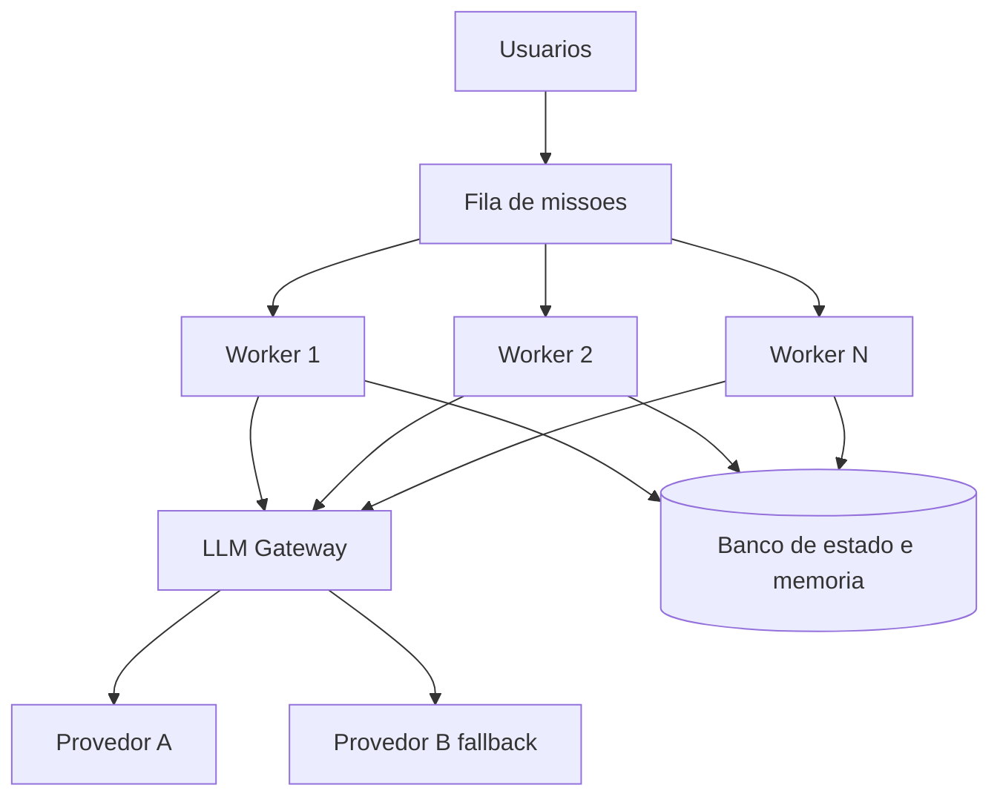
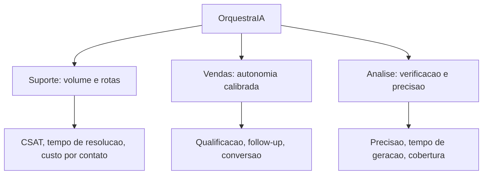
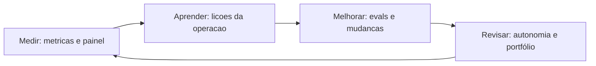
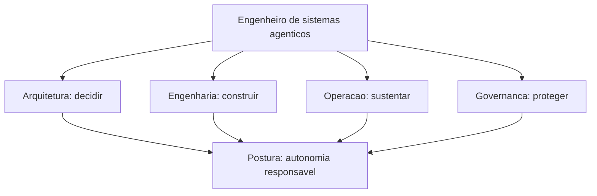

# Implantação e Operação Contínua

# Capítulo 1: Capítulo 17: Implantando o OrquestraIA em produção

## Introdução

O OrquestraIA está completo: loop, contexto, memória, ferramentas, orquestrador, evals, segurança, supervisão e observabilidade. Este capítulo cruza a fronteira que separa o protótipo do sistema: a **implantação em produção** — os LLM gateways, o fallback, a escalabilidade, o gerenciamento de segredos e o CI/CD de agentes. É aqui que o sistema deixa de rodar na sua máquina e passa a atender tráfego real, com disponibilidade, custo controlado e capacidade de voltar atrás quando algo der errado [20][31].

A infraestrutura de produção de agentes amadureceu: os **LLM gateways** — a camada que centraliza as chamadas aos modelos com roteamento, fallback, cache, rate limiting e observação de custo — viraram peça padrão da arquitetura, com comparativos dedicados no mercado [31][32][20]. O CI/CD de agentes — o pipeline que roda os


evals, valida os prompts e promove as mudanças — é a prática que conecta a disciplina de avaliação do Capítulo 13 ao fluxo de implantação [4]. E a escalabilidade — filas, workers, estado distribuído — é o que transforma um agente que atende um cliente em um que atende milhares [20].

Ao final deste capítulo, você será capaz de implantar o OrquestraIA em produção: configurar o gateway com roteamento e fallback de modelos, proteger os segredos, escalar o serviço com filas e workers, e montar o pipeline de CI/CD que roda os evals e promove as mudanças com segurança — o fechamento da jornada que culmina no deploy do Capítulo 18.

## Explica

### O LLM Gateway: A Camada Central das Chamadas

O gateway de LLM é o ponto único por onde passam todas as chamadas aos modelos — e por isso é o lugar certo para a infraestrutura transversal [31][32][20]: **roteamento** (qual modelo atende qual chamada — o modelo pequeno para tarefas simples, o grande para as complexas, o Capítulo 16), **fallback** (se o provedor principal falha ou


degrada, a chamada vai para o alternativo — a disponibilidade), **cache** (respostas repetidas não pagam duas vezes — a economia), **rate limiting e orçamento** (o teto por cliente, por período — o controle), **observação** (tokens, custo, latência por chamada — o Capítulo 16) e **segurança** (a chave única no gateway, nunca nos clientes — o Capítulo 11).

Os comparativos de gateway mostram o espectro: de soluções leves a plataformas completas, a escolha depende do tamanho do sistema e das exigências — mas a decisão de **ter um gateway** é menos discutível que a de qual: a centralização da camada de LLM é o padrão recomendado para qualquer sistema em produção [31][32][20].

### Fallback: A Disponibilidade do Sistema

O fallback é a resposta à pergunta "e se o provedor cair?" — e em sistemas agênticos a resposta é mais crítica que em chatbots: a missão em andamento depende da chamada seguinte, e uma falha no meio do loop é uma missão interrompida [31][20]. As três camadas do fallback: **modelo alternativo**


(o provedor B assume a chamada que o A não atendeu), **modo degradado** (a tarefa continua com capacidades reduzidas — o agente informa que está em modo limitado), e **fila e retry** (a missão entra na fila e tenta de novo com backoff — a disciplina do Capítulo 2 aplicada à infraestrutura).

### Escalabilidade: De Um Cliente a Milhares

A escalabilidade do agente tem dois eixos [20]: **concorrência** (muitas missões ao mesmo tempo — o serviço precisa de workers paralelos, e o LLM é o gargalo: a fila equilibra a carga e o cache reduz as chamadas repetidas) e **estado distribuído** (a memória e o rastreio deixam de ser locais — o banco compartilhado do Capítulo 6 vira a memória do sistema inteiro). A prática recomendada: **stateless no worker, stateful no banco** — os workers não guardam estado; o estado vive no banco e na memória compartilhada.

### CI/CD de Agentes: O Pipeline de Mudanças

O CI/CD de agentes é o pipeline que torna cada mudança uma decisão medida [4]: o **CI** roda os evals (Capítulo 13) a cada mudança de prompt, contexto ou código — a regressão bloqueia o merge; o **CD** promove a mudança com deploy gradual — primeiro um percentual


pequeno do tráfego, com monitoramento (Capítulo 16), depois o total, com rollback automático se as métricas degradam. A diferença do CI/CD tradicional: o artefato não é só código — é **configuração de agente** (prompts, contratos, políticas), e o teste não é só unitário — é o golden set [4].

## Ilustra

### A Cozinha Industrial e o Fornecedor de Ingredientes

O gateway de LLM é a cozinha industrial com contrato único de fornecedor. A cozinha não negocia com cada mercado (cada provedor) — ela tem **um ponto de compra** (o gateway): o chef pede "2 kg de tomate" (a chamada), e a cozinha decide de qual


fornecedor comprar hoje, com preço, entrega e qualidade (o roteamento e o fallback). Se o fornecedor principal falha, a cozinha troca na hora sem interromper o serviço (o fallback). E o estoque (o cache) evita comprar o mesmo ingrediente duas vezes para o mesmo prato [31][32].



### A Analogia do Restaurante com Reservas

Uma segunda lente: o restaurante popular com fila de reservas. Sem a fila (a fila de missões), os clientes disputam as mesas na chegada — o caos com pico de demanda (a concorrência). Com a fila, cada cliente espera sua vez, as mesas (os workers) trabalham o tempo todo, e o cardápio (o cache) acelera os pedidos repetidos. E o


gerente (o gateway) negocia com os fornecedores (os provedores) para manter o preço e a qualidade — se um fornecedor falha, o outro assume o cardápio do dia. O restaurante que escala não é o que tem mais mesas: é o que tem fila, gerência de fornecedores e processo — a mesma lição do sistema de agentes em produção [20].

## Técnica

### O Gateway com Roteamento e Fallback

Vamos implementar o gateway do OrquestraIA — a camada central com roteamento, fallback e medição de custo:

```python
# gateway_llm.py — roteamento, fallback, cache e medicao
import os, time, hashlib

class GatewayLLM:
    """Ponto unico de chamadas ao LLM: roteia, cai para fallback, cacheia."""
    def __init__(self, provedores: dict, cache: dict = None):
        self.provedores = provedores  # {nome: {"client": callable, "modelo": str}}
        self.cache = cache or {}      # cache simples chave -> resposta
        self.metricas = {"chamadas": 0, "fallbacks": 0, "cache_hits": 0,
                         "tokens_total": 0}

def _chave_cache(self, modelo: str, mensagens: list) -> str:
        return hashlib.md5((modelo + str(mensagens)).encode()).hexdigest()

def chamar(self, mensagens: list, modelo: str = "", tarefa: str = "padrao") -> str: """Chama com roteamento por tarefa e fallback automatico.""" rota = self.provedores.get(tarefa, self.provedores.get("padrao")) modelo_alvo = modelo or rota["modelo"] chave = self._chave_cache(modelo_alvo, mensagens) if chave in self.cache: self.metricas["cache_hits"] += 1 return self.cache[chave] # tentativa principal + fallback ordem = [rota] + [p for


n, p in self.provedores.items() if n != tarefa and n != "padrao"] for provedor in ordem[:2]: # principal e um fallback try: resposta = provedor["client"](modelo_alvo, mensagens) self.metricas["chamadas"] += 1 self.metricas["tokens_total"] += len(str(mensagens)) // 4 self.cache[chave] = resposta return resposta except Exception as e: self.metricas["fallbacks"] += 1 ultimo_erro = str(e) return f"ERRO: todos os provedores falharam ({ultimo_erro[:80]})"

# Uso (provedores como callables — adapte ao SDK do seu provedor):
# gateway = GatewayLLM({
#     "padrao": {"client": chamar_openai, "modelo": "gpt-4o-mini"},
#     "complexo": {"client": chamar_anthropic, "modelo": "claude-sonnet-4"},
# })
# resposta = gateway.chamar([{"role": "user", "content": "..."}], tarefa="complexo")
```

Três decisões: **roteamento por tarefa** (o orquestrador marca a tarefa — o gateway escolhe o modelo certo), **fallback na ordem** (principal → alternativo, com registro de fallbacks nas métricas) e **cache por conteúdo** (missões repetidas não pagam duas vezes).

### Protegendo Segredos e Configuração

A segurança da configuração — a disciplina do Capítulo 11 elevada a padrão:

```python
# config_segura.py — segredos fora do codigo
import os

class ConfigProducao:
    """Configuracao de producao: segredos de ambiente, nunca no codigo."""
    OBRIGATORIOS = ["LLM_API_KEY", "LLM_API_KEY_FALLBACK", "DB_URL"]

@classmethod
    def validar(cls) -> list:
        """Retorna os segredos ausentes (para falhar cedo no deploy)."""
        return [k for k in cls.OBRIGATORIOS if not os.getenv(k)]

@classmethod
    def chave(cls, nome: str) -> str:
        """Le o segredo do ambiente (produção: cofre de segredos)."""
        valor = os.getenv(nome, "")
        if not valor:
            raise RuntimeError(f"segredo '{nome}' ausente no ambiente")
        return valor

# No pipeline de deploy:
# ausentes = ConfigProducao.validar()
# if ausentes:
#     raise SystemExit(f"deploy bloqueado: segredos ausentes: {ausentes}")
```

O padrão: segredos no ambiente ou no cofre (em produção, um vault), nunca no repositório — e o deploy **falha cedo** se a configuração está incompleta.

### O Worker com Fila de Missões

O worker consome missões da fila, executa o OrquestraIA e registra o resultado — a concorrência com estado no banco:

```python
# worker.py — consumidor de missoes com estado no banco
import time, json

class FilaMissao:
    """Fila simples de missoes (produção: Redis/SQS)."""
    def __init__(self):
        self._itens = []

def enfileirar(self, missao: str) -> int:
        self._itens.append({"missao": missao, "status": "pendente"})
        return len(self._itens) - 1

def obter_pendente(self):
        for item in self._itens:
            if item["status"] == "pendente":
                item["status"] = "em_execucao"
                return item
        return None

class Worker:
    """Executa missoes da fila usando o OrquestraIA."""
    def __init__(self, orquestrador, fila, registro, nome="worker-1"):
        self.orquestrador = orquestrador
        self.fila = fila
        self.registro = registro
        self.nome = nome

def processar_uma(self) -> bool:
        """Processa uma missao; True se havia missao."""
        item = self.fila.obter_pendente()
        if item is None:
            return False
        inicio = time.time()
        resultado = self.orquestrador.executar(item["missao"])
        item["status"] = "concluido"
        self.registro.registrar(
            missao=item["missao"], dominio="desconhecido",
            acoes=getattr(self.orquestrador, "rastreio", []) or [],
            resultado=resultado, tokens=0,  # contagem real vem do gateway
            latencia_ms=(time.time() - inicio) * 1000)
        return True

def loop(self, max_iteracoes: int = 100) -> None:
        """Loop de processamento do worker."""
        for _ in range(max_iteracoes):
            if not self.processar_uma():
                time.sleep(0.5)  # fila vazia: aguarda

# Uso:
# fila = FilaMissao(); fila.enfileirar("consultar pedido P-7841")
# worker = Worker(orquestra, fila, trilha)
# worker.loop()
```

A separação worker × banco é a chave da escala: N workers consomem a mesma fila e gravam no mesmo banco — a concorrência sem conflito de estado [20].

### O Pipeline de CI/CD de Agentes

O pipeline que conecta os evals à promoção — o fechamento da disciplina:

```python
# cicd_agentes.py — o pipeline de CI/CD de agentes (logica essencial)
class PipelineAgentes:
    """CI: evals bloqueiam. CD: deploy gradual com rollback."""
    def __init__(self, evals, painel, passo_deploy=0.1):
        self.evals = evals
        self.painel = painel
        self.passo = passo_deploy

def ci(self, mudanca: str) -> bool:
        """CI: roda os evals; a regressao bloqueia o merge."""
        print(f"[CI] testando mudanca: {mudanca[:60]}")
        relatorio = self.evals.executar()
        if not relatorio["aprovado"]:
            print(f"[CI] BLOQUEADO: taxa {relatorio['taxa_sucesso']} < limite")
            return False
        print(f"[CI] aprovado: taxa {relatorio['taxa_sucesso']}")
        return True

def cd(self, tráfego: int = 100) -> None:
        """CD: deploy gradual, monitorando as metricas."""
        for percentual in range(0, tráfego, int(self.passo * 100) or 1):
            print(f"[CD] promovendo {percentual}% do trafego")
            alertas = self.painel.alertas()
            if alertas:
                print(f"[CD] ROLLBACK: {alertas[0]}")
                return
        print("[CD] deploy completo")

# Uso no pipeline:
# pipe = PipelineAgentes(evals_runner, painel)
# if pipe.ci("contexto de atendimento v2"):
#     pipe.cd()
```

O CD gradual com monitoramento é o que torna a mudança reversível: cada passo observa as métricas antes de avançar — e o rollback é automático quando os alertas disparam [4].

### Checklist de Produção

- [ ] **Gateway** central com roteamento por tarefa, fallback e cache?
- [ ] **Segredos** no ambiente/cofre — deploy falha cedo se ausentes?
- [ ] **Fila + workers** com estado no banco (concorrência sem conflito)?
- [ ] **CI**: evals rodam a cada mudança — regressão bloqueia o merge?
- [ ] **CD**: deploy gradual com monitoramento e rollback automático?

## Aplica

### Produção no Chão de Fábrica

A infraestrutura de produção é o que separa os sistemas que escalam dos que colapsam sob demanda. Os gateways resolveram um problema real — roteamento, fallback, cache e observação centralizados — e os comparativos do mercado mostram a adoção generalizada da camada [31][32][20]. O CI/CD de agentes, por


sua vez, é a prática que torna a evolução segura: o golden set (Capítulo 13) rodando a cada mudança, o deploy gradual com monitoramento (Capítulo 16) e o rollback automático — a mesma disciplina que a engenharia de software tradicional construiu, aplicada ao artefato novo (o agente) [4].

A lição de produção mais importante: **a implantação não é o fim — é o começo da operação**. O sistema em produção acumula dados (Capítulo 16), erros (Capítulo 13) e lições (Capítulo 6) — e o ciclo do Capítulo 20 transforma operação em evolução.

### Armadilhas Comuns

1. **Sem gateway**: chamadas diretas aos provedores espalhadas — sem fallback, sem cache, sem observação de custo. 2. **Segredo no código**: a chave no repositório é a primeira vulnerabilidade que um atacante procura — ambiente/cofre sempre. 3. **Worker com estado local**: cada worker com sua memória — os clientes


falam com "diferentes" sistemas — o estado vive no banco compartilhado. 4. **Deploy sem evals**: promovem mudança de prompt sem rodar o golden set — a regressão chega em produção. 5. **Deploy all-at-once**: 100% do tráfego de uma vez — o rollback vira guerra; o gradual é o padrão.

### Conexão com o OrquestraIA

O OrquestraIA em produção: `GatewayLLM` roteia e cai para fallback (este capítulo), `ConfigProducao` protege os segredos, `Worker` + `FilaMissao` escalam a concorrência com estado no banco, e `PipelineAgentes` conecta os evals (Capítulo 13) ao deploy gradual — tudo monitorado pelo painel (Capítulo 16).

### Aprofundamento: O Cache Semântico — Economia com Qualidade

O cache do gateway do capítulo guarda a resposta exata para a entrada exata — o que funciona para missões idênticas, mas perde as variações. O refinamento é o **cache semântico**: guardar as respostas com o vetor da pergunta (Capítulo 6) e, na chegada, comparar a pergunta nova com as armazenadas por similaridade — se uma pergunta quase igual já foi respondida, devolve a resposta com a economia de uma chamada inteira. O cuidado


é duplo: o limiar de similaridade calibrado (muito alto, não cacheia nada; muito baixo, devolve respostas erradas para perguntas apenas parecidas — o risco do cache) e a invalidação (o cache expira com a política — a resposta de ontem pode não valer para a política de hoje). O cache semântico é uma das otimizações de maior retorno do Capítulo 16 — missões de suporte repetem padrões, e a economia se acumula em volume [16][20].

### O Deploy com Canary e a Matriz de Risco

O deploy gradual do capítulo pode ser refinado com o padrão **canary**: promover a mudança para um percentual pequeno do tráfego real — o canário — com monitoramento próximo das métricas (Capítulo 16) e evals (Capítulo 13) antes de expandir. O canary é a ponte entre o golden set (sintético) e a produção (real): o golden set pega as regressões conhecidas; o canary pega as regressões que o golden set não previu —


o comportamento real do tráfego real. A matriz de risco orienta o tamanho e a velocidade do canary: mudanças de alto risco (novo modelo, novo orquestrador) começam com canários menores e janelas de observação mais longas; mudanças de baixo risco (ajuste de texto de contexto) avançam mais rápido. O padrão canary é a prática que torna o CI/CD de agentes (Capítulo 17) um processo seguro de evolução — não um salto de fé [4][20].

## Conclusão

Três pontos para levar: **primeiro**, o gateway de LLM é a camada central da produção — roteamento por tarefa, fallback, cache, rate limiting, observação e segurança das chaves em um único ponto. **Segundo**, a escalabilidade é fila + workers com estado no banco — stateless


no worker, stateful no banco — e o fallback é a disponibilidade: modelo alternativo, modo degradado e retry. **Terceiro**, o CI/CD de agentes roda os evals a cada mudança (a regressão bloqueia) e promove com deploy gradual e rollback automático — a evolução segura do sistema.

O próximo capítulo entrega o resultado final da jornada: os **casos de uso reais** — suporte, vendas e análise — com o OrquestraIA resolvendo problemas do mundo real, as métricas de retorno e as lições de cada implantação.

**Desafio opcional**: configure um gateway com dois provedores (pode ser o mesmo SDK com modelos diferentes) e simule a falha do principal — o fallback assume? Depois, monte o `PipelineAgentes` com o seu golden set e introduza uma mudança de prompt que piora os evals: o CI bloqueia? O CD faz rollback?

## Para se aprofundar

Este capítulo faz parte do e-book **Implantação e Operação Contínua**, extraído da obra completa *IA Agêntica Desbloqueada: Um guia para projetar, construir e implantar sistemas de IA autônomos*. No livro-mãe, você encontra o mesmo conteúdo com aprofundamento técnico adicional: diagramas Mermaid, blocos de código executáveis, referências ABNT verificáveis e a narrativa completa do projeto OrquestraIA — do primeiro agente ao monitoramento em produção.

Se este e-book despertou sua atenção para a construção de sistemas de IA autônomos, o próximo passo natural é levar o aprendizado para o seu próprio contexto: escolha um problema pequeno e bem delimitado, desenhe o agent loop com uma única ferramenta e uma única política de autonomia, e meça o resultado antes de escalar. A autonomia é uma concessão que se conquista com evidência.

**Quer continuar?** Explore os demais e-books da série: *Implantação e Operação Contínua* é apenas uma parte do caminho — os outros volumes cobrem o desenho do sistema, a construção prática, a governança e a operação contínua.

# Capítulo 2: Capítulo 18: Casos de uso reais: suporte, vendas e análise

## Introdução

O OrquestraIA está pronto e em produção — mas um sistema não prova nada até resolver problemas reais. Este capítulo faz a prova: os **três casos de uso que o OrquestraIA foi construído para atender** — suporte ao cliente, vendas e análise de dados — com as missões reais, as arquiteturas específicas de cada domínio, as métricas de retorno e as lições de cada implantação. É o capítulo em que a jornada técnica vira entrega de valor [8][24][27].

Cada domínio tem personalidade própria, e o OrquestraIA a respeita. O **suporte** é o caso de maior volume e maior retorno documentado: agentes de atendimento melhoram a satisfação e reduzem o custo por contato, porque o fluxo é conhecido (rotas + especialistas) e a supervisão cobre as exceções [27][8]. As **vendas** são o caso da autonomia


calibrada: agentes de qualificação e follow-up operam com graus variados de autonomia, e o ROI aparece onde a autonomia é medida e ajustada [24]. A **análise** é o caso da verificação: agentes que exploram dados, geram consultas e validam resultados — onde o erro custa decisão errada, e a validação é a metade do trabalho [10][16].

Ao final deste capítulo, você verá o OrquestraIA completo em ação nos três domínios: as missões reais de cada um, o desenho específico de cada especialista, as métricas que provam o valor (tempo de resolução, satisfação, qualificação, precisão de relatório) e as lições — o que deu certo, o que deu errado e o que mudar — que alimentam o ciclo de evolução do Capítulo 20.

## Explica

### Suporte: O Caso de Maior Volume e Retorno Documentado

O suporte é o caso de uso com a evidência mais forte do mercado: a Salesforce documenta que agentes de serviço melhoram a satisfação do cliente (CSAT), e os estudos de ROI de agentes de suporte mostram redução de custo por contato e de tempo de resolução [27][8]. A razão estrutural: o fluxo de suporte é, na maioria, **conhecido** — consultar pedido, verificar status, aplicar política, comunicar — o que combina com rotas e especialistas (Capítulo 3), com supervisão nas exceções (Capítulo 15) [27].

O desenho do suporte no OrquestraIA: o **atendente** com as ferramentas de consulta (pedido, estoque, histórico), a **memória** do cliente (Capítulo 6 — preferências entre sessões), o **roteamento** por intenção (Capítulo 10) e a **supervisão** nos reembolsos acima do limite (Capítulo 15). As métricas: **CSAT** (a satisfação pós-contato), **tempo de resolução** (do contato à solução) e **custo por contato** (o custo do agente por interação — o Capítulo 16) [27][8].

### Vendas: A Autonomia Calibrada

As vendas são o caso da autonomia como decisão de negócio: os classificadores de agentes de vendas por nível de autonomia mostram o espectro — do agente que só qualifica leads (autonomia baixa) ao que negocia e fecha (autonomia alta) — e a lição é que o ROI cresce com a autonomia, mas exige governança na mesma proporção [24]. O desenho de


vendas no OrquestraIA: o **especialista de vendas** com o pipeline de qualificação (Capítulo 12), a **memória do lead** (histórico de contatos e preferências) e a **supervisão** nas propostas (valores e condições com aprovação — Capítulo 15). As métricas: **taxa de qualificação** (leads qualificados por total), **tempo de follow-up** (da chegada do lead ao primeiro contato) e **conversão** (de qualificado a negócio) [24].

### Análise: A Verificação Como Metade do Trabalho

A análise é o caso em que o erro é mais caro: um relatório errado é uma decisão errada — e o valor do agente de análise está tanto na geração quanto na **validação** [10][16]. O desenho da análise no OrquestraIA: o **pipeline de análise** (coleta → processamento → relatório — Capítulo 12), a **verificação** em cada estágio (o


critério de sucesso do Capítulo 8) e o **rastreio de fontes** (o relatório cita de onde veio cada número — Capítulo 16). As métricas: **precisão dos relatórios** (comparada com a verdade conhecida — o golden set do Capítulo 13), **tempo de geração** (da pergunta ao relatório) e **cobertura de perguntas** (quantas perguntas do domínio o agente responde corretamente) [10][16].

### O Padrão Comum dos Três Casos

Apesar das diferenças, os três casos compartilham o padrão que este livro construiu: **loop com verificação** (Capítulo 2), **contexto selecionado** (Capítulo 5), **memória persistente** (Capítulo 6), **ferramentas com contrato** (Capítulo 7), **evals contínuos** (Capítulo 13), **segurança e supervisão** (Capítulos 14-15) e **observabilidade** (Capítulo 16). A diferença entre os domínios está na ênfase, não na estrutura: suporte enfatiza volume e rotas; vendas enfatiza autonomia e governança; análise enfatiza verificação e precisão [3][8].

## Ilustra

### As Três Loja do Shopping OrquestraIA

Os três casos de uso são as três lojas-âncora do shopping OrquestraIA (a analogia do Capítulo 3, agora completa). A **loja de suporte** é a mais movimentada: fila constante, fluxo conhecido, cada cliente atendido com processo (rotas), e as exceções — reembolso, reclamação grave — sobem ao gerente (supervisão). A **loja de vendas**


tem o vendedor mais autônomo: qualifica visitantes, faz follow-up, prepara propostas — mas o fechamento de valores altos passa pelo gerente (autonomia calibrada). E a **loja de análise** é a do consultor que responde perguntas sobre o negócio: ele não chuta — ele mostra os números e a fonte de cada um (verificação) [27][24].



### A Analogia do Hospital com Três Departamentos

Uma segunda lente: o hospital com três departamentos que o Capítulo 3 já visitou. O **pronto-socorro** (suporte) recebe o maior volume, com triagem por protocolo (rotas) e médicos de plantão para as exceções (supervisão). O **ambulatório** (vendas) faz o acompanhamento do paciente (follow-up) — o médico conduz, o sistema apoia (autonomia


medida). E o **laboratório** (análise) produz os exames — e nenhum resultado sai sem controle de qualidade (verificação). O hospital que funciona não é o que tem o departamento mais bonito: é o que cada departamento tem o processo certo para o seu caso — a mesma lição do OrquestraIA [3][8].

## Técnica

### O Especialista de Suporte Completo

Vamos ver o atendente do OrquestraIA resolvendo a missão real do suporte — o fluxo completo com loop, memória e supervisão:

```python
# especialista_suporte.py — o caso de suporte em acao
from dataclasses import dataclass, field

@dataclass
class Atendente:
    """O especialista de suporte: consulta, diagnostica e resolve."""
    memoria: object = None   # MemoriaVetorial do Cap. 6
    permissor: object = None  # Permissor do Cap. 14
    supervisao: object = None  # SupervisaoHumana do Cap. 15
    historico: list = field(default_factory=list)

def consultar_pedido(self, pedido_id: str) -> str:
        """Consulta o status real do pedido (simulacao de integracao)."""
        status = {"P-7841": "em_transito", "P-7842": "entregue",
                  "P-7843": "extraviado"}
        return f"pedido {pedido_id}: {status.get(pedido_id, 'nao encontrado')}"

def resolver(self, missao: str) -> str: """Fluxo de suporte: contexto -> consulta -> resposta -> registro.""" # 1. recupera a memoria do cliente (contexto selecionado) contexto_memoria = self.memoria.recuperar(missao, topo=2) if self.memoria else [] self.historico.append({"passo": "memoria", "dados": contexto_memoria}) # 2. extrai o pedido (no real: LLM; aqui: heuristica didatica) import re pedido = re.search(r"(P-\d{4})", missao) if not pedido: return "nao identifiquei o pedido. Poderia informar o codigo?" pedido_id = pedido.group(1) # 3. consulta com permissao ok, motivo =


self.permissor.pode_executar("consultar_pedido", {"pedido_id": pedido_id}) if not ok: return f"nao autorizado: {motivo}" status = self.consultar_pedido(pedido_id) self.historico.append({"passo": "consulta", "status": status}) # 4. responde conforme o status (rotas do fluxo conhecido) if "extraviado" in status: # excecao: reembolso/reposicao exige supervisao (Cap. 15) if self.supervisao: return self.supervisao.executar_acao( "aprovar_reembolso", {"valor": 120, "pedido": pedido_id}, executor=lambda a, k: "reposicao acionada") return f"{status}. Pedido extraviado: acionando reposicao." return f"{status}. O cliente pode acompanhar pelo rastreio." # 5. (no sistema real) registra o episodio na memoria (Cap. 6)

# Uso:
# atendente = Atendente(memoria, permissor, supervisao)
# print(atendente.resolver("o cliente quer saber o status do pedido P-7843"))
```

Repare no fluxo real do suporte: **memória antes da resposta** (o contexto do cliente chega primeiro), **permissão antes da consulta** (Capítulo 14), **rotas por status** (o fluxo conhecido do Capítulo 3) e **supervisão na exceção** (o extravio dispara a ação que exige humano — Capítulo 15).

### O Especialista de Vendas com Autonomia Calibrada

O vendedor do OrquestraIA com o pipeline de qualificação e a autonomia medida:

```python
# especialista_vendas.py — o caso de vendas com autonomia calibrada
class VendedorAutonomo:
    """Qualifica leads, faz follow-up e prepara propostas — com niveis."""
    def __init__(self, memoria, supervisao, limiar_autonomia: float = 0.8):
        self.memoria = memoria
        self.supervisao = supervisao
        self.limiar = limiar_autonomia  # taxa de acerto que libera autonomia

def qualificar(self, lead: dict) -> dict:
        """Qualifica o lead pela pontuacao (budget, autoridade, urgencia)."""
        pontos = 0
        if lead.get("budget") == "alto": pontos += 3
        if lead.get("autoridade") == "sim": pontos += 3
        if lead.get("urgencia") == "alta": pontos += 2
        if lead.get("necessidade", ""): pontos += 2
        return {"lead": lead["nome"], "pontuacao": pontos,
                "qualificado": pontos >= 6}

def follow_up(self, lead_nome: str) -> str:
        """Follow-up automatico (autonomia: acao de baixo impacto)."""
        return f"follow-up enviado para {lead_nome} com a proposta resumida"

def preparar_proposta(self, lead: dict, valor: float) -> str:
        """Proposta: autonomia ate o limiar, supervisao acima dele."""
        if valor <= self.limiar * 1000:  # valores baixos: autonomia
            return f"proposta de R$ {valor:,.0f} para {lead['nome']} preparada"
        # valores altos: supervisao (Cap. 15)
        return self.supervisao.executar_acao(
            "aprovar_proposta", {"lead": lead["nome"], "valor": valor},
            executor=lambda a, k: f"proposta R$ {valor:,.0f} enviada")

# Uso:
# vendedor = VendedorAutonomo(memoria, supervisao, limiar_autonomia=0.8)
# lead = {"nome": "Empresa X", "budget": "alto", "autoridade": "sim",
#         "urgencia": "alta", "necessidade": "CRM"}
# q = vendedor.qualificar(lead)
# print(q)  # qualificado se pontuacao >= 6
# print(vendedor.preparar_proposta(lead, 500))    # autonomia
# print(vendedor.preparar_proposta(lead, 50000))  # supervisao
```

A autonomia calibrada é a essência do caso de vendas: o limiar separa o que o agente decide (proposta pequena, follow-up) do que exige humano (proposta grande) — a mesma matriz de impacto do Capítulo 15 aplicada ao domínio [24].

### O Especialista de Análise com Verificação

O analista do OrquestraIA com o pipeline e a verificação de cada estágio:

```python
# especialista_analise.py — o caso de analise com verificacao
class AnalistaVerificado:
    """Gera relatorios com verificacao em cada estagio do pipeline."""
    def __init__(self, pipeline, golden):
        self.pipeline = pipeline
        self.golden = golden  # fatos conhecidos para verificar (Cap. 13)

def responder(self, pergunta: str) -> dict: """Pipeline de analise com verificacao do resultado.""" # 1. coleta (estagio 1 do pipeline — Cap. 12) fontes = {"vendas_2026": 482000, "suporte_2026": 127} # 2. processa e gera o relatorio relatorio = self.pipeline.executar({"filtro": pergunta}) texto = relatorio["resultado"].get("relatorio", str(relatorio["resultado"])) # 3. verificacao: confere


os numeros citados contra a fonte verificacao = [] for numero_chave, valor in fontes.items(): # no real: extrai o numero do relatorio e compara com a fonte if str(valor) in texto: verificacao.append(f"{numero_chave}: OK") else: verificacao.append(f"{numero_chave}: numero ausente/incompativel") return {"relatorio": texto, "verificacao": verificacao, "confiavel": all(v.endswith("OK") for v in verificacao)}

# Uso:
# analista = AnalistaVerificado(pipeline_analise, golden)
# r = analista.responder("resuma as vendas e os tickets do ano")
# print(r["relatorio"])
# print("verificacao:", r["verificacao"])
# print("confiavel:", r["confiavel"])
```

A verificação é a metade do trabalho da análise: cada número do relatório é conferido contra a fonte — e o resultado carrega a marca de confiabilidade que o consumidor da decisão exige [10][16].

### Checklist dos Casos de Uso

- [ ] O **suporte** usa rotas + memória + supervisão nas exceções?
- [ ] As métricas de suporte (CSAT, tempo, custo) são medidas?
- [ ] A **vendas** calibra a autonomia com limiar medido (evals)?
- [ ] As métricas de vendas (qualificação, follow-up, conversão) são medidas?
- [ ] A **análise** verifica cada número contra a fonte?
- [ ] As métricas de análise (precisão, tempo, cobertura) são medidas?

## Aplica

### Os Casos no Chão de Fábrica

Os três casos de uso não são capítulos de livro: são os três maiores mercados de agentes em 2026, com evidência de retorno em cada um. O suporte tem a evidência mais forte — satisfação e custo documentados [27][8]. As vendas mostram o espectro de autonomia e o ROI da


calibração [24]. A análise mostra o valor da verificação num mundo onde o erro de dados decide negócio [10]. E os três compartilham a estrutura que este livro construiu — o que significa que a habilidade que você aprendeu é **portátil entre domínios**: a arquitetura não muda; o domínio muda [3].

A lição de mercado mais importante: os sistemas que entregam valor real são os que **medem** — cada caso de uso tem as suas métricas (CSAT, qualificação, precisão), e a medição é o que permite melhorar (Capítulo 20). O sistema que não mede não sabe se entrega [8][18].

### Armadilhas Comuns

1. **Mesmo agente para todos os domínios**: tratar suporte, vendas e análise com o mesmo desenho — cada domínio tem ênfase própria (rotas, autonomia, verificação). 2. **Suporte sem memória**: atender sem lembrar o cliente — o CSAT de relacionamento exige memória entre sessões. 3. **Vendas com autonomia cega**: autonomia


sem limiar medido — o ROI vira risco; a calibração é evidência, não intuição. 4. **Análise sem verificação**: relatório gerado sem conferir os números — o erro de dados decide negócio errado. 5. **Métricas ausentes**: implantar sem medir CSAT, qualificação e precisão — sem métrica não há evolução (Capítulo 20).

### Conexão com o OrquestraIA

Os três especialistas completam o OrquestraIA: o `Atendente` (rotas + memória + supervisão), o `VendedorAutonomo` (autonomia calibrada) e o `AnalistaVerificado` (pipeline + verificação) — cada um medido pelos evals (Capítulo 13), protegido pela segurança (Capítulo 14), supervisionado (Capítulo 15) e observado (Capítulo 16).

### Aprofundamento: As Métricas de Cada Domínio em Detalhe

As métricas dos três casos de uso merecem precisão, porque são elas que o painel (Capítulo 16) e a operação (Capítulo 19) consomem. No **suporte**, as três métricas de ouro são: **CSAT pós-agente** (a satisfação medida após a interação com o agente — comparada com o CSAT do canal humano para saber se o agente melhora ou degrada), **tempo de resolução** (do contato à solução — o ganho mais visível da automação quando o fluxo é conhecido) e **custo por contato** (o custo total da missão — tokens, ferramentas, supervisão — dividido pelos contatos, o elo direto com o Capítulo 16) [27][8]. Nas **vendas**, as métricas


são: **taxa de qualificação** (leads qualificados por total recebido — mede a precisão do filtro do agente), **tempo de follow-up** (da chegada do lead ao primeiro contato — a velocidade que o agente traz) e **conversão por lead qualificado** (a prova final do valor — sem ela, a qualificação é atividade, não resultado) [24]. Na **análise**, as métricas são: **precisão factual dos relatórios** (os números do relatório conferem com a fonte — o golden set do Capítulo 13), **tempo de geração** (da pergunta ao relatório) e **cobertura de perguntas** (a fração das perguntas do domínio respondida corretamente — a métrica que cresce com os evals) [10][16].

A regra transversal das métricas: **cada métrica tem dono e alvo** — o dono é quem age quando o valor desvia (Capítulo 19) e o alvo é o número que define o sucesso do domínio (ex.: CSAT ≥ 85, precisão ≥ 95%). A métrica sem alvo é medida; a métrica com alvo e dono é governança [8].

### O Padrão de Adoção: Como um Domínio se Torna Produtivo

Os três casos de uso revelam um padrão de adoção comum que orienta novos domínios: **comece com o fluxo mais conhecido** (no suporte, a consulta de status — não a reclamação complexa), **meça o ganho sobre o processo atual** (CSAT e tempo antes e depois do agente — a evidência que justifica a expansão) e **expanda por evidência** (a autonomia cresce com


a taxa de sucesso — Capítulo 15 — e os casos novos entram no golden set — Capítulo 13). O padrão explica por que o suporte lidera a adoção do mercado: é o domínio com o fluxo mais conhecido e a métrica mais clara — a receita da adoção é a mesma para qualquer domínio novo: fluxo conhecido, métrica clara, evidência medida [8][27].

## Conclusão

Três pontos para levar: **primeiro**, o suporte é o caso de maior volume e retorno documentado — rotas conhecidas, memória do cliente e supervisão nas exceções, medido por CSAT, tempo e custo. **Segundo**, as vendas são o caso da autonomia calibrada — o limiar medido separa o que o agente decide do que exige humano, e o ROI cresce com a autonomia governada. **Terceiro**, a análise é o caso da verificação — cada número conferido contra a fonte, porque o erro de dados decide negócio.

O próximo capítulo fecha a operação: a **operação contínua** — iteração, feedback e evolução — o ciclo que transforma o sistema em produção em um sistema que melhora com o tempo, usando os dados da operação, as lições da memória episódica e a revisão sistemática.

**Desafio opcional**: escolha o seu domínio (ou um dos três) e implemente o especialista correspondente com as métricas próprias do caso. Rode 20 missões reais e meça: qual a sua taxa de sucesso? Qual a autonomia que o seu sistema pode suportar com segurança? Essa é a sua primeira implantação de domínio — o Capítulo 20 mostra como evoluí-la.

## Para se aprofundar

Este capítulo faz parte do e-book **Implantação e Operação Contínua**, extraído da obra completa *IA Agêntica Desbloqueada: Um guia para projetar, construir e implantar sistemas de IA autônomos*. No livro-mãe, você encontra o mesmo conteúdo com aprofundamento técnico adicional: diagramas Mermaid, blocos de código executáveis, referências ABNT verificáveis e a narrativa completa do projeto OrquestraIA — do primeiro agente ao monitoramento em produção.

Se este e-book despertou sua atenção para a construção de sistemas de IA autônomos, o próximo passo natural é levar o aprendizado para o seu próprio contexto: escolha um problema pequeno e bem delimitado, desenhe o agent loop com uma única ferramenta e uma única política de autonomia, e meça o resultado antes de escalar. A autonomia é uma concessão que se conquista com evidência.

**Quer continuar?** Explore os demais e-books da série: *Implantação e Operação Contínua* é apenas uma parte do caminho — os outros volumes cobrem o desenho do sistema, a construção prática, a governança e a operação contínua.

# Capítulo 3: Capítulo 19: Operação contínua: iteração, feedback e evolução

## Introdução

O OrquestraIA está em produção, atendendo suporte, vendas e análise. Este capítulo trata do que acontece depois do deploy — o capítulo mais longo da vida do sistema: a **operação contínua** — o ciclo de iteração, feedback e evolução que transforma o sistema em produção em um sistema que melhora com o tempo [8][16]. O deploy não é a chegada: é o ponto de partida da operação, e é a operação — não o projeto — que decide o valor de longo prazo.

Os sistemas de agentes envelhecem rápido se não evoluem: o mundo muda (políticas, produtos, linguagem dos clientes), os erros se acumulam (os mesmos erros repetidos sem lição), e o custo cresce silenciosamente (o contexto que incha, o modelo que fica caro para a tarefa). A operação contínua é a disciplina que impede a degradação: **medir** (as métricas do Capítulo 16), **aprender** (as lições da memória episódica do Capítulo 6), **melhorar** (os evals do Capítulo 13 guiando cada mudança) e **revisar** (a calibração da autonomia do Capítulo 15) [8][18].

Ao final deste capítulo, você será capaz de operar o OrquestraIA como um sistema vivo: o ciclo de feedback da operação, a revisão periódica (a retrospectiva do sistema), o backlog de evolução priorizado por evidência, a gestão de incidentes com lições e a cultura de melhoria contínua que sustenta o sistema ao longo dos anos. Você implementará o loop de operação — o fechamento da jornada que conecta todos os capítulos anteriores em um ciclo contínuo.

## Explica

### O Ciclo de Operação: Medir, Aprender, Melhorar, Revisar

A operação contínua é um ciclo de quatro fases [8][18]:

**Medir**: as métricas do Capítulo 16 rodam continuamente — taxa de sucesso, custo por missão, latência, CSAT, incidentes. O painel é o pulso do sistema: sem medição, a operação é opinião.

**Aprender**: a memória episódica (Capítulo 6) transforma a operação em conhecimento — cada incidente registra a lição, cada missão bem-sucedida registra o padrão. O aprendizado é o que impede a repetição de erros.

**Melhorar**: os evals (Capítulo 13) guiam cada mudança — o golden set protege a qualidade, e o CI/CD (Capítulo 17) promove as melhorias com segurança. Melhorar é um processo medido, não uma torcida.

**Revisar**: a revisão periódica recalibra — a autonomia (Capítulo 15) sobe com evidência de sucesso e desce com incidentes, o portfólio de supervisão muda com os dados, e o backlog de evolução é priorizado pelo impacto medido [9].

### O Feedback da Operação: A Fonte de Verdade

A operação produz a fonte de verdade do sistema: os **dados reais** — as missões que chegaram, os caminhos que o agente percorreu, os erros que cometeu, as aprovações que o humano deu e vetou, o custo que cada missão gerou [8][16]. Esses dados valem mais do


que qualquer benchmark: são o golden set em crescimento contínuo — os casos reais que o golden set sintético (Capítulo 13) complementa. A prática recomendada: **todo incidente e toda decisão humana viram caso de teste** — o sistema que errou aprende o caso que não pode mais errar.

### A Degradação Silenciosa

A ameaça da operação não é o erro súbito — é a **degradação silenciosa**: o contexto que incha com regras desatualizadas (Capítulo 5), a memória que acumula ruído (Capítulo 6), o modelo que fica caro para a tarefa (Capítulo 17), a autonomia que ultrapassa a competência (Capítulo 15). A degradação não dispara alarme: as métricas pioram devagar, e sem revisão periódica ninguém percebe até o incidente. A defesa é a rotina: revisão programada com métricas de tendência — não apenas o valor de hoje, mas a direção [8][18].

## Ilustra

### O Jardim que Precisa de Manutenção Constante

O sistema em produção é um jardim: o plantio (o projeto) é uma parte pequena da história — o que faz o jardim florescer é a **manutenção constante**. O jardineiro (o operador) rega (mede), poda (otimiza), aduba (aprende) e replaneja o canteiro conforme as estações (revisa). O jardim abandonado não morre num dia: as ervas (a degradação silenciosa) crescem devagar, e o jardim que era bonito vira mato sem que ninguém tenha visto a transição. O jardineiro que só plantou não tem jardim: tem um projeto que era jardim [8].



### A Analogia do Piloto de Fórmula 1

Uma segunda lente: a equipe de Fórmula 1 durante a temporada. A corrida (o deploy) é um momento; a temporada (a operação) é o campeonato. A equipe mede cada volta (telemetria — o painel), aprende com cada corrida (os dados do circuito — a memória episódica), melhora o


carro entre corridas (as mudanças medidas — os evals) e revisa a estratégia (a calibração — a supervisão). A equipe que acha que a vitória na primeira corrida decide o campeonato perde a temporada — o sistema que acha que o deploy decide o valor perde a operação [8][16].

## Técnica

### O Loop de Operação Completo

Vamos implementar o ciclo de operação do OrquestraIA — medir, aprender, melhorar e revisar em um loop contínuo:

```python
# operacao.py — o ciclo de operacao continua do OrquestraIA
import time

class CicloOperacao:
    """Medir -> Aprender -> Melhorar -> Revisar, em loop continuo."""
    def __init__(self, registro, diario_episodico, evals, painel, supervisao):
        self.registro = registro      # RegistroMissao (Cap. 16)
        self.diario = diario_episodico  # MemoriaEpisodica (Cap. 6)
        self.evals = evals            # EvalsRunner (Cap. 13)
        self.painel = painel          # PainelOperacao (Cap. 16)
        self.supervisao = supervisao  # SupervisaoHumana (Cap. 15)

def rodada(self) -> dict: """Uma rodada completa do ciclo de operacao.""" # 1. MEDIR: le o resumo e os alertas resumo = self.registro.resumo() alertas = self.painel.alertas() # 2. APRENDER: extrai licoes dos episodios licoes = self.diario.licoes_recentes(topo=5) # 3. MELHORAR: roda os evals e decide a proxima mudanca evals_resultado = self.evals.executar() # 4.


REVISAR: ajusta a calibracao com base nas metricas ajustes = [] if resumo["taxa_sucesso"] >= 0.95: ajustes.append("alta taxa de sucesso: considerar subir autonomia leve") if any("acima do limite" in a for a in alertas): ajustes.append("custo acima do limite: revisar contexto e modelo") return {"resumo": resumo, "alertas": alertas, "licoes": licoes, "evals_taxa": evals_resultado["taxa_sucesso"], "ajustes": ajustes}

def revisar_autonomia(self, relatorio: dict) -> None:
        """Revisa a calibracao de autonomia com base na evidencia."""
        taxa = relatorio["evals_taxa"]
        # a autonomia e uma concessao medida (Cap. 15)
        if taxa >= 0.95 and not relatorio["alertas"]:
            self.supervisao.limiar_autonomia = min(
                self.supervisao.limiar_autonomia * 1.1, 0.95)
            print(f"autonomia ajustada para {self.supervisao.limiar_autonomia:.2f}")
        elif taxa < 0.85:
            self.supervisao.limiar_autonomia = max(
                self.supervisao.limiar_autonomia * 0.9, 0.5)
            print(f"autonomia reduzida para {self.supervisao.limiar_autonomia:.2f}")

# Uso:
# ciclo = CicloOperacao(registro, diario, evals, painel, supervisao)
# relatorio = ciclo.rodada()
# print(json.dumps(relatorio, ensure_ascii=False, indent=1))
# ciclo.revisar_autonomia(relatorio)
```

Repare no fechamento do ciclo: **medir** (o resumo e os alertas), **aprender** (as lições da memória episódica), **melhorar** (os evals como medida da qualidade) e **revisar** (a autonomia que sobe com evidência e desce com risco — a disciplina do Capítulo 15 em loop).

### O Backlog de Evolução Priorizado por Evidência

A evolução do sistema não é uma lista de desejos: é um **backlog priorizado por evidência** — cada item com a métrica que justifica:

```python
# backlog.py — evolucao priorizada por evidencia medida
@dataclass
class ItemEvolucao:
    """Um item de evolucao com a evidencia que o justifica."""
    titulo: str
    dominio: str
    evidencia: str      # o dado da operacao que justifica
    impacto_estimado: str  # ex.: "reduz custo 30% no dominio analise"
    esforco: str        # baixo/medio/alto

def priorizar(backlog: list) -> list:
    """Ordena pelo impacto potencial (heuristica: impacto x esforco)."""
    pesos = {"alto": 3, "medio": 2, "baixo": 1}
    return sorted(backlog, key=lambda i: (
        pesos[i.impacto_estimado.split(" ")[0].lower()] if False else 0),
        reverse=False) if not backlog else backlog

# Exemplos de itens com evidencia da operacao:
# ItemEvolucao("reduzir contexto de analise", "analise",
#              "custo por missao de analise 40% acima da media",
#              "reduz custo 40%", "baixo")
# ItemEvolucao("adicionar ferramenta de previsao", "vendas",
#              "12 pedidos de previsao no mes",
#              "novo caso de uso", "medio")
```

A regra do backlog: **todo item cita a evidência** — o item sem evidência não entra, porque a evolução sem medida é a degradação silenciosa com outro nome.

### A Gestão de Incidentes com Lições

O incidente é a melhor fonte de aprendizado — se for tratado com método:

```python
# incidentes.py — a gestao de incidentes com licoes
class GestorIncidentes:
    """Registra, analisa e aprende com incidentes."""
    def __init__(self, diario):
        self.diario = diario

def registrar(self, missao: str, erro: str, causa: str, licao: str) -> None:
        """Registra o incidente com causa e licao (fecha o aprendizado)."""
        self.diario.registrar(missao, f"INCIDENTE: {erro}", False, licao)
        print(f"[incidente] {missao[:40]}\n  causa: {causa}\n  licao: {licao}")

def relatorio_periodico(self) -> list:
        """As licoes do periodo — a base da revisao."""
        return self.diario.licoes_recentes(topo=10)

# Uso:
# gestor = GestorIncidentes(diario)
# gestor.registrar("consultar pedido P-9999", "pedido nao encontrado",
#                  "ID mal formatado na missao", "validar formato P-#### antes de consultar")
```

A disciplina do incidente: registrar (o fato), analisar (a causa), aprender (a lição) — e a lição vira regra no contexto ou caso no golden set, fechando o ciclo entre a operação e a evolução [8].

### Checklist de Operação

- [ ] O ciclo **medir → aprender → melhorar → revisar** roda periodicamente?
- [ ] Incidentes e decisões humanas viram **casos de teste** do golden set?
- [ ] O backlog de evolução tem **evidência** em cada item?
- [ ] A **autonomia** sobe com evidência e desce com risco (revisão periódica)?
- [ ] As **tendências** (não só os valores) são monitoradas — a degradação silenciosa é detectada?

## Aplica

### Operação no Chão de Fábrica

A operação contínua é a diferença entre os sistemas que entregam valor por anos e os que morrem no primeiro semestre. O mercado mostra o padrão: a maioria dos pilotos não escala porque a operação — medição, aprendizado e revisão — não foi desenhada [8][18]. Os sistemas que sustentam o valor têm três características: **medem continuamente** (o painel decide, não a intuição), **aprendem com a operação** (os incidentes viram lições e casos de teste) e **revisam a autonomia** (a confiança cresce com evidência — Capítulo 15) [8][9].

A lição mais importante da operação: **o sistema certo não é o que nunca erra — é o que erra, aprende e melhora**. O erro é inevitável em sistemas probabilísticos; a repetição do erro é que é inaceitável. A operação contínua é exatamente isso: o mecanismo que transforma cada erro em lição e cada lição em melhoria [8][18].

### Armadilhas Comuns

1. **Operar sem medir**: o painel que ninguém lê ou as métricas que não existem — a operação vira opinião. 2. **Erro sem lição**: incidentes resolvidos e esquecidos — o erro repetido é a falha da operação, não do sistema. 3. **Autonomia congelada**: a calibração do Capítulo 15


que nunca é revisada — o sistema fica preso (ou solto) sem evidência. 4. **Backlog sem evidência**: evoluir por achismo — cada item deve citar a métrica que o justifica. 5. **Degradação invisível**: monitorar o valor de hoje sem a tendência — a degradação silenciosa mata sem alarme.

### Conexão com o OrquestraIA

O `CicloOperacao` fecha a jornada do OrquestraIA: mede com o registro (Capítulo 16), aprende com o diário episódico (Capítulo 6), melhora com os evals (Capítulo 13) e revisa a autonomia (Capítulo 15) — o sistema inteiro como um ciclo contínuo, pronto para o Capítulo 20, que olha para o profissional que opera essa máquina.

### Aprofundamento: A Retrospectiva Estruturada do Sistema

A revisão periódica do capítulo ganha estrutura com a **retrospectiva do sistema** — a reunião regular (semanal ou quinzenal) que examina o relatório do `CicloOperacao` com método. A pauta tem cinco itens fixos: **o que medimos** (as métricas e tendências do painel — o que mudou desde a última), **o que aprendemos** (as lições da memória episódica e os incidentes do período), **o que melhoramos**


(as mudanças promovidas e os evals que as validaram), **o que revisitamos** (a autonomia, as políticas e o portfólio de supervisão — com a evidência que justifica cada ajuste) e **o que vem** (o backlog priorizado por evidência do Capítulo 19). A retrospectiva é o ponto onde a operação vira decisão: sem ela, as métricas acumulam sem ação; com ela, o sistema evolui deliberadamente [8].

A retrospectiva tem uma regra de ouro: **a evidência manda, a intuição sugere** — o item do backlog entra com a métrica que o justifica, o ajuste de autonomia entra com a taxa que o suporta, e a mudança de política entra com o incidente que a motivou. A regra é o que impede a retrospectiva de virar reunião de opiniões: o método do Capítulo 13 é o árbitro de toda decisão [8][4].

### O Runbook de Operação: Procedimentos que Não Dependem de Quem Está de Plantão

A operação contínua depende de procedimentos que não dependem de memória de quem está de plantão: o **runbook** — o documento de procedimentos operacionais com o passo a passo de cada situação. Os runbooks essenciais do sistema de agentes: **alerta de custo** (quem é acionado, o que verificar — contexto? modelo? — e as alavancas de redução), **queda de provedor** (o fallback do Capítulo 17 e o procedimento de comunicação), **regressão


detectada** (o rollback do Capítulo 17 e a investigação com o golden set do Capítulo 13), **incidente de segurança** (a contenção — desligar a ferramenta, revogar o token — e a análise com lição do Capítulo 19) e **pedido de autonomia** (o processo de revisão com evidência do Capítulo 15). O runbook é o que torna a operação sustentável: o sistema não depende de heróis — depende de procedimentos testados [8].

### Aprofundamento: A Economia da Operação — O Ciclo de Custo

A operação contínua tem uma dimensão econômica que o Capítulo 16 iniciou e que aqui fecha o ciclo: o **custo é uma métrica de operação, não de projeto** — e a gestão contínua do custo é o que mantém o sistema sustentável. O ciclo tem quatro momentos: **orçar** (o teto de custo por missão e por período — o Capítulo 16), **medir** (o custo real por domínio e por tipo de missão — onde o dinheiro vai), **otimizar** (as


alavancas do Capítulo 16 — contexto, memória, modelo, cache — cada uma medida antes e depois) e **revisar** (o custo entra na retrospectiva do sistema com o mesmo rigor das métricas de qualidade — o item de backlog de custo cita a evidência, como qualquer outro). A economia da operação é a disciplina que impede o custo silencioso de corroer o valor: o sistema que entrega ótima qualidade a custo insustentável não entrega valor — entrega prejuízo adiado [8][16].

### O Encerramento Ordenado: Quando Desligar um Sistema

A operação contínua também inclui o fim: o **encerramento ordenado** — a decisão documentada de desligar um sistema ou um domínio que não entrega mais valor. Os sinais de encerramento são métricos: a taxa de sucesso que não recupera apesar das melhorias (Capítulo 13), o custo por missão que não baixa apesar das otimizações (Capítulo 16) e a demanda que migrou para outro canal. O encerramento ordenado tem quatro passos: **comunicar** (os usuários e o time sabem


o prazo e a alternativa), **congelar** (sem novas mudanças — o sistema entra em modo de manutenção), **migrar** (os fluxos vão para o sucessor, com o golden set validando a paridade — Capítulo 13) e **arquivar** (os dados, as lições e os artefatos são preservados — a memória episódica do Capítulo 6 guarda o aprendizado para o próximo sistema). O encerramento ordenado é a prova final da maturidade operacional: saber terminar é parte de saber operar [8].

## Conclusão

Três pontos para levar: **primeiro**, a operação contínua é o ciclo medir → aprender → melhorar → revisar — e a medição, o aprendizado e a revisão são o que impedem a degradação silenciosa do sistema. **Segundo**, a operação é a fonte de verdade: incidentes e decisões


humanas viram casos de teste, e o backlog de evolução cita evidência em cada item. **Terceiro**, a autonomia é revisada com evidência — sobe com sucesso, desce com risco — e o sistema certo não é o que nunca erra, é o que erra, aprende e melhora.

O próximo capítulo encerra a obra com o olhar no profissional: **o engenheiro de sistemas agênticos** — as habilidades, o perfil e a carreira de quem projeta, constrói e opera sistemas como o OrquestraIA.

**Desafio opcional**: implemente o `CicloOperacao` no seu sistema e rode uma rodada real: qual a sua taxa de sucesso medida? Quais alertas dispararam? Quais lições a sua operação já tem? Registre três itens de backlog com evidência — essa é a sua primeira retrospectiva operacional.

## Para se aprofundar

Este capítulo faz parte do e-book **Implantação e Operação Contínua**, extraído da obra completa *IA Agêntica Desbloqueada: Um guia para projetar, construir e implantar sistemas de IA autônomos*. No livro-mãe, você encontra o mesmo conteúdo com aprofundamento técnico adicional: diagramas Mermaid, blocos de código executáveis, referências ABNT verificáveis e a narrativa completa do projeto OrquestraIA — do primeiro agente ao monitoramento em produção.

Se este e-book despertou sua atenção para a construção de sistemas de IA autônomos, o próximo passo natural é levar o aprendizado para o seu próprio contexto: escolha um problema pequeno e bem delimitado, desenhe o agent loop com uma única ferramenta e uma única política de autonomia, e meça o resultado antes de escalar. A autonomia é uma concessão que se conquista com evidência.

**Quer continuar?** Explore os demais e-books da série: *Implantação e Operação Contínua* é apenas uma parte do caminho — os outros volumes cobrem o desenho do sistema, a construção prática, a governança e a operação contínua.

# Capítulo 4: Capítulo 20: O engenheiro de sistemas agênticos

## Introdução

Você construiu o OrquestraIA — do primeiro loop ao ciclo de operação contínua. Este capítulo final muda o foco do sistema para o **profissional** que o construiu: o engenheiro de sistemas agênticos — a habilidade, o perfil e a carreira de quem projeta, constrói e opera sistemas como o que você acabou de erguer [18][31]. A jornada de vinte capítulos não foi só técnica: foi a formação de uma mentalidade — a disciplina de autonomia responsável que este capítulo consolida.

O engenheiro de sistemas agênticos é um perfil novo e em alta: os dados do mercado mostram a adoção explosiva de agentes e o gargalo estrutural — a falta de profissionais que sabem projetar sistemas autônomos com governança [8][18]. O Gartner projeta que 40% das aplicações empresariais terão agentes até 2026 [12]; a McKinsey aponta a confiança — não a capacidade — como o gargalo da escala [18]. O resultado: quem sabe construir sistemas que merecem confiança tem o mercado aberto.

Ao final deste capítulo — e da obra — você terá o mapa do profissional: o **T-shaped engineer** (a profundidade no núcleo técnico e a largura no ecossistema), as competências em quatro dimensões (arquitetura, engenharia, operação e governança), o portfólio que prova a habilidade (o OrquestraIA é o seu), o roteiro de evolução e a postura — a ética e a responsabilidade do construtor de sistemas autônomos. O capítulo fecha a obra com o chamado: você não aprendeu a usar ferramentas — você aprendeu a construir sistemas que merecem confiança.

## Explica

### O Perfil T-Shaped

O engenheiro de sistemas agênticos é um perfil **T-shaped**: a barra vertical — a profundidade — é o núcleo técnico que este livro construiu: o loop, o contexto, a memória, as ferramentas, o orquestrador, os evals, a segurança, a supervisão, a observabilidade e a operação. A barra horizontal


— a largura — é o ecossistema: LLMs e APIs, bancos e vetores, MCP, frameworks, infraestrutura de produção, produto e negócio [18][31]. A profundidade é o que permite construir; a largura é o que permite escolher — e a escolha, como você viu, é a maior parte do trabalho.

O T-shaped não nasce pronto: nasce com a profundidade (os capítulos 1–10) e cresce com a largura (os capítulos 11–19 e a prática). A profundidade é o seu diferencial de empregabilidade — o mercado está cheio de "prompt engineers"; está vazio de engenheiros que entendem o loop por baixo, a segurança na fronteira e a operação contínua [8].

### As Quatro Dimensões de Competência

O perfil completo tem quatro dimensões [3][8][18]:

**Arquitetura**: desenhar sistemas — o espectro de arquiteturas (Capítulo 3), o padrão de orquestração (Capítulo 10), a decisão de framework (Capítulo 9), a escolha de padrões multiagente (Capítulo 12). A competência de decidir com critérios — a arquitetura mais simples que resolve o problema.

**Engenharia**: construir — o loop (Capítulo 2), o contexto (Capítulo 5), a memória (Capítulo 6), as ferramentas (Capítulo 7), o planejamento (Capítulo 8). A competência de implementar com contrato, validação e observação.

**Operação**: sustentar — o deploy (Capítulo 17), os casos de uso (Capítulo 18), o ciclo de operação (Capítulo 19), os custos (Capítulo 16). A competência de medir, aprender e melhorar.

**Governança**: proteger e responsabilizar — os evals (Capítulo 13), a segurança (Capítulo 14), a supervisão humana (Capítulo 15). A competência que o mercado mais valoriza e menos possui: a autonomia responsável [18].

### A Postura: O Construtor de Sistemas que Merecem Confiança

A postura é a quinta competência, a que atravessa as outras quatro: **o engenheiro de sistemas agênticos constrói sistemas que merecem confiança** — e a confiança se constrói com evidência (evals), limites (segurança e supervisão), visibilidade (observabilidade) e responsabilidade (operação contínua). A postura tem três hábitos: **medir antes de afirmar** (a evidência decide, não a intuição — Capítulo 13), **limitar antes de soltar** (a autonomia é uma concessão medida — Capítulo 15) e **aprender com o erro** (o erro é inevitável; a repetição é inaceitável — Capítulo 19) [8][18].

## Ilustra

### O Mestre de Obras que Entregou as Chaves

Volte à analogia com que este livro poderia ter começado — o engenheiro como mestre de obras que entrega as chaves do prédio. O construtor amador entrega o prédio que ficou de pé na vistoria; o mestre entrega o prédio que **funciona ao longo dos anos**:


fundação calculada (arquitetura), paredes inspecionadas (engenharia com verificação), manutenção prevista (operação) e normas respeitadas (governança). O OrquestraIA é o seu prédio — e este capítulo é a cerimônia de entrega das chaves: não do projeto, mas do **sistema vivo** que você saberá operar e evoluir [8].



### A Analogia do Piloto de Testes

Uma segunda lente: o piloto de testes da aviação. Ele não pilota aviões prontos — ele voa protótipos, encontra os limites, documenta o comportamento e devolve o avião melhor para a engenharia. O engenheiro de sistemas agênticos é o piloto de testes dos sistemas autônomos: constrói o sistema


(arquitetura e engenharia), voa em produção (operação), encontra os limites com segurança (governança) e devolve o sistema melhor a cada ciclo (Capítulo 19). A habilidade central não é pilotar — é **entender o sistema por dentro o suficiente para encontrar os limites antes de eles encontrarem você** [18].

## Técnica

### O Portfólio que Prova a Habilidade

O OrquestraIA é o seu portfólio — mas um portfólio não é um repositório: é uma **demonstração de competência com evidência**. O portfólio do engenheiro de sistemas agênticos deve mostrar as quatro dimensões com artefatos verificáveis:

```python
# portfolio.py — a estrutura do portfolio do engenheiro de sistemas agenticos
PORTFOLIO_ENGENHEIRO = {
    "arquitetura": [
        "diagrama do OrquestraIA (orquestrador + especialistas)",
        "ADR da decisao de framework (por que codigo puro, nao LangGraph)",
        "matriz de padroes multiagente por caso de uso",
    ],
    "engenharia": [
        "repo do OrquestraIA (loop, contexto, memoria, ferramentas)",
        "contratos de ferramentas com validacao e observacao",
        "pipeline de analise com verificacao em cada estagio",
    ],
    "operacao": [
        "dashboard com metricas reais (taxa de sucesso, custo por missao)",
        "ciclo de operacao: licoes de 30 dias de operacao",
        "otimizacao de custo medida (antes/depois)",
    ],
    "governanca": [
        "golden set com 20+ casos e taxa de regressao",
        "matriz de autonomia com niveis HITL por acao",
        "post-mortem de incidente com licao e correcao",
    ],
}

def resumo_portfolio() -> str:
    """O pitch de uma frase: o que o portfolio prova."""
    return ("Construi, implantei e operei um sistema multiagente (OrquestraIA) "
            "com orquestracao, memoria, ferramentas, evals, seguranca, "
            "supervisao humana e operacao continua — medindo custo, "
            "qualidade e autonomia com evidencia.")
```

A regra do portfólio: **cada item prova uma competência com um artefato** — sem artefato, é currículo; com artefato e métrica, é evidência [18].

### O Roteiro de Evolução

A carreira do engenheiro de sistemas agênticos é um roteiro de aprofundamento contínuo — os três próximos saltos depois desta obra:

```python
# roteiro.py — os proximos passos de evolucao
ROTEIRO_EVOLUCAO = [
    {
        "salto": "Producao real",
        "acao": "Implantar o OrquestraIA com um provedor real (LLM gateway, "
                "fila, banco) e operar 30 dias com metricas.",
        "competencias": ["operacao", "engenharia"],
    },
    {
        "salto": "Multiagente avancado",
        "acao": "Explorar debate e hierarquia em um dominio com subespecialidades "
                "— medindo o custo-beneficio de cada padrao.",
        "competencias": ["arquitetura"],
    },
    {
        "salto": "Governanca em escala",
        "acao": "Projetar a matriz de autonomia e o HITL de um sistema com "
                "regulacao (financeiro, saude) — o perfil mais raro e valorizado.",
        "competencias": ["governanca"],
    },
]

def proximo_salto(indice: int = 0) -> str:
    """O proximo passo concreto do roteiro."""
    s = ROTEIRO_EVOLUCAO[indice]
    return f"{s['salto']}: {s['acao']}"
```

O roteiro não é uma lista de cursos: é uma sequência de **sistemas reais** — cada salto é um sistema a mais construído e operado, porque a competência do perfil se prova com sistemas, não com certificados [18].

### A Postura na Prática: O Código de Conduta

A postura vira código de conduta — as regras que o engenheiro de sistemas agênticos aplica em todo projeto:

1. **Evidência antes de afirmação**: toda mudança roda contra o golden set; toda autonomia tem limiar medido.
2. **Limites antes de autonomia**: o permissor e a supervisão nascem com o sistema, não depois.
3. **Dado é dado, instrução é instrução**: a fronteira do contexto é tratada como requisito de segurança.
4. **O erro vira lição, a lição vira caso**: a operação alimenta o golden set, que alimenta a melhoria.
5. **O humano decide o que importa**: a supervisão não é burocracia — é a responsabilidade que a autonomia exige.

### Checklist do Profissional

- [ ] **Profundidade**: o núcleo técnico (loop, contexto, memória, ferramentas, orquestração) é dominado?
- [ ] **Largura**: o ecossistema (LLMs, MCP, bancos, frameworks, infra) é conhecido?
- [ ] **Quatro dimensões**: arquitetura, engenharia, operação e governança com artefatos?
- [ ] **Portfólio**: cada competência provada com um sistema real e uma métrica?
- [ ] **Postura**: evidência, limites, aprendizado e responsabilidade na prática?

## Aplica

### O Profissional no Chão de Fábrica

O engenheiro de sistemas agênticos é o profissional que o mercado de 2026 procura: o Gartner projeta 40% das aplicações com agentes [12]; a McKinsey aponta a confiança como o gargalo da escala [18]; e os dados de adoção mostram a maioria ainda em piloto por falta de quem construa com governança [8]. O perfil que entrega valor não é o que "sabe prompts" — é o que constrói sistemas completos com medição, segurança e operação: exatamente o que o OrquestraIA te ensinou.

A aplicação do perfil tem três frentes: **produto** (construir agentes que resolvem problemas de negócio — os casos de uso do Capítulo 18), **plataforma** (construir a infraestrutura que outros times usam — gateways, evals, observabilidade — os Capítulos 13, 16 e 17) e **governança** (definir as políticas que toda a organização segue — segurança, supervisão e autonomia — os Capítulos 14 e 15). O profissional completo transita entre as três frentes — e o OrquestraIA te deu as ferramentas das três [3][18].

### Armadilhas Comuns

1. **Ficar na superfície**: dominar prompts e demos sem o núcleo técnico — o mercado paga pela profundidade, não pela superfície.
2. **Construir sem medir**: sistemas sem evals e painel — protótipos, não produtos.
3. **Autonomia sem governança**: sistemas que agem sem limites e supervisão — a falha mais previsível do mercado.
4. **Portfólio sem evidência**: listas de cursos sem sistemas reais — o portfólio prova com artefatos e métricas.
5. **Parar no deploy**: entregar o sistema e abandonar a operação — o valor está na operação contínua (Capítulo 19).

### Conexão com o OrquestraIA

O OrquestraIA é a sua tese de mestrado prática: vinte capítulos, um sistema completo — do primeiro loop ao ciclo de operação. Cada componente do portfólio do profissional já existe no seu projeto: a arquitetura (Capítulos 3, 9, 10, 12), a engenharia (Capítulos 2, 5, 6, 7, 8), a operação (Capítulos 16, 17, 18, 19) e a governança (Capítulos 13, 14, 15). O que falta não é aprender: é **construir o próximo sistema** — e o roteiro deste capítulo mostra o caminho.

### Aprofundamento: O Mercado de Trabalho do Campo

O mercado de sistemas agênticos em 2026 tem um contorno claro para quem olha os dados: a demanda por construtores cresce com a adoção — o Gartner projeta 40% das aplicações com agentes [10] — e o gargalo não é a oferta de modelos, é a oferta de **profissionais que constroem com governança** [18]. O perfil valorizado não é o "prompt engineer" (a superfície, que o mercado já aprendeu a não pagar


caro) — é o engenheiro de sistemas: quem projeta a arquitetura, constrói o loop, mede com evals, protege com segurança, supervisiona com HITL e opera com ciclo contínuo. As quatro dimensões deste capítulo são exatamente os quatro pilares que os processos seletivos de 2026 avaliam — e o portfólio do capítulo é o material de resposta: cada pergunta de entrevista é respondida com um artefato do OrquestraIA e uma métrica real [8][18].

### O Roteiro de Aprendizado Contínuo

O campo evolui em ciclos de meses — e o engenheiro de sistemas agênticos tem um roteiro de aprendizado contínuo que acompanha o movimento: **acompanhar as fontes primárias** (os blogs de engenharia dos provedores e as publicações acadêmicas — a evidência da mudança vem da fonte, não do resumo de terceiros), **reproduzir as novidades** (cada técnica nova é implementada no seu laboratório — o OrquestraIA é o laboratório — com o golden set


medindo o ganho), **ensinar o que aprendeu** (a transmissão é a prova do domínio — o desafio final do capítulo) e **manter o portfólio vivo** (cada sistema novo entra no portfólio com as métricas — o portfólio é um organismo, não um arquivo). O aprendizado contínuo é a quinta postura do engenheiro: o campo muda, e a habilidade central — construir sistemas que merecem confiança — é a constante que atravessa as mudanças [8][18].

### Aprofundamento: A Ética do Construtor de Sistemas Autônomos

A postura do engenheiro de sistemas agênticos tem uma dimensão que transcende a técnica: a **ética do construtor** — a responsabilidade sobre os sistemas que ganham autonomia sobre decisões que afetam pessoas. Três princípios orientam a prática: **transparência de autonomia** (o usuário sabe quando está falando com um agente e qual o nível de autonomia da ação — a confiança que o Capítulo 15 constrói começa na honestidade), **responsabilidade de decisão** (o humano é responsável pelas decisões de alto impacto


— a supervisão do Capítulo 15 não é burocracia, é responsabilidade distribuída) e **aprendizado contínuo com os erros** (o sistema que erra, registra a lição e melhora — o Capítulo 19 — é o sistema que merece continuar operando). A ética do construtor é a aplicação, no nível profissional, dos princípios que atravessam esta obra: autonomia com limites, decisão com supervisão, erro com aprendizado — e o engenheiro que os pratica é o que o mercado de 2026 procura [18][24].

### O Legado: O Sistema como Contribuição ao Campo

A jornada do engenheiro de sistemas agênticos termina numa contribuição que transcende o próprio projeto: o sistema construído — o OrquestraIA ou o seu — é uma **contribuição ao campo** quando documenta o que funcionou, o que falhou e o que foi aprendido. A prática recomendada: o relatório pós-projeto (o que o sistema provou, com as métricas), o repositório aberto (o código com a documentação de decisão — os ADRs do


Capítulo 9), os artigos e palestras (a transmissão que o desafio final deste capítulo pede) e as lições compartilhadas (a memória episódica do Capítulo 6, agora pública). O campo avança quando os construtores compartilham — e a sua contribuição é a sua assinatura: o sistema que você construiu, operou e documentou é a prova de que você domina a disciplina — e a semente do próximo construtor que ela inspira [8][18].

## Conclusão

Três pontos para levar: **primeiro**, o engenheiro de sistemas agênticos é um perfil T-shaped — profundidade no núcleo técnico (o loop, o contexto, a memória, as ferramentas, a orquestração) e largura no ecossistema — com quatro dimensões de competência: arquitetura, engenharia, operação e governança. **Segundo**, a postura é a quinta competência — construir


sistemas que merecem confiança: evidência antes de afirmação, limites antes de autonomia, dado separado de instrução, erro que vira lição e o humano que decide o que importa. **Terceiro**, o portfólio prova com sistemas reais e métricas — e o OrquestraIA é o seu primeiro sistema completo, a base do roteiro de evolução.

Esta obra termina onde o seu trabalho começa. Você não aprendeu a usar agentes — você aprendeu a **construir, implantar e operar sistemas de IA autônomos** com arquitetura, engenharia, governança e operação. O OrquestraIA está pronto; as chaves são suas. Construa o próximo sistema — e o próximo — porque o mercado de 2026 não procura quem fala sobre agentes: procura quem os constrói com responsabilidade [8][18].

**Desafio final**: monte o seu portfólio com os artefatos das quatro dimensões (o OrquestraIA fornece todos), escreva o pitch de uma frase (o `resumo_portfolio` do capítulo) e escolha o seu próximo salto do roteiro. Depois, ensine o que você aprendeu a uma pessoa — a melhor prova de domínio é a transmissão. Bem-vindo à profissão.

## Para se aprofundar

Este capítulo faz parte do e-book **Implantação e Operação Contínua**, extraído da obra completa *IA Agêntica Desbloqueada: Um guia para projetar, construir e implantar sistemas de IA autônomos*. No livro-mãe, você encontra o mesmo conteúdo com aprofundamento técnico adicional: diagramas Mermaid, blocos de código executáveis, referências ABNT verificáveis e a narrativa completa do projeto OrquestraIA — do primeiro agente ao monitoramento em produção.

Se este e-book despertou sua atenção para a construção de sistemas de IA autônomos, o próximo passo natural é levar o aprendizado para o seu próprio contexto: escolha um problema pequeno e bem delimitado, desenhe o agent loop com uma única ferramenta e uma única política de autonomia, e meça o resultado antes de escalar. A autonomia é uma concessão que se conquista com evidência.

**Quer continuar?** Explore os demais e-books da série: *Implantação e Operação Contínua* é apenas uma parte do caminho — os outros volumes cobrem o desenho do sistema, a construção prática, a governança e a operação contínua.
