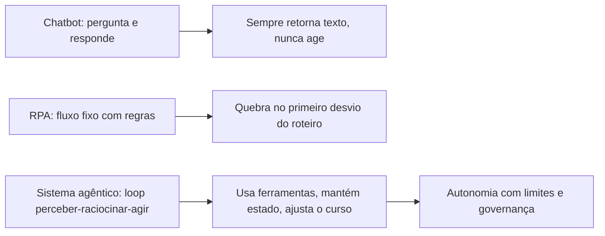

# Capítulo 1: O que é IA Agêntica (e o que ela não é)

## 1. Introdução

Imagine uma operação de atendimento que não dorme. Às três da manhã, um cliente envia uma mensagem confusa sobre um pedido atrasado; à mesma hora, um sistema analisa o histórico, consulta a transportadora, identifica que o pacote foi extraviado e aciona a reposição — tudo sem que nenhum humano tenha acordado para apertar um botão. Isso não é automação tradicional, em que cada passo é uma regra escrita por mãos humanas. É um **sistema de IA agêntico**: uma arquitetura em que modelos de linguagem de grande escala (LLMs) deixam de ser meros respondedores de perguntas para se tornarem entidades que percebem, raciocinam e agem de forma autônoma, dentro de limites deliberadamente desenhados [8].

Este livro é um guia prático para projetar, construir e implantar esse tipo de sistema. O fio condutor é o **OrquestraIA**, um sistema de agentes que você vai erguer do zero — da primeira linha de código à operação em produção — integrando suporte ao cliente, vendas e análise de dados em uma única orquestração. Cada capítulo combina fundamento teórico, diagrama, código executável, aplicação real e referências verificáveis, seguindo a metodologia EITA (Introdução, Explica, Ilustra, Técnica, Aplica, Conclusão, Referências).

Este primeiro capítulo define com precisão o que é IA agêntica e, com igual rigor, o que ela **não** é. A distinção importa porque o mercado de 2026 está repleto de produtos que se autodenominam "agentes" sem sê-lo: chatbots com tempero, assistentes com memória de conversa e automações RPA com interface bonita. Compreender a linha divisória é o que separa quem constrói sistemas que entregam valor real de quem compra jargão. Ao final, você será capaz de explicar — para um cliente, um gestor ou um recrutador — o que torna um sistema genuinamente agêntico, e por que essa definição orienta cada decisão técnica dos capítulos seguintes.

## 2. Explica

Comece pela definição que usaremos em toda a obra: **IA agêntica é a classe de sistemas em que um ou mais modelos de linguagem operam dentro de um loop de perceber–raciocinar–agir — o agent loop — com capacidade de usar ferramentas, manter estado e ajustar seu comportamento com base nos resultados de suas próprias ações** [25]. Cada elemento dessa definição é um requisito, não um adorno. Sem o loop, você tem um gerador de texto. Sem ferramentas, você tem um conversador. Sem estado, você tem um reinício a cada prompt. Sem auto-ajuste, você tem um script que finge pensar.

A distinção mais importante para quem está começando é entre três classes de software que parecem iguais, mas são profundamente diferentes. A primeira é o **chatbot tradicional**: um sistema que recebe uma mensagem, gera uma resposta e encerra o ciclo. Ele não tem intenção de alterar o mundo — não agenda reuniões, não atualiza bancos de dados, não executa código. A segunda é a **automação dirigida por regras** (RPA clássica): um sistema que executa um fluxo fixo, com condicionais explícitas escritas por humanos, quebrando quando o mundo se desvia do roteiro. A terceira, e a que este livro constrói, é o **sistema agêntico**: uma entidade que interpreta intenções ambíguas, escolhe entre caminhos possíveis, usa ferramentas para agir sobre o mundo e aprende com o resultado — dentro de limites e políticas definidos por humanos [31].

A hierarquia entre essas classes tem consequências práticas imediatas. Um chatbot pode ser construído com um único prompt e uma API; um sistema agêntico exige orquestração, memória, ferramentas, observabilidade e governança. A pesquisa de adoção confirma a explosão: o Gartner previu que 40% das aplicações empresariais incorporariam agentes de IA específicos de tarefa até 2026, contra menos de 5% em 2025 [12]. Dados compilados do ecossistema mostram que a maioria das empresas que experimentam agentes ainda está na fase piloto, com uma fração pequena escalando para produção — a lacuna, mais uma vez, não está no modelo, mas no sistema ao redor dele [8]. A McKinsey observa que a confiança — não a capacidade — é o gargalo estrutural da adoção agêntica: empresas confiam em LLMs para gerar texto, mas hesitam em delegar ações com consequências [21].

Pare e reflita sobre o que isso significa para você. Se o gargalo é a confiança e a confiança se constrói com arquitetura, governança e evidência, então o seu trabalho nesta obra é aprender a desenhar sistemas que mereçam confiança. É por isso que o Capítulo 2 apresenta o agent loop em detalhe, e é por isso que metade deste livro trata de memória, ferramentas, avaliação, segurança e supervisão humana — e não apenas de "como chamar uma API de LLM". O modelo é o motor; a arquitetura é o veículo; a governança é o motorista [32].

Uma ressalva honesta antes de continuar: agentes autônomos baseados em LLM ainda têm limitações estruturais bem documentadas. As pesquisas de levantamento acadêmico mapeiam tanto as capacidades quanto as fragilidades: agentes excelentes em tarefas bem definidas com feedback rápido, e frágeis em horizontes longos com requisitos ambíguos [31]. Erros de planejamento, alucinação de ferramentas e deriva de objetivos são riscos reais que este livro ensina a mitigar — não a negar. A maturidade, portanto, não é uma propriedade da tecnologia: é uma propriedade sua, construída capítulo a capítulo [30].

## 3. Ilustra

### A Fábrica com Gerentes de Verdade

Volte à sua operação de atendimento. Na era do chatbot, a empresa contratou um atendente que só fala: recebe o pedido de informação e devolve uma resposta, sem nunca tocar nos sistemas. Na era da automação dirigida por regras, a empresa contratou um robô de esteira: perfeito enquanto as caixas chegam na ordem prevista, mas paralisa no primeiro desvio — uma caixa invertida, um pedido duplicado, um cliente furioso.

O sistema agêntico é outra coisa: é a fábrica com gerentes de verdade. O **OrquestraIA** não é um atendente nem um robô; é o gerente de operações. Ele percebe (o cliente está insatisfeito e o pedido está atrasado), raciocina (qual é a causa mais provável? qual a política de compensação?), age (consulta a transportadora, atualiza o status, dispara a reposição) e volta a perceber (a reposição foi confirmada? o cliente respondeu?) — repetindo o ciclo até a tarefa estar resolvida ou o limite de autonomia ser atingido.



### A Diferença entre Responder e Agir

Aqui está o ponto mais difícil deste capítulo — e por isso ele merece uma segunda camada de analogia. A primeira camada mostrou a mecânica: chatbot fala, RPA obedece roteiro, agente decide. A segunda camada é sobre o que torna o agente traiçoeiro: a **ilusão de entendimento**.

Imagine um estagiário muito articulado. Ele responde qualquer pergunta com fluência e confiança, mas nunca verifica nada: não abre a planilha, não confere o estoque, não liga para a transportadora. Na maior parte do tempo, ele acerta — porque muita coisa é previsível. Mas, quando acerta por sorte, você não consegue saber se ele acertou por competência. Um sistema agêntico mal projetado é exatamente isso: um falador fluente com as mãos amarradas. A revolução agêntica não está na fala — os LLMs já falavam bem — está nas **mãos**: a capacidade de usar ferramentas, executar ações e verificar resultados [33]. É o ciclo "observo o efeito da minha ação e uso isso para decidir a próxima" que transforma conversa em operação. Como engenheiro de sistemas agênticos, você vai perceber ao longo desta obra que a pergunta central de todo projeto não é "o que o agente deve dizer?", mas "o que o agente deve **fazer**, e como sabemos que fez certo?" [4].

## 4. Técnica

### O Teste dos Cinco Critérios

A primeira ferramenta técnica deste livro é um instrumento de diagnóstico que você vai aplicar a qualquer sistema que se apresente como "agente": o **Teste dos Cinco Critérios**. Ele responde à pergunta prática: "isso aqui é realmente um sistema agêntico, ou apenas marketing?" Use-o em produtos de fornecedores, em propostas internas e no seu próprio design.

1. **Loop**: o sistema executa múltiplas iterações de perceber–raciocinar–agir, ou apenas uma chamada única ao modelo?
2. **Ferramentas**: o sistema pode alterar o mundo — chamar APIs, executar código, gravar dados — ou apenas produzir texto?
3. **Estado**: o sistema mantém memória entre iterações (conversa, contexto, resultados anteriores), ou recomeça do zero a cada passo?
4. **Auto-ajuste**: o sistema usa o resultado das próprias ações para decidir o próximo passo, ou segue um roteiro fixo?
5. **Limites**: o sistema opera dentro de políticas explícitas (permissões, escopo, limites de autonomia), ou age sem contenção?

Um sistema que falha em qualquer um dos critérios ainda pode ser útil — mas não é um sistema agêntico no sentido que este livro constrói. O critério 5 é o mais negligenciado e o mais importante: autonomia sem limites não é poder, é irresponsabilidade.

### O Esqueleto Mínimo de um Agente

Vamos transformar o diagnóstico em código. O esqueleto abaixo implementa o agent loop em sua forma mais pura — cerca de 60 linhas de Python, sem framework, para que você veja a mecânica sem a maquiagem. Ele define a estrutura que o OrquestraIA vai crescer para ocupar:

```python
# agente_esqueleto.py — o agent loop puro, sem framework
import json
from dataclasses import dataclass, field

@dataclass
class AgenteBase:
    """Estrutura mínima de um agente: loop perceber-raciocinar-agir."""
    nome: str
    modelo: str
    ferramentas: dict = field(default_factory=dict)
    memoria: list = field(default_factory=list)
    limite_passos: int = 5

    def perceber(self, mensagem: str) -> dict:
        """Percepção: converte a entrada do mundo em contexto estruturado."""
        return {"mensagem": mensagem, "historico": self.memoria[-6:]}

    def raciocinar(self, percepcao: dict) -> dict:
        """Raciocínio: decide o que fazer (substituído pela chamada ao LLM)."""
        # Na prática: llm.invoke(prompt + percepcao). A estrutura abaixo
        # documenta o contrato que o OrquestraIA vai exigir do modelo.
        return {"acao": "responder", "argumentos": {"texto": "ainda sem LLM"}}

    def agir(self, decisao: dict) -> str:
        """Ação: executa a ferramenta escolhida e retorna a observação."""
        nome = decisao["acao"]
        if nome in self.ferramentas:
            return self.ferramentas[nome](**decisao.get("argumentos", {}))
        if nome == "responder":
            return decisao["argumentos"]["texto"]
        return f"ferramenta desconhecida: {nome}"

    def executar(self, mensagem: str) -> str:
        """O agent loop completo, com limite de passos."""
        resultado = ""
        for _ in range(self.limite_passos):
            percepcao = self.perceber(mensagem)
            decisao = self.raciocinar(percepcao)
            observacao = self.agir(decisao)
            self.memoria.append(
                {"decisao": decisao, "observacao": observacao}
            )
            if decisao.get("finalizar"):
                return observacao
            resultado = observacao
            mensagem = f"Resultado da ação: {observacao}"
        return resultado

# Exemplo de uso: um agente com uma ferramenta de consulta de estoque
def consultar_estoque(produto: str = "") -> str:
    return f"estoque de {produto}: 12 unidades"

agente = AgenteBase(
    nome="atendente",
    modelo="llm-padrao",
    ferramentas={"consultar_estoque": consultar_estoque},
)
# A saída real exige um LLM conectado — o Capítulo 2 mostra como.
print(agente.executar("o cliente quer saber o estoque do produto X"))
```

Repare no que o esqueleto já garante: o loop (laço `for` com limite de passos), a interface de ferramentas (dicionário de callables), a memória (lista de decisões e observações) e o auto-ajuste (a observação alimenta a próxima iteração). O que falta é o LLM no `raciocinar` — e é exatamente isso que o Capítulo 2 entrega, substituindo a decisão fixa por uma chamada real ao modelo com o protocolo de ferramentas.

### Checklist de Projeto

Antes de seguir, aplique o checklist de sanidade a qualquer desenho de agente:

- [ ] O loop tem **limite de passos** e condição de término explícita?
- [ ] Cada ferramenta tem **contrato de entrada/saída** documentado?
- [ ] O agente registra **decisões e observações** para auditoria?
- [ ] Existe **política de autonomia**: o que o agente pode decidir sozinho e o que exige humano?
- [ ] Existe um **fallback** quando o agente não alcança o objetivo dentro dos limites?

## 5. Aplica

### Onde a IA Agêntica Entrega Valor (e Onde Não)

O teste dos cinco critérios não é acadêmico: ele separa os casos em que a arquitetura agêntica compensa dos casos em que um chatbot ou uma automação tradicional resolve melhor — e mais barato. A regra de ouro: **use agente quando o problema exige interpretação de intenção ambígua, escolha entre caminhos e ação sobre o mundo; use regras quando o fluxo é determinístico e conhecido.**

No suporte ao cliente, a pesquisa é encorajadora: sistemas agênticos de atendimento melhoram a satisfação medida em CSAT, reduzindo simultaneamente o tempo de resolução — o ganho vem exatamente dos casos em que o agente vai além de responder: diagnostica, executa e verifica [27]. Na análise de dados, agentes que exploram bancos de dados, geram consultas e validam resultados entregam relatórios que respondem a perguntas que o usuário nem formulou explicitamente — mas exigem os mesmos cinco critérios para não "inventar" números. No comércio e vendas, os agentes de qualificação e follow-up já operam com graus variados de autonomia, e a classificação de fornecedores por nível de autonomia revela uma lição central: quanto maior a autonomia, maior o retorno — e maior a exigência de governança [24].

Os riscos são igualmente mapeáveis. Os principais riscos de sistemas de IA em 2026 incluem a dependência excessiva de saídas não verificadas, a falta de rastreabilidade de decisões autônomas e a exposição crescente a ataques de manipulação de contexto [30]. A lição operacional é direta: **autonomia e governança devem crescer juntas.** Um sistema agêntico sem telemetria é um carro sem painel — e a telemetria não é um extra, é parte da arquitetura (aprofundada no Capítulo 16).

### Armadilhas Comuns de Quem Está Começando

1. **Tratar o agente como um chatbot melhor**: conectar um LLM a um prompt mais longo não cria um agente. Sem loop, ferramentas e estado, você tem um conversador eloquente.
2. **Autonomia total desde o primeiro dia**: comece com decisões de baixo impacto e supervisão humana; aumente a autonomia com evidência, não com entusiasmo.
3. **Ignorar a observabilidade**: um agente que age sem registrar por quê é uma caixa-preta — o Capítulo 16 mostra o modelo de trilhas de decisão.
4. **Subestimar o custo dos tokens**: loops multiplicam chamadas ao modelo; um único fluxo pode custar 5–20 chamadas. O custo é uma decisão de arquitetura, não uma surpresa (Capítulo 16).

### Conexão com o OrquestraIA

No OrquestraIA, os cinco critérios viram decisões concretas de projeto: o loop será o orquestrador (Capítulo 10), as ferramentas serão as integrações com CRM, transportadora e banco (Capítulos 7 e 11), o estado será a memória (Capítulo 6), o auto-ajuste será a reflexão pós-ação (Capítulo 4) e os limites serão as políticas de segurança (Capítulo 14).

### Aprofundamento: O Panorama de Adoção em Números

A definição de IA agêntica ganha escala quando você conhece os números do mercado — e os dados ajudam a separar o fenômeno do modismo. O Gartner projeta que 40% das aplicações empresariais incorporarão agentes de IA específicos de tarefa até 2026, contra menos de 5% em 2025 — um salto de quase dez vezes em um ano [12]. A compilação de dados do ecossistema mostra o padrão de maturidade: a maioria das empresas está em piloto, uma fração menor em produção, e uma fração menor ainda escalando para múltiplos fluxos — a pirâmide da adoção, com a base larga e o topo estreito [8]. A McKinsey, por sua vez, observa que o gargalo mudou de capacidade para confiança: as empresas confiam em LLMs para gerar texto, mas hesitam em delegar ações com consequência — exatamente o desafio de governança que este livro constrói [21].

Os números do suporte ilustram o retorno: sistemas agênticos de atendimento melhoram a satisfação medida em CSAT e reduzem o tempo de resolução [27], e os estudos de ROI de agentes de suporte documentam a redução de custo por contato [10]. A leitura honesta dos dados: o retorno é real nos fluxos conhecidos e medidos — e ilusório nos fluxos caóticos que a automação apenas amplifica (a mesma lição do Efeito Espelho que a pesquisa DORA documentou no desenvolvimento de software) [9].

### O Glossário do Campo: Termos que Você Vai Encontrar

O vocabulário do campo é a primeira barreira de entrada — e a lista essencial ajuda a navegar qualquer conversa técnica: **agente** (o loop perceber-raciocinar-agir com ferramentas), **agentic** (o adjetivo dos sistemas que agem, em oposição aos que apenas geram), **tool use / function calling** (o mecanismo de executar ferramentas a partir de decisão do modelo), **orquestração** (a coordenação de múltiplos agentes), **contexto** (o que o modelo vê em cada chamada — a alavanca mais importante de qualidade), **memória** (o estado que persiste entre chamadas), **evals** (os testes sistemáticos de qualidade), **guardrails** (os limites de segurança), **HITL** (human-in-the-loop — a supervisão humana), **RAG** (a recuperação de conhecimento para o contexto) e **MCP** (o protocolo de conexão de ferramentas). Cada termo deste glossário é um capítulo desta obra — e dominar o vocabulário é o primeiro sinal de que você está no campo, não na borda [31][32].

## 6. Conclusão

Você fez o primeiro movimento da jornada. Os três pontos principais deste capítulo: **primeiro**, IA agêntica é a classe de sistemas em que LLMs operam em um loop perceber–raciocinar–agir com ferramentas, estado e auto-ajuste — e essa definição é um contrato, não um slogan. **Segundo**, a distinção operacional que orienta tudo o que vem a seguir: chatbot responde, RPA executa roteiro, agente decide e age dentro de limites — e o Teste dos Cinco Critérios é o instrumento para classificar qualquer sistema. **Terceiro**, o esqueleto técnico mínimo de um agente é surpreendentemente pequeno — um loop com ferramentas, memória e limite de passos — e é sobre esse esqueleto que o OrquestraIA será construído.

O próximo capítulo aprofunda o coração do sistema: o **agent loop**. Você vai implementar a versão completa com LLM real, protocolo de ferramentas e o ciclo de reflexão — e entender por que "perceber, raciocinar, agir" é mais do que uma frase bonita: é a arquitetura que torna a autonomia possível e auditável.

**Desafio opcional**: aplique o Teste dos Cinco Critérios a três ferramentas que você usa no trabalho ou no estudo. Classifique cada uma como chatbot, RPA ou sistema agêntico — e anote qual critério faltou em cada caso. Esse exercício de 15 minutos treina o olho que você usará em todos os capítulos seguintes.

## 7. Referências

[1] ADIMULAM, A.; GUPTA, R.; KUMAR, S. *The Orchestration of Multi-Agent Systems: Architectures, Protocols, and Enterprise Adoption*. arXiv:2601.13671v1, 2026. Disponível em: https://arxiv.org/html/2601.13671v1. Acesso em: 07 ago. 2026.

[2] AMAZON WEB SERVICES (AWS). *Traditional agent architecture: perceive, reason, act*. AWS Prescriptive Guidance: Foundations of Agentic AI on AWS, 2026. Disponível em: https://docs.aws.amazon.com/prescriptive-guidance/latest/agentic-ai-foundations/traditional-agents.html. Acesso em: 07 ago. 2026.

[3] ANTHROPIC. *Building Effective Agents*. 2024. Disponível em: https://www.anthropic.com/engineering/building-effective-agents. Acesso em: 07 ago. 2026.

[4] ANTHROPIC. *Demystifying Evals for AI Agents*. 2026. Disponível em: https://www.anthropic.com/engineering/demystifying-evals-for-ai-agents. Acesso em: 07 ago. 2026.

[5] BRAINTRUST. *AI Gateway Comparison: The 6 Best Ranked (2026)*. 2026. Disponível em: https://www.braintrust.dev/articles/ai-gateway-comparison-2026. Acesso em: 07 ago. 2026.

[6] CERBOS. *AI Agents, the Model Context Protocol, and the Future of Authorization Guardrails*. 2026. Disponível em: https://www.cerbos.dev/news/securing-ai-agents-model-context-protocol. Acesso em: 07 ago. 2026.

[7] COALITION FOR SECURE AI (CoSAI). *Securing the AI Agent Revolution: A Practical Guide to Model Context Protocol Security*. 2026. Disponível em: https://www.coalitionforsecureai.org/securing-the-ai-agent-revolution-a-practical-guide-to-mcp-security/. Acesso em: 07 ago. 2026.

[8] DIGITAL APPLIED. *State of AI Agents 2026: 200+ Data Points Compiled*. 2026. Disponível em: https://www.digitalapplied.com/blog/state-of-ai-agents-2026-200-data-points. Acesso em: 07 ago. 2026.

[9] DORA / GOOGLE CLOUD. *DORA: State of AI-assisted Software Development 2025*. 2025. Disponível em: https://dora.dev/dora-report-2025/. Acesso em: 07 ago. 2026.

[10] FIN.AI. *AI Agent ROI: Customer Support Returns*. 2026. Disponível em: https://fin.ai/blog/ai-agent-roi-customer-support. Acesso em: 07 ago. 2026.

[11] GALILEO. *How to Build Human-in-the-Loop Oversight for Production AI Agents*. 2026. Disponível em: https://galileo.ai/blog/human-in-the-loop-agent-oversight. Acesso em: 07 ago. 2026.

[12] GARTNER. *Gartner Predicts 40% of Enterprise Apps Will Feature Task-Specific AI Agents by 2026*. 2025. Disponível em: https://www.gartner.com/en/newsroom/press-releases/2025-08-26-gartner-predicts-40-percent-of-enterprise-apps-will-feature-task-specific-ai-agents-by-2026-up-from-less-than-5-percent-in-2025. Acesso em: 07 ago. 2026.

[13] GOOGLE CLOUD. *Choose a Design Pattern for Your Agentic AI System*. Cloud Architecture Center, 2026. Disponível em: https://docs.cloud.google.com/architecture/choose-design-pattern-agentic-ai-system. Acesso em: 07 ago. 2026.

[14] GUO, Taicheng et al. *Large Language Model based Multi-Agents: A Survey of Progress and Challenges*. IJCAI, 2024. Disponível em: https://arxiv.org/abs/2402.01680. Acesso em: 07 ago. 2026.

[15] HONG, Sirui et al. *MetaGPT: Meta Programming for A Multi-Agent Collaborative Framework*. ICLR, 2024. Disponível em: https://arxiv.org/abs/2308.00352. Acesso em: 07 ago. 2026.

[16] LANGCHAIN TEAM. *Context Engineering for Agents*. 2025. Disponível em: https://www.langchain.com/blog/context-engineering-for-agents. Acesso em: 07 ago. 2026.

[17] LANGCHAIN TEAM. *LangMem SDK for Agent Long-Term Memory*. 2025. Disponível em: https://www.langchain.com/blog/langmem-sdk-launch. Acesso em: 07 ago. 2026.

[18] LANGCHAIN. *The Best AI Agent Frameworks in 2026*. 2026. Disponível em: https://www.langchain.com/resources/ai-agent-frameworks. Acesso em: 07 ago. 2026.

[19] LIU, Xiao et al. *AgentBench: Evaluating LLMs as Agents*. ICLR, 2025. Disponível em: https://arxiv.org/abs/2308.03688. Acesso em: 07 ago. 2026.

[20] MAXIM AI. *Best Enterprise LLM Gateways in 2026: A Comparative Guide*. 2026. Disponível em: https://www.getmaxim.ai/articles/best-enterprise-llm-gateways-in-2026-a-comparative-guide/. Acesso em: 07 ago. 2026.

[21] MCKINSEY & COMPANY. *State of AI Trust in 2026: Shifting to the Agentic Era*. 2026. Disponível em: https://www.mckinsey.com/capabilities/tech-and-ai/our-insights/tech-forward/state-of-ai-trust-in-2026-shifting-to-the-agentic-era. Acesso em: 07 ago. 2026.

[22] MEM0 ENGINEERING TEAM. *AI Agent Memory 2026: Progress Benchmark Report Evaluations*. 2026. Disponível em: https://mem0.ai/blog/state-of-ai-agent-memory-2026. Acesso em: 07 ago. 2026.

[23] MICROSOFT AZURE ARCHITECTURE CENTER. *AI Agent Orchestration Patterns*. 2026. Disponível em: https://learn.microsoft.com/en-us/azure/architecture/ai-ml/guide/ai-agent-design-patterns. Acesso em: 07 ago. 2026.

[24] ONEAWAY. *Best AI Sales Agents in 2026, Ranked by Autonomy*. 2026. Disponível em: https://oneaway.io/blog/best-ai-sales-agents-in-2026-ranked-by-autonomy. Acesso em: 07 ago. 2026.

[25] ORACLE DEVELOPERS. *What Is the AI Agent Loop? The Core Architecture Behind Autonomous AI Systems*. 2026. Disponível em: https://blogs.oracle.com/developers/what-is-the-ai-agent-loop-the-core-architecture-behind-autonomous-ai-systems. Acesso em: 07 ago. 2026.

[26] QIAN, Chen et al. *ChatDev: Communicative Agents for Software Development*. ACL, 2024. Disponível em: https://arxiv.org/abs/2307.07924. Acesso em: 07 ago. 2026.

[27] SALESFORCE. *New Research: AI Service Agents Improve Customer Satisfaction*. 2026. Disponível em: https://www.salesforce.com/news/stories/ai-service-agents-improve-customer-satisfaction/. Acesso em: 07 ago. 2026.

[28] TRUEFOUNDRY. *6 Best LLM Gateways in 2026*. 2026. Disponível em: https://www.truefoundry.com/blog/best-llm-gateways. Acesso em: 07 ago. 2026.

[29] UVIK SOFTWARE. *Agentic AI Frameworks 2026: Production Comparison*. 2026. Disponível em: https://uvik.net/blog/agentic-ai-frameworks/. Acesso em: 07 ago. 2026.

[30] VALIDMIND. *Top 10 AI Risk Trends for 2026*. 2026. Disponível em: https://validmind.com/blog/10-ai-risk-trends-for-2026/. Acesso em: 07 ago. 2026.

[31] WANG, Lei et al. *A Survey on Large Language Model based Autonomous Agents*. arXiv:2308.11432, 2025. Disponível em: https://arxiv.org/abs/2308.11432. Acesso em: 07 ago. 2026.

[32] XI, Zhiheng et al. *The Rise and Potential of Large Language Model Based Agents: A Survey*. arXiv:2309.07864, 2023. Disponível em: https://arxiv.org/abs/2309.07864. Acesso em: 07 ago. 2026.

[33] YAO, Shunyu et al. *ReAct: Synergizing Reasoning and Acting in Language Models*. ICLR, 2023. Disponível em: https://arxiv.org/abs/2210.03629. Acesso em: 07 ago. 2026.

[34] ZENITY. *What Is the Model Context Protocol? Full Guide*. 2026. Disponível em: https://zenity.io/academy/model-context-protocol-explained. Acesso em: 07 ago. 2026.
