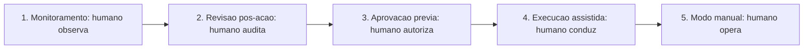

# Capítulo 15: Supervisão humana: human-in-the-loop

## 1. Introdução

O OrquestraIA tem autonomia — e este capítulo é sobre a responsabilidade que a autonomia exige: a **supervisão humana**, o human-in-the-loop (HITL). Autonomia total é a falha mais previsível dos sistemas agênticos: sem um humano no circuito para decisões de alto impacto, o sistema executa ações irreversíveis com base em um modelo que erra — e o erro de um agente autônomo é um incidente, não um deslize [9][18]. A supervisão humana não é a negação da autonomia: é o seu complemento — o desenho deliberado dos pontos em que o humano decide, revisa e intervém.

O setor convergiu na prática: os guias de supervisão humana para agentes em produção descrevem o HITL como um **espectro** — do monitoramento passivo ao veto obrigatório — e a escolha do ponto de cada decisão nesse espectro é uma decisão de design, não de política geral [9]. A confiança — o gargalo estrutural da adoção agêntica — depende diretamente dessa escolha: os dados de mercado mostram que as empresas escalam agentes quando têm supervisão que dá confiança, e estagnam quando a autonomia sem supervisão produz incidentes [18]. E a regulação e a responsabilidade seguem o mesmo caminho: ações com consequência precisam de um humano responsável no circuito [24].

Ao final deste capítulo, você será capaz de desenhar o sistema de supervisão do OrquestraIA: o espectro HITL, a classificação de decisões por impacto e reversibilidade, a fila de aprovações com contexto suficiente, a auditoria do que o humano aprovou ou vetou e a calibração do nível de autonomia com evidência — o fechamento do ciclo que começou com o permissor do Capítulo 14.

## 2. Explica

### O Espectro do Human-in-the-Loop

A supervisão humana não é um botão liga-desliga: é um espectro com cinco níveis, e cada decisão do sistema ocupa um ponto [9]:

**1. Monitoramento (humano observa)**: o sistema age, e o humano observa os registros em tempo real. Autonomia total, visibilidade total. Uso: ações de baixo impacto e alta frequência, com trilha completa.

**2. Revisão pós-ação (humano audita)**: o sistema age, e o humano revisa depois — aprovação a posteriori, correção de rumo, registro de aprendizado. Uso: ações reversíveis de médio impacto.

**3. Aprovação prévia (humano autoriza)**: o sistema prepara a ação e **pausa** até o humano aprovar. Uso: ações irreversíveis ou de alto impacto — o padrão do Capítulo 14 (reembolso acima do limite).

**4. Execução assistida (humano conduz)**: o humano executa a ação e o sistema apoia — o agente como assistente de decisão. Uso: ações onde o julgamento humano é insubstituível (contenção de crise, comunicação sensível).

**5. Modo manual (humano opera)**: o sistema desligado ou em modo de leitura — o humano opera diretamente. Uso: incidentes, manutenção, pós-falha.

### Classificando Decisões: Impacto e Reversibilidade

A escolha do nível HITL para cada decisão depende de duas variáveis: **impacto** (quanto custa o erro? financeiro, reputacional, legal, de segurança) e **reversibilidade** (dá para desfazer? um e-mail enviado não se desenvia; uma consulta de leitura sim). A matriz resultante orienta o desenho: **alto impacto + irreversível** → aprovação prévia ou execução assistida; **baixo impacto + reversível** → monitoramento; **médio impacto + reversível** → revisão pós-ação [9][11].

A matriz não é fixa: a calibração evolui com a evidência. O sistema que acumula taxa de sucesso alta em aprovações prévias pode migrar decisões para a revisão pós-ação — e a migração é sempre medida (Capítulo 13) e reversível [9].

### O Custo da Supervisão e o Trade-off de Autonomia

Supervisão custa: aprovação prévia adiciona latência e trabalho humano — e o gargalo da fila de aprovações vira o gargalo do sistema. O trade-off é estrutural: **mais supervisão, menos velocidade; menos supervisão, mais risco**. A prática madura não busca o "ponto certo" único: busca o **portfólio** — decisões de rotina com supervisão leve, decisões críticas com supervisão pesada — e a revisão periódica do portfólio com os dados da operação [9][18].

## 3. Ilustra

### O Copiloto e o Comandante

A supervisão humana é a relação entre o copiloto (o sistema) e o comandante (o humano). O copiloto voa — mas o comandante decide o que importa: o desvio de rota exige o comando do comandante (aprovação prévia), a lista de verificação é executada pelo copiloto com o comandante auditando (monitoramento), e a emergência é conduzida pelo comandante com o copiloto apoiando (execução assistida). A cabine de comando segura não é a que o copiloto voa sozinho, nem a que o comandante pilota tudo: é a que **cada decisão tem o nível de supervisão que o seu risco exige** [9].



### A Analogia do Cartão Corporativo

Uma segunda lente: o cartão corporativo com limites e aprovações. O funcionário (o agente) usa o cartão para compras de rotina (monitoramento — o extrato mostra tudo), compras médias passam por aprovação do gestor (aprovação prévia), e compras excepcionais exigem reunião com o financeiro (execução assistida). A empresa que dá cartão sem limite nem extrato quebra; a que congela todo gasto na aprovação burocrática perde agilidade. O desenho certo do cartão — limites, níveis e trilha — é exatamente o desenho do HITL do sistema de agentes [9][11].

## 4. Técnica

### O Roteador de Supervisão

Vamos implementar o sistema de supervisão do OrquestraIA — a camada que decide, para cada ação, o nível de supervisão:

```python
# supervisao.py — o roteador HITL do OrquestraIA
from dataclasses import dataclass, field

@dataclass
class DecisaoSupervisao:
    """Registro de uma decisao de supervisao."""
    acao: str
    argumentos: dict
    nivel: str          # monitorar, revisar, aprovar, assistir, manual
    status: str = "pendente"   # pendente, aprovado, vetado, revisado
    humano: str = ""
    motivo: str = ""

@dataclass
class SupervisaoHumana:
    """Roteia cada acao para o nivel de supervisao pelo impacto e reversibilidade."""
    def __init__(self, fila_aprovacoes=None, auditoria=None):
        self.fila = fila_aprovacoes or []
        self.auditoria = auditoria or []
        self.classificacoes = {}  # acao -> (impacto: alto/medio/baixo, reversivel: bool)

    def classificar(self, acao: str, impacto: str, reversivel: bool) -> None:
        self.classificacoes[acao] = (impacto, reversivel)

    def nivel_para(self, acao: str, argumentos: dict) -> str:
        """Decide o nivel HITL pela matriz impacto x reversibilidade."""
        impacto, reversivel = self.classificacoes.get(
            acao, ("medio", True))
        # regras especificas por dominio (ex.: limite monetario)
        if acao == "aprovar_reembolso" and float(argumentos.get("valor", 0)) > 100:
            return "aprovar"  # acima do limite: humano obrigatorio
        if impacto == "alto" and not reversivel:
            return "aprovar"
        if impacto == "alto" and reversivel:
            return "revisar"
        if impacto == "medio" and not reversivel:
            return "revisar"
        return "monitorar"  # baixo impacto e/ou reversivel

    def executar_acao(self, acao: str, argumentos: dict, executor) -> dict:
        """Executa com o nivel de supervisao correto."""
        nivel = self.nivel_para(acao, argumentos)
        decisao = DecisaoSupervisao(acao, argumentos, nivel)
        if nivel == "monitorar":
            resultado = executor(acao, argumentos)
            decisao.status = "executado"
            self.auditoria.append(decisao)
            return {"decisao": decisao, "resultado": resultado}
        if nivel == "revisar":
            resultado = executor(acao, argumentos)
            decisao.status = "executado_para_revisao"
            self.auditoria.append(decisao)  # revisao pos-acao
            return {"decisao": decisao, "resultado": resultado,
                    "revisao": "pendente"}
        if nivel == "aprovar":
            # pausa: a acao vai para a fila de aprovacao humana
            self.fila.append(decisao)
            return {"decisao": decisao, "resultado": None,
                    "mensagem": "aguardando aprovacao humana"}
        return {"decisao": decisao, "resultado": None,
                "mensagem": "acao requer modo assistido/manual"}

    def aprovar(self, decisao_id: int, humano: str, motivo: str = "") -> str:
        """O humano aprova a acao pendente."""
        decisao = self.fila[decisao_id]
        decisao.status = "aprovado"
        decisao.humano, decisao.motivo = humano, motivo
        return f"aprovado por {humano}: {decisao.acao}"

    def vetar(self, decisao_id: int, humano: str, motivo: str = "") -> str:
        """O humano veta a acao pendente."""
        decisao = self.fila[decisao_id]
        decisao.status = "vetado"
        decisao.humano, decisao.motivo = humano, motivo
        return f"vetado por {humano}: {decisao.acao}"

# Uso:
# supervisao = SupervisaoHumana()
# supervisao.classificar("consultar_pedido", "baixo", True)
# supervisao.classificar("registrar_preferencia", "baixo", True)
# supervisao.classificar("aprovar_reembolso", "alto", False)
# r = supervisao.executar_acao("aprovar_reembolso", {"valor": 850}, executor)
# print(r["mensagem"])  # aguardando aprovacao humana
```

Três decisões de engenharia: **classificação declarativa** (cada ação declara impacto e reversibilidade — a matriz é visível e auditável), **pausa real na fila** (a ação de alto impacto não executa até o humano decidir — a autonomia é suspensa no ponto certo) e **auditoria completa** (toda decisão — aprovada, vetada, executada — entra no registro do Capítulo 16).

### A Fila de Aprovações com Contexto

A fila de aprovações só funciona se o humano tiver **contexto suficiente para decidir bem** — a pergunta que o sistema deve responder: "por que esta ação, com estes argumentos, para este caso?":

```python
# fila_aprovacoes.py — a fila com contexto para decisao humana
@dataclass
class ItemAprovacao:
    decisao: DecisaoSupervisao
    contexto: str = ""   # o raciocinio que levou a acao
    trilha: list = field(default_factory=list)

def montar_contexto_aprovacao(decisao, rastreio, politica) -> str:
    """Monta o contexto que o humano precisa para decidir."""
    return (
        f"ACAO: {decisao.acao}\n"
        f"ARGUMENTOS: {decisao.argumentos}\n"
        f"POLITICA: {politica}\n"
        f"RASTREIO DO AGENTE:\n" + "\n".join(
            f"  {r.get('tipo')}: {str(r)[:100]}" for r in rastreio[-5:])
    )
```

O contexto de aprovação é a diferença entre uma fila que o humano confia e uma fila que o humano só carimba — e o carimbo cego é a supervisão de fachada, o pior dos mundos [9].

### Checklist de Supervisão

- [ ] Cada ação tem **nível HITL** definido pela matriz impacto × reversibilidade?
- [ ] Ações **alto impacto + irreversíveis** pausam para aprovação humana?
- [ ] A fila de aprovações traz **contexto suficiente** para o humano decidir?
- [ ] Aprovado/vetado/executado entram na **auditoria**?
- [ ] A **calibração da autonomia** é revisada com evidência (taxa de sucesso, incidentes)?

## 5. Aplica

### Supervisão no Chão de Fábrica

A supervisão humana é o filtro operacional da confiança: os dados do mercado mostram que o gargalo da adoção agêntica não é a capacidade — é a confiança para delegar ações com consequência [18]. Os sistemas que escalam são os que têm HITL desenhado por decisão: rotina monitorada, crítico aprovado, irreversível assistido — e o portfólio revisado com os dados da operação [9].

O custo da supervisão é real (latência, trabalho humano), mas o custo da ausência é maior: um incidente de ação autônoma errada — um reembolso indevido, uma comunicação ofensiva, uma ação de sistema errada — custa mais do que a fila de aprovações economiza [18][24]. A recomendação prática: **comece com supervisão mais pesada e alivie com evidência** — a autonomia é uma concessão medida, não um direito do sistema [9].

### Armadilhas Comuns

1. **Autonomia total**: sem HITL, o sistema executa ações irreversíveis com base em modelo que erra — a falha mais previsível do mercado.
2. **Supervisão de fachada**: fila de aprovação que o humano carimba sem contexto — o pior dos mundos: custo da supervisão sem o benefício.
3. **Classificação ausente**: sem matriz impacto × reversibilidade, o nível HITL é arbitrário — e o erro aparece no incidente.
4. **Fila como gargalo**: toda ação passando por aprovação — o portfólio de níveis (leve para rotina, pesado para crítico) é o desenho certo.
5. **Autonomia congelada**: nunca recalibrar o portfólio com a evidência da operação — o sistema que poderia voar mais alto fica preso, ou o que deveria frear acelera.

### Conexão com o OrquestraIA

A supervisão do OrquestraIA conecta-se ao permissor (Capítulo 14): o permissor nega o que a política proíbe; a `SupervisaoHumana` pausa o que exige humano. As decisões entram na auditoria (Capítulo 16), os incidentes viram lições na memória episódica (Capítulo 6) e a calibração usa os evals (Capítulo 13).

### Aprofundamento: O Design das Interfaces de Supervisão

A supervisão humana funciona quando a **interface** — o que o humano vê e como decide — é desenhada com o mesmo cuidado da arquitetura do agente. As três interfaces essenciais do HITL: a **fila de aprovações** (a lista das ações pendentes com o contexto montado no capítulo — o humano decide aprovar, vetar ou solicitar mais informação, e a decisão entra na auditoria), o **dashboard de revisão** (a revisão pós-ação: as ações executadas com o rastreio completo, para o humano auditar e corrigir o rumo — o elo com o painel do Capítulo 16) e a **central de incidentes** (o registro dos casos que exigiram intervenção, com a lição extraída — o elo com a operação do Capítulo 19). Cada interface tem um objetivo de decisão, e o design mede o tempo de decisão: o humano que demora demais na fila é o gargalo do sistema (Capítulo 17), e o design do contexto de aprovação é a alavanca do tempo [9].

### A Política de Autonomia Escrita

A matriz impacto × reversibilidade do capítulo vira documento operacional: a **política de autonomia** — o documento que define, por ação, o nível HITL, o responsável pela decisão e a evidência de calibração. A política tem três seções: a **matriz** (ação, impacto, reversibilidade, nível HITL — a tabela do capítulo, agora com as ações reais do domínio), o **fluxo de exceção** (o que acontece quando a ação não está na matriz — a regra de ouro: fora da matriz, exige humano) e o **calendário de revisão** (a periodicidade da recalibração — o elo com o ciclo de operação do Capítulo 19). A política escrita é o que torna a autonomia **auditável e defensável**: a pergunta "por que o sistema agiu sozinho neste caso?" tem resposta documentada — a ação está na matriz, no nível HITL correspondente, com a evidência de calibração que o justifica [9][18].

### Aprofundamento: O Nível de Confiança da Aprovação

A aprovação humana do capítulo ganha um refinamento que reduz o gargalo da fila sem perder a responsabilidade: o **nível de confiança da aprovação** — o indicador que acompanha cada item da fila e informa ao humano a urgência e o risco da decisão. O nível combina três fatores: a **probabilidade de acerto** do sistema naquele tipo de decisão (medida pelos evals do Capítulo 13 — a aprovação de reembolso abaixo do limite acerta 95% das vezes?), o **custo do atraso** (a aprovação que espera horas custa a satisfação do cliente — o CSAT do Capítulo 18) e o **custo do erro** (o reembolso indevido custa dinheiro; a reposição demorada custa retenção). O nível de confiança é apresentado ao humano na fila — "o sistema recomenda aprovar com confiança alta, baseada em 95% de acerto em 400 casos similares" — e o humano decide com informação, não com adivinhação [9].

A consequência operacional é a calibração do fluxo: itens de confiança alta e custo de erro baixo migram para revisão pós-ação (o nível 2 do espectro); itens de confiança baixa ou custo de erro alto permanecem na aprovação prévia. A migração é a mesma disciplina do Capítulo 19 — autonomia que sobe com evidência — aplicada à fila de aprovações: o sistema que prova acerto em massa libera o humano para os casos que realmente exigem o seu julgamento, e o gargalo da supervisão se dissolve onde a evidência o permite [9][8].

## 6. Conclusão

Três pontos para levar: **primeiro**, a supervisão humana é um espectro — do monitoramento ao modo manual — e cada decisão do sistema ocupa um ponto definido pela matriz impacto × reversibilidade. **Segundo**, a aprovação prévia pausa as ações de alto impacto irreversíveis até o humano decidir — com contexto suficiente na fila, para que a supervisão seja real, não de fachada. **Terceiro**, a autonomia é uma concessão medida: comece com supervisão mais pesada, alivie com evidência e revise o portfólio com os dados da operação.

O próximo capítulo completa a Parte IV com o que torna tudo isso visível e controlável: a **observabilidade e os custos de tokens** — as trilhas de decisão, o painel de operação e a economia do sistema que decide se o OrquestraIA é sustentável.

**Desafio opcional**: classifique as 10 ações mais comuns do seu domínio na matriz impacto × reversibilidade e defina o nível HITL de cada uma. Depois, implemente a `SupervisaoHumana` no OrquestraIA com a regra de limite monetário do exemplo e simule: a ação acima do limite pausa? O contexto da fila permite decidir? Essa é a sua política de autonomia documentada.

## 7. Referências

[1] ADIMULAM, A.; GUPTA, R.; KUMAR, S. *The Orchestration of Multi-Agent Systems: Architectures, Protocols, and Enterprise Adoption*. arXiv:2601.13671v1, 2026. Disponível em: https://arxiv.org/html/2601.13671v1. Acesso em: 07 ago. 2026.

[2] AMAZON WEB SERVICES (AWS). *Traditional agent architecture: perceive, reason, act*. AWS Prescriptive Guidance: Foundations of Agentic AI on AWS, 2026. Disponível em: https://docs.aws.amazon.com/prescriptive-guidance/latest/agentic-ai-foundations/traditional-agents.html. Acesso em: 07 ago. 2026.

[3] ANTHROPIC. *Building Effective Agents*. 2024. Disponível em: https://www.anthropic.com/engineering/building-effective-agents. Acesso em: 07 ago. 2026.

[4] ANTHROPIC. *Demystifying Evals for AI Agents*. 2026. Disponível em: https://www.anthropic.com/engineering/demystifying-evals-for-ai-agents. Acesso em: 07 ago. 2026.

[5] CERBOS. *AI Agents, the Model Context Protocol, and the Future of Authorization Guardrails*. 2026. Disponível em: https://www.cerbos.dev/news/securing-ai-agents-model-context-protocol. Acesso em: 07 ago. 2026.

[6] COALITION FOR SECURE AI (CoSAI). *Securing the AI Agent Revolution: A Practical Guide to Model Context Protocol Security*. 2026. Disponível em: https://www.coalitionforsecureai.org/securing-the-ai-agent-revolution-a-practical-guide-to-mcp-security/. Acesso em: 07 ago. 2026.

[7] DIGITAL APPLIED. *State of AI Agents 2026: 200+ Data Points Compiled*. 2026. Disponível em: https://www.digitalapplied.com/blog/state-of-ai-agents-2026-200-data-points. Acesso em: 07 ago. 2026.

[8] FIN.AI. *AI Agent ROI: Customer Support Returns*. 2026. Disponível em: https://fin.ai/blog/ai-agent-roi-customer-support. Acesso em: 07 ago. 2026.

[9] GALILEO. *How to Build Human-in-the-Loop Oversight for Production AI Agents*. 2026. Disponível em: https://galileo.ai/blog/human-in-the-loop-agent-oversight. Acesso em: 07 ago. 2026.

[10] GARTNER. *Gartner Predicts 40% of Enterprise Apps Will Feature Task-Specific AI Agents by 2026*. 2025. Disponível em: https://www.gartner.com/en/newsroom/press-releases/2025-08-26-gartner-predicts-40-percent-of-enterprise-apps-will-feature-task-specific-ai-agents-by-2026-up-from-less-than-5-percent-in-2025. Acesso em: 07 ago. 2026.

[11] GOOGLE CLOUD. *Choose a Design Pattern for Your Agentic AI System*. Cloud Architecture Center, 2026. Disponível em: https://docs.cloud.google.com/architecture/choose-design-pattern-agentic-ai-system. Acesso em: 07 ago. 2026.

[12] GUO, Taicheng et al. *Large Language Model based Multi-Agents: A Survey of Progress and Challenges*. IJCAI, 2024. Disponível em: https://arxiv.org/abs/2402.01680. Acesso em: 07 ago. 2026.

[13] HONG, Sirui et al. *MetaGPT: Meta Programming for A Multi-Agent Collaborative Framework*. ICLR, 2024. Disponível em: https://arxiv.org/abs/2308.00352. Acesso em: 07 ago. 2026.

[14] LANGCHAIN TEAM. *Context Engineering for Agents*. 2025. Disponível em: https://www.langchain.com/blog/context-engineering-for-agents. Acesso em: 07 ago. 2026.

[15] LANGCHAIN TEAM. *LangMem SDK for Agent Long-Term Memory*. 2025. Disponível em: https://www.langchain.com/blog/langmem-sdk-launch. Acesso em: 07 ago. 2026.

[16] LANGCHAIN. *The Best AI Agent Frameworks in 2026*. 2026. Disponível em: https://www.langchain.com/resources/ai-agent-frameworks. Acesso em: 07 ago. 2026.

[17] LIU, Xiao et al. *AgentBench: Evaluating LLMs as Agents*. ICLR, 2025. Disponível em: https://arxiv.org/abs/2308.03688. Acesso em: 07 ago. 2026.

[18] MCKINSEY & COMPANY. *State of AI Trust in 2026: Shifting to the Agentic Era*. 2026. Disponível em: https://www.mckinsey.com/capabilities/tech-and-ai/our-insights/tech-forward/state-of-ai-trust-in-2026-shifting-to-the-agentic-era. Acesso em: 07 ago. 2026.

[19] MEM0 ENGINEERING TEAM. *AI Agent Memory 2026: Progress Benchmark Report Evaluations*. 2026. Disponível em: https://mem0.ai/blog/state-of-ai-agent-memory-2026. Acesso em: 07 ago. 2026.

[20] MICROSOFT AZURE ARCHITECTURE CENTER. *AI Agent Orchestration Patterns*. 2026. Disponível em: https://learn.microsoft.com/en-us/azure/architecture/ai-ml/guide/ai-agent-design-patterns. Acesso em: 07 ago. 2026.

[21] ORACLE DEVELOPERS. *What Is the AI Agent Loop? The Core Architecture Behind Autonomous AI Systems*. 2026. Disponível em: https://blogs.oracle.com/developers/what-is-the-ai-agent-loop-the-core-architecture-behind-autonomous-ai-systems. Acesso em: 07 ago. 2026.

[22] QIAN, Chen et al. *ChatDev: Communicative Agents for Software Development*. ACL, 2024. Disponível em: https://arxiv.org/abs/2307.07924. Acesso em: 07 ago. 2026.

[23] SALESFORCE. *New Research: AI Service Agents Improve Customer Satisfaction*. 2026. Disponível em: https://www.salesforce.com/news/stories/ai-service-agents-improve-customer-satisfaction/. Acesso em: 07 ago. 2026.

[24] VALIDMIND. *Top 10 AI Risk Trends for 2026*. 2026. Disponível em: https://validmind.com/blog/10-ai-risk-trends-for-2026/. Acesso em: 07 ago. 2026.

[25] WANG, Lei et al. *A Survey on Large Language Model based Autonomous Agents*. arXiv:2308.11432, 2025. Disponível em: https://arxiv.org/abs/2308.11432. Acesso em: 07 ago. 2026.

[26] XI, Zhiheng et al. *The Rise and Potential of Large Language Model Based Agents: A Survey*. arXiv:2309.07864, 2023. Disponível em: https://arxiv.org/abs/2309.07864. Acesso em: 07 ago. 2026.

[27] YAO, Shunyu et al. *ReAct: Synergizing Reasoning and Acting in Language Models*. ICLR, 2023. Disponível em: https://arxiv.org/abs/2210.03629. Acesso em: 07 ago. 2026.

[28] ZENITY. *What Is the Model Context Protocol? Full Guide*. 2026. Disponível em: https://zenity.io/academy/model-context-protocol-explained. Acesso em: 07 ago. 2026.

[29] DORA / GOOGLE CLOUD. *DORA: State of AI-assisted Software Development 2025*. 2025. Disponível em: https://dora.dev/dora-report-2025/. Acesso em: 07 ago. 2026.

[30] UVIK SOFTWARE. *Agentic AI Frameworks 2026: Production Comparison*. 2026. Disponível em: https://uvik.net/blog/agentic-ai-frameworks/. Acesso em: 07 ago. 2026.

[31] TRUEFOUNDRY. *6 Best LLM Gateways in 2026*. 2026. Disponível em: https://www.truefoundry.com/blog/best-llm-gateways. Acesso em: 07 ago. 2026.

[32] BRAINTRUST. *AI Gateway Comparison: The 6 Best Ranked (2026)*. 2026. Disponível em: https://www.braintrust.dev/articles/ai-gateway-comparison-2026. Acesso em: 07 ago. 2026.

[33] MAXIM AI. *Best Enterprise LLM Gateways in 2026: A Comparative Guide*. 2026. Disponível em: https://www.getmaxim.ai/articles/best-enterprise-llm-gateways-in-2026-a-comparative-guide/. Acesso em: 07 ago. 2026.
