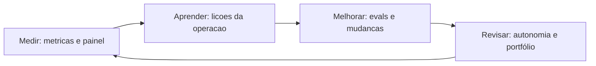

# Capítulo 19: Operação contínua: iteração, feedback e evolução

## 1. Introdução

O OrquestraIA está em produção, atendendo suporte, vendas e análise. Este capítulo trata do que acontece depois do deploy — o capítulo mais longo da vida do sistema: a **operação contínua** — o ciclo de iteração, feedback e evolução que transforma o sistema em produção em um sistema que melhora com o tempo [8][16]. O deploy não é a chegada: é o ponto de partida da operação, e é a operação — não o projeto — que decide o valor de longo prazo.

Os sistemas de agentes envelhecem rápido se não evoluem: o mundo muda (políticas, produtos, linguagem dos clientes), os erros se acumulam (os mesmos erros repetidos sem lição), e o custo cresce silenciosamente (o contexto que incha, o modelo que fica caro para a tarefa). A operação contínua é a disciplina que impede a degradação: **medir** (as métricas do Capítulo 16), **aprender** (as lições da memória episódica do Capítulo 6), **melhorar** (os evals do Capítulo 13 guiando cada mudança) e **revisar** (a calibração da autonomia do Capítulo 15) [8][18].

Ao final deste capítulo, você será capaz de operar o OrquestraIA como um sistema vivo: o ciclo de feedback da operação, a revisão periódica (a retrospectiva do sistema), o backlog de evolução priorizado por evidência, a gestão de incidentes com lições e a cultura de melhoria contínua que sustenta o sistema ao longo dos anos. Você implementará o loop de operação — o fechamento da jornada que conecta todos os capítulos anteriores em um ciclo contínuo.

## 2. Explica

### O Ciclo de Operação: Medir, Aprender, Melhorar, Revisar

A operação contínua é um ciclo de quatro fases [8][18]:

**Medir**: as métricas do Capítulo 16 rodam continuamente — taxa de sucesso, custo por missão, latência, CSAT, incidentes. O painel é o pulso do sistema: sem medição, a operação é opinião.

**Aprender**: a memória episódica (Capítulo 6) transforma a operação em conhecimento — cada incidente registra a lição, cada missão bem-sucedida registra o padrão. O aprendizado é o que impede a repetição de erros.

**Melhorar**: os evals (Capítulo 13) guiam cada mudança — o golden set protege a qualidade, e o CI/CD (Capítulo 17) promove as melhorias com segurança. Melhorar é um processo medido, não uma torcida.

**Revisar**: a revisão periódica recalibra — a autonomia (Capítulo 15) sobe com evidência de sucesso e desce com incidentes, o portfólio de supervisão muda com os dados, e o backlog de evolução é priorizado pelo impacto medido [9].

### O Feedback da Operação: A Fonte de Verdade

A operação produz a fonte de verdade do sistema: os **dados reais** — as missões que chegaram, os caminhos que o agente percorreu, os erros que cometeu, as aprovações que o humano deu e vetou, o custo que cada missão gerou [8][16]. Esses dados valem mais do que qualquer benchmark: são o golden set em crescimento contínuo — os casos reais que o golden set sintético (Capítulo 13) complementa. A prática recomendada: **todo incidente e toda decisão humana viram caso de teste** — o sistema que errou aprende o caso que não pode mais errar.

### A Degradação Silenciosa

A ameaça da operação não é o erro súbito — é a **degradação silenciosa**: o contexto que incha com regras desatualizadas (Capítulo 5), a memória que acumula ruído (Capítulo 6), o modelo que fica caro para a tarefa (Capítulo 17), a autonomia que ultrapassa a competência (Capítulo 15). A degradação não dispara alarme: as métricas pioram devagar, e sem revisão periódica ninguém percebe até o incidente. A defesa é a rotina: revisão programada com métricas de tendência — não apenas o valor de hoje, mas a direção [8][18].

## 3. Ilustra

### O Jardim que Precisa de Manutenção Constante

O sistema em produção é um jardim: o plantio (o projeto) é uma parte pequena da história — o que faz o jardim florescer é a **manutenção constante**. O jardineiro (o operador) rega (mede), poda (otimiza), aduba (aprende) e replaneja o canteiro conforme as estações (revisa). O jardim abandonado não morre num dia: as ervas (a degradação silenciosa) crescem devagar, e o jardim que era bonito vira mato sem que ninguém tenha visto a transição. O jardineiro que só plantou não tem jardim: tem um projeto que era jardim [8].



### A Analogia do Piloto de Fórmula 1

Uma segunda lente: a equipe de Fórmula 1 durante a temporada. A corrida (o deploy) é um momento; a temporada (a operação) é o campeonato. A equipe mede cada volta (telemetria — o painel), aprende com cada corrida (os dados do circuito — a memória episódica), melhora o carro entre corridas (as mudanças medidas — os evals) e revisa a estratégia (a calibração — a supervisão). A equipe que acha que a vitória na primeira corrida decide o campeonato perde a temporada — o sistema que acha que o deploy decide o valor perde a operação [8][16].

## 4. Técnica

### O Loop de Operação Completo

Vamos implementar o ciclo de operação do OrquestraIA — medir, aprender, melhorar e revisar em um loop contínuo:

```python
# operacao.py — o ciclo de operacao continua do OrquestraIA
import time

class CicloOperacao:
    """Medir -> Aprender -> Melhorar -> Revisar, em loop continuo."""
    def __init__(self, registro, diario_episodico, evals, painel, supervisao):
        self.registro = registro      # RegistroMissao (Cap. 16)
        self.diario = diario_episodico  # MemoriaEpisodica (Cap. 6)
        self.evals = evals            # EvalsRunner (Cap. 13)
        self.painel = painel          # PainelOperacao (Cap. 16)
        self.supervisao = supervisao  # SupervisaoHumana (Cap. 15)

    def rodada(self) -> dict:
        """Uma rodada completa do ciclo de operacao."""
        # 1. MEDIR: le o resumo e os alertas
        resumo = self.registro.resumo()
        alertas = self.painel.alertas()
        # 2. APRENDER: extrai licoes dos episodios
        licoes = self.diario.licoes_recentes(topo=5)
        # 3. MELHORAR: roda os evals e decide a proxima mudanca
        evals_resultado = self.evals.executar()
        # 4. REVISAR: ajusta a calibracao com base nas metricas
        ajustes = []
        if resumo["taxa_sucesso"] >= 0.95:
            ajustes.append("alta taxa de sucesso: considerar subir autonomia leve")
        if any("acima do limite" in a for a in alertas):
            ajustes.append("custo acima do limite: revisar contexto e modelo")
        return {"resumo": resumo, "alertas": alertas, "licoes": licoes,
                "evals_taxa": evals_resultado["taxa_sucesso"], "ajustes": ajustes}

    def revisar_autonomia(self, relatorio: dict) -> None:
        """Revisa a calibracao de autonomia com base na evidencia."""
        taxa = relatorio["evals_taxa"]
        # a autonomia e uma concessao medida (Cap. 15)
        if taxa >= 0.95 and not relatorio["alertas"]:
            self.supervisao.limiar_autonomia = min(
                self.supervisao.limiar_autonomia * 1.1, 0.95)
            print(f"autonomia ajustada para {self.supervisao.limiar_autonomia:.2f}")
        elif taxa < 0.85:
            self.supervisao.limiar_autonomia = max(
                self.supervisao.limiar_autonomia * 0.9, 0.5)
            print(f"autonomia reduzida para {self.supervisao.limiar_autonomia:.2f}")

# Uso:
# ciclo = CicloOperacao(registro, diario, evals, painel, supervisao)
# relatorio = ciclo.rodada()
# print(json.dumps(relatorio, ensure_ascii=False, indent=1))
# ciclo.revisar_autonomia(relatorio)
```

Repare no fechamento do ciclo: **medir** (o resumo e os alertas), **aprender** (as lições da memória episódica), **melhorar** (os evals como medida da qualidade) e **revisar** (a autonomia que sobe com evidência e desce com risco — a disciplina do Capítulo 15 em loop).

### O Backlog de Evolução Priorizado por Evidência

A evolução do sistema não é uma lista de desejos: é um **backlog priorizado por evidência** — cada item com a métrica que justifica:

```python
# backlog.py — evolucao priorizada por evidencia medida
@dataclass
class ItemEvolucao:
    """Um item de evolucao com a evidencia que o justifica."""
    titulo: str
    dominio: str
    evidencia: str      # o dado da operacao que justifica
    impacto_estimado: str  # ex.: "reduz custo 30% no dominio analise"
    esforco: str        # baixo/medio/alto

def priorizar(backlog: list) -> list:
    """Ordena pelo impacto potencial (heuristica: impacto x esforco)."""
    pesos = {"alto": 3, "medio": 2, "baixo": 1}
    return sorted(backlog, key=lambda i: (
        pesos[i.impacto_estimado.split(" ")[0].lower()] if False else 0),
        reverse=False) if not backlog else backlog

# Exemplos de itens com evidencia da operacao:
# ItemEvolucao("reduzir contexto de analise", "analise",
#              "custo por missao de analise 40% acima da media",
#              "reduz custo 40%", "baixo")
# ItemEvolucao("adicionar ferramenta de previsao", "vendas",
#              "12 pedidos de previsao no mes",
#              "novo caso de uso", "medio")
```

A regra do backlog: **todo item cita a evidência** — o item sem evidência não entra, porque a evolução sem medida é a degradação silenciosa com outro nome.

### A Gestão de Incidentes com Lições

O incidente é a melhor fonte de aprendizado — se for tratado com método:

```python
# incidentes.py — a gestao de incidentes com licoes
class GestorIncidentes:
    """Registra, analisa e aprende com incidentes."""
    def __init__(self, diario):
        self.diario = diario

    def registrar(self, missao: str, erro: str, causa: str, licao: str) -> None:
        """Registra o incidente com causa e licao (fecha o aprendizado)."""
        self.diario.registrar(missao, f"INCIDENTE: {erro}", False, licao)
        print(f"[incidente] {missao[:40]}\n  causa: {causa}\n  licao: {licao}")

    def relatorio_periodico(self) -> list:
        """As licoes do periodo — a base da revisao."""
        return self.diario.licoes_recentes(topo=10)

# Uso:
# gestor = GestorIncidentes(diario)
# gestor.registrar("consultar pedido P-9999", "pedido nao encontrado",
#                  "ID mal formatado na missao", "validar formato P-#### antes de consultar")
```

A disciplina do incidente: registrar (o fato), analisar (a causa), aprender (a lição) — e a lição vira regra no contexto ou caso no golden set, fechando o ciclo entre a operação e a evolução [8].

### Checklist de Operação

- [ ] O ciclo **medir → aprender → melhorar → revisar** roda periodicamente?
- [ ] Incidentes e decisões humanas viram **casos de teste** do golden set?
- [ ] O backlog de evolução tem **evidência** em cada item?
- [ ] A **autonomia** sobe com evidência e desce com risco (revisão periódica)?
- [ ] As **tendências** (não só os valores) são monitoradas — a degradação silenciosa é detectada?

## 5. Aplica

### Operação no Chão de Fábrica

A operação contínua é a diferença entre os sistemas que entregam valor por anos e os que morrem no primeiro semestre. O mercado mostra o padrão: a maioria dos pilotos não escala porque a operação — medição, aprendizado e revisão — não foi desenhada [8][18]. Os sistemas que sustentam o valor têm três características: **medem continuamente** (o painel decide, não a intuição), **aprendem com a operação** (os incidentes viram lições e casos de teste) e **revisam a autonomia** (a confiança cresce com evidência — Capítulo 15) [8][9].

A lição mais importante da operação: **o sistema certo não é o que nunca erra — é o que erra, aprende e melhora**. O erro é inevitável em sistemas probabilísticos; a repetição do erro é que é inaceitável. A operação contínua é exatamente isso: o mecanismo que transforma cada erro em lição e cada lição em melhoria [8][18].

### Armadilhas Comuns

1. **Operar sem medir**: o painel que ninguém lê ou as métricas que não existem — a operação vira opinião.
2. **Erro sem lição**: incidentes resolvidos e esquecidos — o erro repetido é a falha da operação, não do sistema.
3. **Autonomia congelada**: a calibração do Capítulo 15 que nunca é revisada — o sistema fica preso (ou solto) sem evidência.
4. **Backlog sem evidência**: evoluir por achismo — cada item deve citar a métrica que o justifica.
5. **Degradação invisível**: monitorar o valor de hoje sem a tendência — a degradação silenciosa mata sem alarme.

### Conexão com o OrquestraIA

O `CicloOperacao` fecha a jornada do OrquestraIA: mede com o registro (Capítulo 16), aprende com o diário episódico (Capítulo 6), melhora com os evals (Capítulo 13) e revisa a autonomia (Capítulo 15) — o sistema inteiro como um ciclo contínuo, pronto para o Capítulo 20, que olha para o profissional que opera essa máquina.

### Aprofundamento: A Retrospectiva Estruturada do Sistema

A revisão periódica do capítulo ganha estrutura com a **retrospectiva do sistema** — a reunião regular (semanal ou quinzenal) que examina o relatório do `CicloOperacao` com método. A pauta tem cinco itens fixos: **o que medimos** (as métricas e tendências do painel — o que mudou desde a última), **o que aprendemos** (as lições da memória episódica e os incidentes do período), **o que melhoramos** (as mudanças promovidas e os evals que as validaram), **o que revisitamos** (a autonomia, as políticas e o portfólio de supervisão — com a evidência que justifica cada ajuste) e **o que vem** (o backlog priorizado por evidência do Capítulo 19). A retrospectiva é o ponto onde a operação vira decisão: sem ela, as métricas acumulam sem ação; com ela, o sistema evolui deliberadamente [8].

A retrospectiva tem uma regra de ouro: **a evidência manda, a intuição sugere** — o item do backlog entra com a métrica que o justifica, o ajuste de autonomia entra com a taxa que o suporta, e a mudança de política entra com o incidente que a motivou. A regra é o que impede a retrospectiva de virar reunião de opiniões: o método do Capítulo 13 é o árbitro de toda decisão [8][4].

### O Runbook de Operação: Procedimentos que Não Dependem de Quem Está de Plantão

A operação contínua depende de procedimentos que não dependem de memória de quem está de plantão: o **runbook** — o documento de procedimentos operacionais com o passo a passo de cada situação. Os runbooks essenciais do sistema de agentes: **alerta de custo** (quem é acionado, o que verificar — contexto? modelo? — e as alavancas de redução), **queda de provedor** (o fallback do Capítulo 17 e o procedimento de comunicação), **regressão detectada** (o rollback do Capítulo 17 e a investigação com o golden set do Capítulo 13), **incidente de segurança** (a contenção — desligar a ferramenta, revogar o token — e a análise com lição do Capítulo 19) e **pedido de autonomia** (o processo de revisão com evidência do Capítulo 15). O runbook é o que torna a operação sustentável: o sistema não depende de heróis — depende de procedimentos testados [8].

### Aprofundamento: A Economia da Operação — O Ciclo de Custo

A operação contínua tem uma dimensão econômica que o Capítulo 16 iniciou e que aqui fecha o ciclo: o **custo é uma métrica de operação, não de projeto** — e a gestão contínua do custo é o que mantém o sistema sustentável. O ciclo tem quatro momentos: **orçar** (o teto de custo por missão e por período — o Capítulo 16), **medir** (o custo real por domínio e por tipo de missão — onde o dinheiro vai), **otimizar** (as alavancas do Capítulo 16 — contexto, memória, modelo, cache — cada uma medida antes e depois) e **revisar** (o custo entra na retrospectiva do sistema com o mesmo rigor das métricas de qualidade — o item de backlog de custo cita a evidência, como qualquer outro). A economia da operação é a disciplina que impede o custo silencioso de corroer o valor: o sistema que entrega ótima qualidade a custo insustentável não entrega valor — entrega prejuízo adiado [8][16].

### O Encerramento Ordenado: Quando Desligar um Sistema

A operação contínua também inclui o fim: o **encerramento ordenado** — a decisão documentada de desligar um sistema ou um domínio que não entrega mais valor. Os sinais de encerramento são métricos: a taxa de sucesso que não recupera apesar das melhorias (Capítulo 13), o custo por missão que não baixa apesar das otimizações (Capítulo 16) e a demanda que migrou para outro canal. O encerramento ordenado tem quatro passos: **comunicar** (os usuários e o time sabem o prazo e a alternativa), **congelar** (sem novas mudanças — o sistema entra em modo de manutenção), **migrar** (os fluxos vão para o sucessor, com o golden set validando a paridade — Capítulo 13) e **arquivar** (os dados, as lições e os artefatos são preservados — a memória episódica do Capítulo 6 guarda o aprendizado para o próximo sistema). O encerramento ordenado é a prova final da maturidade operacional: saber terminar é parte de saber operar [8].

## 6. Conclusão

Três pontos para levar: **primeiro**, a operação contínua é o ciclo medir → aprender → melhorar → revisar — e a medição, o aprendizado e a revisão são o que impedem a degradação silenciosa do sistema. **Segundo**, a operação é a fonte de verdade: incidentes e decisões humanas viram casos de teste, e o backlog de evolução cita evidência em cada item. **Terceiro**, a autonomia é revisada com evidência — sobe com sucesso, desce com risco — e o sistema certo não é o que nunca erra, é o que erra, aprende e melhora.

O próximo capítulo encerra a obra com o olhar no profissional: **o engenheiro de sistemas agênticos** — as habilidades, o perfil e a carreira de quem projeta, constrói e opera sistemas como o OrquestraIA.

**Desafio opcional**: implemente o `CicloOperacao` no seu sistema e rode uma rodada real: qual a sua taxa de sucesso medida? Quais alertas dispararam? Quais lições a sua operação já tem? Registre três itens de backlog com evidência — essa é a sua primeira retrospectiva operacional.

## 7. Referências

[1] ADIMULAM, A.; GUPTA, R.; KUMAR, S. *The Orchestration of Multi-Agent Systems: Architectures, Protocols, and Enterprise Adoption*. arXiv:2601.13671v1, 2026. Disponível em: https://arxiv.org/html/2601.13671v1. Acesso em: 07 ago. 2026.

[2] AMAZON WEB SERVICES (AWS). *Traditional agent architecture: perceive, reason, act*. AWS Prescriptive Guidance: Foundations of Agentic AI on AWS, 2026. Disponível em: https://docs.aws.amazon.com/prescriptive-guidance/latest/agentic-ai-foundations/traditional-agents.html. Acesso em: 07 ago. 2026.

[3] ANTHROPIC. *Building Effective Agents*. 2024. Disponível em: https://www.anthropic.com/engineering/building-effective-agents. Acesso em: 07 ago. 2026.

[4] ANTHROPIC. *Demystifying Evals for AI Agents*. 2026. Disponível em: https://www.anthropic.com/engineering/demystifying-evals-for-ai-agents. Acesso em: 07 ago. 2026.

[5] CERBOS. *AI Agents, the Model Context Protocol, and the Future of Authorization Guardrails*. 2026. Disponível em: https://www.cerbos.dev/news/securing-ai-agents-model-context-protocol. Acesso em: 07 ago. 2026.

[6] COALITION FOR SECURE AI (CoSAI). *Securing the AI Agent Revolution: A Practical Guide to Model Context Protocol Security*. 2026. Disponível em: https://www.coalitionforsecureai.org/securing-the-ai-agent-revolution-a-practical-guide-to-mcp-security/. Acesso em: 07 ago. 2026.

[7] DIGITAL APPLIED. *State of AI Agents 2026: 200+ Data Points Compiled*. 2026. Disponível em: https://www.digitalapplied.com/blog/state-of-ai-agents-2026-200-data-points. Acesso em: 07 ago. 2026.

[8] FIN.AI. *AI Agent ROI: Customer Support Returns*. 2026. Disponível em: https://fin.ai/blog/ai-agent-roi-customer-support. Acesso em: 07 ago. 2026.

[9] GALILEO. *How to Build Human-in-the-Loop Oversight for Production AI Agents*. 2026. Disponível em: https://galileo.ai/blog/human-in-the-loop-agent-oversight. Acesso em: 07 ago. 2026.

[10] GARTNER. *Gartner Predicts 40% of Enterprise Apps Will Feature Task-Specific AI Agents by 2026*. 2025. Disponível em: https://www.gartner.com/en/newsroom/press-releases/2025-08-26-gartner-predicts-40-percent-of-enterprise-apps-will-feature-task-specific-ai-agents-by-2026-up-from-less-than-5-percent-in-2025. Acesso em: 07 ago. 2026.

[11] GOOGLE CLOUD. *Choose a Design Pattern for Your Agentic AI System*. Cloud Architecture Center, 2026. Disponível em: https://docs.cloud.google.com/architecture/choose-design-pattern-agentic-ai-system. Acesso em: 07 ago. 2026.

[12] GUO, Taicheng et al. *Large Language Model based Multi-Agents: A Survey of Progress and Challenges*. IJCAI, 2024. Disponível em: https://arxiv.org/abs/2402.01680. Acesso em: 07 ago. 2026.

[13] HONG, Sirui et al. *MetaGPT: Meta Programming for A Multi-Agent Collaborative Framework*. ICLR, 2024. Disponível em: https://arxiv.org/abs/2308.00352. Acesso em: 07 ago. 2026.

[14] LANGCHAIN TEAM. *Context Engineering for Agents*. 2025. Disponível em: https://www.langchain.com/blog/context-engineering-for-agents. Acesso em: 07 ago. 2026.

[15] LANGCHAIN TEAM. *LangMem SDK for Agent Long-Term Memory*. 2025. Disponível em: https://www.langchain.com/blog/langmem-sdk-launch. Acesso em: 07 ago. 2026.

[16] LANGCHAIN. *The Best AI Agent Frameworks in 2026*. 2026. Disponível em: https://www.langchain.com/resources/ai-agent-frameworks. Acesso em: 07 ago. 2026.

[17] LIU, Xiao et al. *AgentBench: Evaluating LLMs as Agents*. ICLR, 2025. Disponível em: https://arxiv.org/abs/2308.03688. Acesso em: 07 ago. 2026.

[18] MCKINSEY & COMPANY. *State of AI Trust in 2026: Shifting to the Agentic Era*. 2026. Disponível em: https://www.mckinsey.com/capabilities/tech-and-ai/our-insights/tech-forward/state-of-ai-trust-in-2026-shifting-to-the-agentic-era. Acesso em: 07 ago. 2026.

[19] MEM0 ENGINEERING TEAM. *AI Agent Memory 2026: Progress Benchmark Report Evaluations*. 2026. Disponível em: https://mem0.ai/blog/state-of-ai-agent-memory-2026. Acesso em: 07 ago. 2026.

[20] MICROSOFT AZURE ARCHITECTURE CENTER. *AI Agent Orchestration Patterns*. 2026. Disponível em: https://learn.microsoft.com/en-us/azure/architecture/ai-ml/guide/ai-agent-design-patterns. Acesso em: 07 ago. 2026.

[21] ORACLE DEVELOPERS. *What Is the AI Agent Loop? The Core Architecture Behind Autonomous AI Systems*. 2026. Disponível em: https://blogs.oracle.com/developers/what-is-the-ai-agent-loop-the-core-architecture-behind-autonomous-ai-systems. Acesso em: 07 ago. 2026.

[22] QIAN, Chen et al. *ChatDev: Communicative Agents for Software Development*. ACL, 2024. Disponível em: https://arxiv.org/abs/2307.07924. Acesso em: 07 ago. 2026.

[23] SALESFORCE. *New Research: AI Service Agents Improve Customer Satisfaction*. 2026. Disponível em: https://www.salesforce.com/news/stories/ai-service-agents-improve-customer-satisfaction/. Acesso em: 07 ago. 2026.

[24] VALIDMIND. *Top 10 AI Risk Trends for 2026*. 2026. Disponível em: https://validmind.com/blog/10-ai-risk-trends-for-2026/. Acesso em: 07 ago. 2026.

[25] WANG, Lei et al. *A Survey on Large Language Model based Autonomous Agents*. arXiv:2308.11432, 2025. Disponível em: https://arxiv.org/abs/2308.11432. Acesso em: 07 ago. 2026.

[26] XI, Zhiheng et al. *The Rise and Potential of Large Language Model Based Agents: A Survey*. arXiv:2309.07864, 2023. Disponível em: https://arxiv.org/abs/2309.07864. Acesso em: 07 ago. 2026.

[27] YAO, Shunyu et al. *ReAct: Synergizing Reasoning and Acting in Language Models*. ICLR, 2023. Disponível em: https://arxiv.org/abs/2210.03629. Acesso em: 07 ago. 2026.

[28] ZENITY. *What Is the Model Context Protocol? Full Guide*. 2026. Disponível em: https://zenity.io/academy/model-context-protocol-explained. Acesso em: 07 ago. 2026.

[29] DORA / GOOGLE CLOUD. *DORA: State of AI-assisted Software Development 2025*. 2025. Disponível em: https://dora.dev/dora-report-2025/. Acesso em: 07 ago. 2026.

[30] UVIK SOFTWARE. *Agentic AI Frameworks 2026: Production Comparison*. 2026. Disponível em: https://uvik.net/blog/agentic-ai-frameworks/. Acesso em: 07 ago. 2026.

[31] TRUEFOUNDRY. *6 Best LLM Gateways in 2026*. 2026. Disponível em: https://www.truefoundry.com/blog/best-llm-gateways. Acesso em: 07 ago. 2026.

[32] BRAINTRUST. *AI Gateway Comparison: The 6 Best Ranked (2026)*. 2026. Disponível em: https://www.braintrust.dev/articles/ai-gateway-comparison-2026. Acesso em: 07 ago. 2026.

[33] MAXIM AI. *Best Enterprise LLM Gateways in 2026: A Comparative Guide*. 2026. Disponível em: https://www.getmaxim.ai/articles/best-enterprise-llm-gateways-in-2026-a-comparative-guide/. Acesso em: 07 ago. 2026.
