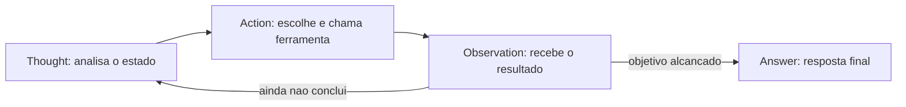

# Capítulo 4: Fundamentos científicos: ReAct, memória e planejamento

## 1. Introdução

Os capítulos anteriores ensinaram o *como* — o loop, as arquiteturas. Este capítulo ensina o *porquê*: os fundamentos científicos que explicam por que os padrões funcionam, quais são seus limites documentados e como essa teoria orienta decisões práticas. Você vai conhecer o padrão **ReAct** — raciocínio e ação intercalados — que é a espinha dorsal de praticamente todos os sistemas de agentes modernos [25], os modelos de **memória** que transformam agentes de conversadores em sistemas que aprendem [22], e as abordagens de **planejamento** que permitem decompor missões complexas em passos executáveis [23].

A pesquisa acadêmica sobre agentes baseados em LLM amadureceu rapidamente. Os levantamentos de Wang et al. e Xi et al. mapeiam o campo em três dimensões — perfil, memória e planejamento — que correspondem exatamente às decisões de arquitetura que você tomou nos capítulos anteriores [23][24]. O padrão ReAct, publicado por Yao et al., demonstrou que intercalar raciocínio (pensamento) e ação (execução de ferramenta) supera tanto o raciocínio puro quanto a execução pura [25]. E os benchmarks de avaliação — AgentBench e sucessores — mostram que LLMs como agentes ainda têm lacunas estruturais de desempenho que o design compensa [19].

Ao final deste capítulo, você será capaz de explicar por que um agente ReAct funciona, implementar uma memória de curto e longo prazo com embeddings, e aplicar técnicas de planejamento com re-planejamento — e saberá citar a evidência por trás de cada escolha. A teoria não é adorno: é o que permite prever o comportamento do sistema antes de ele falhar em produção.

## 2. Explica

### ReAct: Raciocínio e Ação Intercalados

O padrão ReAct (Reasoning + Acting) nasceu de uma observação empírica: LLMs que apenas raciocinam (chain-of-thought) produzem pensamentos coerentes mas sem contato com o mundo; LLMs que apenas agem (chamadas de ferramenta) agem sem coerência estratégica [25]. O ReAct intercala os dois: o modelo produz um **Thought** (raciocínio sobre o estado atual), uma **Action** (qual ferramenta chamar e com quais argumentos) e, ao receber a **Observation** (resultado da ferramenta), produz o próximo Thought — criando uma trilha de raciocínio ancorada em evidências [25].

Os resultados empíricos são o que importa: no artigo original, ReAct superou significativamente as abordagens anteriores em tarefas de raciocínio com ferramentas e em tarefas de decisão, com a vantagem adicional de produzir trilhas interpretáveis — cada decisão vem acompanhada do raciocínio que a gerou [25]. É essa **interpretabilidade** que faz do ReAct o padrão de produção: a trilha de pensamentos é o material que a auditoria e a depuração vão consumir (Capítulo 16).

### Memória: O Que o Agente Lembra e Por Quanto Tempo

A memória é o que separa o agente que reage do agente que aprende. A taxonomia acadêmica e de mercado convergem em três camadas [23][22]:

**Memória de curto prazo (contexto)**: o conteúdo da janela de contexto da conversa atual. É a memória do loop do Capítulo 2. Barata e imediata, mas limitada pela janela do modelo e custa tokens a cada reenvio.

**Memória de longo prazo (persistente)**: fatos, preferências e resultados que sobrevivem entre sessões — armazenados em banco (vetorial ou relacional). É o que permite ao agente lembrar o cliente que preferiu contato por e-mail ou a política de reembolso que mudou no mês passado [22].

**Memória de trabalho (procedural)**: as "habilidades" — o que o agente aprendeu a fazer. No estado da arte, a memória de longo prazo alimenta o contexto de forma seletiva, e a recuperação é o ponto crítico: recuperar o contexto errado degrada mais do que não recuperar nada [16][22].

### Planejamento: De Missão a Passos

O planejamento é a capacidade de decompor uma missão em uma sequência de passos. Três abordagens dominam [23]:

**Planejamento sem plano explícito (intrínseco)**: o modelo decide o próximo passo a cada iteração, sem plano declarado. Simples, mas sem visão de longo prazo — tende a se perder em missões longas.

**Planejamento com plano explícito**: o modelo escreve um plano de passos antes de executar, e executa um a um. Melhor em missões compostas, mas o plano inicial pode ficar obsoleto.

**Planejamento com re-planejamento**: o modelo escreve o plano, executa, e **revisa o plano** quando as observações divergem do esperado. É o estado da arte: combina a visão do plano com a flexibilidade do ajuste contínuo [23][25].

A escolha entre as três não é estética: é calibrada pela incerteza da tarefa. Tarefas determinísticas merecem plano explícito (ou nem isso); tarefas incertas merecem re-planejamento.

## 3. Ilustra

### O Detetive que Verifica Cada Pista

ReAct é o método do detetive competente. O detetive iniciante escolhe uma hipótese e corre atrás dela — raciocínio sem verificação. O detetive obsessivo verifica tudo antes de pensar — ação sem estratégia. O detetive ReAct faz as duas coisas em alternância: **pensa** ("se o cliente diz que o pedido atrasou, a transportadora é a fonte primária"), **age** (consulta a transportadora), **observa** (o rastreio mostra extravio), **repensa** ("então a política de reembolso se aplica"), **age** (aciona a reposição) e só **conclui** quando a cadeia de evidências fecha [25].



### A Agenda do Executivo Ocupado

O planejamento é a agenda do executivo ocupado. O executivo que decide tudo no momento vive apagando incêndios — é o planejamento intrínseco: funcional, mas sem direção. O executivo que escreve a agenda da semana e a segue cegamente descobre que o imprevisto quebrou a semana — é o plano explícito: estruturado, mas rígido. O executivo competente escreve a agenda **e a revisa a cada manhã**: o imprevisto entra, a prioridade muda, o plano se adapta sem perder o norte — é o **re-planejamento**: a visão da missão com a flexibilidade da realidade [23]. No OrquestraIA, cada missão recebe um plano, e cada observação divergente dispara uma revisão do plano — a mesma disciplina do executivo.

### A Memória do Bibliotecário

A memória é o bibliotecário ideal. Ele não memoriza todos os livros (janela de contexto): ele cataloga com cuidado (armazenamento) e, quando perguntado, recupera os três livros certos (recuperação seletiva). O mau bibliotecário traz uma pilha de livros aleatórios (recuperação sem seleção — o erro mais comum) ou jura de memória (alucinação). A qualidade da memória não está no tamanho do acervo: está na qualidade da recuperação [22][16].

## 4. Técnica

### Implementando ReAct com Memória de Curto Prazo

A implementação a seguir materializa o ciclo ReAct explicitamente, com trilha de pensamentos — a estrutura que o auditor vai consumir:

```python
# react_agente.py — ciclo ReAct explícito com trilha interpretável
class AgenteReAct:
    """Agente ReAct: pensamento -> acao -> observacao, com trilha."""
    def __init__(self, llm, ferramentas, limite_passos=6):
        self.llm = llm
        self.ferramentas = ferramentas
        self.limite = limite_passos
        self.trilha = []  # interpretabilidade: pensamentos e acoes

    def executar(self, missao: str) -> str:
        estado = missao
        for _ in range(self.limite):
            # Thought: o modelo raciocina sobre o estado
            pensamento = self.llm.chamar_simples(
                "Pense sobre o estado atual e decida: qual ferramenta usar, "
                "com quais argumentos, ou responda FINAL:<resposta>.\n"
                f"Ferramentas: {list(self.ferramentas.keys())}\n"
                f"Estado: {estado}")
            self.trilha.append({"tipo": "thought", "conteudo": pensamento})
            if pensamento.startswith("FINAL:"):
                return pensamento[6:].strip()
            # Action: parseia a decisao (formato acao(arg1=..., arg2=...))
            import re
            m = re.match(r"(\w+)\((.+)\)", pensamento.strip())
            if not m:
                self.trilha.append({"tipo": "erro", "conteudo": "formato invalido"})
                estado = f"Erro de formato na resposta do modelo: {pensamento}"
                continue
            nome, args_txt = m.group(1), m.group(2)
            args = dict(re.findall(r"(\w+)=([^,]+)", args_txt))
            # Observation: executa e devolve o resultado
            try:
                observacao = self.ferramentas[nome](**args)
            except Exception as e:
                observacao = f"ERRO: {e}"
            self.trilha.append({"tipo": "acao", "ferramenta": nome, "args": args,
                                "observacao": observacao[:120]})
            estado = f"Observacao de {nome}: {observacao}"
        return "Limite de passos atingido sem concluir."

# uso (ferramentas do Cap. 2):
# agente = AgenteReAct(llm, {"consultar_estoque": consultar_estoque, ...})
# print(agente.executar("O cliente quer o estoque do x-300"))
# print(agente.trilha)  # a trilha interpretavel para auditoria
```

Repare que a trilha de pensamentos é **parte do contrato**, não um log opcional: ela é o material de auditoria do Capítulo 16 e o insumo dos evals do Capítulo 13.

### Memória de Longo Prazo com Embeddings

A memória persistente usa embeddings: fatos viram vetores num banco vetorial; na recuperação, calcula-se a similaridade entre a consulta e os fatos armazenados, retornando os mais relevantes:

```python
# memoria_longoprazo.py — memória persistente com recuperação vetorial
import sqlite3

class MemoriaLongoPrazo:
    """Memoria persistente com recuperacao por similaridade de texto."""
    def __init__(self, caminho_db: str, gerar_embedding):
        self.con = sqlite3.connect(caminho_db)
        self.con.execute("""
            CREATE TABLE IF NOT EXISTS memorias (
                id INTEGER PRIMARY KEY,
                texto TEXT, chave TEXT, criado_em TEXT DEFAULT CURRENT_TIMESTAMP
            )""")
        self.con.commit()
        self.gerar_embedding = gerar_embedding  # funcao que gera vetores

    def lembrar(self, texto: str, chave: str = "") -> None:
        self.con.execute("INSERT INTO memorias (texto, chave) VALUES (?, ?)",
                         (texto, chave))
        self.con.commit()

    def recuperar(self, consulta: str, topo: int = 3) -> list:
        """Recuperacao por similaridade (fallback: correspondencia por palavra)."""
        vetor_consulta = self.gerar_embedding(consulta)
        linhas = self.con.execute("SELECT texto FROM memorias").fetchall()
        # Exemplo simplificado: se voce tem vetores, use cosseno.
        # Aqui usamos a contagem de termos comuns como proxy pedagogico.
        def pontuar(texto):
            return sum(1 for t in consulta.lower().split()
                       if t in texto.lower())
        melhores = sorted(linhas, key=lambda r: -pontuar(r[0]))[:topo]
        return [m[0] for m in melhores]

# Uso:
# def embed(t): return t  # no real: sentence-transformers / API de embedding
# memoria = MemoriaLongoPrazo("orquestraia.db", embed)
# memoria.lembrar("Cliente Maria prefere contato por e-mail")
# memoria.lembrar("Politica de reembolso: 30 dias para produtos digitais")
# contexto = memoria.recuperar("como a maria quer ser contatada")
```

A decisão de engenharia central da memória: **o que entra na janela de contexto**. Recuperar demais polui o contexto e custa tokens; recuperar de menos deixa o agente cego. A calibração é empírica — e é exatamente o que os evals do Capítulo 13 medem [22][16].

### Planejamento com Re-Planejamento

O planejador produz um plano, executa-o passo a passo e revisa quando a observação diverge:

```python
# planejador.py — planejamento com re-planejamento
class PlanejadorReplano:
    """Plano explicito com revisao quando a realidade diverge."""
    def __init__(self, llm, agente):
        self.llm = llm
        self.agente = agente

    def planejar(self, missao: str) -> list:
        plano = self.llm.chamar_simples(
            "Decomponha a missao em 3-5 passos objetivos, um por linha:\n"
            f"Missao: {missao}")
        return [p.strip() for p in plano.splitlines() if p.strip()]

    def executar(self, missao: str) -> str:
        plano = self.planejar(missao)
        resultados = []
        for passo in plano:
            resultado = self.agente.executar(passo)
            resultados.append((passo, resultado))
            # Re-planejamento: pergunta ao modelo se o plano segue valido
            revisar = self.llm.chamar_simples(
                "O plano ainda e o melhor caminho? Se sim responda SIM; "
                "se nao, proponha um novo plano, um passo por linha.\n"
                f"Passo executado: {passo}\nResultado: {resultado}\n"
                f"Plano restante: {plano[plano.index(passo)+1:]}")
            if revisar.strip().upper() != "SIM":
                plano = [p.strip() for p in revisar.splitlines() if p.strip()]
        return "\n".join(f"PASSO: {p}\nRESULTADO: {r}" for p, r in resultados)

# Uso:
# plano = PlanejadorReplano(llm, agente)
# print(plano.executar("Diagnosticar por que o pedido P-7841 atrasou e"
#                      " propor a compensacao ao cliente"))
```

### Checklist Científico

- [ ] O agente intercala **pensamento e ação** (ReAct) com trilha interpretável?
- [ ] A memória de longo prazo tem **recuperação seletiva** — e a seletividade é medida?
- [ ] O planejamento é calibrado à **incerteza da tarefa** (re-planejamento para tarefas incertas)?
- [ ] Cada escolha de design tem **evidência** (paper ou benchmark) citável?

## 5. Aplica

### A Teoria no Chão de Fábrica

A teoria dos fundamentos não fica na academia: ela decide o comportamento em produção. O padrão ReAct explica por que os agentes de suporte melhoram a satisfação: cada interação é uma cadeia de pensamento-ação-observação ancorada em sistemas reais, com trilha auditável — a mesma estrutura que permite melhorar o sistema com base em evidência [27][10]. A memória de longo prazo é o que permite ao agente lembrar preferências entre sessões — o diferencial que transforma atendimento em relacionamento [22]. E o planejamento com re-planejamento é o que permite missões longas, como o diagnóstico de uma cadeia de falhas, sem que o agente se perca [23].

Os benchmarks ajudam a calibrar expectativas: o AgentBench mostrou que o desempenho de LLMs como agentes varia enormemente entre ambientes e tarefas, e que a robustez é o gargalo — não a capacidade bruta [19]. Na prática, isso significa: meça o seu agente no seu domínio (Capítulo 13), não confie em números gerais.

### Armadilhas Comuns

1. **Agente sem trilha**: um ReAct sem registro de pensamentos é um sistema sem memória de si — impossível de depurar e de auditar.
2. **Memória sem recuperação seletiva**: despejar o acervo inteiro na janela de contexto degrada a qualidade e explode o custo.
3. **Plano rígido em tarefas incertas**: o plano explícito sem revisão quebra quando o mundo diverge — sempre calibre o re-planejamento.
4. **Citar teoria sem medir**: "o ReAct funciona" não substitui a avaliação do seu caso específico — meça antes e depois.

### Conexão com o OrquestraIA

O OrquestraIA incorpora os três fundamentos: cada agente especialista roda o ciclo ReAct com trilha (este capítulo), a memória de longo prazo vira o módulo de memória (Capítulo 6), e o orquestrador usa planejamento com re-planejamento para missões compostas (Capítulo 10).

### Aprofundamento: A Evidência Empírica dos Fundamentos

Os três fundamentos deste capítulo não são crenças — são resultados medidos, e conhecer a evidência ajuda a calibrar as expectativas de cada técnica. O artigo original do ReAct demonstrou o ganho sobre as abordagens anteriores em tarefas de raciocínio com ferramentas e decisão, com a vantagem adicional da trilha interpretável [25]. Os benchmarks de avaliação de agentes — AgentBench e sucessores — mostraram que o desempenho de LLMs como agentes varia enormemente entre ambientes, e que a robustez é o gargalo estrutural: o modelo que é excelente num ambiente pode ser frágil em outro [17]. A mensagem prática: a evidência da literatura define o que é possível; a evidência do seu domínio (Capítulo 13) define o que é real para você.

A memória tem o mesmo padrão de evidência: os benchmarks de memória de agentes medem a recuperação em cenários progressivos, e a lição central é que a qualidade está na recuperação seletiva, não no acervo [22]. O custo da memória também é medível: cada token de contexto reenviado em cada iteração multiplica o custo do loop — a memória compactada do Capítulo 6 é, além de qualidade, economia (Capítulo 16).

### A Taxonomia Comportamental: O Que a Pesquisa Mapeou

Os levantamentos acadêmicos consolidaram uma taxonomia de comportamento dos agentes que orienta o design: **perfil** (a persona e o papel do agente), **memória** (curto, longo e de trabalho), **planejamento** (intrínseco, explícito, com re-planejamento), **ferramentas** (a interface com o mundo) e **aprendizado** (a capacidade de melhorar com a experiência) [25][23]. Cada elemento da taxonomia corresponde a um capítulo desta obra — e a lição é que o agente completo é o que cobre os cinco elementos com engenharia, não o que tem o melhor modelo. O modelo é um dos cinco; os outros quatro são decisões de arquitetura que este livro ensinou a construir [3].

### O Padrão de Verificação Cruzada

O último refinamento dos fundamentos é a **verificação cruzada** — a técnica de validar o comportamento do agente por mais de uma via: a trilha (o que ele decidiu), a observação (o que o mundo respondeu) e a avaliação (o que o golden set diz). Quando as três vias concordam, o comportamento é confiável; quando divergem, o ponto de divergência é o defeito a investigar [4]. O padrão é simples de implementar — basta que o registro (Capítulo 16) capture as três vias da mesma missão — e é o que torna a depuração de agentes possível: em vez de adivinhar por que o sistema errou, você compara as vias e encontra a divergência.

## 6. Conclusão

Três pontos para levar: **primeiro**, o ReAct — intercalar raciocínio e ação — é o padrão científico que sustenta os agentes modernos, com a vantagem decisiva da trilha interpretável para auditoria. **Segundo**, a memória tem três camadas — curto prazo, longo prazo e procedural — e a qualidade do sistema está na recuperação seletiva, não no tamanho do acervo. **Terceiro**, o planejamento deve ser calibrado à incerteza da tarefa, com re-planejamento como estado da arte para missões longas.

O próximo capítulo inicia a Parte II — Projetando o Sistema — com a primeira camada de engenharia: contexto. Você vai aprender a projetar o contexto do agente com instruções, exemplos e recuperação — a base que determina, mais do que qualquer outra escolha, a qualidade do comportamento.

**Desafio opcional**: implemente a memória de longo prazo com um banco vetorial real (ex.: `sqlite-vec` ou `chromadb`) e meça a precisão da recuperação em 20 perguntas sobre 50 fatos. Varie o `topo` (1, 3, 5) e registre onde a qualidade degrada — esse experimento de 30 minutos é a sua primeira lição de evals.

## 7. Referências

[1] ADIMULAM, A.; GUPTA, R.; KUMAR, S. *The Orchestration of Multi-Agent Systems: Architectures, Protocols, and Enterprise Adoption*. arXiv:2601.13671v1, 2026. Disponível em: https://arxiv.org/html/2601.13671v1. Acesso em: 07 ago. 2026.

[2] AMAZON WEB SERVICES (AWS). *Traditional agent architecture: perceive, reason, act*. AWS Prescriptive Guidance: Foundations of Agentic AI on AWS, 2026. Disponível em: https://docs.aws.amazon.com/prescriptive-guidance/latest/agentic-ai-foundations/traditional-agents.html. Acesso em: 07 ago. 2026.

[3] ANTHROPIC. *Building Effective Agents*. 2024. Disponível em: https://www.anthropic.com/engineering/building-effective-agents. Acesso em: 07 ago. 2026.

[4] ANTHROPIC. *Demystifying Evals for AI Agents*. 2026. Disponível em: https://www.anthropic.com/engineering/demystifying-evals-for-ai-agents. Acesso em: 07 ago. 2026.

[5] DIGITAL APPLIED. *State of AI Agents 2026: 200+ Data Points Compiled*. 2026. Disponível em: https://www.digitalapplied.com/blog/state-of-ai-agents-2026-200-data-points. Acesso em: 07 ago. 2026.

[6] FIN.AI. *AI Agent ROI: Customer Support Returns*. 2026. Disponível em: https://fin.ai/blog/ai-agent-roi-customer-support. Acesso em: 07 ago. 2026.

[7] GALILEO. *How to Build Human-in-the-Loop Oversight for Production AI Agents*. 2026. Disponível em: https://galileo.ai/blog/human-in-the-loop-agent-oversight. Acesso em: 07 ago. 2026.

[8] GARTNER. *Gartner Predicts 40% of Enterprise Apps Will Feature Task-Specific AI Agents by 2026*. 2025. Disponível em: https://www.gartner.com/en/newsroom/press-releases/2025-08-26-gartner-predicts-40-percent-of-enterprise-apps-will-feature-task-specific-ai-agents-by-2026-up-from-less-than-5-percent-in-2025. Acesso em: 07 ago. 2026.

[9] GOOGLE CLOUD. *Choose a Design Pattern for Your Agentic AI System*. Cloud Architecture Center, 2026. Disponível em: https://docs.cloud.google.com/architecture/choose-design-pattern-agentic-ai-system. Acesso em: 07 ago. 2026.

[10] GUO, Taicheng et al. *Large Language Model based Multi-Agents: A Survey of Progress and Challenges*. IJCAI, 2024. Disponível em: https://arxiv.org/abs/2402.01680. Acesso em: 07 ago. 2026.

[11] HONG, Sirui et al. *MetaGPT: Meta Programming for A Multi-Agent Collaborative Framework*. ICLR, 2024. Disponível em: https://arxiv.org/abs/2308.00352. Acesso em: 07 ago. 2026.

[12] LANGCHAIN TEAM. *Context Engineering for Agents*. 2025. Disponível em: https://www.langchain.com/blog/context-engineering-for-agents. Acesso em: 07 ago. 2026.

[13] LANGCHAIN TEAM. *LangMem SDK for Agent Long-Term Memory*. 2025. Disponível em: https://www.langchain.com/blog/langmem-sdk-launch. Acesso em: 07 ago. 2026.

[14] LANGCHAIN. *The Best AI Agent Frameworks in 2026*. 2026. Disponível em: https://www.langchain.com/resources/ai-agent-frameworks. Acesso em: 07 ago. 2026.

[15] LIU, Xiao et al. *AgentBench: Evaluating LLMs as Agents*. ICLR, 2025. Disponível em: https://arxiv.org/abs/2308.03688. Acesso em: 07 ago. 2026.

[16] MCKINSEY & COMPANY. *State of AI Trust in 2026: Shifting to the Agentic Era*. 2026. Disponível em: https://www.mckinsey.com/capabilities/tech-and-ai/our-insights/tech-forward/state-of-ai-trust-in-2026-shifting-to-the-agentic-era. Acesso em: 07 ago. 2026.

[17] MEM0 ENGINEERING TEAM. *AI Agent Memory 2026: Progress Benchmark Report Evaluations*. 2026. Disponível em: https://mem0.ai/blog/state-of-ai-agent-memory-2026. Acesso em: 07 ago. 2026.

[18] MICROSOFT AZURE ARCHITECTURE CENTER. *AI Agent Orchestration Patterns*. 2026. Disponível em: https://learn.microsoft.com/en-us/azure/architecture/ai-ml/guide/ai-agent-design-patterns. Acesso em: 07 ago. 2026.

[19] ORACLE DEVELOPERS. *What Is the AI Agent Loop? The Core Architecture Behind Autonomous AI Systems*. 2026. Disponível em: https://blogs.oracle.com/developers/what-is-the-ai-agent-loop-the-core-architecture-behind-autonomous-ai-systems. Acesso em: 07 ago. 2026.

[20] QIAN, Chen et al. *ChatDev: Communicative Agents for Software Development*. ACL, 2024. Disponível em: https://arxiv.org/abs/2307.07924. Acesso em: 07 ago. 2026.

[21] SALESFORCE. *New Research: AI Service Agents Improve Customer Satisfaction*. 2026. Disponível em: https://www.salesforce.com/news/stories/ai-service-agents-improve-customer-satisfaction/. Acesso em: 07 ago. 2026.

[22] VALIDMIND. *Top 10 AI Risk Trends for 2026*. 2026. Disponível em: https://validmind.com/blog/10-ai-risk-trends-for-2026/. Acesso em: 07 ago. 2026.

[23] WANG, Lei et al. *A Survey on Large Language Model based Autonomous Agents*. arXiv:2308.11432, 2025. Disponível em: https://arxiv.org/abs/2308.11432. Acesso em: 07 ago. 2026.

[24] XI, Zhiheng et al. *The Rise and Potential of Large Language Model Based Agents: A Survey*. arXiv:2309.07864, 2023. Disponível em: https://arxiv.org/abs/2309.07864. Acesso em: 07 ago. 2026.

[25] YAO, Shunyu et al. *ReAct: Synergizing Reasoning and Acting in Language Models*. ICLR, 2023. Disponível em: https://arxiv.org/abs/2210.03629. Acesso em: 07 ago. 2026.

[26] ZENITY. *What Is the Model Context Protocol? Full Guide*. 2026. Disponível em: https://zenity.io/academy/model-context-protocol-explained. Acesso em: 07 ago. 2026.

[27] DORA / GOOGLE CLOUD. *DORA: State of AI-assisted Software Development 2025*. 2025. Disponível em: https://dora.dev/dora-report-2025/. Acesso em: 07 ago. 2026.

[28] BRAINTRUST. *AI Gateway Comparison: The 6 Best Ranked (2026)*. 2026. Disponível em: https://www.braintrust.dev/articles/ai-gateway-comparison-2026. Acesso em: 07 ago. 2026.

[29] CERBOS. *AI Agents, the Model Context Protocol, and the Future of Authorization Guardrails*. 2026. Disponível em: https://www.cerbos.dev/news/securing-ai-agents-model-context-protocol. Acesso em: 07 ago. 2026.

[30] COALITION FOR SECURE AI (CoSAI). *Securing the AI Agent Revolution: A Practical Guide to Model Context Protocol Security*. 2026. Disponível em: https://www.coalitionforsecureai.org/securing-the-ai-agent-revolution-a-practical-guide-to-mcp-security/. Acesso em: 07 ago. 2026.
