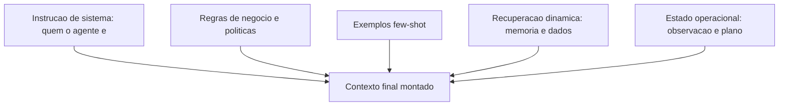

# Capítulo 5: Engenharia de contexto para agentes

## 1. Introdução

Você já tem o loop, as arquiteturas e os fundamentos. Agora chegamos à habilidade que separa os sistemas de agentes medíocres dos excepcionais: **engenharia de contexto** — a arte e a ciência de decidir exatamente o que o modelo vê em cada chamada, e na ordem certa. A janela de contexto é o "palco" do agente: o que entra nele determina o comportamento; o que fica de fora, o modelo simplesmente não sabe. E em sistemas agênticos, o contexto não é um prompt estático: ele é **montado dinamicamente** a cada iteração do loop, combinando instruções, exemplos, memória recuperada, resultados de ferramentas e dados do mundo [16].

Por que este capítulo vem antes das ferramentas e da memória? Porque o contexto é o vetor por onde tudo passa: a instrução do sistema, os exemplos de comportamento, a recuperação da memória (Capítulo 6), as descrições das ferramentas (Capítulo 7) e as observações das ações. Um agente com contexto bem projetado executa ferramentas corretamente; um agente com contexto poluído erra mesmo com as melhores ferramentas do mundo [16][12].

Ao final deste capítulo, você será capaz de estruturar o contexto de um agente em camadas — instrução de sistema, regras de negócio, exemplos few-shot, recuperação e estado — com gestão de tamanho, atualização dinâmica e priorização. Você implementará um construtor de contexto que o OrquestraIA vai usar em todos os agentes especialistas, e aprenderá as métricas para medir se o contexto está ajudando ou atrapalhando.

## 2. Explica

### O Contexto como Decisão de Engenharia

A janela de contexto de um LLM não é um depósito: é um recurso escasso com custo por token, e cada token que entra em uma chamada paga um preço — em custo, em latência e, principalmente, em qualidade. A pesquisa sobre engenharia de contexto converge em uma lição central: **contexto é o principal determinante do comportamento do modelo, e a qualidade do contexto importa mais do que a escolha do modelo em si** [16]. A LangChain, que construiu a infraestrutura de contextos para milhares de sistemas, recomenda tratar o contexto como um artefato de engenharia versionado — não como um bloco de texto esquecido num arquivo [16].

O contexto de um agente tem cinco camadas, cada uma com um papel e um custo:

**1. Instrução de sistema (system prompt)**: quem o agente é, qual o seu papel, quais as regras invioláveis. É a camada mais estável — muda pouco, custa caro e sempre está presente [3].

**2. Regras de negócio e políticas**: as restrições operacionais — o que o agente pode e não pode fazer, limites de autonomia, políticas de segurança. Vive no system prompt ou em documento recuperado (Capítulo 14).

**3. Exemplos few-shot**: demonstrações de comportamento correto — entradas e saídas exemplares. São a forma mais eficiente de ensinar formato e tom; poucos exemplos bem escolhidos valem mais do que muitos ruins [3].

**4. Recuperação dinâmica**: o conteúdo da memória e do conhecimento que o agente busca a cada iteração — políticas, dados do cliente, histórico. É a camada que cresce com o sistema (Capítulo 6).

**5. Estado operacional**: a observação da ação anterior, o plano atual, o passo em andamento. É a camada que fecha o loop (Capítulo 2).

### O Trade-off Estrutural do Contexto

A tensão central da engenharia de contexto é estrutural: **mais contexto nem sempre é melhor**. Cada camada adicionada aumenta a chance de o modelo encontrar informação útil — mas também aumenta o ruído, o custo e a chance de o modelo "se perder" no meio do material. A pesquisa mostra que adicionar informação irrelevante degrada o desempenho — o fenômeno do "contexto perdido no meio": modelos usam melhor o início e o fim da janela do que o meio [16].

Isso leva às três regras de ouro da engenharia de contexto: **priorize** (o material mais importante vai no início e no fim — instruções no início, instrução final forte no fim), **selecione** (recupere apenas o relevante, nunca despeje o acervo), e **compacte** (resuma o que é histórico, mantenha integral o que é operacional). O resultado é um contexto que é uma decisão, não um acidente [16].

## 3. Ilustra

### O Briefing do Piloto de Guerra

Um piloto de caça não recebe um manual inteiro antes de cada missão — recebe um **briefing**: instruções curtas e críticas (regras de engajamento), o contexto do teatro de operações (mapa, clima, ameaças), exemplos de manobras do esquadrão (few-shot) e o estado atual da missão (combustível, alvos, comunicações). O briefing é montado na hora, priorizado por relevância, e muda a cada etapa do voo. Um briefing inchado com capítulos inteiros de regulamento degradaria o desempenho do piloto — e o mataria em segundos de latência [16].

O agente é o piloto; o contexto é o briefing. Cada iteração do loop é um novo voo de reconhecimento: o estado mudou (a observação), a ameaça mudou (a política), e o briefing deve ser remontado. O engenheiro de contexto é o oficial de inteligência que decide o que entra no briefing — e o que fica na pasta [16].



### A Degradação do Contexto Poluído

A segunda analogia é a do copo de água suja. O contexto é um copo de água: cada camada adicionada é mais água — e cada informação irrelevante é sujeira. Com pouca água e pouca sujeira, o modelo bebe bem. Com muita sujeira, mesmo com água suficiente, o modelo engasga: o contexto irrelevante não apenas desperdiça tokens — ele **degrada ativamente** a qualidade da resposta, porque o modelo passa a considerar informação errada como relevante [16]. A engenharia de contexto é o filtro: a decisão deliberada de manter o copo limpo e no tamanho certo.

## 4. Técnica

### O Construtor de Contexto em Camadas

Vamos implementar o construtor de contexto que o OrquestraIA usa em todos os agentes — com priorização, seleção e orçamento de tokens:

```python
# contexto.py — construtor de contexto em camadas com orçamento de tokens
from dataclasses import dataclass, field

@dataclass
class ConstrutorContexto:
    """Monta o contexto do agente em camadas, com priorizacao e orcamento."""
    instrucao_sistema: str
    regras_negocio: str = ""
    exemplos: list = field(default_factory=list)
    orcamento_max_tokens: int = 4000

    def _contar_tokens(self, texto: str) -> int:
        # Estimativa simples: 4 caracteres por token (aprox.)
        return len(texto) // 4

    def _selecionar(self, itens: list, orcamento: int, chave=str) -> list:
        """Seleciona os itens mais relevantes dentro do orcamento."""
        selecionados, total = [], 0
        for item in sorted(itens, key=chave, reverse=True):
            custo = self._contar_tokens(item)
            if total + custo > orcamento:
                continue
            selecionados.append(item)
            total += custo
        return selecionados

    def montar(self, recuperacao: list, estado: str) -> list:
        """Monta as mensagens finais com priorizacao (importante no inicio/fim)."""
        msg_sistema = self.instrucao_sistema
        if self.regras_negocio:
            msg_sistema += "\n\n## REGRAS DE NEGOCIO\n" + self.regras_negocio
        if self.exemplos:
            msg_sistema += "\n\n## EXEMPLOS\n" + "\n".join(self.exemplos)
        # Recuperacao selecionada por relevancia (aqui: ordem de entrada;
        # no real, a pontuacao vem do RAG — Cap. 6)
        orcamento_restante = self.orcamento_max_tokens - self._contar_tokens(msg_sistema)
        recuperacao_ok = self._selecionar(
            recuperacao, max(orcamento_restante, 500), chave=lambda x: len(x))
        contexto_recuperado = "\n".join(recuperacao_ok)
        return [
            {"role": "system", "content": msg_sistema},
            {"role": "user", "content": (
                f"## CONTEXTO RECUPERADO\n{contexto_recuperado}\n\n"
                f"## ESTADO ATUAL\n{estado}\n\n"
                "Atue conforme as instrucoes.")},
        ]

# Uso no OrquestraIA:
# construtor = ConstrutorContexto(
#     instrucao_sistema=(
#         "Voce e o agente de atendimento do OrquestraIA. "
#         "Responda em portugues, seja conciso e acione ferramentas quando necessario."),
#     regras_negocio=(
#         "1. Reembolsos acima de R$ 100 exigem aprovacao humana.\n"
#         "2. Nunca invente dados de pedido: sempre consulte as ferramentas."),
#     exemplos=[
#         "P: o pedido chegou?  R: Deixa eu consultar o status para voce.",
#         "P: quero meu dinheiro de volta.  R: Vou verificar o pedido e a politica."],
#     orcamento_max_tokens=3000,
# )
# mensagens = construtor.montar(
#     recuperacao=["Cliente Maria prefere e-mail", "Pedido P-7841 em atraso"],
#     estado="observacao de consultar_estoque: x-100 com 12 unidades")
```

Repare nas decisões de engenharia: **instrução de sistema estável** (não muda por iteração), **regras no system prompt** (o modelo as trata como autoridade), **exemplos no system prompt** (formato e tom ensinados de uma vez), **recuperação selecionada por orçamento** (nunca despeja tudo) e **estado operacional no fim da mensagem do usuário** (priorização — o modelo lê bem o fim da janela).

### A Instrução de Sistema que Funciona

A instrução de sistema é o artefato mais importante do contexto — e o mais mal escrito. As boas instruções têm quatro qualidades verificáveis: **papel claro** ("você é o agente de atendimento do OrquestraIA, não um assistente genérico"), **limites explícitos** ("não invente dados; consulte as ferramentas"), **formato prescrito** ("responda em português, no máximo 3 frases, ou acione a ferramenta") e **prioridades de decisão** ("se houver conflito entre a política e a preferência do cliente, prevalece a política"). A linguagem mais eficaz é imperativa e específica — "consulte" em vez de "é recomendável consultar" [3][16].

### Métricas de Qualidade do Contexto

Como saber se o contexto está ajudando? Três métricas práticas: **taxa de sucesso de ferramentas** (o modelo escolhe a ferramenta certa com os argumentos certos?), **precisão de recuperação** (o contexto recuperado contém a informação que a resposta exige? — medida com evals, Capítulo 13) e **custo por tarefa** (tokens gastos por missão — contexto inchado é custo silencioso). A regra: qualquer mudança de contexto deve ser **testada A/B contra um conjunto fixo de casos** — nunca alterada no escuro [4].

### Checklist de Contexto

- [ ] Instrução de sistema com papel, limites, formato e prioridades?
- [ ] Regras de negócio separadas e invioláveis (não no meio do histórico)?
- [ ] Exemplos few-shot: poucos e representativos?
- [ ] Recuperação **selecionada por relevância e orçamento**, nunca despejada?
- [ ] Estado operacional no fim da mensagem (priorização da janela)?
- [ ] Qualquer mudança testada A/B com casos fixos?

## 5. Aplica

### O Contexto no Chão de Fábrica

A engenharia de contexto é onde o conhecimento se transforma em valor nos sistemas de produção. Os agentes de suporte que melhoram a satisfação do cliente o fazem, em grande parte, porque o contexto certo chega na hora certa: o histórico do cliente, a política aplicável, o estado do pedido — montados a cada interação [27]. Os sistemas que fracassam em produção fracassam, na maioria das vezes, por contexto: instruções vagas, políticas soterradas no histórico, recuperação despejada [16].

O contexto também é o vetor de **custo** e **segurança**: cada token enviado custa dinheiro (Capítulo 16), e instruções contraditórias abrem brechas para manipulação (Capítulo 14). Um contexto limpo é, ao mesmo tempo, um sistema mais barato, mais previsível e mais seguro.

### Armadilhas Comuns

1. **Prompt único gigante**: uma instrução de 3.000 tokens com tudo misturado. Separe instrução, regras, exemplos e recuperação em camadas.
2. **Despejo de recuperação**: colocar 20 documentos recuperados no contexto. Selecione por relevância — o orçamento é parte do design.
3. **Estado no lugar errado**: a observação da ação enterrada no meio do histórico em vez de no fim — o modelo "não vê" o que acabou de acontecer.
4. **Contexto versionado como texto solto**: mudar o prompt sem teste A/B é apostar o comportamento do sistema no escuro.

### Conexão com o OrquestraIA

O `ConstrutorContexto` deste capítulo vira o componente `contexto.py` do OrquestraIA: todos os agentes especialistas o usam, com instruções e regras próprias; a camada de recuperação conecta-se à memória (Capítulo 6); e o estado operacional vem do loop do Capítulo 2.

### Aprofundamento: O Contexto como Ativo Versionado

A engenharia de contexto atinge a maturidade quando o contexto deixa de ser um texto solto e vira um **ativo versionado** — tratado com a mesma disciplina do código: controle de versão, testes e histórico de mudanças. A prática recomendada tem quatro elementos: **versionamento por componente** (instrução de sistema, regras de negócio, exemplos e templates de recuperação têm versões próprias — a mudança de uma regra não apaga o histórico das outras), **teste a cada mudança** (o golden set do Capítulo 13 roda contra a nova versão — a regressão bloqueia a promoção), **registro de decisão** (cada mudança registra o porquê — a evidência que a motivou — permitindo reverter com conhecimento, não com adivinhação) e **rollback imediato** (a versão anterior está sempre a um comando de distância — a reversibilidade do Capítulo 17). O contexto versionado é o que torna a evolução do sistema (Capítulo 19) segura: sem versionamento, cada ajuste de prompt é uma aposta no escuro; com ele, cada ajuste é uma hipótese testada [16][4].

### A Medição do Contexto: O Que Números Revelam

O contexto pode — e deve — ser medido. As métricas práticas: **tokens por chamada** (o custo bruto — a base do Capítulo 16), **densidade de informação** (a fração do contexto que a resposta realmente usou — o contexto inchado tem densidade baixa, e a métrica revela o desperdício), **precisão de recuperação** (a fração do contexto recuperado que era relevante — o elo com o Capítulo 6) e **impacto na qualidade** (a taxa de sucesso do golden set com e sem cada camada do contexto — a medição que justifica cada bloco). A leitura das métricas orienta o orçamento: o contexto que não move a taxa de sucesso é custo puro — e o exercício de remoção medido (tirar uma camada, rodar o golden set, comparar) é o método de poda que mantém o contexto enxuto com qualidade [16][4].

### Aprofundamento: O Fim do Prompt Solto — Contexto como Produto

A evolução do Capítulo 5 converge para uma mudança de mentalidade: o contexto deixa de ser um "prompt" (algo que se escreve uma vez e se esquece) e vira um **produto** — um artefato com dono, versão, teste e ciclo de vida, exatamente como o código e os dados. A mentalidade de produto tem cinco implicações práticas: **o dono do contexto é uma pessoa** (a engenharia de contexto é uma disciplina com responsável, não uma tarefa distribuída), **o contexto tem SLAs** (orçamento de tokens por chamada, densidade mínima de informação — medidos no Capítulo 16), **o contexto tem testes** (o golden set do Capítulo 13 valida cada versão), **o contexto tem histórico** (versionamento e ADR — o registro de cada decisão de contexto com a evidência) e **o contexto evolui como o código** (pequenas mudanças contínuas com revisão — o pipeline do Capítulo 17). A mentalidade de produto é o que separa as equipes que tratam contexto como detalhe das que tratam como vantagem — e a vantagem de contexto é a vantagem competitiva mais subestimada dos sistemas de agentes em 2026 [16][4].

### O Contexto na Fronteira: Dados Não Confiáveis

O contexto tem uma fronteira que o Capítulo 14 explora em profundidade e que aqui merece o desenho de arquitetura: **os dados não confiáveis que entram no contexto** — conteúdo recuperado, e-mails, respostas de sistemas externos. A regra estrutural: o contexto monta as fronteiras explicitamente — a instrução de sistema declara que o conteúdo marcado é dado, não instrução; a recuperação marca a origem de cada bloco; e a observação de ferramenta identifica a fonte externa. A implementação é a do `ContextoSeguro` (Capítulo 14), e a decisão de arquitetura é esta: **a fronteira não é do contexto nem da segurança — é das duas** — e o engenheiro de sistemas agênticos desenha o contexto com a segurança embutida, não anexada depois. O contexto que ignora a fronteira é a porta de entrada do prompt injection — o incidente mais caro da operação (Capítulo 19) [6].

## 6. Conclusão

Três pontos para levar: **primeiro**, o contexto é um artefato de engenharia em cinco camadas — instrução, regras, exemplos, recuperação e estado — montado dinamicamente a cada iteração, e não um prompt estático. **Segundo**, mais contexto não é melhor: a tensão estrutural entre informação e ruído exige priorização (início e fim da janela), seleção (recuperação por orçamento) e compactação (histórico resumido). **Terceiro**, a instrução de sistema bem escrita tem quatro qualidades — papel, limites, formato e prioridades — e qualquer mudança de contexto deve ser validada por evals A/B.

O próximo capítulo constrói a camada de recuperação que o contexto consome: a **memória** — de curto prazo, longo prazo e vetorial — com as decisões de armazenamento, indexação e recuperação que transformam o agente de conversador em sistema que aprende.

**Desafio opcional**: escreva a instrução de sistema de um agente do seu domínio com as quatro qualidades (papel, limites, formato, prioridades). Depois, monte o contexto de uma interação real usando o `ConstrutorContexto` e responda: qual camada você removeria primeiro se precisasse cortar 30% dos tokens?

## 7. Referências

[1] ADIMULAM, A.; GUPTA, R.; KUMAR, S. *The Orchestration of Multi-Agent Systems: Architectures, Protocols, and Enterprise Adoption*. arXiv:2601.13671v1, 2026. Disponível em: https://arxiv.org/html/2601.13671v1. Acesso em: 07 ago. 2026.

[2] AMAZON WEB SERVICES (AWS). *Traditional agent architecture: perceive, reason, act*. AWS Prescriptive Guidance: Foundations of Agentic AI on AWS, 2026. Disponível em: https://docs.aws.amazon.com/prescriptive-guidance/latest/agentic-ai-foundations/traditional-agents.html. Acesso em: 07 ago. 2026.

[3] ANTHROPIC. *Building Effective Agents*. 2024. Disponível em: https://www.anthropic.com/engineering/building-effective-agents. Acesso em: 07 ago. 2026.

[4] ANTHROPIC. *Demystifying Evals for AI Agents*. 2026. Disponível em: https://www.anthropic.com/engineering/demystifying-evals-for-ai-agents. Acesso em: 07 ago. 2026.

[5] DIGITAL APPLIED. *State of AI Agents 2026: 200+ Data Points Compiled*. 2026. Disponível em: https://www.digitalapplied.com/blog/state-of-ai-agents-2026-200-data-points. Acesso em: 07 ago. 2026.

[6] FIN.AI. *AI Agent ROI: Customer Support Returns*. 2026. Disponível em: https://fin.ai/blog/ai-agent-roi-customer-support. Acesso em: 07 ago. 2026.

[7] GALILEO. *How to Build Human-in-the-Loop Oversight for Production AI Agents*. 2026. Disponível em: https://galileo.ai/blog/human-in-the-loop-agent-oversight. Acesso em: 07 ago. 2026.

[8] GARTNER. *Gartner Predicts 40% of Enterprise Apps Will Feature Task-Specific AI Agents by 2026*. 2025. Disponível em: https://www.gartner.com/en/newsroom/press-releases/2025-08-26-gartner-predicts-40-percent-of-enterprise-apps-will-feature-task-specific-ai-agents-by-2026-up-from-less-than-5-percent-in-2025. Acesso em: 07 ago. 2026.

[9] GOOGLE CLOUD. *Choose a Design Pattern for Your Agentic AI System*. Cloud Architecture Center, 2026. Disponível em: https://docs.cloud.google.com/architecture/choose-design-pattern-agentic-ai-system. Acesso em: 07 ago. 2026.

[10] GUO, Taicheng et al. *Large Language Model based Multi-Agents: A Survey of Progress and Challenges*. IJCAI, 2024. Disponível em: https://arxiv.org/abs/2402.01680. Acesso em: 07 ago. 2026.

[11] HONG, Sirui et al. *MetaGPT: Meta Programming for A Multi-Agent Collaborative Framework*. ICLR, 2024. Disponível em: https://arxiv.org/abs/2308.00352. Acesso em: 07 ago. 2026.

[12] LANGCHAIN TEAM. *Context Engineering for Agents*. 2025. Disponível em: https://www.langchain.com/blog/context-engineering-for-agents. Acesso em: 07 ago. 2026.

[13] LANGCHAIN TEAM. *LangMem SDK for Agent Long-Term Memory*. 2025. Disponível em: https://www.langchain.com/blog/langmem-sdk-launch. Acesso em: 07 ago. 2026.

[14] LANGCHAIN. *The Best AI Agent Frameworks in 2026*. 2026. Disponível em: https://www.langchain.com/resources/ai-agent-frameworks. Acesso em: 07 ago. 2026.

[15] LIU, Xiao et al. *AgentBench: Evaluating LLMs as Agents*. ICLR, 2025. Disponível em: https://arxiv.org/abs/2308.03688. Acesso em: 07 ago. 2026.

[16] MCKINSEY & COMPANY. *State of AI Trust in 2026: Shifting to the Agentic Era*. 2026. Disponível em: https://www.mckinsey.com/capabilities/tech-and-ai/our-insights/tech-forward/state-of-ai-trust-in-2026-shifting-to-the-agentic-era. Acesso em: 07 ago. 2026.

[17] MEM0 ENGINEERING TEAM. *AI Agent Memory 2026: Progress Benchmark Report Evaluations*. 2026. Disponível em: https://mem0.ai/blog/state-of-ai-agent-memory-2026. Acesso em: 07 ago. 2026.

[18] MICROSOFT AZURE ARCHITECTURE CENTER. *AI Agent Orchestration Patterns*. 2026. Disponível em: https://learn.microsoft.com/en-us/azure/architecture/ai-ml/guide/ai-agent-design-patterns. Acesso em: 07 ago. 2026.

[19] ORACLE DEVELOPERS. *What Is the AI Agent Loop? The Core Architecture Behind Autonomous AI Systems*. 2026. Disponível em: https://blogs.oracle.com/developers/what-is-the-ai-agent-loop-the-core-architecture-behind-autonomous-ai-systems. Acesso em: 07 ago. 2026.

[20] QIAN, Chen et al. *ChatDev: Communicative Agents for Software Development*. ACL, 2024. Disponível em: https://arxiv.org/abs/2307.07924. Acesso em: 07 ago. 2026.

[21] SALESFORCE. *New Research: AI Service Agents Improve Customer Satisfaction*. 2026. Disponível em: https://www.salesforce.com/news/stories/ai-service-agents-improve-customer-satisfaction/. Acesso em: 07 ago. 2026.

[22] VALIDMIND. *Top 10 AI Risk Trends for 2026*. 2026. Disponível em: https://validmind.com/blog/10-ai-risk-trends-for-2026/. Acesso em: 07 ago. 2026.

[23] WANG, Lei et al. *A Survey on Large Language Model based Autonomous Agents*. arXiv:2308.11432, 2025. Disponível em: https://arxiv.org/abs/2308.11432. Acesso em: 07 ago. 2026.

[24] XI, Zhiheng et al. *The Rise and Potential of Large Language Model Based Agents: A Survey*. arXiv:2309.07864, 2023. Disponível em: https://arxiv.org/abs/2309.07864. Acesso em: 07 ago. 2026.

[25] YAO, Shunyu et al. *ReAct: Synergizing Reasoning and Acting in Language Models*. ICLR, 2023. Disponível em: https://arxiv.org/abs/2210.03629. Acesso em: 07 ago. 2026.

[26] ZENITY. *What Is the Model Context Protocol? Full Guide*. 2026. Disponível em: https://zenity.io/academy/model-context-protocol-explained. Acesso em: 07 ago. 2026.

[27] DORA / GOOGLE CLOUD. *DORA: State of AI-assisted Software Development 2025*. 2025. Disponível em: https://dora.dev/dora-report-2025/. Acesso em: 07 ago. 2026.

[28] BRAINTRUST. *AI Gateway Comparison: The 6 Best Ranked (2026)*. 2026. Disponível em: https://www.braintrust.dev/articles/ai-gateway-comparison-2026. Acesso em: 07 ago. 2026.

[29] CERBOS. *AI Agents, the Model Context Protocol, and the Future of Authorization Guardrails*. 2026. Disponível em: https://www.cerbos.dev/news/securing-ai-agents-model-context-protocol. Acesso em: 07 ago. 2026.

[30] COALITION FOR SECURE AI (CoSAI). *Securing the AI Agent Revolution: A Practical Guide to Model Context Protocol Security*. 2026. Disponível em: https://www.coalitionforsecureai.org/securing-the-ai-agent-revolution-a-practical-guide-to-mcp-security/. Acesso em: 07 ago. 2026.
