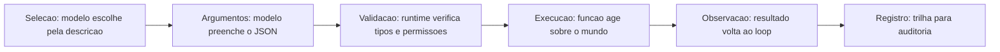

# Capítulo 7: Ferramentas e function calling: as mãos do agente

## 1. Introdução

Os capítulos anteriores deram ao agente cérebro (loop, ReAct), palco (contexto) e memória. Este capítulo dá as **mãos**: as ferramentas e o function calling — o mecanismo que permite ao agente não apenas falar sobre o mundo, mas agir sobre ele. Sem ferramentas, o agente é um sábio de torre de marfim: raciocina com elegância e responde com fluência, mas não consulta o estoque, não atualiza o pedido, não dispara o e-mail. Com ferramentas bem projetadas, o agente se torna operacional: a ponte entre a decisão probabilística do modelo e a execução determinística no mundo real [2][3].

O function calling evoluiu de detalhe técnico para disciplina de engenharia: o contrato de ferramentas define o vocabulário pelo qual o modelo entende e usa o sistema. Ferramentas mal descritas geram chamadas erradas; ferramentas sem validação geram execuções perigosas; ferramentas sem observação quebram o loop. O MCP (Model Context Protocol) padronizou a conexão de ferramentas externas — o assunto do Capítulo 11 — mas a disciplina de design de ferramentas é pré-requisito para tudo isso [26].

Ao final deste capítulo, você será capaz de desenhar e implementar o catálogo de ferramentas do OrquestraIA: o contrato no formato do function calling, a validação rigorosa de argumentos, a execução segura com erros estruturados e a observação que realimenta o loop. Você aprenderá também a decidir o que merece ser ferramenta — e o que deve permanecer como instrução — a decisão de design que mais afeta a taxa de sucesso do sistema.

## 2. Explica

### O Contrato de Ferramentas: O Vocabulário do Agente

A ferramenta é definida por um contrato com cinco partes: **nome** (curto, estável, com verbo — `consultar_estoque`, não `funcao_1`), **descrição** (o que a ferramenta faz, quando usá-la, o que retorna — o modelo decide com base nela), **parâmetros** (esquema JSON com tipos, campos obrigatórios e descrições por campo), **execução** (a função real que valida e age) e **observação** (o resultado estruturado que volta ao loop) [2][3].

A descrição é o elemento mais subestimado. O modelo de linguagem escolhe a ferramenta lendo a descrição — não o código. Uma descrição vaga ("faz coisas com pedidos") produz escolhas erradas; uma descrição rica ("consulta o status atual de um pedido pelo ID; use quando o cliente perguntar sobre entregas ou atrasos; retorna status, data estimada e transportadora") produz a escolha certa na maioria dos casos [3].

### Function Calling: Decisão Probabilística, Execução Determinística

O function calling é o protocolo que separa as duas naturezas do agente: o modelo produz uma **intenção estruturada** (nome da ferramenta + argumentos em JSON), e o runtime **valida e executa** de forma determinística. Essa separação é a base da segurança: o modelo nunca executa nada — ele propõe, e o sistema decide se a proposta é válida e permitida [2][3]. A mesma separação explica por que a validação não pode ser negligenciada: a saída do modelo é probabilística e pode conter argumentos inválidos, tipos errados ou valores fora do domínio — cada um precisa ser verificado antes da execução.

### O que Merece Ser Ferramenta

A decisão de design mais importante: **o que entra no catálogo de ferramentas?** A regra prática tem três critérios: a ação deve ser **observável** (retorna um resultado verificável), **determinística** (a mesma entrada gera a mesma saída — sem comportamento aleatório ou não reprodutível) e **segura de expor** (a execução está coberta por validação, autorização e registro — Capítulo 14). O que não passa nos critérios fica como instrução ou regra, não como ferramenta. O catálogo deve ser **enxuto**: dezenas de ferramentas poluem o contexto e confundem o modelo; o ideal é um catálogo pequeno, bem descrito e crescente por necessidade medida [3].

### O Ciclo da Ferramenta

Cada uso de ferramenta percorre o ciclo completo: **seleção** (o modelo escolhe a ferramenta pela descrição), **formação de argumentos** (o modelo preenche o JSON), **validação** (o runtime verifica tipos, valores e permissões), **execução** (a função age sobre o mundo), **observação** (o resultado — sucesso ou erro estruturado — volta ao loop) e **registro** (a trilha para auditoria). Romper o ciclo em qualquer ponto — especialmente na validação ou na observação — degrada a confiabilidade do sistema inteiro [2].

## 3. Ilustra

### O Assistente do Restaurante e o Cardápio

Imagine o assistente de um restaurante sofisticado. Ele não improvisa o cardápio: conhece cada prato pelo nome, sabe descrever seus ingredientes, sabe quando recomendá-lo (frutos do mar à noite, almoço leve ao meio-dia) e sabe quais combinações são possíveis. O cardápio é o catálogo de ferramentas: cada prato é uma ferramenta com nome, descrição e regras de uso. O mau assistente tem um cardápio confuso — pratos sem descrição, nomes ambíguos, combinações impossíveis — e erra o pedido na metade das vezes [3].

A cozinha é o runtime: o assistente (o modelo) anota o pedido — mas quem cozinha (executa) é a cozinha, com seus processos determinísticos. O assistente que "cozinhasse" ele mesmo estaria inventando — o equivalente a deixar o modelo executar código livremente. E o garçom que anota o pedido errado e não confere com a cozinha é o loop sem observação: o erro só aparece quando o cliente reclama [2].



### A Analogia do Painel de Controle

Uma segunda lente: o painel de controle de uma usina. Os botões (ferramentas) são poucos e bem rotulados: "abrir comporta 3", "ler pressão da caldeira", "desligar turbina". Cada botão tem instruções claras de uso e consequências documentadas. O operador (o modelo) escolhe o botão certo pela etiqueta — e o sistema de segurança (o runtime) valida antes de agir: "abrir comporta" exige a pressão abaixo do limite e o bloqueio de manutenção levantado. A usina sem botões é inútil; a usina com botões demais e mal rotulados é perigosa [6]. O design de ferramentas é a arte de rotular os botões do sistema.

## 4. Técnica

### O Registro de Ferramentas com Contrato Rico

Vamos implementar o catálogo de ferramentas do OrquestraIA com contrato completo — a fundação do function calling real:

```python
# ferramentas.py — registro de ferramentas com contrato rico
import json, inspect

class RegistroFerramentas:
    """Catalogo de ferramentas com contrato, validacao e execucao segura."""
    def __init__(self):
        self._ferramentas = {}  # nome -> funcao
        self._esquemas = {}     # nome -> esquema JSON para o modelo

    def registrar(self, fn):
        """Registra uma funcao, derivando o esquema dos parametros."""
        sig = inspect.signature(fn)
        propriedades, obrigatorios = {}, []
        for nome, p in sig.parameters.items():
            propriedades[nome] = {
                "type": "string",
                "description": (p.annotation if isinstance(p.annotation, str)
                                else "parametro"),
            }
            if p.default is inspect.Parameter.empty:
                obrigatorios.append(nome)
        esquema = {
            "type": "function",
            "function": {
                "name": fn.__name__,
                "description": inspect.getdoc(fn) or f"Executa {fn.__name__}",
                "parameters": {
                    "type": "object",
                    "properties": propriedades,
                    "required": obrigatorios,
                },
            },
        }
        self._ferramentas[fn.__name__] = fn
        self._esquemas[fn.__name__] = esquema
        return fn

    def contrato(self) -> list:
        return list(self._esquemas.values())

    def executar(self, nome: str, argumentos: dict, permissor) -> str:
        """Validacao + autorizacao + execucao + observacao estruturada."""
        if nome not in self._ferramentas:
            return f"ERRO: ferramenta '{nome}' nao existe no catalogo"
        # 1. autorizacao (politica — Cap. 14)
        if not permissor.pode_executar(nome, argumentos):
            return f"NEGADO: acao '{nome}' nao autorizada para esta missao"
        # 2. validacao de tipos e campos obrigatorios
        esquema = self._esquemas[nome]["function"]["parameters"]
        obrigatorios = esquema.get("required", [])
        for campo in obrigatorios:
            if campo not in argumentos or argumentos[campo] in (None, ""):
                return f"ERRO: parametro obrigatorio '{campo}' ausente"
        # 3. execucao com erros estruturados
        try:
            resultado = self._ferramentas[nome](**argumentos)
            return f"OK: {resultado}"
        except Exception as e:
            return f"ERRO na execucao de {nome}: {e}"

# Definição das ferramentas do domínio com docstrings ricas:
@RegistroFerramentas().registrar
def consultar_pedido(pedido_id: str = ""):
    """Consulta o status de um pedido pelo ID. Use quando o cliente perguntar
    sobre entregas, atrasos ou rastreio. Retorna status, data e transportadora."""
    # simulacao de integracao com o sistema de pedidos
    status = {"P-7841": "em_transito", "P-7842": "entregue"}
    return f"pedido {pedido_id}: {status.get(pedido_id, 'nao encontrado')}"

@RegistroFerramentas().registrar
def atualizar_preferencia(cliente: str = "", contato: str = ""):
    """Registra a preferencia de contato de um cliente. Use quando o cliente
    informar como deseja ser contatado. Retorna a preferencia salva."""
    return f"preferencia salva: {cliente} prefere {contato}"

# Uso no agente:
# catalogo = RegistroFerramentas()
# catalogo.registrar(consultar_pedido)  # (na pratica, o decorator ja registra)
# print(catalogo.contrato())  # o JSON enviado ao modelo como tools
```

Repare nas decisões: **docstring como descrição** (o contrato herda a riqueza da documentação), **esquema derivado da assinatura** (uma fonte de verdade — o código — em vez de JSON duplicado), **permissor como camada de autorização** (a política é separada da execução) e **observação de erro estruturada** (o modelo pode interpretar e corrigir).

### A Camada de Validação Rigorosa

A validação não termina nos campos obrigatórios: valores fora do domínio, tamanhos absurdos e tipos mistos precisam de regras. A prática recomendada: **valide o mínimo que a segurança exige e o máximo que a execução tolera** — validação excessiva quebra casos legítimos, validação ausente quebra o sistema. Para valores críticos (moeda, IDs, datas), valide o formato e o domínio explicitamente:

```python
def _validar_moeda(valor) -> bool:
    """Valida um valor monetario (ex.: 'R$ 123,45')."""
    import re
    return bool(re.match(r"^R\$\s?\d{1,3}(\.\d{3})*,\d{2}$", str(valor)))

def _validar_pedido_id(valor) -> bool:
    """Valida o formato de ID de pedido (P- seguido de 4 digitos)."""
    import re
    return bool(re.match(r"^P-\d{4}$", str(valor)))
```

### A Observação: O Diálogo com o Modelo

A observação é a mensagem que o modelo lê para decidir o próximo passo. A boa observação tem três qualidades: **fato** (o resultado real — "pedido P-7841: em_transito"), **classe** (prefixo OK/ERRO/NEGADO que o modelo pode ramificar) e **orientação** (informação suficiente para corrigir — "ERRO: parametro obrigatorio 'pedido_id' ausente" permite ao modelo refazer a chamada). Uma observação criptica — "falhou" — quebra o loop: o modelo não sabe por quê nem o que fazer [2].

### Checklist de Ferramentas

- [ ] Nome curto e estável com verbo; descrição rica com quando-usar e retorno?
- [ ] Parâmetros com tipos, obrigatórios e descrições por campo?
- [ ] Validação de tipos, obrigatórios e domínio **antes** da execução?
- [ ] Autorização separada da execução (permissor/política)?
- [ ] Observação estruturada: fato + classe (OK/ERRO/NEGADO) + orientação?
- [ ] Registro de toda chamada para auditoria (Capítulo 16)?

## 5. Aplica

### Ferramentas no Chão de Fábrica

O design de ferramentas é onde a teoria encontra o sistema legado: as ferramentas são as integrações — CRM, transportadora, banco de dados, e-mail — e a qualidade do sistema agêntico depende diretamente da qualidade dessas pontes [2]. Os agentes de suporte que melhoram a satisfação são, em grande parte, agentes com ferramentas bem desenhadas: consultam o pedido real, atualizam o status real, disparam ações reais — e verificam o resultado [27]. Os agentes de análise consultam bancos e geram relatórios — ferramentas de consulta com observações estruturadas [10].

O MCP padroniza essa camada: em vez de escrever integrações proprietárias para cada sistema, o protocolo define uma interface comum — o agente conversa com servidores MCP que expõem ferramentas padronizadas (Capítulo 11). A disciplina deste capítulo — contrato rico, validação, observação — continua sendo a base, MCP ou não [26].

### Armadilhas Comuns

1. **Ferramenta como função sem contrato**: nome sem verbo, sem descrição, sem docstring — o modelo não sabe quando usar e escolhe errado.
2. **Execução sem validação**: confiar na saída do modelo é o erro mais caro — argumentos inválidos executam ações erradas em sistemas reais.
3. **Observação criptica**: "falhou" sem contexto quebra o loop — o modelo não consegue corrigir.
4. **Catálogo inchado**: dezenas de ferramentas poluem o contexto e confundem a seleção — cresça o catálogo por necessidade medida.

### Conexão com o OrquestraIA

O `RegistroFerramentas` deste capítulo é o catálogo central do OrquestraIA: cada especialista (atendimento, vendas, análise) registra suas ferramentas no mesmo registro, com o permissor centralizando a autorização (Capítulo 14) e a trilha alimentando a observabilidade (Capítulo 16). O Capítulo 11 conecta o catálogo ao mundo externo via MCP.

### Aprofundamento: Testes Automatizados de Contratos de Ferramentas

As ferramentas são a fronteira entre o modelo e o mundo — e, como toda fronteira, merecem testes sistemáticos. O conjunto de testes de contrato cobre três camadas, e cada uma pega uma classe diferente de erro. A primeira camada testa o **contrato em si**: o esquema gerado pela assinatura é válido (tipos, obrigatórios, descrições presentes)? A segunda testa a **validação**: argumentos inválidos são rejeitados antes da execução, e a observação de erro é estruturada e interpretável? A terceira testa a **execução**: a ferramenta retorna a observação esperada para entradas conhecidas — e erros reais viram observações de erro, não exceções soltas?

O ciclo de vida do contrato também merece disciplina: a mudança de assinatura de uma ferramenta (novo parâmetro, tipo diferente) quebra os contratos — e os testes pegam a quebra antes de ela alcançar o modelo. A prática recomendada é **versionar o contrato junto com o código** e rodar os testes de contrato no CI do Capítulo 17, junto com os evals do Capítulo 13 — o golden set cobre o comportamento do agente; os testes de contrato cobrem a integridade da fronteira [3][4].

### A Taxonomia de Observações de Ferramentas

A observação que volta ao loop é mais rica do que parece — e padronizá-la melhora a taxa de correção do agente. A taxonomia útil tem cinco classes: **OK** (o resultado esperado), **VAZIO** (a consulta retornou nada — não é erro, é informação), **INVÁLIDO** (os argumentos não passaram na validação — o modelo deve refazer), **NEGADO** (a política bloqueou — o modelo deve escalar ou parar) e **ERRO** (a execução falhou — o modelo deve tentar alternativa ou reportar). Cada classe orienta o comportamento do modelo de forma diferente, e o prefixo na observação (o padrão do Capítulo 7) é o que permite ao modelo ramificar corretamente:

| Classe | Prefixo | O modelo deve |
|---|---|---|
| Sucesso | OK: | seguir o fluxo |
| Sem dados | VAZIO: | reformular a consulta |
| Args ruins | INVÁLIDO: | refazer a chamada |
| Bloqueado | NEGADO: | escalar ou parar |
| Falha | ERRO: | alternativa ou reporte |

A taxonomia padronizada é a ponte entre as ferramentas (Capítulo 7) e o comportamento de correção (Capítulo 2): o modelo que sabe a classe da observação corrige com precisão; o modelo que recebe observações ambíguas adivinha [3].

### Aprofundamento: O Registro de Ferramentas com Mínimo Privilégio

O catálogo de ferramentas do capítulo ganha a dimensão de segurança que o Capítulo 14 aprofunda e que aqui merece o desenho de arquitetura: **cada agente enxerga apenas o subconjunto do catálogo que o seu escopo permite**. O atendente não recebe o contrato da ferramenta de aprovar reembolso — ele nem sabe que ela existe; o analista não recebe o contrato de registrar pagamento. A implementação é declarativa: o registro guarda o catálogo completo, e o permissor (Capítulo 14) define, por agente, o subconjunto visível — o contrato enviado ao modelo (a lista `tools` do function calling) é filtrado pelo permissor. O mínimo privilégio no catálogo tem um benefício duplo: reduz a superfície de ataque (o prompt injection que tentaria chamar a ferramenta proibida não encontra o contrato) e melhora a seleção (o modelo com menos opções escolhe melhor — o catálogo enxuto do Capítulo 7, agora por agente) [5][6].

### O Versionamento de Ferramentas: A Mudança que Não Quebra

As ferramentas evoluem — e a mudança de assinatura quebra os contratos que o modelo conhece. O versionamento de ferramentas é a disciplina que permite evoluir sem quebrar: **a versão antiga permanece ativa durante a transição** (o modelo continua com o contrato antigo enquanto o novo é validado), **a validação usa o golden set** (o novo contrato roda contra os casos do Capítulo 13 — a seleção da ferramenta e os argumentos continuam corretos), e **a depreciação é comunicada** (o contrato novo marca a versão antiga como deprecated, e o modelo aprende a preferir a nova — a transição é gradual, não cortante). O versionamento é o que torna a evolução das ferramentas segura na operação (Capítulo 19): a mudança de contrato é uma mudança de sistema, testada e gradual — não um corte que quebra o fluxo em produção [3][4].

## 6. Conclusão

Três pontos para levar: **primeiro**, a ferramenta é definida por um contrato em cinco partes — nome, descrição, parâmetros, execução e observação — e a descrição rica é o elemento que decide a taxa de sucesso da seleção. **Segundo**, o function calling separa as duas naturezas — o modelo propõe (intenção estruturada) e o runtime valida e executa (determinístico) — com validação de tipos, domínio e autorização antes de qualquer ação. **Terceiro**, a observação estruturada (fato + classe + orientação) é o que fecha o loop e permite ao modelo corrigir o curso.

O próximo capítulo completa a Parte II com o **planejamento de tarefas e decomposição**: como o agente transforma missões complexas em passos executáveis, escolhe a granularidade certa e re-planeja quando a realidade diverge.

**Desafio opcional**: pegue duas integrações reais do seu trabalho (uma consulta e uma escrita) e escreva os contratos de ferramenta completos — nome, descrição rica, parâmetros, validação e observação. Depois, implemente-as no `RegistroFerramentas` e teste a seleção: faça 10 perguntas ao modelo e meça quantas vezes ele escolheu a ferramenta certa.

## 7. Referências

[1] ADIMULAM, A.; GUPTA, R.; KUMAR, S. *The Orchestration of Multi-Agent Systems: Architectures, Protocols, and Enterprise Adoption*. arXiv:2601.13671v1, 2026. Disponível em: https://arxiv.org/html/2601.13671v1. Acesso em: 07 ago. 2026.

[2] AMAZON WEB SERVICES (AWS). *Traditional agent architecture: perceive, reason, act*. AWS Prescriptive Guidance: Foundations of Agentic AI on AWS, 2026. Disponível em: https://docs.aws.amazon.com/prescriptive-guidance/latest/agentic-ai-foundations/traditional-agents.html. Acesso em: 07 ago. 2026.

[3] ANTHROPIC. *Building Effective Agents*. 2024. Disponível em: https://www.anthropic.com/engineering/building-effective-agents. Acesso em: 07 ago. 2026.

[4] ANTHROPIC. *Demystifying Evals for AI Agents*. 2026. Disponível em: https://www.anthropic.com/engineering/demystifying-evals-for-ai-agents. Acesso em: 07 ago. 2026.

[5] CERBOS. *AI Agents, the Model Context Protocol, and the Future of Authorization Guardrails*. 2026. Disponível em: https://www.cerbos.dev/news/securing-ai-agents-model-context-protocol. Acesso em: 07 ago. 2026.

[6] COALITION FOR SECURE AI (CoSAI). *Securing the AI Agent Revolution: A Practical Guide to Model Context Protocol Security*. 2026. Disponível em: https://www.coalitionforsecureai.org/securing-the-ai-agent-revolution-a-practical-guide-to-mcp-security/. Acesso em: 07 ago. 2026.

[7] DIGITAL APPLIED. *State of AI Agents 2026: 200+ Data Points Compiled*. 2026. Disponível em: https://www.digitalapplied.com/blog/state-of-ai-agents-2026-200-data-points. Acesso em: 07 ago. 2026.

[8] FIN.AI. *AI Agent ROI: Customer Support Returns*. 2026. Disponível em: https://fin.ai/blog/ai-agent-roi-customer-support. Acesso em: 07 ago. 2026.

[9] GALILEO. *How to Build Human-in-the-Loop Oversight for Production AI Agents*. 2026. Disponível em: https://galileo.ai/blog/human-in-the-loop-agent-oversight. Acesso em: 07 ago. 2026.

[10] GARTNER. *Gartner Predicts 40% of Enterprise Apps Will Feature Task-Specific AI Agents by 2026*. 2025. Disponível em: https://www.gartner.com/en/newsroom/press-releases/2025-08-26-gartner-predicts-40-percent-of-enterprise-apps-will-feature-task-specific-ai-agents-by-2026-up-from-less-than-5-percent-in-2025. Acesso em: 07 ago. 2026.

[11] GOOGLE CLOUD. *Choose a Design Pattern for Your Agentic AI System*. Cloud Architecture Center, 2026. Disponível em: https://docs.cloud.google.com/architecture/choose-design-pattern-agentic-ai-system. Acesso em: 07 ago. 2026.

[12] GUO, Taicheng et al. *Large Language Model based Multi-Agents: A Survey of Progress and Challenges*. IJCAI, 2024. Disponível em: https://arxiv.org/abs/2402.01680. Acesso em: 07 ago. 2026.

[13] HONG, Sirui et al. *MetaGPT: Meta Programming for A Multi-Agent Collaborative Framework*. ICLR, 2024. Disponível em: https://arxiv.org/abs/2308.00352. Acesso em: 07 ago. 2026.

[14] LANGCHAIN TEAM. *Context Engineering for Agents*. 2025. Disponível em: https://www.langchain.com/blog/context-engineering-for-agents. Acesso em: 07 ago. 2026.

[15] LANGCHAIN TEAM. *LangMem SDK for Agent Long-Term Memory*. 2025. Disponível em: https://www.langchain.com/blog/langmem-sdk-launch. Acesso em: 07 ago. 2026.

[16] LANGCHAIN. *The Best AI Agent Frameworks in 2026*. 2026. Disponível em: https://www.langchain.com/resources/ai-agent-frameworks. Acesso em: 07 ago. 2026.

[17] LIU, Xiao et al. *AgentBench: Evaluating LLMs as Agents*. ICLR, 2025. Disponível em: https://arxiv.org/abs/2308.03688. Acesso em: 07 ago. 2026.

[18] MCKINSEY & COMPANY. *State of AI Trust in 2026: Shifting to the Agentic Era*. 2026. Disponível em: https://www.mckinsey.com/capabilities/tech-and-ai/our-insights/tech-forward/state-of-ai-trust-in-2026-shifting-to-the-agentic-era. Acesso em: 07 ago. 2026.

[19] MEM0 ENGINEERING TEAM. *AI Agent Memory 2026: Progress Benchmark Report Evaluations*. 2026. Disponível em: https://mem0.ai/blog/state-of-ai-agent-memory-2026. Acesso em: 07 ago. 2026.

[20] MICROSOFT AZURE ARCHITECTURE CENTER. *AI Agent Orchestration Patterns*. 2026. Disponível em: https://learn.microsoft.com/en-us/azure/architecture/ai-ml/guide/ai-agent-design-patterns. Acesso em: 07 ago. 2026.

[21] ORACLE DEVELOPERS. *What Is the AI Agent Loop? The Core Architecture Behind Autonomous AI Systems*. 2026. Disponível em: https://blogs.oracle.com/developers/what-is-the-ai-agent-loop-the-core-architecture-behind-autonomous-ai-systems. Acesso em: 07 ago. 2026.

[22] QIAN, Chen et al. *ChatDev: Communicative Agents for Software Development*. ACL, 2024. Disponível em: https://arxiv.org/abs/2307.07924. Acesso em: 07 ago. 2026.

[23] SALESFORCE. *New Research: AI Service Agents Improve Customer Satisfaction*. 2026. Disponível em: https://www.salesforce.com/news/stories/ai-service-agents-improve-customer-satisfaction/. Acesso em: 07 ago. 2026.

[24] VALIDMIND. *Top 10 AI Risk Trends for 2026*. 2026. Disponível em: https://validmind.com/blog/10-ai-risk-trends-for-2026/. Acesso em: 07 ago. 2026.

[25] WANG, Lei et al. *A Survey on Large Language Model based Autonomous Agents*. arXiv:2308.11432, 2025. Disponível em: https://arxiv.org/abs/2308.11432. Acesso em: 07 ago. 2026.

[26] XI, Zhiheng et al. *The Rise and Potential of Large Language Model Based Agents: A Survey*. arXiv:2309.07864, 2023. Disponível em: https://arxiv.org/abs/2309.07864. Acesso em: 07 ago. 2026.

[27] YAO, Shunyu et al. *ReAct: Synergizing Reasoning and Acting in Language Models*. ICLR, 2023. Disponível em: https://arxiv.org/abs/2210.03629. Acesso em: 07 ago. 2026.

[28] ZENITY. *What Is the Model Context Protocol? Full Guide*. 2026. Disponível em: https://zenity.io/academy/model-context-protocol-explained. Acesso em: 07 ago. 2026.

[29] DORA / GOOGLE CLOUD. *DORA: State of AI-assisted Software Development 2025*. 2025. Disponível em: https://dora.dev/dora-report-2025/. Acesso em: 07 ago. 2026.

[30] BRAINTRUST. *AI Gateway Comparison: The 6 Best Ranked (2026)*. 2026. Disponível em: https://www.braintrust.dev/articles/ai-gateway-comparison-2026. Acesso em: 07 ago. 2026.
