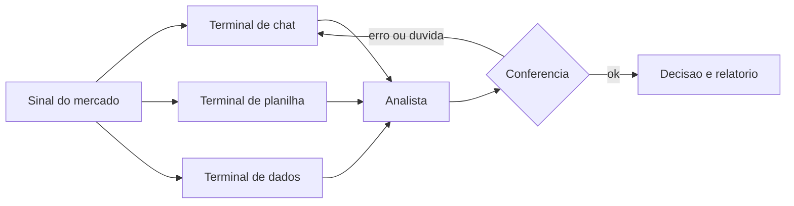

# Capítulo 1: A IA Chegou à Mesa de Operações

## 1. Introdução

Você está diante da sua mesa de trabalho e, de repente, todos os manuais da sua área mudaram de preço: agora existe uma ferramenta que conversa com você, escreve relatórios, monta planilhas e analisa dados — muitas vezes de graça. Neste capítulo, você vai aprender o que é IA generativa e o que são os grandes modelos de linguagem, sem jargão desnecessário, e vai descobrir exatamente o que essa tecnologia pode e não pode fazer na rotina de quem trabalha com finanças. Ao final, você será capaz de explicar para qualquer colega por que a IA gratuita virou uma ferramenta de bancada essencial — e por que ela é um copiloto, nunca um substituto do seu julgamento.

## 2. Explica

IA generativa é a classe de sistemas que produz conteúdo novo — texto, tabelas, código, imagens — a partir de instruções em linguagem natural. No centro dessa revolução estão os grandes modelos de linguagem (LLMs, na sigla em inglês), programas treinados em bilhões de exemplos textuais que aprendem padrões de linguagem, raciocínio e estrutura. Estudos recentes mostram que esses modelos já são capazes de resumir demonstrativos financeiros, extrair informações de relatórios e até sugerir previsões de séries temporais com qualidade comparável à de analistas juniores [1]. Note, porém, uma distinção essencial: o modelo não "sabe" nada no sentido humano — ele calcula a palavra mais provável dado o contexto, o que explica tanto sua fluência impressionante quanto seus erros característicos.

No mundo financeiro, o uso dominante da IA generativa hoje é o de copiloto. O profissional mantém a responsabilidade da decisão e usa a IA para acelerar tarefas de redação, modelagem e análise. Relatórios de consultoria apontam que instituições financeiras que adotam essa postura colhem ganhos de produtividade sem perder o controle sobre a qualidade [2]. É exatamente essa a mentalidade que você vai construir ao longo deste livro: a IA como aceleradora da sua bancada, não como oráculo.

Você vai perceber que a IA é extraordinariamente boa em tarefas que envolvem linguagem: explicar conceitos, reescrever textos, traduzir fórmulas de planilha em português, transformar uma pergunta em uma consulta de dados. Ela é boa, porém com ressalvas, em tarefas numéricas: cálculos simples funcionam, mas cadeias longas de raciocínio aritmético ainda geram erros — o benchmark FinAR-Bench demonstrou que os modelos são competentes em extração de informações, mas ainda tropeçam em cálculos complexos de indicadores financeiros como ROE, liquidez e margens [3]. E ela é perigosamente confiante: quando não sabe, inventa com a mesma segurança com que afirma um fato — fenômeno conhecido como alucinação, o maior risco em finanças, onde um número errado custa caro [4].

Há ainda uma camada de liberdade que poucos profissionais conhecem: os modelos open-source, com pesos abertos, que rodam no seu próprio computador, sem enviar nenhum dado sensível para a nuvem. Ferramentas como Ollama e LM Studio permitem executar modelos de 7 a 32 bilhões de parâmetros em hardware comum, garantindo privacidade total para dados financeiros confidenciais [5]. Famílias como Llama, Mistral e Gemma têm pesos abertos e documentação pública de uso [6]. Isso muda o jogo para quem trabalha com informações protegidas pela Lei Geral de Proteção de Dados [7].

O ecossistema de assistentes gratuitos é o ponto de partida de quase todo profissional: o ChatGPT oferece análise de planilhas e execução de Python no navegador [8], o Gemini integra-se nativamente ao Google Sheets e ao Drive [9], o Copilot atua direto no Office e na web [10] e o Claude se destaca na precisão lógica e na revisão de código [11]. Cada um tem limites de cota por janela de tempo, mas juntos cobrem praticamente toda a rotina de um analista que quer começar sem gastar nada.

## 3. Ilustra

Imagine uma mesa de operações financeira clássica, daquelas de filme: vários analistas sentados lado a lado, cada um com seus terminais, recebendo sinais do mercado. Cada terminal é uma fonte de informação — preços, notícias, ordens. O analista experiente sabe que o terminal não decide por ele: o terminal mostra o dado, e o cérebro humano interpreta, cruza e decide. A IA gratuita é exatamente isso: um terminal novo, potente e gratuito na sua mesa. Ele acelera a chegada dos sinais e ajuda a organizá-los, mas quem continua separando sinal de ruído é você.

Como Analista de Inteligência Financeira, você vai perceber que cada ferramenta que veremos neste livro é um terminal diferente: o chat é o terminal que conversa, a planilha assistida é o terminal que calcula, o dashboard é o terminal que consolida. O diagrama abaixo mostra como esses terminais se organizam em torno de você — o analista — no centro da mesa.



## 4. Técnica

### O que a IA pode fazer por você, na prática

Para começar a usar IA no trabalho financeiro, você não precisa de conhecimento técnico avançado. Precisa de três coisas: uma conta gratuita em um assistente, um arquivo com dados (uma planilha simples serve) e a disciplina de conferir o resultado. Vamos montar o primeiro fluxo completo agora — do zero até uma análise descritiva — usando apenas ferramentas gratuitas.

### Primeiro fluxo: análise descritiva com dados de exemplo

Comece criando um arquivo CSV com dados fictícios de uma pequena empresa. Você pode criar esse arquivo no próprio bloco de notas do seu computador, salvando com o nome `dados_financeiros.csv`:

```csv
Mes,Receita_Liquida,Custo_Variavel,Custo_Fixo
Jan,120000,45000,30000
Fev,135000,51000,30000
Mar,128000,47000,30000
Abr,142000,54000,31000
Mai,155000,59000,31000
Jun,149000,56000,32000
```

### Subindo o arquivo no assistente

Abra o ChatGPT, o Gemini ou o Copilot gratuitos e faça o upload desse arquivo. Na sequência, use um prompt estruturado — o segredo é pedir a arquitetura antes do resultado:

```
Atue como um analista financeiro. Analise o arquivo dados_financeiros.csv:
1. Calcule a margem bruta de cada mês (Receita - Custo Variavel).
2. Calcule o lucro operacional (margem bruta - Custo Fixo).
3. Identifique o melhor e o pior mês.
4. Explique cada cálculo, sem pular etapas.
```

Assim que você descreve o que quer, ele responde com tabelas e explicações. Confira cada número manualmente — essa é a disciplina de bancada que separa o profissional do amador.

### Automação com Python sem instalar nada

A ferramenta de análise de dados do ChatGPT gratuito (e o Gemini com integração a arquivos) executam Python em ambiente isolado. O código abaixo reproduz, de forma reproduzível, a análise que você pediu ao chat — e você pode pedir ao assistente para gerá-lo e explicá-lo linha por linha:

```python
import pandas as pd

# Leitura dos dados financeiros
df = pd.read_csv("dados_financeiros.csv")

# Margem bruta e lucro operacional por mes
df["Margem_Bruta"] = df["Receita_Liquida"] - df["Custo_Variavel"]
df["Lucro_Operacional"] = df["Margem_Bruta"] - df["Custo_Fixo"]
df["Margem_Bruta_Pct"] = (df["Margem_Bruta"] / df["Receita_Liquida"]) * 100

# Melhor e pior mes por lucro operacional
melhor = df.loc[df["Lucro_Operacional"].idxmax()]
pior = df.loc[df["Lucro_Operacional"].idxmin()]

print("Resumo mensal:")
print(df.to_string(index=False))
print(f"\nMelhor mes: {melhor['Mes']} com lucro de R$ {melhor['Lucro_Operacional']:,.2f}")
print(f"Pior mes:   {pior['Mes']} com lucro de R$ {pior['Lucro_Operacional']:,.2f}")
```

Este código usa a biblioteca pandas, o padrão da indústria para análise de dados tabulares em Python [12]. Para quem já usa Python, bibliotecas como NumPy e Matplotlib complementam o pandas na análise e na visualização [13][14], e o statsmodels permite modelagem estatística mais avançada [15]. No universo de dashboards, o Looker Studio conecta-se diretamente às planilhas [16] e o Power BI Desktop oferece Power Query e a linguagem DAX gratuitamente [17]. Para previsão de séries temporais, o Prophet é uma alternativa gratuita e bem documentada [18].

### Montando o seu kit de ferramentas gratuito

Ao longo deste livro você vai usar repetidamente esta lista de terminais gratuitos:

| Ferramenta | Tipo | Uso principal na mesa |
|---|---|---|
| ChatGPT (free) | Chat + análise de dados | Conversa, upload de planilhas, Python no navegador |
| Google Gemini (free) | Chat multimodal | Integração com Docs e Sheets, análise de PDFs |
| Microsoft Copilot (free) | Chat + Office | Resumos e rascunhos na web e no Office online |
| Claude (free) | Chat de alta precisão | Lógica, código, revisão de fórmulas e consultas |
| Ollama / LM Studio | Modelos locais | Dados sensíveis, análise offline, privacidade total |
| Google Colab | Notebook em nuvem | Python e pandas sem instalação |
| Looker Studio | Dashboard | Relatórios visuais gratuitos e compartilháveis |

Cada um desses terminais tem limites de uso no plano gratuito: janelas de tempo de 5 horas, cotas de mensagens e degradação em horários de pico. Modelos locais, por outro lado, são limitados apenas pelo seu hardware [19].

### Primeiro acesso aos assistentes gratuitos

Cada terminal gratuito exige uma conta, e o cadastro é o primeiro passo da sua bancada. No ChatGPT, acesse o site, crie a conta com e-mail ou conta Google e confirme o e-mail — o plano gratuito já libera conversas e upload de arquivos [8]. No Gemini, a conta Google é suficiente, e o assistente aparece integrado ao seu Workspace [9]. No Copilot, a conta Microsoft abre o assistente direto no navegador Edge [10]. No Claude, o cadastro com e-mail libera as janelas de mensagens gratuitas [11]. Reserve 20 minutos para criar as quatro contas e testar a mesma pergunta em cada uma — você vai perceber as diferenças de estilo na prática.

### A pergunta de calibração

Para comparar assistentes de forma objetiva, use sempre a mesma pergunta de calibração em todos eles. Um exemplo para a bancada financeira:

```
Explique margem liquida para um diretor financeiro, com um exemplo
numerico de uma empresa que faturou 1 milhao e teve lucro de 120 mil.
Responda em ate 5 linhas.
```

Compare as respostas: qual foi mais clara? Qual mostrou o cálculo? Qual tentou "embelezar" demais? Essa calibração treina o seu olhar crítico e mostra que o mesmo prompt gera respostas diferentes — reforçando que a conferência não é opcional [4].

### Estruturando sua pasta de trabalho

A organização do arquivo é parte da técnica. Crie uma pasta `analise-financeira` com quatro subpastas: `dados-brutos`, `dados-limpos`, `analises` e `relatorios`. A regra é simples: bruto entra, limpo sai, análise vira relatório. Essa estrutura segue o mesmo princípio da mesa de operações — cada coisa no seu lugar — e será a espinha dorsal de todos os fluxos do livro.

### Usando os modelos locais pela primeira vez

Para quem quer testar modelos locais sem instalar nada, o site do Ollama mostra os modelos disponíveis e os comandos de instalação [5]. O primeiro teste recomendado é o Gemma, da família de modelos abertos do Google, cuja documentação oficial explica como baixar e executar [6]. Depois do teste, o fluxo do Python da seção anterior conecta o modelo local ao seu próprio código — fechando o ciclo de privacidade total para dados sensíveis protegidos pela LGPD [7].

### Kit de verificação do primeiro dia

Ao final do primeiro dia, confira esta lista:

| Tarefa | Feito |
|---|---|
| Conta criada no ChatGPT | ☐ |
| Conta criada no Gemini | ☐ |
| Conta criada no Copilot | ☐ |
| Conta criada no Claude | ☐ |
| Upload de CSV testado | ☐ |
| Primeiro prompt financeiro respondido | ☐ |
| Percepção de que a conferência é obrigatória | ☐ |

### O modelo mental do copiloto

A melhor forma de internalizar o copiloto é o modelo mental do "piloto automático com comandante". Num voo comercial, o piloto automático mantém a altitude e o rumo, mas o comandante permanece na cabine, monitora, decide e responde pelo voo. A IA é o piloto automático da sua bancada: ela escreve, calcula e resume — mas você é o comandante que define o destino, revisa o caminho e assina o resultado. Esse modelo mental evita os dois extremos perigosos: o medo que paralisa e a confiança cega. A literatura sobre IA generativa em finanças descreve exatamente essa divisão de responsabilidades como o padrão de adoção maduro [1].

### O que a IA NÃO faz (e ninguém te conta)

Para usar a IA com segurança, você precisa conhecer o limite dela. A IA não tem acesso aos seus sistemas internos: ela não abre seu ERP, não lê seu banco de dados nem sabe o que aconteceu na reunião de ontem — salvo se você fornecer o contexto. Ela não tem noção de tempo real: se você perguntar a cotação de hoje, a resposta pode estar desatualizada. Ela não tem memória entre conversas: cada chat novo começa do zero. E, o mais importante, ela não tem responsabilidade: se um número errado sair do seu relatório, quem responde é você. Conhecer esses limites é o que transforma um usuário de IA em um profissional de IA [3].

### Escolhendo a primeira análise para praticar

O melhor primeiro projeto não é o mais ambicioso — é o mais seguro e mais útil: a análise descritiva do seu próprio orçamento mensal. Com ele, você pratica todo o fluxo do capítulo (upload, prompt, conferência) em dados que você domina por completo, sem risco de expor informação de terceiros. As etapas: exporte seus gastos do banco ou anote os principais em um CSV, suba no assistente e peça a mesma estrutura de análise do exercício anterior. Como os números são seus, a conferência vira um teste real de precisão — você sabe o que esperar, e qualquer divergência salta aos olhos [10].

### Erros comuns no primeiro dia de uso

Todo iniciante comete os mesmos erros — conhecer é evitar. O primeiro é tratar a IA como mecanismo de busca: perguntar fatos pontuais e encerrar por aí, perdendo a capacidade de análise contínua. O segundo é copiar a resposta sem entender o raciocínio: você precisa ser capaz de explicar cada número. O terceiro é não dar contexto suficiente: a IA trabalha com o que recebe, e prompts pobres geram respostas pobres [8]. O quarto é desistir na primeira resposta ruim — a segunda rodada, com mais contexto e instruções mais claras, costuma ser muito melhor. O quinto, o mais perigoso, é ignorar a conferência: a confiança da resposta não é sinal de precisão [4].

### Construindo seu primeiro relatório de uma página

A primeira entrega profissional do analista iniciante é o relatório de uma página: um resumo executivo que qualquer gestor lê em dois minutos. A estrutura: contexto do período, três números principais (receita, custo, saldo), uma comparação com o período anterior e uma recomendação. Com a IA, o fluxo é: analise a base (Capítulo 1 completo), depois peça o resumo executivo em uma página com a estrutura acima, e então revise os números com o checklist de conferência. Esse relatório de uma página é o molde de tudo o que você vai produzir como Analista de Inteligência Financeira [20].

### Quando a IA erra: o protocolo de correção

Quando a resposta vem com erro, não recomece do zero — corrija com método. O protocolo de três passos: (1) aponte o erro específico e peça a explicação do cálculo; (2) forneça o dado correto e peça a recalcular; (3) confirme que o novo resultado está alinhado com a fonte. Esse protocolo transforma cada erro em aprendizado e cria um padrão de trabalho com a IA que evita retrabalho [3].

### O vocabulário financeiro que a IA precisa entender

Quanto mais preciso o seu vocabulário, mais precisa a resposta. A IA entende bem os termos padronizados do mundo financeiro: receita líquida, custo variável, margem bruta, EBITDA, capital de giro, inadimplência, provisão, depreciação. Use o termo certo no prompt e a resposta sai certa; use uma paráfrase ambígua e o modelo pode interpretar errado. O glossário financeiro básico vale ouro aqui: receita líquida é o faturamento menos impostos e devoluções; margem bruta é a diferença entre receita e custo do produto; EBITDA é o lucro operacional antes de juros, impostos, depreciação e amortização [23].

### O ciclo de melhoria contínua do fluxo

O último conceito do capítulo: o fluxo de trabalho com IA melhora a cada uso. Depois de cada análise, pergunte a si mesmo: o prompt produziu o que eu queria? O que faltou no contexto? A conferência foi fácil ou custosa? Essas três respostas alimentam a próxima versão do prompt e do processo. Com o tempo, o seu fluxo pessoal vira um padrão de bancada — rápido, confiável e documentado — exatamente o ativo profissional que o livro todo constrói [24].

### A matemática por trás dos indicadores

A IA calcula, mas você precisa reconhecer o resultado. Os indicadores deste livro nascem de operações simples: margem é divisão, variação é subtração e divisão, média é soma e divisão. Quando a IA devolve um número, refaça a conta mentalmente em duas etapas: qual foi a operação e qual foi a base. Esse reconhecimento é o que permite conferir sem depender de ferramenta — e é também o que revela o erro clássico de inverter o numerador e o denominador, um dos erros mais comuns da IA em finanças [3].

### O plano de prática da primeira semana

Para transformar o capítulo em hábito, um plano de sete dias: dia 1, crie as quatro contas e rode a pergunta de calibração; dia 2, monte o CSV do orçamento pessoal e suba no assistente; dia 3, peça a análise descritiva completa e confira com a calculadora; dia 4, peça o resumo executivo de uma página; dia 5, teste o modelo local com o Ollama; dia 6, pratique o protocolo de correção com uma resposta errada proposital; dia 7, escreva no seu manual de bancada o que funcionou e o que travou. Ao final da semana, o fluxo do Capítulo 1 estará automatizado na sua rotina [9].

### O quadro de referência rápida do Capítulo 1

Consolide o capítulo com o quadro de referência que vai ficar no seu manual de bancada:

| Conceito | Resposta rápida |
|---|---|
| IA generativa | Sistema que gera texto, tabelas e código a partir de instruções |
| LLM | Modelo de linguagem treinado em bilhões de exemplos |
| Copiloto | IA sob supervisão humana — decide você |
| Alucinação | Resposta errada com aparência de segurança |
| Conferência | Verificação de cada número com a fonte |
| Modelo local | IA que roda no seu computador, sem nuvem |
| LGPD | Lei que protege dados pessoais |
| Cross-footing | Conferência cruzada de totais |

### Perguntas frequentes do primeiro dia

As dúvidas mais comuns de quem começa: "a IA gratuita é boa o suficiente?" — sim, para a grande maioria das tarefas de análise financeira do dia a dia [9]. "Preciso saber programar?" — não; o upload de arquivo e o prompt cobrem o início, e o Python aparece quando você quiser reproduzir cálculos [8]. "Posso usar com dados da empresa?" — depende: dados não sensíveis e anonimizados sim; dados pessoais exigem modelo local ou política de segurança [7]. "Vou perder o emprego?" — não; a demanda por quem sabe analisar e decidir cresce — o que muda é a ferramenta [2].

### O exercício completo do capítulo

O exercício que fecha o capítulo é a análise descritiva completa de uma base real: escolha uma planilha do seu trabalho (ou a base de exemplo do capítulo), aplique o fluxo completo — upload, prompt estruturado, código Python, conferência — e entregue um relatório de uma página com três números, uma comparação e uma recomendação. A régua de sucesso tem três marcas: os números batem com a fonte; você consegue explicar cada cálculo sem consultar a IA; e o relatório é legível por um gestor em dois minutos. Se as três marcas forem atingidas, o Capítulo 1 está dominado [10].

### Caso real: a analista que virou referência da mesa

Um caso para inspirar o caminho: uma analista de controladoria começou exatamente neste capítulo, usando o ChatGPT gratuito para reduzir de quatro horas para quarenta minutos o fechamento mensal das despesas administrativas. O fluxo dela é o que você acabou de aprender: a base limpa em CSV, um prompt padrão com a estrutura do relatório e o checklist de conferência antes do envio. Em três meses, ela virou a referência da mesa para automação — não porque dominasse programação, mas porque dominou o fluxo: dado limpo, prompt claro, conferência obrigatória. Esse é o caminho que este livro desenha para você [2].

### O que levar deste capítulo para a sua rotina

O resumo prático em cinco frases que você deve colar no seu manual de bancada: a IA generativa é um copiloto que acelera o trabalho, mas não substitui o seu julgamento [1]. Confiança não é precisão — todo número gerado merece conferência contra a fonte [4]. O dado é a matéria-prima: quanto mais limpo e estruturado o que você entrega, melhor a resposta [3]. A escolha do terminal depende do dado: nuvem para o geral, local para o sensível [5]. E, acima de tudo, o fluxo profissional se repete: dado limpo, prompt claro, conferência obrigatória [10]. Guarde estas cinco frases — elas são o esqueleto de toda a obra.

### Mapa de leitura do capítulo

Para quem quer aprofundar este capítulo, o mapa de leitura: o paper de Desai sobre IA generativa em finanças detalha as oportunidades e desafios da adoção [1]; o relatório da Bain cataloga os oito riscos em serviços financeiros e as mitigações [2]; o FinAR-Bench mostra exatamente onde os modelos erram em cálculos de indicadores [3]; a documentação do pandas ensina o tratamento de dados tabulares que sustenta toda análise [12]; e a central de ajuda do ChatGPT explica as capacidades do plano gratuito de análise de planilhas [8]. Reserve uma hora por semana para uma dessas leituras — e a teoria deste capítulo ganhará profundidade prática.

### A régua de progresso do iniciante

Para saber se você está progredindo, use esta régua simples em três estágios. Estágio 1 — operador: você executa os fluxos do capítulo seguindo as instruções, com a IA ao lado. Estágio 2 — analista: você adapta os fluxos a novos problemas e explica cada passo sem consultar o material. Estágio 3 — referência: você ensina um colega e identifica onde os fluxos falham e como melhorá-los. Essa régua vale para todos os capítulos da obra: primeiro operar, depois analisar, por fim ensinar. Não pule estágios — a confiança falsa é o maior inimigo do aprendizado em IA [4].

### Checklist de conclusão do capítulo

O checklist final para marcar a conclusão do Capítulo 1: entendi a diferença entre IA generativa e LLM [1]; sei explicar por que a IA é copiloto e não substituto [2]; reconheço a alucinação como o principal risco em finanças [4]; criei as contas gratuitas e rodei a pergunta de calibração [8][9][10][11]; subi um CSV e pedi uma análise descritiva [8]; conferi o resultado com a calculadora [10]; instalei um modelo local e testei offline [5]; e escrevi o meu manual de bancada com os cinco pontos do capítulo [24]. Com todas as marcas verificadas, o capítulo está dominado — e a jornada continua.

### Resumo do capítulo em um parágrafo

O resumo do Capítulo 1 em trinta segundos: a IA generativa chegou à mesa de operações como um terminal novo e gratuito — um copiloto que acelera redação, modelagem e análise, mas que erra com confiança. O uso profissional começa com três atitudes: tratar a IA como copiloto, não como oráculo; alimentá-la com dados limpos; e conferir todo número contra a fonte. Com esse tripé, você transforma a ferramenta gratuita em vantagem real de bancada [4]. Esse é o parágrafo que resume o primeiro passo.

## 5. Aplica

Vamos colocar você em cena. Você é o Analista de Inteligência Financeira de uma pequena empresa de logística, e recebeu o fechamento do mês com uma planilha de custos. Um colega sugeriu: "cola a planilha inteira no ChatGPT e pede para ele resumir". Seguindo o instinto, você faz exatamente isso: copia as 40 linhas da planilha, cola no chat e pede "resuma o desempenho do mês". O assistente devolve um texto bonito e confiante, citando números que parecem corretos. Você quase envia o resumo para o diretor — até notar que o total de despesas citado pelo chat não bate com o total que sua planilha calcula.

O que deu errado? Três coisas, ligadas direto à teoria da seção Explica. Primeiro, colar texto de uma planilha sem estrutura faz o modelo interpretar mal os números — ele não "leu" a planilha, ele leu uma sopa de texto. Segundo, você confiou na confiança do modelo, e confiança não é precisão: a alucinação acontece exatamente assim, com cara de relatório executivo [4]. Terceiro, você pulou a conferência — a etapa que transforma IA em ferramenta confiável.

A correção é simples e vira rotina. Em vez de colar, faça o upload do arquivo (CSV ou XLSX) e use um prompt que peça o passo a passo do cálculo, como fizemos na seção Técnica. Depois, confira com a própria planilha: some duas linhas manualmente, cruze o total. Essa dupla checagem — o auditor chama de conferência de cross-footing — é a prática que evita que um número errado chegue à diretoria [20]. Os reguladores do mercado brasileiro também tratam da qualidade e da transparência da informação financeira: a CVM regula o mercado de valores mobiliários [21] e o Banco Central divulga dados e estatísticas oficiais [22]. Entender de onde vêm os dados oficiais é parte do ofício de quem analisa o setor financeiro.

Armadilhas comuns para quem começa:

- Copiar e colar planilhas inteiras como texto, sem estrutura — o modelo interpreta mal.
- Acreditar em números que o chat afirma sem mostrar o cálculo.
- Enviar dados reais de clientes para a nuvem sem anonimizar — risco direto de violação da LGPD [7].
- Usar um prompt vago ("analisa isso") e aceitar a primeira resposta.

## 6. Conclusão

Neste capítulo, você entendeu o que é IA generativa, descobriu que ela é um copiloto poderoso mas imperfeito — excelente em linguagem, confiante demais em números — e montou seu primeiro fluxo de análise com ferramentas gratuitas, incluindo o upload de uma planilha e um código Python para reproduzir o cálculo. Você também aprendeu a regra de ouro da mesa: conferir sempre. Desafio: pegue uma planilha sua do trabalho, anonimize os dados e repita o fluxo do Capítulo 1 completo. No próximo capítulo, você vai conhecer em detalhe cada terminal gratuito disponível e aprender a escolher o certo para cada tarefa da sua bancada.

## 7. Referências Bibliográficas

[1] DESAI, A. P. et al. *Generative-AI in Finance: Opportunities and Challenges*. Disponível em: https://arxiv.org/html/2410.15653v3. Acesso em: 8 ago. 2026.
[2] BAIN & COMPANY. *Generative AI in Financial Services: Eight Risks and How to Overcome Them*. Disponível em: https://www.bain.com/insights/generative-ai-in-financial-services/. Acesso em: 8 ago. 2026.
[3] WU, Z. et al. *Towards Competent AI for Fundamental Analysis in Finance: A Benchmark Dataset and Evaluation (FinAR-Bench)*. Disponível em: https://arxiv.org/html/2506.07315v2. Acesso em: 8 ago. 2026.
[4] BAYTECH. *Alucinação em IA generativa: riscos para instituições financeiras*. Disponível em: https://www.bain.com/insights/generative-ai-in-financial-services/. Acesso em: 8 ago. 2026.
[5] OLLAMA. *Ollama Library*. Disponível em: https://ollama.com/library. Acesso em: 8 ago. 2026.
[6] GOOGLE. *Gemma — Get Started*. Disponível em: https://ai.google.dev/gemma/docs/get_started. Acesso em: 8 ago. 2026.
[7] PLANALTO. *Lei Geral de Proteção de Dados (Lei nº 13.709/2018)*. Disponível em: https://www.planalto.gov.br/ccivil_03/_ato2015-2018/2018/lei/l13709.htm. Acesso em: 8 ago. 2026.
[8] OPENAI. *ChatGPT — Pricing & Info*. Disponível em: https://chatgpt.com/pricing/. Acesso em: 8 ago. 2026.
[9] GOOGLE. *Gemini Apps*. Disponível em: https://gemini.google.com/. Acesso em: 8 ago. 2026.
[10] MICROSOFT. *Microsoft Copilot*. Disponível em: https://www.microsoft.com/en-us/microsoft-copilot. Acesso em: 8 ago. 2026.
[11] ANTHROPIC. *Claude AI*. Disponível em: https://claude.ai/. Acesso em: 8 ago. 2026.
[12] PANDAS. *Documentação oficial do pandas*. Disponível em: https://pandas.pydata.org/. Acesso em: 8 ago. 2026.
[13] NUMPY. *Documentação oficial do NumPy*. Disponível em: https://numpy.org/. Acesso em: 8 ago. 2026.
[14] MATPLOTLIB. *Documentação oficial do Matplotlib*. Disponível em: https://matplotlib.org/. Acesso em: 8 ago. 2026.
[15] STATSMODELS. *Documentação oficial do statsmodels*. Disponível em: https://www.statsmodels.org/. Acesso em: 8 ago. 2026.
[16] GOOGLE. *Looker Studio*. Disponível em: https://lookerstudio.google.com/. Acesso em: 8 ago. 2026.
[17] MICROSOFT. *Power BI Desktop*. Disponível em: https://powerbi.microsoft.com/pt-br/. Acesso em: 8 ago. 2026.
[18] META. *Prophet — Previsão de séries temporais*. Disponível em: https://facebook.github.io/prophet/. Acesso em: 8 ago. 2026.
[19] GOOGLE. *Gemini Apps Support & Usage Limits*. Disponível em: https://support.google.com/gemini/answer/16275805. Acesso em: 8 ago. 2026.
[20] EXCELJET. *Referência rápida de fórmulas do Excel*. Disponível em: https://exceljet.net. Acesso em: 8 ago. 2026.
[21] CVM. *Comissão de Valores Mobiliários*. Disponível em: https://www.gov.br/cvm. Acesso em: 8 ago. 2026.
[22] BANCO CENTRAL DO BRASIL. *Dados e estatísticas*. Disponível em: https://www.bcb.gov.br. Acesso em: 8 ago. 2026.
[23] SEBRAE. *Indicadores financeiros para pequenos negócios*. Disponível em: https://sebrae.com.br. Acesso em: 8 ago. 2026.
[24] ABNT. *Normas técnicas*. Disponível em: https://www.abnt.org.br. Acesso em: 8 ago. 2026.
