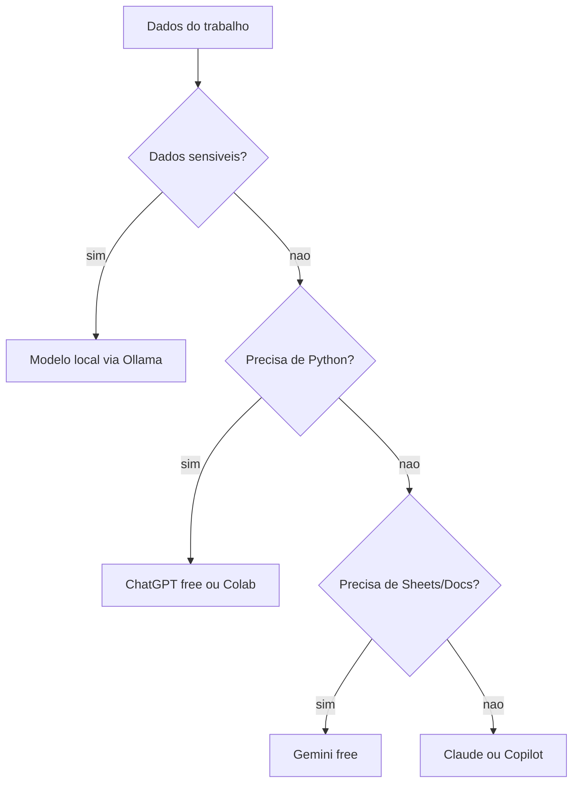

# Capítulo 2: Modelos Gratuitos: Seu Primeiro Terminal

## 1. Introdução

No Capítulo 1, você entendeu que a IA gratuita é um terminal novo na sua mesa de operações e montou seu primeiro fluxo de análise. Agora vamos abrir a caixa: quais são os modelos gratuitos disponíveis, quanto cada um aguenta, e como escolher o terminal certo para cada tarefa da bancada. Este capítulo vai transformar a lista de ferramentas em um método de escolha — porque no mundo real, o profissional que domina a seleção da ferramenta economiza tempo, evita erros e mantém os dados seguros.

## 2. Explica

Existem quatro grandes grupos de modelos gratuitos que você vai usar no trabalho financeiro: os assistentes de nuvem (ChatGPT, Gemini, Copilot e Claude), os modelos open-source locais (Llama, Mistral, Gemma, Qwen), os notebooks em nuvem (Google Colab) e as ferramentas especializadas de planilha e dashboard. Cada grupo resolve um problema diferente, e a diferença essencial entre eles está em três eixos: capacidade, privacidade e cota.

O eixo da capacidade define o que o modelo consegue fazer. Os modelos de nuvem mais recentes dominam conversas, upload de arquivos e execução de código. Estudos mostram que a integração de recuperação de documentos próprios — a técnica RAG — eleva a qualidade das respostas financeiras ao reduzir a dependência do conhecimento genérico do modelo [1]. O eixo da privacidade decide onde seus dados podem circular: dados de clientes e informações contábeis confidenciais não devem sair da sua máquina sem anonimização, sob risco de violação da LGPD [2]. O eixo da cota define quantas mensagens você pode enviar por janela de tempo: os planos gratuitos de nuvem impõem janelas de 5 horas com limites variáveis [3].

O ChatGPT gratuito oferece análise de dados com execução de Python em ambiente isolado, ideal para quem quer transformar CSV em relatório sem instalar nada [4]. O Gemini gratuito se destaca pela integração nativa com o ecossistema Google — Sheets, Docs e Drive — e pela janela de contexto ampla [5]. O Copilot gratuito atua na web e no Office online, útil para rascunhos e resumos no fluxo corporativo da Microsoft [6]. O Claude gratuito é reconhecido pela precisão lógica e pela qualidade na escrita de código e consultas [7].

No outro extremo, os modelos locais rodam offline. Com Ollama, você executa Llama, Mistral, Gemma e Qwen no seu próprio computador — sem cota, sem envio de dados, limitado apenas pelo hardware [8]. Para uma empresa que trata dados de clientes, essa é a única opção que elimina por completo o trânsito de informações para servidores externos. A comunidade de código aberto centraliza esses modelos e seus pesos no Hugging Face, a maior biblioteca pública de modelos do mundo [12]. E a documentação oficial da Gemma, a família de modelos abertos do Google, mostra que modelos de pesos abertos hoje disputam o topo de benchmarks com modelos fechados [13].

Para completar a bancada, o Google Colab oferece notebooks Python gratuitos na nuvem — ideal para análises pesadas sem instalação [14], o Looker Studio é o terminal gratuito de dashboards conectados às planilhas [15], e o Power BI Desktop traz modelagem profissional com Power Query e DAX sem custo [16]. Já o pandas é a biblioteca que você vai usar para manipular os dados financeiros em todos os fluxos deste livro [17].

## 3. Ilustra

Pense na mesa de operações do Capítulo 1: cada terminal tem um papel. O terminal de notícias não serve para executar ordens; o terminal de preços não escreve relatórios. Ninguém em uma mesa profissional usa um único terminal para tudo — e com IA não é diferente. O erro de quem começa é tratar "IA" como uma coisa só, quando na verdade você tem uma bancada de terminais com forças diferentes.

Como Analista de Inteligência Financeira, você vai montar sua própria bancada: um terminal de nuvem para o dia a dia, um terminal local para o dado sensível, um notebook para análises pesadas e um dashboard para apresentar. O diagrama abaixo mostra essa hierarquia de escolha que você vai aplicar na prática.



## 4. Técnica

### Instalando seu primeiro modelo local com Ollama

A maior barreira de entrada dos modelos locais é a instalação — mas hoje ela cabe em quatro comandos. Baixe o Ollama do site oficial [8], instale e rode:

```bash
# Instala e executa o modelo Gemma 3 (4B) — suficiente para resumos e formulacao
ollama run gemma3:4b

# Em outra janela, listar modelos instalados
ollama list

# Baixar um modelo maior para analise de documentos
ollama pull llama3.2:3b
```

Depois de rodar `ollama run`, você conversa com o modelo direto no terminal. Para usar esse modelo dentro de um fluxo de análise de dados, o código abaixo envia uma pergunta e recebe a resposta via API local:

```python
import urllib.request
import json

def perguntar_modelo_local(pergunta: str, modelo: str = "gemma3:4b") -> str:
    """Envia uma pergunta ao modelo local via API do Ollama."""
    payload = json.dumps({"model": modelo, "prompt": pergunta, "stream": False}).encode()
    requisicao = urllib.request.Request(
        "http://localhost:11434/api/generate",
        data=payload,
        headers={"Content-Type": "application/json"},
    )
    with urllib.request.urlopen(requisicao) as resposta:
        corpo = json.loads(resposta.read().decode())
    return corpo.get("response", "")

resumo = perguntar_modelo_local(
    "Explique em 3 frases o que e margem liquida para um diretor financeiro."
)
print(resumo)
```

Esse fluxo é 100% offline: nenhum byte dos seus dados sai da máquina. Para dados financeiros protegidos pela LGPD [2], é a diferença entre trabalhar com segurança e correr risco regulatório.

### Comparando as cotas gratuitas

A tabela abaixo resume o que cada terminal gratuito oferece na prática, para você planejar o dia:

| Terminal | Modelo de uso | Cota gratuita típica | Melhor para |
|---|---|---|---|
| ChatGPT | Nuvem | Conversas com limites de análise de dados | Upload de planilhas e Python |
| Gemini | Nuvem | Janelas de 5h com contexto amplo | Google Sheets, Docs e Drive |
| Copilot | Nuvem | Boosts diários limitados | Resumos e Office online |
| Claude | Nuvem | 15-40 mensagens por janela | Lógica, código e revisão |
| Ollama + modelos locais | Local | Ilimitada (limite = hardware) | Dados sensíveis, offline |

### Criando um prompt de seleção reutilizável

Para escolher o terminal certo sem pensar duas vezes, use esta regra prática em formato de checklist mental:

1. Os dados são confidenciais? → modelo local.
2. Preciso de Python ou análise pesada? → ChatGPT free ou Colab.
3. O trabalho vive no Google Sheets? → Gemini.
4. É revisão de lógica ou código? → Claude.
5. É rascunho rápido em Office? → Copilot.

A consultoria e a literatura confirmam que o maior erro de adoção de IA em finanças não é técnico, e sim de processo: usar a ferramenta errada para o dado errado, sem governança [9]. Escolher o terminal pelo dado é a primeira camada dessa governança. Estudos acadêmicos sobre IA generativa em finanças reforçam que a supervisão humana é o fator decisivo entre ganho de produtividade e perda por alucinação [18], e o benchmark FinAR-Bench mostra que modelos erram justamente no cálculo de indicadores compostos [19]. No mercado brasileiro, o Banco Central e a CVM são as fontes oficiais de dados e regras que você vai consultar ao validar qualquer análise [20][21].

### Benchmark simples entre assistentes

A escolha entre terminais de nuvem não precisa ser por reputação — pode ser por medição. Monte um pequeno benchmark com três tarefas financeiras repetitivas e rode as mesmas perguntas em cada assistente gratuito:

1. Gere uma fórmula de Excel para CAGR a partir de dois valores.
2. Resuma um parágrafo de um relatório financeiro em três linhas.
3. Explique a diferença entre lucro bruto e lucro operacional.

Registre em uma tabela: clareza da resposta, acerto do cálculo, velocidade e formato. Em 30 minutos, você terá um mapa empírico da sua própria bancada — muito mais útil que qualquer comparação genérica da internet.

### Roteiro de instalação do LM Studio

Além do Ollama, o LM Studio é a alternativa gráfica para quem prefere janelas a terminal. O roteiro completo: baixe o instalador do site oficial, instale, abra o aplicativo, pesquise por um modelo como "Gemma 3 4B" ou "Llama 3.2 3B" na aba de modelos, faça o download e inicie uma conversa. A diferença prática: o LM Studio oferece uma interface visual para ajustar parâmetros como temperatura e tamanho da resposta, útil para quem está aprendendo. Os pesos desses modelos estão centralizados na biblioteca do Hugging Face [12] e na documentação da Gemma [13].

### Comparando respostas locais e de nuvem

O teste mais revelador da bancada é rodar a mesma pergunta financeira no modelo local e no assistente de nuvem:

| Critério | Modelo local (Gemma 4B) | Nuvem (ChatGPT free) |
|---|---|---|
| Privacidade | Total (offline) | Requer anonimização |
| Cota | Ilimitada | Limitada por janela |
| Velocidade | Depende do hardware | Depende do servidor |
| Qualidade de cálculo | Boa, com erros em cadeias | Boa, com erros em cadeias |

A conclusão prática: a qualidade de raciocínio dos modelos locais modernos surpreende, mas a conferência continua obrigatória nos dois casos — o erro de cálculo não é exclusividade de nenhum terminal [9].

### Planejando o uso das cotas gratuitas

As cotas gratuitas de nuvem redefinem a sua rotina: tarefas urgentes no início da janela de 5 horas, análises pesadas com reserva de tempo e dados sensíveis sempre no modelo local. Planeje o dia da bancada como se planeja uma escala de mesa: as tarefas críticas primeiro, as exploratórias no restante da janela.

### Prompt de política de uso da bancada

Defina por escrito a política de uso da bancada — é o documento que protege a empresa e você. Use a IA para rascunhar a política:

```
Redija uma politica de uso de IA generativa para a area financeira de
uma empresa com 50 funcionarios. Inclua: (1) quais dados podem ir para
assistentes de nuvem e quais exigem modelo local; (2) a obrigacao de
anonimizacao antes de upload; (3) a regra de conferencia humana antes
de qualquer decisao ou publicacao; (4) o papel do responsavel pela
bancada. Linguagem pratica, maximo 40 linhas.
```

A política resultante é o freio de mão da mesa — e serve também como roteiro de onboarding para quem entrar na equipe [9].

### Testando o text-to-SQL local

Um caso de uso avançado dos modelos locais é a consulta em linguagem natural a bancos de dados financeiros: você pergunta em português e o modelo gera a consulta SQL. O fluxo típico: carregue um CSV num banco SQLite local, peça ao modelo a consulta e execute-a. O ganho é duplo: privacidade total e produtividade imediata para quem não domina SQL. A comunidade open-source documenta esse padrão com modelos como Llama e Qwen [11].

### Quando pagar (e quando não)

O plano gratuito resolve 80% da bancada; os planos pagos resolvem os 20% restantes — janelas maiores, modelos de ponta, Deep Research e automações profundas. A regra de ouro: não pague enquanto o gratuito atende. Só considere pagar quando a cota gratuita estiver travando uma tarefa recorrente e crítica, ou quando o modelo gratuito falhar de forma consistente numa tarefa essencial [14].

### O papel do contexto na qualidade da resposta

O fator que mais muda a qualidade da resposta é o contexto que você fornece. Um pedido genérico gera resposta genérica; um pedido com papel, dados e formato gera resposta profissional. A técnica dos três C: Contexto (o cenário e os dados), Critério (as regras que a resposta deve seguir) e Formato (como a resposta deve ser apresentada). Na prática financeira: "Considerando a base de fluxo de caixa que vou anexar, calcule a margem operacional por mês, usando a regra receita menos custos operacionais, e apresente em tabela com duas casas decimais" — muito mais produtivo que "calcula a margem aí" [1].

### A bancada híbrida: nuvem + local no mesmo fluxo

O padrão profissional é a bancada híbrida: o assistente de nuvem cuida das tarefas sem dados sensíveis, e o modelo local cuida das confidenciais — no mesmo fluxo de trabalho. Um exemplo: o resumo da reunião vai para a nuvem; a análise da folha de pagamento fica no local. Essa divisão não é apenas prática, é o desenho recomendado para quem opera sob a LGPD: minimizar o trânsito de dados pessoais é dever do controlador [2][10]. A documentação de governança da ANPD detalha as boas práticas aplicáveis a esse desenho [10].

### Medindo a qualidade da resposta

Como saber se um modelo respondeu bem? Use critérios objetivos em vez de impressão. Os quatro critérios da bancada: precisão factual (os números estão certos?), completude (a resposta cobriu tudo que foi pedido?), clareza (dá para usar sem retrabalho?) e eficiência (quantas rodadas foram necessárias?). Registre a pontuação das respostas ao longo de uma semana e você terá um ranking empírico dos seus terminais para cada tipo de tarefa — decisão baseada em evidência, não em moda [18].

### O erro de contexto: quando a IA "inventa" por falta de informação

Grande parte das respostas erradas não vem de falha do modelo, mas de falta de contexto. Quando você pergunta "qual foi o pior mês?" sem dizer qual base, o modelo chuta — e chute vira confiança. A correção é estrutural: sempre declare a fonte (arquivo, aba, período) e o critério (pior em quê?). Esse hábito reduz drasticamente a taxa de resposta inútil e é a diferença entre operar a IA e ser operado por ela [9].

### O plano de avaliação da bancada em uma semana

Para escolher seus terminais definitivos, uma semana de avaliação sistemática: cada dia, use um assistente diferente para as mesmas três tarefas padrão (fórmula, resumo, análise de um CSV fictício) e registre os quatro critérios de qualidade. Ao final da semana, some as notas e defina a hierarquia da sua bancada: o terminal principal, o reserva e o local para dados sensíveis. Essa avaliação baseada em evidência evita o erro de adotar o assistente da moda sem medir [18].

### A questão da segurança da conta

A segurança das suas contas de IA é parte da bancada: senha forte e única, verificação em duas etapas ativada e cuidado com o compartilhamento de conversas — uma conversa com dados financeiros não deve ser compartilhada publicamente nem colada em fóruns. A política de segurança da informação da empresa deve cobrir o uso de contas pessoais para trabalho; na ausência dela, a regra conservadora é: dados sensíveis nunca em contas pessoais [2][10].

### O quadro de comparação final dos terminais

O quadro que fecha a escolha da bancada:

| Terminal | Custo | Privacidade | Melhor papel na mesa |
|---|---|---|---|
| ChatGPT free | Zero | Média (nuvem) | Análise de arquivos e Python |
| Gemini free | Zero | Média (nuvem) | Sheets, Docs e contexto amplo |
| Copilot free | Zero | Média (nuvem) | Office e rascunhos web |
| Claude free | Zero | Média (nuvem) | Lógica, código e revisão |
| Ollama + local | Zero | Total (offline) | Dados sensíveis e privacidade |

### Perguntas frequentes sobre os terminais

"Preciso de GPU para rodar modelo local?" — modelos de 3B-4B rodam até em notebooks comuns [8]. "Modelo local é pior que nuvem?" — em tarefas simples de redação e extração, a diferença é pequena; em raciocínio complexo, a nuvem ainda lidera [9]. "Posso misturar os terminais no mesmo fluxo?" — sim, e é o padrão recomendado [2]. "Os planos gratuitos vão acabar?" — não há sinal disso; os modelos free são estratégia de aquisição das empresas [14].

### O exercício completo do capítulo

O exercício que fecha o capítulo é a montagem da sua bancada pessoal: crie as contas gratuitas, instale o Ollama com um modelo local, rode a pergunta de calibração em cada terminal e preencha o quadro de comparação com notas de 0 a 10 nos quatro critérios (precisão, completude, clareza, eficiência). Depois, escreva a política de uso da sua bancada em 10 linhas, usando o prompt da seção Técnica como ponto de partida. A régua de sucesso: você sabe dizer, para cada tarefa da sua rotina, qual terminal usa e por quê — e tem um documento escrito que protege a empresa e você [18].

### Caso real: a tesouraria que travou na nuvem

Uma história real para fixar a escolha pelo dado: a tesouraria de uma distribuidora começou a usar um assistente de nuvem para consolidar contratos de fornecedores. O assistente era ótimo — até a área de compliance detectar que dados de contratos haviam trafegado para servidores externos, exigindo registro de incidente junto à autoridade de proteção de dados [10]. A correção não foi abandonar a IA — foi trocar o terminal: a consolidação passou para um modelo local via Ollama, com o mesmo resultado e zero trânsito de dados. A lição virou política da empresa: primeiro o dado, depois o terminal. É exatamente a regra que você aplicou na seção Aplica deste capítulo [2].

### O que levar deste capítulo para a sua rotina

As cinco frases do capítulo para o manual: nenhum terminal é universal — cada um tem uma força e um limite [9]. Dado sensível não sai da rede: modelo local é o caminho [2]. Cota gratuita é recurso finito: planeje o dia da bancada [3]. Modelo local moderno surpreende — e erra — tanto quanto a nuvem: conferência nos dois [9]. E a escolha do terminal é decisão técnica, não moda: meça, compare, decida [18]. Com essas cinco, você monta e opera a bancada com critério.

### Mapa de leitura do capítulo

Para aprofundar a escolha dos terminais: a página de planos do ChatGPT detalha o que o free inclui e o que é pago [4]; a documentação do Gemini explica os limites de uso por janela [3]; o site do Copilot apresenta as capacidades do assistente da Microsoft [6]; o Claude mostra as funcionalidades de código e análise [7]; a biblioteca do Ollama lista os modelos locais disponíveis e seus tamanhos [8]; e a documentação da Gemma apresenta a família de modelos abertos do Google [13]. Com uma leitura por semana, você conhece a bancada inteira — e a escolha do terminal certo vira decisão informada.

### A régua de progresso da bancada

A régua da bancada em três estágios: estágio 1 — usuário: você usa os terminais gratuitos para tarefas pontuais. Estágio 2 — operador: você escolhe o terminal pelo dado e planeja as cotas do dia. Estágio 3 — governança: você define a política de uso da bancada, treina colegas e audita o que cada um envia. A maioria das pessoas para no estágio 1; o profissional de IA chega ao 3. E a diferença entre os estágios não é talento — é a disciplina de escolher pelo dado e documentar a decisão, exatamente o que este capítulo treinou [18].

### Checklist de conclusão do capítulo

O checklist final do Capítulo 2: criei as contas gratuitas dos assistentes de nuvem [4][5][6][7]; instalei o Ollama e rodei um modelo local [8]; executei o fluxo de perguntas em Python via API local [8]; rodei a pergunta de calibração e comparei as respostas [18]; montei o quadro de comparação com os quatro critérios [18]; escrevi a política de uso da bancada em 10 linhas [9]; e identifiquei quais tarefas da minha rotina exigem modelo local por privacidade [2]. Com todas as marcas, a bancada está montada — e a escolha do terminal virou decisão técnica.

### Resumo do capítulo em um parágrafo

O resumo do Capítulo 2 em trinta segundos: você tem uma bancada de terminais gratuitos, não um único assistente. Os de nuvem (ChatGPT, Gemini, Copilot, Claude) cobrem o dia a dia com cotas por janela; os locais (Ollama, LM Studio) garantem privacidade total para dados sensíveis. A escolha do terminal é decisão pelo dado: nuvem para o geral, local para o confidencial — e a conferência é obrigatória nos dois [9]. Esse é o parágrafo que resume a bancada.

## 5. Aplica

Cena de contraste. Você trabalha na tesouraria de uma distribuidora e precisa consolidar uma relação de fornecedores com dados sensíveis de contratos. Um colega entusiasmado recomenda: "usa o ChatGPT gratuito, cola tudo aí que ele organiza". Você segue o conselho e cola nomes, valores e cláusulas diretamente no chat. A ferramenta organiza tudo lindamente. Três dias depois, a área de compliance avisa que dados de contratos trafegaram para um servidor de terceiros, e a empresa precisou registrar o incidente junto à Autoridade Nacional de Proteção de Dados [10].

O diagnóstico é claro: o problema não foi a IA, foi a escolha do terminal. Dados sensíveis não deveriam ter saído da rede da empresa. A correção: refazer a tarefa em um modelo local com o Ollama, usando o fluxo da seção Técnica — mesmo resultado organizado, zero trânsito de dados. Agora a regra da bancada está internalizada: primeiro o dado, depois o terminal. Para reforçar a segurança, a política da empresa deve prever anonimização antes de qualquer envio a nuvem [22] — o mesmo princípio que o sebrae recomenda a pequenos negócios ao tratar indicadores e informações estratégicas [23].

Armadilhas comuns:

- Usar chat de nuvem com dados de clientes sem anonimização.
- Descartar modelos locais por achar que são inferiores — modelos de 7B a 32B já resolvem a maioria das tarefas de redação e extração [11].
- Ficar preso a um único assistente por hábito, sem testar os concorrentes gratuitos.
- Não planejar as cotas — esgotar o limite no meio de uma análise urgente.

## 6. Conclusão

Você conheceu os quatro grupos de modelos gratuitos, aprendeu a compará-los pelos eixos de capacidade, privacidade e cota, instalou um modelo local com o Ollama e criou uma regra de escolha baseada no dado. A transformação deste capítulo: você deixou de ver "IA" como uma coisa só e passou a ver uma bancada de terminais. Desafio: instale o Ollama, rode um modelo local e compare a resposta dele com a do seu assistente de nuvem favorito para a mesma pergunta financeira. No próximo capítulo, vamos à matéria-prima: de onde vêm os dados financeiros que alimentam todos esses terminais.

## 7. Referências Bibliográficas

[1] LOPEZ-LIRA, A. et al. *Bridging Language Models and Financial Analysis*. Disponível em: https://arxiv.org/html/2503.22693v1. Acesso em: 8 ago. 2026.
[2] PLANALTO. *Lei Geral de Proteção de Dados (Lei nº 13.709/2018)*. Disponível em: https://www.planalto.gov.br/ccivil_03/_ato2015-2018/2018/lei/l13709.htm. Acesso em: 8 ago. 2026.
[3] GOOGLE. *Gemini Apps Support & Usage Limits*. Disponível em: https://support.google.com/gemini/answer/16275805. Acesso em: 8 ago. 2026.
[4] OPENAI. *ChatGPT — Pricing & Info*. Disponível em: https://chatgpt.com/pricing/. Acesso em: 8 ago. 2026.
[5] GOOGLE. *Gemini Apps*. Disponível em: https://gemini.google.com/. Acesso em: 8 ago. 2026.
[6] MICROSOFT. *Microsoft Copilot*. Disponível em: https://www.microsoft.com/en-us/microsoft-copilot. Acesso em: 8 ago. 2026.
[7] ANTHROPIC. *Claude AI*. Disponível em: https://claude.ai/. Acesso em: 8 ago. 2026.
[8] OLLAMA. *Ollama Library*. Disponível em: https://ollama.com/library. Acesso em: 8 ago. 2026.
[9] BAIN & COMPANY. *Generative AI in Financial Services: Eight Risks and How to Overcome Them*. Disponível em: https://www.bain.com/insights/generative-ai-in-financial-services/. Acesso em: 8 ago. 2026.
[10] ANPD. *Autoridade Nacional de Proteção de Dados*. Disponível em: https://www.gov.br/anpd. Acesso em: 8 ago. 2026.
[11] HUGGING FACE. *Open-Source Models*. Disponível em: https://huggingface.co/. Acesso em: 8 ago. 2026.
[12] HUGGING FACE. *Open-Source Models*. Disponível em: https://huggingface.co/. Acesso em: 8 ago. 2026.
[13] GOOGLE. *Gemma — Get Started*. Disponível em: https://ai.google.dev/gemma/docs/get_started. Acesso em: 8 ago. 2026.
[14] GOOGLE. *Google Colab*. Disponível em: https://colab.research.google.com/. Acesso em: 8 ago. 2026.
[15] GOOGLE. *Looker Studio*. Disponível em: https://lookerstudio.google.com/. Acesso em: 8 ago. 2026.
[16] MICROSOFT. *Power BI Desktop*. Disponível em: https://powerbi.microsoft.com/pt-br/. Acesso em: 8 ago. 2026.
[17] PANDAS. *Documentação oficial do pandas*. Disponível em: https://pandas.pydata.org/. Acesso em: 8 ago. 2026.
[18] DESAI, A. P. et al. *Generative-AI in Finance: Opportunities and Challenges*. Disponível em: https://arxiv.org/html/2410.15653v3. Acesso em: 8 ago. 2026.
[19] WU, Z. et al. *Towards Competent AI for Fundamental Analysis in Finance: A Benchmark Dataset and Evaluation (FinAR-Bench)*. Disponível em: https://arxiv.org/html/2506.07315v2. Acesso em: 8 ago. 2026.
[20] BANCO CENTRAL DO BRASIL. *Dados e estatísticas*. Disponível em: https://www.bcb.gov.br. Acesso em: 8 ago. 2026.
[21] CVM. *Comissão de Valores Mobiliários*. Disponível em: https://www.gov.br/cvm. Acesso em: 8 ago. 2026.
[22] ANPD. *Autoridade Nacional de Proteção de Dados*. Disponível em: https://www.gov.br/anpd. Acesso em: 8 ago. 2026.
[23] SEBRAE. *Indicadores financeiros para pequenos negócios*. Disponível em: https://sebrae.com.br. Acesso em: 8 ago. 2026.
