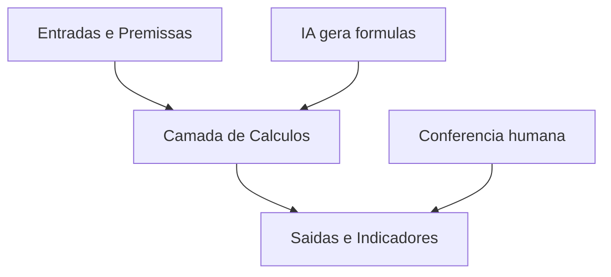

# Capítulo 4: Planilhas: A Bancada de Trabalho

## 1. Introdução

No Capítulo 3, você aprendeu a limpar e organizar os dados financeiros — a matéria-prima. Agora vamos à ferramenta onde essa matéria-prima ganha forma: a planilha. Excel e Google Sheets são a bancada de trabalho de praticamente todo analista financeiro, e é exatamente nelas que a IA gratuita produz o maior ganho imediato. Neste capítulo, você vai consolidar os fundamentos essenciais de planilhas para finanças e, mais importante, vai aprender as boas práticas de modelagem que fazem a IA trabalhar bem com você. Ao final, você será capaz de estruturar uma planilha financeira profissional — com premissas, entradas e saídas separadas — pronta para receber fórmulas geradas e validadas por IA.

## 2. Explica

Toda planilha financeira bem construída é uma máquina de três andares. No primeiro andar ficam as premissas: taxas, inflação, projeções — os números que você pode mudar. No segundo, os cálculos: fórmulas que transformam premissas em resultados. No terceiro, as saídas: resumos, gráficos e dashboards. Quando essa separação existe, a análise de sensibilidade — "e se a receita cair 10%?" — vira uma mudança de célula. Quando ela não existe, a planilha vira um emaranhado onde nenhuma IA (nem humano) consegue trabalhar com segurança.

Os fundamentos que sustentam essa arquitetura são poucos e essenciais. Referências de células (A1, B2) permitem que fórmulas apontem para valores, em vez de repeti-los. As funções essenciais — SOMA, SE, PROCV, ÍNDICE/CORRESP — resolvem a grande maioria das tarefas de consolidação e busca. E as tabelas dinâmicas transformam listas brutas em resumos em segundos. A Microsoft documenta todo esse repertório na central de suporte do Excel [1], e o Google mantém a lista oficial de funções do Sheets [2]. Guias práticos brasileiros reúnem as principais ferramentas de IA para planilhas e como aplicá-las no dia a dia [3].

Por que isso importa para a IA? Porque os assistentes de chat entendem e geram fórmulas com precisão impressionante — inclusive em português. Você descreve a lógica em linguagem natural e a IA devolve a fórmula pronta. O ChatGPT tem integração oficial com Excel e Google Sheets para auxiliar exatamente nesse fluxo [4], o Copilot do Microsoft 365 gera fórmulas e formatações por comando de texto [5], e o Gemini no Google Sheets organiza e estrutura planilhas diretamente [6]. Ferramentas dedicadas de conversão de texto em fórmula completam o cenário para quem prefere não depender de um assistente geral [3].

A disciplina, porém, continua sua: a IA gera a fórmula, e você valida o resultado. Relatórios da indústria reforçam que o erro típico não é a fórmula errada, é a ausência de conferência [7]. Para análises mais pesadas que a planilha não suporta, o caminho é o Python: o pandas manipula as mesmas bases com poder total [8], o Google Colab roda tudo no navegador sem instalação [9], e o PandasAI permite fazer perguntas em linguagem natural direto sobre os DataFrames [10].

## 3. Ilustra

Na mesa de operações, a bancada de trabalho é onde o analista monta o painel de indicadores: placas de acrílico com os números que a praça manda, organizadas para leitura rápida. A planilha é o mesmo painel, em versão digital. Se as placas estiverem espalhadas sem ordem — um número aqui, outro ali, uma anotação colada por cima — ninguém consegue operar. Mas quando cada placa tem seu lugar, o operador lê o painel em um segundo e identifica o que mudou.

Como Analista de Inteligência Financeira, você vai tratar a planilha como esse painel: premissas em uma área clara, cálculos no meio, indicadores no topo. O diagrama abaixo mostra a arquitetura de três andares que você vai aplicar em toda planilha do livro.



## 4. Técnica

### Estruturando a planilha de orçamento familiar

Vamos construir a planilha que você vai usar como exercício — um orçamento mensal com a arquitetura de três andares. No Excel ou no Sheets, crie três áreas com cabeçalhos claros:

```
AREA 1 - PREMISSAS (colunas A e B)
A1: Premissas
A2: Renda mensal       B2: 8000
A3: Taxa de poupanca   B3: 10%

AREA 2 - CALCULOS (colunas D e E)
D1: Calculos
D2: Poupanca           E2: =B2*B3
D3: Despesas           E3: 6200
D4: Saldo final        E4: =B2-E2-E3

AREA 3 - SAIDAS (colunas G e H)
G1: Indicador
G2: Taxa de poupanca real  H2: =E2/B2
```

### Gerando fórmulas complexas com IA

Agora o fluxo de IA. Peça ao ChatGPT, ao Gemini ou ao Copilot que gere a fórmula de uma tarefa real — por exemplo, a taxa de crescimento anual composta (CAGR) de receitas entre dois anos:

```
Prompt: Quero calcular o CAGR da receita entre o ano 1 (R$ 1.200.000,
célula B2) e o ano 3 (R$ 1.650.000, célula B4), com 2 períodos.
Escreva a fórmula do Excel e explique o que ela faz.
```

A resposta típica é esta fórmula, pronta para colar na planilha:

```
=(B4/B2)^(1/2)-1
```

### Validando fórmulas com a IA revisora

A segunda metade do fluxo é a validação. Cole uma fórmula sua e peça a revisão:

```
Prompt: A fórmula =SOMA(B2:B10)-SOMA(C2:C10)+B15 está correta para
calcular o saldo operacional? Aponte riscos e proponha uma versão mais
segura usando nomes de intervalos.
```

A IA revisora explica a lógica, identifica riscos (células vazias, referências absolutas) e sugere a versão nomeada — muito mais legível e menos sujeita a erro quando a planilha cresce.

### Tabela dinâmica como primeiro passo de análise

Com a base limpa do Capítulo 3, você cria a primeira tabela dinâmica em minutos:

1. Selecione a base `fluxo_caixa_limpo.csv` aberta no Excel/Sheets.
2. Em Inserir, escolha Tabela Dinâmica.
3. Linhas: Competência. Valores: Entradas e Saídas (soma).
4. O resumo mensal aparece em segundos — o mesmo resultado que o pandas calculou no Capítulo 3, agora na bancada.

A documentação do Excel detalha tabelas dinâmicas e as funções essenciais [1], e a lista do Google Sheets cobre as equivalentes no navegador [2]. Para referência rápida de fórmulas no dia a dia, o ExcelJet organiza as funções por categoria [11]. Quando a planilha vira dashboard, o Looker Studio se conecta diretamente às tabelas do Sheets [12] e o Power BI Desktop oferece modelagem e DAX sem custo [13]. E para prever o próximo mês a partir do histórico da tabela, o Prophet gera projeções de séries temporais em poucas linhas [14].

### Referências absolutas e relativas na prática

O erro mais comum de quem começa a arrastar fórmulas é a referência errada. A referência relativa (B2) muda quando a fórmula é copiada; a absoluta ($B$2) fica travada. Na análise financeira, o padrão profissional é misturar as duas: travam-se as premissas ($B$2) e deixam-se relativas as células da linha atual. Exemplo real de análise vertical de DRE:

```
=C2/$B$2     → participação da despesa C2 sobre a receita B2, arrastável para baixo
=C3/$B$2     → próxima linha, mesmo denominador
```

Peça à IA para revisar uma coluna inteira de fórmulas e sinalizar onde falta o cifrão — ela identifica referências quebradas em segundos [5].

### Usando nomes de intervalos

A evolução natural das referências são os nomes. Em vez de `=$B$2`, nomeie a célula como `Receita_Base` e use `=C2/Receita_Base`. A planilha fica legível como um texto, e a IA entende o contexto muito melhor ao gerar fórmulas novas — os nomes carregam significado que a célula B2 não tem. A documentação do Excel cobre a criação e o uso de nomes [1].

### Exercício: planilha de conciliação bancária

Um exercício clássico de bancada: monte uma conciliação entre o extrato bancário e o controle interno. Use a arquitetura de três andares:

1. **Premissas:** data-base e saldo inicial informado.
2. **Cálculos:** coluna de lançamentos do extrato, coluna de lançamentos internos, diferenças por comparação.
3. **Saídas:** total de diferenças e lista de lançamentos sem correspondência.

Peça à IA que escreva a fórmula de busca dos lançamentos sem correspondência usando PROCV ou ÍNDICE/CORRESP [2]. Confira o resultado cruzando as linhas manualmente — a disciplina de sempre.

### Checklist de uma planilha profissional

Antes de considerar uma planilha pronta, rode este checklist:

| Verificação | Status |
|---|---|
| Premissas separadas dos cálculos | ☐ |
| Nomes de intervalos em células críticas | ☐ |
| Referências absolutas onde necessário | ☐ |
| Cenário de sensibilidade testado | ☐ |
| Totais cruzados com a fonte | ☐ |
| Dados sensíveis anonimizados | ☐ |
| Fórmulas revisadas por IA | ☐ |

### Funções essenciais que a IA escreve por você

Existe um conjunto de funções que domina o trabalho financeiro em planilhas — e a IA escreve todas elas em segundos. As mais usadas: SOMA para totais, SE para condições, PROCV e ÍNDICE/CORRESP para buscas, SOMASE e CONT.SE para somas condicionais, SEERRO para tratamento de erros e TEXTO para formatação. O fluxo prático: descreva o objetivo em português ("quero somar as despesas do departamento comercial no mês de junho") e peça a fórmula. A IA devolve a expressão pronta, e você a cola na célula [1][2].

### Validação cruzada entre planilha e Python

Quando o número é crítico demais para confiar em uma única ferramenta, use a validação cruzada: calcule o mesmo total na planilha e no pandas, e confira se batem. Esse é o padrão de auditoria de bancada:

```python
import pandas as pd

# Total de despesas calculado no pandas (mesma base da planilha)
df = pd.read_csv("fluxo_caixa_limpo.csv")
total_despesas_pandas = df["saidas_operacionais"].sum() + df["saidas_financeiras"].sum()
print(f"Total de despesas (pandas): R$ {total_despesas_pandas:,.2f}")
print("Compare com o total da planilha e confira se batem.")
```

Se os números divergirem, a diferença aponta exatamente onde está o erro — referência quebrada, linha oculta ou célula somada duas vezes [8].

### Protegendo a planilha com senha e auditoria

A etapa final de uma planilha profissional é a proteção: bloqueie as células de fórmula para evitar que alguém sobrescreva um cálculo, proteja a aba de premissas e registre quem editou o quê. Tanto o Excel quanto o Sheets permitem proteger abas e intervalos. Quando a planilha alimenta decisões e relatórios externos, essa trilha de auditoria é exigência de compliance [15].

### Formatando números como um profissional

A formatação é a camada de profissionalismo que diferencia uma planilha de rascunho. As regras básicas: moeda em duas casas decimais com separador de milhar, percentuais com sinal de porcentagem, datas no padrão brasileiro e negrito apenas em cabeçalhos e totais. A IA formata em segundos: "formate a coluna B como moeda brasileira com duas casas e a coluna C como percentual" — e a planilha ganha leitura profissional instantânea [1]. A formatação consistente é também o que permite que a IA entenda melhor os dados quando você voltar a analisá-los [2].

### A planilha como fonte do dashboard

A planilha bem modelada é o alimento natural dos dashboards que você vai montar no Capítulo 7. Quando a arquitetura de três andares está em ordem, o Looker Studio conecta a aba de saídas direto ao painel [12], e o Power BI importa a aba de cálculos com Power Query [13]. A disciplina de hoje é a matéria-prima do painel de amanhã: uma planilha desorganizada gera um dashboard desorganizado, com o mesmo custo de manutenção — e o dobro de erros [7].

### O exercício da planilha de controle de custos

O exercício completo deste capítulo é a planilha de controle de custos de uma pequena empresa de serviços. A arquitetura em três andares: aba Premissas (salários, aluguel, taxa de comissão), aba Lançamentos (receitas e despesas por mês) e aba Relatório (margem, resultado acumulado, comparativo mensal). Use a IA em cada etapa: peça a arquitetura, depois as fórmulas de cada aba, depois a formatação — conferindo cada resultado. Ao final, teste um cenário: reduza a taxa de comissão em 2 pontos e veja o resultado recalcular. Essa planilha completa é a prova prática de tudo que o capítulo ensinou [1][2].

### Erros de fórmula que a IA ajuda a encontrar

Alguns erros de fórmula são clássicos e difíceis de enxergar: referência a célula errada (B2 em vez de B3), intervalo que não fecha (SOMA(B2:B9) quando deveria ser B2:B10), linha oculta somada por engano, texto no lugar de número e fórmula arrastada que corrompe a referência. A IA encontra esses erros em segundos quando você pede: "revise a coluna D e aponte referências que não batem com o cabeçalho" [5]. O hábito da revisão dirigida é o que impede que um erro de fórmula silencioso atravesse meses de planilha [7].

### O dicionário de funções para finanças

Organize por função o repertório que a IA vai escrever por você: consolidação (SOMA, SOMAIF, SOMASES), busca (PROCV, PROCH, ÍNDICE/CORRESP), condição (SE, SEERRO, SE(E), SE(OU)), texto (TEXTO, CONCATENAR, SUBSTITUIR) e data (HOJE, MÊS, DIATRABALHO). Cada categoria resolve um tipo de problema recorrente: consolidação fecha totais, busca cruza tabelas, condição classifica, texto limpa, data organiza períodos. Guarde essa lista no seu manual — e peça à IA a função certa para cada caso [1][2].

### O exercício de modelagem: a planilha do fluxo de caixa semanal

O exercício avançado: a planilha de fluxo de caixa semanal com previsão de 12 semanas. Arquitetura: aba Premissas (prazo médio de recebimento, prazo médio de pagamento, saldo inicial), aba Entradas (recebimentos previstos por semana), aba Saídas (pagamentos por semana) e aba Projeção (saldo projetado semana a semana). Use a IA para as fórmulas de projeção e para o alerta de saldo mínimo — e confira a projeção da primeira semana com o saldo real. Essa planilha é o instrumento de gestão de caixa que qualquer gestor valoriza [1][13].

### O quadro das funções essenciais

O quadro que resume o repertório básico da bancada:

| Função | O que faz | Exemplo financeiro |
|---|---|---|
| SOMA | Soma um intervalo | Total de despesas do mês |
| SE | Testa condição | Classifica despesa acima do limite |
| PROCV | Busca vertical | Encontra o custo de um produto |
| ÍNDICE/CORRESP | Busca flexível | Cruza tabelas por posição |
| SOMAIF | Soma condicional | Soma despesas de um departamento |
| SEERRO | Trata erro | Substitui erro por mensagem |

### Perguntas frequentes sobre planilhas

"Planilha ou Python?" — planilha para rotina e compartilhamento; Python para volume e reprodução [8]. "Google Sheets ou Excel?" — o ecossistema em que sua equipe vive [12][13]. "A IA pode quebrar minha planilha?" — não, se você aplicar as mudanças uma por vez e versionar [15]. "Toda planilha precisa de três andares?" — as que alimentam decisão sim; as descartáveis não [7].

### O exercício completo do capítulo

O exercício que fecha o capítulo é a reconstrução de uma planilha real sua com a arquitetura de três andares: separe as premissas, os cálculos e as saídas; nomeie os intervalos críticos; gere as fórmulas com IA e valide cada uma; proteja as abas e versione o arquivo. A régua de sucesso tem cinco marcas: a planilha responde a um cenário mudando uma única premissa; os totais batem com a fonte; as fórmulas têm nomes legíveis; a conferência cruzada com o pandas passou; e um colega entende a planilha sem explicação oral [1][2].

### Caso real: o orçamento que ninguém conseguia entender

Uma história comum: o orçamento anual da empresa era uma planilha de 12 abas, com fórmulas embutindo valores fixos e premissas espalhadas por células aleatórias. Quando o CFO perguntava "e se a receita cair 10%?", a resposta levava uma tarde — e ninguém tinha certeza do número. A reconstrução com a arquitetura de três andares mudou o jogo: uma aba de premissas no topo, cálculos no meio, saídas em um painel. A pergunta do CFO passou a ser respondida em segundos, mudando uma célula [7]. A IA acelerou a reconstrução gerando as fórmulas; a arquitetura — o desenho dos três andares — foi a decisão do analista. É essa combinação que este capítulo ensina [1][2].

### O que levar deste capítulo para a sua rotina

As cinco frases do capítulo para o manual: toda planilha de decisão tem três andares — premissas, cálculos e saídas [7]. Referência absoluta trava, relativa arrasta: o cifrão decide o comportamento [1]. A IA escreve a fórmula; você valida o resultado [5]. Nome de intervalo é legibilidade: a planilha vira texto [1]. E a conferência cruzada com o pandas é o selo de qualidade da bancada [8]. Com essas cinco, sua bancada de planilhas está estruturada.

### Mapa de leitura do capítulo

Para aprofundar planilhas: a documentação do Excel cobre funções, referências e tabelas dinâmicas [1]; a lista oficial do Google Sheets apresenta todas as funções do navegador [2]; a central de ajuda do ChatGPT para Excel e Sheets explica o complemento de IA [4]; a documentação do Copilot no Excel mostra os comandos de linguagem natural [5]; o curso de pandas da Quantecon exercita o tratamento de dados que valida a planilha [18]; e o ExcelJet é a referência rápida de fórmulas para consulta diária [11]. Uma leitura por semana e a sua bancada fica imbatível.

### A régua de progresso da planilha

A régua das planilhas em três estágios: estágio 1 — digitador: você monta planilhas com fórmulas soltas e valores embutidos. Estágio 2 — modelador: você aplica a arquitetura de três andares e usa nomes de intervalos. Estágio 3 — arquiteto: você projeta planilhas para a equipe, com proteção, documentação e conferência cruzada. A passagem do 1 para o 2 é imediata — basta decidir que toda planilha de decisão terá três andares; a passagem para o 3 exige prática e os exercícios deste capítulo. Cada estágio reduz erros e aumenta a velocidade de resposta às perguntas do gestor [7].

### Checklist de conclusão do capítulo

O checklist final do Capítulo 4: separei premissas, cálculos e saídas na minha planilha principal [7]; domino as referências absolutas e relativas [1]; gerei fórmulas com IA e validei cada uma [5]; usei nomes de intervalos nas células críticas [1]; montei uma tabela dinâmica a partir da base limpa [1]; conferi um total com o pandas [8]; e protegi abas e versionei o arquivo [15]. Com todas as marcas, a sua bancada de planilhas está profissional — e o próximo capítulo vai ensinar a criar modelos completos com IA.

### Resumo do capítulo em um parágrafo

O resumo do Capítulo 4 em trinta segundos: a planilha é a bancada da mesa, e a bancada profissional tem três andares — premissas, cálculos e saídas. Referências absolutas e nomes de intervalos dão robustez; a IA escreve as fórmulas, e você valida cada resultado; a conferência cruzada com o pandas é o selo de qualidade. Com a bancada estruturada, qualquer "e se?" vira mudança de célula [7]. Esse é o parágrafo que resume a bancada de planilhas — a base sobre a qual o próximo capítulo vai construir modelos completos de decisão com IA.

## 5. Aplica

Cena de contraste. Você precisa montar o fechamento mensal da empresa e, para acelerar, pede à IA: "cria uma planilha completa de controle de custos". A IA devolve uma planilha genérica, cheia de fórmulas repetindo valores fixos dentro delas (SOMA(1200+3400+...)), com premissas enterradas no meio dos cálculos e nenhuma área de saída clara. Você usa essa planilha por um mês. Na reunião de fechamento, o diretor pergunta: "e se reduzirmos o custo de logística em 5%?" — e você não consegue responder sem caçar fórmulas célula por célula.

O diagnóstico: você pediu a saída sem pedir a arquitetura. A IA deu exatamente o que foi pedido — uma planilha — mas sem a separação de premissas, cálculos e saídas, ela é uma máquina sem painel. Estudos mostram que esse é o erro mais comum na adoção de IA para modelagem financeira: pedir o resultado em vez de pedir o projeto [7]. A mesma lógica vale para dados protegidos: planilhas com informações pessoais exigem anonimização antes de qualquer upload, como prevê a LGPD [15], e a Autoridade Nacional de Proteção de Dados orienta as boas práticas [16].

A correção: use o prompt de arquitetura. Peça primeiro: "descreva as abas, colunas e premissas que uma planilha de controle de custos deve ter antes de gerar qualquer fórmula". Só depois de aprovar a estrutura, peça as fórmulas uma a uma, validando cada resultado. Assim, a planilha nasce com os três andares e a IA vira uma aliada, não uma fonte de caos.

Armadilhas comuns:

- Pedir a planilha completa de uma vez, sem arquitetura.
- Escrever fórmulas com valores fixos embutidos — quebra a análise de sensibilidade.
- Não nomear intervalos — planilha ilegível para quem assume depois.
- Aceitar a primeira versão da IA sem conferir com a calculadora.
- Misturar moedas, datas em formatos diferentes e cabeçalhos inconsistentes.
- Ignorar a norma técnica de apresentação quando a planilha vira documento formal — a ABNT regula a padronização de documentos empresariais e acadêmicos [17].

## 6. Conclusão

Você consolidou os fundamentos de Excel e Google Sheets, aprendeu a arquitetura de três andares que separa premissas, cálculos e saídas, e dominou o fluxo completo de gerar e validar fórmulas com IA. Sua bancada agora tem estrutura: painel claro, fórmulas conferidas e a capacidade de responder "e se" em segundos. Se quiser aprofundar o repertório além da planilha, o curso livre de pandas da Quantecon exercita os conceitos deste capítulo [18], e as bibliotecas NumPy e scikit-learn ampliam a análise com cálculo numérico e modelos preditivos quando a planilha deixar de ser suficiente [19][20]. Desafio: reconstrua uma planilha sua do trabalho usando os três andares e documente o que mudou na sua velocidade de análise. No próximo capítulo, a IA entra de vez na bancada: vamos criar planilhas completas com prompts profissionais.

## 7. Referências Bibliográficas

[1] MICROSOFT. *Funções do Excel*. Disponível em: https://support.microsoft.com/pt-br/excel. Acesso em: 8 ago. 2026.
[2] GOOGLE. *Google Sheets — Lista de funções*. Disponível em: https://support.google.com/docs/table/25273. Acesso em: 8 ago. 2026.
[3] HASHTAG TREINAMENTOS. *Melhores ferramentas de IA para planilhas*. Disponível em: https://www.hashtagtreinamentos.com/ia-para-planilhas. Acesso em: 8 ago. 2026.
[4] OPENAI. *Central de Ajuda: ChatGPT para Excel e Google Sheets*. Disponível em: https://help.openai.com/pt-br/articles/20001063-chatgpt-for-excel-and-google-sheets. Acesso em: 8 ago. 2026.
[5] MICROSOFT. *Copilot no Excel*. Disponível em: https://support.microsoft.com/pt-br/copilot. Acesso em: 8 ago. 2026.
[6] GOOGLE. *Gemini Apps*. Disponível em: https://gemini.google.com/. Acesso em: 8 ago. 2026.
[7] BAIN & COMPANY. *Generative AI in Financial Services: Eight Risks and How to Overcome Them*. Disponível em: https://www.bain.com/insights/generative-ai-in-financial-services/. Acesso em: 8 ago. 2026.
[8] PANDAS. *Documentação oficial do pandas*. Disponível em: https://pandas.pydata.org/. Acesso em: 8 ago. 2026.
[9] GOOGLE. *Google Colab*. Disponível em: https://colab.research.google.com/. Acesso em: 8 ago. 2026.
[10] PANDASAI. *Inteligência Artificial para Business Intelligence*. Disponível em: https://pandas-ai.com/. Acesso em: 8 ago. 2026.
[11] EXCELJET. *Referência rápida de fórmulas do Excel*. Disponível em: https://exceljet.net. Acesso em: 8 ago. 2026.
[12] GOOGLE. *Looker Studio*. Disponível em: https://lookerstudio.google.com/. Acesso em: 8 ago. 2026.
[13] MICROSOFT. *Power BI Desktop*. Disponível em: https://powerbi.microsoft.com/pt-br/. Acesso em: 8 ago. 2026.
[14] META. *Prophet — Previsão de séries temporais*. Disponível em: https://facebook.github.io/prophet/. Acesso em: 8 ago. 2026.
[15] PLANALTO. *Lei Geral de Proteção de Dados (Lei nº 13.709/2018)*. Disponível em: https://www.planalto.gov.br/ccivil_03/_ato2015-2018/2018/lei/l13709.htm. Acesso em: 8 ago. 2026.
[16] ANPD. *Autoridade Nacional de Proteção de Dados*. Disponível em: https://www.gov.br/anpd. Acesso em: 8 ago. 2026.
[17] ABNT. *Normas técnicas*. Disponível em: https://www.abnt.org.br. Acesso em: 8 ago. 2026.
[18] PYTHON PROGRAMMING FOR ECONOMICS AND FINANCE. *Pandas — Documentação*. Disponível em: https://python-programming.quantecon.org/pandas.html. Acesso em: 8 ago. 2026.
[19] NUMPY. *Documentação oficial do NumPy*. Disponível em: https://numpy.org/. Acesso em: 8 ago. 2026.
[20] SCIKIT-LEARN. *Documentação oficial do scikit-learn*. Disponível em: https://scikit-learn.org/. Acesso em: 8 ago. 2026.
