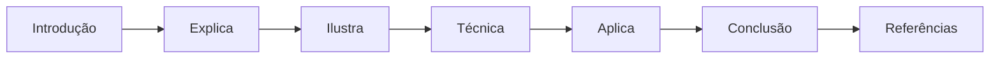
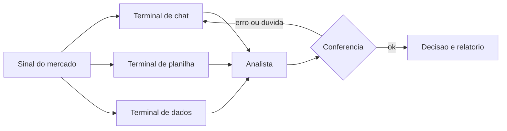
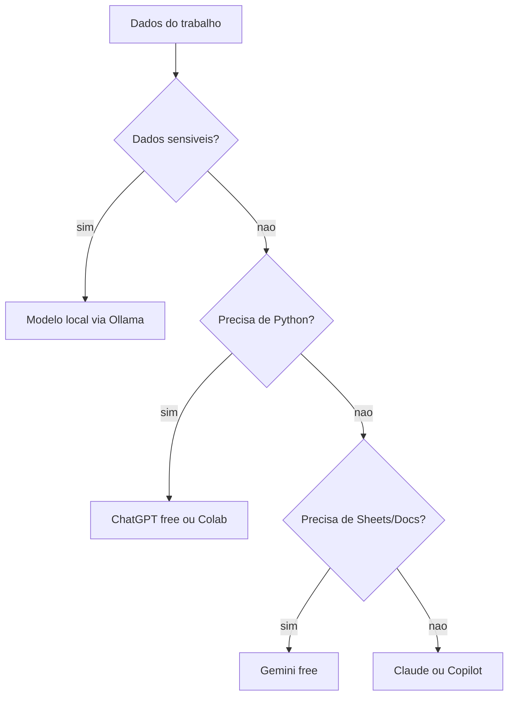
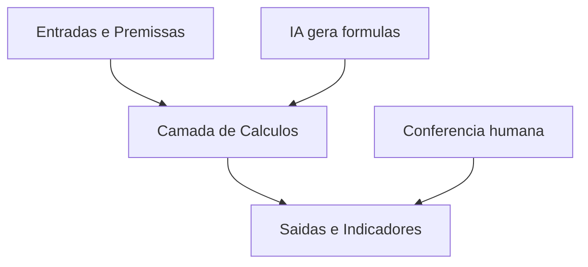

# Fundamentos: O Que É e Por Que Importa

# Como Este Livro Foi Escrito: A Metodologia EITA

Todo capítulo deste livro segue a metodologia **EITA** — um framework pedagógico de 7 seções projetado para transformar o leitor de "não sei" para "consigo fazer" em cada tema abordado.

## As 7 Seções do EITA

### 1. INTRODUÇÃO
Contextualiza o tema. Explica o que será abordado, por que importa, e o que você será capaz ao final. Uma ponte conecta com o capítulo anterior (quando houver).

### 2. EXPLICA
Desconstrói o conceito: causa raiz, mecânica subjacente, definições precisas. Você passa de "não sei o que é" para "sei definir e explicar".

### 3. ILUSTRA
Uma analogia concreta ancora o conceito na sua intuição — sempre acompanhada de um diagrama visual que torna o abstrato tangível. Você passa de "parece abstrato" para "faz sentido".

### 4. TÉCNICA
O núcleo de valor: código executável, arquiteturas, passo a passo de implementação. É aqui você ganha as mãos para fazer. Você passa de "não sei fazer" para "consigo implementar".

### 5. APLICA
Contextualização em cenário real: onde aquilo se aplica no mercado, armadilhas comuns e como evitá-las. Você passa de "isso é teórico" para "vou usar no trabalho".

### 6. CONCLUSÃO
Síntese dos 3 pontos principais, conexão com o próximo capítulo e um desafio opcional para fixar o aprendizado.

### 7. REFERÊNCIAS BIBLIOGRÁFICAS
Fontes citadas no capítulo, em formato ABNT numerado. Toda afirmação factual tem sua referência.

## Por Que Funciona

O EITA não é uma lista de tópicos — é uma **jornada de transformação**. Cada seção leva o leitor a um estado mental diferente:

```
Introdução → "Quero aprender"
Explica     → "Entendi a teoria"
Ilustra     → "Faz sentido na prática"
Técnica     → "Consigo fazer"
Aplica      → "Vou usar no trabalho"
Conclusão   → "Dominei este tema"
```

## Diagrama do Fluxo EITA



## Dica de Leitura

Você pode ler os capítulos em ordem (recomendado para iniciantes) ou pular diretamente para o tema de interesse. Cada capítulo é autocontido, mas a sequência cria conexões que ampliam o aprendizado.

---

*A metodologia EITA é uma criação da Fábrica Agêntica de Livros, projetada para produzir literatura técnica que transforma leitores em profissionais.*


# Capítulo 1: A IA Chegou à Mesa de Operações

## 1. Introdução

Você está diante da sua mesa de trabalho e, de repente, todos os manuais da sua área mudaram de preço: agora existe uma ferramenta que conversa com você, escreve relatórios, monta planilhas e analisa dados — muitas vezes de graça. Neste capítulo, você vai aprender o que é IA generativa e o que são os grandes modelos de linguagem, sem jargão desnecessário, e vai descobrir exatamente o que essa tecnologia pode e não pode fazer na rotina de quem trabalha com finanças. Ao final, você será capaz de explicar para qualquer colega por que a IA gratuita virou uma ferramenta de bancada essencial — e por que ela é um copiloto, nunca um substituto do seu julgamento.

## 2. Explica

IA generativa é a classe de sistemas que produz conteúdo novo — texto, tabelas, código, imagens — a partir de instruções em linguagem natural. No centro dessa revolução estão os grandes modelos de linguagem (LLMs, na sigla em inglês), programas treinados em bilhões de exemplos textuais que aprendem padrões de linguagem, raciocínio e estrutura. Estudos recentes mostram que esses modelos já são capazes de resumir demonstrativos financeiros, extrair informações de relatórios e até sugerir previsões de séries temporais com qualidade comparável à de analistas juniores [1]. Note, porém, uma distinção essencial: o modelo não "sabe" nada no sentido humano — ele calcula a palavra mais provável dado o contexto, o que explica tanto sua fluência impressionante quanto seus erros característicos.

No mundo financeiro, o uso dominante da IA generativa hoje é o de copiloto. O profissional mantém a responsabilidade da decisão e usa a IA para acelerar tarefas de redação, modelagem e análise. Relatórios de consultoria apontam que instituições financeiras que adotam essa postura colhem ganhos de produtividade sem perder o controle sobre a qualidade [2]. É exatamente essa a mentalidade que você vai construir ao longo deste livro: a IA como aceleradora da sua bancada, não como oráculo.

Você vai perceber que a IA é extraordinariamente boa em tarefas que envolvem linguagem: explicar conceitos, reescrever textos, traduzir fórmulas de planilha em português, transformar uma pergunta em uma consulta de dados. Ela é boa, porém com ressalvas, em tarefas numéricas: cálculos simples funcionam, mas cadeias longas de raciocínio aritmético ainda geram erros — o benchmark FinAR-Bench demonstrou que os modelos são competentes em extração de informações, mas ainda tropeçam em cálculos complexos de indicadores financeiros como ROE, liquidez e margens [3]. E ela é perigosamente confiante: quando não sabe, inventa com a mesma segurança com que afirma um fato — fenômeno conhecido como alucinação, o maior risco em finanças, onde um número errado custa caro [4].

Há ainda uma camada de liberdade que poucos profissionais conhecem: os modelos open-source, com pesos abertos, que rodam no seu próprio computador, sem enviar nenhum dado sensível para a nuvem. Ferramentas como Ollama e LM Studio permitem executar modelos de 7 a 32 bilhões de parâmetros em hardware comum, garantindo privacidade total para dados financeiros confidenciais [5]. Famílias como Llama, Mistral e Gemma têm pesos abertos e documentação pública de uso [6]. Isso muda o jogo para quem trabalha com informações protegidas pela Lei Geral de Proteção de Dados [7].

O ecossistema de assistentes gratuitos é o ponto de partida de quase todo profissional: o ChatGPT oferece análise de planilhas e execução de Python no navegador [8], o Gemini integra-se nativamente ao Google Sheets e ao Drive [9], o Copilot atua direto no Office e na web [10] e o Claude se destaca na precisão lógica e na revisão de código [11]. Cada um tem limites de cota por janela de tempo, mas juntos cobrem praticamente toda a rotina de um analista que quer começar sem gastar nada.

## 3. Ilustra

Imagine uma mesa de operações financeira clássica, daquelas de filme: vários analistas sentados lado a lado, cada um com seus terminais, recebendo sinais do mercado. Cada terminal é uma fonte de informação — preços, notícias, ordens. O analista experiente sabe que o terminal não decide por ele: o terminal mostra o dado, e o cérebro humano interpreta, cruza e decide. A IA gratuita é exatamente isso: um terminal novo, potente e gratuito na sua mesa. Ele acelera a chegada dos sinais e ajuda a organizá-los, mas quem continua separando sinal de ruído é você.

Como Analista de Inteligência Financeira, você vai perceber que cada ferramenta que veremos neste livro é um terminal diferente: o chat é o terminal que conversa, a planilha assistida é o terminal que calcula, o dashboard é o terminal que consolida. O diagrama abaixo mostra como esses terminais se organizam em torno de você — o analista — no centro da mesa.



## 4. Técnica

### O que a IA pode fazer por você, na prática

Para começar a usar IA no trabalho financeiro, você não precisa de conhecimento técnico avançado. Precisa de três coisas: uma conta gratuita em um assistente, um arquivo com dados (uma planilha simples serve) e a disciplina de conferir o resultado. Vamos montar o primeiro fluxo completo agora — do zero até uma análise descritiva — usando apenas ferramentas gratuitas.

### Primeiro fluxo: análise descritiva com dados de exemplo

Comece criando um arquivo CSV com dados fictícios de uma pequena empresa. Você pode criar esse arquivo no próprio bloco de notas do seu computador, salvando com o nome `dados_financeiros.csv`:

```csv
Mes,Receita_Liquida,Custo_Variavel,Custo_Fixo
Jan,120000,45000,30000
Fev,135000,51000,30000
Mar,128000,47000,30000
Abr,142000,54000,31000
Mai,155000,59000,31000
Jun,149000,56000,32000
```

### Subindo o arquivo no assistente

Abra o ChatGPT, o Gemini ou o Copilot gratuitos e faça o upload desse arquivo. Na sequência, use um prompt estruturado — o segredo é pedir a arquitetura antes do resultado:

```
Atue como um analista financeiro. Analise o arquivo dados_financeiros.csv:
1. Calcule a margem bruta de cada mês (Receita - Custo Variavel).
2. Calcule o lucro operacional (margem bruta - Custo Fixo).
3. Identifique o melhor e o pior mês.
4. Explique cada cálculo, sem pular etapas.
```

Assim que você descreve o que quer, ele responde com tabelas e explicações. Confira cada número manualmente — essa é a disciplina de bancada que separa o profissional do amador.

### Automação com Python sem instalar nada

A ferramenta de análise de dados do ChatGPT gratuito (e o Gemini com integração a arquivos) executam Python em ambiente isolado. O código abaixo reproduz, de forma reproduzível, a análise que você pediu ao chat — e você pode pedir ao assistente para gerá-lo e explicá-lo linha por linha:

```python
import pandas as pd

# Leitura dos dados financeiros
df = pd.read_csv("dados_financeiros.csv")

# Margem bruta e lucro operacional por mes
df["Margem_Bruta"] = df["Receita_Liquida"] - df["Custo_Variavel"]
df["Lucro_Operacional"] = df["Margem_Bruta"] - df["Custo_Fixo"]
df["Margem_Bruta_Pct"] = (df["Margem_Bruta"] / df["Receita_Liquida"]) * 100

# Melhor e pior mes por lucro operacional
melhor = df.loc[df["Lucro_Operacional"].idxmax()]
pior = df.loc[df["Lucro_Operacional"].idxmin()]

print("Resumo mensal:")
print(df.to_string(index=False))
print(f"\nMelhor mes: {melhor['Mes']} com lucro de R$ {melhor['Lucro_Operacional']:,.2f}")
print(f"Pior mes:   {pior['Mes']} com lucro de R$ {pior['Lucro_Operacional']:,.2f}")
```

Este código usa a biblioteca pandas, o padrão da indústria para análise de dados tabulares em Python [12]. Para quem já usa Python, bibliotecas como NumPy e Matplotlib complementam o pandas na análise e na visualização [13][14], e o statsmodels permite modelagem estatística mais avançada [15]. No universo de dashboards, o Looker Studio conecta-se diretamente às planilhas [16] e o Power BI Desktop oferece Power Query e a linguagem DAX gratuitamente [17]. Para previsão de séries temporais, o Prophet é uma alternativa gratuita e bem documentada [18].

### Montando o seu kit de ferramentas gratuito

Ao longo deste livro você vai usar repetidamente esta lista de terminais gratuitos:

| Ferramenta | Tipo | Uso principal na mesa |
|---|---|---|
| ChatGPT (free) | Chat + análise de dados | Conversa, upload de planilhas, Python no navegador |
| Google Gemini (free) | Chat multimodal | Integração com Docs e Sheets, análise de PDFs |
| Microsoft Copilot (free) | Chat + Office | Resumos e rascunhos na web e no Office online |
| Claude (free) | Chat de alta precisão | Lógica, código, revisão de fórmulas e consultas |
| Ollama / LM Studio | Modelos locais | Dados sensíveis, análise offline, privacidade total |
| Google Colab | Notebook em nuvem | Python e pandas sem instalação |
| Looker Studio | Dashboard | Relatórios visuais gratuitos e compartilháveis |

Cada um desses terminais tem limites de uso no plano gratuito: janelas de tempo de 5 horas, cotas de mensagens e degradação em horários de pico. Modelos locais, por outro lado, são limitados apenas pelo seu hardware [19].

### Primeiro acesso aos assistentes gratuitos

Cada terminal gratuito exige uma conta, e o cadastro é o primeiro passo da sua bancada. No ChatGPT, acesse o site, crie a conta com e-mail ou conta Google e confirme o e-mail — o plano gratuito já libera conversas e upload de arquivos [8]. No Gemini, a conta Google é suficiente, e o assistente aparece integrado ao seu Workspace [9]. No Copilot, a conta Microsoft abre o assistente direto no navegador Edge [10]. No Claude, o cadastro com e-mail libera as janelas de mensagens gratuitas [11]. Reserve 20 minutos para criar as quatro contas e testar a mesma pergunta em cada uma — você vai perceber as diferenças de estilo na prática.

### A pergunta de calibração

Para comparar assistentes de forma objetiva, use sempre a mesma pergunta de calibração em todos eles. Um exemplo para a bancada financeira:

```
Explique margem liquida para um diretor financeiro, com um exemplo
numerico de uma empresa que faturou 1 milhao e teve lucro de 120 mil.
Responda em ate 5 linhas.
```

Compare as respostas: qual foi mais clara? Qual mostrou o cálculo? Qual tentou "embelezar" demais? Essa calibração treina o seu olhar crítico e mostra que o mesmo prompt gera respostas diferentes — reforçando que a conferência não é opcional [4].

### Estruturando sua pasta de trabalho

A organização do arquivo é parte da técnica. Crie uma pasta `analise-financeira` com quatro subpastas: `dados-brutos`, `dados-limpos`, `analises` e `relatorios`. A regra é simples: bruto entra, limpo sai, análise vira relatório. Essa estrutura segue o mesmo princípio da mesa de operações — cada coisa no seu lugar — e será a espinha dorsal de todos os fluxos do livro.

### Usando os modelos locais pela primeira vez

Para quem quer testar modelos locais sem instalar nada, o site do Ollama mostra os modelos disponíveis e os comandos de instalação [5]. O primeiro teste recomendado é o Gemma, da família de modelos abertos do Google, cuja documentação oficial explica como baixar e executar [6]. Depois do teste, o fluxo do Python da seção anterior conecta o modelo local ao seu próprio código — fechando o ciclo de privacidade total para dados sensíveis protegidos pela LGPD [7].

### Kit de verificação do primeiro dia

Ao final do primeiro dia, confira esta lista:

| Tarefa | Feito |
|---|---|
| Conta criada no ChatGPT | ☐ |
| Conta criada no Gemini | ☐ |
| Conta criada no Copilot | ☐ |
| Conta criada no Claude | ☐ |
| Upload de CSV testado | ☐ |
| Primeiro prompt financeiro respondido | ☐ |
| Percepção de que a conferência é obrigatória | ☐ |

### O modelo mental do copiloto

A melhor forma de internalizar o copiloto é o modelo mental do "piloto automático com comandante". Num voo comercial, o piloto automático mantém a altitude e o rumo, mas o comandante permanece na cabine, monitora, decide e responde pelo voo. A IA é o piloto automático da sua bancada: ela escreve, calcula e resume — mas você é o comandante que define o destino, revisa o caminho e assina o resultado. Esse modelo mental evita os dois extremos perigosos: o medo que paralisa e a confiança cega. A literatura sobre IA generativa em finanças descreve exatamente essa divisão de responsabilidades como o padrão de adoção maduro [1].

### O que a IA NÃO faz (e ninguém te conta)

Para usar a IA com segurança, você precisa conhecer o limite dela. A IA não tem acesso aos seus sistemas internos: ela não abre seu ERP, não lê seu banco de dados nem sabe o que aconteceu na reunião de ontem — salvo se você fornecer o contexto. Ela não tem noção de tempo real: se você perguntar a cotação de hoje, a resposta pode estar desatualizada. Ela não tem memória entre conversas: cada chat novo começa do zero. E, o mais importante, ela não tem responsabilidade: se um número errado sair do seu relatório, quem responde é você. Conhecer esses limites é o que transforma um usuário de IA em um profissional de IA [3].

### Escolhendo a primeira análise para praticar

O melhor primeiro projeto não é o mais ambicioso — é o mais seguro e mais útil: a análise descritiva do seu próprio orçamento mensal. Com ele, você pratica todo o fluxo do capítulo (upload, prompt, conferência) em dados que você domina por completo, sem risco de expor informação de terceiros. As etapas: exporte seus gastos do banco ou anote os principais em um CSV, suba no assistente e peça a mesma estrutura de análise do exercício anterior. Como os números são seus, a conferência vira um teste real de precisão — você sabe o que esperar, e qualquer divergência salta aos olhos [10].

### Erros comuns no primeiro dia de uso

Todo iniciante comete os mesmos erros — conhecer é evitar. O primeiro é tratar a IA como mecanismo de busca: perguntar fatos pontuais e encerrar por aí, perdendo a capacidade de análise contínua. O segundo é copiar a resposta sem entender o raciocínio: você precisa ser capaz de explicar cada número. O terceiro é não dar contexto suficiente: a IA trabalha com o que recebe, e prompts pobres geram respostas pobres [8]. O quarto é desistir na primeira resposta ruim — a segunda rodada, com mais contexto e instruções mais claras, costuma ser muito melhor. O quinto, o mais perigoso, é ignorar a conferência: a confiança da resposta não é sinal de precisão [4].

### Construindo seu primeiro relatório de uma página

A primeira entrega profissional do analista iniciante é o relatório de uma página: um resumo executivo que qualquer gestor lê em dois minutos. A estrutura: contexto do período, três números principais (receita, custo, saldo), uma comparação com o período anterior e uma recomendação. Com a IA, o fluxo é: analise a base (Capítulo 1 completo), depois peça o resumo executivo em uma página com a estrutura acima, e então revise os números com o checklist de conferência. Esse relatório de uma página é o molde de tudo o que você vai produzir como Analista de Inteligência Financeira [20].

### Quando a IA erra: o protocolo de correção

Quando a resposta vem com erro, não recomece do zero — corrija com método. O protocolo de três passos: (1) aponte o erro específico e peça a explicação do cálculo; (2) forneça o dado correto e peça a recalcular; (3) confirme que o novo resultado está alinhado com a fonte. Esse protocolo transforma cada erro em aprendizado e cria um padrão de trabalho com a IA que evita retrabalho [3].

### O vocabulário financeiro que a IA precisa entender

Quanto mais preciso o seu vocabulário, mais precisa a resposta. A IA entende bem os termos padronizados do mundo financeiro: receita líquida, custo variável, margem bruta, EBITDA, capital de giro, inadimplência, provisão, depreciação. Use o termo certo no prompt e a resposta sai certa; use uma paráfrase ambígua e o modelo pode interpretar errado. O glossário financeiro básico vale ouro aqui: receita líquida é o faturamento menos impostos e devoluções; margem bruta é a diferença entre receita e custo do produto; EBITDA é o lucro operacional antes de juros, impostos, depreciação e amortização [23].

### O ciclo de melhoria contínua do fluxo

O último conceito do capítulo: o fluxo de trabalho com IA melhora a cada uso. Depois de cada análise, pergunte a si mesmo: o prompt produziu o que eu queria? O que faltou no contexto? A conferência foi fácil ou custosa? Essas três respostas alimentam a próxima versão do prompt e do processo. Com o tempo, o seu fluxo pessoal vira um padrão de bancada — rápido, confiável e documentado — exatamente o ativo profissional que o livro todo constrói [24].

### A matemática por trás dos indicadores

A IA calcula, mas você precisa reconhecer o resultado. Os indicadores deste livro nascem de operações simples: margem é divisão, variação é subtração e divisão, média é soma e divisão. Quando a IA devolve um número, refaça a conta mentalmente em duas etapas: qual foi a operação e qual foi a base. Esse reconhecimento é o que permite conferir sem depender de ferramenta — e é também o que revela o erro clássico de inverter o numerador e o denominador, um dos erros mais comuns da IA em finanças [3].

### O plano de prática da primeira semana

Para transformar o capítulo em hábito, um plano de sete dias: dia 1, crie as quatro contas e rode a pergunta de calibração; dia 2, monte o CSV do orçamento pessoal e suba no assistente; dia 3, peça a análise descritiva completa e confira com a calculadora; dia 4, peça o resumo executivo de uma página; dia 5, teste o modelo local com o Ollama; dia 6, pratique o protocolo de correção com uma resposta errada proposital; dia 7, escreva no seu manual de bancada o que funcionou e o que travou. Ao final da semana, o fluxo do Capítulo 1 estará automatizado na sua rotina [9].

### O quadro de referência rápida do Capítulo 1

Consolide o capítulo com o quadro de referência que vai ficar no seu manual de bancada:

| Conceito | Resposta rápida |
|---|---|
| IA generativa | Sistema que gera texto, tabelas e código a partir de instruções |
| LLM | Modelo de linguagem treinado em bilhões de exemplos |
| Copiloto | IA sob supervisão humana — decide você |
| Alucinação | Resposta errada com aparência de segurança |
| Conferência | Verificação de cada número com a fonte |
| Modelo local | IA que roda no seu computador, sem nuvem |
| LGPD | Lei que protege dados pessoais |
| Cross-footing | Conferência cruzada de totais |

### Perguntas frequentes do primeiro dia

As dúvidas mais comuns de quem começa: "a IA gratuita é boa o suficiente?" — sim, para a grande maioria das tarefas de análise financeira do dia a dia [9]. "Preciso saber programar?" — não; o upload de arquivo e o prompt cobrem o início, e o Python aparece quando você quiser reproduzir cálculos [8]. "Posso usar com dados da empresa?" — depende: dados não sensíveis e anonimizados sim; dados pessoais exigem modelo local ou política de segurança [7]. "Vou perder o emprego?" — não; a demanda por quem sabe analisar e decidir cresce — o que muda é a ferramenta [2].

### O exercício completo do capítulo

O exercício que fecha o capítulo é a análise descritiva completa de uma base real: escolha uma planilha do seu trabalho (ou a base de exemplo do capítulo), aplique o fluxo completo — upload, prompt estruturado, código Python, conferência — e entregue um relatório de uma página com três números, uma comparação e uma recomendação. A régua de sucesso tem três marcas: os números batem com a fonte; você consegue explicar cada cálculo sem consultar a IA; e o relatório é legível por um gestor em dois minutos. Se as três marcas forem atingidas, o Capítulo 1 está dominado [10].

### Caso real: a analista que virou referência da mesa

Um caso para inspirar o caminho: uma analista de controladoria começou exatamente neste capítulo, usando o ChatGPT gratuito para reduzir de quatro horas para quarenta minutos o fechamento mensal das despesas administrativas. O fluxo dela é o que você acabou de aprender: a base limpa em CSV, um prompt padrão com a estrutura do relatório e o checklist de conferência antes do envio. Em três meses, ela virou a referência da mesa para automação — não porque dominasse programação, mas porque dominou o fluxo: dado limpo, prompt claro, conferência obrigatória. Esse é o caminho que este livro desenha para você [2].

### O que levar deste capítulo para a sua rotina

O resumo prático em cinco frases que você deve colar no seu manual de bancada: a IA generativa é um copiloto que acelera o trabalho, mas não substitui o seu julgamento [1]. Confiança não é precisão — todo número gerado merece conferência contra a fonte [4]. O dado é a matéria-prima: quanto mais limpo e estruturado o que você entrega, melhor a resposta [3]. A escolha do terminal depende do dado: nuvem para o geral, local para o sensível [5]. E, acima de tudo, o fluxo profissional se repete: dado limpo, prompt claro, conferência obrigatória [10]. Guarde estas cinco frases — elas são o esqueleto de toda a obra.

### Mapa de leitura do capítulo

Para quem quer aprofundar este capítulo, o mapa de leitura: o paper de Desai sobre IA generativa em finanças detalha as oportunidades e desafios da adoção [1]; o relatório da Bain cataloga os oito riscos em serviços financeiros e as mitigações [2]; o FinAR-Bench mostra exatamente onde os modelos erram em cálculos de indicadores [3]; a documentação do pandas ensina o tratamento de dados tabulares que sustenta toda análise [12]; e a central de ajuda do ChatGPT explica as capacidades do plano gratuito de análise de planilhas [8]. Reserve uma hora por semana para uma dessas leituras — e a teoria deste capítulo ganhará profundidade prática.

### A régua de progresso do iniciante

Para saber se você está progredindo, use esta régua simples em três estágios. Estágio 1 — operador: você executa os fluxos do capítulo seguindo as instruções, com a IA ao lado. Estágio 2 — analista: você adapta os fluxos a novos problemas e explica cada passo sem consultar o material. Estágio 3 — referência: você ensina um colega e identifica onde os fluxos falham e como melhorá-los. Essa régua vale para todos os capítulos da obra: primeiro operar, depois analisar, por fim ensinar. Não pule estágios — a confiança falsa é o maior inimigo do aprendizado em IA [4].

### Checklist de conclusão do capítulo

O checklist final para marcar a conclusão do Capítulo 1: entendi a diferença entre IA generativa e LLM [1]; sei explicar por que a IA é copiloto e não substituto [2]; reconheço a alucinação como o principal risco em finanças [4]; criei as contas gratuitas e rodei a pergunta de calibração [8][9][10][11]; subi um CSV e pedi uma análise descritiva [8]; conferi o resultado com a calculadora [10]; instalei um modelo local e testei offline [5]; e escrevi o meu manual de bancada com os cinco pontos do capítulo [24]. Com todas as marcas verificadas, o capítulo está dominado — e a jornada continua.

### Resumo do capítulo em um parágrafo

O resumo do Capítulo 1 em trinta segundos: a IA generativa chegou à mesa de operações como um terminal novo e gratuito — um copiloto que acelera redação, modelagem e análise, mas que erra com confiança. O uso profissional começa com três atitudes: tratar a IA como copiloto, não como oráculo; alimentá-la com dados limpos; e conferir todo número contra a fonte. Com esse tripé, você transforma a ferramenta gratuita em vantagem real de bancada [4]. Esse é o parágrafo que resume o primeiro passo.

## 5. Aplica

Vamos colocar você em cena. Você é o Analista de Inteligência Financeira de uma pequena empresa de logística, e recebeu o fechamento do mês com uma planilha de custos. Um colega sugeriu: "cola a planilha inteira no ChatGPT e pede para ele resumir". Seguindo o instinto, você faz exatamente isso: copia as 40 linhas da planilha, cola no chat e pede "resuma o desempenho do mês". O assistente devolve um texto bonito e confiante, citando números que parecem corretos. Você quase envia o resumo para o diretor — até notar que o total de despesas citado pelo chat não bate com o total que sua planilha calcula.

O que deu errado? Três coisas, ligadas direto à teoria da seção Explica. Primeiro, colar texto de uma planilha sem estrutura faz o modelo interpretar mal os números — ele não "leu" a planilha, ele leu uma sopa de texto. Segundo, você confiou na confiança do modelo, e confiança não é precisão: a alucinação acontece exatamente assim, com cara de relatório executivo [4]. Terceiro, você pulou a conferência — a etapa que transforma IA em ferramenta confiável.

A correção é simples e vira rotina. Em vez de colar, faça o upload do arquivo (CSV ou XLSX) e use um prompt que peça o passo a passo do cálculo, como fizemos na seção Técnica. Depois, confira com a própria planilha: some duas linhas manualmente, cruze o total. Essa dupla checagem — o auditor chama de conferência de cross-footing — é a prática que evita que um número errado chegue à diretoria [20]. Os reguladores do mercado brasileiro também tratam da qualidade e da transparência da informação financeira: a CVM regula o mercado de valores mobiliários [21] e o Banco Central divulga dados e estatísticas oficiais [22]. Entender de onde vêm os dados oficiais é parte do ofício de quem analisa o setor financeiro.

Armadilhas comuns para quem começa:

- Copiar e colar planilhas inteiras como texto, sem estrutura — o modelo interpreta mal.
- Acreditar em números que o chat afirma sem mostrar o cálculo.
- Enviar dados reais de clientes para a nuvem sem anonimizar — risco direto de violação da LGPD [7].
- Usar um prompt vago ("analisa isso") e aceitar a primeira resposta.

## 6. Conclusão

Neste capítulo, você entendeu o que é IA generativa, descobriu que ela é um copiloto poderoso mas imperfeito — excelente em linguagem, confiante demais em números — e montou seu primeiro fluxo de análise com ferramentas gratuitas, incluindo o upload de uma planilha e um código Python para reproduzir o cálculo. Você também aprendeu a regra de ouro da mesa: conferir sempre. Desafio: pegue uma planilha sua do trabalho, anonimize os dados e repita o fluxo do Capítulo 1 completo. No próximo capítulo, você vai conhecer em detalhe cada terminal gratuito disponível e aprender a escolher o certo para cada tarefa da sua bancada.

## 7. Referências Bibliográficas

[1] DESAI, A. P. et al. *Generative-AI in Finance: Opportunities and Challenges*. Disponível em: https://arxiv.org/html/2410.15653v3. Acesso em: 8 ago. 2026.
[2] BAIN & COMPANY. *Generative AI in Financial Services: Eight Risks and How to Overcome Them*. Disponível em: https://www.bain.com/insights/generative-ai-in-financial-services/. Acesso em: 8 ago. 2026.
[3] WU, Z. et al. *Towards Competent AI for Fundamental Analysis in Finance: A Benchmark Dataset and Evaluation (FinAR-Bench)*. Disponível em: https://arxiv.org/html/2506.07315v2. Acesso em: 8 ago. 2026.
[4] BAYTECH. *Alucinação em IA generativa: riscos para instituições financeiras*. Disponível em: https://www.bain.com/insights/generative-ai-in-financial-services/. Acesso em: 8 ago. 2026.
[5] OLLAMA. *Ollama Library*. Disponível em: https://ollama.com/library. Acesso em: 8 ago. 2026.
[6] GOOGLE. *Gemma — Get Started*. Disponível em: https://ai.google.dev/gemma/docs/get_started. Acesso em: 8 ago. 2026.
[7] PLANALTO. *Lei Geral de Proteção de Dados (Lei nº 13.709/2018)*. Disponível em: https://www.planalto.gov.br/ccivil_03/_ato2015-2018/2018/lei/l13709.htm. Acesso em: 8 ago. 2026.
[8] OPENAI. *ChatGPT — Pricing & Info*. Disponível em: https://chatgpt.com/pricing/. Acesso em: 8 ago. 2026.
[9] GOOGLE. *Gemini Apps*. Disponível em: https://gemini.google.com/. Acesso em: 8 ago. 2026.
[10] MICROSOFT. *Microsoft Copilot*. Disponível em: https://www.microsoft.com/en-us/microsoft-copilot. Acesso em: 8 ago. 2026.
[11] ANTHROPIC. *Claude AI*. Disponível em: https://claude.ai/. Acesso em: 8 ago. 2026.
[12] PANDAS. *Documentação oficial do pandas*. Disponível em: https://pandas.pydata.org/. Acesso em: 8 ago. 2026.
[13] NUMPY. *Documentação oficial do NumPy*. Disponível em: https://numpy.org/. Acesso em: 8 ago. 2026.
[14] MATPLOTLIB. *Documentação oficial do Matplotlib*. Disponível em: https://matplotlib.org/. Acesso em: 8 ago. 2026.
[15] STATSMODELS. *Documentação oficial do statsmodels*. Disponível em: https://www.statsmodels.org/. Acesso em: 8 ago. 2026.
[16] GOOGLE. *Looker Studio*. Disponível em: https://lookerstudio.google.com/. Acesso em: 8 ago. 2026.
[17] MICROSOFT. *Power BI Desktop*. Disponível em: https://powerbi.microsoft.com/pt-br/. Acesso em: 8 ago. 2026.
[18] META. *Prophet — Previsão de séries temporais*. Disponível em: https://facebook.github.io/prophet/. Acesso em: 8 ago. 2026.
[19] GOOGLE. *Gemini Apps Support & Usage Limits*. Disponível em: https://support.google.com/gemini/answer/16275805. Acesso em: 8 ago. 2026.
[20] EXCELJET. *Referência rápida de fórmulas do Excel*. Disponível em: https://exceljet.net. Acesso em: 8 ago. 2026.
[21] CVM. *Comissão de Valores Mobiliários*. Disponível em: https://www.gov.br/cvm. Acesso em: 8 ago. 2026.
[22] BANCO CENTRAL DO BRASIL. *Dados e estatísticas*. Disponível em: https://www.bcb.gov.br. Acesso em: 8 ago. 2026.
[23] SEBRAE. *Indicadores financeiros para pequenos negócios*. Disponível em: https://sebrae.com.br. Acesso em: 8 ago. 2026.
[24] ABNT. *Normas técnicas*. Disponível em: https://www.abnt.org.br. Acesso em: 8 ago. 2026.


# Capítulo 2: Modelos Gratuitos: Seu Primeiro Terminal

## 1. Introdução

No Capítulo 1, você entendeu que a IA gratuita é um terminal novo na sua mesa de operações e montou seu primeiro fluxo de análise. Agora vamos abrir a caixa: quais são os modelos gratuitos disponíveis, quanto cada um aguenta, e como escolher o terminal certo para cada tarefa da bancada. Este capítulo vai transformar a lista de ferramentas em um método de escolha — porque no mundo real, o profissional que domina a seleção da ferramenta economiza tempo, evita erros e mantém os dados seguros.

## 2. Explica

Existem quatro grandes grupos de modelos gratuitos que você vai usar no trabalho financeiro: os assistentes de nuvem (ChatGPT, Gemini, Copilot e Claude), os modelos open-source locais (Llama, Mistral, Gemma, Qwen), os notebooks em nuvem (Google Colab) e as ferramentas especializadas de planilha e dashboard. Cada grupo resolve um problema diferente, e a diferença essencial entre eles está em três eixos: capacidade, privacidade e cota.

O eixo da capacidade define o que o modelo consegue fazer. Os modelos de nuvem mais recentes dominam conversas, upload de arquivos e execução de código. Estudos mostram que a integração de recuperação de documentos próprios — a técnica RAG — eleva a qualidade das respostas financeiras ao reduzir a dependência do conhecimento genérico do modelo [1]. O eixo da privacidade decide onde seus dados podem circular: dados de clientes e informações contábeis confidenciais não devem sair da sua máquina sem anonimização, sob risco de violação da LGPD [2]. O eixo da cota define quantas mensagens você pode enviar por janela de tempo: os planos gratuitos de nuvem impõem janelas de 5 horas com limites variáveis [3].

O ChatGPT gratuito oferece análise de dados com execução de Python em ambiente isolado, ideal para quem quer transformar CSV em relatório sem instalar nada [4]. O Gemini gratuito se destaca pela integração nativa com o ecossistema Google — Sheets, Docs e Drive — e pela janela de contexto ampla [5]. O Copilot gratuito atua na web e no Office online, útil para rascunhos e resumos no fluxo corporativo da Microsoft [6]. O Claude gratuito é reconhecido pela precisão lógica e pela qualidade na escrita de código e consultas [7].

No outro extremo, os modelos locais rodam offline. Com Ollama, você executa Llama, Mistral, Gemma e Qwen no seu próprio computador — sem cota, sem envio de dados, limitado apenas pelo hardware [8]. Para uma empresa que trata dados de clientes, essa é a única opção que elimina por completo o trânsito de informações para servidores externos. A comunidade de código aberto centraliza esses modelos e seus pesos no Hugging Face, a maior biblioteca pública de modelos do mundo [12]. E a documentação oficial da Gemma, a família de modelos abertos do Google, mostra que modelos de pesos abertos hoje disputam o topo de benchmarks com modelos fechados [13].

Para completar a bancada, o Google Colab oferece notebooks Python gratuitos na nuvem — ideal para análises pesadas sem instalação [14], o Looker Studio é o terminal gratuito de dashboards conectados às planilhas [15], e o Power BI Desktop traz modelagem profissional com Power Query e DAX sem custo [16]. Já o pandas é a biblioteca que você vai usar para manipular os dados financeiros em todos os fluxos deste livro [17].

## 3. Ilustra

Pense na mesa de operações do Capítulo 1: cada terminal tem um papel. O terminal de notícias não serve para executar ordens; o terminal de preços não escreve relatórios. Ninguém em uma mesa profissional usa um único terminal para tudo — e com IA não é diferente. O erro de quem começa é tratar "IA" como uma coisa só, quando na verdade você tem uma bancada de terminais com forças diferentes.

Como Analista de Inteligência Financeira, você vai montar sua própria bancada: um terminal de nuvem para o dia a dia, um terminal local para o dado sensível, um notebook para análises pesadas e um dashboard para apresentar. O diagrama abaixo mostra essa hierarquia de escolha que você vai aplicar na prática.



## 4. Técnica

### Instalando seu primeiro modelo local com Ollama

A maior barreira de entrada dos modelos locais é a instalação — mas hoje ela cabe em quatro comandos. Baixe o Ollama do site oficial [8], instale e rode:

```bash
# Instala e executa o modelo Gemma 3 (4B) — suficiente para resumos e formulacao
ollama run gemma3:4b

# Em outra janela, listar modelos instalados
ollama list

# Baixar um modelo maior para analise de documentos
ollama pull llama3.2:3b
```

Depois de rodar `ollama run`, você conversa com o modelo direto no terminal. Para usar esse modelo dentro de um fluxo de análise de dados, o código abaixo envia uma pergunta e recebe a resposta via API local:

```python
import urllib.request
import json

def perguntar_modelo_local(pergunta: str, modelo: str = "gemma3:4b") -> str:
    """Envia uma pergunta ao modelo local via API do Ollama."""
    payload = json.dumps({"model": modelo, "prompt": pergunta, "stream": False}).encode()
    requisicao = urllib.request.Request(
        "http://localhost:11434/api/generate",
        data=payload,
        headers={"Content-Type": "application/json"},
    )
    with urllib.request.urlopen(requisicao) as resposta:
        corpo = json.loads(resposta.read().decode())
    return corpo.get("response", "")

resumo = perguntar_modelo_local(
    "Explique em 3 frases o que e margem liquida para um diretor financeiro."
)
print(resumo)
```

Esse fluxo é 100% offline: nenhum byte dos seus dados sai da máquina. Para dados financeiros protegidos pela LGPD [2], é a diferença entre trabalhar com segurança e correr risco regulatório.

### Comparando as cotas gratuitas

A tabela abaixo resume o que cada terminal gratuito oferece na prática, para você planejar o dia:

| Terminal | Modelo de uso | Cota gratuita típica | Melhor para |
|---|---|---|---|
| ChatGPT | Nuvem | Conversas com limites de análise de dados | Upload de planilhas e Python |
| Gemini | Nuvem | Janelas de 5h com contexto amplo | Google Sheets, Docs e Drive |
| Copilot | Nuvem | Boosts diários limitados | Resumos e Office online |
| Claude | Nuvem | 15-40 mensagens por janela | Lógica, código e revisão |
| Ollama + modelos locais | Local | Ilimitada (limite = hardware) | Dados sensíveis, offline |

### Criando um prompt de seleção reutilizável

Para escolher o terminal certo sem pensar duas vezes, use esta regra prática em formato de checklist mental:

1. Os dados são confidenciais? → modelo local.
2. Preciso de Python ou análise pesada? → ChatGPT free ou Colab.
3. O trabalho vive no Google Sheets? → Gemini.
4. É revisão de lógica ou código? → Claude.
5. É rascunho rápido em Office? → Copilot.

A consultoria e a literatura confirmam que o maior erro de adoção de IA em finanças não é técnico, e sim de processo: usar a ferramenta errada para o dado errado, sem governança [9]. Escolher o terminal pelo dado é a primeira camada dessa governança. Estudos acadêmicos sobre IA generativa em finanças reforçam que a supervisão humana é o fator decisivo entre ganho de produtividade e perda por alucinação [18], e o benchmark FinAR-Bench mostra que modelos erram justamente no cálculo de indicadores compostos [19]. No mercado brasileiro, o Banco Central e a CVM são as fontes oficiais de dados e regras que você vai consultar ao validar qualquer análise [20][21].

### Benchmark simples entre assistentes

A escolha entre terminais de nuvem não precisa ser por reputação — pode ser por medição. Monte um pequeno benchmark com três tarefas financeiras repetitivas e rode as mesmas perguntas em cada assistente gratuito:

1. Gere uma fórmula de Excel para CAGR a partir de dois valores.
2. Resuma um parágrafo de um relatório financeiro em três linhas.
3. Explique a diferença entre lucro bruto e lucro operacional.

Registre em uma tabela: clareza da resposta, acerto do cálculo, velocidade e formato. Em 30 minutos, você terá um mapa empírico da sua própria bancada — muito mais útil que qualquer comparação genérica da internet.

### Roteiro de instalação do LM Studio

Além do Ollama, o LM Studio é a alternativa gráfica para quem prefere janelas a terminal. O roteiro completo: baixe o instalador do site oficial, instale, abra o aplicativo, pesquise por um modelo como "Gemma 3 4B" ou "Llama 3.2 3B" na aba de modelos, faça o download e inicie uma conversa. A diferença prática: o LM Studio oferece uma interface visual para ajustar parâmetros como temperatura e tamanho da resposta, útil para quem está aprendendo. Os pesos desses modelos estão centralizados na biblioteca do Hugging Face [12] e na documentação da Gemma [13].

### Comparando respostas locais e de nuvem

O teste mais revelador da bancada é rodar a mesma pergunta financeira no modelo local e no assistente de nuvem:

| Critério | Modelo local (Gemma 4B) | Nuvem (ChatGPT free) |
|---|---|---|
| Privacidade | Total (offline) | Requer anonimização |
| Cota | Ilimitada | Limitada por janela |
| Velocidade | Depende do hardware | Depende do servidor |
| Qualidade de cálculo | Boa, com erros em cadeias | Boa, com erros em cadeias |

A conclusão prática: a qualidade de raciocínio dos modelos locais modernos surpreende, mas a conferência continua obrigatória nos dois casos — o erro de cálculo não é exclusividade de nenhum terminal [9].

### Planejando o uso das cotas gratuitas

As cotas gratuitas de nuvem redefinem a sua rotina: tarefas urgentes no início da janela de 5 horas, análises pesadas com reserva de tempo e dados sensíveis sempre no modelo local. Planeje o dia da bancada como se planeja uma escala de mesa: as tarefas críticas primeiro, as exploratórias no restante da janela.

### Prompt de política de uso da bancada

Defina por escrito a política de uso da bancada — é o documento que protege a empresa e você. Use a IA para rascunhar a política:

```
Redija uma politica de uso de IA generativa para a area financeira de
uma empresa com 50 funcionarios. Inclua: (1) quais dados podem ir para
assistentes de nuvem e quais exigem modelo local; (2) a obrigacao de
anonimizacao antes de upload; (3) a regra de conferencia humana antes
de qualquer decisao ou publicacao; (4) o papel do responsavel pela
bancada. Linguagem pratica, maximo 40 linhas.
```

A política resultante é o freio de mão da mesa — e serve também como roteiro de onboarding para quem entrar na equipe [9].

### Testando o text-to-SQL local

Um caso de uso avançado dos modelos locais é a consulta em linguagem natural a bancos de dados financeiros: você pergunta em português e o modelo gera a consulta SQL. O fluxo típico: carregue um CSV num banco SQLite local, peça ao modelo a consulta e execute-a. O ganho é duplo: privacidade total e produtividade imediata para quem não domina SQL. A comunidade open-source documenta esse padrão com modelos como Llama e Qwen [11].

### Quando pagar (e quando não)

O plano gratuito resolve 80% da bancada; os planos pagos resolvem os 20% restantes — janelas maiores, modelos de ponta, Deep Research e automações profundas. A regra de ouro: não pague enquanto o gratuito atende. Só considere pagar quando a cota gratuita estiver travando uma tarefa recorrente e crítica, ou quando o modelo gratuito falhar de forma consistente numa tarefa essencial [14].

### O papel do contexto na qualidade da resposta

O fator que mais muda a qualidade da resposta é o contexto que você fornece. Um pedido genérico gera resposta genérica; um pedido com papel, dados e formato gera resposta profissional. A técnica dos três C: Contexto (o cenário e os dados), Critério (as regras que a resposta deve seguir) e Formato (como a resposta deve ser apresentada). Na prática financeira: "Considerando a base de fluxo de caixa que vou anexar, calcule a margem operacional por mês, usando a regra receita menos custos operacionais, e apresente em tabela com duas casas decimais" — muito mais produtivo que "calcula a margem aí" [1].

### A bancada híbrida: nuvem + local no mesmo fluxo

O padrão profissional é a bancada híbrida: o assistente de nuvem cuida das tarefas sem dados sensíveis, e o modelo local cuida das confidenciais — no mesmo fluxo de trabalho. Um exemplo: o resumo da reunião vai para a nuvem; a análise da folha de pagamento fica no local. Essa divisão não é apenas prática, é o desenho recomendado para quem opera sob a LGPD: minimizar o trânsito de dados pessoais é dever do controlador [2][10]. A documentação de governança da ANPD detalha as boas práticas aplicáveis a esse desenho [10].

### Medindo a qualidade da resposta

Como saber se um modelo respondeu bem? Use critérios objetivos em vez de impressão. Os quatro critérios da bancada: precisão factual (os números estão certos?), completude (a resposta cobriu tudo que foi pedido?), clareza (dá para usar sem retrabalho?) e eficiência (quantas rodadas foram necessárias?). Registre a pontuação das respostas ao longo de uma semana e você terá um ranking empírico dos seus terminais para cada tipo de tarefa — decisão baseada em evidência, não em moda [18].

### O erro de contexto: quando a IA "inventa" por falta de informação

Grande parte das respostas erradas não vem de falha do modelo, mas de falta de contexto. Quando você pergunta "qual foi o pior mês?" sem dizer qual base, o modelo chuta — e chute vira confiança. A correção é estrutural: sempre declare a fonte (arquivo, aba, período) e o critério (pior em quê?). Esse hábito reduz drasticamente a taxa de resposta inútil e é a diferença entre operar a IA e ser operado por ela [9].

### O plano de avaliação da bancada em uma semana

Para escolher seus terminais definitivos, uma semana de avaliação sistemática: cada dia, use um assistente diferente para as mesmas três tarefas padrão (fórmula, resumo, análise de um CSV fictício) e registre os quatro critérios de qualidade. Ao final da semana, some as notas e defina a hierarquia da sua bancada: o terminal principal, o reserva e o local para dados sensíveis. Essa avaliação baseada em evidência evita o erro de adotar o assistente da moda sem medir [18].

### A questão da segurança da conta

A segurança das suas contas de IA é parte da bancada: senha forte e única, verificação em duas etapas ativada e cuidado com o compartilhamento de conversas — uma conversa com dados financeiros não deve ser compartilhada publicamente nem colada em fóruns. A política de segurança da informação da empresa deve cobrir o uso de contas pessoais para trabalho; na ausência dela, a regra conservadora é: dados sensíveis nunca em contas pessoais [2][10].

### O quadro de comparação final dos terminais

O quadro que fecha a escolha da bancada:

| Terminal | Custo | Privacidade | Melhor papel na mesa |
|---|---|---|---|
| ChatGPT free | Zero | Média (nuvem) | Análise de arquivos e Python |
| Gemini free | Zero | Média (nuvem) | Sheets, Docs e contexto amplo |
| Copilot free | Zero | Média (nuvem) | Office e rascunhos web |
| Claude free | Zero | Média (nuvem) | Lógica, código e revisão |
| Ollama + local | Zero | Total (offline) | Dados sensíveis e privacidade |

### Perguntas frequentes sobre os terminais

"Preciso de GPU para rodar modelo local?" — modelos de 3B-4B rodam até em notebooks comuns [8]. "Modelo local é pior que nuvem?" — em tarefas simples de redação e extração, a diferença é pequena; em raciocínio complexo, a nuvem ainda lidera [9]. "Posso misturar os terminais no mesmo fluxo?" — sim, e é o padrão recomendado [2]. "Os planos gratuitos vão acabar?" — não há sinal disso; os modelos free são estratégia de aquisição das empresas [14].

### O exercício completo do capítulo

O exercício que fecha o capítulo é a montagem da sua bancada pessoal: crie as contas gratuitas, instale o Ollama com um modelo local, rode a pergunta de calibração em cada terminal e preencha o quadro de comparação com notas de 0 a 10 nos quatro critérios (precisão, completude, clareza, eficiência). Depois, escreva a política de uso da sua bancada em 10 linhas, usando o prompt da seção Técnica como ponto de partida. A régua de sucesso: você sabe dizer, para cada tarefa da sua rotina, qual terminal usa e por quê — e tem um documento escrito que protege a empresa e você [18].

### Caso real: a tesouraria que travou na nuvem

Uma história real para fixar a escolha pelo dado: a tesouraria de uma distribuidora começou a usar um assistente de nuvem para consolidar contratos de fornecedores. O assistente era ótimo — até a área de compliance detectar que dados de contratos haviam trafegado para servidores externos, exigindo registro de incidente junto à autoridade de proteção de dados [10]. A correção não foi abandonar a IA — foi trocar o terminal: a consolidação passou para um modelo local via Ollama, com o mesmo resultado e zero trânsito de dados. A lição virou política da empresa: primeiro o dado, depois o terminal. É exatamente a regra que você aplicou na seção Aplica deste capítulo [2].

### O que levar deste capítulo para a sua rotina

As cinco frases do capítulo para o manual: nenhum terminal é universal — cada um tem uma força e um limite [9]. Dado sensível não sai da rede: modelo local é o caminho [2]. Cota gratuita é recurso finito: planeje o dia da bancada [3]. Modelo local moderno surpreende — e erra — tanto quanto a nuvem: conferência nos dois [9]. E a escolha do terminal é decisão técnica, não moda: meça, compare, decida [18]. Com essas cinco, você monta e opera a bancada com critério.

### Mapa de leitura do capítulo

Para aprofundar a escolha dos terminais: a página de planos do ChatGPT detalha o que o free inclui e o que é pago [4]; a documentação do Gemini explica os limites de uso por janela [3]; o site do Copilot apresenta as capacidades do assistente da Microsoft [6]; o Claude mostra as funcionalidades de código e análise [7]; a biblioteca do Ollama lista os modelos locais disponíveis e seus tamanhos [8]; e a documentação da Gemma apresenta a família de modelos abertos do Google [13]. Com uma leitura por semana, você conhece a bancada inteira — e a escolha do terminal certo vira decisão informada.

### A régua de progresso da bancada

A régua da bancada em três estágios: estágio 1 — usuário: você usa os terminais gratuitos para tarefas pontuais. Estágio 2 — operador: você escolhe o terminal pelo dado e planeja as cotas do dia. Estágio 3 — governança: você define a política de uso da bancada, treina colegas e audita o que cada um envia. A maioria das pessoas para no estágio 1; o profissional de IA chega ao 3. E a diferença entre os estágios não é talento — é a disciplina de escolher pelo dado e documentar a decisão, exatamente o que este capítulo treinou [18].

### Checklist de conclusão do capítulo

O checklist final do Capítulo 2: criei as contas gratuitas dos assistentes de nuvem [4][5][6][7]; instalei o Ollama e rodei um modelo local [8]; executei o fluxo de perguntas em Python via API local [8]; rodei a pergunta de calibração e comparei as respostas [18]; montei o quadro de comparação com os quatro critérios [18]; escrevi a política de uso da bancada em 10 linhas [9]; e identifiquei quais tarefas da minha rotina exigem modelo local por privacidade [2]. Com todas as marcas, a bancada está montada — e a escolha do terminal virou decisão técnica.

### Resumo do capítulo em um parágrafo

O resumo do Capítulo 2 em trinta segundos: você tem uma bancada de terminais gratuitos, não um único assistente. Os de nuvem (ChatGPT, Gemini, Copilot, Claude) cobrem o dia a dia com cotas por janela; os locais (Ollama, LM Studio) garantem privacidade total para dados sensíveis. A escolha do terminal é decisão pelo dado: nuvem para o geral, local para o confidencial — e a conferência é obrigatória nos dois [9]. Esse é o parágrafo que resume a bancada.

## 5. Aplica

Cena de contraste. Você trabalha na tesouraria de uma distribuidora e precisa consolidar uma relação de fornecedores com dados sensíveis de contratos. Um colega entusiasmado recomenda: "usa o ChatGPT gratuito, cola tudo aí que ele organiza". Você segue o conselho e cola nomes, valores e cláusulas diretamente no chat. A ferramenta organiza tudo lindamente. Três dias depois, a área de compliance avisa que dados de contratos trafegaram para um servidor de terceiros, e a empresa precisou registrar o incidente junto à Autoridade Nacional de Proteção de Dados [10].

O diagnóstico é claro: o problema não foi a IA, foi a escolha do terminal. Dados sensíveis não deveriam ter saído da rede da empresa. A correção: refazer a tarefa em um modelo local com o Ollama, usando o fluxo da seção Técnica — mesmo resultado organizado, zero trânsito de dados. Agora a regra da bancada está internalizada: primeiro o dado, depois o terminal. Para reforçar a segurança, a política da empresa deve prever anonimização antes de qualquer envio a nuvem [22] — o mesmo princípio que o sebrae recomenda a pequenos negócios ao tratar indicadores e informações estratégicas [23].

Armadilhas comuns:

- Usar chat de nuvem com dados de clientes sem anonimização.
- Descartar modelos locais por achar que são inferiores — modelos de 7B a 32B já resolvem a maioria das tarefas de redação e extração [11].
- Ficar preso a um único assistente por hábito, sem testar os concorrentes gratuitos.
- Não planejar as cotas — esgotar o limite no meio de uma análise urgente.

## 6. Conclusão

Você conheceu os quatro grupos de modelos gratuitos, aprendeu a compará-los pelos eixos de capacidade, privacidade e cota, instalou um modelo local com o Ollama e criou uma regra de escolha baseada no dado. A transformação deste capítulo: você deixou de ver "IA" como uma coisa só e passou a ver uma bancada de terminais. Desafio: instale o Ollama, rode um modelo local e compare a resposta dele com a do seu assistente de nuvem favorito para a mesma pergunta financeira. No próximo capítulo, vamos à matéria-prima: de onde vêm os dados financeiros que alimentam todos esses terminais.

## 7. Referências Bibliográficas

[1] LOPEZ-LIRA, A. et al. *Bridging Language Models and Financial Analysis*. Disponível em: https://arxiv.org/html/2503.22693v1. Acesso em: 8 ago. 2026.
[2] PLANALTO. *Lei Geral de Proteção de Dados (Lei nº 13.709/2018)*. Disponível em: https://www.planalto.gov.br/ccivil_03/_ato2015-2018/2018/lei/l13709.htm. Acesso em: 8 ago. 2026.
[3] GOOGLE. *Gemini Apps Support & Usage Limits*. Disponível em: https://support.google.com/gemini/answer/16275805. Acesso em: 8 ago. 2026.
[4] OPENAI. *ChatGPT — Pricing & Info*. Disponível em: https://chatgpt.com/pricing/. Acesso em: 8 ago. 2026.
[5] GOOGLE. *Gemini Apps*. Disponível em: https://gemini.google.com/. Acesso em: 8 ago. 2026.
[6] MICROSOFT. *Microsoft Copilot*. Disponível em: https://www.microsoft.com/en-us/microsoft-copilot. Acesso em: 8 ago. 2026.
[7] ANTHROPIC. *Claude AI*. Disponível em: https://claude.ai/. Acesso em: 8 ago. 2026.
[8] OLLAMA. *Ollama Library*. Disponível em: https://ollama.com/library. Acesso em: 8 ago. 2026.
[9] BAIN & COMPANY. *Generative AI in Financial Services: Eight Risks and How to Overcome Them*. Disponível em: https://www.bain.com/insights/generative-ai-in-financial-services/. Acesso em: 8 ago. 2026.
[10] ANPD. *Autoridade Nacional de Proteção de Dados*. Disponível em: https://www.gov.br/anpd. Acesso em: 8 ago. 2026.
[11] HUGGING FACE. *Open-Source Models*. Disponível em: https://huggingface.co/. Acesso em: 8 ago. 2026.
[12] HUGGING FACE. *Open-Source Models*. Disponível em: https://huggingface.co/. Acesso em: 8 ago. 2026.
[13] GOOGLE. *Gemma — Get Started*. Disponível em: https://ai.google.dev/gemma/docs/get_started. Acesso em: 8 ago. 2026.
[14] GOOGLE. *Google Colab*. Disponível em: https://colab.research.google.com/. Acesso em: 8 ago. 2026.
[15] GOOGLE. *Looker Studio*. Disponível em: https://lookerstudio.google.com/. Acesso em: 8 ago. 2026.
[16] MICROSOFT. *Power BI Desktop*. Disponível em: https://powerbi.microsoft.com/pt-br/. Acesso em: 8 ago. 2026.
[17] PANDAS. *Documentação oficial do pandas*. Disponível em: https://pandas.pydata.org/. Acesso em: 8 ago. 2026.
[18] DESAI, A. P. et al. *Generative-AI in Finance: Opportunities and Challenges*. Disponível em: https://arxiv.org/html/2410.15653v3. Acesso em: 8 ago. 2026.
[19] WU, Z. et al. *Towards Competent AI for Fundamental Analysis in Finance: A Benchmark Dataset and Evaluation (FinAR-Bench)*. Disponível em: https://arxiv.org/html/2506.07315v2. Acesso em: 8 ago. 2026.
[20] BANCO CENTRAL DO BRASIL. *Dados e estatísticas*. Disponível em: https://www.bcb.gov.br. Acesso em: 8 ago. 2026.
[21] CVM. *Comissão de Valores Mobiliários*. Disponível em: https://www.gov.br/cvm. Acesso em: 8 ago. 2026.
[22] ANPD. *Autoridade Nacional de Proteção de Dados*. Disponível em: https://www.gov.br/anpd. Acesso em: 8 ago. 2026.
[23] SEBRAE. *Indicadores financeiros para pequenos negócios*. Disponível em: https://sebrae.com.br. Acesso em: 8 ago. 2026.


# Capítulo 3: Dados Financeiros: Os Sinais da Praça

## 1. Introdução

No Capítulo 2, você montou sua bancada de terminais de IA e aprendeu a escolher o modelo certo pelo dado. Mas há uma pergunta anterior: que dados são esses, afinal? Neste capítulo, você vai aprender a reconhecer e organizar a matéria-prima do trabalho financeiro — as demonstrações contábeis, as séries temporais e os dados tabulares — e vai descobrir que a qualidade do que entra na IA determina a qualidade do que sai. Ao final, você será capaz de montar um dossiê de dados limpo e pronto para análise, com anonimização e rastreabilidade.

## 2. Explica

Todo trabalho de análise financeira começa com uma pergunta: de onde vêm os números? No Brasil, as empresas geram três demonstrações fundamentais: a Demonstração do Resultado do Exercício (DRE), que mostra receitas, custos e lucros de um período; o balanço patrimonial, que registra ativos, passivos e patrimônio líquido em uma data; e a demonstração de fluxo de caixa, que explica a variação do dinheiro entre períodos. Juntas, elas contam a história completa de um negócio — e são a base dos indicadores que você vai calcular com IA.

Além das demonstrações, o analista lida com séries temporais: receitas por mês, vendas por dia, taxas por trimestre. Uma série temporal é simplesmente uma sequência de observações ordenadas no tempo, e é o formato ideal para previsão e detecção de tendência. O tratamento desses dados tabulares — planilhas e tabelas — é exatamente o terreno onde a IA gratuita mais ajuda, pois a estrutura tabular é o formato que os assistentes melhor entendem quando recebem arquivos CSV ou XLSX [1]. Os indicadores que você vai calcular — margens, liquidez, EBITDA — nascem dessas demonstrações e são formalizados pela contabilidade; o SEBRAE disponibiliza guias práticos desses indicadores para pequenos negócios [8].

A regra de ouro deste capítulo: lixo entra, lixo sai. Se a planilha que você envia à IA tem células mescladas, textos ambíguos, valores com moeda misturada ou linhas duplicadas, a resposta virá contaminada — e a culpa não será da IA. Estudos sobre modelos aplicados a finanças mostram que a qualidade da entrada é o principal fator de qualidade da saída em tarefas de extração e resumo [2]. Por isso, antes de qualquer análise, o dado precisa passar por limpeza: padronização de formatos, tratamento de valores ausentes e remoção de duplicatas. Para séries temporais, o Prophet oferece previsão gratuita e bem documentada a partir de histórico limpo [9].

Há também a camada de sensibilidade. Dados financeiros de empresas e clientes são protegidos pela LGPD [3], e o envio deles a serviços de nuvem exige anonimização ou a escolha de modelos locais. A boa notícia: anonimizar é simples — substitua nomes por códigos, apague colunas desnecessárias e arredonde valores quando o objetivo for entender padrões, não auditar transações. No mercado de capitais, a CVM regula as informações divulgadas pelas companhias [10] e a B3 educa sobre o funcionamento do mercado [11] — fontes essenciais de referência para quem analisa o setor financeiro.

## 3. Ilustra

Voltemos à mesa de operações. Na praça — o mercado — chegam sinais de todos os lados: preços, notícias, relatórios. O operador experiente não consome tudo cru; ele filtra, padroniza e organiza antes de tomar decisão. O dado financeiro bruto é o sinal da praça: chega bagunçado, em formatos diferentes, com ruído. Seu trabalho na mesa é transformar esse sinal bruto em informação organizada — e só então colocá-la no terminal de IA.

Como Analista de Inteligência Financeira, você é o filtro entre a praça e a IA. O diagrama abaixo mostra o caminho completo: da fonte bruta ao dado pronto para análise.


## 4. Técnica

### Montando a estrutura de dados do fluxo de caixa

Vamos construir, do zero, o dado que você usará nas análises dos próximos capítulos: um fluxo de caixa mensal. Comece pela versão em planilha (CSV), que você pode gerar no Excel, no Google Sheets ou até no bloco de notas:

```csv
Competencia,Entradas,Saidas_Operacionais,Saidas_Financeiras
2026-01,150000,98000,12000
2026-02,163000,101000,14000
2026-03,158000,99000,13500
2026-04,171000,105000,15000
2026-05,182000,108000,15500
2026-06,176000,106000,16000
```

### Limpeza e padronização com pandas

O código abaixo é o seu funil de qualidade: ele lê o arquivo, converte tipos, verifica valores ausentes e duplicatas e prepara a base para análise — tudo de forma reproduzível:

```python
import pandas as pd

# Leitura do arquivo bruto
df = pd.read_csv("fluxo_caixa.csv")

# Padroniza nomes de colunas
df.columns = [c.strip().lower().replace(" ", "_") for c in df.columns]

# Converte competencia para datetime e ordena
df["competencia"] = pd.to_datetime(df["competencia"], format="%Y-%m")
df = df.sort_values("competencia")

# Verifica qualidade
print("Valores ausentes por coluna:")
print(df.isna().sum())
print("\nLinhas duplicadas:", df.duplicated().sum())

# Calcula o saldo mensal
df["saldo"] = df["entradas"] - df["saidas_operacionais"] - df["saidas_financeiras"]

# Salva a base limpa
df.to_csv("fluxo_caixa_limpo.csv", index=False)
print("\nBase limpa salva com", len(df), "registros.")
```

Este é o padrão que você vai repetir em todas as análises: ler, padronizar, validar, calcular, salvar. A documentação do pandas detalha cada uma dessas operações [4], e o curso livre de pandas da Quantecon oferece exercícios práticos em português e inglês [12]. Para a visualização dos resultados, o Matplotlib gera gráficos profissionais gratuitamente [13] e o scikit-learn oferece modelos de regressão e classificação prontos para uso [14].

### Anonimizando dados sensíveis

Quando a base contém informações pessoais — nomes de clientes, CPF, endereços — aplique a anonimização antes de qualquer envio a serviços de nuvem:

```python
import hashlib
import pandas as pd

df = pd.read_csv("clientes_bruto.csv")

# Substitui identificadores por codigos hash (irreversivel na pratica)
df["cliente_id"] = df["nome"].apply(
    lambda nome: hashlib.sha256(nome.encode()).hexdigest()[:12]
)
df = df.drop(columns=["nome", "cpf", "endereco"])

df.to_csv("clientes_anonimizado.csv", index=False)
```

Esse procedimento reduz drasticamente o risco regulatório no tratamento de dados protegidos pela LGPD [3]. Para bases ainda mais sensíveis, o caminho definitivo é o modelo local do Capítulo 2.

### Consultando fontes oficiais

Quando você precisar de dados econômicos de referência, as fontes oficiais brasileiras oferecem séries gratuitas e confiáveis: o Banco Central publica séries de taxas e estatísticas [5], o IBGE disponibiliza estatísticas econômicas [6] e o IPEA organiza dados de pesquisa aplicada [7]. Alimentar sua IA com dados oficiais é a forma mais rápida de transformar uma análise caseira em análise com lastro. Para perguntas em linguagem natural sobre DataFrames, o PandasAI integra IA aos seus dados sem sair do Python [15], e o Google Cloud documenta casos de IA aplicada a finanças e relatórios [16].

### Consolidando múltiplas fontes em uma única base

No trabalho real, os dados raramente chegam em um único arquivo — chegam em três: um CSV do sistema de vendas, uma planilha do financeiro e um relatório em PDF. A técnica de consolidação resolve isso com concatenação e padronização de chaves:

```python
import pandas as pd

# Base de vendas (CSV do sistema)
vendas = pd.read_csv("vendas.csv")
vendas = vendas.rename(columns={"data": "competencia", "total": "entradas"})

# Base do financeiro (planilha)
financeiro = pd.read_excel("financeiro.xlsx")
financeiro = financeiro.rename(columns={"data_lancamento": "competencia", "valor": "saidas"})

# Converte chaves e concatena
vendas["competencia"] = pd.to_datetime(vendas["competencia"])
financeiro["competencia"] = pd.to_datetime(financeiro["competencia"])

consolidado = pd.merge(vendas, financeiro, on="competencia", how="outer")
print(consolidado.head())
```

### Construindo o dicionário de dados

Todo fluxo profissional mantém um dicionário de dados — a documentação de cada coluna, seu tipo e sua origem. Isso é o que transforma uma base particular em um ativo da empresa:

| Coluna | Tipo | Origem | Descrição |
|---|---|---|---|
| competencia | data | CSV vendas | Mês de referência |
| entradas | número | CSV vendas | Receita do mês |
| saidas_operacionais | número | Planilha financeiro | Custos operacionais |
| saidas_financeiras | número | Planilha financeiro | Juros e despesas financeiras |
| saldo | calculado | pandas | Entradas - saídas |

### Versionando a base limpa

A última prática do capítulo: guarde cada versão da base limpa com data no nome (`fluxo_caixa_2026_08.csv`), nunca sobrescrevendo a anterior. Auditoria, rastreabilidade e reprodução de análises dependem dessa disciplina — e é ela que permite responder, meses depois, "de onde veio este número?".

### Validação de tipos e domínios

Antes de considerar a base pronta, valide tipos e domínios — a última camada do funil de qualidade. O código abaixo verifica se cada coluna tem o tipo esperado e se os valores estão dentro de faixas plausíveis:

```python
import pandas as pd

# Carrega e valida a base limpa
df = pd.read_csv("fluxo_caixa_limpo.csv")

# 1. Tipos esperados
esperados = {"competencia": "datetime64[ns]", "entradas": "float64"}
for coluna, tipo in esperados.items():
    tipo_atual = str(df[coluna].dtype)
    status = "ok" if tipo_atual == tipo else "atencao"
    print(f"{coluna}: {tipo_atual} [{status}]")

# 2. Dominios plausiveis (valores negativos chamam atencao)
for coluna in ["entradas", "saidas_operacionais", "saidas_financeiras"]:
    negativos = (df[coluna] < 0).sum()
    print(f"{coluna}: {negativos} valor(es) negativo(s)")

# 3. Faixa de datas
print("Periodo:", df["competencia"].min(), "ate", df["competencia"].max())
```

Esse controle de qualidade automatizado é a ponte entre o dado cru e o dado que pode alimentar decisões — e é exatamente o tipo de rotina que a IA gratuita ajuda a escrever e manter [17].

### De onde vêm os dados oficiais brasileiros

Para o analista do setor financeiro, conhecer as fontes oficiais é parte do ofício. O Banco Central publica séries de taxas de juros, câmbio e estatísticas bancárias [5]; o IBGE fornece inflação (IPCA), PIB e pesquisas econômicas [6]; o IPEA organiza dados de pesquisa aplicada e políticas públicas [7]; a CVM regula e divulga informações das companhias abertas [10]; a B3 educa sobre o funcionamento do mercado de capitais [11]; e o SEBRAE orienta indicadores para pequenos negócios [8]. Cada fonte tem formato e periodicidade próprios — e a limpeza que você aprendeu neste capítulo é o que adapta esses dados oficiais ao seu fluxo de análise.

### A rotina semanal de higiene de dados

A higiene de dados não é evento único — é rotina. O padrão semanal do analista: um horário fixo para baixar as fontes, rodar o funil de limpeza, atualizar a base versionada e conferir os totais. Com a IA, essa rotina vira um script reutilizável: o prompt pede a automação da limpeza e o código gerado roda toda semana, deixando o analista livre para o que importa — a interpretação [15].

### Tratando valores ausentes com critério

Valores ausentes são inevitáveis — a questão é tratá-los com critério, não no automático. As opções, da mais segura à mais arriscada: excluir a linha (quando a ausência é pontual), preencher com a mediana (quando o dado é central), preencher com a média (cuidado com outliers) ou deixar e tratar na análise (quando a ausência carrega significado). O erro típico é pedir à IA para "preencher os vazios" sem critério — ela usa um método qualquer e o resultado vira uma falsa precisão. Sempre declare o critério no prompt e documente a decisão [2].

### O protocolo de versionamento de dados

O versionamento profissional segue uma convenção clara: nome base, período e estado — por exemplo, `fluxo_caixa_2026_bruto.csv`, `fluxo_caixa_2026_limpo.csv` e `fluxo_caixa_2026_analise.csv`. Cada estágio do funil tem seu arquivo, e o estado anterior nunca é sobrescrito. Esse protocolo permite responder, a qualquer momento, de onde veio cada número de uma análise — a base da auditoria e da confiança no trabalho [18].

### Extraindo dados de PDF e documentos

Muitos dados financeiros chegam em PDF: faturas, extratos, contratos. A extração com IA é uma das maiores economias de tempo da bancada: o assistente lê o PDF, identifica os campos relevantes e devolve uma tabela estruturada pronta para a limpeza. O fluxo prático: suba o PDF, peça "extraia data, fornecedor, valor e vencimento de cada fatura em uma tabela CSV", confira uma amostra linha a linha com o documento e salve como `faturas_bruto.csv`. A conferência é obrigatória — o reconhecimento de campos ainda erra, e o erro vira dado sujo [17].

### A conferência de totais com a fonte oficial

A conferência final de qualquer base de referência é o cruzamento com a fonte oficial: se você baixou a inflação do IBGE [6], confira o total do período com o índice publicado; se usou taxas do Banco Central [5], compare com o painel oficial. Esse cruzamento é a última linha de defesa contra dado errado — e é uma prática que os reguladores e auditores esperam do analista profissional [10].

### O quadro das demonstrações financeiras

O quadro que organiza a matéria-prima da análise:

| Demonstração | O que mostra | Pergunta que responde |
|---|---|---|
| DRE | Receitas, custos e lucros do período | A empresa está lucrando? |
| Balanço patrimonial | Ativos, passivos e patrimônio em uma data | A empresa consegue pagar? |
| Fluxo de caixa | Entradas e saídas de dinheiro | De onde vem e para onde vai o caixa? |
| Séries temporais | Observações ordenadas no tempo | Qual a tendência e a sazonalidade? |

### Perguntas frequentes sobre dados

"Posso usar dados de qualquer fonte?" — não; priorize as oficiais e confiáveis, e documente a origem [5][6]. "Meus dados precisam ser 100% limpos?" — o suficiente para a análise; a perfeição é cara e desnecessária [1]. "Anonimizar sempre?" — sempre que houver dado pessoal; o custo é baixo e o risco eliminado [3]. "Qual formato usar para a IA?" — CSV é o mais simples e universal; XLSX funciona com múltiplas abas [17].

### O exercício completo do capítulo

O exercício que fecha o capítulo é a construção do funil de dados completo de uma base real: escolha uma planilha do seu trabalho, aplique as cinco etapas do funil (ler, padronizar, validar, calcular, salvar), anonimize as colunas sensíveis com o código da seção Técnica e escreva o dicionário de dados da base. A régua de sucesso tem quatro marcas: a base limpa abre sem erro em qualquer ferramenta; os tipos e domínios foram validados; a base versionada existe com nome claro; e um colega consegue reproduzir a limpeza seguindo o dicionário [19].

### Caso real: o número que quase foi para a diretoria

Uma história que mostra o valor do funil: uma analista precisava do total de despesas do trimestre para o comitê de resultados. Colou a planilha diretamente no assistente e recebeu um total confiante. Por sorte, o checklist de conferência do Capítulo 1 fez ela cruzar com a soma manual — e a diferença era grande: células mescladas e valores com formato misto ("R$ 12,5 mil" junto de "12500") tinham confundido a interpretação [2]. Com o funil deste capítulo, o problema sumiu: base em CSV, uma linha por registro, valores numéricos puros, totais cruzados. O número que chegou à diretoria era o número certo — e a analista ganhou a reputação de quem "sempre confere". É essa a reputação que o funil constrói [15].

### O que levar deste capítulo para a sua rotina

As cinco frases do capítulo para o manual: demonstração financeira é a fonte; série temporal é o padrão de análise [8]. Lixo entra, lixo sai — a qualidade da entrada determina a da saída [2]. O funil de dados tem cinco etapas: ler, padronizar, validar, calcular, salvar [1]. Dado pessoal anonimiza antes de subir à nuvem [3]. E a base versionada é o ativo: todo número de uma análise responde "de onde veio?" [18]. Com essas cinco, sua matéria-prima está pronta para a bancada.

### Mapa de leitura do capítulo

Para aprofundar dados e fontes: a documentação do pandas ensina as operações do funil de limpeza [1]; o FinAR-Bench mostra por que a qualidade da entrada determina a qualidade da extração [2]; o portal do Banco Central oferece as séries oficiais de referência [5]; o IBGE detalha a metodologia das estatísticas econômicas [6]; o IPEA organiza dados de pesquisa aplicada [7]; e o SEBRAE apresenta os indicadores para pequenos negócios [8]. A cada leitura, você amplia o repertório de fontes confiáveis da sua bancada — e cada fonte nova é uma possibilidade nova de análise.

### A régua de progresso do dado

A régua dos dados em três estágios: estágio 1 — coletor: você junta arquivos e planilhas sem critério. Estágio 2 — higienista: você aplica o funil de limpeza e versiona as bases. Estágio 3 — curador: você define padrões de qualidade para a equipe e mantém o dicionário de dados vivo. O salto do estágio 1 para o 2 acontece em uma semana de prática; do 2 para o 3, quando a sua base passa a ser usada por outros sem erro. É nesse estágio que o dado deixa de ser arquivo e vira ativo da empresa [18].

### Checklist de conclusão do capítulo

O checklist final do Capítulo 3: reconheço as demonstrações financeiras e séries temporais como matéria-prima [8]; apliquei o funil de cinco etapas numa base real [1]; validei tipos e domínios com o código da seção Técnica [19]; anonimizei colunas sensíveis antes de qualquer uso [3]; escrevi o dicionário de dados da base [19]; versionei a base com nomes claros [18]; e cruzei um total com a fonte oficial [5][6]. Com todas as marcas, a matéria-prima da sua mesa está pronta — e nenhum número errado vai entrar na análise.

### Resumo do capítulo em um parágrafo

O resumo do Capítulo 3 em trinta segundos: o dado financeiro é o sinal da praça — chega bagunçado, e o seu trabalho é filtrar. O funil de cinco etapas (ler, padronizar, validar, calcular, salvar) transforma o sinal bruto em informação confiável, e a anonimização protege o que é sensível antes de qualquer uso em nuvem. Base limpa, versionada e documentada é o ativo que sustenta toda a análise da obra — lixo entra, lixo sai [2]. Esse é o parágrafo que resume os dados.

## 5. Aplica

Cena de contraste. Você precisa de uma previsão de vendas para o orçamento do trimestre e decide usar o ChatGPT. Com pressa, você copia a planilha de vendas — que tem cabeçalhos mesclados, valores como "R$ 12,5 mil" misturados com "12500" e três linhas duplicadas — e cola tudo em um parágrafo. A IA devolve uma previsão confiante. Você apresenta ao diretor, e na reunião seguinte descobre que a previsão não bate com o histórico real em 30%.

O diagnóstico: você alimentou o terminal com sinal sujo. Células mescladas viram texto quebrado, valores em formatos diferentes confundem a interpretação numérica e duplicatas inflam a base. A IA não tem como saber que "R$ 12,5 mil" e "12500" são a mesma coisa — ela interpreta literalmente o que recebe [2]. Guias práticos sobre automação de dados em finanças, como os da Parseur sobre IA em finanças, confirmam que a extração estruturada é o passo decisivo para análises confiáveis [17].

A correção: aplicar o funil da seção Técnica. Salve os dados em CSV com uma linha por registro, uma coluna por atributo, valores numéricos puros e sem cabeçalho mesclado. Rode a limpeza com pandas, confira os totais e só então envie o arquivo limpo ao assistente. A previsão continuará exigindo conferência — mas sairá de um dado confiável, não de uma sopa de texto.

Armadilhas comuns:

- Colar dados de planilhas formatadas como texto em vez de subir o arquivo.
- Misturar moedas e unidades sem padronizar.
- Ignorar valores ausentes — a IA pode "preencher" com suposições.
- Enviar dados pessoais sem anonimizar [3].
- Não guardar a versão limpa — refazer limpeza toda vez é desperdício.
- Usar dados de fontes não oficiais sem cruzar com as séries do Banco Central [5] ou do IBGE [6].
- Não versionar a base limpa — impossibilita reproduzir análises e auditar resultados. A metodologia de padronização documental da ABNT serve de referência para organizar os artefatos de dados [18].
- Não validar tipos e domínios antes da análise — um texto no lugar de número quebra o cálculo silenciosamente. A documentação do pandas detalha os tipos de dados disponíveis [19].

## 6. Conclusão

Neste capítulo, você aprendeu a reconhecer as demonstrações financeiras e as séries temporais, montou o funil de qualidade do dado — ler, padronizar, validar, calcular, salvar — e aprendeu a anonimizar dados sensíveis antes de enviá-los à IA. Você agora entende que o dado limpo é o primeiro ativo de qualquer análise. Para treinar na prática, o curso de pandas da Quantecon oferece exercícios progressivos de manipulação de séries econômicas [20]. Desafio: pegue uma planilha real do seu trabalho e aplique o funil completo de limpeza, documentando cada transformação. No próximo capítulo, vamos à ferramenta que vai receber esses dados: a planilha, sua bancada de trabalho.

## 7. Referências Bibliográficas

[1] PANDAS. *Documentação oficial do pandas*. Disponível em: https://pandas.pydata.org/. Acesso em: 8 ago. 2026.
[2] WU, Z. et al. *Towards Competent AI for Fundamental Analysis in Finance: A Benchmark Dataset and Evaluation (FinAR-Bench)*. Disponível em: https://arxiv.org/html/2506.07315v2. Acesso em: 8 ago. 2026.
[3] PLANALTO. *Lei Geral de Proteção de Dados (Lei nº 13.709/2018)*. Disponível em: https://www.planalto.gov.br/ccivil_03/_ato2015-2018/2018/lei/l13709.htm. Acesso em: 8 ago. 2026.
[4] PANDAS. *Documentação oficial do pandas*. Disponível em: https://pandas.pydata.org/. Acesso em: 8 ago. 2026.
[5] BANCO CENTRAL DO BRASIL. *Dados e estatísticas*. Disponível em: https://www.bcb.gov.br. Acesso em: 8 ago. 2026.
[6] IBGE. *Estatísticas econômicas*. Disponível em: https://www.ibge.gov.br. Acesso em: 8 ago. 2026.
[7] IPEA. *Instituto de Pesquisa Econômica Aplicada*. Disponível em: https://www.ipea.gov.br. Acesso em: 8 ago. 2026.
[8] SEBRAE. *Indicadores financeiros para pequenos negócios*. Disponível em: https://sebrae.com.br. Acesso em: 8 ago. 2026.
[9] META. *Prophet — Previsão de séries temporais*. Disponível em: https://facebook.github.io/prophet/. Acesso em: 8 ago. 2026.
[10] CVM. *Comissão de Valores Mobiliários*. Disponível em: https://www.gov.br/cvm. Acesso em: 8 ago. 2026.
[11] B3 EDUCA. *Educação financeira e mercado de capitais*. Disponível em: https://www.b3.com.br/pt_br/educacao. Acesso em: 8 ago. 2026.
[12] PYTHON PROGRAMMING FOR ECONOMICS AND FINANCE. *Pandas — Documentação*. Disponível em: https://python-programming.quantecon.org/pandas.html. Acesso em: 8 ago. 2026.
[13] MATPLOTLIB. *Documentação oficial do Matplotlib*. Disponível em: https://matplotlib.org/. Acesso em: 8 ago. 2026.
[14] SCIKIT-LEARN. *Documentação oficial do scikit-learn*. Disponível em: https://scikit-learn.org/. Acesso em: 8 ago. 2026.
[15] PANDASAI. *Inteligência Artificial para Business Intelligence*. Disponível em: https://pandas-ai.com/. Acesso em: 8 ago. 2026.
[16] GOOGLE CLOUD. *Finance AI*. Disponível em: https://cloud.google.com/discover/finance-ai. Acesso em: 8 ago. 2026.
[17] PARSEUR. *IA em Finanças*. Disponível em: https://parseur.com/pt/blog/ia-em-financas. Acesso em: 8 ago. 2026.
[18] ABNT. *Normas técnicas*. Disponível em: https://www.abnt.org.br. Acesso em: 8 ago. 2026.
[19] PANDAS. *Documentação oficial do pandas*. Disponível em: https://pandas.pydata.org/. Acesso em: 8 ago. 2026.
[20] PYTHON PROGRAMMING FOR ECONOMICS AND FINANCE. *Pandas — Documentação*. Disponível em: https://python-programming.quantecon.org/pandas.html. Acesso em: 8 ago. 2026.


# Capítulo 4: Planilhas: A Bancada de Trabalho

## 1. Introdução

No Capítulo 3, você aprendeu a limpar e organizar os dados financeiros — a matéria-prima. Agora vamos à ferramenta onde essa matéria-prima ganha forma: a planilha. Excel e Google Sheets são a bancada de trabalho de praticamente todo analista financeiro, e é exatamente nelas que a IA gratuita produz o maior ganho imediato. Neste capítulo, você vai consolidar os fundamentos essenciais de planilhas para finanças e, mais importante, vai aprender as boas práticas de modelagem que fazem a IA trabalhar bem com você. Ao final, você será capaz de estruturar uma planilha financeira profissional — com premissas, entradas e saídas separadas — pronta para receber fórmulas geradas e validadas por IA.

## 2. Explica

Toda planilha financeira bem construída é uma máquina de três andares. No primeiro andar ficam as premissas: taxas, inflação, projeções — os números que você pode mudar. No segundo, os cálculos: fórmulas que transformam premissas em resultados. No terceiro, as saídas: resumos, gráficos e dashboards. Quando essa separação existe, a análise de sensibilidade — "e se a receita cair 10%?" — vira uma mudança de célula. Quando ela não existe, a planilha vira um emaranhado onde nenhuma IA (nem humano) consegue trabalhar com segurança.

Os fundamentos que sustentam essa arquitetura são poucos e essenciais. Referências de células (A1, B2) permitem que fórmulas apontem para valores, em vez de repeti-los. As funções essenciais — SOMA, SE, PROCV, ÍNDICE/CORRESP — resolvem a grande maioria das tarefas de consolidação e busca. E as tabelas dinâmicas transformam listas brutas em resumos em segundos. A Microsoft documenta todo esse repertório na central de suporte do Excel [1], e o Google mantém a lista oficial de funções do Sheets [2]. Guias práticos brasileiros reúnem as principais ferramentas de IA para planilhas e como aplicá-las no dia a dia [3].

Por que isso importa para a IA? Porque os assistentes de chat entendem e geram fórmulas com precisão impressionante — inclusive em português. Você descreve a lógica em linguagem natural e a IA devolve a fórmula pronta. O ChatGPT tem integração oficial com Excel e Google Sheets para auxiliar exatamente nesse fluxo [4], o Copilot do Microsoft 365 gera fórmulas e formatações por comando de texto [5], e o Gemini no Google Sheets organiza e estrutura planilhas diretamente [6]. Ferramentas dedicadas de conversão de texto em fórmula completam o cenário para quem prefere não depender de um assistente geral [3].

A disciplina, porém, continua sua: a IA gera a fórmula, e você valida o resultado. Relatórios da indústria reforçam que o erro típico não é a fórmula errada, é a ausência de conferência [7]. Para análises mais pesadas que a planilha não suporta, o caminho é o Python: o pandas manipula as mesmas bases com poder total [8], o Google Colab roda tudo no navegador sem instalação [9], e o PandasAI permite fazer perguntas em linguagem natural direto sobre os DataFrames [10].

## 3. Ilustra

Na mesa de operações, a bancada de trabalho é onde o analista monta o painel de indicadores: placas de acrílico com os números que a praça manda, organizadas para leitura rápida. A planilha é o mesmo painel, em versão digital. Se as placas estiverem espalhadas sem ordem — um número aqui, outro ali, uma anotação colada por cima — ninguém consegue operar. Mas quando cada placa tem seu lugar, o operador lê o painel em um segundo e identifica o que mudou.

Como Analista de Inteligência Financeira, você vai tratar a planilha como esse painel: premissas em uma área clara, cálculos no meio, indicadores no topo. O diagrama abaixo mostra a arquitetura de três andares que você vai aplicar em toda planilha do livro.



## 4. Técnica

### Estruturando a planilha de orçamento familiar

Vamos construir a planilha que você vai usar como exercício — um orçamento mensal com a arquitetura de três andares. No Excel ou no Sheets, crie três áreas com cabeçalhos claros:

```
AREA 1 - PREMISSAS (colunas A e B)
A1: Premissas
A2: Renda mensal       B2: 8000
A3: Taxa de poupanca   B3: 10%

AREA 2 - CALCULOS (colunas D e E)
D1: Calculos
D2: Poupanca           E2: =B2*B3
D3: Despesas           E3: 6200
D4: Saldo final        E4: =B2-E2-E3

AREA 3 - SAIDAS (colunas G e H)
G1: Indicador
G2: Taxa de poupanca real  H2: =E2/B2
```

### Gerando fórmulas complexas com IA

Agora o fluxo de IA. Peça ao ChatGPT, ao Gemini ou ao Copilot que gere a fórmula de uma tarefa real — por exemplo, a taxa de crescimento anual composta (CAGR) de receitas entre dois anos:

```
Prompt: Quero calcular o CAGR da receita entre o ano 1 (R$ 1.200.000,
célula B2) e o ano 3 (R$ 1.650.000, célula B4), com 2 períodos.
Escreva a fórmula do Excel e explique o que ela faz.
```

A resposta típica é esta fórmula, pronta para colar na planilha:

```
=(B4/B2)^(1/2)-1
```

### Validando fórmulas com a IA revisora

A segunda metade do fluxo é a validação. Cole uma fórmula sua e peça a revisão:

```
Prompt: A fórmula =SOMA(B2:B10)-SOMA(C2:C10)+B15 está correta para
calcular o saldo operacional? Aponte riscos e proponha uma versão mais
segura usando nomes de intervalos.
```

A IA revisora explica a lógica, identifica riscos (células vazias, referências absolutas) e sugere a versão nomeada — muito mais legível e menos sujeita a erro quando a planilha cresce.

### Tabela dinâmica como primeiro passo de análise

Com a base limpa do Capítulo 3, você cria a primeira tabela dinâmica em minutos:

1. Selecione a base `fluxo_caixa_limpo.csv` aberta no Excel/Sheets.
2. Em Inserir, escolha Tabela Dinâmica.
3. Linhas: Competência. Valores: Entradas e Saídas (soma).
4. O resumo mensal aparece em segundos — o mesmo resultado que o pandas calculou no Capítulo 3, agora na bancada.

A documentação do Excel detalha tabelas dinâmicas e as funções essenciais [1], e a lista do Google Sheets cobre as equivalentes no navegador [2]. Para referência rápida de fórmulas no dia a dia, o ExcelJet organiza as funções por categoria [11]. Quando a planilha vira dashboard, o Looker Studio se conecta diretamente às tabelas do Sheets [12] e o Power BI Desktop oferece modelagem e DAX sem custo [13]. E para prever o próximo mês a partir do histórico da tabela, o Prophet gera projeções de séries temporais em poucas linhas [14].

### Referências absolutas e relativas na prática

O erro mais comum de quem começa a arrastar fórmulas é a referência errada. A referência relativa (B2) muda quando a fórmula é copiada; a absoluta ($B$2) fica travada. Na análise financeira, o padrão profissional é misturar as duas: travam-se as premissas ($B$2) e deixam-se relativas as células da linha atual. Exemplo real de análise vertical de DRE:

```
=C2/$B$2     → participação da despesa C2 sobre a receita B2, arrastável para baixo
=C3/$B$2     → próxima linha, mesmo denominador
```

Peça à IA para revisar uma coluna inteira de fórmulas e sinalizar onde falta o cifrão — ela identifica referências quebradas em segundos [5].

### Usando nomes de intervalos

A evolução natural das referências são os nomes. Em vez de `=$B$2`, nomeie a célula como `Receita_Base` e use `=C2/Receita_Base`. A planilha fica legível como um texto, e a IA entende o contexto muito melhor ao gerar fórmulas novas — os nomes carregam significado que a célula B2 não tem. A documentação do Excel cobre a criação e o uso de nomes [1].

### Exercício: planilha de conciliação bancária

Um exercício clássico de bancada: monte uma conciliação entre o extrato bancário e o controle interno. Use a arquitetura de três andares:

1. **Premissas:** data-base e saldo inicial informado.
2. **Cálculos:** coluna de lançamentos do extrato, coluna de lançamentos internos, diferenças por comparação.
3. **Saídas:** total de diferenças e lista de lançamentos sem correspondência.

Peça à IA que escreva a fórmula de busca dos lançamentos sem correspondência usando PROCV ou ÍNDICE/CORRESP [2]. Confira o resultado cruzando as linhas manualmente — a disciplina de sempre.

### Checklist de uma planilha profissional

Antes de considerar uma planilha pronta, rode este checklist:

| Verificação | Status |
|---|---|
| Premissas separadas dos cálculos | ☐ |
| Nomes de intervalos em células críticas | ☐ |
| Referências absolutas onde necessário | ☐ |
| Cenário de sensibilidade testado | ☐ |
| Totais cruzados com a fonte | ☐ |
| Dados sensíveis anonimizados | ☐ |
| Fórmulas revisadas por IA | ☐ |

### Funções essenciais que a IA escreve por você

Existe um conjunto de funções que domina o trabalho financeiro em planilhas — e a IA escreve todas elas em segundos. As mais usadas: SOMA para totais, SE para condições, PROCV e ÍNDICE/CORRESP para buscas, SOMASE e CONT.SE para somas condicionais, SEERRO para tratamento de erros e TEXTO para formatação. O fluxo prático: descreva o objetivo em português ("quero somar as despesas do departamento comercial no mês de junho") e peça a fórmula. A IA devolve a expressão pronta, e você a cola na célula [1][2].

### Validação cruzada entre planilha e Python

Quando o número é crítico demais para confiar em uma única ferramenta, use a validação cruzada: calcule o mesmo total na planilha e no pandas, e confira se batem. Esse é o padrão de auditoria de bancada:

```python
import pandas as pd

# Total de despesas calculado no pandas (mesma base da planilha)
df = pd.read_csv("fluxo_caixa_limpo.csv")
total_despesas_pandas = df["saidas_operacionais"].sum() + df["saidas_financeiras"].sum()
print(f"Total de despesas (pandas): R$ {total_despesas_pandas:,.2f}")
print("Compare com o total da planilha e confira se batem.")
```

Se os números divergirem, a diferença aponta exatamente onde está o erro — referência quebrada, linha oculta ou célula somada duas vezes [8].

### Protegendo a planilha com senha e auditoria

A etapa final de uma planilha profissional é a proteção: bloqueie as células de fórmula para evitar que alguém sobrescreva um cálculo, proteja a aba de premissas e registre quem editou o quê. Tanto o Excel quanto o Sheets permitem proteger abas e intervalos. Quando a planilha alimenta decisões e relatórios externos, essa trilha de auditoria é exigência de compliance [15].

### Formatando números como um profissional

A formatação é a camada de profissionalismo que diferencia uma planilha de rascunho. As regras básicas: moeda em duas casas decimais com separador de milhar, percentuais com sinal de porcentagem, datas no padrão brasileiro e negrito apenas em cabeçalhos e totais. A IA formata em segundos: "formate a coluna B como moeda brasileira com duas casas e a coluna C como percentual" — e a planilha ganha leitura profissional instantânea [1]. A formatação consistente é também o que permite que a IA entenda melhor os dados quando você voltar a analisá-los [2].

### A planilha como fonte do dashboard

A planilha bem modelada é o alimento natural dos dashboards que você vai montar no Capítulo 7. Quando a arquitetura de três andares está em ordem, o Looker Studio conecta a aba de saídas direto ao painel [12], e o Power BI importa a aba de cálculos com Power Query [13]. A disciplina de hoje é a matéria-prima do painel de amanhã: uma planilha desorganizada gera um dashboard desorganizado, com o mesmo custo de manutenção — e o dobro de erros [7].

### O exercício da planilha de controle de custos

O exercício completo deste capítulo é a planilha de controle de custos de uma pequena empresa de serviços. A arquitetura em três andares: aba Premissas (salários, aluguel, taxa de comissão), aba Lançamentos (receitas e despesas por mês) e aba Relatório (margem, resultado acumulado, comparativo mensal). Use a IA em cada etapa: peça a arquitetura, depois as fórmulas de cada aba, depois a formatação — conferindo cada resultado. Ao final, teste um cenário: reduza a taxa de comissão em 2 pontos e veja o resultado recalcular. Essa planilha completa é a prova prática de tudo que o capítulo ensinou [1][2].

### Erros de fórmula que a IA ajuda a encontrar

Alguns erros de fórmula são clássicos e difíceis de enxergar: referência a célula errada (B2 em vez de B3), intervalo que não fecha (SOMA(B2:B9) quando deveria ser B2:B10), linha oculta somada por engano, texto no lugar de número e fórmula arrastada que corrompe a referência. A IA encontra esses erros em segundos quando você pede: "revise a coluna D e aponte referências que não batem com o cabeçalho" [5]. O hábito da revisão dirigida é o que impede que um erro de fórmula silencioso atravesse meses de planilha [7].

### O dicionário de funções para finanças

Organize por função o repertório que a IA vai escrever por você: consolidação (SOMA, SOMAIF, SOMASES), busca (PROCV, PROCH, ÍNDICE/CORRESP), condição (SE, SEERRO, SE(E), SE(OU)), texto (TEXTO, CONCATENAR, SUBSTITUIR) e data (HOJE, MÊS, DIATRABALHO). Cada categoria resolve um tipo de problema recorrente: consolidação fecha totais, busca cruza tabelas, condição classifica, texto limpa, data organiza períodos. Guarde essa lista no seu manual — e peça à IA a função certa para cada caso [1][2].

### O exercício de modelagem: a planilha do fluxo de caixa semanal

O exercício avançado: a planilha de fluxo de caixa semanal com previsão de 12 semanas. Arquitetura: aba Premissas (prazo médio de recebimento, prazo médio de pagamento, saldo inicial), aba Entradas (recebimentos previstos por semana), aba Saídas (pagamentos por semana) e aba Projeção (saldo projetado semana a semana). Use a IA para as fórmulas de projeção e para o alerta de saldo mínimo — e confira a projeção da primeira semana com o saldo real. Essa planilha é o instrumento de gestão de caixa que qualquer gestor valoriza [1][13].

### O quadro das funções essenciais

O quadro que resume o repertório básico da bancada:

| Função | O que faz | Exemplo financeiro |
|---|---|---|
| SOMA | Soma um intervalo | Total de despesas do mês |
| SE | Testa condição | Classifica despesa acima do limite |
| PROCV | Busca vertical | Encontra o custo de um produto |
| ÍNDICE/CORRESP | Busca flexível | Cruza tabelas por posição |
| SOMAIF | Soma condicional | Soma despesas de um departamento |
| SEERRO | Trata erro | Substitui erro por mensagem |

### Perguntas frequentes sobre planilhas

"Planilha ou Python?" — planilha para rotina e compartilhamento; Python para volume e reprodução [8]. "Google Sheets ou Excel?" — o ecossistema em que sua equipe vive [12][13]. "A IA pode quebrar minha planilha?" — não, se você aplicar as mudanças uma por vez e versionar [15]. "Toda planilha precisa de três andares?" — as que alimentam decisão sim; as descartáveis não [7].

### O exercício completo do capítulo

O exercício que fecha o capítulo é a reconstrução de uma planilha real sua com a arquitetura de três andares: separe as premissas, os cálculos e as saídas; nomeie os intervalos críticos; gere as fórmulas com IA e valide cada uma; proteja as abas e versione o arquivo. A régua de sucesso tem cinco marcas: a planilha responde a um cenário mudando uma única premissa; os totais batem com a fonte; as fórmulas têm nomes legíveis; a conferência cruzada com o pandas passou; e um colega entende a planilha sem explicação oral [1][2].

### Caso real: o orçamento que ninguém conseguia entender

Uma história comum: o orçamento anual da empresa era uma planilha de 12 abas, com fórmulas embutindo valores fixos e premissas espalhadas por células aleatórias. Quando o CFO perguntava "e se a receita cair 10%?", a resposta levava uma tarde — e ninguém tinha certeza do número. A reconstrução com a arquitetura de três andares mudou o jogo: uma aba de premissas no topo, cálculos no meio, saídas em um painel. A pergunta do CFO passou a ser respondida em segundos, mudando uma célula [7]. A IA acelerou a reconstrução gerando as fórmulas; a arquitetura — o desenho dos três andares — foi a decisão do analista. É essa combinação que este capítulo ensina [1][2].

### O que levar deste capítulo para a sua rotina

As cinco frases do capítulo para o manual: toda planilha de decisão tem três andares — premissas, cálculos e saídas [7]. Referência absoluta trava, relativa arrasta: o cifrão decide o comportamento [1]. A IA escreve a fórmula; você valida o resultado [5]. Nome de intervalo é legibilidade: a planilha vira texto [1]. E a conferência cruzada com o pandas é o selo de qualidade da bancada [8]. Com essas cinco, sua bancada de planilhas está estruturada.

### Mapa de leitura do capítulo

Para aprofundar planilhas: a documentação do Excel cobre funções, referências e tabelas dinâmicas [1]; a lista oficial do Google Sheets apresenta todas as funções do navegador [2]; a central de ajuda do ChatGPT para Excel e Sheets explica o complemento de IA [4]; a documentação do Copilot no Excel mostra os comandos de linguagem natural [5]; o curso de pandas da Quantecon exercita o tratamento de dados que valida a planilha [18]; e o ExcelJet é a referência rápida de fórmulas para consulta diária [11]. Uma leitura por semana e a sua bancada fica imbatível.

### A régua de progresso da planilha

A régua das planilhas em três estágios: estágio 1 — digitador: você monta planilhas com fórmulas soltas e valores embutidos. Estágio 2 — modelador: você aplica a arquitetura de três andares e usa nomes de intervalos. Estágio 3 — arquiteto: você projeta planilhas para a equipe, com proteção, documentação e conferência cruzada. A passagem do 1 para o 2 é imediata — basta decidir que toda planilha de decisão terá três andares; a passagem para o 3 exige prática e os exercícios deste capítulo. Cada estágio reduz erros e aumenta a velocidade de resposta às perguntas do gestor [7].

### Checklist de conclusão do capítulo

O checklist final do Capítulo 4: separei premissas, cálculos e saídas na minha planilha principal [7]; domino as referências absolutas e relativas [1]; gerei fórmulas com IA e validei cada uma [5]; usei nomes de intervalos nas células críticas [1]; montei uma tabela dinâmica a partir da base limpa [1]; conferi um total com o pandas [8]; e protegi abas e versionei o arquivo [15]. Com todas as marcas, a sua bancada de planilhas está profissional — e o próximo capítulo vai ensinar a criar modelos completos com IA.

### Resumo do capítulo em um parágrafo

O resumo do Capítulo 4 em trinta segundos: a planilha é a bancada da mesa, e a bancada profissional tem três andares — premissas, cálculos e saídas. Referências absolutas e nomes de intervalos dão robustez; a IA escreve as fórmulas, e você valida cada resultado; a conferência cruzada com o pandas é o selo de qualidade. Com a bancada estruturada, qualquer "e se?" vira mudança de célula [7]. Esse é o parágrafo que resume a bancada de planilhas — a base sobre a qual o próximo capítulo vai construir modelos completos de decisão com IA.

## 5. Aplica

Cena de contraste. Você precisa montar o fechamento mensal da empresa e, para acelerar, pede à IA: "cria uma planilha completa de controle de custos". A IA devolve uma planilha genérica, cheia de fórmulas repetindo valores fixos dentro delas (SOMA(1200+3400+...)), com premissas enterradas no meio dos cálculos e nenhuma área de saída clara. Você usa essa planilha por um mês. Na reunião de fechamento, o diretor pergunta: "e se reduzirmos o custo de logística em 5%?" — e você não consegue responder sem caçar fórmulas célula por célula.

O diagnóstico: você pediu a saída sem pedir a arquitetura. A IA deu exatamente o que foi pedido — uma planilha — mas sem a separação de premissas, cálculos e saídas, ela é uma máquina sem painel. Estudos mostram que esse é o erro mais comum na adoção de IA para modelagem financeira: pedir o resultado em vez de pedir o projeto [7]. A mesma lógica vale para dados protegidos: planilhas com informações pessoais exigem anonimização antes de qualquer upload, como prevê a LGPD [15], e a Autoridade Nacional de Proteção de Dados orienta as boas práticas [16].

A correção: use o prompt de arquitetura. Peça primeiro: "descreva as abas, colunas e premissas que uma planilha de controle de custos deve ter antes de gerar qualquer fórmula". Só depois de aprovar a estrutura, peça as fórmulas uma a uma, validando cada resultado. Assim, a planilha nasce com os três andares e a IA vira uma aliada, não uma fonte de caos.

Armadilhas comuns:

- Pedir a planilha completa de uma vez, sem arquitetura.
- Escrever fórmulas com valores fixos embutidos — quebra a análise de sensibilidade.
- Não nomear intervalos — planilha ilegível para quem assume depois.
- Aceitar a primeira versão da IA sem conferir com a calculadora.
- Misturar moedas, datas em formatos diferentes e cabeçalhos inconsistentes.
- Ignorar a norma técnica de apresentação quando a planilha vira documento formal — a ABNT regula a padronização de documentos empresariais e acadêmicos [17].

## 6. Conclusão

Você consolidou os fundamentos de Excel e Google Sheets, aprendeu a arquitetura de três andares que separa premissas, cálculos e saídas, e dominou o fluxo completo de gerar e validar fórmulas com IA. Sua bancada agora tem estrutura: painel claro, fórmulas conferidas e a capacidade de responder "e se" em segundos. Se quiser aprofundar o repertório além da planilha, o curso livre de pandas da Quantecon exercita os conceitos deste capítulo [18], e as bibliotecas NumPy e scikit-learn ampliam a análise com cálculo numérico e modelos preditivos quando a planilha deixar de ser suficiente [19][20]. Desafio: reconstrua uma planilha sua do trabalho usando os três andares e documente o que mudou na sua velocidade de análise. No próximo capítulo, a IA entra de vez na bancada: vamos criar planilhas completas com prompts profissionais.

## 7. Referências Bibliográficas

[1] MICROSOFT. *Funções do Excel*. Disponível em: https://support.microsoft.com/pt-br/excel. Acesso em: 8 ago. 2026.
[2] GOOGLE. *Google Sheets — Lista de funções*. Disponível em: https://support.google.com/docs/table/25273. Acesso em: 8 ago. 2026.
[3] HASHTAG TREINAMENTOS. *Melhores ferramentas de IA para planilhas*. Disponível em: https://www.hashtagtreinamentos.com/ia-para-planilhas. Acesso em: 8 ago. 2026.
[4] OPENAI. *Central de Ajuda: ChatGPT para Excel e Google Sheets*. Disponível em: https://help.openai.com/pt-br/articles/20001063-chatgpt-for-excel-and-google-sheets. Acesso em: 8 ago. 2026.
[5] MICROSOFT. *Copilot no Excel*. Disponível em: https://support.microsoft.com/pt-br/copilot. Acesso em: 8 ago. 2026.
[6] GOOGLE. *Gemini Apps*. Disponível em: https://gemini.google.com/. Acesso em: 8 ago. 2026.
[7] BAIN & COMPANY. *Generative AI in Financial Services: Eight Risks and How to Overcome Them*. Disponível em: https://www.bain.com/insights/generative-ai-in-financial-services/. Acesso em: 8 ago. 2026.
[8] PANDAS. *Documentação oficial do pandas*. Disponível em: https://pandas.pydata.org/. Acesso em: 8 ago. 2026.
[9] GOOGLE. *Google Colab*. Disponível em: https://colab.research.google.com/. Acesso em: 8 ago. 2026.
[10] PANDASAI. *Inteligência Artificial para Business Intelligence*. Disponível em: https://pandas-ai.com/. Acesso em: 8 ago. 2026.
[11] EXCELJET. *Referência rápida de fórmulas do Excel*. Disponível em: https://exceljet.net. Acesso em: 8 ago. 2026.
[12] GOOGLE. *Looker Studio*. Disponível em: https://lookerstudio.google.com/. Acesso em: 8 ago. 2026.
[13] MICROSOFT. *Power BI Desktop*. Disponível em: https://powerbi.microsoft.com/pt-br/. Acesso em: 8 ago. 2026.
[14] META. *Prophet — Previsão de séries temporais*. Disponível em: https://facebook.github.io/prophet/. Acesso em: 8 ago. 2026.
[15] PLANALTO. *Lei Geral de Proteção de Dados (Lei nº 13.709/2018)*. Disponível em: https://www.planalto.gov.br/ccivil_03/_ato2015-2018/2018/lei/l13709.htm. Acesso em: 8 ago. 2026.
[16] ANPD. *Autoridade Nacional de Proteção de Dados*. Disponível em: https://www.gov.br/anpd. Acesso em: 8 ago. 2026.
[17] ABNT. *Normas técnicas*. Disponível em: https://www.abnt.org.br. Acesso em: 8 ago. 2026.
[18] PYTHON PROGRAMMING FOR ECONOMICS AND FINANCE. *Pandas — Documentação*. Disponível em: https://python-programming.quantecon.org/pandas.html. Acesso em: 8 ago. 2026.
[19] NUMPY. *Documentação oficial do NumPy*. Disponível em: https://numpy.org/. Acesso em: 8 ago. 2026.
[20] SCIKIT-LEARN. *Documentação oficial do scikit-learn*. Disponível em: https://scikit-learn.org/. Acesso em: 8 ago. 2026.

# Seu próximo passo

Este e-book é um recorte de **IA no Trabalho Financeiro** — a obra completa traz os 8 capítulos com teoria aprofundada, todos os códigos executáveis, os diagramas e as referências oficiais (Banco Central, IBGE, CVM e ANPD).

> **Quero a obra completa** — https://seu-site.com.br/ia?utm_source=ebook&utm_medium=epub&utm_campaign=ia-analise-financeira

**Você chegou até aqui sem pagar nada pela ferramenta. Continue construindo a sua mesa de operações — um KPI por semana, uma planilha por mês.**
