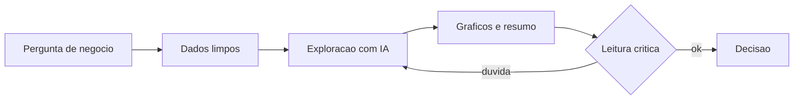

# Capítulo 6: Análise de Dados com IA

## 1. Introdução

No Capítulo 5, você aprendeu a criar planilhas completas com IA. Agora o desafio sobe de nível: em vez de apenas organizar dados, vamos descobrir o que eles contam. Análise de dados com IA gratuita é o superpoder que separa o analista que entrega números do analista que entrega leitura de negócio. Neste capítulo, você vai aprender a conversar com seus dados — subir arquivos, pedir análises em linguagem natural, executar Python sem instalar nada e, acima de tudo, ler criticamente o resultado que a IA devolve.

## 2. Explica

Análise de dados é o processo de transformar dados brutos em respostas a perguntas de negócio. O fluxo clássico tem cinco etapas: definir a pergunta, limpar os dados, explorar (EDA — análise exploratória), visualizar e concluir. A IA gratuita acelera as quatro últimas, mas a primeira — a pergunta — continua sendo sua.

A análise exploratória, ou EDA, é o coração do processo. É nela que você descobre distribuições, tendências, correlações e anomalias antes de qualquer conclusão. Com a IA, a EDA vira um diálogo: você sobe o arquivo e pergunta "qual foi o mês com pior margem?", e o modelo executa código e devolve o número, o gráfico e a explicação. O ChatGPT gratuito executa Python em ambiente isolado para isso [1], e o Gemini integra arquivos diretamente no fluxo do Google [2]. Ferramentas como o PandasAI levam o mesmo diálogo para dentro do seu próprio código Python [3].

O Python é a linguagem padrão da análise de dados. A biblioteca pandas é a ferramenta de manipulação — ler, filtrar, agrupar, calcular [4]. NumPy fornece a base numérica [5], Matplotlib e Seaborn geram os gráficos [6] e o statsmodels cuida da estatística [7]. A boa notícia para quem está começando: você não precisa instalar nada — o Google Colab roda tudo no navegador [8], e o próprio ChatGPT executa o código por você [1].

A leitura crítica é a etapa que nenhuma ferramenta faz por você. Estudos mostram que modelos erram cálculos encadeados e, pior, erram com confiança [9]. Portanto, todo número que a IA devolver merece uma pergunta: "como você chegou a isso?" — e a resposta deve mostrar o código ou o cálculo. Se não mostrar, é sinal de alerta. A pesquisa acadêmica em IA generativa para finanças confirma que a supervisão humana é o que separa o ganho de produtividade do prejuízo por alucinação [11]. E quando os dados carregam informações pessoais, a anonimização antes do upload é obrigatória pela LGPD [12].

## 3. Ilustra

Volte à mesa de operações. O analista não lê os números do terminal em sequência — ele olha o painel inteiro, nota padrões, compara colunas, percebe quando algo destoa. A análise de dados com IA funciona assim: a IA é o assistente que varre o painel rapidíssimo, mas o olhar que nota a anomalia ainda é o seu.

Como Analista de Inteligência Financeira, você vai desenvolver esse olhar em cinco passos que se repetem em toda análise. O diagrama abaixo mostra o ciclo.



## 4. Técnica

### Conversando com seus dados no ChatGPT

O fluxo mais simples de todos: suba um arquivo CSV e converse. Vamos usar a base limpa do Capítulo 3 (`fluxo_caixa_limpo.csv`). Prompt de abertura:

```
Analise o arquivo fluxo_caixa_limpo.csv. Quero entender o comportamento
do saldo mensal: calcule media, minimo e maximo, identifique a tendencia
e aponte qualquer mes anomalo. Mostre o código que usou.
```

A resposta típica traz estatísticas descritivas, um gráfico de linha e a identificação de sazonalidade. Peça sempre o código — é ele que permite a conferência.

### EDA completa em Python no Colab

Para uma análise reprodutível e guardável, rode você mesmo no Google Colab [8]:

```python
import pandas as pd
import matplotlib.pyplot as plt

# Carrega a base limpa
df = pd.read_csv("fluxo_caixa_limpo.csv")
df["competencia"] = pd.to_datetime(df["competencia"])

# Estatisticas descritivas do saldo
print(df["saldo"].describe())

# Evolucao do saldo ao longo do tempo
plt.figure(figsize=(8, 4))
plt.plot(df["competencia"], df["saldo"], marker="o")
plt.title("Evolucao do saldo mensal")
plt.grid(True)
plt.show()

# Correlacao entre entradas e saidas
print("Correlacao entradas x saidas:", df["entradas"].corr(df["saidas_operacionais"]))
```

### Detectando anomalias com regras simples

Antes de qualquer modelo, comece pela detecção de anomalias por regras — a técnica mais robusta para um iniciante:

```python
import pandas as pd

df = pd.read_csv("fluxo_caixa_limpo.csv")
media = df["saldo"].mean()
desvio = df["saldo"].std()

# Considera anomalo saldo fora de 2 desvios-padrao da media
limiar_inferior = media - 2 * desvio
limiar_superior = media + 2 * desvio

anomalias = df[(df["saldo"] < limiar_inferior) | (df["saldo"] > limiar_superior)]
print("Meses anomalos:")
print(anomalias.to_string(index=False))
```

Esse padrão — média, desvio, limiar — é a porta de entrada da análise estatística em finanças, e o statsmodels aprofunda cada conceito quando você precisar [7]. O curso de pandas da Quantecon traz exercícios práticos exatamente nesse nível para você treinar [13], e o scikit-learn oferece os modelos de regressão e classificação quando a análise crescer [14].

### Pedindo previsão de tendência

Para a etapa de previsão, o Prophet gera projeções de séries temporais a partir do histórico [10]:

```python
import pandas as pd
from prophet import Prophet

df = pd.read_csv("fluxo_caixa_limpo.csv", parse_dates=["competencia"])
dados = df.rename(columns={"competencia": "ds", "saldo": "y"})

modelo = Prophet()
modelo.fit(dados)
futuro = modelo.make_future_dataframe(periods=3, freq="ME")
previsao = modelo.predict(futuro)

print(previsao[["ds", "yhat", "yhat_lower", "yhat_upper"]].tail())
```

A previsão vem com intervalo de confiança — a faixa entre o pessimista e o otimista — que é exatamente o que um analista precisa para apresentar cenários sem fingir certeza. Para ancorar a análise no contexto econômico, cruze os achados com as séries oficiais do Banco Central [15] e do IBGE [16], e consulte o IPEA quando precisar de dados de pesquisa aplicada [17].

### Explorando distribuições e correlações

A EDA vai além de médias: ela investiga distribuições e relações entre variáveis. O código abaixo explora a distribuição das entradas e a correlação com as saídas — o par que explica a variação do saldo:

```python
import pandas as pd
import matplotlib.pyplot as plt

# Carrega e prepara
# (arquivo fluxo_caixa_limpo.csv gerado no Capitulo 3)
df = pd.read_csv("fluxo_caixa_limpo.csv")

# Distribuicao das entradas mensais
print("Distribuicao das entradas:")
print(df["entradas"].describe())

# Histograma das entradas
plt.figure(figsize=(6, 4))
plt.hist(df["entradas"], bins=6, edgecolor="black")
plt.title("Distribuicao das entradas mensais")
plt.show()

# Matriz de correlacao
print("\nCorrelacoes:")
print(df[["entradas", "saidas_operacionais", "saidas_financeiras", "saldo"]].corr())
```

### Análise de tendência com regressão simples

Quando a série temporal mostra uma direção, a regressão linear quantifica a tendência. O statsmodels executa o modelo e entrega o coeficiente de inclinação — o quanto o saldo cresce por mês, em média:

```python
import pandas as pd
import statsmodels.api as sm

# (arquivo fluxo_caixa_limpo.csv gerado no Capitulo 3)
df = pd.read_csv("fluxo_caixa_limpo.csv", parse_dates=["competencia"])
df["mes_num"] = range(1, len(df) + 1)

# Regressao do saldo contra o numero do mes
X = sm.add_constant(df["mes_num"])
modelo = sm.OLS(df["saldo"], X).fit()

print(modelo.summary().tables[1])
print(f"Tendencia mensal media: R$ {modelo.params['mes_num']:.2f}/mes")
```

### Pedindo explicações em linguagem natural

Com o PandasAI, o mesmo fluxo vira diálogo dentro do seu próprio código: você pergunta em português e a biblioteca traduz para pandas [3]. O código abaixo é o esqueleto do fluxo:

```python
import pandas as pd
from pandasai import SmartDataframe

# (arquivo fluxo_caixa_limpo.csv gerado no Capitulo 3)
df = pd.read_csv("fluxo_caixa_limpo.csv")
sdf = SmartDataframe(df)

resposta = sdf.chat("Qual mes teve o pior saldo? Responda com o valor.")
print(resposta)
```

A conferência segue valendo: a resposta em linguagem natural é um atalho, não um fim — valide com o código direto em pandas antes de levar para a reunião [9].

### Guardando o notebook como trilha de auditoria

Cada análise deve terminar com o notebook salvo no Colab ou exportado. O notebook é a prova de como cada número foi calculado — a trilha de auditoria que a área de compliance pede quando o número aparece em uma decisão [12].

### Análise de sazonalidade com comparação mensal

Uma das análises mais valiosas para o setor financeiro é a sazonalidade: comparar o mesmo mês entre anos revela padrões que a média esconde. O código abaixo compara o desempenho mês a mês e destaca os meses fora do padrão:

```python
import pandas as pd

# (arquivo fluxo_caixa_limpo.csv gerado no Capitulo 3)
df = pd.read_csv("fluxo_caixa_limpo.csv", parse_dates=["competencia"])

# Cria colunas de mes e ano
df["mes"] = df["competencia"].dt.month
df["ano"] = df["competencia"].dt.year

# Media de entradas por mes (todos os anos)
media_por_mes = df.groupby("mes")["entradas"].mean()
print("Media de entradas por mes:")
print(media_por_mes.to_string())

# Meses acima de 10% da media geral
media_geral = df["entradas"].mean()
acima = media_por_mes[media_por_mes > media_geral * 1.10]
print("\nMeses consistentemente acima da media:")
print(acima.to_string())
```

### Pedindo hipóteses explicativas à IA

Quando a anomalia é detectada, o próximo passo é gerar hipóteses — e a IA é uma ótima geradora de hipóteses (não de conclusões). Prompt estruturado:

```
O saldo de abril caiu 18% sem que as receitas mudassem. Liste as cinco
hipoteses mais provaveis para um negocio de servicos, considerando
custos operacionais, financeiros e sazonalidade. Para cada hipotese,
indique qual dado eu preciso verificar para confirma-la.
```

A resposta vira o roteiro da sua investigação: cada hipótese aponta a verificação, e você confirma ou descarta com os dados — a IA agiliza o pensamento, mas a evidência decide [9].

### Apresentando a análise em formato executivo

A entrega final da análise é a comunicação. A estrutura executiva em três blocos: contexto (o que analisamos e por quê), achados (os números que importam, com gráfico) e recomendação (o que fazer com base na evidência). A IA transforma seu notebook em um resumo executivo em segundos — e o checklist de conferência garante que o resumo não inventou nada [11].

### A análise comparativa entre períodos

Comparar períodos é a análise que revela a direção do negócio: mês contra mês anterior, ano contra ano anterior, orçado contra realizado. O código abaixo monta a comparação essencial:

```python
import pandas as pd

# (arquivo fluxo_caixa_limpo.csv gerado no Capitulo 3)
df = pd.read_csv("fluxo_caixa_limpo.csv", parse_dates=["competencia"])

# Variacao percentual mes a mes das entradas e do saldo
df["var_entradas"] = df["entradas"].pct_change() * 100
df["var_saldo"] = df["saldo"].pct_change() * 100

print(df[["competencia", "entradas", "var_entradas", "saldo", "var_saldo"]].to_string(index=False))

# Mes com pior variacao de saldo
pior = df.loc[df["var_saldo"].idxmin()]
print(f"\nPior variacao de saldo: {pior['competencia'].strftime('%Y-%m')} ({pior['var_saldo']:.1f}%)")
```

### Criando um índice de saúde financeira

Uma técnica avançada e simples: combinar vários KPIs em um único índice de saúde financeira. O índice soma pontuações por faixa — por exemplo, margem acima de 15% vale 3 pontos, liquidez acima de 1,5 vale 3, desvio orçado dentro de 5% vale 2 — e a soma vira a nota do período. A IA ajuda a desenhar as faixas e a escrever o código do índice; você define os critérios com base no seu negócio [14].

### O caderno de perguntas de negócio

Por fim, mantenha um caderno de perguntas de negócio: cada pergunta que a área precisa responder vira uma entrada com a fonte de dados, a técnica de análise e o prompt usado. Esse caderno acelera a próxima análise — metade do trabalho já está documentado — e mostra à liderança a profundidade do trabalho analítico [15].

### O padrão pergunta → hipótese → evidência → conclusão

A estrutura que dá rigor a qualquer análise em quatro movimentos: pergunta (o que queremos saber), hipótese (o que suspeitamos), evidência (o dado que confirma ou refuta) e conclusão (o que decidimos fazer). A IA acelera os movimentos 2 e 3 — gera hipóteses e produz evidências — mas a pergunta e a conclusão são decisões suas. Esse padrão é o que separa a análise de dados da adivinhação com gráficos [9].

### Protegendo a análise: o que nunca enviar à nuvem

A lista do que nunca vai para assistentes de nuvem: dados de clientes com identificação, folhas de pagamento, contratos com cláusulas sensíveis, senhas e tokens, e informações sob sigilo regulatório. Para esses casos, o caminho é o modelo local do Capítulo 2 ou a análise com dados anonimizados. Ter essa lista na cabeça (e no manual de bancada) é o que evita o incidente de privacidade descrito no Capítulo 2 [12].

### O fluxo de análise reprodutível

A reprodutibilidade é o padrão de ouro da análise profissional: qualquer colega deve conseguir refazer a sua análise e chegar ao mesmo número. Os três ingredientes: código versionado (o notebook do Colab ou o script Python), dados fixos (a base limpa e versionada do Capítulo 3) e documentação (o caderno de perguntas com a metodologia). Quando esses três existem, a análise vira ativo da empresa — e o "de onde veio este número?" ganha resposta em segundos [15].

### O gráfico que comunica de verdade

O gráfico é a ponte entre o número e a decisão — e a escolha do tipo muda a mensagem. Linha para evolução no tempo, barra para comparação, pizza para composição (use com moderação), dispersão para relação entre variáveis. A IA gera o gráfico em segundos; você escolhe o tipo certo e escreve a legenda que diz o que importa. Um gráfico sem título, sem eixos nomeados e sem unidade não comunica — a apresentação é parte do trabalho analítico [13].

### O quadro das técnicas de análise

O quadro que resume o arsenal deste capítulo:

| Técnica | O que responde | Ferramenta |
|---|---|---|
| Estatística descritiva | Como os dados se distribuem | pandas [4] |
| Detecção de anomalias | O que destoa do padrão | média ± 2 desvios [7] |
| Correlação | O que varia junto | pandas .corr() [4] |
| Regressão simples | Qual a tendência | statsmodels [7] |
| Sazonalidade | Qual o padrão mensal | agrupamento por mês [4] |
| Previsão | O que vem a seguir | Prophet [10] |

### Perguntas frequentes sobre análise

"Preciso dominar estatística antes?" — o básico de média, desvio e correlação basta para começar [7]. "A IA substitui o analista de dados?" — substitui a digitação, não a interpretação [9]. "Por que pedir sempre o código?" — porque o código é a prova do cálculo e permite conferir e reutilizar [1]. "Colab ou ChatGPT para Python?" — ambos; Colab quando você quer guardar e compartilhar o notebook [8].

### O exercício completo do capítulo

O exercício que fecha o capítulo é a análise completa de uma base real do seu trabalho: rode a EDA completa (descritiva, correlação, anomalias, sazonalidade), teste uma previsão com o Prophet, gere hipóteses com a IA e escreva o resumo executivo em três blocos. A régua de sucesso tem quatro marcas: cada número da conclusão tem código por trás; a anomalia detectada tem hipótese e verificação; a previsão apresenta intervalo de confiança, não um número único; e o notebook versionado documenta todo o caminho [15].

### Caso real: a anomalia que a média escondia

Uma história que mostra o valor da EDA: o relatório mensal mostrava margem estável — a média do trimestre parecia saudável. Mas a análise por mês revelou algo que a média escondia: abril tinha despencado 18% no saldo, compensado por um maio excepcional. Quem olhava só a média não via o problema; quem olhava a série via a anomalia [9]. A detecção por regras (média e desvio), o cruzamento com o calendário e a hipótese gerada pela IA levaram à causa: uma despesa financeira atípica lançada em abril. O relatório passou a mostrar a série, não só a média — e a mesa ganhou a visão que faltava [7]. Esse é o olhar que a EDA treina.

### O que levar deste capítulo para a sua rotina

As cinco frases do capítulo para o manual: pergunta boa antes de dado bom — a pergunta é sua [1]. EDA é o diálogo com os dados: estatística, gráfico, anomalia [4]. Sempre peça o código: ele é a prova do cálculo e o atalho da conferência [1]. Previsão sem intervalo de confiança é chute com roupa de certeza [10]. E o notebook versionado é a trilha de auditoria da análise [15]. Com essas cinco, você analisa como um profissional.

### Mapa de leitura do capítulo

Para aprofundar análise de dados: a documentação do pandas cobre cada operação de manipulação usada no capítulo [4]; o NumPy é a base numérica por trás dos cálculos [5]; o Matplotlib gera os gráficos da EDA [6]; o statsmodels explica a estatística de regressão e hipóteses [7]; o curso da Quantecon exercita os conceitos com dados econômicos [13]; o scikit-learn apresenta os modelos preditivos do próximo nível [14]; e o Prophet documenta a previsão de séries temporais [10]. Uma leitura por semana e a sua análise ganha profundidade — sem sair das ferramentas gratuitas.

### A régua de progresso do analista

A régua da análise em três estágios: estágio 1 — leitor: você aceita os números que a IA devolve. Estágio 2 — investigador: você pede o código, confere e questiona o resultado. Estágio 3 — cientista: você desenha a pergunta, estrutura a EDA, gera hipóteses e decide com evidência. O estágio 2 é o salto de segurança — é ele que impede o erro de chegar à diretoria; o estágio 3 é o salto de valor — é ele que transforma dado em decisão. Este capítulo foi desenhado para levar você ao estágio 3 [9].

### Checklist de conclusão do capítulo

O checklist final do Capítulo 6: conversei com meus dados via upload e prompts [1]; rodei a EDA completa no Colab com estatística e gráficos [4][8]; detectei anomalias por regra de média e desvio [7]; analisei sazonalidade por comparação mensal [4]; gerei hipóteses com a IA e verifiquei com dados [9]; testei uma previsão com intervalo de confiança [10]; e guardei o notebook como trilha de auditoria [15]. Com todas as marcas, a sua análise tem método — e o próximo capítulo vai transformar os achados em indicadores e painéis.

### Resumo do capítulo em um parágrafo

O resumo do Capítulo 6 em trinta segundos: análise de dados é conversa com os dados — você sobe o arquivo, faz perguntas em linguagem natural e pede o código de cada resposta. A EDA revela o que a média esconde, a previsão com intervalo substitui a certeza fingida e o notebook versionado é a prova de tudo — e a leitura crítica continua sendo sua, com a IA como aceleradora. A EDA (estatística, gráficos, anomalias, sazonalidade) revela o que a média esconde; a previsão com intervalo de confiança substitui a certeza fingida; e o notebook versionado é a prova de tudo. No centro de tudo, a leitura crítica: a IA acelera, você interpreta [9]. Esse é o parágrafo que resume a análise.

## 5. Aplica

Cena de contraste. Você precisa descobrir por que a margem da empresa caiu no segundo trimestre. Com pressa, você cola a tabela inteira no chat e pergunta: "por que a margem caiu?". A IA responde com uma lista genérica de possibilidades — aumento de custos, queda de receita, mudança de mix — sem nenhum número específico. Você leva essa resposta para a reunião e sai com a cara de quem não sabe.

O diagnóstico: você fez uma pergunta aberta demais para dados fechados. A IA não tem como saber a causa sem que você estruture a exploração. Perguntas vagas geram respostas vagas — o mesmo princípio que você viu na criação de planilhas [9]. O Google Cloud documenta casos reais de IA aplicada a finanças e relatórios que reforçam a importância da pergunta estruturada [18], e o PandasAI mostra como o diálogo em linguagem natural acelera a EDA quando combinado com bom roteiro [3].

A correção: transformar a pergunta em roteiro de EDA. Primeiro, descubra o que mudou: calcule a margem por mês e compare os trimestres. Depois, decompose: receita caiu, custo subiu ou os dois? Com a base limpa do Capítulo 3, você roda os três comandos da seção Técnica e chega ao diagnóstico específico — custos variáveis subiram 12% em abril, empurrando a margem para baixo. Agora você leva para a reunião um número, uma causa e uma sugestão de ação.

Armadilhas comuns:

- Fazer perguntas vagas para dados específicos.
- Aceitar o primeiro número sem pedir o código.
- Não separar a análise por período — esconder a sazonalidade.
- Confundir correlação com causa na leitura dos gráficos.
- Deixar de guardar o notebook com o código para auditoria posterior.
- Enviar dados sensíveis a nuvem sem anonimizar, contrariando a orientação da Autoridade Nacional de Proteção de Dados [19].

## 6. Conclusão

Você aprendeu a conversar com seus dados: subir arquivos, rodar EDA completa em Python no Colab, detectar anomalias por regras estatísticas e gerar previsões com intervalo de confiança. O ponto central do capítulo é a leitura crítica: a IA acelera, mas quem interpreta é você. Para apresentar os achados em formato visual, o Looker Studio e o Power BI serão seus próximos terminais [20][21]. Desafio: pegue a base limpa do Capítulo 3, rode a EDA completa e escreva um parágrafo de conclusão de negócio que um diretor entenda. No próximo capítulo, vamos transformar esses achados em indicadores e dashboards — o formato final do trabalho do analista.

## 7. Referências Bibliográficas

[1] OPENAI. *ChatGPT — Pricing & Info*. Disponível em: https://chatgpt.com/pricing/. Acesso em: 8 ago. 2026.
[2] GOOGLE. *Gemini Apps*. Disponível em: https://gemini.google.com/. Acesso em: 8 ago. 2026.
[3] PANDASAI. *Inteligência Artificial para Business Intelligence*. Disponível em: https://pandas-ai.com/. Acesso em: 8 ago. 2026.
[4] PANDAS. *Documentação oficial do pandas*. Disponível em: https://pandas.pydata.org/. Acesso em: 8 ago. 2026.
[5] NUMPY. *Documentação oficial do NumPy*. Disponível em: https://numpy.org/. Acesso em: 8 ago. 2026.
[6] MATPLOTLIB. *Documentação oficial do Matplotlib*. Disponível em: https://matplotlib.org/. Acesso em: 8 ago. 2026.
[7] STATSMODELS. *Documentação oficial do statsmodels*. Disponível em: https://www.statsmodels.org/. Acesso em: 8 ago. 2026.
[8] GOOGLE. *Google Colab*. Disponível em: https://colab.research.google.com/. Acesso em: 8 ago. 2026.
[9] WU, Z. et al. *Towards Competent AI for Fundamental Analysis in Finance: A Benchmark Dataset and Evaluation (FinAR-Bench)*. Disponível em: https://arxiv.org/html/2506.07315v2. Acesso em: 8 ago. 2026.
[10] META. *Prophet — Previsão de séries temporais*. Disponível em: https://facebook.github.io/prophet/. Acesso em: 8 ago. 2026.
[11] DESAI, A. P. et al. *Generative-AI in Finance: Opportunities and Challenges*. Disponível em: https://arxiv.org/html/2410.15653v3. Acesso em: 8 ago. 2026.
[12] PLANALTO. *Lei Geral de Proteção de Dados (Lei nº 13.709/2018)*. Disponível em: https://www.planalto.gov.br/ccivil_03/_ato2015-2018/2018/lei/l13709.htm. Acesso em: 8 ago. 2026.
[13] PYTHON PROGRAMMING FOR ECONOMICS AND FINANCE. *Pandas — Documentação*. Disponível em: https://python-programming.quantecon.org/pandas.html. Acesso em: 8 ago. 2026.
[14] SCIKIT-LEARN. *Documentação oficial do scikit-learn*. Disponível em: https://scikit-learn.org/. Acesso em: 8 ago. 2026.
[15] BANCO CENTRAL DO BRASIL. *Dados e estatísticas*. Disponível em: https://www.bcb.gov.br. Acesso em: 8 ago. 2026.
[16] IBGE. *Estatísticas econômicas*. Disponível em: https://www.ibge.gov.br. Acesso em: 8 ago. 2026.
[17] IPEA. *Instituto de Pesquisa Econômica Aplicada*. Disponível em: https://www.ipea.gov.br. Acesso em: 8 ago. 2026.
[18] GOOGLE CLOUD. *Finance AI*. Disponível em: https://cloud.google.com/discover/finance-ai. Acesso em: 8 ago. 2026.
[19] ANPD. *Autoridade Nacional de Proteção de Dados*. Disponível em: https://www.gov.br/anpd. Acesso em: 8 ago. 2026.
[20] GOOGLE. *Looker Studio*. Disponível em: https://lookerstudio.google.com/. Acesso em: 8 ago. 2026.
[21] MICROSOFT. *Power BI Desktop*. Disponível em: https://powerbi.microsoft.com/pt-br/. Acesso em: 8 ago. 2026.
