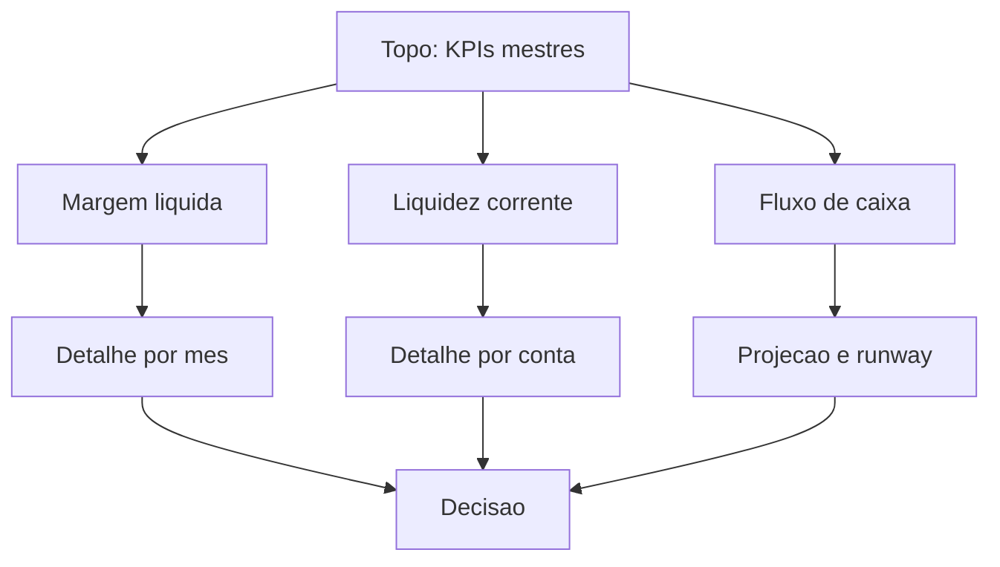

# Capítulo 7: KPIs e Dashboards Financeiros

## 1. Introdução

No Capítulo 6, você aprendeu a analisar dados com IA e a extrair leituras de negócio. Agora vamos ao formato final do trabalho do analista: transformar esses achados em indicadores — os KPIs — e em painéis visuais — os dashboards — que traduzem números em decisão. Neste capítulo, você vai aprender os KPIs financeiros essenciais, calcular cada um deles com IA e montar dashboards gratuitos no Looker Studio e no Power BI Desktop. Ao final, você terá um painel de indicadores digno de uma mesa de operações moderna.

## 2. Explica

KPI é a sigla de Key Performance Indicator — indicador-chave de desempenho. No mundo financeiro, os KPIs respondem a quatro perguntas básicas: a empresa está lucrando? Ela consegue pagar as contas? Ela gera caixa? E está crescendo? Para cada pergunta, existem indicadores consagrados que a IA ajuda a calcular e interpretar.

Para lucratividade, os KPIs essenciais são a margem bruta (lucro bruto dividido pela receita líquida), a margem operacional (EBIT dividido pela receita) e a margem líquida (lucro líquido dividido pela receita). Para liquidez, a liquidez corrente (ativo circulante dividido pelo passivo circulante) e a liquidez seca (que exclui os estoques). Para caixa, o fluxo de caixa operacional, o fluxo de caixa livre e, no universo de startups, o burn rate e o runway — quanto tempo o caixa sustenta a operação. Para crescimento, o orçado versus realizado, o famoso Budget vs Actual.

O EBIT — lucro antes de juros e impostos — é a ponte entre a DRE e a operação, e o EBITDA soma de volta a depreciação. O SEBRAE publica guias práticos desses indicadores para pequenos negócios [1], e a CVM regula a divulgação das informações financeiras das companhias [2]. A IA gratuita calcula todos esses KPIs com precisão quando recebe dados limpos — e a leitura crítica que você desenvolveu no Capítulo 6 continua valendo: indicador sem contexto é número solto.

No front de visualização, duas ferramentas gratuitas dominam: o Looker Studio, que conecta planilhas do Google a painéis compartilháveis sem custo [3], e o Power BI Desktop, que oferece Power Query e a linguagem DAX para modelagem profissional [4]. Guias comparativos mostram que a escolha entre elas depende do ecossistema: Google para quem vive em Sheets, Microsoft para quem vive em Excel [5]. O que nenhuma faz sozinha é decidir — o KPI aponta, o analista decide. Para previsões que alimentam os painéis, o Prophet gera projeções de séries temporais gratuitamente [9], e o ExcelJet ajuda na conferência das fórmulas de cada indicador [10].

## 3. Ilustra

Pense na mesa de operações com seu painel de indicadores: luzes verdes, amarelas e vermelhas em cada terminal. O operador não precisa ler 50 números — ele olha o painel e enxerga o estado do jogo em segundos. O dashboard é exatamente isso: o painel da mesa. O KPI é cada luz, e o semáforo — verde, amarelo, vermelho — é a forma mais rápida de transformar número em atenção.

Como Analista de Inteligência Financeira, você vai desenhar seu painel com hierarquia: os três ou quatro KPIs que o diretor olha todo mês no topo, os detalhes abaixo. O diagrama abaixo mostra a anatomia de um dashboard financeiro eficaz.



## 4. Técnica

### Calculando KPIs com Python

Com a base limpa do Capítulo 3, o cálculo dos KPIs vira rotina. O código abaixo calcula margem, liquidez e variação:

```python
import pandas as pd

df = pd.read_csv("fluxo_caixa_limpo.csv")

# Margem operacional (lucro operacional / receita) por mes
df["lucro_operacional"] = df["entradas"] - df["saidas_operacionais"]
df["margem_operacional"] = (df["lucro_operacional"] / df["entradas"]) * 100

# Variavel de crescimento (Budget vs Actual simulado)
df["variacao_entradas"] = df["entradas"].pct_change() * 100

# Burn rate medio e runway estimado
burn_medio = df["saidas_operacionais"].mean()
caixa_final = df["saldo"].sum()
runway_meses = caixa_final / burn_medio if burn_medio else 0

print(df[["competencia", "margem_operacional", "variacao_entradas"]].to_string(index=False))
print(f"\nBurn rate medio: R$ {burn_medio:,.2f}")
print(f"Runway estimado: {runway_meses:.1f} meses")
```

Esse é o bloco básico de indicadores. Para aprofundar a estatística por trás de cada métrica, o statsmodels é a referência [6]. Quando o painel precisar de gráficos mais elaborados, o Matplotlib e o NumPy sustentam qualquer visualização [11][12]. E para quem quer conversar com o painel em linguagem natural, o PandasAI permite perguntar "qual mês teve pior margem?" direto sobre os dados [13].

### Montando o dashboard no Looker Studio

O Looker Studio conecta-se diretamente à planilha [3]. O fluxo:

1. Abra o Looker Studio e crie um relatório em branco.
2. Conecte a fonte de dados ao Google Sheets onde está a base limpa.
3. Crie os cartões de KPI: margem líquida, liquidez corrente, fluxo de caixa.
4. Adicione o gráfico de linhas da evolução mensal.
5. Configure o filtro por período — o painel ganha interatividade instantânea.

Modelos prontos de dashboards financeiros no Looker Studio mostram a variedade de layouts que você pode reutilizar [7]. Guias especializados, como o da dataSights sobre dashboard financeiro, detalham a configuração passo a passo [14].

### Montando o dashboard no Power BI Desktop

Para o ecossistema Excel, o Power BI Desktop é o caminho [4]:

1. Abra o Power BI Desktop e importe a base CSV com Power Query.
2. Crie as medidas em DAX — por exemplo, margem líquida:

```dax
Margem Liquida = DIVIDE(SUM('fluxo'[lucro_liquido]), SUM('fluxo'[receita]))
```

3. Arrume os visuais: cartões, gráfico de linhas e matriz por mês.
4. Publique ou exporte o relatório.

O Power Query limpa os dados na importação — uma camada extra de garantia de qualidade antes do painel [4]. O Google Cloud documenta casos reais de IA aplicada a finanças que mostram dashboards alimentados por modelos generativos [15], e o curso de pandas da Quantecon treina o tratamento de dados que precede o painel [16].

### Da métrica à decisão: análise de sensibilidade

O passo final conecta KPI a decisão: monte cenários mudando premissas. Com a planilha de três andares do Capítulo 5, altere a premissa de crescimento e observe o impacto nos KPIs do painel. Esse é o fluxo completo: dado limpo, indicador calculado, painel desenhado, cenário testado, decisão tomada. Se o painel tratar dados pessoais, anonimize antes de publicar — a LGPD exige [17], e a Autoridade Nacional de Proteção de Dados orienta as boas práticas [18]. Para ancorar as metas no cenário econômico, cruze com as séries do Banco Central [19] e do IBGE [20].

### Calculando liquidez e EBITDA

Além das margens, os painéis mais completos incluem liquidez e EBITDA. O código abaixo estende o bloco de indicadores:

```python
import pandas as pd

# Base com ativo e passivo circulantes (simulado)
df = pd.read_csv("fluxo_caixa_limpo.csv")

# Simula balancete mensal simplificado
df["ativo_circulante"] = df["saldo"].cumsum() * 0.6 + 100000
df["passivo_circulante"] = df["saldo"].cumsum() * 0.4 + 70000

# Liquidez corrente e seca
df["liquidez_corrente"] = df["ativo_circulante"] / df["passivo_circulante"]
df["liquidez_seca"] = (df["ativo_circulante"] * 0.85) / df["passivo_circulante"]

# EBITDA simulado (lucro operacional + depreciação estimada)
df["depreciacao"] = df["entradas"] * 0.04
df["ebitda"] = df["lucro_operacional"] + df["depreciacao"]

print(df[["competencia", "liquidez_corrente", "liquidez_seca", "ebitda"]].head().to_string(index=False))
```

### Criando alertas automáticos de KPI

Um dashboard que avisa é melhor que um dashboard que mostra. No Power BI, as medidas DAX podem devolver status — verde, amarelo, vermelho — comparando o valor com a meta:

```dax
Status Margem = SWITCH(TRUE(),
    [Margem Operacional] >= 0.20, "Verde",
    [Margem Operacional] >= 0.15, "Amarelo",
    "Vermelho"
)
```

No Looker Studio, a mesma lógica vira campo calculado. O resultado é o semáforo da mesa: o painel guia o olhar para o que importa [16].

### Apresentando o dashboard em dois minutos

A entrega final do analista é a leitura do painel. A estrutura de apresentação em dois minutos: (1) abra com o KPI mestre do período — "margem líquida de X%"; (2) mostre a tendência — "há três meses consecutivos de alta"; (3) aponte a anomalia ou o desvio orçado; (4) feche com a recomendação apoiada nos cenários. Essa estrutura transforma o dashboard em narrativa de decisão [8].

### O ciclo mensal do painel

Por fim, automatize o ciclo: mês novo, dados novos, painel atualizado. Com a base limpa no Sheets, o Looker Studio atualiza ao abrir [3]; com o Power BI, o Power Query refresca na importação [4]. O analista deixa de gastar horas montando o relatório e passa a gastar o tempo interpretando — a verdadeira entrega da mesa.

### Definindo metas para cada KPI

Um KPI sem meta é um número sem julgamento. A definição de metas transforma o painel em instrumento de gestão: cada indicador ganha um alvo (ex.: margem líquida acima de 10%, liquidez corrente acima de 1,5, desvio orçado abaixo de 5%) e o semáforo compara o realizado com o alvo. Para calibrar metas realistas, use três referências: o histórico da própria empresa, os benchmarks do SEBRAE para o porte do negócio [1] e as condições econômicas das séries do Banco Central e do IBGE [19][20].

### O prompt de leitura do painel

Depois do dashboard montado, a IA ajuda a ler — mas a leitura final é sua. O prompt de leitura estruturada:

```
Dados os KPIs do mes (margem liquida 8%, liquidez corrente 1,2,
desvio orcado -6%, fluxo de caixa 40 mil), escreva um paragrafo de
leitura executiva: o que os numeros dizem, o principal risco e uma
recomendacao de acao. Separe fatos (numeros) de interpretacao.
```

A resposta separa fatos de interpretação — exatamente a disciplina que protege a decisão [8].

### Governança do painel: quem vê, quem edita

O último pilar do dashboard profissional é a governança: defina quem pode ver cada painel, quem pode editar e quem responde pela versão final. No Looker Studio, o compartilhamento é controlado por e-mail; no Power BI, por espaço de trabalho. Para painéis com dados sensíveis, a política de acesso é obrigação de compliance — e a anonimização de dados pessoais antes da publicação continua valendo [17].

### Escolhendo o gráfico certo para cada dado

A escolha do gráfico é parte da comunicação. Regras rápidas: evolução no tempo usa linha; comparação entre categorias usa barra; participação de cada item no total usa pizza ou barra empilhada; relação entre duas variáveis usa dispersão; ranking usa barra horizontal. A IA sugere o gráfico certo: "tenho entradas e saídas por mês e quero mostrar a evolução e o gap — qual visual usar?" — e a resposta vem com a justificativa [3].

### O painel que conta uma história

Um bom painel não mostra dados — conta uma história. A sequência narrativa: comece pelo resultado (o KPI mestre), explique a composição (o que gerou esse número), mostre a tendência (para onde vai) e destaque o alerta (o que exige atenção). Quando o painel segue essa ordem, a reunião de fechamento vira decisão em vez de garimpo de número [8].

### O caderno de KPIs da empresa

Um dashboard começa antes do dashboard: no caderno de KPIs. Para cada indicador, registre a fórmula exata, a fonte de dados, a periodicidade, a meta e o responsável. Esse caderno é o dicionário do painel — sem ele, cada pessoa interpreta o KPI de um jeito e as comparações perdem sentido. A IA ajuda a redigir o caderno a partir da lista de indicadores que você já usa; a validação das fórmulas com a área contábil é responsabilidade sua [1][2].

### Medindo o impacto do painel

O último passo da gestão por painel é medir o próprio painel: as decisões melhoraram? O tempo de resposta a perguntas da diretoria caiu? Os desvios foram identificados antes? Registre antes e depois da implantação — a evidência de valor que justifica manter e evoluir o dashboard [8].

### O painel de fluxo de caixa com projeção

O painel mais pedido em finanças é o de fluxo de caixa com projeção. Estrutura: saldo inicial, entradas realizadas e previstas, saídas realizadas e previstas, saldo projetado e alerta de saldo mínimo. A projeção vem do modelo do Capítulo 5; o painel une tudo no Looker Studio ou no Power BI, e o alerta visual acende quando o saldo projetado cruza o mínimo. Esse painel é a resposta ao gestor que pergunta toda semana: "quanto caixa temos até o fim do mês?" — e a resposta sai em segundos [3][4].

### O comparativo com o mercado

O último nível de contexto é o comparativo externo: como os seus indicadores se comparam ao mercado? As referências vêm dos benchmarks setoriais, dos dados do IBGE [20], das estatísticas do Banco Central [19] e dos guias do SEBRAE [1]. O comparativo transforma "margem de 8%" em "margem de 8%, acima da média do setor de 6%" — o contexto que muda o julgamento na reunião [8].

### O quadro dos KPIs essenciais

O quadro que consolida os indicadores do capítulo:

| KPI | Fórmula | Pergunta que responde |
|---|---|---|
| Margem bruta | Lucro bruto ÷ receita | Quanto sobra do produto |
| Margem operacional | EBIT ÷ receita | Quanto sobra da operação |
| Margem líquida | Lucro líquido ÷ receita | Quanto sobra no fim |
| Liquidez corrente | Ativo circ. ÷ passivo circ. | A empresa paga no curto prazo? |
| Liquidez seca | (Ativo circ. − estoque) ÷ passivo circ. | E sem depender do estoque? |
| Orçado vs realizado | Realizado ÷ orçado − 1 | Estamos cumprindo o plano? |
| Burn rate / runway | Saídas ÷ caixa | Quanto tempo o caixa sustenta? |

### Perguntas frequentes sobre KPIs e dashboards

"Quantos KPIs devo mostrar?" — no topo, três a cinco mestres; o detalhe fica abaixo [8]. "Looker Studio ou Power BI?" — o ecossistema da sua equipe decide [5]. "O dashboard precisa de semáforo?" — ajuda muito; transforma número em atenção instantânea [16]. "KPI sem meta serve?" — não; meta é o que dá julgamento ao indicador [1].

### O exercício completo do capítulo

O exercício que fecha o capítulo é a montagem do seu dashboard mensal completo: defina os cinco KPIs essenciais da sua área no caderno de KPIs, calcule-os com o código da seção Técnica, monte o painel no Looker Studio ou Power BI com os KPIs mestres no topo, semáforos e tendência, e apresente a leitura em dois minutos seguindo a estrutura de narrativa. A régua de sucesso tem quatro marcas: o painel responde às três perguntas do gestor em segundos; os semáforos guiam o olhar; as metas estão definidas e documentadas; e o ciclo mensal de atualização está automatizado [3][4].

### Caso real: o relatório de 40 páginas que virou um painel

Uma transformação que vale o capítulo: o relatório mensal da empresa tinha 40 páginas de tabelas, e cada reunião de fechamento virava um garimpo de números — o gestor não conseguia achar nem a margem líquida do trimestre. A virada foi a anatomia do painel: três KPIs mestres no topo, semáforos por meta, tendência em linha e detalhe sob demanda [8]. O mesmo conteúdo, décima parte do esforço de leitura. O gestor passou a abrir o painel, ver o estado do jogo em segundos e gastar a reunião em decisão, não em busca. A métrica que validou a mudança: o tempo para responder "qual é a margem e como está o caixa?" caiu de minutos para segundos — e o desvio orçado passou a ser visto no mês, não no trimestre [1]. Esse é o poder do dashboard bem desenhado.

### O que levar deste capítulo para a sua rotina

As cinco frases do capítulo para o manual: KPI é a resposta a uma pergunta — qual é a sua? [1]. O topo do painel tem três a cinco KPIs mestres; o detalhe fica abaixo [8]. Semáforo transforma número em atenção; meta transforma indicador em gestão [16]. Dashboard é meio, decisão é fim — a leitura humana é o ato final [8]. E o ciclo mensal automatizado libera o analista para interpretar [3][4]. Com essas cinco, você mede e comunica como um profissional.

### Mapa de leitura do capítulo

Para aprofundar KPIs e dashboards: o SEBRAE apresenta os indicadores financeiros de referência para pequenos negócios [1]; a documentação do Looker Studio cobre conectores, fontes e compartilhamento [3]; o Power BI Desktop explica Power Query e DAX [4]; o comparativo entre Looker Studio e Power BI ajuda na escolha do ecossistema [5]; a documentação do statsmodels aprofunda a estatística dos indicadores [6]; e o Prophet mostra como projetar os KPIs do painel [9]. Com uma leitura por semana, o seu painel vira referência da mesa.

### A régua de progresso do gestor de indicadores

A régua dos indicadores em três estágios: estágio 1 — informante: você mostra tabelas cheias de números sem hierarquia. Estágio 2 — comunicador: você monta o painel com KPIs mestres e semáforos, e a leitura sai em dois minutos. Estágio 3 — estrategista: você define as metas, desenha o ciclo mensal automatizado e usa o painel para antecipar problemas, não apenas reportar. A passagem do 1 para o 2 é a mais visível — a reunião muda de garimpo para decisão; a do 2 para o 3 consolida o seu papel na mesa [8].

### Checklist de conclusão do capítulo

O checklist final do Capítulo 7: calculo os KPIs essenciais com Python [6]; tenho o caderno de KPIs com fórmula, fonte e meta [1]; montei o dashboard no Looker Studio ou Power BI [3][4]; coloquei os KPIs mestres no topo com semáforos [16]; defini metas para cada indicador [1]; automatizei o ciclo mensal de atualização [3][4]; e apresentei a leitura em dois minutos com narrativa [8]. Com todas as marcas, a sua mesa tem painel — e o próximo capítulo vai fechar o arco com automação, riscos e o plano de ação final.

### Resumo do capítulo em um parágrafo

O resumo do Capítulo 7 em trinta segundos: KPI é a resposta a uma pergunta de negócio, e o dashboard é a forma de apresentar as respostas com hierarquia — os mestres no topo, o detalhe abaixo, o semáforo guiando o olhar. As ferramentas gratuitas (Looker Studio e Power BI) entregam o painel; as metas dão julgamento aos números; e o ciclo mensal automatizado libera o analista para interpretar em vez de montar. No fim, o painel é meio — a decisão humana é o fim [8]. Com a mesa medida e os indicadores no ar, o último capítulo fecha o arco completo da obra: automação do dia a dia, gestão de riscos, ética e o plano de ação que transforma o Analista de Inteligência Financeira em realidade — com os cinco KPIs, o semáforo e o ciclo mensal rodando na sua rotina.

## 5. Aplica

Cena de contraste. Você entrega ao diretor um relatório de 40 páginas com dezenas de tabelas de indicadores. Na reunião, o diretor pergunta: "qual é a margem líquida deste trimestre e como está o caixa?" — e você leva minutos folheando para achar os números. O relatório está correto, mas não comunica: é um banco de dados em papel, não um painel.

O diagnóstico: informação sem hierarquia não vira decisão. Dezenas de KPIs iguais em importância fazem o leitor não enxergar nenhum. O relatório da Bain sobre IA em serviços financeiros reforça: o valor não está em gerar mais número, está em apresentar o número certo no formato certo [8]. O benchmark FinAR-Bench complementa: modelos erram justamente no cálculo de indicadores compostos, então todo KPI calculado por IA merece conferência dupla [21].

A correção: aplicar a anatomia do painel. Reduza o relatório a um dashboard com os três KPIs mestres no topo, semáforos verde/amarelo/vermelho, e um gráfico de tendência. O mesmo conteúdo, dez vezes mais comunicação. Quando o diretor perguntar, a resposta sai em segundos — e o painel, alimentado pela planilha, atualiza-se sozinho todo mês.

Armadilhas comuns:

- Mostrar 50 KPIs sem hierarquia — ninguém enxerga nada.
- Não usar semáforos ou alertas visuais — o painel não guia o olhar.
- Ignorar o Budget vs Actual — o desvio é mais informativo que o absoluto.
- Apresentar indicador sem contexto (metas, histórico, mercado).
- Esquecer que dashboard é meio, não fim: a decisão continua humana.

## 6. Conclusão

Você dominou os KPIs financeiros essenciais, aprendeu a calculá-los com Python e IA e montou dashboards gratuitos no Looker Studio e no Power BI Desktop com hierarquia e semáforos. Sua mesa de operações agora tem painel: os números certos, no topo, guiando decisão. Para aprofundar a matemática dos indicadores, o curso de pandas da Quantecon é o treino recomendado [16]. Desafio: monte um dashboard mensal com os cinco KPIs essenciais da sua área e apresente a um colega em dois minutos. No próximo e último capítulo, vamos fechar o arco: automação do dia a dia, riscos, ética e o plano de ação do Analista de Inteligência Financeira.

## 7. Referências Bibliográficas

[1] SEBRAE. *Indicadores financeiros para pequenos negócios*. Disponível em: https://sebrae.com.br. Acesso em: 8 ago. 2026.
[2] CVM. *Comissão de Valores Mobiliários*. Disponível em: https://www.gov.br/cvm. Acesso em: 8 ago. 2026.
[3] GOOGLE. *Looker Studio*. Disponível em: https://lookerstudio.google.com/. Acesso em: 8 ago. 2026.
[4] MICROSOFT. *Power BI Desktop*. Disponível em: https://powerbi.microsoft.com/pt-br/. Acesso em: 8 ago. 2026.
[5] CHILLMETRICS. *Looker Studio vs Power BI — Comparativo*. Disponível em: https://chillmetrics.co/en/blog/looker-studio-vs-power-bi-comparison/. Acesso em: 8 ago. 2026.
[6] STATSMODELS. *Documentação oficial do statsmodels*. Disponível em: https://www.statsmodels.org/. Acesso em: 8 ago. 2026.
[7] COUPLER.IO. *Looker Studio Dashboard Examples*. Disponível em: https://blog.coupler.io/looker-studio-dashboard-examples/. Acesso em: 8 ago. 2026.
[8] BAIN & COMPANY. *Generative AI in Financial Services: Eight Risks and How to Overcome Them*. Disponível em: https://www.bain.com/insights/generative-ai-in-financial-services/. Acesso em: 8 ago. 2026.
[9] META. *Prophet — Previsão de séries temporais*. Disponível em: https://facebook.github.io/prophet/. Acesso em: 8 ago. 2026.
[10] EXCELJET. *Referência rápida de fórmulas do Excel*. Disponível em: https://exceljet.net. Acesso em: 8 ago. 2026.
[11] MATPLOTLIB. *Documentação oficial do Matplotlib*. Disponível em: https://matplotlib.org/. Acesso em: 8 ago. 2026.
[12] NUMPY. *Documentação oficial do NumPy*. Disponível em: https://numpy.org/. Acesso em: 8 ago. 2026.
[13] PANDASAI. *Inteligência Artificial para Business Intelligence*. Disponível em: https://pandas-ai.com/. Acesso em: 8 ago. 2026.
[14] DATASIGHTS. *Looker Studio Financial Dashboard*. Disponível em: https://datasights.co/looker-studio-financial-dashboard/. Acesso em: 8 ago. 2026.
[15] GOOGLE CLOUD. *Finance AI*. Disponível em: https://cloud.google.com/discover/finance-ai. Acesso em: 8 ago. 2026.
[16] PYTHON PROGRAMMING FOR ECONOMICS AND FINANCE. *Pandas — Documentação*. Disponível em: https://python-programming.quantecon.org/pandas.html. Acesso em: 8 ago. 2026.
[17] PLANALTO. *Lei Geral de Proteção de Dados (Lei nº 13.709/2018)*. Disponível em: https://www.planalto.gov.br/ccivil_03/_ato2015-2018/2018/lei/l13709.htm. Acesso em: 8 ago. 2026.
[18] ANPD. *Autoridade Nacional de Proteção de Dados*. Disponível em: https://www.gov.br/anpd. Acesso em: 8 ago. 2026.
[19] BANCO CENTRAL DO BRASIL. *Dados e estatísticas*. Disponível em: https://www.bcb.gov.br. Acesso em: 8 ago. 2026.
[20] IBGE. *Estatísticas econômicas*. Disponível em: https://www.ibge.gov.br. Acesso em: 8 ago. 2026.
[21] WU, Z. et al. *Towards Competent AI for Fundamental Analysis in Finance: A Benchmark Dataset and Evaluation (FinAR-Bench)*. Disponível em: https://arxiv.org/html/2506.07315v2. Acesso em: 8 ago. 2026.
