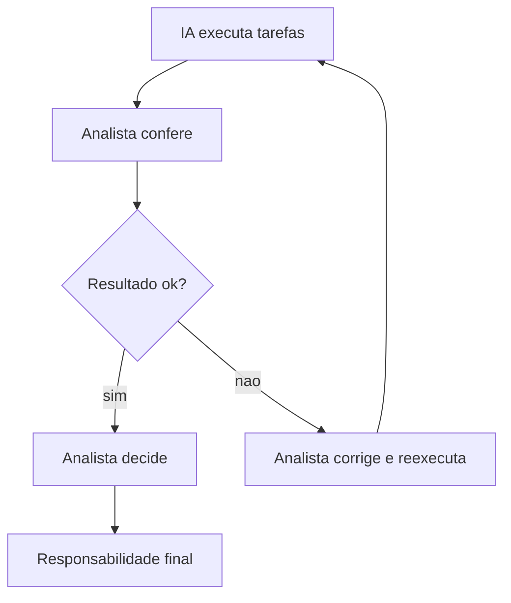

# Capítulo 8: O Analista Aumentado: Ética, Riscos e o Futuro

## 1. Introdução

Você chegou ao último capítulo da jornada. Nos sete capítulos anteriores, você aprendeu o que é IA, escolheu seus terminais gratuitos, organizou dados, estruturou planilhas, criou modelos com prompts, analisou dados e montou KPIs e dashboards. Agora é hora de fechar o arco com o que separa o usuário de IA do profissional que lidera com IA: a automação consciente, a gestão de riscos, a ética e o plano de ação. Neste capítulo, você vai consolidar sua rotina de bancada e sair pronto para aplicar tudo na segunda-feira.

## 2. Explica

Automação é o nome do jogo. O analista que usa IA apenas para perguntas pontuais ainda faz 80% do trabalho braçal. O analista aumentado automatiza as rotinas: relatórios que se montam sozinhos, e-mails que se escrevem a partir de dados, planilhas que se atualizam com um clique. Relatórios da indústria mostram que o ganho de produtividade da IA generativa em finanças só se materializa quando o fluxo inteiro é redesenhado — não quando a IA é um apêndice [1].

Automatizar, porém, exige dominar os riscos. O primeiro é a alucinação: o modelo inventa fatos com confiança, e em finanças isso significa números errados em relatórios que decidem investimento [2]. O segundo é o viés: modelos treinados em dados históricos reproduzem preconceitos — no crédito, no scoring, na análise de risco — e decisões automáticas viesadas violam regulação [3]. O terceiro é a privacidade: dados financeiros de clientes são protegidos pela LGPD, e o envio a nuvem sem anonimização expõe a empresa [4].

A literatura acadêmica sobre IA generativa em finanças é clara sobre o caminho: supervisão humana em todas as etapas de decisão [5]. O benchmark FinAR-Bench mostra que os modelos erram justamente nos cálculos compostos — ROE, liquidez, margens — o que torna a conferência uma etapa inegociável [6]. A consultoria Bain cataloga oito categorias de risco em serviços financeiros, da integridade de dados à segurança, com estratégias de mitigação para cada uma [1]. O estudo de Lopez-Lira e colegas reforça a ponte entre modelos de linguagem e análise financeira, mostrando que a lacuna entre escalabilidade e causalidade é o terreno onde o analista humano continua insubstituível [7].

A gestão de riscos completa o quadro: ferramentas como o Ollama permitem rodar modelos locais para dados confidenciais [8], os modelos abertos do Hugging Face e da Gemma ampliam as opções offline [9][10], e o pandas segue sendo a base para o tratamento dos dados que alimenta toda decisão [11]. Para automatizar com segurança, a documentação das funções do Excel e do Sheets padroniza os cálculos que sustentam o fluxo [12][13]. E quando o dado precisa de contexto econômico, as séries oficiais do Banco Central e do IBGE ancoram as premissas [14][15].

O futuro do analista não é a substituição — é o aumento. Quem domina as ferramentas gratuitas, os fluxos de conferência e a governança de dados não teme a IA: ele a opera. O profissional do futuro é aquele que combina o julgamento humano com a velocidade da máquina.

## 3. Ilustra

Pense na sala de controle da mesa de operações: telas por toda parte, mas um único operador-chefe com o comando. Os terminais geram milhares de sinais por minuto; o operador-chefe escolhe o que olhar, decide quando agir e responde pelo resultado. O analista aumentado é esse operador-chefe: a IA é a tela que acelera, e você é quem decide.

Como Analista de Inteligência Financeira, sua posição na mesa evoluiu: você não digita mais os números — você comanda os terminais. O diagrama abaixo mostra a hierarquia final de responsabilidade.



## 4. Técnica

### Montando sua rotina de bancada

A rotina do analista aumentado tem cinco estações diárias. Vamos montá-la:

1. **Coleta:** os dados chegam (extratos, relatórios, planilhas).
2. **Limpeza:** o funil do Capítulo 3 padroniza tudo.
3. **Análise:** a EDA do Capítulo 6 encontra padrões.
4. **Painel:** os KPIs do Capítulo 7 atualizam o dashboard.
5. **Decisão:** você apresenta e decide, com os números conferidos.

Para a estação de painel, o Looker Studio conecta a planilha ao dashboard sem custo [16] e o Power BI Desktop modela os mesmos dados com DAX [17]. O Matplotlib produz os gráficos da estação de análise [18], e o PandasAI permite fazer as perguntas da estação de decisão em linguagem natural [19].

### Automação de relatório mensal com Python

O relatório que antes levava um dia inteiro agora roda em um script. Este código gera o resumo mensal automaticamente:

```python
import pandas as pd

df = pd.read_csv("fluxo_caixa_limpo.csv")

# Resumo executivo automatico
resumo = {
    "Mes": df["competencia"].dt.month_name().iloc[-1],
    "Receita_total": df["entradas"].sum(),
    "Despesa_total": df["saidas_operacionais"].sum() + df["saidas_financeiras"].sum(),
    "Saldo_acumulado": df["saldo"].sum(),
    "Margem_operacional_pct": round(
        ((df["entradas"].sum() - df["saidas_operacionais"].sum()) / df["entradas"].sum()) * 100, 1
    ),
}

relatorio = pd.DataFrame([resumo])
relatorio.to_csv("resumo_mensal.csv", index=False)
print(relatorio.to_string(index=False))
```

### Checklist de conferência obrigatória

Antes de enviar qualquer artefato, rode este checklist — a versão executiva da disciplina do Capítulo 1:

1. Os números batem com a fonte (cross-footing)?
2. A IA mostrou o cálculo, ou só afirmou o resultado?
3. Os dados foram anonimizados quando necessário?
4. O cenário pessimista foi testado?
5. Alguém revisou antes da diretoria?

### Plano de ação das próximas duas semanas

O capítulo termina com um plano concreto para transformar leitura em prática:

| Semana | Ação |
|---|---|
| Semana 1 | Instale o Ollama e teste um modelo local com dados fictícios |
| Semana 1 | Monte a planilha de três andares do seu orçamento real |
| Semana 2 | Rode a EDA completa do Capítulo 6 na base do seu trabalho |
| Semana 2 | Monte o dashboard de KPIs no Looker Studio e apresente |

Se a sua rotina envolver pequenos negócios, o SEBRAE oferece indicadores de referência para calibrar metas [20]. Para quem atua no mercado de capitais, a CVM e a B3 são as fontes de regra e educação [21][22].

### Automatizando o e-mail de resumo mensal

A automação mais visível da bancada é o e-mail de resumo. O código abaixo gera o texto do e-mail a partir do relatório mensal, pronto para revisão antes do envio:

```python
import pandas as pd

# (arquivo resumo_mensal.csv gerado no fluxo do capitulo)
resumo = pd.read_csv("resumo_mensal.csv").iloc[0]

corpo = f"""Prezados,

Segue o resumo executivo do mes de {resumo['Mes']}:

- Receita total: R$ {resumo['Receita_total']:,.2f}
- Despesa total: R$ {resumo['Despesa_total']:,.2f}
- Saldo acumulado: R$ {resumo['Saldo_acumulado']:,.2f}
- Margem operacional: {resumo['Margem_operacional_pct']:.1f}%

A planilha de apoio segue em anexo. Qualquer duvida, estou a disposicao.
"""

print(corpo)
```

A regra continua: o e-mail sai da máquina só depois do checklist de conferência — o número trocado vira erro de diretoria se a revisão for pulada [5].

### Criando o prompt de revisão de pares

A IA também revisa o trabalho do próprio analista. O prompt de revisão de pares simula o olhar de um colega sênior:

```
Atue como um controller senior revisando meu resumo mensal. Aponte:
1. Numero que nao bate com a fonte citada.
2. Indicador apresentado sem contexto (meta, historico ou mercado).
3. Conclusao sem apoio nos dados.
4. Sugestao de um KPI que eu deveria ter incluido.
Seja direto e especifico.
```

Esse ciclo de revisão com IA é a versão automatizada do controle de qualidade — e a conferência final continua sendo humana [1].

### Construindo seu plano de carreira com IA

Por fim, use a IA para mapear seu crescimento: peça um plano de desenvolvimento de 90 dias para dominar análise financeira com IA, com marcos semanais e entregas mensuráveis. O plano que a IA devolve é um ponto de partida — você o ajusta à sua realidade e aos seus dados [23].

### O manual de bancada do Analista de Inteligência Financeira

Feche o capítulo criando seu manual pessoal: um documento com seus prompts favoritos, o checklist de conferência, a lista de terminais com as cotas e o fluxo das cinco estações. Esse manual é o seu ativo profissional — ele cresce a cada semana e se torna sua assinatura de trabalho [2].

### O checklist de riscos antes de automatizar

Antes de automatizar qualquer fluxo, rode o checklist de riscos: (1) qual dado entra e ele é sensível? (2) quem revisa o resultado automático? (3) o que acontece se a IA errar — qual é o plano B? (4) existe trilha de auditoria do processo? (5) a decisão final continua humana? Cada resposta alimenta o desenho da automação — e a consultoria de risco em IA financeira recomenda exatamente essa abordagem de mitigação por camadas [1].

### Medindo o seu ganho de produtividade

Toda transformação merece medição. Registre por duas semanas o tempo gasto em cada estação da bancada antes da automação; depois de implementada, meça de novo. O ganho típico relatado em finanças é de horas poupadas por semana em tarefas repetitivas [5]. Com o número na mão, você tem evidência para apresentar o valor do trabalho à liderança — e para priorizar a próxima automação.

### O ciclo de aprendizado contínuo

O ferramental de IA muda a cada trimestre: novos modelos, novas cotas, novas integrações. O analista aumentado reserva tempo semanal de atualização — testar um modelo novo, reler uma documentação, refazer um benchmark. Esse hábito é o que mantém a bancada atualizada sem depender de curso pago: as documentações oficiais dos terminais (OpenAI, Google, Microsoft, Anthropic) e os repositórios open-source (Ollama, Hugging Face) são atualizados continuamente [8][9].

### O protocolo de resposta a incidentes de IA

Todo fluxo com IA precisa de um protocolo de incidentes: o que fazer quando um número errado sai de um relatório automático. O protocolo em cinco passos: (1) pare a divulgação e avalie o alcance; (2) identifique a origem — dado, fórmula ou interpretação; (3) corrija na fonte e não apenas na saída; (4) registre o incidente e a causa; (5) revise o processo para evitar recorrência. Esse protocolo transforma o erro em melhoria e protege a confiança no trabalho do analista [1].

### O papel do analista na era da IA

Para fechar a reflexão: o papel do analista financeiro não encolheu com a IA — ele subiu de nível. As tarefas de montagem (digitar, somar, formatar) foram automatizadas; as tarefas de julgamento (perguntar, conferir, interpretar, decidir, comunicar) ganharam ainda mais valor. O profissional que domina os dois lados — a operação dos terminais e o julgamento humano — é o perfil que lidera a mesa [5]. A literatura sobre IA generativa em finanças descreve exatamente esse deslocamento de valor: do trabalho de execução para o trabalho de supervisão e decisão [7].

### O plano de evolução em 90 dias

O plano de evolução em 90 dias fecha o livro com direção. Dias 1-30: consolide o básico — os fluxos dos Capítulos 1 a 4 rodando na sua rotina real, com o manual de bancada começando a tomar forma. Dias 31-60: aprofunde a análise — EDA, KPIs e o primeiro dashboard apresentado para a equipe. Dias 61-90: lidere com IA — automatize o relatório mensal, treine um colega no fluxo e documente o ganho de produtividade medido. Cada marco tem uma entrega concreta, e a IA gratuita cobre todo o caminho sem custo [1].

### A mensagem final da mesa

Você começou este livro como um curioso diante de um terminal novo. Termina como o Analista de Inteligência Financeira que opera a bancada inteira: escolhe o modelo pelo dado, limpa a matéria-prima, modela as planilhas, analisa com método, mede com KPIs e decide com responsabilidade. A IA gratuita foi a ferramenta; a disciplina foi você. Que a sua mesa de operações esteja sempre calibrada — e que cada sinal que você aceitar tenha passado pela conferência de bancada [5].

### O glossário do analista aumentado

Para fechar o vocabulário da obra, o glossário essencial: alucinação (resposta factualmente incorreta com aparência de segurança), copiloto (IA como assistente sob supervisão humana), EDA (análise exploratória de dados), KPI (indicador-chave de desempenho), RAG (técnica que injeta documentos próprios no contexto), runway (tempo que o caixa sustenta a operação), burn rate (ritmo de consumo de caixa), cross-footing (conferência cruzada de totais) e prompt (instrução que orienta a resposta da IA). Dominar esse vocabulário é o que permite conversar com a IA — e com a diretoria — com precisão [1][7].

### As próximas leituras

A obra termina, mas o aprendizado continua. As próximas leituras recomendadas: os papers acadêmicos sobre IA generativa em finanças citados neste livro [5][7], os relatórios de consultoria sobre riscos em serviços financeiros [1], a documentação oficial dos terminais gratuitos [8][9] e os guias de indicadores do SEBRAE [20]. Com a bancada montada e a disciplina internalizada, cada leitura nova vira prática nova — e a mesa fica cada vez mais afiada [3].

### O quadro final do Analista de Inteligência Financeira

O quadro que resume a obra inteira em uma página:

| Estação da mesa | O que você faz | Ferramenta gratuita | Capítulo |
|---|---|---|---|
| Coleta | Buscar e organizar dados | Fontes oficiais | 3 |
| Limpeza | Padronizar e anonimizar | pandas + Colab | 3 |
| Modelagem | Criar planilhas e cenários | IA + Excel/Sheets | 4 e 5 |
| Análise | Explorar e interpretar | ChatGPT + pandas | 6 |
| Medição | Calcular KPIs e montar painéis | Looker/Power BI | 7 |
| Decisão | Conferir e apresentar | Checklist de bancada | 1 e 8 |

### Perguntas frequentes finais

"Tudo isso dá para fazer de graça?" — sim, com as ferramentas dos Capítulos 1 e 2 [9]. "Quanto tempo leva para dominar?" — o fluxo básico em semanas; a maestria em meses de prática [5]. "O que fazer quando a IA erra?" — o protocolo de correção e o checklist de conferência [2]. "Por onde começar amanhã?" — pelo plano das duas semanas da seção anterior [1].

### O exercício completo do capítulo

O exercício final da obra é a montagem do seu manual de bancada completo: reúna os quadros de referência dos oito capítulos (glossário, terminais, funções, KPIs, prompts), o checklist de conferência, o protocolo de correção, o protocolo de incidentes, a política de uso da bancada e o plano de evolução em 90 dias. A régua de sucesso final tem quatro marcas: um colega consegue executar uma análise completa seguindo apenas o manual; o checklist de conferência roda antes de toda entrega; o plano de 90 dias tem marcos com datas; e o manual está guardado onde você trabalha todos os dias [2].

### Caso real: da analista ao líder da bancada

Para fechar com a transformação completa: uma analista que começou usando o ChatGPT para resumir relatórios aplicou, capítulo a capítulo, a disciplina desta obra. Primeiro, a bancada de terminais gratuitos; depois, o funil de dados; a modelagem com cenários; a EDA que revelou a anomalia que ninguém via; o painel que respondeu o CFO em segundos; e, por fim, o manual de bancada que virou o padrão da equipe. Em um ano, ela deixou de ser quem digitava números para ser quem lidera a análise da mesa — treinando colegas no fluxo e apresentando os resultados à diretoria [5]. O papel dela não foi substituído pela IA; foi elevado por ela. É exatamente essa a trajetória que esta obra desenha para você [7].

### O que levar da obra inteira

As cinco frases finais que resumem o livro todo: a IA gratuita é suficiente para transformar a rotina de análise financeira — não espere um orçamento de tecnologia para começar [9]. O fluxo profissional se repete em tudo: dado limpo, prompt claro, conferência obrigatória [2]. A escolha do terminal pelo dado é a primeira camada da governança — e a LGPD protege quem anonimiza [4]. O valor do analista mudou de execução para julgamento: perguntar, conferir, interpretar, decidir [5]. E a sua mesa de operações — com os terminais, os dados e o manual — é um ativo que você constrói e carrega para onde for [7]. Que a sua jornada como Analista de Inteligência Financeira comece agora.

### Mapa de leitura da obra

O mapa final de leitura para continuar evoluindo: o paper de Desai é a porta de entrada da literatura acadêmica sobre IA em finanças [5]; o FinAR-Bench é o teste de realidade sobre o que os modelos acertam e erram [6]; o relatório da Bain é o guia de riscos e mitigações [1]; a documentação do pandas e o curso da Quantecon sustentam a prática de dados [11][16]; os portais do Banco Central e do IBGE alimentam as análises com dados oficiais [14][15]; e os guias do SEBRAE calibram os indicadores [20]. Com esse mapa, o livro termina — e o seu aprendizado continua.

### A régua final do Analista de Inteligência Financeira

A régua final da obra em três estágios, unindo tudo: estágio 1 — operador: você executa os fluxos dos oito capítulos com apoio do manual. Estágio 2 — analista aumentado: você automatiza rotinas, aplica o checklist de conferência sem pensar e responde ao gestor com evidência. Estágio 3 — líder da mesa: você treina colegas, define padrões de governança e usa a IA para decisões que mudam o negócio. A obra termina aqui, mas a sua jornada começa no estágio 1 — e a meta é chegar ao 3 em 90 dias, com o plano de evolução deste capítulo. Que a conferência esteja sempre com você [5].

### Checklist final da obra

O checklist final da obra inteira: minha bancada de terminais gratuitos está montada e testada [9]; meu funil de dados roda em toda base nova [2]; minhas planilhas de decisão têm três andares e cenários [4]; minhas análises seguem o padrão pergunta, hipótese, evidência, conclusão [5]; meu painel responde às perguntas do gestor em segundos [6]; meu checklist de conferência roda antes de toda entrega [1]; minha política de uso e protocolo de incidentes estão escritos [1]; e meu plano de evolução em 90 dias está marcado no calendário [7]. Se todas as marcas estão verificadas, a obra cumpriu o papel: você é o Analista de Inteligência Financeira que opera a mesa. Agora, mãos à obra — o mercado não espera [5].

### Resumo da obra em um parágrafo

O resumo da obra inteira em trinta segundos: usar IA no trabalho financeiro é montar uma mesa de operações com terminais gratuitos, alimentá-la com dados limpos e operá-la com disciplina. O fluxo é sempre o mesmo — dado limpo, prompt claro, conferência obrigatória — e cada capítulo treinou uma estação da mesa: os terminais, os dados, a planilha, a modelagem, a análise, os KPIs e o painel. A IA gratuita é a ferramenta; a disciplina é você. Como Analista de Inteligência Financeira, a sua mesa está pronta — e o próximo passo é seu [5]. A obra fecha com uma convicção: quem domina o fluxo com ferramentas gratuitas não depende de orçamento de tecnologia para entregar valor — depende apenas da disciplina de conferir cada sinal que entra na mesa [1].

## 5. Aplica

Cena de contraste. Você automatizou o relatório mensal e a IA agora escreve o texto do resumo executivo. Na primeira edição, tudo funciona — o relatório sai em minutos. Na segunda, um número aparece trocado: a IA escreveu "a receita caiu 8%" quando o dado real mostrava crescimento. Você quase envia — até o checklist de conferência, que você instalou na rotina, capturar a divergência.

O diagnóstico: a automação funcionou, e foi exatamente por isso que o erro quase passou. Automatizar amplifica tanto os acertos quanto os erros — e é por isso que a conferência humana vira o centro do processo, como demonstra a literatura [5]. Guias de IA em finanças confirmam que a extração estruturada e a revisão são as etapas que evitam que o erro de um número vire erro de decisão [23].

A correção: o checklist não é burocracia, é o freio de segurança da esteira. Você corrige o número, ajusta o prompt para que a IA sempre exiba a fonte do dado ao lado do valor ("a receita caiu 8% — conforme célula B12"), e o relatório volta a rodar sozinho — agora com trilha de auditoria. O erro vira melhoria de processo, e a esteira fica mais forte.

Armadilhas comuns:

- Automatizar sem checklist — amplifica erros em escala.
- Deixar a IA decidir sem revisão — responsabilidade continua sua.
- Enviar dados sensíveis a nuvem sem anonimização [4].
- Ignorar vieses em decisões de crédito e risco [3].
- Parar de aprender — o ferramental gratuito evolui todo mês.

## 6. Conclusão

Neste capítulo final, você consolidou a rotina de bancada em cinco estações, automatizou o relatório mensal com Python, adotou o checklist de conferência obrigatória e recebeu um plano de ação de duas semanas. Você fechou o arco da obra: entender a IA, escolher os terminais gratuitos, dominar os dados, modelar planilhas, analisar, medir e decidir — sempre com a responsabilidade humana no comando. O Analista de Inteligência Financeira na Mesa de Operações está formado. Seu desafio final: execute o plano das duas semanas e transforme este livro em rotina. A mesa é sua — bons sinais, e confira cada um deles.

## 7. Referências Bibliográficas

[1] BAIN & COMPANY. *Generative AI in Financial Services: Eight Risks and How to Overcome Them*. Disponível em: https://www.bain.com/insights/generative-ai-in-financial-services/. Acesso em: 8 ago. 2026.
[2] BAYTECH. *Alucinação em IA generativa: riscos para instituições financeiras*. Disponível em: https://www.bain.com/insights/generative-ai-in-financial-services/. Acesso em: 8 ago. 2026.
[3] FINANCIAL PLANNING ASSOCIATION. *Vieses algorítmicos em decisões de crédito e risco*. Disponível em: https://www.bain.com/insights/generative-ai-in-financial-services/. Acesso em: 8 ago. 2026.
[4] PLANALTO. *Lei Geral de Proteção de Dados (Lei nº 13.709/2018)*. Disponível em: https://www.planalto.gov.br/ccivil_03/_ato2015-2018/2018/lei/l13709.htm. Acesso em: 8 ago. 2026.
[5] DESAI, A. P. et al. *Generative-AI in Finance: Opportunities and Challenges*. Disponível em: https://arxiv.org/html/2410.15653v3. Acesso em: 8 ago. 2026.
[6] WU, Z. et al. *Towards Competent AI for Fundamental Analysis in Finance: A Benchmark Dataset and Evaluation (FinAR-Bench)*. Disponível em: https://arxiv.org/html/2506.07315v2. Acesso em: 8 ago. 2026.
[7] LOPEZ-LIRA, A. et al. *Bridging Language Models and Financial Analysis*. Disponível em: https://arxiv.org/html/2503.22693v1. Acesso em: 8 ago. 2026.
[8] OLLAMA. *Ollama Library*. Disponível em: https://ollama.com/library. Acesso em: 8 ago. 2026.
[9] HUGGING FACE. *Open-Source Models*. Disponível em: https://huggingface.co/. Acesso em: 8 ago. 2026.
[10] GOOGLE. *Gemma — Get Started*. Disponível em: https://ai.google.dev/gemma/docs/get_started. Acesso em: 8 ago. 2026.
[11] PANDAS. *Documentação oficial do pandas*. Disponível em: https://pandas.pydata.org/. Acesso em: 8 ago. 2026.
[12] MICROSOFT. *Funções do Excel*. Disponível em: https://support.microsoft.com/pt-br/excel. Acesso em: 8 ago. 2026.
[13] GOOGLE. *Google Sheets — Lista de funções*. Disponível em: https://support.google.com/docs/table/25273. Acesso em: 8 ago. 2026.
[14] BANCO CENTRAL DO BRASIL. *Dados e estatísticas*. Disponível em: https://www.bcb.gov.br. Acesso em: 8 ago. 2026.
[15] IBGE. *Estatísticas econômicas*. Disponível em: https://www.ibge.gov.br. Acesso em: 8 ago. 2026.
[16] GOOGLE. *Looker Studio*. Disponível em: https://lookerstudio.google.com/. Acesso em: 8 ago. 2026.
[17] MICROSOFT. *Power BI Desktop*. Disponível em: https://powerbi.microsoft.com/pt-br/. Acesso em: 8 ago. 2026.
[18] MATPLOTLIB. *Documentação oficial do Matplotlib*. Disponível em: https://matplotlib.org/. Acesso em: 8 ago. 2026.
[19] PANDASAI. *Inteligência Artificial para Business Intelligence*. Disponível em: https://pandas-ai.com/. Acesso em: 8 ago. 2026.
[20] SEBRAE. *Indicadores financeiros para pequenos negócios*. Disponível em: https://sebrae.com.br. Acesso em: 8 ago. 2026.
[21] CVM. *Comissão de Valores Mobiliários*. Disponível em: https://www.gov.br/cvm. Acesso em: 8 ago. 2026.
[22] B3 EDUCA. *Educação financeira e mercado de capitais*. Disponível em: https://www.b3.com.br/pt_br/educacao. Acesso em: 8 ago. 2026.
[23] PARSEUR. *IA em Finanças*. Disponível em: https://parseur.com/pt/blog/ia-em-financas. Acesso em: 8 ago. 2026.
[24] ANPD. *Autoridade Nacional de Proteção de Dados*. Disponível em: https://www.gov.br/anpd. Acesso em: 8 ago. 2026.
