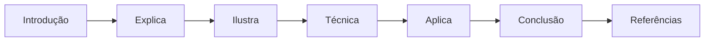
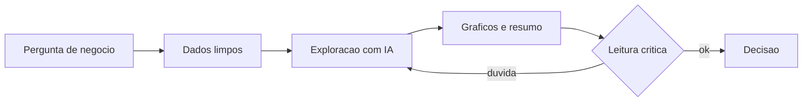
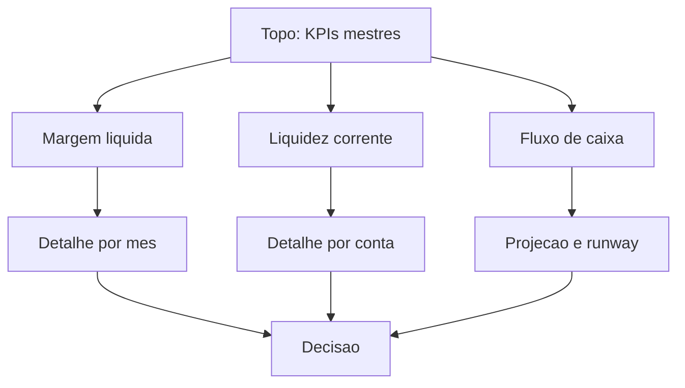
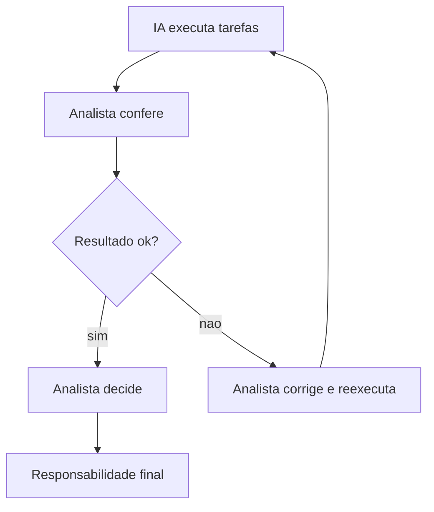

# Na Prática: A IA na Bancada

# Como Este Livro Foi Escrito: A Metodologia EITA

Todo capítulo deste livro segue a metodologia **EITA** — um framework pedagógico de 7 seções projetado para transformar o leitor de "não sei" para "consigo fazer" em cada tema abordado.

## As 7 Seções do EITA

### 1. INTRODUÇÃO
Contextualiza o tema. Explica o que será abordado, por que importa, e o que você será capaz ao final. Uma ponte conecta com o capítulo anterior (quando houver).

### 2. EXPLICA
Desconstrói o conceito: causa raiz, mecânica subjacente, definições precisas. Você passa de "não sei o que é" para "sei definir e explicar".

### 3. ILUSTRA
Uma analogia concreta ancora o conceito na sua intuição — sempre acompanhada de um diagrama visual que torna o abstrato tangível. Você passa de "parece abstrato" para "faz sentido".

### 4. TÉCNICA
O núcleo de valor: código executável, arquiteturas, passo a passo de implementação. É aqui você ganha as mãos para fazer. Você passa de "não sei fazer" para "consigo implementar".

### 5. APLICA
Contextualização em cenário real: onde aquilo se aplica no mercado, armadilhas comuns e como evitá-las. Você passa de "isso é teórico" para "vou usar no trabalho".

### 6. CONCLUSÃO
Síntese dos 3 pontos principais, conexão com o próximo capítulo e um desafio opcional para fixar o aprendizado.

### 7. REFERÊNCIAS BIBLIOGRÁFICAS
Fontes citadas no capítulo, em formato ABNT numerado. Toda afirmação factual tem sua referência.

## Por Que Funciona

O EITA não é uma lista de tópicos — é uma **jornada de transformação**. Cada seção leva o leitor a um estado mental diferente:

```
Introdução → "Quero aprender"
Explica     → "Entendi a teoria"
Ilustra     → "Faz sentido na prática"
Técnica     → "Consigo fazer"
Aplica      → "Vou usar no trabalho"
Conclusão   → "Dominei este tema"
```

## Diagrama do Fluxo EITA



## Dica de Leitura

Você pode ler os capítulos em ordem (recomendado para iniciantes) ou pular diretamente para o tema de interesse. Cada capítulo é autocontido, mas a sequência cria conexões que ampliam o aprendizado.

---

*A metodologia EITA é uma criação da Fábrica Agêntica de Livros, projetada para produzir literatura técnica que transforma leitores em profissionais.*


# Capítulo 5: Criando Planilhas com IA

## 1. Introdução

No Capítulo 4, você estruturou sua bancada de planilhas com a arquitetura de três andares e aprendeu a gerar fórmulas com IA. Agora vamos ao nível profissional: criar planilhas completas — do zero — usando prompts bem desenhados. Este é o capítulo em que a IA deixa de ser um tradutor de fórmulas e vira uma modeladora financeira ao seu lado. Você vai aprender os prompts que funcionam, o fluxo de validação que protege o resultado e a arte de transformar um pedido vago em uma planilha de orçamento, fluxo de caixa ou DRE pronta para uso.

## 2. Explica

O segredo de uma planilha criada por IA não está no modelo — está no prompt. Modelos gratuitos como ChatGPT, Gemini e Copilot respondem com excelência quando a instrução especifica arquitetura, escopo e formato [1]. A diferença entre um pedido ruim ("cria uma planilha de custos") e um pedido profissional está em quatro elementos: o papel que o modelo deve assumir, a estrutura que ele deve seguir, as regras de cálculo que ele deve respeitar e o formato da entrega.

O primeiro elemento é o papel. Ao instruir "atue como um modelador financeiro sênior", você ativa um repertório de boas práticas que o modelo aprendeu de milhares de planilhas profissionais. O segundo é a arquitetura — as abas, colunas e premissas —, que você aprendeu no Capítulo 4. O terceiro são as regras de cálculo: definições de margem, critérios de reconhecimento de receita, bases de rateio. O quarto é o formato: tabelas, fórmulas ou instruções de montagem.

Os assistentes gratuitos têm integração direta com planilhas: o ChatGPT oferece um complemento oficial para Excel e Google Sheets [2], o Copilot opera dentro do próprio Excel com comandos em linguagem natural [3] e o Gemini organiza planilhas no ecossistema Google [4]. Isso significa que o fluxo completo — pedir, gerar, validar e corrigir — pode acontecer sem sair da sua bancada.

A validação continua sendo o ato central. Estudos sobre IA generativa em finanças demonstram que modelos erram justamente em cadeias de cálculo encadeadas, como as de um DRE [5]. A prática profissional, portanto, é sempre a mesma: a IA propõe, você confere, e a conferência segue roteiro — fórmulas visíveis, totais cruzados e cenários testados. A documentação do Excel detalha as funções e referências que sustentam esses roteiros [6], e guias brasileiros reúnem as ferramentas de IA para planilhas mais usadas no mercado [7]. Quando a planilha não dá conta, o pandas assume a modelagem em Python [8] e o Google Colab roda tudo no navegador [9].

## 3. Ilustra

Na mesa de operações, quando um novo relatório precisa nascer, o analista não sai digitando. Ele desenha o painel antes: define os indicadores, as fontes, o formato e só então monta. A IA gratuita funciona do mesmo jeito: ela é excelente montadora, mas precisa do desenho. O prompt é o desenho da planilha — quanto mais claro o rascunho, mais fiel a montagem.

Como Analista de Inteligência Financeira, você vai desenvolver o hábito de rascunhar antes de pedir: escrever as abas, as colunas e as regras em duas ou três frases, e só então pedir a planilha. O diagrama abaixo mostra o fluxo completo de criação com IA.


## 4. Técnica

### O prompt mestre de modelagem

Este é o prompt que você vai adaptar para qualquer planilha financeira. Copie, cole e ajuste os campos entre colchetes:

```
Atue como um modelador financeiro sênior. Antes de gerar qualquer fórmula,
descreva a arquitetura da planilha de [tipo de controle, ex.: orçamento
mensal] que vou construir no Excel. Inclua:
1. As abas necessárias e a função de cada uma.
2. As colunas e linhas de cada aba.
3. As premissas que devem ficar separadas das fórmulas.
4. As regras de cálculo (ex.: margem = receita - custo variável).
Depois de eu aprovar a arquitetura, gere as fórmulas uma por uma,
explicando o que cada uma faz. Não pule etapas.
```

### Construindo o DRE gerado por IA

Aplicando o prompt mestre, o fluxo para montar um DRE de três linhas funciona assim:

1. Peça a arquitetura do DRE: abas de premissas, entradas e relatório.
2. Aprove a estrutura proposta.
3. Peça as fórmulas de análise vertical (cada linha como porcentagem da receita) e horizontal (variação entre períodos).
4. Confira cada resultado com a calculadora e com os totais do Capítulo 3.

Um resultado típico de fórmula de análise vertical gerada por IA:

```
=C2/$B$2
```

Essa fórmula divide a linha C (despesa) pela receita travada em B2, produzindo a participação percentual — e a referência absoluta ($) permite arrastar a fórmula sem corromper o denominador.

### O ciclo de correção dirigida

Quando a planilha gerada tem um erro, não reinicie do zero — corrija com precisão cirúrgica:

```
Prompt: A fórmula da célula F12 do DRE está retornando #VALOR!.
Explique a cadeia de fórmulas que alimenta F12, identifique a causa
mais provável e proponha a correção mínima, sem alterar as demais células.
```

Esse prompt transforma a IA em auditora: ela rastreia a dependência, diagnostica (tipicamente referência a texto ou intervalo vazio) e devolve a correção mínima. Ferramentas dedicadas de conversão de texto em fórmula funcionam no mesmo espírito para quem quer respostas pontuais [7]. Para conferência rápida de qualquer função na bancada, o ExcelJet é a referência de consulta [10].

### Automação de relatórios recorrentes

A última técnica do capítulo: transformar a planilha em relatório automático. Com o complemento de IA no Excel/Sheets, você descreve o relatório desejado e ele monta a estrutura; depois, ao trocar os dados do mês, as fórmulas recalculam tudo. Para automações mais sofisticadas, conectores como o Looker Studio puxam a planilha e geram dashboards que se atualizam sozinhos [11], e o Power BI Desktop modela os mesmos dados com Power Query e DAX sem custo [12]. Para previsões sobre o histórico da planilha, o Prophet gera projeções de séries temporais em poucas linhas [13].

### O prompt de análise de sensibilidade

A análise de sensibilidade é o que separa uma planilha decorativa de uma ferramenta de decisão. O prompt abaixo automatiza a criação das variações:

```
Na planilha de orcamento, crie uma aba de cenarios com tres colunas:
realista (premissa atual), otimista (+15% na receita) e pessimista
(-15% na receita). Referencie sempre as celulas de premissa da aba
principal — nunca valores fixos. Explique como navegar entre cenarios.
```

O resultado: cada cenário referencia as mesmas premissas, e a planilha inteira recalcula ao mudar uma célula. Esse é o padrão profissional de modelagem — premissas únicas, cenários múltiplos [14].

### Gerando o fluxo de caixa projetado

Com as premissas e cenários prontos, o próximo passo é o fluxo projetado. O prompt pede o encadeamento entre receita prevista, custos variáveis (percentual da receita) e custos fixos (valor absoluto):

```
Gere a formula da coluna de custo variavel projetado para cada mes,
considerando que o custo variavel e 38% da receita do mes e a receita
cresce 2% ao mes a partir da premissa da aba principal.
```

A IA devolve a fórmula com referências mistas (absolutas na taxa, relativas nos meses) — exatamente o padrão que você conferiu no Capítulo 4 [6].

### Validando o DRE com análise horizontal

A análise horizontal compara cada conta do DRE entre períodos. Prompt de validação:

```
Na aba do DRE, adicione a variacao percentual de cada linha entre o
ano 1 e o ano 2 (ano 2 dividido por ano 1 menos 1). Aponte as cinco
maiores variacoes e explique o que elas indicam.
```

Além de gerar as fórmulas, a IA interpreta o resultado — mas a interpretação final é sua, apoiada nos dados do Capítulo 3 [8].

### Automação com conectores de dados

Quando a planilha vive no Google Sheets, os conectores do Looker Studio puxam os dados automaticamente e atualizam o dashboard sem intervenção [11]. No ecossistema Microsoft, o Power BI Desktop importa a pasta de trabalho e recria o modelo com Power Query [12]. A automação de relatório recorrente — o mesmo painel, os dados novos — é a meta da bancada.

### A biblioteca de prompts do analista

Todo analista que usa IA de forma profissional mantém uma biblioteca de prompts reutilizáveis — o equivalente digital da caixa de ferramentas da mesa. Ela começa com os cinco prompts deste capítulo (arquitetura, fórmulas, correção, sensibilidade, fluxo projetado) e cresce com cada tarefa nova resolvida. A estrutura de cada entrada: objetivo, prompt completo, saída esperada e lição aprendida. Essa biblioteca é um ativo pessoal — ela compra a sua velocidade e a sua consistência [14].

### Erro de arredondamento e conferência de centavos

Na modelagem financeira, centavos importam. O erro clássico: totais que parecem bater, mas divergem em alguns centavos por arredondamento acumulado. A técnica de conferência: compare o total por fórmula com o total por soma manual de uma amostra; se houver diferença de centavos, verifique arredondamentos e formatação de casas decimais. A IA ajuda a diagnosticar: cole as duas fórmulas e peça para explicar a diferença — ela rastreia a cadeia e aponta onde o arredondamento ocorreu [6].

### Protegendo fórmulas e premissas

Uma planilha modelada por IA também precisa de proteção: trave as células de fórmula, proteja a aba de premissas contra edição acidental e mantenha uma versão de backup antes de cada mudança estrutural. Quando a planilha vira ferramenta da equipe, essa proteção é o que impede que um ajuste manual quebre o modelo inteiro sem ninguém perceber [15].

### Modelando o ponto de equilíbrio

Um dos modelos mais úteis que a IA constrói em minutos é o ponto de equilíbrio: o nível de receita em que a empresa cobre todos os custos. O prompt:

```
Monte o modelo de ponto de equilibrio com base nas premissas: custo
fixo mensal 40 mil, margem de contribuicao 45% da receita. Calcule a
receita de equilibrio, mostre a formula e crie um grafico simples de
custos x receita x lucro para receitas de 50 a 150 mil.
```

O modelo resultante responde a pergunta mais frequente de qualquer gestor: quanto preciso faturar para não perder dinheiro? E a análise de sensibilidade mostra o que muda se a margem cair [14].

### Comparando cenários com tabela de sensibilidade

A tabela de sensibilidade de duas variáveis mostra o lucro sob diferentes combinações de receita e margem. No Excel, a Tabela de Dados (Dados > Análise de hipóteses > Tabela de dados) preenche a matriz automaticamente; no Sheets, a fórmula de matriz resolve. Peça à IA para estruturar a tabela com os cabeçalhos e as fórmulas, e confira as bordas da matriz com a calculadora — o interior da tabela é cálculo repetido, exatamente onde a IA pode errar sem ser notada [5].

### O modelo de projeção de vendas

Um modelo clássico que une tudo: a projeção de vendas com três cenários. As premissas ficam em uma aba (crescimento otimista 5%, realista 2%, pessimista -3%); a receita projeta-se mês a mês a partir da última receita conhecida; e os custos variáveis seguem um percentual fixo da receita. A IA monta o modelo inteiro a partir do prompt, mas a definição das premissas — o coração do modelo — é decisão sua, ancorada no histórico e no mercado [14]. Depois de montado, a conferência de bancada: o mês 1 da projeção deve bater com o último mês real.

### Documentando o modelo para a equipe

Um modelo sem documentação é um passivo. O padrão de documentação: uma aba Instruções no topo da planilha com a finalidade, as premissas, a periodicidade e quem mantém; e um README no arquivo descrevendo o fluxo de atualização. A IA redige os dois em minutos a partir das suas anotações — e a equipe herda um ativo, não um mistério [6].

### O modelo de precificação

Um dos modelos mais valiosos que a IA ajuda a montar é o de precificação: quanto cobrar pelo produto ou serviço. O ponto de partida é o custo total por unidade (materiais, mão de obra, rateio de custos fixos); a margem alvo define o preço mínimo; e o preço de mercado calibra o teto. O prompt pede a estrutura completa com os três níveis — custo, margem e mercado — e a análise de sensibilidade mostra o lucro em cada combinação de preço e volume. Esse modelo responde a pergunta estratégica mais frequente do negócio e depende de premissas suas, conferidas com a área comercial [14].

### Versionando o modelo: o controle de versão da planilha

Modelos evoluem — e cada versão precisa de controle. O padrão: nome do arquivo com data e versão (`orcamento_2026_v1.xlsx`), registro de mudanças na aba Instruções e backup antes de cada alteração estrutural. Quando a planilha roda uma decisão, saber exatamente qual versão a embasou é exigência de auditoria [15].

### O quadro dos prompts do modelador

O quadro que reúne os prompts deste capítulo para o manual:

| Prompt | Uso | Resultado esperado |
|---|---|---|
| Prompt mestre | Arquitetura da planilha | Abas, colunas e premissas |
| Text-to-formula | Fórmula por descrição | Expressão pronta para colar |
| Correção dirigida | Erro em célula específica | Diagnóstico e correção mínima |
| Sensibilidade | Cenários e variações | Aba de cenários referenciada |
| Fluxo projetado | Projeção encadeada | Coluna de previsão por mês |
| Ponto de equilíbrio | Nível de receita zero-lucro | Modelo + gráfico |

### Perguntas frequentes sobre modelagem

"A IA modela melhor que um analista?" — ela modela mais rápido; a qualidade das premissas é sua [14]. "Posso pedir a planilha inteira de uma vez?" — pode, mas a qualidade cai; o fluxo em blocos com conferência é o padrão profissional [8]. "Como sei se o modelo está bom?" — teste cenários extremos; um bom modelo responde sem quebrar [5]. "E se a IA corrigir algo que eu não pedi?" — é o momento de aplicar o controle de versão e reverter [15].

### O exercício completo do capítulo

O exercício que fecha o capítulo é a modelagem completa de um orçamento com três cenários: aplique o prompt mestre para arquitetar; gere as fórmulas em blocos conferindo cada uma; monte a aba de cenários (otimista, realista, pessimista) referenciando as premissas; e documente o modelo com a aba Instruções. A régua de sucesso tem quatro marcas: mudar uma premissa recalcula os três cenários; o teste de ponto de equilíbrio responde; a documentação permite a um colega atualizar o modelo; e o arquivo versionado guarda o histórico das mudanças [14][15].

### Caso real: a reunião em que o orçamento respondeu

Uma cena que marca: na reunião de orçamento, o diretor fez a pergunta clássica — "e se reduzirmos o marketing em 20%?" — e, em vez do silêncio constrangedor, o analista respondeu em segundos: mudou a premissa de marketing, e o impacto no resultado apareceu na tela, com os três cenários recalculados [14]. A diferença não foi sorte: foi o prompt mestre aplicado na montagem (arquitetura antes das fórmulas) e a disciplina de cenários referenciados a premissas. O diretor, impressionado, pediu o modelo para a equipe toda. É exatamente esse o poder que a modelagem com IA e arquitetura entrega — e o caminho para ele está nos exercícios deste capítulo [8].

### O que levar deste capítulo para a sua rotina

As cinco frases do capítulo para o manual: o prompt mestre é arquitetura antes de fórmula — papel, estrutura, regras e formato [1]. Fórmula nasce por descrição e morre por falta de conferência [5]. Correção dirigida: aponte a célula, peça a cadeia, corrija o mínimo [5]. Cenários referenciam premissas; a sensibilidade é uma premissa de distância [14]. E o modelo documentado é ativo; o modelo misterioso é passivo [6]. Com essas cinco, você modela como um profissional.

### Mapa de leitura do capítulo

Para aprofundar modelagem: a central de ajuda do ChatGPT para planilhas explica o complemento que acelera o fluxo de criação [1]; o relatório da Bain mostra os riscos de automatizar sem governança [14]; o FinAR-Bench explica por que as cadeias de cálculo encadeadas são o ponto fraco dos modelos [5]; a documentação do Looker Studio mostra como o modelo vira dashboard [11]; e o Power BI Desktop cobre a modelagem com Power Query e DAX [12]. Cada leitura conecta a modelagem à entrega — e o seu fluxo fica completo.

### A régua de progresso do modelador

A régua da modelagem em três estágios: estágio 1 — executor: você pede a planilha pronta e usa como veio. Estágio 2 — projetista: você rascunha a arquitetura, gera em blocos e confere cada fórmula. Estágio 3 — estrategista: você projeta modelos com cenários para decisões, documenta para a equipe e ensina o prompt mestre. O salto do 1 para o 2 é o mais transformador — é ele que faz o "e se?" do gestor ser respondido em segundos; o salto para o 3 consolida a sua posição como referência de modelagem [14].

### Checklist de conclusão do capítulo

O checklist final do Capítulo 5: domino o prompt mestre de arquitetura [1]; gero fórmulas por descrição em linguagem natural [1]; aplico a correção dirigida quando uma célula falha [5]; monto cenários referenciados a premissas [14]; calculei o ponto de equilíbrio de um modelo [14]; documentei o modelo com a aba Instruções [6]; e versionei o arquivo com data e versão [15]. Com todas as marcas, você modela planilhas de decisão como um profissional — e o próximo capítulo vai transformar dados em leitura de negócio.

### Resumo do capítulo em um parágrafo

Se você precisasse explicar o Capítulo 5 a um colega em trinta segundos, diria: a IA não modela sozinha — ela executa o projeto que você desenha. A modelagem com IA gratuito entrega velocidade, mas é a sua arquitetura que garante qualidade: sem o rascunho das abas e das premissas, a planilha nasce desorganizada e o modelo vira passivo. Com o fluxo do prompt mestre, a planilha vira ferramenta de decisão — e o analista, referência da mesa. O fluxo profissional é rascunhar a arquitetura (papel, abas, premissas, regras), pedir as fórmulas em blocos, conferir cada resultado e corrigir com precisão cirúrgica. O diferencial não é o modelo, é o prompt mestre — e a disciplina de cenários referenciados a premissas, que transforma qualquer "e se?" do gestor em resposta de segundos [14]. Esse é o parágrafo que resume a modelagem com IA. A próxima estação da mesa — a análise de dados — vai transformar as planilhas modeladas em leituras de negócio.

## 5. Aplica

Cena de contraste. Você precisa criar o orçamento do próximo ano para apresentar à diretoria. Decide usar IA e digita: "monta um orçamento aí". A IA devolve uma planilha única, sem premissas separadas, com fórmulas como SOMA(40000+35000+...) e sem nenhum cenário. Você apresenta, e o CFO pergunta: "qual o impacto de reduzirmos 5% do marketing?" — silêncio na sala, porque o orçamento não tem nem entrada editável nem cálculo de cenário.

O diagnóstico: o prompt vago gerou uma planilha vaga. A IA entregou exatamente o que foi pedido — nenhum modelo consegue adivinhar que você queria cenários, premissas separadas e análise de sensibilidade [14]. O erro foi de desenho, não de ferramenta. Se a planilha carregar dados pessoais, vale lembrar a camada de proteção: anonimize antes de subir à nuvem, como exige a LGPD [15], seguindo as orientações da Autoridade Nacional de Proteção de Dados [16].

A correção: aplicar o prompt mestre. Antes de pedir fórmulas, você rascunha a arquitetura com as abas de premissas, o painel de saídas e as regras de cálculo. Depois de aprovar, pede as fórmulas em blocos, conferindo cada uma. Quando o CFO perguntar sobre os 5%, você muda uma célula de premissa e o cenário inteiro recalcula — o "e se" que antes travava a reunião vira resposta em segundos.

Armadilhas comuns:

- Pedir a planilha completa em um único prompt, sem arquitetura.
- Não definir as regras de cálculo — a IA inventa critérios.
- Usar fórmulas com valores embutidos, matando a análise de sensibilidade.
- Não testar cenários antes da apresentação.
- Confiar no total gerado sem conferir com os números-fonte do Capítulo 3.
- Ignorar os indicadores de referência do mercado — cruze com séries do Banco Central [17] e do IBGE [18] quando a análise envolver cenário econômico.

## 6. Conclusão

Você dominou o ciclo profissional de criação de planilhas com IA: rascunhar a arquitetura, pedir com papel e regras, gerar em blocos, conferir e corrigir com precisão cirúrgica. Sua bancada agora produz orçamentos, fluxos e DREs que respondem a cenários — a marca de quem modela, e não de quem apenas digita. Para quem quer aprofundar a matemática por trás dos cálculos, o NumPy oferece o repertório numérico [19], e o curso de pandas da Quantecon exercita a modelagem em Python [20]. Desafio: monte um orçamento de três cenários (otimista, realista, pessimista) usando o prompt mestre, com uma única premissa editável controlando os três. No próximo capítulo, vamos analisar dados — não apenas organizá-los — usando IA para descobrir padrões, tendências e anomalias.

## 7. Referências Bibliográficas

[1] OPENAI. *Central de Ajuda: ChatGPT para Excel e Google Sheets*. Disponível em: https://help.openai.com/pt-br/articles/20001063-chatgpt-for-excel-and-google-sheets. Acesso em: 8 ago. 2026.
[2] OPENAI. *ChatGPT — Pricing & Info*. Disponível em: https://chatgpt.com/pricing/. Acesso em: 8 ago. 2026.
[3] MICROSOFT. *Copilot no Excel*. Disponível em: https://support.microsoft.com/pt-br/copilot. Acesso em: 8 ago. 2026.
[4] GOOGLE. *Gemini Apps*. Disponível em: https://gemini.google.com/. Acesso em: 8 ago. 2026.
[5] WU, Z. et al. *Towards Competent AI for Fundamental Analysis in Finance: A Benchmark Dataset and Evaluation (FinAR-Bench)*. Disponível em: https://arxiv.org/html/2506.07315v2. Acesso em: 8 ago. 2026.
[6] MICROSOFT. *Funções do Excel*. Disponível em: https://support.microsoft.com/pt-br/excel. Acesso em: 8 ago. 2026.
[7] HASHTAG TREINAMENTOS. *Melhores ferramentas de IA para planilhas*. Disponível em: https://www.hashtagtreinamentos.com/ia-para-planilhas. Acesso em: 8 ago. 2026.
[8] PANDAS. *Documentação oficial do pandas*. Disponível em: https://pandas.pydata.org/. Acesso em: 8 ago. 2026.
[9] GOOGLE. *Google Colab*. Disponível em: https://colab.research.google.com/. Acesso em: 8 ago. 2026.
[10] EXCELJET. *Referência rápida de fórmulas do Excel*. Disponível em: https://exceljet.net. Acesso em: 8 ago. 2026.
[11] GOOGLE. *Looker Studio*. Disponível em: https://lookerstudio.google.com/. Acesso em: 8 ago. 2026.
[12] MICROSOFT. *Power BI Desktop*. Disponível em: https://powerbi.microsoft.com/pt-br/. Acesso em: 8 ago. 2026.
[13] META. *Prophet — Previsão de séries temporais*. Disponível em: https://facebook.github.io/prophet/. Acesso em: 8 ago. 2026.
[14] BAIN & COMPANY. *Generative AI in Financial Services: Eight Risks and How to Overcome Them*. Disponível em: https://www.bain.com/insights/generative-ai-in-financial-services/. Acesso em: 8 ago. 2026.
[15] PLANALTO. *Lei Geral de Proteção de Dados (Lei nº 13.709/2018)*. Disponível em: https://www.planalto.gov.br/ccivil_03/_ato2015-2018/2018/lei/l13709.htm. Acesso em: 8 ago. 2026.
[16] ANPD. *Autoridade Nacional de Proteção de Dados*. Disponível em: https://www.gov.br/anpd. Acesso em: 8 ago. 2026.
[17] BANCO CENTRAL DO BRASIL. *Dados e estatísticas*. Disponível em: https://www.bcb.gov.br. Acesso em: 8 ago. 2026.
[18] IBGE. *Estatísticas econômicas*. Disponível em: https://www.ibge.gov.br. Acesso em: 8 ago. 2026.
[19] NUMPY. *Documentação oficial do NumPy*. Disponível em: https://numpy.org/. Acesso em: 8 ago. 2026.
[20] PYTHON PROGRAMMING FOR ECONOMICS AND FINANCE. *Pandas — Documentação*. Disponível em: https://python-programming.quantecon.org/pandas.html. Acesso em: 8 ago. 2026.


# Capítulo 6: Análise de Dados com IA

## 1. Introdução

No Capítulo 5, você aprendeu a criar planilhas completas com IA. Agora o desafio sobe de nível: em vez de apenas organizar dados, vamos descobrir o que eles contam. Análise de dados com IA gratuita é o superpoder que separa o analista que entrega números do analista que entrega leitura de negócio. Neste capítulo, você vai aprender a conversar com seus dados — subir arquivos, pedir análises em linguagem natural, executar Python sem instalar nada e, acima de tudo, ler criticamente o resultado que a IA devolve.

## 2. Explica

Análise de dados é o processo de transformar dados brutos em respostas a perguntas de negócio. O fluxo clássico tem cinco etapas: definir a pergunta, limpar os dados, explorar (EDA — análise exploratória), visualizar e concluir. A IA gratuita acelera as quatro últimas, mas a primeira — a pergunta — continua sendo sua.

A análise exploratória, ou EDA, é o coração do processo. É nela que você descobre distribuições, tendências, correlações e anomalias antes de qualquer conclusão. Com a IA, a EDA vira um diálogo: você sobe o arquivo e pergunta "qual foi o mês com pior margem?", e o modelo executa código e devolve o número, o gráfico e a explicação. O ChatGPT gratuito executa Python em ambiente isolado para isso [1], e o Gemini integra arquivos diretamente no fluxo do Google [2]. Ferramentas como o PandasAI levam o mesmo diálogo para dentro do seu próprio código Python [3].

O Python é a linguagem padrão da análise de dados. A biblioteca pandas é a ferramenta de manipulação — ler, filtrar, agrupar, calcular [4]. NumPy fornece a base numérica [5], Matplotlib e Seaborn geram os gráficos [6] e o statsmodels cuida da estatística [7]. A boa notícia para quem está começando: você não precisa instalar nada — o Google Colab roda tudo no navegador [8], e o próprio ChatGPT executa o código por você [1].

A leitura crítica é a etapa que nenhuma ferramenta faz por você. Estudos mostram que modelos erram cálculos encadeados e, pior, erram com confiança [9]. Portanto, todo número que a IA devolver merece uma pergunta: "como você chegou a isso?" — e a resposta deve mostrar o código ou o cálculo. Se não mostrar, é sinal de alerta. A pesquisa acadêmica em IA generativa para finanças confirma que a supervisão humana é o que separa o ganho de produtividade do prejuízo por alucinação [11]. E quando os dados carregam informações pessoais, a anonimização antes do upload é obrigatória pela LGPD [12].

## 3. Ilustra

Volte à mesa de operações. O analista não lê os números do terminal em sequência — ele olha o painel inteiro, nota padrões, compara colunas, percebe quando algo destoa. A análise de dados com IA funciona assim: a IA é o assistente que varre o painel rapidíssimo, mas o olhar que nota a anomalia ainda é o seu.

Como Analista de Inteligência Financeira, você vai desenvolver esse olhar em cinco passos que se repetem em toda análise. O diagrama abaixo mostra o ciclo.



## 4. Técnica

### Conversando com seus dados no ChatGPT

O fluxo mais simples de todos: suba um arquivo CSV e converse. Vamos usar a base limpa do Capítulo 3 (`fluxo_caixa_limpo.csv`). Prompt de abertura:

```
Analise o arquivo fluxo_caixa_limpo.csv. Quero entender o comportamento
do saldo mensal: calcule media, minimo e maximo, identifique a tendencia
e aponte qualquer mes anomalo. Mostre o código que usou.
```

A resposta típica traz estatísticas descritivas, um gráfico de linha e a identificação de sazonalidade. Peça sempre o código — é ele que permite a conferência.

### EDA completa em Python no Colab

Para uma análise reprodutível e guardável, rode você mesmo no Google Colab [8]:

```python
import pandas as pd
import matplotlib.pyplot as plt

# Carrega a base limpa
df = pd.read_csv("fluxo_caixa_limpo.csv")
df["competencia"] = pd.to_datetime(df["competencia"])

# Estatisticas descritivas do saldo
print(df["saldo"].describe())

# Evolucao do saldo ao longo do tempo
plt.figure(figsize=(8, 4))
plt.plot(df["competencia"], df["saldo"], marker="o")
plt.title("Evolucao do saldo mensal")
plt.grid(True)
plt.show()

# Correlacao entre entradas e saidas
print("Correlacao entradas x saidas:", df["entradas"].corr(df["saidas_operacionais"]))
```

### Detectando anomalias com regras simples

Antes de qualquer modelo, comece pela detecção de anomalias por regras — a técnica mais robusta para um iniciante:

```python
import pandas as pd

df = pd.read_csv("fluxo_caixa_limpo.csv")
media = df["saldo"].mean()
desvio = df["saldo"].std()

# Considera anomalo saldo fora de 2 desvios-padrao da media
limiar_inferior = media - 2 * desvio
limiar_superior = media + 2 * desvio

anomalias = df[(df["saldo"] < limiar_inferior) | (df["saldo"] > limiar_superior)]
print("Meses anomalos:")
print(anomalias.to_string(index=False))
```

Esse padrão — média, desvio, limiar — é a porta de entrada da análise estatística em finanças, e o statsmodels aprofunda cada conceito quando você precisar [7]. O curso de pandas da Quantecon traz exercícios práticos exatamente nesse nível para você treinar [13], e o scikit-learn oferece os modelos de regressão e classificação quando a análise crescer [14].

### Pedindo previsão de tendência

Para a etapa de previsão, o Prophet gera projeções de séries temporais a partir do histórico [10]:

```python
import pandas as pd
from prophet import Prophet

df = pd.read_csv("fluxo_caixa_limpo.csv", parse_dates=["competencia"])
dados = df.rename(columns={"competencia": "ds", "saldo": "y"})

modelo = Prophet()
modelo.fit(dados)
futuro = modelo.make_future_dataframe(periods=3, freq="ME")
previsao = modelo.predict(futuro)

print(previsao[["ds", "yhat", "yhat_lower", "yhat_upper"]].tail())
```

A previsão vem com intervalo de confiança — a faixa entre o pessimista e o otimista — que é exatamente o que um analista precisa para apresentar cenários sem fingir certeza. Para ancorar a análise no contexto econômico, cruze os achados com as séries oficiais do Banco Central [15] e do IBGE [16], e consulte o IPEA quando precisar de dados de pesquisa aplicada [17].

### Explorando distribuições e correlações

A EDA vai além de médias: ela investiga distribuições e relações entre variáveis. O código abaixo explora a distribuição das entradas e a correlação com as saídas — o par que explica a variação do saldo:

```python
import pandas as pd
import matplotlib.pyplot as plt

# Carrega e prepara
# (arquivo fluxo_caixa_limpo.csv gerado no Capitulo 3)
df = pd.read_csv("fluxo_caixa_limpo.csv")

# Distribuicao das entradas mensais
print("Distribuicao das entradas:")
print(df["entradas"].describe())

# Histograma das entradas
plt.figure(figsize=(6, 4))
plt.hist(df["entradas"], bins=6, edgecolor="black")
plt.title("Distribuicao das entradas mensais")
plt.show()

# Matriz de correlacao
print("\nCorrelacoes:")
print(df[["entradas", "saidas_operacionais", "saidas_financeiras", "saldo"]].corr())
```

### Análise de tendência com regressão simples

Quando a série temporal mostra uma direção, a regressão linear quantifica a tendência. O statsmodels executa o modelo e entrega o coeficiente de inclinação — o quanto o saldo cresce por mês, em média:

```python
import pandas as pd
import statsmodels.api as sm

# (arquivo fluxo_caixa_limpo.csv gerado no Capitulo 3)
df = pd.read_csv("fluxo_caixa_limpo.csv", parse_dates=["competencia"])
df["mes_num"] = range(1, len(df) + 1)

# Regressao do saldo contra o numero do mes
X = sm.add_constant(df["mes_num"])
modelo = sm.OLS(df["saldo"], X).fit()

print(modelo.summary().tables[1])
print(f"Tendencia mensal media: R$ {modelo.params['mes_num']:.2f}/mes")
```

### Pedindo explicações em linguagem natural

Com o PandasAI, o mesmo fluxo vira diálogo dentro do seu próprio código: você pergunta em português e a biblioteca traduz para pandas [3]. O código abaixo é o esqueleto do fluxo:

```python
import pandas as pd
from pandasai import SmartDataframe

# (arquivo fluxo_caixa_limpo.csv gerado no Capitulo 3)
df = pd.read_csv("fluxo_caixa_limpo.csv")
sdf = SmartDataframe(df)

resposta = sdf.chat("Qual mes teve o pior saldo? Responda com o valor.")
print(resposta)
```

A conferência segue valendo: a resposta em linguagem natural é um atalho, não um fim — valide com o código direto em pandas antes de levar para a reunião [9].

### Guardando o notebook como trilha de auditoria

Cada análise deve terminar com o notebook salvo no Colab ou exportado. O notebook é a prova de como cada número foi calculado — a trilha de auditoria que a área de compliance pede quando o número aparece em uma decisão [12].

### Análise de sazonalidade com comparação mensal

Uma das análises mais valiosas para o setor financeiro é a sazonalidade: comparar o mesmo mês entre anos revela padrões que a média esconde. O código abaixo compara o desempenho mês a mês e destaca os meses fora do padrão:

```python
import pandas as pd

# (arquivo fluxo_caixa_limpo.csv gerado no Capitulo 3)
df = pd.read_csv("fluxo_caixa_limpo.csv", parse_dates=["competencia"])

# Cria colunas de mes e ano
df["mes"] = df["competencia"].dt.month
df["ano"] = df["competencia"].dt.year

# Media de entradas por mes (todos os anos)
media_por_mes = df.groupby("mes")["entradas"].mean()
print("Media de entradas por mes:")
print(media_por_mes.to_string())

# Meses acima de 10% da media geral
media_geral = df["entradas"].mean()
acima = media_por_mes[media_por_mes > media_geral * 1.10]
print("\nMeses consistentemente acima da media:")
print(acima.to_string())
```

### Pedindo hipóteses explicativas à IA

Quando a anomalia é detectada, o próximo passo é gerar hipóteses — e a IA é uma ótima geradora de hipóteses (não de conclusões). Prompt estruturado:

```
O saldo de abril caiu 18% sem que as receitas mudassem. Liste as cinco
hipoteses mais provaveis para um negocio de servicos, considerando
custos operacionais, financeiros e sazonalidade. Para cada hipotese,
indique qual dado eu preciso verificar para confirma-la.
```

A resposta vira o roteiro da sua investigação: cada hipótese aponta a verificação, e você confirma ou descarta com os dados — a IA agiliza o pensamento, mas a evidência decide [9].

### Apresentando a análise em formato executivo

A entrega final da análise é a comunicação. A estrutura executiva em três blocos: contexto (o que analisamos e por quê), achados (os números que importam, com gráfico) e recomendação (o que fazer com base na evidência). A IA transforma seu notebook em um resumo executivo em segundos — e o checklist de conferência garante que o resumo não inventou nada [11].

### A análise comparativa entre períodos

Comparar períodos é a análise que revela a direção do negócio: mês contra mês anterior, ano contra ano anterior, orçado contra realizado. O código abaixo monta a comparação essencial:

```python
import pandas as pd

# (arquivo fluxo_caixa_limpo.csv gerado no Capitulo 3)
df = pd.read_csv("fluxo_caixa_limpo.csv", parse_dates=["competencia"])

# Variacao percentual mes a mes das entradas e do saldo
df["var_entradas"] = df["entradas"].pct_change() * 100
df["var_saldo"] = df["saldo"].pct_change() * 100

print(df[["competencia", "entradas", "var_entradas", "saldo", "var_saldo"]].to_string(index=False))

# Mes com pior variacao de saldo
pior = df.loc[df["var_saldo"].idxmin()]
print(f"\nPior variacao de saldo: {pior['competencia'].strftime('%Y-%m')} ({pior['var_saldo']:.1f}%)")
```

### Criando um índice de saúde financeira

Uma técnica avançada e simples: combinar vários KPIs em um único índice de saúde financeira. O índice soma pontuações por faixa — por exemplo, margem acima de 15% vale 3 pontos, liquidez acima de 1,5 vale 3, desvio orçado dentro de 5% vale 2 — e a soma vira a nota do período. A IA ajuda a desenhar as faixas e a escrever o código do índice; você define os critérios com base no seu negócio [14].

### O caderno de perguntas de negócio

Por fim, mantenha um caderno de perguntas de negócio: cada pergunta que a área precisa responder vira uma entrada com a fonte de dados, a técnica de análise e o prompt usado. Esse caderno acelera a próxima análise — metade do trabalho já está documentado — e mostra à liderança a profundidade do trabalho analítico [15].

### O padrão pergunta → hipótese → evidência → conclusão

A estrutura que dá rigor a qualquer análise em quatro movimentos: pergunta (o que queremos saber), hipótese (o que suspeitamos), evidência (o dado que confirma ou refuta) e conclusão (o que decidimos fazer). A IA acelera os movimentos 2 e 3 — gera hipóteses e produz evidências — mas a pergunta e a conclusão são decisões suas. Esse padrão é o que separa a análise de dados da adivinhação com gráficos [9].

### Protegendo a análise: o que nunca enviar à nuvem

A lista do que nunca vai para assistentes de nuvem: dados de clientes com identificação, folhas de pagamento, contratos com cláusulas sensíveis, senhas e tokens, e informações sob sigilo regulatório. Para esses casos, o caminho é o modelo local do Capítulo 2 ou a análise com dados anonimizados. Ter essa lista na cabeça (e no manual de bancada) é o que evita o incidente de privacidade descrito no Capítulo 2 [12].

### O fluxo de análise reprodutível

A reprodutibilidade é o padrão de ouro da análise profissional: qualquer colega deve conseguir refazer a sua análise e chegar ao mesmo número. Os três ingredientes: código versionado (o notebook do Colab ou o script Python), dados fixos (a base limpa e versionada do Capítulo 3) e documentação (o caderno de perguntas com a metodologia). Quando esses três existem, a análise vira ativo da empresa — e o "de onde veio este número?" ganha resposta em segundos [15].

### O gráfico que comunica de verdade

O gráfico é a ponte entre o número e a decisão — e a escolha do tipo muda a mensagem. Linha para evolução no tempo, barra para comparação, pizza para composição (use com moderação), dispersão para relação entre variáveis. A IA gera o gráfico em segundos; você escolhe o tipo certo e escreve a legenda que diz o que importa. Um gráfico sem título, sem eixos nomeados e sem unidade não comunica — a apresentação é parte do trabalho analítico [13].

### O quadro das técnicas de análise

O quadro que resume o arsenal deste capítulo:

| Técnica | O que responde | Ferramenta |
|---|---|---|
| Estatística descritiva | Como os dados se distribuem | pandas [4] |
| Detecção de anomalias | O que destoa do padrão | média ± 2 desvios [7] |
| Correlação | O que varia junto | pandas .corr() [4] |
| Regressão simples | Qual a tendência | statsmodels [7] |
| Sazonalidade | Qual o padrão mensal | agrupamento por mês [4] |
| Previsão | O que vem a seguir | Prophet [10] |

### Perguntas frequentes sobre análise

"Preciso dominar estatística antes?" — o básico de média, desvio e correlação basta para começar [7]. "A IA substitui o analista de dados?" — substitui a digitação, não a interpretação [9]. "Por que pedir sempre o código?" — porque o código é a prova do cálculo e permite conferir e reutilizar [1]. "Colab ou ChatGPT para Python?" — ambos; Colab quando você quer guardar e compartilhar o notebook [8].

### O exercício completo do capítulo

O exercício que fecha o capítulo é a análise completa de uma base real do seu trabalho: rode a EDA completa (descritiva, correlação, anomalias, sazonalidade), teste uma previsão com o Prophet, gere hipóteses com a IA e escreva o resumo executivo em três blocos. A régua de sucesso tem quatro marcas: cada número da conclusão tem código por trás; a anomalia detectada tem hipótese e verificação; a previsão apresenta intervalo de confiança, não um número único; e o notebook versionado documenta todo o caminho [15].

### Caso real: a anomalia que a média escondia

Uma história que mostra o valor da EDA: o relatório mensal mostrava margem estável — a média do trimestre parecia saudável. Mas a análise por mês revelou algo que a média escondia: abril tinha despencado 18% no saldo, compensado por um maio excepcional. Quem olhava só a média não via o problema; quem olhava a série via a anomalia [9]. A detecção por regras (média e desvio), o cruzamento com o calendário e a hipótese gerada pela IA levaram à causa: uma despesa financeira atípica lançada em abril. O relatório passou a mostrar a série, não só a média — e a mesa ganhou a visão que faltava [7]. Esse é o olhar que a EDA treina.

### O que levar deste capítulo para a sua rotina

As cinco frases do capítulo para o manual: pergunta boa antes de dado bom — a pergunta é sua [1]. EDA é o diálogo com os dados: estatística, gráfico, anomalia [4]. Sempre peça o código: ele é a prova do cálculo e o atalho da conferência [1]. Previsão sem intervalo de confiança é chute com roupa de certeza [10]. E o notebook versionado é a trilha de auditoria da análise [15]. Com essas cinco, você analisa como um profissional.

### Mapa de leitura do capítulo

Para aprofundar análise de dados: a documentação do pandas cobre cada operação de manipulação usada no capítulo [4]; o NumPy é a base numérica por trás dos cálculos [5]; o Matplotlib gera os gráficos da EDA [6]; o statsmodels explica a estatística de regressão e hipóteses [7]; o curso da Quantecon exercita os conceitos com dados econômicos [13]; o scikit-learn apresenta os modelos preditivos do próximo nível [14]; e o Prophet documenta a previsão de séries temporais [10]. Uma leitura por semana e a sua análise ganha profundidade — sem sair das ferramentas gratuitas.

### A régua de progresso do analista

A régua da análise em três estágios: estágio 1 — leitor: você aceita os números que a IA devolve. Estágio 2 — investigador: você pede o código, confere e questiona o resultado. Estágio 3 — cientista: você desenha a pergunta, estrutura a EDA, gera hipóteses e decide com evidência. O estágio 2 é o salto de segurança — é ele que impede o erro de chegar à diretoria; o estágio 3 é o salto de valor — é ele que transforma dado em decisão. Este capítulo foi desenhado para levar você ao estágio 3 [9].

### Checklist de conclusão do capítulo

O checklist final do Capítulo 6: conversei com meus dados via upload e prompts [1]; rodei a EDA completa no Colab com estatística e gráficos [4][8]; detectei anomalias por regra de média e desvio [7]; analisei sazonalidade por comparação mensal [4]; gerei hipóteses com a IA e verifiquei com dados [9]; testei uma previsão com intervalo de confiança [10]; e guardei o notebook como trilha de auditoria [15]. Com todas as marcas, a sua análise tem método — e o próximo capítulo vai transformar os achados em indicadores e painéis.

### Resumo do capítulo em um parágrafo

O resumo do Capítulo 6 em trinta segundos: análise de dados é conversa com os dados — você sobe o arquivo, faz perguntas em linguagem natural e pede o código de cada resposta. A EDA revela o que a média esconde, a previsão com intervalo substitui a certeza fingida e o notebook versionado é a prova de tudo — e a leitura crítica continua sendo sua, com a IA como aceleradora. A EDA (estatística, gráficos, anomalias, sazonalidade) revela o que a média esconde; a previsão com intervalo de confiança substitui a certeza fingida; e o notebook versionado é a prova de tudo. No centro de tudo, a leitura crítica: a IA acelera, você interpreta [9]. Esse é o parágrafo que resume a análise.

## 5. Aplica

Cena de contraste. Você precisa descobrir por que a margem da empresa caiu no segundo trimestre. Com pressa, você cola a tabela inteira no chat e pergunta: "por que a margem caiu?". A IA responde com uma lista genérica de possibilidades — aumento de custos, queda de receita, mudança de mix — sem nenhum número específico. Você leva essa resposta para a reunião e sai com a cara de quem não sabe.

O diagnóstico: você fez uma pergunta aberta demais para dados fechados. A IA não tem como saber a causa sem que você estruture a exploração. Perguntas vagas geram respostas vagas — o mesmo princípio que você viu na criação de planilhas [9]. O Google Cloud documenta casos reais de IA aplicada a finanças e relatórios que reforçam a importância da pergunta estruturada [18], e o PandasAI mostra como o diálogo em linguagem natural acelera a EDA quando combinado com bom roteiro [3].

A correção: transformar a pergunta em roteiro de EDA. Primeiro, descubra o que mudou: calcule a margem por mês e compare os trimestres. Depois, decompose: receita caiu, custo subiu ou os dois? Com a base limpa do Capítulo 3, você roda os três comandos da seção Técnica e chega ao diagnóstico específico — custos variáveis subiram 12% em abril, empurrando a margem para baixo. Agora você leva para a reunião um número, uma causa e uma sugestão de ação.

Armadilhas comuns:

- Fazer perguntas vagas para dados específicos.
- Aceitar o primeiro número sem pedir o código.
- Não separar a análise por período — esconder a sazonalidade.
- Confundir correlação com causa na leitura dos gráficos.
- Deixar de guardar o notebook com o código para auditoria posterior.
- Enviar dados sensíveis a nuvem sem anonimizar, contrariando a orientação da Autoridade Nacional de Proteção de Dados [19].

## 6. Conclusão

Você aprendeu a conversar com seus dados: subir arquivos, rodar EDA completa em Python no Colab, detectar anomalias por regras estatísticas e gerar previsões com intervalo de confiança. O ponto central do capítulo é a leitura crítica: a IA acelera, mas quem interpreta é você. Para apresentar os achados em formato visual, o Looker Studio e o Power BI serão seus próximos terminais [20][21]. Desafio: pegue a base limpa do Capítulo 3, rode a EDA completa e escreva um parágrafo de conclusão de negócio que um diretor entenda. No próximo capítulo, vamos transformar esses achados em indicadores e dashboards — o formato final do trabalho do analista.

## 7. Referências Bibliográficas

[1] OPENAI. *ChatGPT — Pricing & Info*. Disponível em: https://chatgpt.com/pricing/. Acesso em: 8 ago. 2026.
[2] GOOGLE. *Gemini Apps*. Disponível em: https://gemini.google.com/. Acesso em: 8 ago. 2026.
[3] PANDASAI. *Inteligência Artificial para Business Intelligence*. Disponível em: https://pandas-ai.com/. Acesso em: 8 ago. 2026.
[4] PANDAS. *Documentação oficial do pandas*. Disponível em: https://pandas.pydata.org/. Acesso em: 8 ago. 2026.
[5] NUMPY. *Documentação oficial do NumPy*. Disponível em: https://numpy.org/. Acesso em: 8 ago. 2026.
[6] MATPLOTLIB. *Documentação oficial do Matplotlib*. Disponível em: https://matplotlib.org/. Acesso em: 8 ago. 2026.
[7] STATSMODELS. *Documentação oficial do statsmodels*. Disponível em: https://www.statsmodels.org/. Acesso em: 8 ago. 2026.
[8] GOOGLE. *Google Colab*. Disponível em: https://colab.research.google.com/. Acesso em: 8 ago. 2026.
[9] WU, Z. et al. *Towards Competent AI for Fundamental Analysis in Finance: A Benchmark Dataset and Evaluation (FinAR-Bench)*. Disponível em: https://arxiv.org/html/2506.07315v2. Acesso em: 8 ago. 2026.
[10] META. *Prophet — Previsão de séries temporais*. Disponível em: https://facebook.github.io/prophet/. Acesso em: 8 ago. 2026.
[11] DESAI, A. P. et al. *Generative-AI in Finance: Opportunities and Challenges*. Disponível em: https://arxiv.org/html/2410.15653v3. Acesso em: 8 ago. 2026.
[12] PLANALTO. *Lei Geral de Proteção de Dados (Lei nº 13.709/2018)*. Disponível em: https://www.planalto.gov.br/ccivil_03/_ato2015-2018/2018/lei/l13709.htm. Acesso em: 8 ago. 2026.
[13] PYTHON PROGRAMMING FOR ECONOMICS AND FINANCE. *Pandas — Documentação*. Disponível em: https://python-programming.quantecon.org/pandas.html. Acesso em: 8 ago. 2026.
[14] SCIKIT-LEARN. *Documentação oficial do scikit-learn*. Disponível em: https://scikit-learn.org/. Acesso em: 8 ago. 2026.
[15] BANCO CENTRAL DO BRASIL. *Dados e estatísticas*. Disponível em: https://www.bcb.gov.br. Acesso em: 8 ago. 2026.
[16] IBGE. *Estatísticas econômicas*. Disponível em: https://www.ibge.gov.br. Acesso em: 8 ago. 2026.
[17] IPEA. *Instituto de Pesquisa Econômica Aplicada*. Disponível em: https://www.ipea.gov.br. Acesso em: 8 ago. 2026.
[18] GOOGLE CLOUD. *Finance AI*. Disponível em: https://cloud.google.com/discover/finance-ai. Acesso em: 8 ago. 2026.
[19] ANPD. *Autoridade Nacional de Proteção de Dados*. Disponível em: https://www.gov.br/anpd. Acesso em: 8 ago. 2026.
[20] GOOGLE. *Looker Studio*. Disponível em: https://lookerstudio.google.com/. Acesso em: 8 ago. 2026.
[21] MICROSOFT. *Power BI Desktop*. Disponível em: https://powerbi.microsoft.com/pt-br/. Acesso em: 8 ago. 2026.


# Capítulo 7: KPIs e Dashboards Financeiros

## 1. Introdução

No Capítulo 6, você aprendeu a analisar dados com IA e a extrair leituras de negócio. Agora vamos ao formato final do trabalho do analista: transformar esses achados em indicadores — os KPIs — e em painéis visuais — os dashboards — que traduzem números em decisão. Neste capítulo, você vai aprender os KPIs financeiros essenciais, calcular cada um deles com IA e montar dashboards gratuitos no Looker Studio e no Power BI Desktop. Ao final, você terá um painel de indicadores digno de uma mesa de operações moderna.

## 2. Explica

KPI é a sigla de Key Performance Indicator — indicador-chave de desempenho. No mundo financeiro, os KPIs respondem a quatro perguntas básicas: a empresa está lucrando? Ela consegue pagar as contas? Ela gera caixa? E está crescendo? Para cada pergunta, existem indicadores consagrados que a IA ajuda a calcular e interpretar.

Para lucratividade, os KPIs essenciais são a margem bruta (lucro bruto dividido pela receita líquida), a margem operacional (EBIT dividido pela receita) e a margem líquida (lucro líquido dividido pela receita). Para liquidez, a liquidez corrente (ativo circulante dividido pelo passivo circulante) e a liquidez seca (que exclui os estoques). Para caixa, o fluxo de caixa operacional, o fluxo de caixa livre e, no universo de startups, o burn rate e o runway — quanto tempo o caixa sustenta a operação. Para crescimento, o orçado versus realizado, o famoso Budget vs Actual.

O EBIT — lucro antes de juros e impostos — é a ponte entre a DRE e a operação, e o EBITDA soma de volta a depreciação. O SEBRAE publica guias práticos desses indicadores para pequenos negócios [1], e a CVM regula a divulgação das informações financeiras das companhias [2]. A IA gratuita calcula todos esses KPIs com precisão quando recebe dados limpos — e a leitura crítica que você desenvolveu no Capítulo 6 continua valendo: indicador sem contexto é número solto.

No front de visualização, duas ferramentas gratuitas dominam: o Looker Studio, que conecta planilhas do Google a painéis compartilháveis sem custo [3], e o Power BI Desktop, que oferece Power Query e a linguagem DAX para modelagem profissional [4]. Guias comparativos mostram que a escolha entre elas depende do ecossistema: Google para quem vive em Sheets, Microsoft para quem vive em Excel [5]. O que nenhuma faz sozinha é decidir — o KPI aponta, o analista decide. Para previsões que alimentam os painéis, o Prophet gera projeções de séries temporais gratuitamente [9], e o ExcelJet ajuda na conferência das fórmulas de cada indicador [10].

## 3. Ilustra

Pense na mesa de operações com seu painel de indicadores: luzes verdes, amarelas e vermelhas em cada terminal. O operador não precisa ler 50 números — ele olha o painel e enxerga o estado do jogo em segundos. O dashboard é exatamente isso: o painel da mesa. O KPI é cada luz, e o semáforo — verde, amarelo, vermelho — é a forma mais rápida de transformar número em atenção.

Como Analista de Inteligência Financeira, você vai desenhar seu painel com hierarquia: os três ou quatro KPIs que o diretor olha todo mês no topo, os detalhes abaixo. O diagrama abaixo mostra a anatomia de um dashboard financeiro eficaz.



## 4. Técnica

### Calculando KPIs com Python

Com a base limpa do Capítulo 3, o cálculo dos KPIs vira rotina. O código abaixo calcula margem, liquidez e variação:

```python
import pandas as pd

df = pd.read_csv("fluxo_caixa_limpo.csv")

# Margem operacional (lucro operacional / receita) por mes
df["lucro_operacional"] = df["entradas"] - df["saidas_operacionais"]
df["margem_operacional"] = (df["lucro_operacional"] / df["entradas"]) * 100

# Variavel de crescimento (Budget vs Actual simulado)
df["variacao_entradas"] = df["entradas"].pct_change() * 100

# Burn rate medio e runway estimado
burn_medio = df["saidas_operacionais"].mean()
caixa_final = df["saldo"].sum()
runway_meses = caixa_final / burn_medio if burn_medio else 0

print(df[["competencia", "margem_operacional", "variacao_entradas"]].to_string(index=False))
print(f"\nBurn rate medio: R$ {burn_medio:,.2f}")
print(f"Runway estimado: {runway_meses:.1f} meses")
```

Esse é o bloco básico de indicadores. Para aprofundar a estatística por trás de cada métrica, o statsmodels é a referência [6]. Quando o painel precisar de gráficos mais elaborados, o Matplotlib e o NumPy sustentam qualquer visualização [11][12]. E para quem quer conversar com o painel em linguagem natural, o PandasAI permite perguntar "qual mês teve pior margem?" direto sobre os dados [13].

### Montando o dashboard no Looker Studio

O Looker Studio conecta-se diretamente à planilha [3]. O fluxo:

1. Abra o Looker Studio e crie um relatório em branco.
2. Conecte a fonte de dados ao Google Sheets onde está a base limpa.
3. Crie os cartões de KPI: margem líquida, liquidez corrente, fluxo de caixa.
4. Adicione o gráfico de linhas da evolução mensal.
5. Configure o filtro por período — o painel ganha interatividade instantânea.

Modelos prontos de dashboards financeiros no Looker Studio mostram a variedade de layouts que você pode reutilizar [7]. Guias especializados, como o da dataSights sobre dashboard financeiro, detalham a configuração passo a passo [14].

### Montando o dashboard no Power BI Desktop

Para o ecossistema Excel, o Power BI Desktop é o caminho [4]:

1. Abra o Power BI Desktop e importe a base CSV com Power Query.
2. Crie as medidas em DAX — por exemplo, margem líquida:

```dax
Margem Liquida = DIVIDE(SUM('fluxo'[lucro_liquido]), SUM('fluxo'[receita]))
```

3. Arrume os visuais: cartões, gráfico de linhas e matriz por mês.
4. Publique ou exporte o relatório.

O Power Query limpa os dados na importação — uma camada extra de garantia de qualidade antes do painel [4]. O Google Cloud documenta casos reais de IA aplicada a finanças que mostram dashboards alimentados por modelos generativos [15], e o curso de pandas da Quantecon treina o tratamento de dados que precede o painel [16].

### Da métrica à decisão: análise de sensibilidade

O passo final conecta KPI a decisão: monte cenários mudando premissas. Com a planilha de três andares do Capítulo 5, altere a premissa de crescimento e observe o impacto nos KPIs do painel. Esse é o fluxo completo: dado limpo, indicador calculado, painel desenhado, cenário testado, decisão tomada. Se o painel tratar dados pessoais, anonimize antes de publicar — a LGPD exige [17], e a Autoridade Nacional de Proteção de Dados orienta as boas práticas [18]. Para ancorar as metas no cenário econômico, cruze com as séries do Banco Central [19] e do IBGE [20].

### Calculando liquidez e EBITDA

Além das margens, os painéis mais completos incluem liquidez e EBITDA. O código abaixo estende o bloco de indicadores:

```python
import pandas as pd

# Base com ativo e passivo circulantes (simulado)
df = pd.read_csv("fluxo_caixa_limpo.csv")

# Simula balancete mensal simplificado
df["ativo_circulante"] = df["saldo"].cumsum() * 0.6 + 100000
df["passivo_circulante"] = df["saldo"].cumsum() * 0.4 + 70000

# Liquidez corrente e seca
df["liquidez_corrente"] = df["ativo_circulante"] / df["passivo_circulante"]
df["liquidez_seca"] = (df["ativo_circulante"] * 0.85) / df["passivo_circulante"]

# EBITDA simulado (lucro operacional + depreciação estimada)
df["depreciacao"] = df["entradas"] * 0.04
df["ebitda"] = df["lucro_operacional"] + df["depreciacao"]

print(df[["competencia", "liquidez_corrente", "liquidez_seca", "ebitda"]].head().to_string(index=False))
```

### Criando alertas automáticos de KPI

Um dashboard que avisa é melhor que um dashboard que mostra. No Power BI, as medidas DAX podem devolver status — verde, amarelo, vermelho — comparando o valor com a meta:

```dax
Status Margem = SWITCH(TRUE(),
    [Margem Operacional] >= 0.20, "Verde",
    [Margem Operacional] >= 0.15, "Amarelo",
    "Vermelho"
)
```

No Looker Studio, a mesma lógica vira campo calculado. O resultado é o semáforo da mesa: o painel guia o olhar para o que importa [16].

### Apresentando o dashboard em dois minutos

A entrega final do analista é a leitura do painel. A estrutura de apresentação em dois minutos: (1) abra com o KPI mestre do período — "margem líquida de X%"; (2) mostre a tendência — "há três meses consecutivos de alta"; (3) aponte a anomalia ou o desvio orçado; (4) feche com a recomendação apoiada nos cenários. Essa estrutura transforma o dashboard em narrativa de decisão [8].

### O ciclo mensal do painel

Por fim, automatize o ciclo: mês novo, dados novos, painel atualizado. Com a base limpa no Sheets, o Looker Studio atualiza ao abrir [3]; com o Power BI, o Power Query refresca na importação [4]. O analista deixa de gastar horas montando o relatório e passa a gastar o tempo interpretando — a verdadeira entrega da mesa.

### Definindo metas para cada KPI

Um KPI sem meta é um número sem julgamento. A definição de metas transforma o painel em instrumento de gestão: cada indicador ganha um alvo (ex.: margem líquida acima de 10%, liquidez corrente acima de 1,5, desvio orçado abaixo de 5%) e o semáforo compara o realizado com o alvo. Para calibrar metas realistas, use três referências: o histórico da própria empresa, os benchmarks do SEBRAE para o porte do negócio [1] e as condições econômicas das séries do Banco Central e do IBGE [19][20].

### O prompt de leitura do painel

Depois do dashboard montado, a IA ajuda a ler — mas a leitura final é sua. O prompt de leitura estruturada:

```
Dados os KPIs do mes (margem liquida 8%, liquidez corrente 1,2,
desvio orcado -6%, fluxo de caixa 40 mil), escreva um paragrafo de
leitura executiva: o que os numeros dizem, o principal risco e uma
recomendacao de acao. Separe fatos (numeros) de interpretacao.
```

A resposta separa fatos de interpretação — exatamente a disciplina que protege a decisão [8].

### Governança do painel: quem vê, quem edita

O último pilar do dashboard profissional é a governança: defina quem pode ver cada painel, quem pode editar e quem responde pela versão final. No Looker Studio, o compartilhamento é controlado por e-mail; no Power BI, por espaço de trabalho. Para painéis com dados sensíveis, a política de acesso é obrigação de compliance — e a anonimização de dados pessoais antes da publicação continua valendo [17].

### Escolhendo o gráfico certo para cada dado

A escolha do gráfico é parte da comunicação. Regras rápidas: evolução no tempo usa linha; comparação entre categorias usa barra; participação de cada item no total usa pizza ou barra empilhada; relação entre duas variáveis usa dispersão; ranking usa barra horizontal. A IA sugere o gráfico certo: "tenho entradas e saídas por mês e quero mostrar a evolução e o gap — qual visual usar?" — e a resposta vem com a justificativa [3].

### O painel que conta uma história

Um bom painel não mostra dados — conta uma história. A sequência narrativa: comece pelo resultado (o KPI mestre), explique a composição (o que gerou esse número), mostre a tendência (para onde vai) e destaque o alerta (o que exige atenção). Quando o painel segue essa ordem, a reunião de fechamento vira decisão em vez de garimpo de número [8].

### O caderno de KPIs da empresa

Um dashboard começa antes do dashboard: no caderno de KPIs. Para cada indicador, registre a fórmula exata, a fonte de dados, a periodicidade, a meta e o responsável. Esse caderno é o dicionário do painel — sem ele, cada pessoa interpreta o KPI de um jeito e as comparações perdem sentido. A IA ajuda a redigir o caderno a partir da lista de indicadores que você já usa; a validação das fórmulas com a área contábil é responsabilidade sua [1][2].

### Medindo o impacto do painel

O último passo da gestão por painel é medir o próprio painel: as decisões melhoraram? O tempo de resposta a perguntas da diretoria caiu? Os desvios foram identificados antes? Registre antes e depois da implantação — a evidência de valor que justifica manter e evoluir o dashboard [8].

### O painel de fluxo de caixa com projeção

O painel mais pedido em finanças é o de fluxo de caixa com projeção. Estrutura: saldo inicial, entradas realizadas e previstas, saídas realizadas e previstas, saldo projetado e alerta de saldo mínimo. A projeção vem do modelo do Capítulo 5; o painel une tudo no Looker Studio ou no Power BI, e o alerta visual acende quando o saldo projetado cruza o mínimo. Esse painel é a resposta ao gestor que pergunta toda semana: "quanto caixa temos até o fim do mês?" — e a resposta sai em segundos [3][4].

### O comparativo com o mercado

O último nível de contexto é o comparativo externo: como os seus indicadores se comparam ao mercado? As referências vêm dos benchmarks setoriais, dos dados do IBGE [20], das estatísticas do Banco Central [19] e dos guias do SEBRAE [1]. O comparativo transforma "margem de 8%" em "margem de 8%, acima da média do setor de 6%" — o contexto que muda o julgamento na reunião [8].

### O quadro dos KPIs essenciais

O quadro que consolida os indicadores do capítulo:

| KPI | Fórmula | Pergunta que responde |
|---|---|---|
| Margem bruta | Lucro bruto ÷ receita | Quanto sobra do produto |
| Margem operacional | EBIT ÷ receita | Quanto sobra da operação |
| Margem líquida | Lucro líquido ÷ receita | Quanto sobra no fim |
| Liquidez corrente | Ativo circ. ÷ passivo circ. | A empresa paga no curto prazo? |
| Liquidez seca | (Ativo circ. − estoque) ÷ passivo circ. | E sem depender do estoque? |
| Orçado vs realizado | Realizado ÷ orçado − 1 | Estamos cumprindo o plano? |
| Burn rate / runway | Saídas ÷ caixa | Quanto tempo o caixa sustenta? |

### Perguntas frequentes sobre KPIs e dashboards

"Quantos KPIs devo mostrar?" — no topo, três a cinco mestres; o detalhe fica abaixo [8]. "Looker Studio ou Power BI?" — o ecossistema da sua equipe decide [5]. "O dashboard precisa de semáforo?" — ajuda muito; transforma número em atenção instantânea [16]. "KPI sem meta serve?" — não; meta é o que dá julgamento ao indicador [1].

### O exercício completo do capítulo

O exercício que fecha o capítulo é a montagem do seu dashboard mensal completo: defina os cinco KPIs essenciais da sua área no caderno de KPIs, calcule-os com o código da seção Técnica, monte o painel no Looker Studio ou Power BI com os KPIs mestres no topo, semáforos e tendência, e apresente a leitura em dois minutos seguindo a estrutura de narrativa. A régua de sucesso tem quatro marcas: o painel responde às três perguntas do gestor em segundos; os semáforos guiam o olhar; as metas estão definidas e documentadas; e o ciclo mensal de atualização está automatizado [3][4].

### Caso real: o relatório de 40 páginas que virou um painel

Uma transformação que vale o capítulo: o relatório mensal da empresa tinha 40 páginas de tabelas, e cada reunião de fechamento virava um garimpo de números — o gestor não conseguia achar nem a margem líquida do trimestre. A virada foi a anatomia do painel: três KPIs mestres no topo, semáforos por meta, tendência em linha e detalhe sob demanda [8]. O mesmo conteúdo, décima parte do esforço de leitura. O gestor passou a abrir o painel, ver o estado do jogo em segundos e gastar a reunião em decisão, não em busca. A métrica que validou a mudança: o tempo para responder "qual é a margem e como está o caixa?" caiu de minutos para segundos — e o desvio orçado passou a ser visto no mês, não no trimestre [1]. Esse é o poder do dashboard bem desenhado.

### O que levar deste capítulo para a sua rotina

As cinco frases do capítulo para o manual: KPI é a resposta a uma pergunta — qual é a sua? [1]. O topo do painel tem três a cinco KPIs mestres; o detalhe fica abaixo [8]. Semáforo transforma número em atenção; meta transforma indicador em gestão [16]. Dashboard é meio, decisão é fim — a leitura humana é o ato final [8]. E o ciclo mensal automatizado libera o analista para interpretar [3][4]. Com essas cinco, você mede e comunica como um profissional.

### Mapa de leitura do capítulo

Para aprofundar KPIs e dashboards: o SEBRAE apresenta os indicadores financeiros de referência para pequenos negócios [1]; a documentação do Looker Studio cobre conectores, fontes e compartilhamento [3]; o Power BI Desktop explica Power Query e DAX [4]; o comparativo entre Looker Studio e Power BI ajuda na escolha do ecossistema [5]; a documentação do statsmodels aprofunda a estatística dos indicadores [6]; e o Prophet mostra como projetar os KPIs do painel [9]. Com uma leitura por semana, o seu painel vira referência da mesa.

### A régua de progresso do gestor de indicadores

A régua dos indicadores em três estágios: estágio 1 — informante: você mostra tabelas cheias de números sem hierarquia. Estágio 2 — comunicador: você monta o painel com KPIs mestres e semáforos, e a leitura sai em dois minutos. Estágio 3 — estrategista: você define as metas, desenha o ciclo mensal automatizado e usa o painel para antecipar problemas, não apenas reportar. A passagem do 1 para o 2 é a mais visível — a reunião muda de garimpo para decisão; a do 2 para o 3 consolida o seu papel na mesa [8].

### Checklist de conclusão do capítulo

O checklist final do Capítulo 7: calculo os KPIs essenciais com Python [6]; tenho o caderno de KPIs com fórmula, fonte e meta [1]; montei o dashboard no Looker Studio ou Power BI [3][4]; coloquei os KPIs mestres no topo com semáforos [16]; defini metas para cada indicador [1]; automatizei o ciclo mensal de atualização [3][4]; e apresentei a leitura em dois minutos com narrativa [8]. Com todas as marcas, a sua mesa tem painel — e o próximo capítulo vai fechar o arco com automação, riscos e o plano de ação final.

### Resumo do capítulo em um parágrafo

O resumo do Capítulo 7 em trinta segundos: KPI é a resposta a uma pergunta de negócio, e o dashboard é a forma de apresentar as respostas com hierarquia — os mestres no topo, o detalhe abaixo, o semáforo guiando o olhar. As ferramentas gratuitas (Looker Studio e Power BI) entregam o painel; as metas dão julgamento aos números; e o ciclo mensal automatizado libera o analista para interpretar em vez de montar. No fim, o painel é meio — a decisão humana é o fim [8]. Com a mesa medida e os indicadores no ar, o último capítulo fecha o arco completo da obra: automação do dia a dia, gestão de riscos, ética e o plano de ação que transforma o Analista de Inteligência Financeira em realidade — com os cinco KPIs, o semáforo e o ciclo mensal rodando na sua rotina.

## 5. Aplica

Cena de contraste. Você entrega ao diretor um relatório de 40 páginas com dezenas de tabelas de indicadores. Na reunião, o diretor pergunta: "qual é a margem líquida deste trimestre e como está o caixa?" — e você leva minutos folheando para achar os números. O relatório está correto, mas não comunica: é um banco de dados em papel, não um painel.

O diagnóstico: informação sem hierarquia não vira decisão. Dezenas de KPIs iguais em importância fazem o leitor não enxergar nenhum. O relatório da Bain sobre IA em serviços financeiros reforça: o valor não está em gerar mais número, está em apresentar o número certo no formato certo [8]. O benchmark FinAR-Bench complementa: modelos erram justamente no cálculo de indicadores compostos, então todo KPI calculado por IA merece conferência dupla [21].

A correção: aplicar a anatomia do painel. Reduza o relatório a um dashboard com os três KPIs mestres no topo, semáforos verde/amarelo/vermelho, e um gráfico de tendência. O mesmo conteúdo, dez vezes mais comunicação. Quando o diretor perguntar, a resposta sai em segundos — e o painel, alimentado pela planilha, atualiza-se sozinho todo mês.

Armadilhas comuns:

- Mostrar 50 KPIs sem hierarquia — ninguém enxerga nada.
- Não usar semáforos ou alertas visuais — o painel não guia o olhar.
- Ignorar o Budget vs Actual — o desvio é mais informativo que o absoluto.
- Apresentar indicador sem contexto (metas, histórico, mercado).
- Esquecer que dashboard é meio, não fim: a decisão continua humana.

## 6. Conclusão

Você dominou os KPIs financeiros essenciais, aprendeu a calculá-los com Python e IA e montou dashboards gratuitos no Looker Studio e no Power BI Desktop com hierarquia e semáforos. Sua mesa de operações agora tem painel: os números certos, no topo, guiando decisão. Para aprofundar a matemática dos indicadores, o curso de pandas da Quantecon é o treino recomendado [16]. Desafio: monte um dashboard mensal com os cinco KPIs essenciais da sua área e apresente a um colega em dois minutos. No próximo e último capítulo, vamos fechar o arco: automação do dia a dia, riscos, ética e o plano de ação do Analista de Inteligência Financeira.

## 7. Referências Bibliográficas

[1] SEBRAE. *Indicadores financeiros para pequenos negócios*. Disponível em: https://sebrae.com.br. Acesso em: 8 ago. 2026.
[2] CVM. *Comissão de Valores Mobiliários*. Disponível em: https://www.gov.br/cvm. Acesso em: 8 ago. 2026.
[3] GOOGLE. *Looker Studio*. Disponível em: https://lookerstudio.google.com/. Acesso em: 8 ago. 2026.
[4] MICROSOFT. *Power BI Desktop*. Disponível em: https://powerbi.microsoft.com/pt-br/. Acesso em: 8 ago. 2026.
[5] CHILLMETRICS. *Looker Studio vs Power BI — Comparativo*. Disponível em: https://chillmetrics.co/en/blog/looker-studio-vs-power-bi-comparison/. Acesso em: 8 ago. 2026.
[6] STATSMODELS. *Documentação oficial do statsmodels*. Disponível em: https://www.statsmodels.org/. Acesso em: 8 ago. 2026.
[7] COUPLER.IO. *Looker Studio Dashboard Examples*. Disponível em: https://blog.coupler.io/looker-studio-dashboard-examples/. Acesso em: 8 ago. 2026.
[8] BAIN & COMPANY. *Generative AI in Financial Services: Eight Risks and How to Overcome Them*. Disponível em: https://www.bain.com/insights/generative-ai-in-financial-services/. Acesso em: 8 ago. 2026.
[9] META. *Prophet — Previsão de séries temporais*. Disponível em: https://facebook.github.io/prophet/. Acesso em: 8 ago. 2026.
[10] EXCELJET. *Referência rápida de fórmulas do Excel*. Disponível em: https://exceljet.net. Acesso em: 8 ago. 2026.
[11] MATPLOTLIB. *Documentação oficial do Matplotlib*. Disponível em: https://matplotlib.org/. Acesso em: 8 ago. 2026.
[12] NUMPY. *Documentação oficial do NumPy*. Disponível em: https://numpy.org/. Acesso em: 8 ago. 2026.
[13] PANDASAI. *Inteligência Artificial para Business Intelligence*. Disponível em: https://pandas-ai.com/. Acesso em: 8 ago. 2026.
[14] DATASIGHTS. *Looker Studio Financial Dashboard*. Disponível em: https://datasights.co/looker-studio-financial-dashboard/. Acesso em: 8 ago. 2026.
[15] GOOGLE CLOUD. *Finance AI*. Disponível em: https://cloud.google.com/discover/finance-ai. Acesso em: 8 ago. 2026.
[16] PYTHON PROGRAMMING FOR ECONOMICS AND FINANCE. *Pandas — Documentação*. Disponível em: https://python-programming.quantecon.org/pandas.html. Acesso em: 8 ago. 2026.
[17] PLANALTO. *Lei Geral de Proteção de Dados (Lei nº 13.709/2018)*. Disponível em: https://www.planalto.gov.br/ccivil_03/_ato2015-2018/2018/lei/l13709.htm. Acesso em: 8 ago. 2026.
[18] ANPD. *Autoridade Nacional de Proteção de Dados*. Disponível em: https://www.gov.br/anpd. Acesso em: 8 ago. 2026.
[19] BANCO CENTRAL DO BRASIL. *Dados e estatísticas*. Disponível em: https://www.bcb.gov.br. Acesso em: 8 ago. 2026.
[20] IBGE. *Estatísticas econômicas*. Disponível em: https://www.ibge.gov.br. Acesso em: 8 ago. 2026.
[21] WU, Z. et al. *Towards Competent AI for Fundamental Analysis in Finance: A Benchmark Dataset and Evaluation (FinAR-Bench)*. Disponível em: https://arxiv.org/html/2506.07315v2. Acesso em: 8 ago. 2026.


# Capítulo 8: O Analista Aumentado: Ética, Riscos e o Futuro

## 1. Introdução

Você chegou ao último capítulo da jornada. Nos sete capítulos anteriores, você aprendeu o que é IA, escolheu seus terminais gratuitos, organizou dados, estruturou planilhas, criou modelos com prompts, analisou dados e montou KPIs e dashboards. Agora é hora de fechar o arco com o que separa o usuário de IA do profissional que lidera com IA: a automação consciente, a gestão de riscos, a ética e o plano de ação. Neste capítulo, você vai consolidar sua rotina de bancada e sair pronto para aplicar tudo na segunda-feira.

## 2. Explica

Automação é o nome do jogo. O analista que usa IA apenas para perguntas pontuais ainda faz 80% do trabalho braçal. O analista aumentado automatiza as rotinas: relatórios que se montam sozinhos, e-mails que se escrevem a partir de dados, planilhas que se atualizam com um clique. Relatórios da indústria mostram que o ganho de produtividade da IA generativa em finanças só se materializa quando o fluxo inteiro é redesenhado — não quando a IA é um apêndice [1].

Automatizar, porém, exige dominar os riscos. O primeiro é a alucinação: o modelo inventa fatos com confiança, e em finanças isso significa números errados em relatórios que decidem investimento [2]. O segundo é o viés: modelos treinados em dados históricos reproduzem preconceitos — no crédito, no scoring, na análise de risco — e decisões automáticas viesadas violam regulação [3]. O terceiro é a privacidade: dados financeiros de clientes são protegidos pela LGPD, e o envio a nuvem sem anonimização expõe a empresa [4].

A literatura acadêmica sobre IA generativa em finanças é clara sobre o caminho: supervisão humana em todas as etapas de decisão [5]. O benchmark FinAR-Bench mostra que os modelos erram justamente nos cálculos compostos — ROE, liquidez, margens — o que torna a conferência uma etapa inegociável [6]. A consultoria Bain cataloga oito categorias de risco em serviços financeiros, da integridade de dados à segurança, com estratégias de mitigação para cada uma [1]. O estudo de Lopez-Lira e colegas reforça a ponte entre modelos de linguagem e análise financeira, mostrando que a lacuna entre escalabilidade e causalidade é o terreno onde o analista humano continua insubstituível [7].

A gestão de riscos completa o quadro: ferramentas como o Ollama permitem rodar modelos locais para dados confidenciais [8], os modelos abertos do Hugging Face e da Gemma ampliam as opções offline [9][10], e o pandas segue sendo a base para o tratamento dos dados que alimenta toda decisão [11]. Para automatizar com segurança, a documentação das funções do Excel e do Sheets padroniza os cálculos que sustentam o fluxo [12][13]. E quando o dado precisa de contexto econômico, as séries oficiais do Banco Central e do IBGE ancoram as premissas [14][15].

O futuro do analista não é a substituição — é o aumento. Quem domina as ferramentas gratuitas, os fluxos de conferência e a governança de dados não teme a IA: ele a opera. O profissional do futuro é aquele que combina o julgamento humano com a velocidade da máquina.

## 3. Ilustra

Pense na sala de controle da mesa de operações: telas por toda parte, mas um único operador-chefe com o comando. Os terminais geram milhares de sinais por minuto; o operador-chefe escolhe o que olhar, decide quando agir e responde pelo resultado. O analista aumentado é esse operador-chefe: a IA é a tela que acelera, e você é quem decide.

Como Analista de Inteligência Financeira, sua posição na mesa evoluiu: você não digita mais os números — você comanda os terminais. O diagrama abaixo mostra a hierarquia final de responsabilidade.



## 4. Técnica

### Montando sua rotina de bancada

A rotina do analista aumentado tem cinco estações diárias. Vamos montá-la:

1. **Coleta:** os dados chegam (extratos, relatórios, planilhas).
2. **Limpeza:** o funil do Capítulo 3 padroniza tudo.
3. **Análise:** a EDA do Capítulo 6 encontra padrões.
4. **Painel:** os KPIs do Capítulo 7 atualizam o dashboard.
5. **Decisão:** você apresenta e decide, com os números conferidos.

Para a estação de painel, o Looker Studio conecta a planilha ao dashboard sem custo [16] e o Power BI Desktop modela os mesmos dados com DAX [17]. O Matplotlib produz os gráficos da estação de análise [18], e o PandasAI permite fazer as perguntas da estação de decisão em linguagem natural [19].

### Automação de relatório mensal com Python

O relatório que antes levava um dia inteiro agora roda em um script. Este código gera o resumo mensal automaticamente:

```python
import pandas as pd

df = pd.read_csv("fluxo_caixa_limpo.csv")

# Resumo executivo automatico
resumo = {
    "Mes": df["competencia"].dt.month_name().iloc[-1],
    "Receita_total": df["entradas"].sum(),
    "Despesa_total": df["saidas_operacionais"].sum() + df["saidas_financeiras"].sum(),
    "Saldo_acumulado": df["saldo"].sum(),
    "Margem_operacional_pct": round(
        ((df["entradas"].sum() - df["saidas_operacionais"].sum()) / df["entradas"].sum()) * 100, 1
    ),
}

relatorio = pd.DataFrame([resumo])
relatorio.to_csv("resumo_mensal.csv", index=False)
print(relatorio.to_string(index=False))
```

### Checklist de conferência obrigatória

Antes de enviar qualquer artefato, rode este checklist — a versão executiva da disciplina do Capítulo 1:

1. Os números batem com a fonte (cross-footing)?
2. A IA mostrou o cálculo, ou só afirmou o resultado?
3. Os dados foram anonimizados quando necessário?
4. O cenário pessimista foi testado?
5. Alguém revisou antes da diretoria?

### Plano de ação das próximas duas semanas

O capítulo termina com um plano concreto para transformar leitura em prática:

| Semana | Ação |
|---|---|
| Semana 1 | Instale o Ollama e teste um modelo local com dados fictícios |
| Semana 1 | Monte a planilha de três andares do seu orçamento real |
| Semana 2 | Rode a EDA completa do Capítulo 6 na base do seu trabalho |
| Semana 2 | Monte o dashboard de KPIs no Looker Studio e apresente |

Se a sua rotina envolver pequenos negócios, o SEBRAE oferece indicadores de referência para calibrar metas [20]. Para quem atua no mercado de capitais, a CVM e a B3 são as fontes de regra e educação [21][22].

### Automatizando o e-mail de resumo mensal

A automação mais visível da bancada é o e-mail de resumo. O código abaixo gera o texto do e-mail a partir do relatório mensal, pronto para revisão antes do envio:

```python
import pandas as pd

# (arquivo resumo_mensal.csv gerado no fluxo do capitulo)
resumo = pd.read_csv("resumo_mensal.csv").iloc[0]

corpo = f"""Prezados,

Segue o resumo executivo do mes de {resumo['Mes']}:

- Receita total: R$ {resumo['Receita_total']:,.2f}
- Despesa total: R$ {resumo['Despesa_total']:,.2f}
- Saldo acumulado: R$ {resumo['Saldo_acumulado']:,.2f}
- Margem operacional: {resumo['Margem_operacional_pct']:.1f}%

A planilha de apoio segue em anexo. Qualquer duvida, estou a disposicao.
"""

print(corpo)
```

A regra continua: o e-mail sai da máquina só depois do checklist de conferência — o número trocado vira erro de diretoria se a revisão for pulada [5].

### Criando o prompt de revisão de pares

A IA também revisa o trabalho do próprio analista. O prompt de revisão de pares simula o olhar de um colega sênior:

```
Atue como um controller senior revisando meu resumo mensal. Aponte:
1. Numero que nao bate com a fonte citada.
2. Indicador apresentado sem contexto (meta, historico ou mercado).
3. Conclusao sem apoio nos dados.
4. Sugestao de um KPI que eu deveria ter incluido.
Seja direto e especifico.
```

Esse ciclo de revisão com IA é a versão automatizada do controle de qualidade — e a conferência final continua sendo humana [1].

### Construindo seu plano de carreira com IA

Por fim, use a IA para mapear seu crescimento: peça um plano de desenvolvimento de 90 dias para dominar análise financeira com IA, com marcos semanais e entregas mensuráveis. O plano que a IA devolve é um ponto de partida — você o ajusta à sua realidade e aos seus dados [23].

### O manual de bancada do Analista de Inteligência Financeira

Feche o capítulo criando seu manual pessoal: um documento com seus prompts favoritos, o checklist de conferência, a lista de terminais com as cotas e o fluxo das cinco estações. Esse manual é o seu ativo profissional — ele cresce a cada semana e se torna sua assinatura de trabalho [2].

### O checklist de riscos antes de automatizar

Antes de automatizar qualquer fluxo, rode o checklist de riscos: (1) qual dado entra e ele é sensível? (2) quem revisa o resultado automático? (3) o que acontece se a IA errar — qual é o plano B? (4) existe trilha de auditoria do processo? (5) a decisão final continua humana? Cada resposta alimenta o desenho da automação — e a consultoria de risco em IA financeira recomenda exatamente essa abordagem de mitigação por camadas [1].

### Medindo o seu ganho de produtividade

Toda transformação merece medição. Registre por duas semanas o tempo gasto em cada estação da bancada antes da automação; depois de implementada, meça de novo. O ganho típico relatado em finanças é de horas poupadas por semana em tarefas repetitivas [5]. Com o número na mão, você tem evidência para apresentar o valor do trabalho à liderança — e para priorizar a próxima automação.

### O ciclo de aprendizado contínuo

O ferramental de IA muda a cada trimestre: novos modelos, novas cotas, novas integrações. O analista aumentado reserva tempo semanal de atualização — testar um modelo novo, reler uma documentação, refazer um benchmark. Esse hábito é o que mantém a bancada atualizada sem depender de curso pago: as documentações oficiais dos terminais (OpenAI, Google, Microsoft, Anthropic) e os repositórios open-source (Ollama, Hugging Face) são atualizados continuamente [8][9].

### O protocolo de resposta a incidentes de IA

Todo fluxo com IA precisa de um protocolo de incidentes: o que fazer quando um número errado sai de um relatório automático. O protocolo em cinco passos: (1) pare a divulgação e avalie o alcance; (2) identifique a origem — dado, fórmula ou interpretação; (3) corrija na fonte e não apenas na saída; (4) registre o incidente e a causa; (5) revise o processo para evitar recorrência. Esse protocolo transforma o erro em melhoria e protege a confiança no trabalho do analista [1].

### O papel do analista na era da IA

Para fechar a reflexão: o papel do analista financeiro não encolheu com a IA — ele subiu de nível. As tarefas de montagem (digitar, somar, formatar) foram automatizadas; as tarefas de julgamento (perguntar, conferir, interpretar, decidir, comunicar) ganharam ainda mais valor. O profissional que domina os dois lados — a operação dos terminais e o julgamento humano — é o perfil que lidera a mesa [5]. A literatura sobre IA generativa em finanças descreve exatamente esse deslocamento de valor: do trabalho de execução para o trabalho de supervisão e decisão [7].

### O plano de evolução em 90 dias

O plano de evolução em 90 dias fecha o livro com direção. Dias 1-30: consolide o básico — os fluxos dos Capítulos 1 a 4 rodando na sua rotina real, com o manual de bancada começando a tomar forma. Dias 31-60: aprofunde a análise — EDA, KPIs e o primeiro dashboard apresentado para a equipe. Dias 61-90: lidere com IA — automatize o relatório mensal, treine um colega no fluxo e documente o ganho de produtividade medido. Cada marco tem uma entrega concreta, e a IA gratuita cobre todo o caminho sem custo [1].

### A mensagem final da mesa

Você começou este livro como um curioso diante de um terminal novo. Termina como o Analista de Inteligência Financeira que opera a bancada inteira: escolhe o modelo pelo dado, limpa a matéria-prima, modela as planilhas, analisa com método, mede com KPIs e decide com responsabilidade. A IA gratuita foi a ferramenta; a disciplina foi você. Que a sua mesa de operações esteja sempre calibrada — e que cada sinal que você aceitar tenha passado pela conferência de bancada [5].

### O glossário do analista aumentado

Para fechar o vocabulário da obra, o glossário essencial: alucinação (resposta factualmente incorreta com aparência de segurança), copiloto (IA como assistente sob supervisão humana), EDA (análise exploratória de dados), KPI (indicador-chave de desempenho), RAG (técnica que injeta documentos próprios no contexto), runway (tempo que o caixa sustenta a operação), burn rate (ritmo de consumo de caixa), cross-footing (conferência cruzada de totais) e prompt (instrução que orienta a resposta da IA). Dominar esse vocabulário é o que permite conversar com a IA — e com a diretoria — com precisão [1][7].

### As próximas leituras

A obra termina, mas o aprendizado continua. As próximas leituras recomendadas: os papers acadêmicos sobre IA generativa em finanças citados neste livro [5][7], os relatórios de consultoria sobre riscos em serviços financeiros [1], a documentação oficial dos terminais gratuitos [8][9] e os guias de indicadores do SEBRAE [20]. Com a bancada montada e a disciplina internalizada, cada leitura nova vira prática nova — e a mesa fica cada vez mais afiada [3].

### O quadro final do Analista de Inteligência Financeira

O quadro que resume a obra inteira em uma página:

| Estação da mesa | O que você faz | Ferramenta gratuita | Capítulo |
|---|---|---|---|
| Coleta | Buscar e organizar dados | Fontes oficiais | 3 |
| Limpeza | Padronizar e anonimizar | pandas + Colab | 3 |
| Modelagem | Criar planilhas e cenários | IA + Excel/Sheets | 4 e 5 |
| Análise | Explorar e interpretar | ChatGPT + pandas | 6 |
| Medição | Calcular KPIs e montar painéis | Looker/Power BI | 7 |
| Decisão | Conferir e apresentar | Checklist de bancada | 1 e 8 |

### Perguntas frequentes finais

"Tudo isso dá para fazer de graça?" — sim, com as ferramentas dos Capítulos 1 e 2 [9]. "Quanto tempo leva para dominar?" — o fluxo básico em semanas; a maestria em meses de prática [5]. "O que fazer quando a IA erra?" — o protocolo de correção e o checklist de conferência [2]. "Por onde começar amanhã?" — pelo plano das duas semanas da seção anterior [1].

### O exercício completo do capítulo

O exercício final da obra é a montagem do seu manual de bancada completo: reúna os quadros de referência dos oito capítulos (glossário, terminais, funções, KPIs, prompts), o checklist de conferência, o protocolo de correção, o protocolo de incidentes, a política de uso da bancada e o plano de evolução em 90 dias. A régua de sucesso final tem quatro marcas: um colega consegue executar uma análise completa seguindo apenas o manual; o checklist de conferência roda antes de toda entrega; o plano de 90 dias tem marcos com datas; e o manual está guardado onde você trabalha todos os dias [2].

### Caso real: da analista ao líder da bancada

Para fechar com a transformação completa: uma analista que começou usando o ChatGPT para resumir relatórios aplicou, capítulo a capítulo, a disciplina desta obra. Primeiro, a bancada de terminais gratuitos; depois, o funil de dados; a modelagem com cenários; a EDA que revelou a anomalia que ninguém via; o painel que respondeu o CFO em segundos; e, por fim, o manual de bancada que virou o padrão da equipe. Em um ano, ela deixou de ser quem digitava números para ser quem lidera a análise da mesa — treinando colegas no fluxo e apresentando os resultados à diretoria [5]. O papel dela não foi substituído pela IA; foi elevado por ela. É exatamente essa a trajetória que esta obra desenha para você [7].

### O que levar da obra inteira

As cinco frases finais que resumem o livro todo: a IA gratuita é suficiente para transformar a rotina de análise financeira — não espere um orçamento de tecnologia para começar [9]. O fluxo profissional se repete em tudo: dado limpo, prompt claro, conferência obrigatória [2]. A escolha do terminal pelo dado é a primeira camada da governança — e a LGPD protege quem anonimiza [4]. O valor do analista mudou de execução para julgamento: perguntar, conferir, interpretar, decidir [5]. E a sua mesa de operações — com os terminais, os dados e o manual — é um ativo que você constrói e carrega para onde for [7]. Que a sua jornada como Analista de Inteligência Financeira comece agora.

### Mapa de leitura da obra

O mapa final de leitura para continuar evoluindo: o paper de Desai é a porta de entrada da literatura acadêmica sobre IA em finanças [5]; o FinAR-Bench é o teste de realidade sobre o que os modelos acertam e erram [6]; o relatório da Bain é o guia de riscos e mitigações [1]; a documentação do pandas e o curso da Quantecon sustentam a prática de dados [11][16]; os portais do Banco Central e do IBGE alimentam as análises com dados oficiais [14][15]; e os guias do SEBRAE calibram os indicadores [20]. Com esse mapa, o livro termina — e o seu aprendizado continua.

### A régua final do Analista de Inteligência Financeira

A régua final da obra em três estágios, unindo tudo: estágio 1 — operador: você executa os fluxos dos oito capítulos com apoio do manual. Estágio 2 — analista aumentado: você automatiza rotinas, aplica o checklist de conferência sem pensar e responde ao gestor com evidência. Estágio 3 — líder da mesa: você treina colegas, define padrões de governança e usa a IA para decisões que mudam o negócio. A obra termina aqui, mas a sua jornada começa no estágio 1 — e a meta é chegar ao 3 em 90 dias, com o plano de evolução deste capítulo. Que a conferência esteja sempre com você [5].

### Checklist final da obra

O checklist final da obra inteira: minha bancada de terminais gratuitos está montada e testada [9]; meu funil de dados roda em toda base nova [2]; minhas planilhas de decisão têm três andares e cenários [4]; minhas análises seguem o padrão pergunta, hipótese, evidência, conclusão [5]; meu painel responde às perguntas do gestor em segundos [6]; meu checklist de conferência roda antes de toda entrega [1]; minha política de uso e protocolo de incidentes estão escritos [1]; e meu plano de evolução em 90 dias está marcado no calendário [7]. Se todas as marcas estão verificadas, a obra cumpriu o papel: você é o Analista de Inteligência Financeira que opera a mesa. Agora, mãos à obra — o mercado não espera [5].

### Resumo da obra em um parágrafo

O resumo da obra inteira em trinta segundos: usar IA no trabalho financeiro é montar uma mesa de operações com terminais gratuitos, alimentá-la com dados limpos e operá-la com disciplina. O fluxo é sempre o mesmo — dado limpo, prompt claro, conferência obrigatória — e cada capítulo treinou uma estação da mesa: os terminais, os dados, a planilha, a modelagem, a análise, os KPIs e o painel. A IA gratuita é a ferramenta; a disciplina é você. Como Analista de Inteligência Financeira, a sua mesa está pronta — e o próximo passo é seu [5]. A obra fecha com uma convicção: quem domina o fluxo com ferramentas gratuitas não depende de orçamento de tecnologia para entregar valor — depende apenas da disciplina de conferir cada sinal que entra na mesa [1].

## 5. Aplica

Cena de contraste. Você automatizou o relatório mensal e a IA agora escreve o texto do resumo executivo. Na primeira edição, tudo funciona — o relatório sai em minutos. Na segunda, um número aparece trocado: a IA escreveu "a receita caiu 8%" quando o dado real mostrava crescimento. Você quase envia — até o checklist de conferência, que você instalou na rotina, capturar a divergência.

O diagnóstico: a automação funcionou, e foi exatamente por isso que o erro quase passou. Automatizar amplifica tanto os acertos quanto os erros — e é por isso que a conferência humana vira o centro do processo, como demonstra a literatura [5]. Guias de IA em finanças confirmam que a extração estruturada e a revisão são as etapas que evitam que o erro de um número vire erro de decisão [23].

A correção: o checklist não é burocracia, é o freio de segurança da esteira. Você corrige o número, ajusta o prompt para que a IA sempre exiba a fonte do dado ao lado do valor ("a receita caiu 8% — conforme célula B12"), e o relatório volta a rodar sozinho — agora com trilha de auditoria. O erro vira melhoria de processo, e a esteira fica mais forte.

Armadilhas comuns:

- Automatizar sem checklist — amplifica erros em escala.
- Deixar a IA decidir sem revisão — responsabilidade continua sua.
- Enviar dados sensíveis a nuvem sem anonimização [4].
- Ignorar vieses em decisões de crédito e risco [3].
- Parar de aprender — o ferramental gratuito evolui todo mês.

## 6. Conclusão

Neste capítulo final, você consolidou a rotina de bancada em cinco estações, automatizou o relatório mensal com Python, adotou o checklist de conferência obrigatória e recebeu um plano de ação de duas semanas. Você fechou o arco da obra: entender a IA, escolher os terminais gratuitos, dominar os dados, modelar planilhas, analisar, medir e decidir — sempre com a responsabilidade humana no comando. O Analista de Inteligência Financeira na Mesa de Operações está formado. Seu desafio final: execute o plano das duas semanas e transforme este livro em rotina. A mesa é sua — bons sinais, e confira cada um deles.

## 7. Referências Bibliográficas

[1] BAIN & COMPANY. *Generative AI in Financial Services: Eight Risks and How to Overcome Them*. Disponível em: https://www.bain.com/insights/generative-ai-in-financial-services/. Acesso em: 8 ago. 2026.
[2] BAYTECH. *Alucinação em IA generativa: riscos para instituições financeiras*. Disponível em: https://www.bain.com/insights/generative-ai-in-financial-services/. Acesso em: 8 ago. 2026.
[3] FINANCIAL PLANNING ASSOCIATION. *Vieses algorítmicos em decisões de crédito e risco*. Disponível em: https://www.bain.com/insights/generative-ai-in-financial-services/. Acesso em: 8 ago. 2026.
[4] PLANALTO. *Lei Geral de Proteção de Dados (Lei nº 13.709/2018)*. Disponível em: https://www.planalto.gov.br/ccivil_03/_ato2015-2018/2018/lei/l13709.htm. Acesso em: 8 ago. 2026.
[5] DESAI, A. P. et al. *Generative-AI in Finance: Opportunities and Challenges*. Disponível em: https://arxiv.org/html/2410.15653v3. Acesso em: 8 ago. 2026.
[6] WU, Z. et al. *Towards Competent AI for Fundamental Analysis in Finance: A Benchmark Dataset and Evaluation (FinAR-Bench)*. Disponível em: https://arxiv.org/html/2506.07315v2. Acesso em: 8 ago. 2026.
[7] LOPEZ-LIRA, A. et al. *Bridging Language Models and Financial Analysis*. Disponível em: https://arxiv.org/html/2503.22693v1. Acesso em: 8 ago. 2026.
[8] OLLAMA. *Ollama Library*. Disponível em: https://ollama.com/library. Acesso em: 8 ago. 2026.
[9] HUGGING FACE. *Open-Source Models*. Disponível em: https://huggingface.co/. Acesso em: 8 ago. 2026.
[10] GOOGLE. *Gemma — Get Started*. Disponível em: https://ai.google.dev/gemma/docs/get_started. Acesso em: 8 ago. 2026.
[11] PANDAS. *Documentação oficial do pandas*. Disponível em: https://pandas.pydata.org/. Acesso em: 8 ago. 2026.
[12] MICROSOFT. *Funções do Excel*. Disponível em: https://support.microsoft.com/pt-br/excel. Acesso em: 8 ago. 2026.
[13] GOOGLE. *Google Sheets — Lista de funções*. Disponível em: https://support.google.com/docs/table/25273. Acesso em: 8 ago. 2026.
[14] BANCO CENTRAL DO BRASIL. *Dados e estatísticas*. Disponível em: https://www.bcb.gov.br. Acesso em: 8 ago. 2026.
[15] IBGE. *Estatísticas econômicas*. Disponível em: https://www.ibge.gov.br. Acesso em: 8 ago. 2026.
[16] GOOGLE. *Looker Studio*. Disponível em: https://lookerstudio.google.com/. Acesso em: 8 ago. 2026.
[17] MICROSOFT. *Power BI Desktop*. Disponível em: https://powerbi.microsoft.com/pt-br/. Acesso em: 8 ago. 2026.
[18] MATPLOTLIB. *Documentação oficial do Matplotlib*. Disponível em: https://matplotlib.org/. Acesso em: 8 ago. 2026.
[19] PANDASAI. *Inteligência Artificial para Business Intelligence*. Disponível em: https://pandas-ai.com/. Acesso em: 8 ago. 2026.
[20] SEBRAE. *Indicadores financeiros para pequenos negócios*. Disponível em: https://sebrae.com.br. Acesso em: 8 ago. 2026.
[21] CVM. *Comissão de Valores Mobiliários*. Disponível em: https://www.gov.br/cvm. Acesso em: 8 ago. 2026.
[22] B3 EDUCA. *Educação financeira e mercado de capitais*. Disponível em: https://www.b3.com.br/pt_br/educacao. Acesso em: 8 ago. 2026.
[23] PARSEUR. *IA em Finanças*. Disponível em: https://parseur.com/pt/blog/ia-em-financas. Acesso em: 8 ago. 2026.
[24] ANPD. *Autoridade Nacional de Proteção de Dados*. Disponível em: https://www.gov.br/anpd. Acesso em: 8 ago. 2026.

# Seu próximo passo

Este e-book é um recorte de **IA no Trabalho Financeiro** — a obra completa traz os 8 capítulos com teoria aprofundada, todos os códigos executáveis, os diagramas e as referências oficiais (Banco Central, IBGE, CVM e ANPD).

> **Quero a obra completa** — https://seu-site.com.br/ia?utm_source=ebook&utm_medium=epub&utm_campaign=ia-analise-financeira

**Você chegou até aqui sem pagar nada pela ferramenta. Continue construindo a sua mesa de operações — um KPI por semana, uma planilha por mês.**
