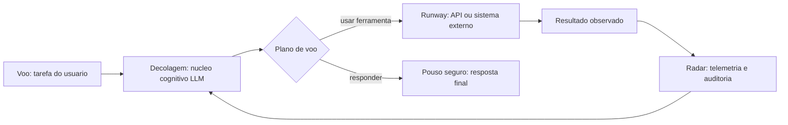

# Capítulo 1: Introdução aos Sistemas Agênticos

## 1. Introdução

Em 2026, a fronteira da inteligência artificial mudou de lugar. Durante anos, a pergunta dominante foi "o que a IA consegue dizer?" — e os grandes modelos de linguagem responderam com fluência impressionante. A pergunta que agora move empresas, laboratórios e engenheiros é outra: "o que a IA consegue **fazer**?" Sistemas agênticos — entidades de software que percebem um ambiente, raciocinam sobre ele e executam ações com consequências reais — são a resposta prática a essa nova pergunta [1]. Este livro é o manual do engenheiro que projeta, constrói e opera esses sistemas.

Este primeiro capítulo estabelece o vocabulário fundamental de toda a obra. Você vai aprender a definição operacional de sistema agêntico, a ontologia que organiza seus componentes (núcleo cognitivo, ferramentas, memória, orquestração e governança), a evolução histórica que separa chatbots de agentes, e o panorama de aplicações que já geram valor no mercado. Ao final, você será capaz de explicar a diferença entre automação tradicional e agência de IA para qualquer interlocutor — e saberá exatamente quais capacidades um sistema precisa ter para merecer o rótulo de "agêntico".

## 2. Explica

Comecemos pela definição que estrutura esta obra: **um sistema agêntico é um sistema computacional no qual um modelo de linguagem de grande escala (LLM) opera dentro de um loop de perceber–raciocinar–agir, com capacidade de usar ferramentas externas, manter estado ao longo de múltiplas etapas e ajustar seu comportamento com base no resultado de suas próprias ações** [2]. Cada elemento dessa definição é um requisito, não um adorno: sem o loop, você tem um gerador de texto; sem ferramentas, um conversador; sem estado, um reinício a cada prompt; sem ajuste por resultados, um script que finge pensar.

A literatura acadêmica converge para essa visão. O levantamento de Wang et al. define agentes autônomos baseados em LLM como sistemas que estendem a capacidade dos modelos com percepção de ambiente, planejamento e reflexão [3]. Cheng et al. vão além e propõem uma taxonomia: um agente é definido pela combinação de perfil (quem ele é), memória (o que ele lembra), planejamento (como ele decide) e ação (como ele age) [4]. Zhao et al. acrescentam a dimensão sociológica: agentes cooperam, competem e formam organizações, o que exige que o engenheiro pense em termos de sistemas, não de componentes isolados [5].

A confusão mais comum no mercado é tratar "chatbot", "automação" e "agente" como sinônimos. São classes diferentes de software, com consequências operacionais distintas. Um chatbot recebe uma mensagem e devolve texto, encerrando o ciclo — ele não tem intenção de alterar o mundo. Uma automação dirigida por regras executa um fluxo fixo e quebra quando o mundo se desvia do roteiro. Um sistema agêntico interpreta intenções ambíguas, escolhe entre caminhos, usa ferramentas e verifica o efeito de suas ações, dentro de limites definidos por humanos [6]. A pesquisa de adoção confirma que o mercado já entendeu a diferença: o Gartner projetou que 40% das aplicações empresariais incorporariam agentes específicos de tarefa até 2026, contra menos de 5% em 2025 [7].

Há, porém, uma ressalva honesta que define o tom deste livro. O mesmo Gartner prevê que mais de 40% dos projetos de IA agêntica serão cancelados até o fim de 2027 — não por falta de capacidade dos modelos, mas por falta de infraestrutura de engenharia ao redor deles [8]. Estudos do ecossistema mostram que a maioria das empresas está em fase piloto e poucas escalaram para produção [9]. A conclusão é estrutural: o gargalo da IA agêntica não é o modelo, é o sistema — memória, ferramentas, avaliação, observabilidade, segurança e governança. É exatamente aí que o Engenheiro Agêntico atua, e é o que este livro constrói capítulo a capítulo.

### O Denominador Comum dos Casos de Sucesso

Se o gargalo não é o modelo, vale a pergunta inversa: o que os casos que **sobrevivem** têm em comum? O padrão que emerge dos relatórios de adoção é consistente e pode ser resumido em quatro características [9]. A primeira é o **escopo cirúrgico**: o sistema bem-sucedido resolve um processo delimitado — triagem de chamados, conciliação de notas, extração de contrato — e não "a automação da empresa"; o escopo definido permite definir o que é sucesso, o que é erro e o que é fora de escopo (a fronteira que o Capítulo 5 formaliza como limites de autonomia). A segunda é a **disponibilidade de dados**: o projeto decola onde há base de conhecimento, histórico de casos resolvidos e registros de decisão — a matéria-prima da memória (Capítulo 2), do RAG (Capítulo 7) e da avaliação (Capítulo 8); onde o dado não existe, o projeto morre antes de começar, porque não há como medir nem como ancorar o comportamento. A terceira é a **medição antes do lançamento**: as equipes que sobrevivem definem as métricas — taxa de resolução, custo por tarefa, tempo de atendimento — antes do primeiro código de agente, e não depois; a medição prévia transforma o desenvolvimento de palpite em engenharia [6]. E a quarta é a **escalação humana desenhada por desenho**: o sistema bem-sucedido não promete autonomia total — promete autonomia *dentro de limites*, com o mecanismo de entrega ao humano quando o caso escapa (o padrão que o Capítulo 14 formaliza como governança de decisão).

O contraste com os projetos cancelados é instrutivo: a previsão de cancelamento de mais de 40% dos projetos até 2027 não é uma condenação da tecnologia, é uma leitura de engenharia [8]. Os projetos que morrem compartilham o padrão oposto: escopo vago ("automatizar o atendimento"), dado ausente ("os históricos estão em planilhas de cada analista"), medição inexistente ("vamos ver no piloto") e autonomia irrestrita ("o agente decide tudo"). Em nenhum desses casos a culpa é do modelo — o modelo responde como foi convidado; a culpa é do desenho do sistema ao redor dele. A consequência prática para você, engenheiro: **o diagnóstico do projeto é o seu primeiro teste profissional** — antes de escrever uma linha de agente, você deve ser capaz de responder quatro perguntas: qual é o processo exato? onde estão os dados? como medimos? o que o humano faz quando o agente para? Se alguma das quatro não tem resposta, o projeto ainda não está pronto — e dizê-lo a tempo é a sua primeira entrega de valor real [7].

Esse denominador comum também define o ritmo de adoção da sua própria carreira: cada projeto bem-sucedido cria o vocabulário e a confiança que o próximo exige. O engenheiro que entrega o primeiro agente de triagem com métricas reais está, na prática, habilitando o segundo, o terceiro e o décimo — porque a organização aprendeu com o primeiro que agente não é mistério, é engenharia com escopo, dado, medição e limites [9]. É exatamente essa sequência — um caso, um dado, uma métrica, um limite — que este livro constrói, capítulo a capítulo, a partir dos fundamentos que você acaba de consolidar.

### O Vocabulário Comum da Equipe

Antes de qualquer linha de código, o projeto agêntico precisa de um artefato que os times ignoram: o **vocabulário comum** — o glossário operacional que faz a equipe inteira falar a mesma língua [7]. A prática mostra que uma parte significativa das falhas de comunicação em projetos agênticos não vem de discordância técnica, mas de palavras com significados diferentes para pessoas diferentes: "autonomia" para o produto significa "o agente resolve sem mim"; para a segurança, "o agente age sem mim"; para o negócio, "o agente decide como eu decidiria" — e o sistema desenhado sobre essas três leituras diferentes nasce com a fronteira errada [9]. O vocabulário comum fixa, por escrito e revisado por todos, as definições operacionais: **agente** (o sistema que percebe, decide e age dentro de limites — a definição do capítulo), **tarefa** (a unidade de trabalho com início, fim e critério de sucesso), **autonomia** (o nível de efeito autorizado — o dial do Capítulo 14), **ferramenta** (a capacidade externa com contrato — o Capítulo 6), **memória** (o que persiste entre tarefas — o Capítulo 2), **erro** (o desvio de comportamento esperado, não o bug de código), e **escalação** (a transferência de controle ao humano) [6].

O vocabulário tem duas funções concretas. A primeira é **contratual**: quando o produto diz "o agente resolve sozinho 80% dos casos", a equipe inteira sabe o que isso significa em termos de degrau de autonomia, critério de sucesso e caminho de escalação — sem o glossário, essa frase gera o segundo projeto na mesma organização: um que entende "resolver" como responder texto e outro que entende como executar a ação [8]. A segunda é **diagnóstica**: quando um incidente acontece, o vocabulário comum permite a discussão precisa — "o agente **escalou** indevidamente" é uma frase com significado técnico exato (a política de escalação falhou), enquanto "o agente se recusou" é outra (a fronteira do Capítulo 2 agiu) — e a telemetria do Capítulo 11 registra as duas com nomes diferentes, porque são modos de falha diferentes [9].

A prática de manutenção do vocabulário segue a mesma regra do código: o glossário vive com o projeto, é versionado, e cada termo novo — ferramenta nova, padrão novo, política nova — entra no documento com definição, exemplo e referência ao capítulo deste livro que o ensina [7]. O resultado é o ambiente onde as decisões técnicas são tomadas sobre conceitos acordados, e não sobre palavras improvisadas — o solo de qualquer engenharia madura, e o primeiro passo prático do capítulo para transformar a teoria em operação [6].

## 3. Ilustra

### A Torre de Controle do Mundo Agêntico

Pense no aeroporto mais movimentado que você conhece. Dezenas de aeronaves decolam, cruzam o espaço aéreo e pousam todos os dias. Cada voo tem um plano, cada piloto tem autonomia para tomar decisões de curto prazo dentro de regras claras — mas ninguém decola sem a autorização da torre, e nenhum desvio de rota passa despercebido pelo radar. Agora traduza: os **voos** são os agentes; as **runways (pistas)** são as ferramentas que eles usam para agir; os **planos de voo** são os roteiros de planejamento; o **radar** é a observabilidade; e os **protocolos de aproximação final** são a governança e a segurança. Você, Engenheiro Agêntico, é o controlador de tráfego aéreo desse espaço: não pilota cada aeronave, mas desenha o sistema que faz todas decolarem e pousarem com segurança [10].



### Por Que "Responder" Não É "Agir"

Aqui está o ponto mais contraintuitivo deste capítulo — e por isso merece uma segunda camada de analogia. Imagine um estagiário brilhante em entrevistas: articulado, fluente, confiante. Você o coloca para trabalhar e percebe que ele nunca verifica nada — não abre a planilha, não confere o estoque, não liga para a transportadora. Na maioria dos casos ele acerta por dedução; no dia em que erra, você não sabe se foi incompetência ou azar. Um LLM puro é exatamente esse estagiário: um falador fluente com as mãos amarradas. O que transforma conversa em operação não é a fala — é a **ação verificada**: observar o efeito da própria ação e usar essa observação para decidir o próximo passo [11]. Como Engenheiro Agêntico, você vai perceber ao longo desta obra que a pergunta central de todo projeto não é "o que o agente deve dizer?", mas "o que ele deve fazer, e como sabemos que fez certo?".

## 4. Técnica

### O Teste dos Seis Critérios

A primeira ferramenta prática deste livro é um instrumento de diagnóstico que você aplicará a qualquer sistema que se apresente como "agente": o **Teste dos Seis Critérios**. Ele responde à pergunta "isso é realmente um sistema agêntico, ou apenas marketing?" — e é útil tanto para avaliar produtos de fornecedores quanto para auditar o seu próprio design [6].

1. **Loop de decisão:** o sistema executa múltiplas etapas e pode mudar de curso entre elas?
2. **Ferramentas:** o sistema chama recursos externos (APIs, bancos, código) e processa os resultados?
3. **Estado:** o sistema mantém contexto entre as etapas (memória de trabalho ou de longo prazo)?
4. **Reflexão:** o sistema avalia o resultado de suas ações e realimenta a decisão?
5. **Limites:** o sistema opera dentro de políticas de autonomia e autorização definidas?
6. **Rastreabilidade:** cada ação pode ser reconstruída (logs, traces, trilha de auditoria)?

Se faltar o critério 1, você tem um chatbot com enfeites. Se faltar o critério 5 ou 6, você tem um agente perigoso. Vamos implementar o teste como código real, que você pode rodar hoje para auditar qualquer sistema.

```python
# testa_seis_criterios.py
# -*- coding: utf-8 -*-
"""Teste dos Seis Critérios: audita se um sistema e genuinamente agêntico."""

from dataclasses import dataclass, field
from typing import Callable, List


@dataclass
class Criterio:
    nome: str
    descricao: str
    verificado: bool = False
    evidencias: List[str] = field(default_factory=list)


def auditar_sistema(
    tem_loop_de_decisao: Callable[[], tuple[bool, str]],
    tem_ferramentas: Callable[[], tuple[bool, str]],
    tem_estado: Callable[[], tuple[bool, str]],
    tem_reflexao: Callable[[], tuple[bool, str]],
    tem_limites: Callable[[], tuple[bool, str]],
    tem_rastreabilidade: Callable[[], tuple[bool, str]],
) -> list[Criterio]:
    """Executa o Teste dos Seis Critérios sobre um sistema candidato."""
    verificacoes = [
        ("Loop de decisão", tem_loop_de_decisao),
        ("Ferramentas", tem_ferramentas),
        ("Estado", tem_estado),
        ("Reflexão", tem_reflexao),
        ("Limites", tem_limites),
        ("Rastreabilidade", tem_rastreabilidade),
    ]
    resultado: list[Criterio] = []
    for nome, verificar in verificacoes:
        ok, evidencia = verificar()
        resultado.append(Criterio(nome=nome, descricao="", verificado=ok, evidencias=[evidencia]))
    return resultado


def relatorio(resultado: list[Criterio]) -> str:
    """Gera o parecer textual do teste."""
    aprovados = [c for c in resultado if c.verificado]
    linhas = [f"[{'OK' if c.verificado else 'FALHA'}] {c.nome}: {c.evidencias[0]}" for c in resultado]
    veredito = "SISTEMA AGENTICO" if len(aprovados) >= 5 else (
        "PARCIALMENTE AGENTICO (faltam criterios essenciais)" if len(aprovados) >= 3
        else "NAO E UM SISTEMA AGENTICO"
    )
    return "\n".join(linhas) + f"\n\nVeredito: {veredito}"


def exemplo_chatbot_simples():
    """Exemplo: um chatbot puro reprova nos criterios de agencia."""
    def sem_loop() -> tuple[bool, str]:
        return False, "responde uma unica vez e encerra"
    def sem_ferramentas() -> tuple[bool, str]:
        return False, "nenhuma chamada a API externa"
    def sem_estado() -> tuple[bool, str]:
        return False, "nao mantem contexto entre chamadas"
    def sem_reflexao() -> tuple[bool, str]:
        return False, "nao avalia o efeito da propria resposta"
    def com_limites() -> tuple[bool, str]:
        return True, "opera dentro de politica de conteudo"
    def com_rastreio() -> tuple[bool, str]:
        return True, "registra prompts e respostas em log"

    parecer = auditar_sistema(sem_loop, sem_ferramentas, sem_estado,
                              sem_reflexao, com_limites, com_rastreio)
    print(relatorio(parecer))


if __name__ == "__main__":
    exemplo_chatbot_simples()
```

### Arquitetura de Referência da Torre de Controle

Com o teste em mãos, passamos à arquitetura de referência que percorre a obra: a **Arquitetura da Torre de Controle**. Ela materializa o motivo condutor em cinco camadas, que serão aprofundadas nos capítulos 5 a 12. A camada de **núcleo cognitivo** hospeda o LLM e seus parâmetros de comportamento. A camada de **ferramentas** conecta o agente ao mundo por meio de function calling e protocolos abertos como o MCP [12]. A camada de **memória** distingue estado de conversa, memória de trabalho e memória de longo prazo consultável [13]. A camada de **orquestração** gerencia o loop de decisão — em agentes simples, um loop direto; em sistemas complexos, um grafo de execução com paralelismo [14]. A camada de **governança** impõe autenticação, autorização, limites de autonomia e trilhas de auditoria [15]. Cada camada é um módulo testável isoladamente — é isso que permite a uma equipe pequena construir sistemas robustos.

```yaml
# arquitetura_torre_controle.yaml
# Camadas de um sistema agêntico de referencia (livro, capítulo 1)
camadas:
  nucleo_cognitivo:
    modelo: "llm-pos-treinado"
    parametros: {temperatura: 0.2, max_tokens: 4096}
  ferramentas:
    protocolos: ["mcp", "function_calling"]
    exemplos: ["consultar_bd", "enviar_email", "executar_sql"]
  memoria:
    curto_prazo: "janela_de_contexto"
    longo_prazo: "vector_store_rag"
  orquestracao:
    modo: "grafo_de_execucao"
    nos: ["analisar_tarefa", "planejar", "executar", "verificar"]
    paralelismo: true
  governanca:
    autenticacao: "oauth2"
    autorizacao: "rbac"
    autonomia_maxima: "n_passos_por_tarefa"
    trilha_de_auditoria: "logs_estruturados"
```

### A Evolução em Três Eras

A terceira ferramenta é histórica, mas opera como uma técnica de engenharia: a **linha do tempo das três eras**, que explica por que certas arquiteturas existem. A Era 1 (2018–2021) foi a dos modelos de linguagem sem ferramentas: sistemas que previam a próxima palavra e, com fine-tuning, respondiam perguntas — sem agir sobre o mundo. A Era 2 (2022–2024) trouxe a conversação fluente e o primeiro passo em direção à agência: o ChatGPT demonstrou instruções complexas, e a função de chamada de ferramentas da OpenAI formalizou a conexão LLM→API [6]. A Era 3 (2025–2026) é a era da agência sistêmica: agentes com planejamento, memória, multiagentes e protocolos abertos de interoperabilidade (MCP para ferramentas, A2A para comunicação entre agentes) [16]. Cada era deixou arquiteturas que ainda operam em produção — saber reconhecê-las evita retrabalho e define o que modernizar primeiro.

## 5. Aplica

### A Cena de Contraste: O Piloto que Não Verifica o Radar

Você recebe uma demanda do diretor de operações: "Quero um agente que resolva a abertura de chamados de suporte." Ansioso para entregar rápido, você monta o sistema do jeito instintivo: um prompt bem escrito para o LLM, a API do LLM conectada direto ao chatbot do portal, e uma integração única para criar o chamado no sistema de tickets. Nos primeiros testes manuais, funciona: "criar chamado de devolução" cria o chamado corretamente. Você coloca em produção.

Na segunda semana, o caos. O agente cria chamados duplicados porque não consulta os chamados abertos antes de abrir outro — falta **ferramenta de leitura** e **estado**. Um usuário escreve "quero devolver meu pedido e também cancelar a assinatura", e o agente cria só o chamado de devolução — falta **loop de decisão** para decompor tarefas múltiplas. Um cliente furioso pergunta "vocês não têm responsáveis?" e o agente responde com um chamado aberto de baixa prioridade — falta **reflexão** para verificar se a ação resolveu o problema. O pior: ninguém consegue explicar o que o agente fez, porque não há **rastreabilidade** — os logs do portal só mostram "resposta gerada" [8].

O diagnóstico, à luz da teoria deste capítulo, é cristalino: você construiu um chatbot com uma única chamada de API disfarçada de agente. Os seis critérios reprovam em quatro pontos. A correção estrutural exige redesenhar em camadas: (1) expor o sistema de tickets como ferramenta de leitura e escrita via MCP; (2) adicionar um loop de decisão que recebe a intenção, consulta chamados abertos, planeja ações e verifica o resultado antes de concluir; (3) registrar cada etapa em log estruturado com IDs de correlação; (4) impor limites — o agente não pode reembolsar acima de um valor sem aprovação humana [15]. Em três semanas, o mesmo sistema que gerava caos entrega chamados únicos, completos e auditáveis.

Armadilhas comuns que você evitará a partir de agora: tratar prompt como arquitetura (prompt não substitui memória, ferramenta e loop); medir sucesso só pela qualidade da resposta (o valor está na qualidade da **ação**); e escalar um agente sem observabilidade (o que não é observado, não pode ser corrigido) [9].

## 6. Conclusão

Este capítulo estabeleceu o alicerce de toda a obra. Você aprendeu (1) a definição operacional de sistema agêntico — LLM operando em loop de perceber–raciocinar–agir com ferramentas, estado e reflexão; (2) o Teste dos Seis Critérios, que separa agente real de automação com enfeites; e (3) a Arquitetura da Torre de Controle em cinco camadas, que orienta o design de ponta a ponta. Desafio prático: aplique o Teste dos Seis Critérios a um sistema que você usa ou construiu — classifique cada critério e escreva uma linha de evidência para cada. Você perceberá que o teste muda a forma como lê qualquer anúncio de produto de IA.

O próximo capítulo mergulha nas bases teóricas da agência: dedução, indução, arquiteturas de raciocínio como BDI e a teoria da decisão que fundamenta o comportamento dos agentes. Na metáfora da torre, o Capítulo 2 é o manual do controlador antes do primeiro turno — as regras de pensamento que tornam cada decisão de pouso defensável.

## 7. Referências Bibliográficas

[1] ABOU ALI, Mohamad; DORNAIKA, Fadi; CHARAFEDDINE, Jinan. *Agentic AI: A Comprehensive Survey of Architectures, Applications, and Challenges*. Disponível em: https://arxiv.org/abs/2510.25445. Acesso em: 07 ago. 2026.
[2] ARUNKUMAR, V.; GANGADHARAN, G. R.; BUYYA, Rajkumar. *Agentic Artificial Intelligence (AI): Architectures, Taxonomies, and Evaluation of Large Language Model Agents*. Disponível em: https://arxiv.org/abs/2601.12560. Acesso em: 07 ago. 2026.
[3] WANG, Lei; MA, Chen; FENG, Xueyang et al. *A Survey on Large Language Model based Autonomous Agents*. Disponível em: https://arxiv.org/abs/2308.11432. Acesso em: 07 ago. 2026.
[4] CHENG, Yuheng; ZHANG, Ceyao; ZHANG, Zhengwen et al. *Exploring Large Language Model based Intelligent Agents: Definitions, Methods, and Prospects*. Disponível em: https://arxiv.org/html/2401.03428. Acesso em: 07 ago. 2026.
[5] ZHAO, Pengyu; JIN, Zijian; CHENG, Ning. *An In-depth Survey of Large Language Model-based Artificial Intelligence Agents*. Disponível em: https://arxiv.org/html/2309.14365. Acesso em: 07 ago. 2026.
[6] DEROUICHE, Hana; BRAHMI, Zaki; MAZENI, Haithem. *Agentic AI Frameworks: Architectures, Protocols, and Design Challenges*. Disponível em: https://arxiv.org/html/2508.10146. Acesso em: 07 ago. 2026.
[7] GARTNER. *Gartner Predicts 40% of Enterprise Apps Will Feature Task-Specific AI Agents by 2026*. Disponível em: https://www.gartner.com/en/newsroom/press-releases/2025-08-26-gartner-predicts-40-percent-of-enterprise-apps-will-feature-task-specific-ai-agents-by-2026-up-from-less-than-5-percent-in-2025. Acesso em: 07 ago. 2026.
[8] GARTNER. *Gartner Predicts Over 40% of Agentic AI Projects Will Be Canceled by End of 2027*. Disponível em: https://www.gartner.com/en/newsroom/press-releases/2025-06-25-gartner-predicts-over-40-percent-of-agentic-ai-projects-will-be-canceled-by-end-of-2027. Acesso em: 07 ago. 2026.
[9] DELOITTE. *Agentic AI in enterprise: Adoption, risk, and transformation*. Disponível em: https://www.deloitte.com/content/dam/assets-zone3/us/en/docs/services/consulting/2025/agentic-ai-enterprise-adoption-guide.pdf. Acesso em: 07 ago. 2026.
[10] GARTNER. *2026 Hype Cycle for Agentic AI*. Disponível em: https://www.gartner.com/en/articles/hype-cycle-for-agentic-ai. Acesso em: 07 ago. 2026.
[11] LUO, Junyu; ZHANG, Weizhi; YUAN, Ye et al. *Large Language Model Agent: A Survey on Methodology, Applications and Challenges*. Disponível em: https://arxiv.org/abs/2503.21460. Acesso em: 07 ago. 2026.
[12] MODEL CONTEXT PROTOCOL. *Specification 2026-07-28*. Disponível em: https://modelcontextprotocol.io/specification/2026-07-28. Acesso em: 07 ago. 2026.
[13] ZHANG, Zeyu; BO, Xiaohe; MA, Chen et al. *A Survey on the Memory Mechanism of Large Language Model based Agents*. Disponível em: https://arxiv.org/html/2404.13501. Acesso em: 07 ago. 2026.
[14] LANGCHAIN. *Workflows and agents — Docs*. Disponível em: https://docs.langchain.com/oss/python/langgraph/workflows-agents. Acesso em: 07 ago. 2026.
[15] OWASP GEN AI SECURITY PROJECT. *OWASP Top 10 for Agentic Applications for 2026*. Disponível em: https://genai.owasp.org/resource/owasp-top-10-for-agentic-applications-for-2026/. Acesso em: 07 ago. 2026.
[16] SORIA PARRA, David; DELIMARSKY, Den. *The 2026-07-28 Specification | MCP Blog*. Disponível em: https://blog.modelcontextprotocol.io/posts/2026-07-28/. Acesso em: 07 ago. 2026.
[17] *Agentic Large Language Models, a survey*. Disponível em: https://arxiv.org/html/2503.23037. Acesso em: 07 ago. 2026.
[18] HUANG, Wenhao; ABUDULAILI, Xin; RONG, Yang et al. *A Review of Prominent Paradigms for LLM-Based Agents: Tool Use (Including RAG), Planning, and Feedback Learning*. Disponível em: https://arxiv.org/html/2406.05804. Acesso em: 07 ago. 2026.
[19] *AI Agent Systems: Architectures, Applications, and Evaluation*. Disponível em: https://arxiv.org/abs/2601.01743. Acesso em: 07 ago. 2026.
[20] PARK, Joon Sung; O'BRIEN, Joseph; CAI, Carrie et al. *Generative Agents: Interactive Simulacra of Human Behavior*. Disponível em: https://arxiv.org/abs/2304.03442. Acesso em: 07 ago. 2026.
