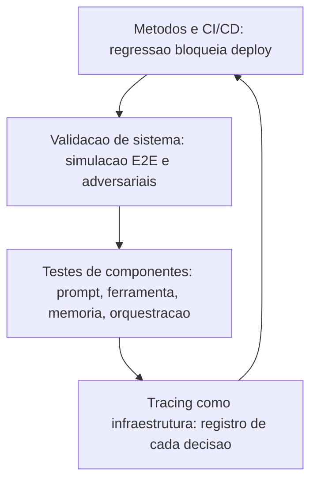

# Capítulo 10: Testes e Garantia de Qualidade

## 1. Introdução

No Capítulo 9, você otimizou o desempenho com disciplina de medição. Mas um sistema rápido que erra em produção não é um sucesso — é um acidente mais veloz. Este capítulo trata da garantia de qualidade sistemática: a infraestrutura de testes que transforma a confiança no agente de crença em dado.

Você vai aprender os quatro níveis da pirâmide de testes agêntica: o **tracing como infraestrutura de testes** (o registro que permite testar decisões, não só respostas); os **testes de componente e integração** (prompts, ferramentas, memória e orquestração isoladamente); a **simulação E2E** (o agente completo contra ambientes simulados); e as **métricas e o CI/CD** que automatizam a qualidade a cada mudança — incluindo testes adversariais e a análise de modos de falha. Na Torre de Controle, é o programa de certificação: nenhuma aeronave voa sem passar pela inspeção completa, e cada mudança no manual exige recertificação.

## 2. Explica

Testar agentes é fundamentalmente diferente de testar software tradicional, e a literatura de avaliação de agentes converge em um diagnóstico: o comportamento é não-determinístico, o espaço de entradas é ilimitado e os erros são semânticos — o sistema pode "funcionar" tecnicamente e falhar no propósito [1]. A resposta da comunidade foi construir uma **pirâmide de testes** específica para agentes, com quatro níveis que espelham a pirâmide clássica de testes de software, adaptada à natureza do sistema [2].

O primeiro nível é o **tracing como infraestrutura de testes** — a base da pirâmide e o componente mais inovador. Em agentes, o objeto de teste não é só a resposta final, mas a **decisão**: qual ferramenta o agente escolheu, com quais argumentos, em qual ordem, por que parou. O tracing (rastreamento estruturado de cada etapa — o mesmo mecanismo de observabilidade do Capítulo 11, usado aqui como instrumento de teste) registra a execução inteira: prompts, chamadas, resultados de ferramentas, transições de estado [3]. Com o trace em mãos, o teste pode verificar não "a resposta está certa?", mas "o agente usou a ferramenta certa na ordem certa?" — a propriedade que de fato define a qualidade de um agente [4].

O segundo nível é o **teste de componentes**: cada peça do agente testada isoladamente. O **prompt** é testado como unidade — saída esperada para entradas representativas, formato, tom, aderência às instruções. A **ferramenta** é testada como função — schemas, erros, idempotência (o checklist do Capítulo 6 vira casos de teste). A **memória** é testada — recuperação correta, reranking, filtros temporais (os pipelines do Capítulo 7 como testes). A **orquestração** é testada — transições de estado do grafo (o grafo do Capítulo 5 com verificação de nós e arestas). A vantagem do isolamento: quando o sistema falha, o trace aponta o componente culpado — sem a pirâmide, cada falha exige caça semântica [5].

O terceiro nível é a **validação de sistema** — o agente completo contra o mundo. Duas técnicas dominam. A **simulação E2E**: o agente opera contra um ambiente simulado (um sistema de tickets fake, um CRM de teste, um usuário simulado) — o teste valida o comportamento integrado sem custo e sem risco de produção [6]. Os **testes adversariais**: entradas deliberadamente hostis ou inesperadas — prompts maliciosos, ferramentas retornando erros estranhos, usuários mudando de ideia no meio do fluxo — o conjunto que revela os modos de falha que os testes felizes nunca encontram [7].

O quarto nível é **métricas e CI/CD**: a automação que garante que a qualidade não regride. O conjunto de avaliação (Capítulo 8) é executado em CI a cada mudança — de prompt, modelo, base, ferramenta ou orquestração — e a taxa de sucesso é comparada com a linha de base: regressão bloqueia o deploy. As métricas de produção (taxa de resolução, custo por tarefa, latência) alimentam o mesmo pipeline, criando o loop contínuo de qualidade [8]. A literatura de benchmarks é enfática sobre os riscos de avaliação não rigorosa: conjuntos pequenos, semântica frouxa e teste de memória (o agente "decorar" casos) produzem métricas que mentem [1].

### O Teste como Contrato de Comportamento

A mudança de mentalidade mais importante da garantia de qualidade agêntica é tratar o teste como **contrato executável de comportamento** — e não como rede de segurança de última hora. O contrato declara, em código, o que o agente promete: dado um chamado de suporte de tipo X com dados de política vigente, a resposta deve citar a política, oferecer a ação e nunca inventar exceção. O contrato é executável: a cada mudança — de prompt, de modelo, de base, de ferramenta, de orquestração — o conjunto roda e compara com a linha de base; a regressão é uma violação de contrato, e bloqueia o deploy, como o CI do Capítulo 8 [1]. A prática que sustenta o contrato é a **triagem do conjunto**: nem todo teste merece estar no contrato — o conjunto guarda os casos que decidem valor (o golden set do Capítulo 8), e cada novo incidente em produção que expõe um modo de falha vira um teste novo no contrato (o mecanismo que impede a regressão do mesmo erro duas vezes) [7]. O contrato cresce com a operação: o incidente de sexta-feira adiciona o teste de segunda-feira.

A segunda prática é a **cobertura de decisão**: o teste deve cobrir os pontos onde o agente decide — o roteamento (modelo pequeno ou grande?), a ferramenta (qual chamar, e o que fazer quando erra?), a política (autonomia ou escalação?), a memória (recuperou o item certo?) — e não apenas a resposta final; a cobertura de decisão é o que distingue o teste de agente do teste de LLM: um teste que só avalia o texto final deixa escapar metade dos modos de falha, porque a falha frequentemente está na decisão anterior ao texto [8]. A terceira prática é a **semântica das asserções**: comparar comportamento, não strings — o teste verifica se a resposta contém a política citada, não se reproduz um texto exato; verifica se a ferramenta foi chamada com o argumento certo, não se a saída é idêntica ao snapshot; a asserção semântica sobrevive às variações legítimas do modelo e apanha as variações ilegítimas de comportamento — a fronteira que os testes de string nunca enxergam [1].

A síntese do contrato de comportamento é o princípio que o capítulo inteiro sustenta: **qualidade é um sistema de memória organizacional** — os erros do passado, codificados em testes, são a defesa contra o futuro. A literatura de benchmarks é direta sobre o custo de ignorar essa memória: conjuntos pequenos, semântica frouxa e casos decorados produzem métricas que mentem — o sistema passa nos testes e falha na operação, porque os testes não eram o contrato, eram o espetáculo [1]. O teste como contrato vira, então, o elo que amarra a garantia de qualidade à operação: cada teste no conjunto é uma promessa escrita — e o CI é o cobrador que verifica a promessa a cada mudança, antes que o usuário a cobre em produção [8].

### O Pipeline de Qualidade em Três Estágios

A garantia de qualidade agêntica não vive em um único momento — vive em um **pipeline de três estágios**, e cada estágio responde uma pergunta diferente [7]. O primeiro estágio é o **pré-commit** (o mais rápido e o mais barato): a cada mudança — prompt, código, base de conhecimento, ferramenta — o desenvolvedor roda o subconjunto de testes que valida a mudança em segundos: o golden set pequeno (Capítulo 8), a validação de schema das ferramentas (Capítulo 6), a verificação de sintaxe (o CI de código da Fábrica que este livro segue), o lint do prompt (estrutura das seções, presença das cláusulas obrigatórias); o pré-commit pega os erros que custam minutos — o que quebra a sintaxe, o que contradiz o contrato, o que regride o caso de fumaça. O segundo estágio é o **pré-deploy** (o mais completo e o mais caro): a mudança aprovada no pré-commit entra no pipeline completo — o conjunto de avaliação inteiro com as métricas comparadas à linha de base (a regressão bloqueia o deploy), os testes adversariais (Capítulo 10), a simulação E2E (Capítulo 10) e a revisão humana dos casos limítrofes (o revisor que o Capítulo 8 exige para os casos de fronteira); o pré-deploy é a porta que separa o laboratório da produção, e a porta não abre com mudança que não passa [8].

O terceiro estágio é o **in-production** (o contínuo, que o Capítulo 11 detalha): a mudança no ar é monitorada — as métricas de comportamento (taxa de resolução, escalação, custo), o feedback do usuário e a avaliação automatizada sobre amostra das conversas reais (o Capítulo 8 em produção) — e o desvio dispara o mecanismo do Capítulo 12 (canary, rollback, degradação suave) com a regra simples: **produção é o teste final, e o teste final tem plano de saída** [1]. A distribuição entre os estágios segue a economia da detecção: o erro custa dez vezes mais em cada estágio seguinte — o erro do pré-commit custa minutos, o do pré-deploy custa horas, o da produção custa o incidente (Capítulo 11) — e o pipeline é desenhado para pegar o máximo de erro no estágio mais barato: o pré-commit amplo (tudo que roda em segundos), o pré-deploy rigoroso (tudo que exige minutos e contexto), e a produção vigilante (tudo que só o mundo real revela) [7].

A síntese do pipeline é o princípio que o capítulo inteiro sustenta: **qualidade não é um estágio do projeto, é a arquitetura do desenvolvimento** — o sistema que roda o pré-commit a cada tecla, o pré-deploy a cada deploy e a produção a cada conversa trata a qualidade como infraestrutura contínua, e não como a revisão ansiosa da véspera do lançamento [1].

## 3. Ilustra

### A Inspeção Pré-Voo da Aeronave

Voltemos à Torre de Controle. Nenhuma aeronave decola sem o checklist de inspeção — e o checklist de um voo comercial é uma pirâmide de testes. O **registro do voo anterior** (tracing como infraestrutura): cada decolagem, cada correção de rota, cada alerta — registrado e usado para decidir o que revisar. A **inspeção de componentes**: motor, asas, instrumentos — cada sistema testado isoladamente (testes de componente). A **simulação completa**: antes do primeiro voo com passageiros, a aeronave voa centenas de horas em simulador, com falhas induzidas (simulação E2E e testes adversariais). E o **programa de manutenção** (CI/CD): a cada hora de voo, a cada mudança de software, a certificação é refeita — regressão detectada antes de virar acidente [2].



### Por Que o Erro do Agente Está na Decisão, Não na Resposta

A segunda camada de analogia trata do ponto mais difícil: por que testar a resposta não basta. Imagine um controlador de voo que sempre "chega ao destino" — mas às vezes por cima de uma tempestade, às vezes sem autorização, às vezes queimando o dobro do combustível. O desfecho é o mesmo (o voo termina), mas a operação é um desastre. Com agentes, a resposta final pode estar correta em 90% dos casos enquanto o **processo** está errado em 60%: a ferramenta certa na ordem errada, decisões sem verificação, gasto excessivo de tokens. O tracing é o gravador de cockpit: sem ele, você celebra o destino e ignora o percurso [4]. Como Engenheiro Agêntico, você vai perceber que a pergunta de teste decisiva não é "o que ele respondeu?", mas "como ele chegou a essa resposta?" — e que essa pergunta só tem resposta com registro [3].

## 4. Técnica

### Trace como Dado de Teste

A primeira técnica é o **registro de trace estruturado** — o instrumento que transforma cada execução em dado testável. O trace captura a sequência de decisões com prompts, chamadas de ferramenta e resultados, e a suite de testes verifica propriedades sobre o trace — não apenas sobre a resposta final [3].

```python
# trace_como_teste.py
# -*- coding: utf-8 -*-
"""Registro de trace estruturado e testes de propriedade sobre o trace."""

from dataclasses import dataclass, field
from typing import Any, Optional


@dataclass
class EventoTrace:
    tipo: str  # "decisao", "ferramenta", "resposta"
    detalhe: str
    dados: dict[str, Any] = field(default_factory=dict)


class GravadorTrace:
    """Registra cada etapa da execucao para testes e auditoria."""

    def __init__(self) -> None:
        self.eventos: list[EventoTrace] = []

    def registrar_decisao(self, decisao: str) -> None:
        self.eventos.append(EventoTrace("decisao", decisao))

    def registrar_ferramenta(self, nome: str, argumentos: dict[str, Any],
                             resultado: str) -> None:
        self.eventos.append(EventoTrace(
            "ferramenta", nome, {"argumentos": argumentos, "resultado": resultado}
        ))

    def registrar_resposta(self, texto: str) -> None:
        self.eventos.append(EventoTrace("resposta", texto))

    def ferramentas_utilizadas(self) -> list[str]:
        return [e.detalhe for e in self.eventos if e.tipo == "ferramenta"]


def teste_ordem_ferramentas(trace: GravadorTrace, ordem_esperada: list[str]) -> bool:
    """Teste de propriedade: ferramentas usadas na ordem correta."""
    usadas = trace.ferramentas_utilizadas()
    return usadas == ordem_esperada


def teste_consulta_antes_de_acao(trace: GravadorTrace) -> bool:
    """Teste de propriedade: nenhuma acao destrutiva sem consulta previa."""
    usadas = trace.ferramentas_utilizadas()
    indice_consulta = usadas.index("consultar_assinatura") if "consultar_assinatura" in usadas else -1
    if "cancelar_assinatura" in usadas and indice_consulta == -1:
        return False
    return indice_consulta < usadas.index("cancelar_assinatura") if "cancelar_assinatura" in usadas else True


def main() -> None:
    trace = GravadorTrace()
    trace.registrar_decisao("quero cancelar")
    trace.registrar_ferramenta("consultar_assinatura", {"email": "a@b.com"}, "ativa")
    trace.registrar_ferramenta("cancelar_assinatura", {"email": "a@b.com"}, "cancelada")
    trace.registrar_resposta("assinatura cancelada")
    print("ordem correta:", teste_ordem_ferramentas(trace, ["consultar_assinatura", "cancelar_assinatura"]))
    print("consulta antes de acao:", teste_consulta_antes_de_acao(trace))


if __name__ == "__main__":
    main()
```

### Testes de Componente e Integração

A segunda técnica é o **harness de testes de componentes**: a estrutura que testa prompt, ferramenta, memória e orquestração isoladamente, com casos versionados e relatório de aprovação — a base automatizável da pirâmide [5].

```python
# testes_componentes.py
# -*- coding: utf-8 -*-
"""Harness de testes de componentes com casos versionados."""

from dataclasses import dataclass, field
from typing import Callable, Optional


@dataclass
class CasoTeste:
    id: str
    componente: str
    entrada: str
    esperado: str
    funcao: Callable[[str], str]


@dataclass
class ResultadoComponente:
    caso_id: str
    componente: str
    passou: bool
    detalhe: str = ""


class HarnessComponentes:
    """Executa casos por componente e consolida o relatorio."""

    def __init__(self) -> None:
        self.casos: list[CasoTeste] = []

    def adicionar(self, caso: CasoTeste) -> None:
        self.casos.append(caso)

    def executar(self) -> list[ResultadoComponente]:
        resultados = []
        for caso in self.casos:
            obtido = caso.funcao(caso.entrada)
            passou = (obtido.strip() == caso.esperado.strip())
            resultados.append(ResultadoComponente(
                caso.id, caso.componente, passou,
                f"esperado='{caso.esperado}' obtido='{obtido}'",
            ))
        return resultados

    def relatorio(self, resultados: list[ResultadoComponente]) -> str:
        aprovados = sum(1 for r in resultados if r.passou)
        reprovados = [r for r in resultados if not r.passou]
        linhas = " | ".join(f"{r.caso_id}:{r.componente}={'OK' if r.passou else 'FALHA'}"
                            for r in resultados)
        return f"{linhas}\naprovados: {aprovados}/{len(resultados)} reprovados: {len(reprovados)}"


def classificador_simples(texto: str) -> str:
    if "cancelar" in texto.lower():
        return "cancelamento"
    if "reembolso" in texto.lower():
        return "reembolso"
    return "outro"


def main() -> None:
    harness = HarnessComponentes()
    harness.adicionar(CasoTeste("p1", "prompt", "quero cancelar", "cancelamento", classificador_simples))
    harness.adicionar(CasoTeste("p2", "prompt", "pedido de reembolso", "reembolso", classificador_simples))
    harness.adicionar(CasoTeste("p3", "prompt", "qual o prazo", "outro", classificador_simples))
    resultados = harness.executar()
    print(harness.relatorio(resultados))


if __name__ == "__main__":
    main()
```

### Simulação E2E e Testes Adversariais

A terceira técnica é a **simulação E2E com ambiente fake e adversários** — o teste do agente completo contra um mundo simulado com falhas induzidas [6]. A implementação simula um sistema de tickets e injeta comportamentos adversários (erros, mudanças de plano) para validar a resiliência do agente.

```python
# simulacao_e2e.py
# -*- coding: utf-8 -*-
"""Simulacao E2E com ambiente fake e cenarios adversariais."""

from dataclasses import dataclass, field
from typing import Callable, Optional


@dataclass
class Ticket:
    id: int
    cliente: str
    status: str = "aberto"


class AmbienteSimulado:
    """Sistema de tickets fake para testes E2E."""

    def __init__(self) -> None:
        self.tickets: list[Ticket] = []
        self._proximo_id = 1
        self.modo_adversarial: bool = False

    def criar_ticket(self, cliente: str) -> str:
        if self.modo_adversarial:
            raise RuntimeError("simulacao de falha de integracao")
        ticket = Ticket(self._proximo_id, cliente)
        self.tickets.append(ticket)
        self._proximo_id += 1
        return f"ticket {ticket.id} criado"

    def listar_tickets(self, cliente: str) -> str:
        abertos = [t.id for t in self.tickets if t.cliente == cliente and t.status == "aberto"]
        return f"tickets abertos: {abertos}"


def agente_sob_teste(ambiente: AmbienteSimulado, tarefa: str) -> str:
    """Agente em teste: consulta antes de criar (politica do capítulo 6)."""
    if "criar" in tarefa.lower():
        consulta = ambiente.listar_tickets("cliente-1")
        if "tickets abertos: []" not in consulta and "abertos" in consulta:
            return f"criar_ticket: pre_consulta={consulta}"
        return ambiente.criar_ticket("cliente-1")
    return "tarefa nao suportada"


def main() -> None:
    ambiente = AmbienteSimulado()
    print("cenario normal:", agente_sob_teste(ambiente, "criar ticket"))
    ambiente.modo_adversarial = True
    try:
        print("cenario adversarial:", agente_sob_teste(ambiente, "criar ticket"))
    except RuntimeError as erro:
        print(f"adversarial detectado (esperado): {erro}")


if __name__ == "__main__":
    main()
```

### Checklist de Qualidade

O checklist final: (1) todo trace de produção é registrado e consultável? (2) cada componente (prompt, ferramenta, memória, orquestração) tem casos de teste versionados? (3) a simulação E2E cobre os fluxos críticos com ambiente fake? (4) existem testes adversariais para modos de falha conhecidos (ferramenta lenta, usuário muda de ideia, prompt hostil)? (5) o conjunto de avaliação roda em CI e bloqueia regressões? (6) as métricas de produção alimentam o mesmo pipeline? (7) a linha de base de qualidade está registrada e datada [8]? Um agente que passa nesses sete itens tem qualidade **medida** — o resto tem opinião [1].

## 5. Aplica

### A Cena de Contraste: A Regressão que Ninguém Viu

Sua equipe ajusta o prompt do agente de suporte para corrigir um caso específico — "não reembolsar sem consultar o pedido". O caso corrigido passa. Ninguém percebe que o ajuste quebrou o fluxo de trocas: agora o agente consulta o pedido e, como a consulta devolve "entregue", conclui o reembolso no fluxo de troca. Na primeira semana, 120 trocas são convertidas em reembolsos — o prejuízo só aparece na fatura mensal [8].

O diagnóstico: o ajuste foi feito sem o nível 4 da pirâmide — sem conjunto de regressão em CI. O teste manual do caso corrigido deu verde; a regressão silenciosa não tinha como ser detectada. A correção estrutural: (1) construir o conjunto de regressão com os 50 casos mais importantes (cobrindo todos os fluxos), versionado e rodando em CI a cada mudança; (2) adicionar testes de propriedade sobre o trace — "nenhuma ação destrutiva sem consulta prévia" (o teste do trace deste capítulo); (3) incluir cenários adversariais — ferramenta com erro, cliente ambíguo; (4) comparar a taxa de sucesso com a linha de base e bloquear o deploy em regressão. Resultado: a mudança seguinte que quebraria o fluxo de troca é bloqueada no CI — antes de tocar produção [5].

Armadilhas comuns: testar só a resposta e não a decisão; corrigir prompts sem regressão; e confiar em avaliação manual para mudanças automáticas [1].

## 6. Conclusão

Este capítulo deu ao seu agente uma certificação de qualidade sistemática. Você aprendeu (1) o tracing como infraestrutura de testes — o registro que permite testar decisões, não só respostas; (2) os testes de componente e integração — prompt, ferramenta, memória e orquestração isolados; (3) a simulação E2E e os testes adversariais — o agente completo contra o mundo fake e hostil; e (4) as métricas e o CI/CD que bloqueiam regressões. Desafio: adicione ao seu projeto o teste de propriedade "consulta antes de ação" sobre o trace — o primeiro passo do nível 1.

O próximo capítulo mantém o radar ligado em produção: monitoramento e observabilidade — logging, trilhas de auditoria, métricas, detecção de anomalias e loops de feedback. Na torre, é o radar de verdade: a tela que mostra cada aeronave, cada desvio, cada alarme.

## 7. Referências Bibliográficas

[1] ZHU, Yuxuan; JIN, Tengjun; PRUKSACHATKUN, Yada et al. *Establishing Best Practices for Building Rigorous Agentic Benchmarks*. Disponível em: https://arxiv.org/html/2507.02825. Acesso em: 07 ago. 2026.
[2] ARUNKUMAR, V.; GANGADHARAN, G. R.; BUYYA, Rajkumar. *Agentic Artificial Intelligence (AI): Architectures, Taxonomies, and Evaluation of Large Language Model Agents*. Disponível em: https://arxiv.org/abs/2601.12560. Acesso em: 07 ago. 2026.
[3] LANGCHAIN. *Trace with OpenTelemetry — LangSmith Docs*. Disponível em: https://docs.langchain.com/langsmith/trace-with-opentelemetry. Acesso em: 07 ago. 2026.
[4] LANGCHAIN. *Observability concepts — LangSmith Docs*. Disponível em: https://docs.langchain.com/langsmith/observability-concepts. Acesso em: 07 ago. 2026.
[5] ABOU ALI, Mohamad; DORNAIKA, Fadi; CHARAFEDDINE, Jinan. *Agentic AI: A Comprehensive Survey of Architectures, Applications, and Challenges*. Disponível em: https://arxiv.org/abs/2510.25445. Acesso em: 07 ago. 2026.
[6] CHENG, Yuheng; ZHANG, Ceyao; ZHANG, Zhengwen et al. *Exploring Large Language Model based Intelligent Agents: Definitions, Methods, and Prospects*. Disponível em: https://arxiv.org/html/2401.03428. Acesso em: 07 ago. 2026.
[7] OWASP GEN AI SECURITY PROJECT. *OWASP Top 10 for Agentic Applications for 2026*. Disponível em: https://genai.owasp.org/resource/owasp-top-10-for-agentic-applications-for-2026/. Acesso em: 07 ago. 2026.
[8] LIU, Xiao; YU, Hao; ZHANG, Hanchen et al. *AgentBench: Evaluating LLMs as Agents*. Disponível em: https://arxiv.org/abs/2308.03688. Acesso em: 07 ago. 2026.
[9] WANG, Lei; MA, Chen; FENG, Xueyang et al. *A Survey on Large Language Model based Autonomous Agents*. Disponível em: https://arxiv.org/abs/2308.11432. Acesso em: 07 ago. 2026.
[10] HUANG, Wenhao; ABUDULAILI, Xin; RONG, Yang et al. *A Review of Prominent Paradigms for LLM-Based Agents: Tool Use (Including RAG), Planning, and Feedback Learning*. Disponível em: https://arxiv.org/html/2406.05804. Acesso em: 07 ago. 2026.
[11] LUO, Junyu; ZHANG, Weizhi; YUAN, Ye et al. *Large Language Model Agent: A Survey on Methodology, Applications and Challenges*. Disponível em: https://arxiv.org/abs/2503.21460. Acesso em: 07 ago. 2026.
[12] ZHAO, Pengyu; JIN, Zijian; CHENG, Ning. *An In-depth Survey of Large Language Model-based Artificial Intelligence Agents*. Disponível em: https://arxiv.org/html/2309.14365. Acesso em: 07 ago. 2026.
[13] DEROUICHE, Hana; BRAHMI, Zaki; MAZENI, Haithem. *Agentic AI Frameworks: Architectures, Protocols, and Design Challenges*. Disponível em: https://arxiv.org/html/2508.10146. Acesso em: 07 ago. 2026.
[14] OPENAI. *Evals (PaperBench, SWE-Lancer, MLE-bench, SWE-bench Verified)*. Disponível em: https://evals.openai.com/. Acesso em: 07 ago. 2026.
[15] OPENAI. *Separating signal from noise in coding evaluations*. Disponível em: https://openai.com/index/separating-signal-from-noise-coding-evaluations/. Acesso em: 07 ago. 2026.
[16] GARTNER. *Gartner Predicts Over 40% of Agentic AI Projects Will Be Canceled by End of 2027*. Disponível em: https://www.gartner.com/en/newsroom/press-releases/2025-06-25-gartner-predicts-over-40-percent-of-agentic-ai-projects-will-be-canceled-by-end-of-2027. Acesso em: 07 ago. 2026.
[17] DELOITTE. *Agentic AI in enterprise: Adoption, risk, and transformation*. Disponível em: https://www.deloitte.com/content/dam/assets-zone3/us/en/docs/services/consulting/2025/agentic-ai-enterprise-adoption-guide.pdf. Acesso em: 07 ago. 2026.
[18] OPENTELEMETRY. *Inside the LLM Call: GenAI Observability with OpenTelemetry*. Disponível em: https://opentelemetry.io/blog/2026/genai-observability/. Acesso em: 07 ago. 2026.
[19] OPENTELEMETRY. *Semantic Conventions for Generative AI*. Disponível em: https://github.com/open-telemetry/semantic-conventions-genai. Acesso em: 07 ago. 2026.
[20] THUDM. *AgentBench: A Comprehensive Benchmark to Evaluate LLMs as Agents*. Disponível em: https://github.com/THUDM/AgentBench. Acesso em: 07 ago. 2026.
