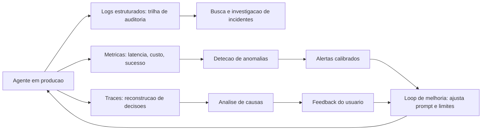

# Capítulo 11: Monitoramento e Observabilidade

## 1. Introdução

No Capítulo 10, você construiu a certificação de qualidade antes do voo. Agora vem o radar de verdade: o monitoramento e a observabilidade que mantêm o sistema sob controle **durante** a operação — o olho contínuo sobre cada aeronave, cada desvio e cada alarme. A diferença entre os dois conceitos é precisa: **monitoramento** responde "o sistema está de pé?" — métricas, alertas, disponibilidade; **observabilidade** responde "por que o sistema se comportou assim?" — traces, logs, a capacidade de reconstruir qualquer execução.

Este capítulo ensina os três pilares da operação agêntica: o **logging estruturado e as trilhas de auditoria** (o registro legível e reconstruível de cada ação); as **métricas, a detecção de anomalias e os alertas** (o radar com alarmes calibrados); e os **loops de feedback contínuo** (o mecanismo que transforma observação em melhoria). Na Torre de Controle, é o capítulo do radar e da caixa-preta: ver tudo, registrar tudo, reagir a tempo — e melhorar antes que o padrão vire acidente.

## 2. Explica

Sistemas agênticos têm uma propriedade que muda a observabilidade: o comportamento é **gerado**, não programado. No software tradicional, a execução segue o código que você escreveu; no agente, a execução segue decisões do modelo — e a única forma de saber o que aconteceu é registrando. A comunidade convergiu no padrão dos **três pilares**: logs, métricas e traces — com os traces ganhando protagonismo em agentes, porque são eles que reconstroem a sequência de decisões (Capítulo 10 já usou o trace como instrumento de teste; aqui ele vira instrumento de operação) [1].

O **logging estruturado** é o primeiro pilar. Em agentes, o log não é um registro de eventos genérico — é a **trilha de auditoria**: quem (qual usuário), o quê (qual intenção), com quê (quais ferramentas, quais argumentos), quando (timestamps), e qual resultado. A norma prática consolidada: log estruturado em JSON, com IDs de correlação (o trace_id que amarra a execução inteira), sem dados sensíveis brutos (a privacidade do Capítulo 14 impõe mascaramento), e com retenção definida por requisito — a auditoria de conformidade exige retenção longa; a operação, retenção curta [2]. A distinção crítica: logs de agente são **evidência** — de qualidade, de conformidade, de investigação de incidente — e evidência sem estrutura não é evidência, é ruído [3].

O **monitoramento de desempenho** é o segundo pilar: as métricas que dizem se o sistema está saudável. As métricas essenciais de um agente em produção formam um conjunto pequeno e obrigatório: **latência** (tempo por tarefa, percentis p50/p95/p99), **custo** (tokens de entrada/saída por tarefa, custo total), **taxa de sucesso** (resoluções corretas sobre o total — alimentada pelo feedback do Capítulo 10), **taxa de ferramentas** (quantas chamadas por tarefa, taxa de erro de ferramenta) e **taxa de escalação** (quantas tarefas exigiram humano) [4]. A **detecção de anomalias** usa essas métricas com técnicas estatísticas (desvio padrão, EWMA — médias móveis exponenciais, thresholds dinâmicos) para sinalizar desvios antes que virem incidente: latência subindo, taxa de erro de ferramenta crescendo, custo disparando. E o **alerting** é a arte da calibração: alertas demais geram fadiga e são ignorados; alertas de menos deixam incidentes passar — o padrão é alertar sobre o que **exige ação humana imediata**, não sobre flutuação [5].

O **loop de feedback contínuo** é o terceiro pilar — e o mais distintivo de agentes. O sistema coleta três fontes de sinal: o **feedback do usuário** (avaliar resposta, "resolveu?", estrelas — direto e ruidoso); a **telemetria de comportamento** (as métricas e traces — objetivo e silencioso); e a **avaliação automatizada** (o conjunto de avaliação do Capítulo 8 rodando em produção sobre uma amostra das conversas — o detector silencioso de regressão). O loop é: coletar → agregar → analisar → melhorar (novo prompt, novo caso de teste, novo limite) → medir de novo [6]. A especificação de semântica do OpenTelemetry para GenAI formalizou as convenções de telemetria para LLMs — nomes de span, atributos de modelo, contagens de tokens — o que permite que a instrumentação seja portável entre fornecedores, o padrão aberto que a indústria consolidou em 2025-2026 [7].

### A Cultura do Incidente em Sistemas Agênticos

A observabilidade madura não termina na detecção — termina no **incidente tratado como aprendizado organizacional**. Em sistemas agênticos, os incidentes têm uma assinatura própria que exige cultura e processo: eles raramente são binários (serviço no ar / serviço fora do ar) — são **desvios de comportamento** (o agente passou a escalar demais, a resposta mudou de tom, o custo por tarefa dobrou sem mudança de código) [4]. O desvio de comportamento é o incidente mais perigoso do mundo agêntico porque é silencioso: nenhum alerta dispara, nenhum usuário grita, e o sistema degrada devagar — a telemetria do capítulo é o que torna o desvio visível: a taxa de escalação subindo na segunda-feira é um sinal; a mudança no prompt do domingo é a causa; e a ligação entre as duas é o trabalho do engenheiro de plantão [5].

O processo que a prática consolidou é o **post-mortem sem culpa com ação obrigatória**: quando um incidente ocorre, o time documenta a linha do tempo (o que aconteceu, o que a telemetria mostrou, quando o primeiro sinal apareceu), identifica a causa raiz no nível do sistema (a política, o dado, o prompt, a integração — raramente "o modelo errou"), e — o passo inegociável — **define a ação que impede a recorrência**: o teste que captura o desvio (Capítulo 10), o alerta que teria disparado antes (este capítulo), o limite que faltava (Capítulo 2). O post-mortem sem ação é uma reunião de luto; com ação, é um investimento que reduz a próxima ocorrência [6]. Em agentes, a ação tem um formato adicional específico: o incidente vira **caso no conjunto de avaliação** — o desvio de comportamento de hoje é o teste de regressão de amanhã, e o loop de feedback do capítulo fecha com o aprendizado incorporado ao sistema, não apenas documentado [4].

A terceira prática é o **playbook do incidente**: respostas preparadas para os cenários previsíveis — o custo disparando (congelar retries, rotear para o modelo barato, ampliar o orçamento? decisão do Capítulo 9), o comportamento degradando (reverter para a versão anterior — o rollback do Capítulo 12), a ferramenta externa caindo (degradação suave — continuar com as respostas locais, Capítulo 12), a base de conhecimento envelhecendo (pausar respostas com citação antiga, Capítulo 7). O playbook transforma a resposta de heroísmo em procedimento: o engenheiro de plantão sabe o que fazer porque o time já decidiu antes, no frio, o que faria no calor [5]. A síntese da cultura do incidente é o princípio que o capítulo inteiro sustenta: **operar agentes é operar comportamentos, não binários** — e a organização que trata desvio de comportamento com telemetria, post-mortem com ação e playbook com procedimento transforma o imprevisível da IA em rotina da engenharia [6].

### O SLA do Agente: O Que Prometer

Todo sistema em produção tem um SLA — e sistemas agênticos têm uma armadilha específica: prometer o que o modelo não pode garantir. O primeiro passo da prática madura é **desenhar o SLA sobre o comportamento, não sobre o texto**: a promessa não é "responde com precisão perfeita" (impossível de sustentar) — é "responde com fonte, ou declara não saber" (comportamento garantido por política, não por sorte do modelo); é "escala ao humano quando o caso sai da política" (garantido pela fronteira do Capítulo 2); é "cada resposta tem trilha" (garantido pela telemetria deste capítulo) [4]. O SLA de agente é o contrato do que o **sistema** garante — a política, a fronteira, a trilha, a degradação — e não o que o **modelo** pode acertar ou errar; o engenheiro que promete taxa de acerto na política de preço converte o sistema em cassino, e o que promete comportamento converte o sistema em engenharia [6]. O segundo passo é a **tradução do SLA em SLOs mensuráveis**: o SLA promete resposta ao chamado em 95% dos casos com fonte ou declaração de não-conhecimento — e o SLO é a métrica concreta: taxa de resposta com fonte ≥ 90%, taxa de escalação conforme política ≥ 98%, tempo de resposta p95 ≤ 20 segundos, custo por tarefa ≤ teto (o orçamento do Capítulo 9), disponibilidade de trilha = 100% (a trilha não falha nunca — sem trilha não há incidente investigável) [5].

O terceiro passo é o **desenho do que acontece quando o SLO cai**: o SLA sem consequência é literatura — a prática define os degraus de degradação (Capítulo 12): o SLO de latência estourado reduz o contexto (Capítulo 4); o de custo estourado muda o roteamento (Capítulo 9); o de comportamento estourado (taxa de escalação fora da política) reverte a versão (Capítulo 12) e coloca o time em modo conservador (Capítulo 2); e o de trilha estourado **pausa o sistema** — operar sem trilha é operar cego, e o sistema cego para de operar [6]. O quarto passo é a **comunicação honesta do SLA para o negócio**: o SLA do agente não é a planilha de um modelo mágico — é o catálogo do comportamento garantido, com as métricas no dashboard (Capítulo 11), a revisão periódica com a decisão de negócio (Capítulo 8) e o incidente tratado no post-mortem sem culpa com ação obrigatória (o loop deste capítulo) [4].

A síntese do SLA é o princípio que amarra o capítulo: **prometer pouco e garantir tudo é a postura do sistema maduro** — o SLA sobre comportamento, traduzido em SLOs, com degradação definida e comunicação honesta, transforma a operação agêntica de aposta em contrato — e o contrato é o que o negócio assina, o usuário sente e o auditor verifica [5].

## 3. Ilustra

### O Radar e a Caixa-Preta da Torre

Voltemos à Torre de Controle. O radar mostra cada aeronave em tempo real: posição, altitude, velocidade — as **métricas** do espaço aéreo. Os **alertas** são os procedimentos calibrados: o radar não apita para cada mudança de altitude (fadiga de alarme), mas dispara protocolo para desvio de rota sem comunicação — o desvio que **exige ação**. A **caixa-preta** de cada aeronave registra tudo: cada decisão do piloto, cada instrução da torre, cada chamada de rádio — a **trilha de auditoria** que permite reconstruir qualquer evento depois. E o **programa de revisão de incidentes** é o loop de feedback: cada desvio investigado vira mudança de procedimento, que é medida na operação seguinte — a melhoria contínua da operação [1].



### Por Que o Radar Não Pode Ver Tudo sem Traces

A segunda camada de analogia trata do ponto mais difícil: por que métricas não bastam. O radar diz que a aeronave desviou; ele não diz **por que** — quem autorizou, qual instrução foi mal interpretada, qual decisão do piloto causou o desvio. Para isso existe a caixa-preta: o registro que reconstrói a sequência. Com agentes é idêntico: a métrica "taxa de erro subiu de 3% para 9%" é o radar — o alarme dispara; mas a ação correta só é possível com o trace: qual prompt mudou, qual ferramenta falhou, qual decisão errou. Como Engenheiro Agêntico, você vai perceber que métricas sem traces são como radar sem caixa-preta: você sabe que algo aconteceu, mas não consegue **aprender** com isso [7]. E o loop de melhoria — o mecanismo que faz a operação melhorar a cada semana — depende dessa reconstrução: sem o porquê, não há ajuste; sem ajuste, a operação piora lentamente até o incidente [6].

## 4. Técnica

### Log Estruturado e Trilha de Auditoria

A primeira técnica é o **logger estruturado de agente** — o registro JSON com IDs de correlação e mascaramento, o formato que torna a trilha pesquisável e auditável [2].

```python
# trilha_auditoria.py
# -*- coding: utf-8 -*-
"""Log estruturado com id de correlacao e mascaramento de dados."""

import json
import re
from dataclasses import dataclass, field
from datetime import datetime, timezone
from typing import Any, Optional


def mascarar(texto: str) -> str:
    """Mascara emails e numeros de cartao no log."""
    texto = re.sub(r"[\w.+-]+@[\w-]+\.[\w.]+", "[email-mascarado]", texto)
    texto = re.sub(r"\b\d{4}[- ]?\d{4}[- ]?\d{4}[- ]?\d{4}\b", "[cartao-mascarado]", texto)
    return texto


class TrilhaAuditoria:
    """Registro estruturado de eventos do agente para auditoria."""

    def __init__(self) -> None:
        self.eventos: list[dict[str, Any]] = []

    def registrar(self, trace_id: str, tipo: str, detalhe: str,
                  metadados: Optional[dict[str, Any]] = None) -> None:
        evento = {
            "timestamp": datetime.now(timezone.utc).isoformat(),
            "trace_id": trace_id,
            "tipo": tipo,
            "detalhe": mascarar(detalhe),
        }
        if metadados:
            evento["metadados"] = {k: mascarar(str(v)) if isinstance(v, str) else v
                                   for k, v in metadados.items()}
        self.eventos.append(evento)

    def buscar_por_trace(self, trace_id: str) -> list[dict[str, Any]]:
        return [e for e in self.eventos if e["trace_id"] == trace_id]

    def despejar_json(self) -> str:
        return json.dumps(self.eventos, ensure_ascii=False, indent=2)


def main() -> None:
    trilha = TrilhaAuditoria()
    trilha.registrar("t-001", "decisao", "quero cancelar assinatura", {"usuario": "cliente@x.com"})
    trilha.registrar("t-001", "ferramenta", "cancelar_assinatura", {"email": "cliente@x.com"})
    trilha.registrar("t-001", "resposta", "assinatura cancelada")
    print(trilha.despejar_json())


if __name__ == "__main__":
    main()
```

### Métricas, Anomalias e Alertas Calibrados

A segunda técnica é o **detector de anomalias com alertas calibrados** — o componente que transforma métricas brutas em alarmes acionáveis, com thresholds dinâmicos contra fadiga de alerta [5].

```python
# alertas_calibrados.py
# -*- coding: utf-8 -*-
"""Detecao de anomalias com media movel e alertas por gravidade."""

from dataclasses import dataclass, field
from typing import Optional


@dataclass
class PontoMetrica:
    valor: float
    timestamp: str


class MonitorAnomalias:
    """Detecta desvios com media movel exponencial e alerta acionavel."""

    def __init__(self, alfa: float = 0.3, fator_limiar: float = 2.5) -> None:
        self.alfa = alfa
        self.fator_limiar = fator_limiar
        self.media: Optional[float] = None
        self.desvio: Optional[float] = None
        self.alertas: list[str] = []

    def observar(self, valor: float, timestamp: str) -> Optional[str]:
        """Atualiza a media movel e retorna alerta se houver anomalia."""
        if self.media is None:
            self.media = valor
            self.desvio = 0.0
            return None
        desvio_anterior = self.desvio or 0.0
        self.media = self.alfa * valor + (1 - self.alfa) * self.media
        variacao = abs(valor - self.media)
        self.desvio = self.alfa * variacao + (1 - self.alfa) * desvio_anterior
        limiar = self.desvio * self.fator_limiar
        if variacao > max(limiar, 1.0):
            alerta = f"[ALERTA] anomalia em {timestamp}: valor={valor:.2f} media={self.media:.2f}"
            self.alertas.append(alerta)
            return alerta
        return None


def main() -> None:
    monitor = MonitorAnomalias()
    serie = [10.0, 10.2, 9.8, 10.1, 10.3, 10.0, 9.9, 10.2, 10.1, 42.0, 10.4, 10.0]
    for i, valor in enumerate(serie):
        alerta = monitor.observar(valor, f"t{i}")
        if alerta:
            print(alerta)
    print(f"alertas emitidos: {len(monitor.alertas)} de {len(serie)} pontos")


if __name__ == "__main__":
    main()
```

### Loop de Feedback Contínuo

A terceira técnica é o **coletor de feedback e melhoria contínua** — o pipeline que transforma observação em mudança: agrega feedback do usuário, telemetria e avaliação automatizada, e gera recomendações de melhoria [6].

```python
# loop_feedback.py
# -*- coding: utf-8 -*-
"""Loop de feedback: coleta, agrega e recomenda melhorias."""

from dataclasses import dataclass, field
from typing import Optional


@dataclass
class FeedbackItem:
    trace_id: str
    usuario_satisfeito: bool
    resolucao: str


@dataclass
class RelatorioFeedback:
    total: int = 0
    satisfeitos: int = 0
    insatisfeitos: int = 0
    por_resolucao: dict[str, int] = field(default_factory=dict)

    def taxa_satisfacao(self) -> float:
        return self.satisfeitos / self.total if self.total else 0.0


class ColetorFeedback:
    """Agrega feedback e gera recomendacoes de melhoria."""

    def __init__(self) -> None:
        self.itens: list[FeedbackItem] = []

    def adicionar(self, item: FeedbackItem) -> None:
        self.itens.append(item)

    def relatorio(self) -> RelatorioFeedback:
        rel = RelatorioFeedback(total=len(self.itens))
        for item in self.itens:
            if item.usuario_satisfeito:
                rel.satisfeitos += 1
            else:
                rel.insatisfeitos += 1
            rel.por_resolucao[item.resolucao] = rel.por_resolucao.get(item.resolucao, 0) + 1
        return rel

    def recomendacoes(self, rel: RelatorioFeedback) -> list[str]:
        sugestoes = []
        if rel.total >= 20 and rel.taxa_satisfacao() < 0.8:
            sugestoes.append("satisfacao abaixo de 80%: investigar casos de maior insatisfacao")
        for resolucao, contagem in rel.por_resolucao.items():
            if contagem >= 5 and "reembolso" in resolucao.lower():
                sugestoes.append(f"revisar politica de {resolucao}: {contagem} feedbacks negativos")
        return sugestoes


def main() -> None:
    coletor = ColetorFeedback()
    for i in range(24):
        coletor.adicionar(FeedbackItem(f"t-{i}", i % 5 != 0, "reembolso" if i % 2 else "troca"))
    rel = coletor.relatorio()
    print(f"satisfacao: {rel.taxa_satisfacao():.0%} ({rel.total} feedbacks)")
    for sugestao in coletor.recomendacoes(rel):
        print("-", sugestao)


if __name__ == "__main__":
    main()
```

### Checklist de Observabilidade

O checklist final: (1) todo log é estruturado (JSON) com trace_id e timestamps? (2) dados sensíveis são mascarados na trilha? (3) as cinco métricas essenciais (latência, custo, sucesso, ferramentas, escalação) são coletadas? (4) a detecção de anomalias cobre latência, erro e custo com thresholds calibrados? (5) os alertas exigem ação humana — sem fadiga de alarme? (6) o feedback do usuário e a avaliação automatizada alimentam o loop de melhoria? (7) a instrumentação segue convenções padrão (OpenTelemetry GenAI) para portabilidade [7]? (8) o retorno da observação vira mudança medida, não reunião [6]? Os itens 1-4 definem se você vê o problema; os itens 5-8 definem se você age a tempo.

## 5. Aplica

### A Cena de Contraste: O Incidente que o Radar Não Mostrou

Seu agente de vendas atende milhares de conversas. A operação é monitorada com um dashboard bonito: uptime 99,9%, latência média estável. Ninguém percebe que a **taxa de escalação para humano** caiu silenciosamente — o agente passou a "resolver" sozinho casos que exigiam aprovação, mudando o limite de autonomia numa atualização de prompt. O prejuízo aparece três semanas depois, na auditoria de reembolsos: 40 reembolsos acima do limite executados sem aprovação [5].

O diagnóstico: o dashboard monitorava a saúde do sistema (uptime, latência), não a **qualidade das decisões** (taxa de escalação, conformidade de autonomia). Sem o trace como instrumento de auditoria, a mudança de comportamento passou despercebida por semanas. A correção estrutural: (1) adicionar as métricas de decisão — taxa de escalação, taxa de execução acima do limite, distribuição de autonomia — ao conjunto monitorado; (2) alertar para desvios dessas métricas, não só de infraestrutura; (3) instrumentar a trilha de auditoria com o trace_id por tarefa, permitindo reconstruir cada reembolso; (4) alimentar o loop de feedback com avaliação automatizada de amostras — o detector silencioso de regressão de comportamento [6]. Resultado: a próxima mudança de limite dispara o alerta na primeira hora, e o incidente vira caso de melhoria, não de descoberta tardia [4].

Armadilhas comuns: monitorar infraestrutura e ignorar comportamento; alertas sem critério de ação (fadiga); e trilhas sem mascaramento (risco de privacidade — Capítulo 14) [2].

## 6. Conclusão

Este capítulo instalou o radar da sua operação. Você aprendeu (1) o logging estruturado e a trilha de auditoria — o registro reconstruível de cada decisão, com mascaramento e IDs de correlação; (2) as métricas essenciais, a detecção de anomalias e os alertas calibrados — o radar que dispara apenas quando exige ação; e (3) o loop de feedback contínuo — o mecanismo que transforma observação em melhoria medida. Desafio: defina as cinco métricas do seu agente, implemente o log estruturado com trace_id e configure um alerta para a métrica de decisão mais importante.

O próximo capítulo leva o sistema ao chão: estratégias de implantação — nuvem e orquestração, borda e ambientes restritos, arquiteturas híbridas, versionamento e degradação suave. Na torre, é o momento de decidir onde cada aeronave estaciona, como se mantém e como pousa sem drama.

## 7. Referências Bibliográficas

[1] OPENTELEMETRY. *Inside the LLM Call: GenAI Observability with OpenTelemetry*. Disponível em: https://opentelemetry.io/blog/2026/genai-observability/. Acesso em: 07 ago. 2026.
[2] OWASP GEN AI SECURITY PROJECT. *OWASP Top 10 for Agentic Applications for 2026*. Disponível em: https://genai.owasp.org/resource/owasp-top-10-for-agentic-applications-for-2026/. Acesso em: 07 ago. 2026.
[3] LANGCHAIN. *Observability concepts — LangSmith Docs*. Disponível em: https://docs.langchain.com/langsmith/observability-concepts. Acesso em: 07 ago. 2026.
[4] LANGCHAIN. *Trace with OpenTelemetry — LangSmith Docs*. Disponível em: https://docs.langchain.com/langsmith/trace-with-opentelemetry. Acesso em: 07 ago. 2026.
[5] ZHU, Yuxuan; JIN, Tengjun; PRUKSACHATKUN, Yada et al. *Establishing Best Practices for Building Rigorous Agentic Benchmarks*. Disponível em: https://arxiv.org/html/2507.02825. Acesso em: 07 ago. 2026.
[6] ARUNKUMAR, V.; GANGADHARAN, G. R.; BUYYA, Rajkumar. *Agentic Artificial Intelligence (AI): Architectures, Taxonomies, and Evaluation of Large Language Model Agents*. Disponível em: https://arxiv.org/abs/2601.12560. Acesso em: 07 ago. 2026.
[7] OPENTELEMETRY. *Semantic Conventions for Generative AI*. Disponível em: https://github.com/open-telemetry/semantic-conventions-genai. Acesso em: 07 ago. 2026.
[8] ABOU ALI, Mohamad; DORNAIKA, Fadi; CHARAFEDDINE, Jinan. *Agentic AI: A Comprehensive Survey of Architectures, Applications, and Challenges*. Disponível em: https://arxiv.org/abs/2510.25445. Acesso em: 07 ago. 2026.
[9] DELOITTE. *Agentic AI in enterprise: Adoption, risk, and transformation*. Disponível em: https://www.deloitte.com/content/dam/assets-zone3/us/en/docs/services/consulting/2025/agentic-ai-enterprise-adoption-guide.pdf. Acesso em: 07 ago. 2026.
[10] GARTNER. *Gartner Predicts Over 40% of Agentic AI Projects Will Be Canceled by End of 2027*. Disponível em: https://www.gartner.com/en/newsroom/press-releases/2025-06-25-gartner-predicts-over-40-percent-of-agentic-ai-projects-will-be-canceled-by-end-of-2027. Acesso em: 07 ago. 2026.
[11] WANG, Lei; MA, Chen; FENG, Xueyang et al. *A Survey on Large Language Model based Autonomous Agents*. Disponível em: https://arxiv.org/abs/2308.11432. Acesso em: 07 ago. 2026.
[12] HUANG, Wenhao; ABUDULAILI, Xin; RONG, Yang et al. *A Review of Prominent Paradigms for LLM-Based Agents: Tool Use (Including RAG), Planning, and Feedback Learning*. Disponível em: https://arxiv.org/html/2406.05804. Acesso em: 07 ago. 2026.
[13] CHENG, Yuheng; ZHANG, Ceyao; ZHANG, Zhengwen et al. *Exploring Large Language Model based Intelligent Agents: Definitions, Methods, and Prospects*. Disponível em: https://arxiv.org/html/2401.03428. Acesso em: 07 ago. 2026.
[14] ZHAO, Pengyu; JIN, Zijian; CHENG, Ning. *An In-depth Survey of Large Language Model-based Artificial Intelligence Agents*. Disponível em: https://arxiv.org/html/2309.14365. Acesso em: 07 ago. 2026.
[15] DEROUICHE, Hana; BRAHMI, Zaki; MAZENI, Haithem. *Agentic AI Frameworks: Architectures, Protocols, and Design Challenges*. Disponível em: https://arxiv.org/html/2508.10146. Acesso em: 07 ago. 2026.
[16] LUO, Junyu; ZHANG, Weizhi; YUAN, Ye et al. *Large Language Model Agent: A Survey on Methodology, Applications and Challenges*. Disponível em: https://arxiv.org/abs/2503.21460. Acesso em: 07 ago. 2026.
[17] RAY PROJECT. *Deploy on Kubernetes — Ray Serve*. Disponível em: https://docs.ray.io/en/latest/serve/production-guide/kubernetes.html. Acesso em: 07 ago. 2026.
[18] KUBERNETES. *Running Agents on Kubernetes with Agent Sandbox*. Disponível em: https://kubernetes.io/blog/2026/03/20/running-agents-on-kubernetes-with-agent-sandbox/. Acesso em: 07 ago. 2026.
[19] ANYSCALE. *AI agents on Ray Serve: Single to multi-agent architecture*. Disponível em: https://www.anyscale.com/blog/ai-agents-on-ray-serve-single-to-multi-agent-architecture. Acesso em: 07 ago. 2026.
[20] PREMAI. *Deploying LLMs on Kubernetes: vLLM, Ray Serve & GPU Scheduling Guide*. Disponível em: https://www.premai.io/blog/deploying-llms-on-kubernetes-vllm-ray-serve-gpu-scheduling-guide-2026/. Acesso em: 07 ago. 2026.
