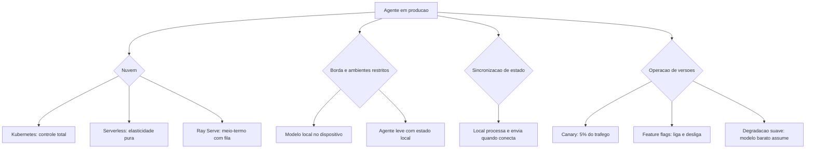

# Capítulo 12: Estratégias de Implantação

## 1. Introdução

No Capítulo 11, você instalou o radar e a caixa-preta. Agora o sistema precisa **pousar no mundo real**: a implantação em produção — o momento em que a arquitetura encontra a infraestrutura. Este capítulo cobre as estratégias de implantação de agentes: **nuvem e orquestração** (Kubernetes, serverless, Ray Serve), **borda e ambientes restritos** (dispositivos, redes isoladas, requisitos de soberania), **arquiteturas híbridas** (o melhor dos dois mundos), e a **operação de versões** — versionamento, canary, feature flags e degradação suave.

A premissa é a mesma de toda a Parte III: implantação não é o fim do projeto — é o início da operação contínua. Na Torre de Controle, é o capítulo da infraestrutura do aeroporto: onde as aeronaves estacionam, como a capacidade cresce em dias de pico, e como um pouso forçado acontece sem virar acidente.

## 2. Explica

A implantação de sistemas agênticos combina duas infraestruturas que a indústria estava aprendendo a operar separadamente: a de **aplicações web tradicionais** (Kubernetes, serverless, filas, bancos) e a de **modelos de IA** (servidores de inferência, GPUs, filas de batch). O padrão consolidado de 2026 é a implantação em **nuvem com orquestração de contêineres**: o agente roda como serviço em Kubernetes, com o modelo servido por uma camada de inferência dedicada (vLLM, Ray Serve, APIs gerenciadas) — e a comunicação entre as duas camadas via protocolos padrão (MCP, HTTP) [1]. A documentação de referência do Kubernetes para agentes consolidou o padrão do "Agent Sandbox": o agente roda isolado em um sandbox com políticas de rede e recursos — a combinação de orquestração de aplicação com isolamento de segurança [2].

A escolha entre as formas de execução é um trade-off conhecido da engenharia de plataformas, agora aplicado a agentes. **Kubernetes** oferece controle total: escalabilidade por métricas customizadas (as do Capítulo 11), políticas de rede, pinagem de GPU — o custo é a complexidade operacional. **Serverless** oferece elasticidade pura: escala a zero quando não há demanda e explode sob pico — o custo é o cold start (o tempo de subir o contêiner) e as limitações de duração e estado, o que afeta agentes de tarefas longas. **Ray Serve** — o framework da Ray para servir modelos e agentes — oferece o meio-termo: escalamento de réplicas com fila de requisições, roteamento por versão e integração direta com a camada de inferência [3]. A decisão é funcional: agente de tarefa curta e síncrona → serverless; agente de tarefa longa com estado → Kubernetes ou Ray Serve; mistura → arquitetura híbrida.

A **borda e os ambientes restritos** são o segundo grande tema — e o mais crescente. Muitos casos de uso agênticos não podem mandar dados para a nuvem: requisitos de soberania de dados (LGPD, GDPR, reguladores setoriais), latência extrema (dispositivos, fábricas), ou conectividade intermitente (operações de campo). O padrão para esses cenários: **modelo local** (ou um modelo local "pequeno" + um modelo "grande" na nuvem para os casos difíceis — a arquitetura híbrida local-nuvem), **agente leve** no dispositivo, e **sincronização de estado** com a nuvem quando a conexão permite [4]. A arquitetura híbrida é a resposta técnica ao dilema: dados sensíveis ficam no local com o modelo local; os casos que exigem capacidade superior são enviados à nuvem com política explícita — e o roteamento (Capítulo 4) decide onde cada tarefa é processada [5].

O terceiro tema é a **operação de versões** — o ciclo de vida da mudança em produção. As técnicas consolidadas: o **versionamento** do agente inteiro (prompt + modelo + base + ferramentas como uma unidade — o Capítulo 8 já estabeleceu o registro de versões); o **canary** (lançar a nova versão para 5% do tráfego, comparar métricas com a linha de base, expandir gradualmente — a técnica padrão da indústria para mudanças de comportamento não-determinístico, que exige observação antes de escala); as **feature flags** (ligar/desligar comportamentos sem novo deploy — o controle fino de mudanças); e a **degradação suave** (quando o modelo de raciocínio caro cai, o agente continua com o modelo barato; quando a nuvem cai, o agente local assume com o conjunto de tarefas que sabe fazer — o pouso forçado sem acidente) [6]. A combinação canary + feature flag + degradação suave é o que permite às equipes mudar agentes em produção com risco controlado — a resposta prática ao não-determinismo [7].

### A Estratégia de Escala em Três Alavancas

Escalar sistemas agênticos não é "adicionar mais máquinas" — é escolher entre três alavancas com consequências diferentes. A primeira é a **escala vertical**: aumentar a capacidade do nó existente — mais CPU, mais memória, mais GPU — a alavanca mais simples, adequada a cargas previsíveis, com teto físico e custo não-linear (o nó duas vezes maior custa mais que o dobro); a prática a reserva para os componentes de estado — o banco de memória do Capítulo 2, o orquestrador central do Capítulo 5 — que escalam mal horizontalmente [4]. A segunda é a **escala horizontal**: adicionar nós — réplicas do agente atrás do balanceador — a alavanca dos sistemas stateless, e a mais importante para agentes: réplicas processam tarefas em paralelo, o autoscaler adiciona nós quando a fila cresce e remove quando esvazia, e a regra de ouro é **toda carga de trabalho agêntica deve ser desenhada stateless** (o estado vive na memória externa e na trilha, não no processo) — a violação da regra é a causa raiz mais comum de bugs intermitentes em produção: a tarefa foi parar na réplica errada e a memória da conversa ficou na réplica original [6]. A terceira é a **escala elástica**: a combinação das duas com a curva de demanda — escalar horizontalmente para a base da demanda (o tráfego estável), verticalmente para os picos curtos (o pico de segunda-feira à noite), e usar a nuvem como reservatório (o burst de fim de ano não compra infraestrutura, aluga) [7].

A segunda dimensão da estratégia é a **fila como amortecedor**: sistemas agênticos recebem cargas irregulares — um lote de mil chamados chega em segundos — e a resposta madura não é dimensionar para o pico, é **enfileirar com prioridade e medir o tempo na fila como métrica de primeira classe** (o p99 do tempo na fila é a métrica que o usuário sente quando o sistema está sobrecarregado; a latência do modelo só vem depois) [6]. A terceira dimensão é o **teto de custo operacional**: a escala elástica precisa de limite — o autoscaler sem teto transforma um pico de demanda em fatura de nuvem; a prática é o teto por tarefa (o orçamento do Capítulo 9) combinado com o teto por recurso (o máximo de nós da implantação), com o alerta disparando antes do teto, não depois [7].

A síntese da estratégia é o princípio que o capítulo inteiro sustenta: **escala é uma decisão de arquitetura, não um acidente de operação** — o desenho stateless, a fila com prioridade, o teto de custo e a elasticidade com regra definem o comportamento do sistema sob carga com a mesma precisão que o prompt define o comportamento sob conversa [6]. E a degradação suave — o agente local assumindo com o conjunto de tarefas que sabe fazer quando a nuvem cai, o modelo barato quando o caro falha — é a última peça: escalar não é só crescer; é também **encolher com dignidade** [7].

## 3. Ilustra

### O Aeroporto, os Hangares e o Plano de Contingência

Voltemos à Torre de Controle. A implantação é a infraestrutura do aeroporto. O **pátio principal** (Kubernetes) estaciona as aeronaves da frota regular com controle total de posições e abastecimento. Os **hangares sob demanda** (serverless) aparecem e desaparecem conforme a demanda: no feriado, mais hangares; na calmaria, nenhum — sem custo de manutenção quando vazios. O **hangar local de aeroportos menores** (borda) opera com autonomia total quando a conexão com o centro cai, sincronizando depois — a operação não para. E o **plano de contingência** (degradação suave) é o procedimento de pouso forçado: se a pista principal fecha, as aeronaves pousam na pista auxiliar com procedimentos reduzidos — voo continua, padrão menor, nenhum acidente [2].



### Por Que o Canary é Obrigatório — e Não Opcional

A segunda camada de analogia trata do ponto mais difícil: por que agentes exigem canary mesmo quando "nada mudou de código". Imagine a companhia aérea que troca o manual de procedimentos da noite para o dia, com todas as aeronaves aplicando o novo manual na mesma semana — sem acompanhar o desempenho. Se o manual tiver um erro sutil (o mesmo problema do Capítulo 10 — regressão silenciosa), a frota inteira erra junto. O procedimento seguro é o óbvio: testar com uma aeronave, observar, expandir. Com agentes, qualquer mudança de prompt, modelo ou base é uma mudança de **comportamento** — e comportamento não-determinístico não se valida em testes, observa-se em produção [6]. Como Engenheiro Agêntico, você vai perceber que o canary não é um luxo de empresa grande: é o mecanismo que permite mudar rápido sem apostar a operação inteira em cada atualização [7].

## 4. Técnica

### Manifests de Implantação com Autoscaling por Métricas de Agente

A primeira técnica é o **manifesto de implantação com autoscaling por métricas de agente** — a configuração que liga a escala da infraestrutura às métricas do Capítulo 11 (fila, latência, uso de tokens), em vez de CPU genérica [1].

```yaml
# implantacao_agente.yaml
# Deployment do agente com autoscaling por fila e replicas canary
apiVersion: apps/v1
kind: Deployment
metadata:
  name: agente-suporte
  labels:
    app: agente-suporte
    versao: "2.3"
spec:
  replicas: 3
  selector:
    matchLabels:
      app: agente-suporte
  template:
    metadata:
      labels:
        app: agente-suporte
        versao: "2.3"
    spec:
      containers:
        - name: agente
          image: registry.internal/agente-suporte:2.3
          ports:
            - containerPort: 8080
          env:
            - name: MODELO_PADRAO
              value: "rapido"
            - name: MODELO_RACIOCINIO
              value: "raciocinio"
            - name: LIMITE_AUTONOMIA
              value: "3"
          resources:
            requests:
              cpu: "500m"
              memory: "512Mi"
            limits:
              cpu: "2"
              memory: "2Gi"
          readinessProbe:
            httpGet:
              path: /healthz
              port: 8080
---
apiVersion: autoscaling/v2
kind: HorizontalPodAutoscaler
metadata:
  name: agente-suporte-hpa
spec:
  scaleTargetRef:
    apiVersion: apps/v1
    kind: Deployment
    name: agente-suporte
  minReplicas: 2
  maxReplicas: 12
  metrics:
    - type: Pods
      pods:
        metric:
          name: fila_tarefas_aguardando
        target:
          type: AverageValue
          averageValue: "50"
```

### Canary e Feature Flags na Prática

A segunda técnica é o **controle de tráfego canary com feature flags** — a implementação do release gradual com comparação de métricas e reversão imediata [6].

```python
# canary_flags.py
# -*- coding: utf-8 -*-
"""Release canary com feature flags e comparacao de metricas."""

from dataclasses import dataclass, field
from typing import Optional


@dataclass
class Versao:
    nome: str
    peso_trafego: float  # 0.0 a 1.0


class ControleCanary:
    """Distribui trafego entre versoes e decide expansao ou reversao."""

    def __init__(self) -> None:
        self.versoes: list[Versao] = []
        self.flags: dict[str, bool] = {}

    def configurar(self, versao: str, peso: float) -> None:
        self.versoes.append(Versao(versao, peso))

    def rotear(self, usuario_id: str) -> str:
        """Roteia o usuario para uma versao conforme os pesos."""
        semente = sum(ord(c) for c in usuario_id) % 100
        acumulado = 0.0
        for versao in self.versoes:
            acumulado += versao.peso_trafego * 100
            if semente < acumulado:
                return versao.nome
        return self.versoes[-1].nome

    def set_flag(self, nome: str, valor: bool) -> None:
        self.flags[nome] = valor

    def flag_ativa(self, nome: str) -> bool:
        return self.flags.get(nome, False)


def main() -> None:
    controle = ControleCanary()
    controle.configurar("v2.3-estavel", 0.95)
    controle.configurar("v2.4-canary", 0.05)
    controle.set_flag("novo_fluxo_reembolso", True)
    distribuicao = {}
    for usuario in [f"u{i}" for i in range(200)]:
        versao = controle.rotear(usuario)
        distribuicao[versao] = distribuicao.get(versao, 0) + 1
    print("distribuicao:", distribuicao)
    print("flag ativa:", controle.flag_ativa("novo_fluxo_reembolso"))


if __name__ == "__main__":
    main()
```

### Degradação Suave e Sincronização de Estado

A terceira técnica é o **controlador de degradação suave** — o mecanismo que mantém o serviço operando com capacidade reduzida quando um componente falha, e a sincronização de estado entre borda e nuvem [5].

```python
# degradacao_suave.py
# -*- coding: utf-8 -*-
"""Degradacao suave com fallback de modelo e sincronizacao local-nuvem."""

from dataclasses import dataclass, field
from typing import Optional


@dataclass
class EventoLocal:
    tarefa_id: str
    dados: str
    sincronizado: bool = False


class OperacaoBorda:
    """Opera no dispositivo com fallback e sincroniza quando conecta."""

    def __init__(self) -> None:
        self.modo: str = "nuvem"
        self.eventos_pendentes: list[EventoLocal] = []
        self.modelo_ativo: str = "grande"

    def detectar_queda_nuvem(self) -> None:
        self.modo = "borda"
        self.modelo_ativo = "local_pequeno"

    def processar(self, tarefa: str, dados: str) -> str:
        """Processa com o modelo ativo; em modo borda, fila para sincronizar."""
        if self.modo == "nuvem":
            return f"processado na nuvem por modelo {self.modelo_ativo}: {tarefa}"
        self.eventos_pendentes.append(EventoLocal(tarefa, dados))
        return f"processado localmente (pendente de sincronizacao): {tarefa}"

    def sincronizar(self) -> int:
        """Envia os eventos pendentes a nuvem quando a conexao volta."""
        total = len(self.eventos_pendentes)
        for evento in self.eventos_pendentes:
            evento.sincronizado = True
        self.eventos_pendentes = []
        self.modo = "nuvem"
        self.modelo_ativo = "grande"
        return total


def main() -> None:
    borda = OperacaoBorda()
    print(borda.processar("t1", "dados-sensiveis"))
    borda.detectar_queda_nuvem()
    print(borda.processar("t2", "dados-sensiveis"))
    print(borda.processar("t3", "dados-sensiveis"))
    print(f"sincronizados: {borda.sincronizar()} eventos")


if __name__ == "__main__":
    main()
```

### Tabela de Decisão de Implantação

A tabela final condensa o capítulo: (1) tarefas curtas síncronas com pico imprevisível → serverless; (2) tarefas longas com estado e GPU → Kubernetes ou Ray Serve; (3) dados sensíveis que não saem da rede → borda com modelo local + sincronização; (4) latência extrema no dispositivo → modelo local pequeno + agente leve; (5) mistura → arquitetura híbrida com roteamento local-nuvem; (6) mudanças frequentes de comportamento → canary + feature flags obrigatórios; (7) dependência crítica de um fornecedor → degradação suave com fallback documentado [2] [6].

## 5. Aplica

### A Cena de Contraste: O Lançamento que Parou o Atendimento

Sua equipe lança a versão 3.0 do agente de suporte — "recomendamos atualizar todos de uma vez para evitar versões diferentes". O deploy acontece em uma noite. Na manhã seguinte, o caos: a taxa de erro dispara (o novo prompt tem um bug sutil que só aparece em 8% dos casos — impossível de ver no teste manual); o custo exploda (a nova versão usa o modelo de raciocínio em todas as tarefas); e o rollback demora 40 minutos porque o versionamento do agente não estava preparado — não existe "voltar", só "consertar em produção" [6].

O diagnóstico: lançamento "big bang" de comportamento não-determinístico, sem canary, sem flags, sem rollback preparado — a combinação que transforma um bug pequeno em incidente de uma manhã inteira. A correção estrutural: (1) instituir o canary padrão — 5% do tráfego na nova versão, comparação com a linha de base (as métricas do Capítulo 11), expansão gradual só com paridade; (2) feature flags para os comportamentos novos (o fluxo problemático pode ser desligado sem deploy); (3) rollback preparado: a versão anterior fica sempre implantável em minutos (o registro de versões do Capítulo 8); (4) degradação suave: se o modelo de raciocínio cair, o agente opera com o modelo rápido com capacidade reduzida — serviço de pé, padrão menor [7]. Resultado: a próxima versão 3.1 entra com canary, detecta o problema na primeira hora no 5% de tráfego, reverte a flag e continua o lançamento no dia seguinte — com a lição registrada no loop de feedback.

Armadilhas comuns: lançar tudo de uma vez por "simplicidade"; versionar o código mas não o comportamento (prompt/modelo/base); e não ter plano de degradação para a dependência mais crítica [2].

## 6. Conclusão

Este capítulo pousou o sistema no mundo real. Você aprendeu (1) a implantação em nuvem com orquestração — Kubernetes, serverless e Ray Serve com autoscaling por métricas de agente; (2) a borda e os ambientes restritos — modelo local, sincronização de estado e a arquitetura híbrida local-nuvem; e (3) a operação de versões — versionamento, canary, feature flags e degradação suave, com o lançamento gradual como norma para comportamento não-determinístico. Desafio: desenhe o plano de implantação do seu agente — onde roda, como escala, como lança e como cai com segurança.

A Parte IV começa: governança e mercado — o profissional agêntico. O próximo capítulo trata da segurança e proteção: os vetores de ataque contra agentes e as estratégias defensivas. Na torre, é o protocolo de segurança: quem pode voar, com quais autorizações, e como se defende de quem tenta invadir o espaço aéreo.

## 7. Referências Bibliográficas

[1] PREMAI. *Deploying LLMs on Kubernetes: vLLM, Ray Serve & GPU Scheduling Guide*. Disponível em: https://www.premai.io/blog/deploying-llms-on-kubernetes-vllm-ray-serve-gpu-scheduling-guide-2026/. Acesso em: 07 ago. 2026.
[2] KUBERNETES. *Running Agents on Kubernetes with Agent Sandbox*. Disponível em: https://kubernetes.io/blog/2026/03/20/running-agents-on-kubernetes-with-agent-sandbox/. Acesso em: 07 ago. 2026.
[3] RAY PROJECT. *Deploy on Kubernetes — Ray Serve*. Disponível em: https://docs.ray.io/en/latest/serve/production-guide/kubernetes.html. Acesso em: 07 ago. 2026.
[4] ANYSCALE. *AI agents on Ray Serve: Single to multi-agent architecture*. Disponível em: https://www.anyscale.com/blog/ai-agents-on-ray-serve-single-to-multi-agent-architecture. Acesso em: 07 ago. 2026.
[5] ARUNKUMAR, V.; GANGADHARAN, G. R.; BUYYA, Rajkumar. *Agentic Artificial Intelligence (AI): Architectures, Taxonomies, and Evaluation of Large Language Model Agents*. Disponível em: https://arxiv.org/abs/2601.12560. Acesso em: 07 ago. 2026.
[6] GARTNER. *Gartner Predicts Over 40% of Agentic AI Projects Will Be Canceled by End of 2027*. Disponível em: https://www.gartner.com/en/newsroom/press-releases/2025-06-25-gartner-predicts-over-40-percent-of-agentic-ai-projects-will-be-canceled-by-end-of-2027. Acesso em: 07 ago. 2026.
[7] ABOU ALI, Mohamad; DORNAIKA, Fadi; CHARAFEDDINE, Jinan. *Agentic AI: A Comprehensive Survey of Architectures, Applications, and Challenges*. Disponível em: https://arxiv.org/abs/2510.25445. Acesso em: 07 ago. 2026.
[8] DELOITTE. *Agentic AI in enterprise: Adoption, risk, and transformation*. Disponível em: https://www.deloitte.com/content/dam/assets-zone3/us/en/docs/services/consulting/2025/agentic-ai-enterprise-adoption-guide.pdf. Acesso em: 07 ago. 2026.
[9] OWASP GEN AI SECURITY PROJECT. *OWASP Top 10 for Agentic Applications for 2026*. Disponível em: https://genai.owasp.org/resource/owasp-top-10-for-agentic-applications-for-2026/. Acesso em: 07 ago. 2026.
[10] OWASP. *AI Agent Security Cheat Sheet*. Disponível em: https://cheatsheetseries.owasp.org/cheatsheets/AI_Agent_Security_Cheat_Sheet.html. Acesso em: 07 ago. 2026.
[11] LANGCHAIN. *Workflows and agents — Docs*. Disponível em: https://docs.langchain.com/oss/python/langgraph/workflows-agents. Acesso em: 07 ago. 2026.
[12] LANGCHAIN. *Graph API overview — Docs*. Disponível em: https://docs.langchain.com/oss/python/langgraph/graph-api. Acesso em: 07 ago. 2026.
[13] LANGCHAIN. *Trace with OpenTelemetry — LangSmith Docs*. Disponível em: https://docs.langchain.com/langsmith/trace-with-opentelemetry. Acesso em: 07 ago. 2026.
[14] OPENTELEMETRY. *Inside the LLM Call: GenAI Observability with OpenTelemetry*. Disponível em: https://opentelemetry.io/blog/2026/genai-observability/. Acesso em: 07 ago. 2026.
[15] OPENTELEMETRY. *Semantic Conventions for Generative AI*. Disponível em: https://github.com/open-telemetry/semantic-conventions-genai. Acesso em: 07 ago. 2026.
[16] EUROPEAN COMMISSION. *General-purpose AI obligations under the AI Act*. Disponível em: https://digital-strategy.ec.europa.eu/en/factpages/general-purpose-ai-obligations-under-ai-act. Acesso em: 07 ago. 2026.
[17] EUROPEAN COMMISSION. *The General-Purpose AI Code of Practice*. Disponível em: https://digital-strategy.ec.europa.eu/en/node/13953/printable/pdf. Acesso em: 07 ago. 2026.
[18] MODEL CONTEXT PROTOCOL. *Specification 2026-07-28*. Disponível em: https://modelcontextprotocol.io/specification/2026-07-28. Acesso em: 07 ago. 2026.
[19] SORIA PARRA, David; DELIMARSKY, Den. *The 2026-07-28 Specification | MCP Blog*. Disponível em: https://blog.modelcontextprotocol.io/posts/2026-07-28/. Acesso em: 07 ago. 2026.
[20] ANTHROPIC. *Code execution with MCP: building more efficient AI agents*. Disponível em: https://www.anthropic.com/engineering/code-execution-with-mcp. Acesso em: 07 ago. 2026.
