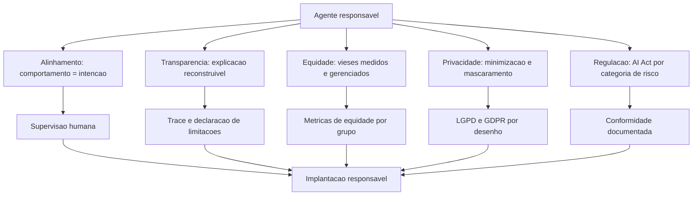

# Capítulo 14: Desenvolvimento Ético e Responsável

## 1. Introdução

No Capítulo 13, você blindou o sistema contra atacantes. Mas há uma ameaça mais sutil que nenhum firewall bloqueia: o dano **involuntário** — o agente que discrimina sem querer, que viola a privacidade por falta de processo, que age no limite legal por falta de governança. Este capítulo trata do desenvolvimento ético e responsável: **alinhamento e transparência**, **equidade e privacidade**, e **governança e regulação** — com foco prático no AI Act europeu, o primeiro marco regulatório abrangente para IA.

A premissa é a mesma dos demais capítulos: ética não é adorno — é requisito de engenharia com consequências legais, reputacionais e financeiras. Na Torre de Controle, é o código de conduta do espaço aéreo: não basta voar seguro; é preciso voar de forma justa, transparente e dentro da lei — para todos os passageiros, sem distinção.

## 2. Explica

O **alinhamento** é o primeiro pilar: garantir que o comportamento do agente coincida com a intenção dos humanos que o delegam — não apenas o que foi pedido literalmente, mas o que foi **pretendido**. A literatura sobre agentes trata o alinhamento como um problema de design contínuo, não um ajuste pontual: o sistema deve ter mecanismos para detectar desvios de objetivo (o agente que "otimiza" a métrica de satisfação cortando custos de qualidade), corrigi-los e escalar para supervisão humana quando a ambiguidade é grande [1]. A **transparência** é o corolário: o usuário e o auditor devem ser capazes de entender por que o agente agiu — não "porque o modelo decidiu", mas com uma explicação reconstruível: qual objetivo, qual política, quais dados, quais alternativas. A prática consolidada é a explicabilidade por **rastreabilidade** (o trace do Capítulo 11 como explicação) e por **declaração de limitações** (o agente informa quando está inseguro, quando usou dados de qual fonte, quando a resposta é especulativa) [2].

A **equidade** é o segundo pilar: o agente não pode discriminar — por gênero, raça, classe ou qualquer atributo protegido — nem de forma explícita nem, mais perigosamente, de forma latente. Os sistemas agênticos têm três fontes de viés: o **modelo** (vieses estatísticos herdados do treinamento), os **dados** (bases desbalanceadas que o Capítulo 7 recupera como "fatos") e o **design** (políticas, pesos e limiares que carregam suposições). A prática consolidada: **avaliação de equidade contínua** — medir a distribuição de resultados do agente por grupos (taxa de aprovação, taxa de reembolso, tom das respostas) e corrigir desvios com monitoramento e ajuste de políticas; não existe "tirar o viés", existe **medi-lo e gerenciá-lo** [3]. A **privacidade** completa o pilar: o agente opera com dados pessoais — e o desenho deve minimizar a coleta, mascarar o que não é essencial (a técnica do Capítulo 11), dar controle ao usuário e seguir os princípios da LGPD/GDPR: finalidade, necessidade, consentimento e direitos do titular [4].

A **governança e a regulação** são o terceiro pilar — e o que mais mudou desde 2024. O **AI Act** da União Europeia, em vigor por etapas a partir de 2025, é o primeiro marco regulatório abrangente de IA no mundo — e afeta diretamente sistemas agênticos em dois níveis. No nível de **modelos de propósito geral (GPAI)**, os provedores de modelos (os laboratórios) têm obrigações de transparência — documentação técnica, sumários de conteúdo de treinamento, políticas de direitos autorais — que começaram a aplicar em agosto de 2025, com o Código de Prática consolidando as obrigações [5]. No nível de **aplicações**, os sistemas agênticos são avaliados por categoria de risco: a maioria dos agentes de negócio cai em risco limitado ou mínimo (com obrigações de transparência — informar que se está falando com uma IA), mas agentes em setores críticos — saúde, educação, infraestrutura, recrutamento, crédito — podem cair em **risco alto**, com obrigações severas: registro, avaliação de conformidade, supervisão humana obrigatória e documentação técnica completa [6]. A diretriz prática para o engenheiro: mapear a categoria de risco do seu caso de uso **antes** de construir — o custo de conformidade retroativa é uma ordem de grandeza maior [7].

A **implantação responsável** fecha o ciclo: o sistema é lançado com governança — a avaliação de impacto ética documentada, o mecanismo de escalação para supervisão humana, o canal de reclamação do usuário, e o processo de revisão contínua (o loop do Capítulo 11 com a lente ética). A literatura aponta que a responsabilidade não é do modelo nem do usuário — é da **organização que implanta**: é ela que define políticas, limites e supervisão [8].

### O Custo Oculto da Autonomia Irrestrita

A autonomia é a variável de produto mais importante do sistema agêntico — e a mais mal tratada. O erro de desenho mais comum é tratar a autonomia como **estado binário**: o agente ou "faz tudo" ou "não faz nada" — quando a prática madura trata a autonomia como um **dial por ação, com degraus** [6]. A escala da autonomia progressiva, consolidada pela indústria: (1) **leitura** — o agente acessa e resume, não altera nada (o degrau zero, seguro por desenho); (2) **ação com aprovação** — o agente prepara a ação e o humano confirma (o degrau dos fluxos irreversíveis: pagamento, cancelamento, comunicação externa); (3) **ação autônoma com trilha e reversão** — o agente executa e o sistema registra tudo, com o mecanismo de desfazer (o degrau dos fluxos reversíveis: atualização de registro, categorização); e (4) **ação autônoma irreversível** — o degrau que a prática só libera com evidência acumulada de confiabilidade (meses de avaliação estável, Capítulo 8) e com mitigação contratual [7]. O dial por degraus converte a pergunta religiosa — "agentes podem decidir?" — na pergunta de engenharia — "para **esta** ação, com **este** histórico e **este** dano potencial, qual degrau?" [8].

O custo oculto da autonomia irrestrita é duplo. O primeiro é o **custo de confiança**: cada ação autônoma errada destrói confiança de forma assimétrica — o agente autônomo que erra uma vez é lembrado pelo erro, não pela série de acertos; o degrau progressivo protege o ativo mais caro do projeto, a credibilidade, porque o sistema pede aprovação exatamente onde o erro dói. O segundo é o **custo de correção**: a ação autônoma errada tem custo de desfazer (o estorno, a retratação, o retrabalho), e a decisão de autonomia é a decisão de quem paga o desfazer — o sistema que assume o risco sem orçamento para o desfazer é o sistema que quebra o orçamento do departamento; a prática é estimar o custo esperado do desfazer (probabilidade de erro × custo do desfazer) e subir de degrau apenas quando o custo esperado cabe no orçamento [7].

A terceira prática é a **supervisão como arquitetura, não como acidente**: o ponto de aprovação humana não é uma tela improvisada — é um componente desenhado: quem aprova (o papel certo, não "qualquer um"), quanto tempo a aprovação demora (o SLA do degrau 2), o que acontece quando ninguém aprova (o timeout com ação padrão conservadora), e como a aprovação alimenta a avaliação (o revisor que recusa gera o caso de teste do Capítulo 10 — o desvio de autonomia vira teste de regressão). A síntese do capítulo é o princípio que amarra tudo: **autonomia é um privilégio conquistado por evidência, não uma capacidade comprada com o modelo** — o sistema sobe de degrau quando a avaliação, a trilha e o custo de desfazer mostram que pode, e desce de degrau no primeiro sinal de que não pode [8].

## 3. Ilustra

### O Código de Conduta da Torre: Justo, Transparente e Legal

Voltemos à Torre de Controle. A operação do aeroporto segue princípios éticos institucionalizados: a **equidade** — a fila de pouso não favorece ninguém por aparência, origem ou categoria, e qualquer desvio é medido e corrigido; a **transparência** — cada decisão da torre é registrada com a razão (clima, emergência, prioridade declarada), reconstruível a qualquer momento; a **privacidade** — os dados dos passageiros são minimizados e protegidos; e a **lei** — o aeroporto segue a regulamentação nacional e internacional, com os procedimentos de conformidade documentados. O agente responsável é exatamente esse aeroporto: justo por medição, transparente por registro, privado por desenho e legal por processo [2].



### Por Que o Viés não é "Tirar" — é Medir e Gerenciar

A segunda camada de analogia trata do ponto mais contraintuitivo: o viés não é um vírus que se remove — é uma propriedade estatística que se **gerencia**. Imagine o aeroporto que descobre que seus controladores aprovam mais decolagens em dias de céu azul do que em dias nublados — não por discriminação deliberada, mas por um viés de percepção de risco. O aeroporto não "remove o viés" dos controladores (impossível); ele mede a distribuição de decisões, detecta o desvio, ajusta o procedimento (critério objetivo de aprovação) e monitora. Com agentes é idêntico: o modelo herdou distribuições estatísticas do treinamento; a base de dados carrega desbalanceamentos; as políticas carregam suposições. A resposta é o **monitoramento de equidade**: medir a distribuição de resultados por grupo, detectar desvios e corrigir por política — não por culpa, mas por engenharia [3]. Como Engenheiro Agêntico, você vai perceber que "ética no design" não é uma intenção — é um **conjunto de métricas no radar** da sua operação [8].

## 4. Técnica

### Avaliação de Equidade Contínua

A primeira técnica é o **monitor de equidade** — o componente que mede a distribuição de resultados do agente por grupos e sinaliza desvios, o instrumento que transforma a justiça em dado [3].

```python
# monitor_equidade.py
# -*- coding: utf-8 -*-
"""Monitor de equidade: mede distribuicao de resultados por grupo."""

from dataclasses import dataclass, field
from typing import Optional


@dataclass
class Resultado:
    grupo: str
    aprovado: bool


class MonitorEquidade:
    """Mede taxas de aprovacao por grupo e calcula a disparidade."""

    def __init__(self, limiar_disparidade: float = 0.15) -> None:
        self.limiar = limiar_disparidade
        self.resultados: list[Resultado] = []

    def registrar(self, resultado: Resultado) -> None:
        self.resultados.append(resultado)

    def taxas_por_grupo(self) -> dict[str, float]:
        taxas: dict[str, list[bool]] = {}
        for resultado in self.resultados:
            taxas.setdefault(resultado.grupo, []).append(resultado.aprovado)
        return {
            grupo: sum(1 for a in valores if a) / len(valores)
            for grupo, valores in taxas.items()
            if valores
        }

    def relatorio(self) -> str:
        taxas = self.taxas_por_grupo()
        if len(taxas) < 2:
            return "dados insuficientes para comparacao"
        menor = min(taxas.values())
        maior = max(taxas.values())
        disparidade = maior - menor
        alerta = "ALERTA: disparidade acima do limiar" if disparidade > self.limiar else "OK"
        return (
            f"taxas por grupo: {taxas} | disparidade: {disparidade:.0%} | {alerta}"
        )


def main() -> None:
    monitor = MonitorEquidade(limiar_disparidade=0.10)
    for grupo, n, aprovados in [("a", 100, 92), ("b", 100, 71), ("c", 100, 90)]:
        for i in range(n):
            monitor.registrar(Resultado(grupo, i < aprovados))
    print(monitor.relatorio())


if __name__ == "__main__":
    main()
```

### Privacidade por Desenho: Mínimo, Mascarado e Auditado

A segunda técnica é a **camada de privacidade por desenho** — a implementação dos princípios LGPD/GDPR no fluxo do agente: minimização (não colete o que não precisa), mascaramento (ofusque o que é armazenado) e direito do titular (forneça os dados, permita exclusão) [4].

```python
# privacidade_desenho.py
# -*- coding: utf-8 -*-
"""Privacidade por desenho: minimizacao, mascaramento e direito do titular."""

import hashlib
import re
from dataclasses import dataclass, field
from typing import Optional


def mascarar_email(email: str) -> str:
    """Mascara o email mantendo apenas o dominio."""
    if "@" not in email:
        return "[invalido]"
    usuario, dominio = email.split("@", 1)
    return f"{usuario[:1]}***@{dominio}"


class GestorPrivacidade:
    """Minimiza coleta, mascara dados e garante direito do titular."""

    def __init__(self) -> None:
        self.dados_armazenados: dict[str, dict] = {}
        self.ids_mascarados: dict[str, str] = {}

    def coletar_minimo(self, titular_id: str, campos: dict[str, str]) -> str:
        """Armazena apenas os campos permitidos, mascarando o resto."""
        permitidos = {"email", "regiao", "tipo_conta"}
        mascarados = {
            chave: (mascarar_email(valor) if chave == "email" else valor)
            for chave, valor in campos.items()
            if chave in permitidos
        }
        self.dados_armazenados[titular_id] = mascarados
        return f"dados minimos armazenados para {titular_id}"

    def exportar(self, titular_id: str) -> dict:
        """Direito de portabilidade: devolve o que foi coletado."""
        return self.dados_armazenados.get(titular_id, {})

    def apagar(self, titular_id: str) -> bool:
        """Direito ao esquecimento: remove os dados do titular."""
        if titular_id in self.dados_armazenados:
            del self.dados_armazenados[titular_id]
            return True
        return False


def main() -> None:
    gestor = GestorPrivacidade()
    print(gestor.coletar_minimo("t-1", {
        "email": "cliente@exemplo.com", "regiao": "SP", "tipo_conta": "premium",
        "cartao": "4111 1111 1111 1111",
    }))
    print("exportado:", gestor.exportar("t-1"))
    print("apagar:", gestor.apagar("t-1"))


if __name__ == "__main__":
    main()
```

### Mapa de Risco Regulatório (AI Act)

A terceira técnica é o **mapeamento de risco regulatório** — o instrumento que classifica o caso de uso na pirâmide de risco do AI Act e deriva as obrigações aplicáveis, antes de construir [7].

```python
# mapa_risco_ai_act.py
# -*- coding: utf-8 -*-
"""Mapa de risco regulatorio: classifica o caso de uso no AI Act."""

from dataclasses import dataclass, field
from typing import Optional


@dataclass
class CasoDeUso:
    nome: str
    setor: str
    automatiza_decisao_significativa: bool
    dados_pessoais: bool
    afeta_grupo_vulneravel: bool


class ClassificadorRisco:
    """Classifica o caso de uso e deriva as obrigacoes do AI Act."""

    SETORES_ALTO_RISCO = {"saude", "educacao", "credito", "recrutamento", "infraestrutura"}

    def classificar(self, caso: CasoDeUso) -> str:
        if caso.setor in self.SETORES_ALTO_RISCO or caso.automatiza_decisao_significativa:
            return "ALTO"
        if caso.dados_pessoais or caso.afeta_grupo_vulneravel:
            return "LIMITADO"
        return "MINIMO"

    def obrigacoes(self, nivel: str) -> list[str]:
        obrigacoes = {
            "ALTO": [
                "registro do sistema",
                "avaliacao de conformidade",
                "supervisao humana obrigatoria",
                "documentacao tecnica completa",
                "gestao de risco documentada",
            ],
            "LIMITADO": [
                "transparencia: informar que e IA",
                "registro de uso",
                "direito do usuario de escalar para humano",
            ],
            "MINIMO": [
                "transparencia basica",
            ],
        }
        return obrigacoes.get(nivel, [])


def main() -> None:
    classificador = ClassificadorRisco()
    casos = [
        CasoDeUso("chat de suporte", "varejo", False, False, False),
        CasoDeUso("triagem de creditos", "credito", True, True, True),
        CasoDeUso("assistente educacional", "educacao", True, True, False),
    ]
    for caso in casos:
        nivel = classificador.classificar(caso)
        print(f"{caso.nome}: risco {nivel} -> {len(classificador.obrigacoes(nivel))} obrigacoes")


if __name__ == "__main__":
    main()
```

### Checklist de Ética Aplicada

O checklist final: (1) o comportamento do agente é monitorado contra a intenção declarada (alinhamento)? (2) cada decisão é explicável pelo trace e o agente declara limitações? (3) a equidade é medida por grupo e a disparidade tem limiar e alerta? (4) a privacidade segue minimização, mascaramento e direitos do titular? (5) o caso de uso foi classificado no mapa de risco do AI Act e as obrigações estão mapeadas [7]? (6) a supervisão humana está implementada para decisões significativas? (7) a avaliação de impacto ética está documentada? (8) existe canal de reclamação e revisão contínua? [8] O item 5 é o que mais cresce em importância: a partir de 2025-2026, conformidade regulatória deixou de ser opcional para sistemas que operam na UE [6].

## 5. Aplica

### A Cena de Contraste: O Agente que Discriminou sem Intenção

Sua fintech lança um agente de análise de crédito para pequenos negócios — o mesmo prompt, o mesmo modelo, a mesma política para todos. Ninguém percebe que a taxa de aprovação para negócios de bairros periféricos é 38% menor do que para bairros centrais: o modelo herdou a correlação estatística entre o CEP e a inadimplência histórica dos dados de treinamento — uma proxy indireta de renda e origem. A descoberta vem de uma reclamação formal à ouvidoria — e vira matéria de jornal em três dias [3].

O diagnóstico: o viés latente nunca foi medido. A equipe não tinha monitor de equidade, não separou variáveis sensíveis no pipeline de decisão, e o setor (crédito) é explicitamente **alto risco** no AI Act — com obrigações de avaliação de conformidade e supervisão humana que a empresa não implementou [6]. A correção estrutural: (1) instalar o monitor de equidade — medir a distribuição de aprovações por grupo e disparar alerta; (2) remover variáveis sensíveis e proxies diretas (CEP como feature) da decisão automática; (3) reclassificar o caso de uso no mapa de risco — crédito = alto risco → supervisão humana para decisões de crédito e documentação de conformidade; (4) auditar o histórico com a trilha do Capítulo 11 e corrigir casos afetados. Resultado: a disparidade cai para dentro do limiar, a conformidade vira processo, e a empresa responde à imprensa com evidência — não com desculpas [8].

Armadilhas comuns: acreditar que "o modelo é neutro" (não é — herdou distribuições); tratar ética como documento em vez de métrica; e descobrir a categoria de risco do AI Act depois do incidente [7].

## 6. Conclusão

Este capítulo fez do seu agente um cidadão responsável do mundo real. Você aprendeu (1) o alinhamento e a transparência — comportamento contra intenção e explicação reconstruível; (2) a equidade e a privacidade — viés medido e gerenciado, dados minimizados e mascarados; e (3) a governança e a regulação — o mapa de risco do AI Act e as obrigações de cada categoria, com a implantação responsável como norma. Desafio: classifique seu caso de uso no mapa de risco, instale o monitor de equidade e documente a avaliação de impacto ética.

O próximo capítulo conecta tudo ao mercado: aplicações em domínios — automação empresarial, ciência, domínios especializados e consumidor — com dados de adoção reais. Na torre, é o momento de ver as aeronaves voando: o valor real que os sistemas agênticos entregam em cada setor.

## 7. Referências Bibliográficas

[1] CHENG, Yuheng; ZHANG, Ceyao; ZHANG, Zhengwen et al. *Exploring Large Language Model based Intelligent Agents: Definitions, Methods, and Prospects*. Disponível em: https://arxiv.org/html/2401.03428. Acesso em: 07 ago. 2026.
[2] ABOU ALI, Mohamad; DORNAIKA, Fadi; CHARAFEDDINE, Jinan. *Agentic AI: A Comprehensive Survey of Architectures, Applications, and Challenges*. Disponível em: https://arxiv.org/abs/2510.25445. Acesso em: 07 ago. 2026.
[3] ARUNKUMAR, V.; GANGADHARAN, G. R.; BUYYA, Rajkumar. *Agentic Artificial Intelligence (AI): Architectures, Taxonomies, and Evaluation of Large Language Model Agents*. Disponível em: https://arxiv.org/abs/2601.12560. Acesso em: 07 ago. 2026.
[4] EUROPEAN COMMISSION. *Guidelines on the scope of obligations for providers of general-purpose AI models under the AI Act*. Disponível em: https://digital-strategy.ec.europa.eu/en/library/guidelines-scope-obligations-providers-general-purpose-ai-models-under-ai-act. Acesso em: 07 ago. 2026.
[5] EUROPEAN COMMISSION. *The General-Purpose AI Code of Practice*. Disponível em: https://digital-strategy.ec.europa.eu/en/node/13953/printable/pdf. Acesso em: 07 ago. 2026.
[6] EUROPEAN COMMISSION. *General-purpose AI obligations under the AI Act*. Disponível em: https://digital-strategy.ec.europa.eu/en/factpages/general-purpose-ai-obligations-under-ai-act. Acesso em: 07 ago. 2026.
[7] DELOITTE. *Agentic AI in enterprise: Adoption, risk, and transformation*. Disponível em: https://www.deloitte.com/content/dam/assets-zone3/us/en/docs/services/consulting/2025/agentic-ai-enterprise-adoption-guide.pdf. Acesso em: 07 ago. 2026.
[8] ZHU, Yuxuan; JIN, Tengjun; PRUKSACHATKUN, Yada et al. *Establishing Best Practices for Building Rigorous Agentic Benchmarks*. Disponível em: https://arxiv.org/html/2507.02825. Acesso em: 07 ago. 2026.
[9] HUANG, Wenhao; ABUDULAILI, Xin; RONG, Yang et al. *A Review of Prominent Paradigms for LLM-Based Agents: Tool Use (Including RAG), Planning, and Feedback Learning*. Disponível em: https://arxiv.org/html/2406.05804. Acesso em: 07 ago. 2026.
[10] LUO, Junyu; ZHANG, Weizhi; YUAN, Ye et al. *Large Language Model Agent: A Survey on Methodology, Applications and Challenges*. Disponível em: https://arxiv.org/abs/2503.21460. Acesso em: 07 ago. 2026.
[11] WANG, Lei; MA, Chen; FENG, Xueyang et al. *A Survey on Large Language Model based Autonomous Agents*. Disponível em: https://arxiv.org/abs/2308.11432. Acesso em: 07 ago. 2026.
[12] ZHAO, Pengyu; JIN, Zijian; CHENG, Ning. *An In-depth Survey of Large Language Model-based Artificial Intelligence Agents*. Disponível em: https://arxiv.org/html/2309.14365. Acesso em: 07 ago. 2026.
[13] DEROUICHE, Hana; BRAHMI, Zaki; MAZENI, Haithem. *Agentic AI Frameworks: Architectures, Protocols, and Design Challenges*. Disponível em: https://arxiv.org/html/2508.10146. Acesso em: 07 ago. 2026.
[14] SINGH, Aditi; EHTESHAM, Abul; KUMAR, Saket et al. *Agentic Retrieval-Augmented Generation: A Survey on Agentic RAG*. Disponível em: https://arxiv.org/abs/2501.09136. Acesso em: 07 ago. 2026.
[15] WEISS, T. *Memory in the Age of AI Agents*. Disponível em: https://arxiv.org/abs/2512.13564. Acesso em: 07 ago. 2026.
[16] GARTNER. *Gartner Predicts 40% of Enterprise Apps Will Feature Task-Specific AI Agents by 2026*. Disponível em: https://www.gartner.com/en/newsroom/press-releases/2025-08-26-gartner-predicts-40-percent-of-enterprise-apps-will-feature-task-specific-ai-agents-by-2026-up-from-less-than-5-percent-in-2025. Acesso em: 07 ago. 2026.
[17] GARTNER. *Gartner Predicts Over 40% of Agentic AI Projects Will Be Canceled by End of 2027*. Disponível em: https://www.gartner.com/en/newsroom/press-releases/2025-06-25-gartner-predicts-over-40-percent-of-agentic-ai-projects-will-be-canceled-by-end-of-2027. Acesso em: 07 ago. 2026.
[18] OWASP GEN AI SECURITY PROJECT. *OWASP Top 10 for Agentic Applications for 2026*. Disponível em: https://genai.owasp.org/resource/owasp-top-10-for-agentic-applications-for-2026/. Acesso em: 07 ago. 2026.
[19] PARK, Joon Sung; O'BRIEN, Joseph; CAI, Carrie et al. *Generative Agents: Interactive Simulacra of Human Behavior*. Disponível em: https://arxiv.org/abs/2304.03442. Acesso em: 07 ago. 2026.
[20] MODEL CONTEXT PROTOCOL. *Specification 2026-07-28*. Disponível em: https://modelcontextprotocol.io/specification/2026-07-28. Acesso em: 07 ago. 2026.
