# Capítulo 15: Aplicações em Domínios: Empresa e Consumidor

## 1. Introdução

No Capítulo 14, o agente tornou-se responsável — justo, transparente, privado e legal. Agora chegou a hora de vê-lo trabalhar. Este capítulo conecta toda a teoria à realidade do mercado: as aplicações de sistemas agênticos em **automação empresarial** (processos, suporte e decisão), **ciência e domínios especializados** e **aplicações para o consumidor** (assistentes, educação e IoT) — com os dados de adoção que separam o discurso da realidade.

O capítulo tem um duplo propósito: consolidar o conhecimento dos 14 anteriores em casos concretos de arquitetura — mostrando quais padrões, ferramentas e processos sustentam cada aplicação — e dar a você o mapa do valor: onde os agentes geram retorno real hoje e onde a promessa ainda não se materializou. Na Torre de Controle, é o dia de ver a malha aérea completa em operação: cada rota, cada tipo de aeronave, cada destino.

## 2. Explica

O panorama de adoção é a moldura dos casos. O Gartner previu que 40% das aplicações empresariais teriam agentes específicos de tarefa até 2026, contra menos de 5% em 2025 — e o dado mais revelador do mesmo relatório: o crescimento vem da **especialização**, não da generalização: agentes de tarefa única integrados a aplicações existentes, e não "superagentes" autônomos [1]. No mesmo período, a consultoria Deloitte estimou o mercado de IA agêntica em US$ 103,6 bilhões até 2032, com adoção acelerada em setores de alto volume transacional [2]. O contraponto honesto: o Gartner também prevê o cancelamento de mais de 40% dos projetos até 2027 — a adoção real exige a engenharia dos capítulos anteriores, não a compra de promessas [3]. O padrão que emerge é consistente: onde o caso é **bem delimitado, com retorno mensurável e dados disponíveis**, a adoção decola; onde o caso é vago ou o dado é escasso, o projeto morre [2].

Na **automação empresarial**, três categorias dominam. A **automação de processos** é a maior: agentes que executam fluxos documentados — conciliação, triagem, classificação, encaminhamento — tipicamente com arquitetura de workflow (Capítulo 5), baixa autonomia e alta rastreabilidade; o retorno é imediato (custo por transação) e o risco, baixo. O **suporte** é a segunda: assistentes de atendimento com RAG sobre a base de conhecimento (Capítulo 7), escalação para humano e métricas de resolução — a aplicação com o maior volume de dados públicos de sucesso. A **decisão empresarial** é a terceira: agentes que coletam, analisam e recomendam — dashboards conversacionais, análise de concorrentes, relatórios gerenciais — com a fronteira clara: recomendar é seguro; **decidir** exige a governança do Capítulo 14 [4].

Na **ciência e nos domínios especializados**, os agentes atacam problemas de alto valor: **descoberta de medicamentos** (agentes que analisam literatura, geram hipóteses e priorizam experimentos), **ciência de materiais** (busca combinatorial assistida), **análise genômica** (pipelines de interpretação) e **domínios regulados** (direito, contabilidade, compliance — com verificação humana obrigatória). O padrão técnico dominante é o **multiagente especializado**: cada agente tem um papel (pesquisador, analista, revisor) e o orquestrador consolida — exatamente o padrão do Capítulo 5, com o rigor do Capítulo 10. A literatura de agentes para ciência documenta tanto os ganhos (velocidade de varredura de literatura) quanto os limites (alucinação em achados — a verificação humana permanece obrigatória) [5].

Para o **consumidor**, as aplicações são as mais visíveis e as mais reguladas. Os **assistentes pessoais** evoluíram de chatbots para agentes com ferramentas (agendamento, compras, reservas) — e o AI Act as classifica com obrigações de transparência: o usuário deve saber que fala com uma IA [6]. A **educação** usa tutores agênticos com adaptação ao aluno — com supervisão obrigatória em contexto escolar (categoria de alto risco no AI Act). A **IoT e os dispositivos** levam agentes à borda — o Capítulo 12 com modelos locais, privacidade por desenho e sincronização. O padrão transversal do consumidor: **confiança como produto** — a experiência depende de o usuário saber quando o agente pode errar, quando há humano e como reclamar [7].

### A Jornada do Primeiro Agente Lucrativo

Os dados de adoção mostram que o mercado premia os casos delimitados — e a pergunta que falta responder é: como estruturar a jornada até o primeiro agente lucrativo? A prática consolidada desenha a jornada em quatro marcos [2]. O primeiro marco é a **seleção do caso pelo custo transacional**: o candidato ideal é o processo com custo por transação alto, volume suficiente para o retorno aparecer e documentação existente do procedimento — a conciliação de mil notas por dia a R$ 8 cada é um caso; o "apoio ao diretor" não é [1]. O segundo marco é a **verificação do dado**: antes de qualquer agente, a equipe confirma que o histórico do processo existe em forma legível por máquina (a base de conhecimento, o log de casos resolvidos, o registro de decisões) — o dado é a matéria-prima da memória (Capítulo 2), do RAG (Capítulo 7) e da avaliação (Capítulo 8); sem dado, o projeto para antes de começar [2]. O terceiro marco é o **piloto com contrato de avaliação**: o agente opera em modo assistido — executa, recomenda e mede, sem autonomia de efeito — durante um período definido (semanas, não dias), com o contrato de tradução do Capítulo 8 (métrica técnica ↔ métrica de negócio) fechado desde o primeiro dia; o piloto responde a pergunta que decide o investimento: o agente, no caso real, com o dado real, atinge a taxa de resolução e o custo por tarefa que o caso exige? [3].

O quarto marco é a **expansão por degrau de autonomia**: o piloto aprovado sobe o dial do Capítulo 14 — da recomendação para a ação com aprovação, e da aprovação para a autonomia com trilha — acompanhado de perto nos primeiros dias (a telemetria do Capítulo 11 por tarefa, o review das exceções), e a expansão para processos vizinhos só começa quando o primeiro estabiliza; a expansão prematura é o padrão de fracasso documentado — o time celebra o piloto e escala o escopo sem escalar a avaliação, e o sistema morre no segundo caso [1]. A regra de ouro da jornada: **cada marco tem uma saída definida** — se a seleção não acha custo transacional, o caso é descartado sem vergonha; se o dado não existe, a decisão é criar o dado antes do agente; se o piloto não atinge o contrato, o sistema não vai a produção — a disciplina dos marcos é o que converte a estatística de cancelamento (40% dos projetos) em estatística de sobrevivência, porque ela mata o projeto barato, no piloto, antes que ele morra caro, em produção [1] [3].

A síntese da jornada é o princípio que o capítulo inteiro sustenta: **o primeiro agente lucrativo é o segundo projeto do portfólio** — o primeiro projeto é o aprendizado (a infraestrutura de avaliação, a base de dados, a governança), e o segundo colhe porque o primeiro preparou o terreno [2]. É essa sequência — caso, dado, contrato, autonomia progressiva — que transforma a promessa da IA agêntica em linha no resultado financeiro, e é essa a receita que os dados de adoção validam [1].

## 3. Ilustra

### A Malha Aérea Completa em Operação

Voltemos à Torre de Controle — agora com a malha aérea inteira no radar. Os **voos regulares de passageiros** (automação de processos) seguem rotas fixas e horários documentados: alta previsibilidade, baixa autonomia — o workflow do Capítulo 5. Os **voos executivos** (decisão empresarial) têm mais liberdade: o piloto escolhe altitude e rota, mas o plano de voo é aprovado pela torre — o agente que recomenda, com governança de decisão. Os **voos de pesquisa** (ciência) operam em missões especiais: multiagente, cada aeronave com especialidade, coordenadas pela torre — a orquestração do Capítulo 5 com o rigor do Capítulo 10. E os **drones pessoais** (consumidor) voam com autonomia, mas dentro de zonas reguladas — com transparência sobre o que são, o que fazem e como reclamar [2].

```mermaid
%% legenda: mapa de aplicacoes agênticas por segmento e padrao arquitetural
flowchart TD
  A[Automação empresarial] --> A1[Processos: workflow com rastreio]
  A --> A2[Suporte: RAG + escalacao]
  A --> A3[Decisao: recomenda com governanca]
  B[Ciencia e especializado] --> B1[Multiagente com papeis]
  B --> B2[Verificacao humana obrigatoria]
  C[Consumidor] --> C1[Assistentes com ferramentas]
  C --> C2[Educacao com supervisao]
  C --> C3[IoT na borda com privacidade]
  D[Dados de adocao] --> D1[40% das apps com agentes ate 2026]
  D --> D2[US$ 103,6 bi em 2032]
  D --> D3[>40% dos projetos cancelados ate 2027]
```



### Por Que a Especialização Vence a Generalização

A segunda camada de analogia trata do ponto mais contraintuitivo do mercado: por que o agente "que faz tudo" perde para a frota de especialistas. Imagine uma companhia aérea que compra uma única aeronave gigante para todas as rotas — cargueiro, regional, internacional. O avião é ineficiente em todas as rotas: caro demais para o regional, pequeno demais para o internacional. A frota especializada vence: cada aeronave desenhada para sua missão, cada rota com o tamanho certo. O mercado de agentes seguiu exatamente esse caminho: o dado do Gartner mostra a adoção explodindo em **agentes específicos de tarefa** integrados a aplicações — não em agentes genéricos autônomos [1]. Como Engenheiro Agêntico, você vai perceber que o seu valor no mercado é desenhar a frota certa para cada operação: o agente de triagem pequeno e rápido, o agente de decisão com governança, o agente de pesquisa especializado — cada um no tamanho e no padrão certos para a missão [3].

## 4. Técnica

### Arquitetura de Referência: Agente de Suporte com RAG e Escalação

A primeira técnica é a **arquitetura completa de um agente de suporte em produção** — o caso mais replicável do mercado, integrando RAG (Capítulo 7), workflow com estado (Capítulo 5), escalação por política (Capítulo 2) e trilha de auditoria (Capítulo 11). A implementação mostra o esqueleto executável do caso [4].

```python
# agente_suporte_producao.py
# -*- coding: utf-8 -*-
"""Arquitetura de referencia: agente de suporte com RAG e escalacao."""

from dataclasses import dataclass, field
from typing import Optional


@dataclass
class DocumentoBase:
    id: str
    texto: str


@dataclass
class Chamado:
    id: str
    mensagem: str
    resolvido: bool = False
    escalado: bool = False
    resposta: Optional[str] = None


class AgenteSuporte:
    """Agente de suporte: recupera, responde e escala por politica."""

    def __init__(self, base: list[DocumentoBase],
                 limite_autonomia: int = 3) -> None:
        self.base = base
        self.limite_autonomia = limite_autonomia
        self.trilha: list[str] = []

    def _recuperar(self, mensagem: str) -> list[DocumentoBase]:
        """Recuperacao simples por sobreposicao de termos (RAG didatica)."""
        termos = {t.lower() for t in mensagem.split() if len(t) > 3}
        pontuados = []
        for doc in self.base:
            score = len(termos & set(doc.texto.lower().split()))
            if score > 0:
                pontuados.append((doc, score))
        pontuados.sort(key=lambda par: par[1], reverse=True)
        return [doc for doc, _ in pontuados[:2]]

    def atender(self, chamado: Chamado) -> Chamado:
        """Atende um chamado: recupera, responde e decide escalacao."""
        contexto = self._recuperar(chamado.mensagem)
        self.trilha.append(f"{chamado.id}: recuperou {len(contexto)} docs")
        if not contexto:
            chamado.escalado = True
            chamado.resposta = "encaminhado ao time humano (sem base de dados)"
            self.trilha.append(f"{chamado.id}: escalado sem contexto")
            return chamado
        chamado.resposta = contexto[0].texto
        chamado.resolvido = True
        self.trilha.append(f"{chamado.id}: resolvido com base")
        return chamado


def main() -> None:
    base = [
        DocumentoBase("p1", "prazo de devolucao de 7 dias apos a entrega"),
        DocumentoBase("p2", "reembolso parcial de 80 por cento com embalagem aberta"),
        DocumentoBase("p3", "escalar para supervisor reembolsos acima de 500 reais"),
    ]
    agente = AgenteSuporte(base)
    caso_1 = Chamado("c1", "qual o prazo de devolucao?")
    caso_2 = Chamado("c2", "meu pedido de brinquedo, o que fazer?")
    for caso in [caso_1, caso_2]:
        agente.atender(caso)
        print(f"{caso.id}: resolvido={caso.resolvido} escalado={caso.escalado} -> {caso.resposta}")
    print("trilha:", len(agente.trilha), "eventos")


if __name__ == "__main__":
    main()
```

### Arquitetura de Referência: Multiagente de Pesquisa com Revisão

A segunda técnica é o **multiagente de pesquisa científica com revisão obrigatória** — o padrão dos domínios especializados: papel de pesquisador (coleta), papel de analista (sintetiza), papel de revisor (valida contra a fonte) — com a regra inegociável de que nada é entregue sem verificação [5].

```python
# multiagente_pesquisa.py
# -*- coding: utf-8 -*-
"""Multiagente de pesquisa: pesquisador, analista e revisor com controle."""

from dataclasses import dataclass, field
from typing import Callable, Optional


@dataclass
class RelatorioPesquisa:
    fontes: list[str] = field(default_factory=list)
    sintese: str = ""
    revisado: bool = False


class SquadPesquisa:
    """Squad de pesquisa com revisor obrigatorio antes da entrega."""

    def __init__(self,
                 pesquisar: Callable[[str], list[str]],
                 analisar: Callable[[list[str]], str],
                 revisar: Callable[[str], bool]) -> None:
        self.pesquisar = pesquisar
        self.analisar = analisar
        self.revisar = revisar

    def executar(self, pergunta: str) -> RelatorioPesquisa:
        relatorio = RelatorioPesquisa()
        relatorio.fontes = self.pesquisar(pergunta)
        relatorio.sintese = self.analisar(relatorio.fontes)
        relatorio.revisado = self.revisar(relatorio.sintese)
        return relatorio


def pesquisar_simulado(pergunta: str) -> list[str]:
    return [f"fonte-{i} sobre {pergunta[:20]}" for i in range(4)]


def analisar_simulado(fontes: list[str]) -> str:
    return f"sintese baseada em {len(fontes)} fontes"


def revisar_simulado(sintese: str) -> bool:
    return "fontes" in sintese


def main() -> None:
    squad = SquadPesquisa(pesquisar_simulado, analisar_simulado, revisar_simulado)
    relatorio = squad.executar("efeitos de agentes em descoberta de farmacos")
    print(f"fontes: {len(relatorio.fontes)} | sintese: {relatorio.sintese} | revisado: {relatorio.revisado}")


if __name__ == "__main__":
    main()
```

### Tabela de Decisão de Aplicação

A tabela final ajuda a escolher o padrão certo para cada caso: (1) processo documentado de alto volume → workflow com rastreio (Capítulo 5); (2) perguntas sobre base de conhecimento → agente com RAG e escalação (Capítulo 7); (3) decisão com consequência → agente que recomenda + governança (Capítulos 2 e 14); (4) pesquisa multi-fonte → squad com revisor obrigatório (Capítulo 5); (5) domínio regulado → mapa de risco + supervisão humana (Capítulo 14); (6) consumidor → transparência obrigatória + privacidade por desenho (Capítulo 14); (7) IoT/borda → modelo local + sincronização (Capítulo 12) [2] [6].

## 5. Aplica

### A Cena de Contraste: O Agente Genérico que Não Decolou

Sua empresa investe em um "agente corporativo geral" — uma plataforma única que deveria "automatizar qualquer processo". Dois anos e sete dígitos depois, o agente responde perguntas sobre a intranet e nada mais: nenhum processo foi automatizado, porque cada processo exigia integração, dados e avaliação específicos — e o sistema genérico não tinha nenhum. No mesmo período, um concorrente implementou seis agentes especializados — triagem de chamados, conciliação, análise de NPS, assistente de política, relatório de vendas e monitoramento de SLA — com custo total inferior e retorno mensurável em cada um [3].

O diagnóstico: o projeto violou o padrão de mercado documentado no capítulo — a adoção real cresce por **especialização e tarefa única integrada à aplicação**, não por generalização [1]. O agente genérico não tem dado específico, não tem integração específica, não tem avaliação específica — e morre sem elas. A correção estrutural: (1) decompor em seis casos delimitados, cada um com retorno mensurável; (2) construir por ordem de retorno — o agente de triagem primeiro (48h para o MVP, avaliação do Capítulo 8); (3) para cada um: dados da fonte, RAG ou workflow conforme o Capítulo 5, avaliação e trilha; (4) operar com as métricas do Capítulo 11. Resultado: em um trimestre, o primeiro agente especializado opera com taxa de resolução medida; em um ano, o portfólio inteiro entrega retorno — o caminho que o mercado valida [2].

Armadilhas comuns: comprar a plataforma genérica em vez de construir os agentes específicos; medir adoção (nº de usuários) em vez de retorno (custo por transação); e ignorar os dados de adoção ao planejar o portfólio [1] [3].

## 6. Conclusão

Este capítulo conectou a teoria ao valor real do mercado. Você aprendeu (1) os dados de adoção — 40% das aplicações com agentes específicos de tarefa até 2026, mercado de US$ 103,6 bilhões até 2032, e o aviso dos 40% de projetos cancelados; (2) as aplicações em três frentes — automação empresarial, ciência e especializados, e consumidor — com o padrão arquitetural de cada uma; e (3) a lição transversal: a especialização vence a generalização, e o retorno se mede por transação, não por promessa. Desafio: escolha o caso de maior retorno do seu domínio, classifique-o na tabela de decisão e desenhe o primeiro agente especializado do portfólio.

O próximo capítulo encerra a obra: direções futuras — multimodalidade, agentes embodied e inteligência coletiva — e um estudo de caso completo: um assistente de pesquisa clínica com RAG e multiagente. Na torre, é o momento de olhar o horizonte e pilotar o voo final da jornada.

## 7. Referências Bibliográficas

[1] GARTNER. *Gartner Predicts 40% of Enterprise Apps Will Feature Task-Specific AI Agents by 2026*. Disponível em: https://www.gartner.com/en/newsroom/press-releases/2025-08-26-gartner-predicts-40-percent-of-enterprise-apps-will-feature-task-specific-ai-agents-by-2026-up-from-less-than-5-percent-in-2025. Acesso em: 07 ago. 2026.
[2] DELOITTE. *Agentic AI in enterprise: Adoption, risk, and transformation*. Disponível em: https://www.deloitte.com/content/dam/assets-zone3/us/en/docs/services/consulting/2025/agentic-ai-enterprise-adoption-guide.pdf. Acesso em: 07 ago. 2026.
[3] GARTNER. *Gartner Predicts Over 40% of Agentic AI Projects Will Be Canceled by End of 2027*. Disponível em: https://www.gartner.com/en/newsroom/press-releases/2025-06-25-gartner-predicts-over-40-percent-of-agentic-ai-projects-will-be-canceled-by-end-of-2027. Acesso em: 07 ago. 2026.
[4] ABOU ALI, Mohamad; DORNAIKA, Fadi; CHARAFEDDINE, Jinan. *Agentic AI: A Comprehensive Survey of Architectures, Applications, and Challenges*. Disponível em: https://arxiv.org/abs/2510.25445. Acesso em: 07 ago. 2026.
[5] ARUNKUMAR, V.; GANGADHARAN, G. R.; BUYYA, Rajkumar. *Agentic Artificial Intelligence (AI): Architectures, Taxonomies, and Evaluation of Large Language Model Agents*. Disponível em: https://arxiv.org/abs/2601.12560. Acesso em: 07 ago. 2026.
[6] EUROPEAN COMMISSION. *General-purpose AI obligations under the AI Act*. Disponível em: https://digital-strategy.ec.europa.eu/en/factpages/general-purpose-ai-obligations-under-ai-act. Acesso em: 07 ago. 2026.
[7] GARTNER. *2026 Hype Cycle for Agentic AI*. Disponível em: https://www.gartner.com/en/articles/hype-cycle-for-agentic-ai. Acesso em: 07 ago. 2026.
[8] HUANG, Wenhao; ABUDULAILI, Xin; RONG, Yang et al. *A Review of Prominent Paradigms for LLM-Based Agents: Tool Use (Including RAG), Planning, and Feedback Learning*. Disponível em: https://arxiv.org/html/2406.05804. Acesso em: 07 ago. 2026.
[9] SINGH, Aditi; EHTESHAM, Abul; KUMAR, Saket et al. *Agentic Retrieval-Augmented Generation: A Survey on Agentic RAG*. Disponível em: https://arxiv.org/abs/2501.09136. Acesso em: 07 ago. 2026.
[10] PARK, Joon Sung; O'BRIEN, Joseph; CAI, Carrie et al. *Generative Agents: Interactive Simulacra of Human Behavior*. Disponível em: https://arxiv.org/abs/2304.03442. Acesso em: 07 ago. 2026.
[11] LUO, Junyu; ZHANG, Weizhi; YUAN, Ye et al. *Large Language Model Agent: A Survey on Methodology, Applications and Challenges*. Disponível em: https://arxiv.org/abs/2503.21460. Acesso em: 07 ago. 2026.
[12] WANG, Lei; MA, Chen; FENG, Xueyang et al. *A Survey on Large Language Model based Autonomous Agents*. Disponível em: https://arxiv.org/abs/2308.11432. Acesso em: 07 ago. 2026.
[13] CHENG, Yuheng; ZHANG, Ceyao; ZHANG, Zhengwen et al. *Exploring Large Language Model based Intelligent Agents: Definitions, Methods, and Prospects*. Disponível em: https://arxiv.org/html/2401.03428. Acesso em: 07 ago. 2026.
[14] ZHAO, Pengyu; JIN, Zijian; CHENG, Ning. *An In-depth Survey of Large Language Model-based Artificial Intelligence Agents*. Disponível em: https://arxiv.org/html/2309.14365. Acesso em: 07 ago. 2026.
[15] DEROUICHE, Hana; BRAHMI, Zaki; MAZENI, Haithem. *Agentic AI Frameworks: Architectures, Protocols, and Design Challenges*. Disponível em: https://arxiv.org/html/2508.10146. Acesso em: 07 ago. 2026.
[16] MODEL CONTEXT PROTOCOL. *Specification 2026-07-28*. Disponível em: https://modelcontextprotocol.io/specification/2026-07-28. Acesso em: 07 ago. 2026.
[17] SORIA PARRA, David; DELIMARSKY, Den. *The 2026-07-28 Specification | MCP Blog*. Disponível em: https://blog.modelcontextprotocol.io/posts/2026-07-28/. Acesso em: 07 ago. 2026.
[18] OWASP GEN AI SECURITY PROJECT. *OWASP Top 10 for Agentic Applications for 2026*. Disponível em: https://genai.owasp.org/resource/owasp-top-10-for-agentic-applications-for-2026/. Acesso em: 07 ago. 2026.
[19] WEISS, T. *Memory in the Age of AI Agents*. Disponível em: https://arxiv.org/abs/2512.13564. Acesso em: 07 ago. 2026.
[20] ZHU, Yuxuan; JIN, Tengjun; PRUKSACHATKUN, Yada et al. *Establishing Best Practices for Building Rigorous Agentic Benchmarks*. Disponível em: https://arxiv.org/html/2507.02825. Acesso em: 07 ago. 2026.
