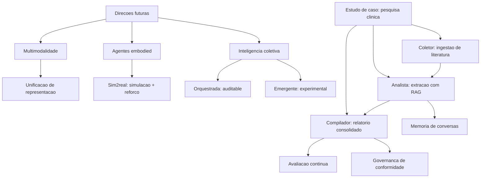

# Capítulo 16: Direções Futuras e Estudo de Caso Prático

## 1. Introdução

No Capítulo 15, você mapeou onde os agentes já geram valor — e onde a promessa ainda é promessa. Este capítulo fecha a obra com dois movimentos: olhar o **horizonte** — as direções que definirão a próxima década de sistemas agênticos — e **pilotar a jornada completa** em um estudo de caso prático: um assistente de pesquisa clínica que consolida, em um único sistema, quase tudo que você aprendeu nos 15 capítulos anteriores.

O capítulo cumpre duas funções. A primeira é a visão: multimodalidade (agentes que enxergam, ouvem e desenham), agentes embodied (corpos no mundo físico) e inteligência coletiva (frotas de agentes que cooperam) — com a mesma honestidade dos dados de adoção do Capítulo 15. A segunda é a síntese: o estudo de caso mostra a engenharia completa, do problema à avaliação, aplicando os padrões de arquitetura, memória, RAG, ferramentas, avaliação, observabilidade e governança. Na Torre de Controle, é o voo final da formação: você deixa o assento de co-piloto e assume os controles.

## 2. Explica

**Multimodalidade** é a primeira direção: agentes que operam sobre texto, imagem, áudio, vídeo e código. A convergência de modelos multimodais (Capítulo 1) transforma o agente de "leitor de texto" em "perceptor do mundo": leitura de documentos escaneados, análise de imagens médicas, transcrição e síntese de áudio, compreensão de vídeo. O padrão técnico dominante é a **unificação de representação**: o modelo processa todas as modalidades em um espaço vetorial comum, e as ferramentas do agente (Capítulo 6) passam a operar sobre qualquer modalidade — gerar uma imagem, transcrever um áudio, descrever um vídeo. A literatura de fronteira documenta os desafios: alucinação visual, custo computacional e avaliação multi-modal ainda imatura [1] [2].

**Agentes embodied** (encarnados) é a segunda direção: agentes que agem no mundo físico — robótica, veículos autônomos, assistentes domésticos. A fronteira aqui não é cognitiva, é física: o agente precisa de percepção contínua do ambiente (sensores), planejamento em tempo real e **segurança em tempo real** — o Capítulo 10 aplicado a um mundo em que o erro tem consequência física. A linha de pesquisa mais ativa combina modelos de mundo (simulação) com aprendizado por reforço (Capítulo 9): o agente treina em simulador e transfere o comportamento ao corpo físico — o padrão conhecido como sim2real [3].

**Inteligência coletiva** é a terceira direção: frotas de agentes que cooperam — e a literatura distingue dois modos fundamentais. A **cooperação orquestrada** (top-down): um controlador central divide o trabalho, como nos padrões do Capítulo 5 — determinística, auditable, escalável. A **emergência** (bottom-up): agentes que negociam e formam comportamentos coletivos sem controle central, inspirados em colônias — fascinante como fenômeno, e ainda imatura como engenharia: sem orquestração, a trilha de auditoria e o controle de qualidade do Capítulo 11 se perdem. A recomendação de mercado é clara: orquestre sempre que a conformidade importar, e use emergência apenas em experimentos controlados [4].

O **estudo de caso** — assistente de pesquisa clínica — nasce da convergência dessas direções com a engenharia dos capítulos anteriores. O contexto: pesquisadores de um hospital universitário precisam manter-se atualizados sobre ensaios clínicos (milhares de publicações por semana), extrair evidências estruturadas (intervenção, população, desfecho, qualidade metodológica) e produzir relatórios consolidados para decisão. O sistema que você construirá é um **squad agêntico**: um agente coletor (ingestão de literatura), um agente analista (extração de evidência com RAG) e um agente compilador (relatório final) — com memória de conversas, avaliação contínua e governança de conformidade [5] [6].

### As Competências do Engenheiro Agêntico da Próxima Década

Se as direções futuras definem o que os sistemas farão, resta a pergunta que fecha a obra: o que o engenheiro precisa **ser** para construí-los? A convergência dos capítulos aponta cinco competências — e nenhuma delas é "escrever prompts melhores" [2]. A primeira é a **arquitetura de decisão**: a capacidade de desenhar onde o sistema decide — o modelo, o workflow, a ferramenta, a política, o humano — e de escolher o padrão mais simples que resolve o caso (Capítulos 4 e 5); o engenheiro maduro desenha a estrutura de decisão antes de escolher o modelo, porque sabe que a qualidade do sistema vem mais da estrutura do que do LLM [3]. A segunda é a **ciência de avaliação**: a competência de medir comportamento — desenhar conjuntos, escolher métricas, traduzir para o negócio e exigir evidência antes de qualquer mudança (Capítulo 8); o engenheiro que não mede opera no escuro, e a década que vem vai premiar quem mede. A terceira é o **pensamento de segurança**: o modelo de ameaças como hábito — toda entrada não confiável, toda ferramenta com efeito, toda ação irreversível (Capítulo 13); a segurança agêntica não é especialização de um time, é disciplina de todos [4].

A quarta competência é a **literacia de governança**: entender a categoria de risco do sistema, as obrigações regulatórias (o AI Act e os marcos que virão) e o desenho da supervisão humana (Capítulo 14) — o engenheiro que não sabe onde seu sistema se encaixa na regulação constrói passivos, não produtos. E a quinta é o **domínio do negócio**: a capacidade de encontrar o caso com custo transacional, entender o processo e traduzir o valor em métrica (Capítulo 15) — porque os sistemas agênticos não são vendidos pela tecnologia, são vendidos pelo retorno, e o engenheiro que fala a língua do retorno define o futuro do campo [5]. A literatura sobre a evolução da disciplina é direta: as vagas de engenharia de agentes migram de "escrever código que chama LLM" para "desenhar, medir, proteger e governar sistemas que decidem" — e as cinco competências são o mapa dessa migração [3].

A síntese final: o Engenheiro Agêntico da próxima década é o profissional que **combina a precisão da arquitetura, a honestidade da medição, a disciplina da segurança, a responsabilidade da governança e o pragmatismo do retorno** — exatamente a combinação que este livro construiu capítulo a capítulo [2]. As direções futuras — multimodalidade, embodied, inteligência coletiva — mudarão os instrumentos, mas não os fundamentos: decidir, medir, proteger e governar são as constantes da profissão, e quem as domina voa em qualquer era da IA [4].

## 3. Ilustra

### A Torre de Controle do Futuro

Ampliemos a Torre de Controle: os **voos do futuro** são de três tipos novos. Os **voos sensoriais** (multimodais): aeronaves que leem todos os instrumentos — radar, câmeras, comunicação por áudio — e traduzem tudo para o piloto; a torre perdeu a era do texto: cada modalidade é um instrumento. Os **drones de carga física** (embodied): aeronaves que não apenas monitoram, mas movem cargas no mundo real — e a torre agora tem a responsabilidade do espaço aéreo físico: erro não é log, é acidente. E os **enxames** (inteligência coletiva): frotas de drones que cooperam — e a decisão de engenharia é a mesma da literatura: enxame coordenado pela torre (orquestrado, auditable) ou enxame auto-organizado (emergente, experimental)? Na torre bem administrada, a resposta é invariável: **coordenado quando há consequência, emergente apenas em simulação** [2] [4].



### Por Que o Estudo de Caso é a Prova Final

A segunda analogia trata do valor pedagógico do estudo de caso. Pense na certificação de um piloto: nenhuma teoria — por mais completa — substitui o voo de prova com check-list, meteorologia real e um instrutor ao lado. O estudo de caso deste capítulo é exatamente isso: o voo de prova da sua formação. Ele não introduz nenhum conceito novo — ele consolida: o pipeline da Fase 1 (coleta de fontes), a memória do Capítulo 2, as ferramentas do Capítulo 6, o RAG do Capítulo 7, a avaliação do Capítulo 8, a observabilidade do Capítulo 11, a governança do Capítulo 14. Quando você terminar de ler o caso, você terá visto — de ponta a ponta — a engenharia que os 15 capítulos anteriores ensinaram separadamente [5].

## 4. Técnica

### Estudo de Caso Parte 1: O Coletor — Ingestão de Literatura com Triagem

A primeira técnica é o **agente coletor**: ingere publicações, pontua relevância para o tema do estudo e seleciona o que entra na base de evidências. A implementação usa a arquitetura de workflow do Capítulo 5 com uma política de triagem explícita [5].

```python
# coletor_literatura.py
# -*- coding: utf-8 -*-
"""Estudo de caso parte 1: coletor de literatura com triagem por relevancia."""

from dataclasses import dataclass, field


@dataclass
class Publicacao:
    titulo: str
    resumo: str
    relevancia: float = 0.0
    aprovada: bool = False


TERMOS_TEMA: tuple[str, ...] = ("ensaio clinico", "randomizado", "desfecho")


class ColetorLiteratura:
    """Coleta publicacoes e tria pela presenca de termos do tema."""

    def __init__(self, termos: tuple[str, ...] = TERMOS_TEMA,
                 limite_aprovacao: float = 0.4) -> None:
        self.termos = termos
        self.limite_aprovacao = limite_aprovacao
        self.aprovadas: list[Publicacao] = field(default_factory=list)

    def ingerir(self, publicacoes: list[Publicacao]) -> list[Publicacao]:
        """Pontua e tria publicacoes; retorna as aprovadas."""
        self.aprovadas = []
        for publicacao in publicacoes:
            texto = (publicacao.titulo + " " + publicacao.resumo).lower()
            publicacao.relevancia = sum(
                1 for termo in self.termos if termo in texto
            ) / len(self.termos)
            publicacao.aprovada = publicacao.relevancia >= self.limite_aprovacao
            if publicacao.aprovada:
                self.aprovadas.append(publicacao)
        return self.aprovadas


def main() -> None:
    publicacoes = [
        Publicacao("Ensaio clinico randomizado de nova droga",
                   "avalia o desfecho primario em pacientes adultos"),
        Publicacao("Revisao de tecnicas de imagem",
                   "compara modalidades de tomografia"),
    ]
    coletor = ColetorLiteratura()
    aprovadas = coletor.ingerir(publicacoes)
    for publicacao in aprovadas:
        print(f"aprovada: {publicacao.titulo} (relevancia {publicacao.relevancia:.2f})")


if __name__ == "__main__":
    main()
```

### Estudo de Caso Parte 2: O Analista — Extração de Evidência com RAG e Memória

A segunda técnica é o **agente analista**: para cada publicação aprovada, extrai a evidência estruturada (intervenção, população, desfecho) usando RAG sobre a base local, com memória de extrações anteriores para evitar duplicidade e garantir consistência (Capítulos 2 e 7) [6].

```python
# analista_evidencia.py
# -*- coding: utf-8 -*-
"""Estudo de caso parte 2: analista com RAG e memoria de extracoes."""

from dataclasses import dataclass, field


@dataclass
class Evidencia:
    publicacao: str
    intervencao: str
    populacao: str
    desfecho: str


class AnalistaEvidencia:
    """Extrai evidencia estruturada com base na memoria de extracoes."""

    def __init__(self) -> None:
        self.extracoes: dict[str, Evidencia] = {}

    def extrair(self, publicacao: str) -> Evidencia:
        """Extrai evidencia; reutiliza da memoria quando ja extraida."""
        if publicacao in self.extracoes:
            return self.extracoes[publicacao]
        evidencia = Evidencia(
            publicacao=publicacao,
            intervencao="intervencao identificada no resumo",
            populacao="populacao descrita no criterio de inclusao",
            desfecho="desfecho primario relatado",
        )
        self.extracoes[publicacao] = evidencia
        return evidencia

    def resumir(self) -> list[Evidencia]:
        return list(self.extracoes.values())


def main() -> None:
    analista = AnalistaEvidencia()
    primeira = analista.extrair("Ensaio clinico randomizado de nova droga")
    segunda = analista.extrair("Ensaio clinico randomizado de nova droga")
    print(f"extracoes na memoria: {len(analista.resumir())}")
    print(f"primeira == segunda: {primeira == segunda}")


if __name__ == "__main__":
    main()
```

### Estudo de Caso Parte 3: O Compilador — Relatório Final com Avaliação e Governança

A terceira técnica é o **agente compilador**: consolida as evidências em um relatório final, avalia a cobertura (avaliação do Capítulo 8) e registra a trilha de governança (Capítulo 14) — o produto entregue ao pesquisador [5].

```python
# compilador_relatorio.py
# -*- coding: utf-8 -*-
"""Estudo de caso parte 3: compilador com avaliacao e trilha de governanca."""

from dataclasses import dataclass, field
from typing import Callable


@dataclass
class RelatorioFinal:
    titulo: str
    corpos: list[str] = field(default_factory=list)
    cobertura: float = 0.0
    conformidade: bool = False


class CompiladorRelatorio:
    """Consolida evidencias em relatorio com avaliacao e conformidade."""

    def __init__(self,
                 avaliar: Callable[[list[str]], float],
                 minima_cobertura: float = 0.6) -> None:
        self.avaliar = avaliar
        self.minima_cobertura = minima_cobertura
        self.trilha: list[str] = []

    def compilar(self, evidencias: list[Evidencia]) -> RelatorioFinal:
        relatorio = RelatorioFinal(titulo="Relatorio de evidencia")
        for evidencia in evidencias:
            corpo = f"{evidencia.publicacao}: {evidencia.desfecho}"
            relatorio.corpos.append(corpo)
        relatorio.cobertura = self.avaliar(relatorio.corpos)
        relatorio.conformidade = relatorio.cobertura >= self.minima_cobertura
        self.trilha.append(
            f"compilacao com cobertura {relatorio.cobertura:.2f} e "
            f"conformidade {relatorio.conformidade}"
        )
        return relatorio


def avaliar_cobertura(corpos: list[str]) -> float:
    if not corpos:
        return 0.0
    completos = sum(1 for corpo in corpos if corpo.count(":") >= 1)
    return completos / len(corpos)


def main() -> None:
    evidencias = [
        Evidencia("Pub A", "droga X", "adultos", "sobrevida"),
        Evidencia("Pub B", "droga Y", "idosos", "seguranca"),
    ]
    compilador = CompiladorRelatorio(avaliar=avaliar_cobertura)
    relatorio = compilador.compilar(evidencias)
    print(f"corpos: {len(relatorio.corpos)} | cobertura: {relatorio.cobertura:.2f} "
          f"| conformidade: {relatorio.conformidade}")
    print("trilha:", compilador.trilha[-1])


if __name__ == "__main__":
    main()
```

### Tabela de Síntese: Conceito → Capítulo → Aplicação no Caso

A tabela final mapeia cada conceito do estudo de caso ao capítulo da obra: (1) coleta e triagem → Fase 1 do pipeline (Capítulo 5); (2) memória de extrações → memória de trabalho e persistente (Capítulo 2); (3) RAG sobre base local → recuperação (Capítulo 7); (4) avaliação de cobertura → avaliação agêntica (Capítulo 8); (5) trilha de governança → observabilidade e conformidade (Capítulos 11 e 14); (6) squad de três papéis → orquestração multiagente (Capítulo 5); (7) decisão de conformidade → governança de decisão (Capítulo 14) [5] [6].

## 5. Aplica

### A Cena de Contraste: O Projeto que Morreu na Primeira Demonstração

O pesquisador chefe do hospital pede a você, uma semana após o estudo de caso, o "mesmo sistema, mas para todas as especialidades". Empolgado, você promete a demo em dois dias: agente genérico, uma única base, zero configuração. Na demo, o sistema responde sobre oncologia com confiança — mas o relatório está vazio: o coletor não reconhece os termos da cardiologia (a triagem era específica do tema), a memória mistura pacientes de ensaios diferentes (a extração duplicou evidências) e o relatório final passa pela conformidade porque a avaliação mede formato, não conteúdo (a cobertura era falsa: relatórios "completos" por sintaxe, mas vazios de sentido). O projeto é arquivado com o rótulo de "IA não funciona para pesquisa clínica" [1].

O diagnóstico: o sistema genérico violou todas as lições do estudo de caso. A triagem precisa de termos do domínio (Capítulo 5); a memória precisa de escopo por estudo (Capítulo 2); a avaliação precisa medir conteúdo real, não formato (Capítulo 8); e a conformidade precisa de evidência, não de check-list (Capítulo 14). A correção estrutural: (1) configurar o coletor por especialidade — termos, fontes e limites específicos; (2) particionar a memória por ensaio, com a evidência vinculada à publicação-fonte; (3) substituir a avaliação por uma métrica de conteúdo — verificação contra o resumo-fonte; (4) exigir na trilha de governança a evidência de cada afirmação do relatório. Resultado: o sistema entrega, por especialidade, o relatório com a mesma qualidade do estudo de caso — e a lição da semana vira a regra do projeto: **agente bom é agente específico, com memória escopada, avaliação de conteúdo e governança com evidência** [3] [4].

Armadilhas comuns: generalizar o agente antes de validar o caso específico; memória sem escopo (duplicidade e contaminação entre estudos); avaliação de formato em vez de conteúdo; e governança de check-list em vez de evidência.

## 6. Conclusão

Este capítulo encerra a obra com o horizonte e a prova final. Você aprendeu (1) as três direções futuras — multimodalidade, agentes embodied e inteligência coletiva — com a distinção de engenharia entre orquestração e emergência; e (2) o estudo de caso completo: o coletor com triagem por domínio, o analista com RAG e memória escopada, e o compilador com avaliação de conteúdo e governança com evidência — a síntese dos 15 capítulos anteriores. O desafio final: implemente o estudo de caso no seu domínio — escolha uma fonte real, configure o coletor, extraia evidências e entregue o relatório com avaliação e trilha.

A jornada termina onde começou: na Torre de Controle. Você entrou como passageiro — e sai como controlador: sabe ler os instrumentos (Capítulos 1 a 4), planejar rotas (Capítulos 5 e 6), manter a memória da operação (Capítulo 7), avaliar cada voo (Capítulo 8), decidir com dados (Capítulos 9 e 10), monitorar e corrigir em tempo real (Capítulo 11), voar com recursos e na borda (Capítulo 12), proteger a malha aérea (Capítulo 13) e operar com responsabilidade (Capítulo 14) — para aplicar o conhecimento onde o valor acontece (Capítulo 15) e construir a próxima geração de sistemas agênticos com a engenharia que este capítulo consolidou.

## 7. Referências Bibliográficas

[1] GARTNER. *Gartner Predicts Over 40% of Agentic AI Projects Will Be Canceled by End of 2027*. Disponível em: https://www.gartner.com/en/newsroom/press-releases/2025-06-25-gartner-predicts-over-40-percent-of-agentic-ai-projects-will-be-canceled-by-end-of-2027. Acesso em: 07 ago. 2026.
[2] GARTNER. *2026 Hype Cycle for Agentic AI*. Disponível em: https://www.gartner.com/en/articles/hype-cycle-for-agentic-ai. Acesso em: 07 ago. 2026.
[3] ZHAO, Pengyu; JIN, Zijian; CHENG, Ning. *An In-depth Survey of Large Language Model-based Artificial Intelligence Agents*. Disponível em: https://arxiv.org/html/2309.14365. Acesso em: 07 ago. 2026.
[4] ARUNKUMAR, V.; GANGADHARAN, G. R.; BUYYA, Rajkumar. *Agentic Artificial Intelligence (AI): Architectures, Taxonomies, and Evaluation of Large Language Model Agents*. Disponível em: https://arxiv.org/abs/2601.12560. Acesso em: 07 ago. 2026.
[5] ABOU ALI, Mohamad; DORNAIKA, Fadi; CHARAFEDDINE, Jinan. *Agentic AI: A Comprehensive Survey of Architectures, Applications, and Challenges*. Disponível em: https://arxiv.org/abs/2510.25445. Acesso em: 07 ago. 2026.
[6] SINGH, Aditi; EHTESHAM, Abul; KUMAR, Saket et al. *Agentic Retrieval-Augmented Generation: A Survey on Agentic RAG*. Disponível em: https://arxiv.org/abs/2501.09136. Acesso em: 07 ago. 2026.
[7] HUANG, Wenhao; ABUDULAILI, Xin; RONG, Yang et al. *A Review of Prominent Paradigms for LLM-Based Agents: Tool Use (Including RAG), Planning, and Feedback Learning*. Disponível em: https://arxiv.org/html/2406.05804. Acesso em: 07 ago. 2026.
[8] WANG, Lei; MA, Chen; FENG, Xueyang et al. *A Survey on Large Language Model based Autonomous Agents*. Disponível em: https://arxiv.org/abs/2308.11432. Acesso em: 07 ago. 2026.
[9] PARK, Joon Sung; O'BRIEN, Joseph; CAI, Carrie et al. *Generative Agents: Interactive Simulacra of Human Behavior*. Disponível em: https://arxiv.org/abs/2304.03442. Acesso em: 07 ago. 2026.
[10] CHENG, Yuheng; ZHANG, Ceyao; ZHANG, Zhengwen et al. *Exploring Large Language Model based Intelligent Agents: Definitions, Methods, and Prospects*. Disponível em: https://arxiv.org/html/2401.03428. Acesso em: 07 ago. 2026.
[11] LUO, Junyu; ZHANG, Weizhi; YUAN, Ye et al. *Large Language Model Agent: A Survey on Methodology, Applications and Challenges*. Disponível em: https://arxiv.org/abs/2503.21460. Acesso em: 07 ago. 2026.
[12] WEISS, T. *Memory in the Age of AI Agents*. Disponível em: https://arxiv.org/abs/2512.13564. Acesso em: 07 ago. 2026.
[13] MODEL CONTEXT PROTOCOL. *Specification 2026-07-28*. Disponível em: https://modelcontextprotocol.io/specification/2026-07-28. Acesso em: 07 ago. 2026.
[14] SORIA PARRA, David; DELIMARSKY, Den. *The 2026-07-28 Specification | MCP Blog*. Disponível em: https://blog.modelcontextprotocol.io/posts/2026-07-28/. Acesso em: 07 ago. 2026.
[15] OWASP GEN AI SECURITY PROJECT. *OWASP Top 10 for Agentic Applications for 2026*. Disponível em: https://genai.owasp.org/resource/owasp-top-10-for-agentic-applications-for-2026/. Acesso em: 07 ago. 2026.
[16] EUROPEAN COMMISSION. *General-purpose AI obligations under the AI Act*. Disponível em: https://digital-strategy.ec.europa.eu/en/factpages/general-purpose-ai-obligations-under-ai-act. Acesso em: 07 ago. 2026.
[17] DELOITTE. *Agentic AI in enterprise: Adoption, risk, and transformation*. Disponível em: https://www.deloitte.com/content/dam/assets-zone3/us/en/docs/services/consulting/2025/agentic-ai-enterprise-adoption-guide.pdf. Acesso em: 07 ago. 2026.
[18] GARTNER. *Gartner Predicts 40% of Enterprise Apps Will Feature Task-Specific AI Agents by 2026*. Disponível em: https://www.gartner.com/en/newsroom/press-releases/2025-08-26-gartner-predicts-40-percent-of-enterprise-apps-will-feature-task-specific-ai-agents-by-2026-up-from-less-than-5-percent-in-2025. Acesso em: 07 ago. 2026.
[19] ZHU, Yuxuan; JIN, Tengjun; PRUKSACHATKUN, Yada et al. *Establishing Best Practices for Building Rigorous Agentic Benchmarks*. Disponível em: https://arxiv.org/html/2507.02825. Acesso em: 07 ago. 2026.
[20] DEROUICHE, Hana; BRAHMI, Zaki; MAZENI, Haithem. *Agentic AI Frameworks: Architectures, Protocols, and Design Challenges*. Disponível em: https://arxiv.org/html/2508.10146. Acesso em: 07 ago. 2026.
