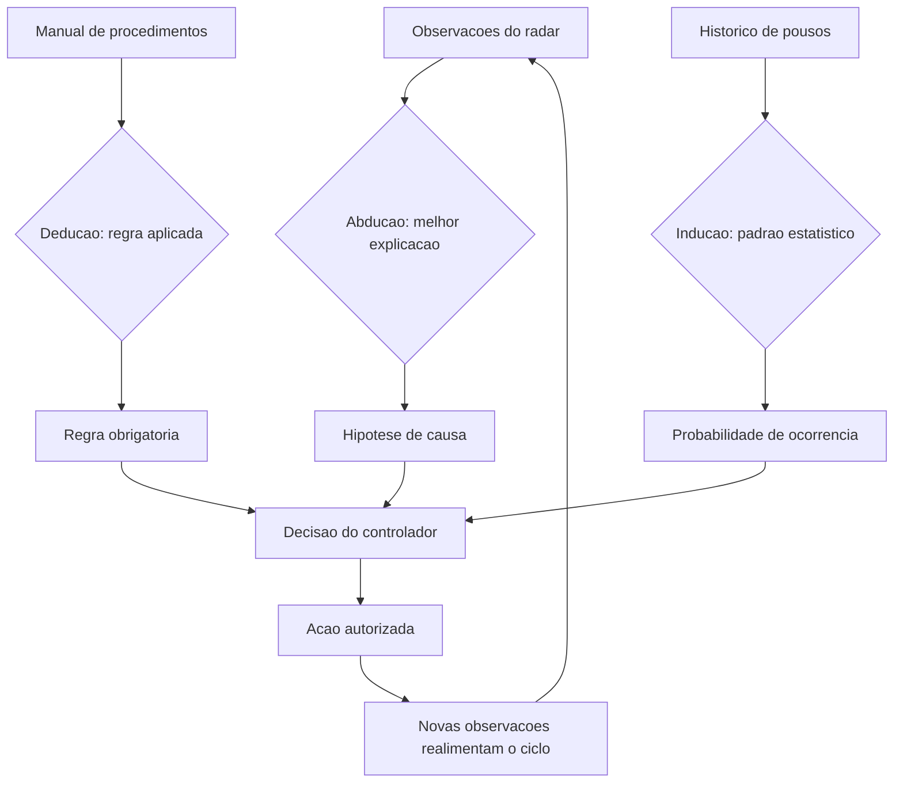

# Capítulo 2: Referenciais Teóricos da Agência

## 1. Introdução

No Capítulo 1, você aprendeu a reconhecer um sistema agêntico com o Teste dos Seis Critérios e a enquadrá-lo na Arquitetura da Torre de Controle. Mas reconhecer agência é diferente de **projetar** o comportamento que a sustenta. Este capítulo fornece a base teórica do comportamento agêntico: os modos de raciocínio (dedução, indução e o papel da supervisão humana), as arquiteturas de raciocínio clássicas (BDI, simbólicas, analógicas e conexionistas) e o formalismo da probabilidade e da teoria da decisão — que é, em última instância, o que um agente faz quando "escolhe" uma ação.

Esta base não é decoração acadêmica. Cada decisão prática de engenharia — quando usar um grafo de planejamento, como calibrar a temperatura do modelo, como decidir entre raciocínio simbólico e neural, quando exigir aprovação humana — é uma instância concreta de um conceito teórico. O controlador de tráfego aéreo não precisa recalcular a física do voo, mas precisa entender por que uma aproximação é segura. Você vai sair deste capítulo entendendo por que certas arquiteturas funcionam e, mais importante, por que certas escolhas intuitivas falham.

## 2. Explica

A agência começa com o raciocínio. Um agente que decide agir precisa de um mecanismo para passar de premissas a conclusões, e a ciência da computação consolidou três modos fundamentais. O primeiro é a **dedução**: a conclusão segue logicamente das premissas — se A implica B e A é verdadeiro, então B é verdadeiro. O segundo é a **indução**: a conclusão generaliza a partir de exemplos observados — se todas as entregas observadas do fornecedor X atrasaram, o agente infere que a próxima também atrasará. O terceiro, **abdução**, é o menos conhecido e o mais usado por agentes: a conclusão é a explicação mais plausível para um conjunto de observações — se o cliente está insatisfeito e o pedido está atrasado, a causa mais provável é a logística, não o cliente [1].

A distinção entre esses modos tem consequência prática imediata para o engenheiro: LLMs são máquinas de inferência estatística, excelentes em indução e abdução e historicamente frágeis em dedução estrita de múltiplos passos. Por isso, sistemas agênticos robustos não confiam no modelo para aritmética exata ou cadeias longas de lógica formal: delegam a um interpretador, a uma calculadora ou a um motor de regras — uma lição que o framework de LangChain chama de "não fazer com que o LLM faça o que a ferramenta faz melhor" [2]. A literatura sobre raciocínio em LLMs confirma: cadeias de raciocínio encadeado melhoram a dedução, mas a fidelidade lógica se degrada com o comprimento da cadeia [3].

O segundo pilar teórico são as **arquiteturas de raciocínio** desenvolvidas na IA clássica. A arquitetura BDI (Belief-Desire-Intention) é a mais influente: o agente mantém crenças (o que sabe sobre o mundo), desejos (objetivos que persegue) e intenções (planos comprometidos), e raciocina sobre como reconciliá-los [4]. O modelo original de Rao e Georgeff formalizou a deliberação como a escolha de intenções consistentes com as crenças, com o agente reavaliando intenções quando o mundo muda [5]. Wooldridge situou o modelo no quadro mais amplo da agência racional: um agente racional faz a escolha que melhor promove seus objetivos, dado o que crê [6]. É impressionante o quanto essas ideias de 1990 iluminam os sistemas de 2026: o "plano de voo" de um agente moderno é uma intenção BDI; a reavaliação por radar é o mecanismo de re-deliberação.

As arquiteturas **simbólicas** operam sobre regras explícitas e lógica formal — sistemas especialistas clássicos. As arquiteturas **analógicas** resolvem problemas novos por similaridade com problemas conhecidos — a base dos sistemas de raciocínio por casos (CBR). As arquiteturas **conexionistas** — redes neurais, e hoje os LLMs — aprendem padrões de exemplos sem regras explícitas [7]. A arquitetura híbrida que emerge na prática combina as três: o LLM (conexionista) faz a interpretação de linguagem e a síntese; um grafo de tarefas (simbólico) impõe a estrutura; e casos de uso recuperados de memória (analógico) ancoram a solução [8].

O terceiro pilar é o **raciocínio probabilístico e a teoria da decisão**. Um agente que age sob incerteza precisa atribuir probabilidades a estados do mundo e escolher ações pelo valor esperado. A teoria da decisão formaliza isso: a ação ótima maximiza a utilidade esperada — soma sobre os resultados possíveis da probabilidade vezes a utilidade [9]. Em LLMs, essa teoria aparece de forma concreta no parâmetro temperatura: um agente com temperatura baixa é um maximizador de probabilidade (explorar pouco), e um com temperatura alta amostra distribuções mais amplas (explorar mais) [10]. E, no nível de sistema, o alinhamento — a tarefa de garantir que os objetivos do agente coincidam com os do humano que o delegou — é um problema de desenho de função de utilidade: você não pode apenas definir objetivos; precisa definir a função que os avalia [11].

### A Economia da Memória em Produção

Toda memória tem um custo — e o engenheiro que ignora essa economia projeta sistemas que funcionam na demo e afundam em produção. O primeiro custo é o de **armazenamento e recuperação**: cada item armazenado ocupa espaço (vetores, textos, índices) e cada consulta à memória adiciona latência — uma recuperação que leva centenas de milissegundos em uma base grande pode dobrar o tempo de resposta de uma tarefa agêntica [8]. O segundo custo é o de **tokens de contexto**: a memória só age se entrar na janela — e cada item recuperado compete com as instruções, os dados e as ferramentas pelo mesmo orçamento de contexto (a disciplina do Capítulo 4); encher a janela com memória irrelevante é pagar caro para *piorar* a qualidade, porque o ruído dilui o sinal que o modelo precisa [9]. O terceiro custo é o **decisional**: quanto mais memória o agente consulta, mais decisões de recuperação ele toma — e cada decisão errada (recuperar o item errado, ou o certo tarde demais) é um modo de falha novo que a avaliação (Capítulo 8) precisa capturar [10].

A consequência é a **política de ciclo de vida da memória**: nenhuma memória é eterna, e o sistema que trata tudo como permanente envelhece mal — dados obsoletos viram desinformação silenciosa, e bases inchadas degradam a recuperação. As técnicas consolidadas: **expiração por tempo de vida** (TTL por tipo de dado: a política de preços expira em trimestres; a identidade do cliente, em anos); **evicção por relevância** (quando a base cresce além do limite, o que sai é o que a recuperação menos usa — a mesma ideia do cache); **consolidação** (conversas antigas são resumidas em memória episódica sintetizada, em vez de acumuladas verbatim — o Capítulo 7 mostra o mesmo padrão para conhecimento); e **auditoria de qualidade** (a medição periódica de quantas recuperações a avaliação considera úteis — a memória que não serve é removida, não acumulada) [11]. A regra de ouro: a memória é um **sistema de decisão**, não um depósito — e como todo sistema de decisão, exige avaliação, limites e manutenção.

A economia da memória também responde à pergunta de arquitetura que mais aparece em projetos reais: memória no banco vetorial, no cache do servidor, ou no contexto do prompt? A resposta consolidada pela prática é **as três, em papéis diferentes**: o contexto do prompt carrega o que a tarefa exige agora (a memória de trabalho, barata e volátil); o banco vetorial guarda o que pode ser exigido em qualquer tarefa (a memória de longo prazo, cara e durável); e o cache agiliza o que foi exigido antes (a memória procedimental da operação, rápida e transitória) [12]. A literatura de sistemas de memória para agentes confirma que a arquitetura vencedora não é a memória maior — é a **separação disciplinada de papéis com política de ciclo de vida**: o que não é recuperado não gera latência, o que não é útil não entra na janela, e o que envelheceu não engana o modelo [13].

### Memória e Privacidade: O Dado na Memória

A memória levanta uma questão que o engenheiro não pode adiar para o fim do projeto: **o que o sistema retém sobre as pessoas, e por quanto tempo?** A memória do Capítulo 2 armazena conversas, preferências, decisões e dados pessoais — e cada um desses itens é um dado pessoal na acepção da LGPD e do GDPR quando identifica ou torna identificável um indivíduo [9]. A regra que a prática consolidou é a **minimização por desenho**: a memória não retém o que a tarefa não exige — o sistema guarda "o cliente prefere contato por e-mail" e não "o cliente mora na rua X"; o engenheiro desenha o esquema de memória perguntando, campo a campo, qual tarefa futura vai precisar daquele dado — e o campo que nenhuma tarefa precisa não entra no esquema [10]. A segunda regra é a **política de retenção explícita**: cada tipo de dado na memória tem prazo e justificativa — o histórico de conversa expira em N dias; a preferência declarada pelo usuário, enquanto vigente; o dado sensível, nunca (ou com tratamento específico); e o mecanismo de expiração é automático, não manual — a base de memória que "nunca exclui" é um passivo regulatório crescendo em silêncio [11].

A terceira regra é a **governança do acesso à memória**: quem — humano ou sistema — pode ler o quê — e a regra é a mesma do Capítulo 13: o acesso segue o privilégio do usuário final, e a memória de um cliente não é lida pela tarefa de outro (a contaminação entre memórias é o incidente de privacidade mais comum em sistemas agênticos: o agente recuperou o histórico do cliente A na tarefa do cliente B — o vazamento silencioso que a segmentação por escopo previne) [9]. E a quarta regra é a **transparência**: o usuário sabe que o sistema lembra — a política de privacidade declara o que é retido, por quanto tempo e para quê, e o canal de solicitação ("esqueça o que sabe sobre mim") executa a exclusão de verdade, na memória persistente e nos resumos consolidados, não apenas na interface [10].

A síntese da relação entre memória e privacidade é o princípio que o capítulo inteiro sustenta: **a memória não é um ativo a maximizar, é um poder a governar** — o sistema que lembra mais do que precisa não é mais inteligente, é mais vulnerável; e o engenheiro que desenha a memória com minimização, retenção, acesso e transparência constrói um sistema que a regulação aceita e o usuário confia — as duas condições de escala do Capítulo 14 [11].

## 3. Ilustra

### O Controlador, o Manual de Procedimentos e o Radar

Voltemos à Torre de Controle. O controlador de tráfego aéreo combina três formas de conhecimento o tempo todo. Primeiro, a **dedução**: "aeronave B está na pista 09, aeronave A recebeu autorização para decolar na 09 — logo A não pode decolar antes de B liberar a pista"; regras do manual, aplicadas com rigor. Segundo, a **indução**: "em 14 dos 15 pousos em clima úmido nesta pista, o vento virou a 500 metros da cabeceira — logo o próximo pouso provavelmente exigirá ajuste"; padrões aprendidos da experiência. Terceiro, a **abdução**: "o radar mostra desvio à direita sem comunicação — a explicação mais provável é rajada de vento lateral"; a melhor explicação para as observações, sem acesso à verdade [4]. O agente moderno faz exatamente as três: o LLM provê indução e abdução fluentes; a camada simbólica (o manual) provê a dedução confiável; e o radar (observabilidade) fornece os dados que alimentam a indução.



### O Estagiário Articulado e a Aposta Calculada

A segunda camada de analogia trata do ponto mais difícil: a incerteza. Imagine que você precisa decidir se o voo atrasado será reembolsado automaticamente. Você não tem certeza se o atraso foi culpa da companhia — mas tem dados: 70% dos atrasos acima de 4 horas com origem no centro de distribuição são responsabilidade da companhia. O estagiário articulado (o LLM puro) responde: "provavelmente sim, com base na minha leitura do cenário". O controlador experiente (o agente bem desenhado) responde: "a utilidade esperada de reembolsar é positiva em 70% dos casos e o custo reputacional de negar é alto — logo, reembolsar e registrar para auditoria é a decisão ótima" [9]. A diferença não é vocabulário: é a explicitação de probabilidades, consequências e função de utilidade. É isso que permite auditar a decisão — e é isso que a teoria da decisão dá ao engenheiro [12]. Como Engenheiro Agêntico, você vai perceber ao longo deste livro que toda política de autonomia é, no fundo, uma função de utilidade com limiar: delegue ao agente as ações cujo valor esperado é alto e cujo dano máximo é aceitável.

## 4. Técnica

### Implementando o Ciclo BDI em um Agente Moderno

A arquitetura BDI pode ser implementada diretamente em um sistema agêntico moderno, com o LLM como motor de deliberação. O padrão é o seguinte: (1) o agente mantém uma estrutura de crenças (fatos verificados), desejos (objetivos ativos) e intenções (planos comprometidos); (2) a cada ciclo, ele reavalia crenças com novas observações; (3) se uma crença essencial mudou, ele re-delibera (descarta ou revisa intenções); (4) senão, executa o próximo passo da intenção corrente. Este padrão resolve o problema estrutural do "agente teimoso": sistemas sem re-deliberação perseguem planos obsoletos quando o mundo muda — a causa raiz de muitos fracassos em produção [13].

```python
# bdi_agente.py
# -*- coding: utf-8 -*-
"""Ciclo BDI (Belief-Desire-Intention) aplicado a um agente com LLM."""

import json
from dataclasses import dataclass, field
from typing import Any, Callable, Optional


@dataclass
class Crenca:
    chave: str
    valor: Any
    fonte: str
    timestamp: float = 0.0


@dataclass
class Desejo:
    objetivo: str
    prioridade: int = 1
    utilidade: float = 1.0


@dataclass
class Intencao:
    plano: list[str]
    passo_atual: int = 0
    reavaliacao_requerida: bool = False


class AgenteBDI:
    """Agente BDI simples: crencas, desejos e intencoes com re-deliberacao."""

    def __init__(self, deliberar: Callable[[list[Crenca], list[Desejo], Optional[Intencao]], Intencao]) -> None:
        self.crencas: dict[str, Crenca] = {}
        self.desejos: list[Desejo] = []
        self.intencao: Optional[Intencao] = None
        self.deliberar = deliberar

    def observar(self, chave: str, valor: Any, fonte: str) -> None:
        """Registra uma nova observacao e marca a intencao para reavaliacao
        se a crenca central mudou."""
        anterior = self.crencas.get(chave)
        self.crencas[chave] = Crenca(chave, valor, fonte)
        if anterior is not None and anterior.valor != valor and self.intencao:
            self.intencao.reavaliacao_requerida = True

    def adicionar_desejo(self, desejo: Desejo) -> None:
        self.desejos.append(desejo)

    def executar_ciclo(self, passo: Callable[[str], Any]) -> dict[str, Any]:
        """Um ciclo BDI: re-deliberar se necessario, senao executar o proximo passo."""
        if self.intencao is None or self.intencao.reavaliacao_requerida:
            self.intencao = self.deliberar(list(self.crencas.values()), self.desejos, self.intencao)
            self.intencao.reavaliacao_requerida = False
        plano = self.intencao.plano
        if self.intencao.passo_atual >= len(plano):
            return {"status": "intencao_concluida", "plano": plano}
        acao = plano[self.intencao.passo_atual]
        resultado = passo(acao)
        self.intencao.passo_atual += 1
        return {"status": "passo_executado", "acao": acao, "resultado": resultado}


def deliberar_exemplo(crencas: list[Crenca], desejos: list[Desejo], _antiga: Optional[Intencao]) -> Intencao:
    """Exemplo de funcao de deliberacao: prioriza o desejo com maior prioridade."""
    if not desejos:
        return Intencao(plano=[])
    desejos_ordenados = sorted(desejos, key=lambda d: d.prioridade, reverse=True)
    objetivo = desejos_ordenados[0].objetivo
    planos: dict[str, list[str]] = {
        "resolver_chamado": ["consultar_chamados_abertos", "diagnosticar", "executar_acao", "verificar_resolucao"],
        "atualizar_estoque": ["consultar_estoque", "calcular_reposicao", "registrar_pedido"],
    }
    return Intencao(plano=planos.get(objetivo, ["informar_nao_suportado"]))


def main() -> None:
    agente = AgenteBDI(deliberar=deliberar_exemplo)
    agente.observar("cliente", "ativo", "crm")
    agente.observar("pedido", "atrasado", "logistica")
    agente.adicionar_desejo(Desejo("resolver_chamado", prioridade=3))
    agente.executar_ciclo(step_registrador)


def step_registrador(acao: str) -> str:
    """Passo de exemplo: registra a acao e retorna um resultado simulado."""
    print(f"[executando] {acao}")
    return f"ok:{acao}"


if __name__ == "__main__":
    main()
```

### Teoria da Decisão na Prática: a Política de Reembolso

A teoria da decisão vira engenharia quando você a transforma em uma política executável. O padrão a seguir — decisão por utilidade esperada com limiar de aprovação — resolve o problema de "quanto autonomia dar ao agente" de forma quantificável, não por intuição [9]. A política é: calcular para cada ação candidata a utilidade esperada (soma sobre cenários de probabilidade × ganho); executar automaticamente se a utilidade esperada excede o limiar **e** o pior cenário está dentro do dano aceitável; caso contrário, escalar para aprovação humana. Esse é o desenho exato por trás dos sistemas de suporte de nível 2/3 de empresas maduras [14].

```python
# politica_decisao.py
# -*- coding: utf-8 -*-
"""Politica de autonomia baseada em utilidade esperada com limiar."""

from dataclasses import dataclass
from typing import Callable


@dataclass
class Cenario:
    descricao: str
    probabilidade: float
    utilidade: float


@dataclass
class Decisao:
    acao: str
    utilidade_esperada: float
    pior_cenario: float
    executar_autonomamente: bool
    motivo: str


def decidir(
    acao: str,
    cenarios: list[Cenario],
    limiar_utilidade: float,
    dano_maximo_aceitavel: float,
) -> Decisao:
    """Decide pela utilidade esperada com freio de seguranca no pior cenario."""
    utilidade_esperada = sum(c.probabilidade * c.utilidade for c in cenarios)
    pior_cenario = min(c.utilidade for c in cenarios)
    autonomo = (utilidade_esperada >= limiar_utilidade
                and pior_cenario >= dano_maximo_aceitavel)
    motivo = ("autonomo" if autonomo
              else ("pior_cenario_inaceitavel" if pior_cenario < dano_maximo_aceitavel
                    else "utilidade_abaixo_do_limiar"))
    return Decisao(acao=acao, utilidade_esperada=utilidade_esperada,
                   pior_cenario=pior_cenario, executar_autonomamente=autonomo,
                   motivo=motivo)


def exemplo_reembolso() -> None:
    """Exemplo: reembolso automatico dentro dos limites da politica."""
    cenarios = [
        Cenario("atraso_por_responsabilidade_da_empresa", 0.70, +10.0),
        Cenario("atraso_sem_responsabilidade", 0.20, -2.0),
        Cenario("fraude_detectada_posteriormente", 0.10, -15.0),
    ]
    decisao = decidir(
        acao="reembolsar_cliente",
        cenarios=cenarios,
        limiar_utilidade=4.0,
        dano_maximo_aceitavel=-8.0,
    )
    print(f"Utilidade esperada: {decisao.utilidade_esperada:.2f}")
    print(f"Pior cenario: {decisao.pior_cenario:.2f}")
    print(f"Decisao: {decisao.motivo} -> executar={decisao.executar_autonomamente}")


if __name__ == "__main__":
    exemplo_reembolso()
```

### Quando Usar Cada Arquitetura de Raciocínio

A escolha entre arquiteturas não é religiosa — é um trade-off explícito. Arquiteturas **simbólicas** ganham quando a regra precisa ser auditável e determinística (conformidade regulatória, cálculos de benefício, políticas de reembolso): o custo é a rigidez diante de casos não previstos. Arquiteturas **conexionistas** ganham quando a entrada é linguagem natural ambígua e o espaço de respostas é aberto: o custo é a não-determinismo e a falta de garantias formais. Arquiteturas **BDI** ganham quando o agente opera em horizontes longos com objetivos múltiplos e mundo mutável: o custo é a complexidade da re-deliberação [15]. O padrão dominante em produção é o híbrido: LLM para percepção e síntese, camada simbólica para regras rígidas, BDI (ou grafo de tarefas, como veremos no Capítulo 5) para orquestração do comportamento. A lição para o Engenheiro Agêntico: pergunte primeiro "qual é a natureza da decisão?", e só depois escolha a arquitetura.

## 5. Aplica

### A Cena de Contraste: O Agente que Seguiu o Plano no Clima Adverso

Você implementou um agente de vendas B2B com um plano fixo de cinco passos: qualificar lead, enviar proposta, agendar demo, negociar, fechar. No teste manual, funciona lindamente. Você o solta na base real de leads. Na primeira semana, um prospect importante responde à proposta com uma objeção regulatória que muda completamente o cenário: a empresa não pode assinar sem revisão jurídica. Seu agente, fiel ao plano, continua: envia lembretes de demo, aumenta o desconto e marca reunião — ignorando o fato novo. O prospect reclama: "o sistema não escuta". O comercial humano que assumiu o caso resolveu em uma hora [13].

O diagnóstico: você implementou um workflow, não um agente BDI. O plano estava comprometido como intenção, mas o agente não tinha mecanismo de re-deliberação — nenhuma reavaliação de crenças acionada por mudança de contexto. No formalismo da teoria da decisão, o agente continuou maximizando a utilidade esperada **do plano original**, que ficou obsoleta no momento em que a crença "lead pode assinar direto" mudou para "lead exige revisão jurídica". A correção estrutural: adicionar observações explícitas (eventos do CRM e respostas de e-mail alimentam as crenças), marcar as crenças críticas para o plano (objeção regulatória ⇒ re-deliberação obrigatória) e permitir que a deliberação troque o plano inteiro — inclusive para escalar ao humano. Com a correção, o agente detectou a objeção, mudou a intenção para "obter parecer jurídico" e agendou a revisão sem esforço comercial humano até o ponto certo de decisão [12].

Armadilhas comuns: confundir prompt longo com arquitetura de raciocínio (o prompt não substitui o mecanismo de re-deliberação); temperatura alta para tudo (amostragem ampla é para exploração deliberada, não para o padrão — cada decisão deve ter a temperatura que sua aposta de decisão exige [10]); e ignorar a utilidade esperada em políticas de autonomia (sem limiar explícito, a autonomia vira loteria) [9].

## 6. Conclusão

Este capítulo deu ao comportamento agêntico um embasamento que vai sustentar o restante da obra. Você aprendeu (1) os três modos de raciocínio — dedução, indução e abdução — e o papel de cada um na arquitetura híbrida de produção; (2) as arquiteturas de raciocínio clássicas — BDI, simbólicas, analógicas e conexionistas — com ênfase no ciclo de re-deliberação que separa workflow de agente; e (3) a teoria da decisão como formalismo para políticas de autonomia quantificáveis. Desafio: desenhe uma política de decisão para uma ação do seu domínio — liste cenários, probabilidades e utilidades, e defina o limiar de autonomia. Você verá que o exercício expõe suposições que o instinto escondia.

O próximo capítulo abre o radar para o ecossistema: frameworks, sistemas multiagente, protocolos MCP e A2A, e o cenário de pesquisa que define as ferramentas disponíveis. Na torre, é o momento de mapear as aeronaves, rotas e aeroportos que seu sistema vai coordenar.

## 7. Referências Bibliográficas

[1] CHENG, Yuheng; ZHANG, Ceyao; ZHANG, Zhengwen et al. *Exploring Large Language Model based Intelligent Agents: Definitions, Methods, and Prospects*. Disponível em: https://arxiv.org/html/2401.03428. Acesso em: 07 ago. 2026.
[2] LANGCHAIN. *Workflows and agents — Docs*. Disponível em: https://docs.langchain.com/oss/python/langgraph/workflows-agents. Acesso em: 07 ago. 2026.
[3] *Agentic Large Language Models, a survey*. Disponível em: https://arxiv.org/html/2503.23037. Acesso em: 07 ago. 2026.
[4] DE SILVA, Lavindra; MENEGUZZI, Felipe; LOGAN, Brian. *BDI Agent Architectures: A Survey*. Disponível em: https://www.ijcai.org/proceedings/2020/0684.pdf. Acesso em: 07 ago. 2026.
[5] RAO, Anand S.; GEORGEFF, Michael P. *Modeling Rational Agents within a BDI-Architecture*. Disponível em: https://jmvidal.cse.sc.edu/library/rao91a.pdf. Acesso em: 07 ago. 2026.
[6] WOOLDRIDGE, Michael. *The Belief-Desire-Intention Model of Agency*. Disponível em: https://www.cs.ox.ac.uk/people/michael.wooldridge/pubs/atal98b.pdf. Acesso em: 07 ago. 2026.
[7] ABOU ALI, Mohamad; DORNAIKA, Fadi; CHARAFEDDINE, Jinan. *Agentic AI: A Comprehensive Survey of Architectures, Applications, and Challenges*. Disponível em: https://arxiv.org/abs/2510.25445. Acesso em: 07 ago. 2026.
[8] ARUNKUMAR, V.; GANGADHARAN, G. R.; BUYYA, Rajkumar. *Agentic Artificial Intelligence (AI): Architectures, Taxonomies, and Evaluation of Large Language Model Agents*. Disponível em: https://arxiv.org/abs/2601.12560. Acesso em: 07 ago. 2026.
[9] HUANG, Wenhao; ABUDULAILI, Xin; RONG, Yang et al. *A Review of Prominent Paradigms for LLM-Based Agents: Tool Use (Including RAG), Planning, and Feedback Learning*. Disponível em: https://arxiv.org/html/2406.05804. Acesso em: 07 ago. 2026.
[10] LUO, Junyu; ZHANG, Weizhi; YUAN, Ye et al. *Large Language Model Agent: A Survey on Methodology, Applications and Challenges*. Disponível em: https://arxiv.org/abs/2503.21460. Acesso em: 07 ago. 2026.
[11] WANG, Lei; MA, Chen; FENG, Xueyang et al. *A Survey on Large Language Model based Autonomous Agents*. Disponível em: https://arxiv.org/abs/2308.11432. Acesso em: 07 ago. 2026.
[12] ZHAO, Pengyu; JIN, Zijian; CHENG, Ning. *An In-depth Survey of Large Language Model-based Artificial Intelligence Agents*. Disponível em: https://arxiv.org/html/2309.14365. Acesso em: 07 ago. 2026.
[13] DEROUICHE, Hana; BRAHMI, Zaki; MAZENI, Haithem. *Agentic AI Frameworks: Architectures, Protocols, and Design Challenges*. Disponível em: https://arxiv.org/html/2508.10146. Acesso em: 07 ago. 2026.
[14] DELOITTE. *Agentic AI in enterprise: Adoption, risk, and transformation*. Disponível em: https://www.deloitte.com/content/dam/assets-zone3/us/en/docs/services/consulting/2025/agentic-ai-enterprise-adoption-guide.pdf. Acesso em: 07 ago. 2026.
[15] *AI Agent Systems: Architectures, Applications, and Evaluation*. Disponível em: https://arxiv.org/abs/2601.01743. Acesso em: 07 ago. 2026.
[16] GARTNER. *Gartner Predicts Over 40% of Agentic AI Projects Will Be Canceled by End of 2027*. Disponível em: https://www.gartner.com/en/newsroom/press-releases/2025-06-25-gartner-predicts-over-40-percent-of-agentic-ai-projects-will-be-canceled-by-end-of-2027. Acesso em: 07 ago. 2026.
[17] PARK, Joon Sung; O'BRIEN, Joseph; CAI, Carrie et al. *Generative Agents: Interactive Simulacra of Human Behavior*. Disponível em: https://arxiv.org/abs/2304.03442. Acesso em: 07 ago. 2026.
[18] ZHU, Yuxuan; JIN, Tengjun; PRUKSACHATKUN, Yada et al. *Establishing Best Practices for Building Rigorous Agentic Benchmarks*. Disponível em: https://arxiv.org/html/2507.02825. Acesso em: 07 ago. 2026.
[19] OWASP GEN AI SECURITY PROJECT. *OWASP Top 10 for Agentic Applications for 2026*. Disponível em: https://genai.owasp.org/resource/owasp-top-10-for-agentic-applications-for-2026/. Acesso em: 07 ago. 2026.
[20] EUROPEAN COMMISSION. *General-purpose AI obligations under the AI Act*. Disponível em: https://digital-strategy.ec.europa.eu/en/factpages/general-purpose-ai-obligations-under-ai-act. Acesso em: 07 ago. 2026.
