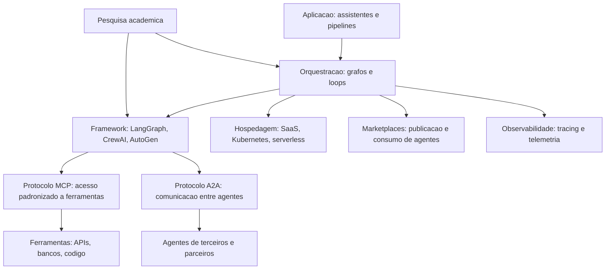

# Capítulo 3: O Ecossistema Agêntico

## 1. Introdução

No Capítulo 2, você aprendeu as bases teóricas do comportamento agêntico — raciocínio, arquiteturas BDI e teoria da decisão. Agora vamos abrir o radar para o mundo real: o ecossistema em que esses sistemas são construídos e operados em 2026. Este capítulo mapeia as ferramentas disponíveis — frameworks de desenvolvimento, sistemas multiagente, marketplaces de agentes, opções de hospedagem, monitoramento — e os protocolos que padronizam a comunicação: MCP (Model Context Protocol) para conectar agentes a ferramentas e A2A (Agent-to-Agent) para conectar agentes entre si.

O objetivo é prático: quando você terminar de ler, saberá responder "com o que eu construo isso?" para qualquer cenário — um assistente interno, um sistema de suporte, um pipeline multiagente de análise. Você também aprenderá a reconhecer o fenômeno do **AI-agent washing** — a prática de rotular qualquer chatbot de "agente" por marketing — e a usar o Teste dos Seis Critérios do Capítulo 1 como antídoto. Na metáfora da torre: este capítulo é o mapa dos aeroportos, companhias aéreas e protocolos de comunicação disponíveis para seu espaço aéreo.

## 2. Explica

O ecossistema agêntico de 2026 organiza-se em camadas que você precisa conhecer por nome. Na base, os **frameworks de desenvolvimento**: bibliotecas que implementam o loop do agente, o gerenciamento de estado, as ferramentas e a orquestração. O panorama é liderado por LangChain/LangGraph, LlamaIndex, CrewAI e AutoGen, com variações para cada linguagem e necessidade [1]. A decisão de framework é uma das mais estratégicas do projeto: ela define a curva de aprendizado, o estilo de abstração e o tamanho do ecossistema de integrações que você herda. A literatura de levantamento aponta que a maioria dos frameworks implementa as mesmas capacidades com vocabulários diferentes — e que a qualidade da documentação e o tamanho da comunidade pesam tanto quanto a arquitetura interna [2].

Na camada seguinte estão os **sistemas multiagente**: arquiteturas em que múltiplos agentes colaboram, cada um especializado em um papel (pesquisador, redator, revisor, executor). A pesquisa acadêmica distingue dois modos de organização: **orquestração centralizada**, em que um agente coordenador despacha tarefas e consolida resultados; e **delegação descentralizada**, em que agentes negociam e formam cadeias de trabalho sem um coordenador explícito [3]. O modo centralizado é mais previsível e auditável — recomendado para produção — enquanto o descentralizado explora o chamado **comportamento emergente**: a capacidade de o grupo resolver problemas que nenhum agente individual resolveria, observada em experimentos como os Generative Agents de Park et al., que simularam uma comunidade de 25 agentes com memória, relacionamentos e rotinas diárias [4].

Acima dos frameworks estão os **marketplaces e a hospedagem**. Marketplaces de agentes — plataformas onde organizações publicam agentes prontos para uso e integração — começam a se consolidar como o equivalente da App Store para a IA agêntica [5]. A hospedagem, por sua vez, evoluiu de duas frentes: plataformas de gerenciamento (SaaS de orquestração e monitoramento) e infraestrutura própria (Kubernetes, serverless, modelos auto-hospedados). A decisão de hospedagem define não apenas custo, mas também soberania de dados e latência — temas que retomaremos nos Capítulos 9 e 12 [6].

A camada que mais mudou a engenharia prática em 2025-2026 foi a dos **protocolos abertos**. O MCP (Model Context Protocol), criado pela Anthropic e hoje um padrão aberto com especificação semestral, padroniza a conexão entre agentes e ferramentas: em vez de uma integração ad hoc por ferramenta, o agente conversa com um servidor MCP que expõe ferramentas, recursos e prompts em um formato uniforme [7]. A especificação de julho de 2026 consolidou o suporte a streaming, execução de código remota e autenticação entre servidores e clientes [8]. O A2A (Agent-to-Agent), proposto pelo Google, padroniza a comunicação entre agentes de fornecedores diferentes — a camada de interoperabilidade que permite que um agente da sua empresa converse com o agente de um parceiro sem integração customizada [9].

Por fim, a camada de **pesquisa acadêmica** define o estado da arte que os produtos industrializam com um ou dois anos de defasagem. As pesquisas de levantamento de 2025-2026 convergem em arquiteturas de referência: núcleo LLM + memória + ferramentas + orquestração + governança, com avaliação contínua como componente de primeira classe [10]. O Gartner descreve o momento como o auge do hype cycle da IA agêntica — o que significa duas coisas: investimento abundante e expectativa irrealista — e prevê que mais de 40% dos projetos serão cancelados até 2027, principalmente por fraquezas de engenharia, não de modelo [11].

### Como Avaliar um Framework em Cinco Perguntas

O ecossistema oferece dezenas de frameworks — e a escolha errada custa meses de retrabalho. A avaliação que a prática consolidou se resume a cinco perguntas, na ordem. A primeira: **o framework resolve o seu problema ou impõe o problema dele?** Frameworks genéricos de agentes seduzem com abstrações poderosas — mas cada abstração esconde uma decisão de arquitetura que pode conflitar com o seu caso (orquestração rígida, memória embutida que você não controla, ferramentas acopladas); o teste prático é desenhar o seu caso no papel e perguntar onde o framework decide por você [7]. A segunda: **qual é a taxa de abandono da camada de abstração?** No ecossistema de 2025-2026, a volatilidade é alta — projetos vencedores surgem e frameworks morrem em ciclos curtos; a mitigação é preferir camadas finas sobre padrões abertos (MCP, A2A) a plataformas fechadas: se o padrão sobreviver, você troca de framework sem trocar de arquitetura [8]. A terceira: **a observabilidade é nativa ou adicionada?** O Capítulo 11 mostra que agente sem telemetria é inoperável — e frameworks com rastreio embutido (spans de ferramenta, contagem de tokens, decisões de orquestração) economizam semanas de instrumentação manual [10].

A quarta pergunta: **quem mantém e quem financia?** A regra prática: preferir projetos com mantenedores profissionais, governança aberta e histórico de release estável — um framework com commit diário e versão semanal é um projeto em movimento, não uma plataforma; o custo de subir a curva é o mesmo, mas o custo de trocar depois é uma ordem de grandeza maior. E a quinta: **qual é o custo da saída?** Todo framework é um investimento — e o retorno do investimento inclui o preço de trocar: quanto do seu código fica no framework (chamadas, tipos, paradigma) e quanto fica no seu domínio (prompts, avaliação, ferramentas)? A prática vencedora maximiza o que fica no domínio: o prompt, a avaliação e as ferramentas são seus — o framework é descartável [11].

A síntese da avaliação é uma frase que os arquitetos experientes repetem: **framework é uma despesa, arquitetura é um investimento**. A escolha certa minimiza a despesa — o framework faz o que você faria sozinho, sem decidir por você — e maximiza o investimento — a arquitetura (papeis, limites, avaliação, observabilidade) sobrevive à troca de qualquer peça do ecossistema. O Gartner captura o mesmo princípio ao descrever a maturidade do hype cycle: a industrialização da IA agêntica está migrando de frameworks proprietários para padrões abertos e camadas interoperáveis — a direção em que a sua arquitetura deve olhar [11].

### O Padrão de Referência da Camada Agêntica

Quando o ecossistema parece um mar de ferramentas, o engenheiro maduro ancora a decisão em um **padrão de referência** — o inventário mínimo de componentes que todo sistema agêntico de produção possui, independentemente da marca [7]. O padrão tem sete componentes, e cada um pode ser entregue por produtos diferentes, mas nenhum pode faltar. (1) **O runtime do agente** — o motor que executa o ciclo perceber-decidir-agir (o Capítulo 1), cuida do loop de chamadas ao modelo e hospeda a orquestração do Capítulo 5; (2) **O repositório de memória** — o armazenamento do Capítulo 2 (vetorial para a semântica, relacional para o estado), com política de ciclo de vida; (3) **O catálogo de ferramentas** — o registro do Capítulo 6 com contratos versionados e telemetria por ferramenta; (4) **A base de conhecimento** — os documentos do RAG (Capítulo 7) com metadados, versão e data de indexação; (5) **O conjunto de avaliação e o harness** — o laboratório do Capítulo 8: os casos, as métricas e o CI que roda a cada mudança; (6) **A plataforma de observabilidade** — a telemetria do Capítulo 11: traces das decisões, métricas de comportamento e trilha de auditoria; e (7) **O portal de governança** — o controle do Capítulo 14: versões, aprovações, políticas de autonomia e o registro de supervisão humana [8] [10].

O valor do padrão de referência é duplo. Primeiro, **orientação na compra**: ao avaliar um produto do ecossistema, o engenheiro pergunta onde ele se encaixa no padrão — "este framework entrega o runtime? o harness de avaliação é dele ou é nosso? a memória dele conversa com a nossa base?" — e a resposta revela o que o produto faz e o que ele esconde (a maioria esconde a avaliação e a governança, os dois componentes que o ecossistema ainda entrega mal) [11]. Segundo, **continuidade da arquitetura**: o padrão permite trocar cada componente sem redesenhar o sistema — o runtime muda, a memória permanece; o modelo muda, a avaliação permanece; o fornecedor de observabilidade muda, a trilha permanece — a portabilidade que o Capítulo 4 exige e que os protocolos abertos (MCP, A2A) materializam [8].

A síntese do padrão é o princípio que amarra o capítulo: **o ecossistema é o mercado dos componentes, e a arquitetura é o contrato entre eles** — o engenheiro que compra componentes sem o padrão de referência constrói a colcha de retalhos; o que compra com o padrão constrói o sistema em que cada peça é substituível e nenhuma é dona do desenho [10].

## 3. Ilustra

### O Mapa Aéreo do Ecossistema

Voltemos à Torre de Controle. O ecossistema é o espaço aéreo inteiro: não apenas as aeronaves (agentes), mas as companhias (frameworks), os aeroportos (hospedagem), as rotas padronizadas (protocolos) e os serviços de navegação (marketplaces). Na prática, escolher um framework é escolher a frota: LangGraph é a frota com mais documentação e integrações; CrewAI é a frota de multiagente simples; AutoGen é a frota de pesquisadores. Os protocolos são os procedimentos padronizados de comunicação — sem MCP, cada par agente-ferramenta exigiria um "idioma" próprio, como cada aeroporto exigindo seu próprio conjunto de frases de rádio. O A2A é o acordo internacional de sobrevoo: permite que a sua aeronave fale com a torre do país vizinho sem tradutor [9].



### O Porquê de Padrões — e o Perigo do Washing

A segunda camada de analogia trata do ponto mais difícil: por que padrões importam tanto. Imagine que cada aeroporto do mundo usasse um idioma e um formato de comunicação diferentes. O caos seria instantâneo: cada aeronave precisaria de intérpretes a bordo, cada novo destino exigiria treinamento específico, e acidentes por mal-entendido seriam inevitáveis. Foi exatamente assim que o setor de aviação resolveu: padrões internacionais obrigatórios (phraseology ICAO, formatos de plano de voo), adotados por todos. O MCP faz isso para a conexão agente-ferramenta: um padrão único de "phraseology" para o agente pedir acesso a um banco, a uma API ou a um sistema legado [7]. Sem ele, cada integração é uma negociação bilateral — exatamente o cenário que explode em custo de manutenção quando o agente precisa de dez ferramentas [8].

A segunda parte da analogia é o alerta: nem todo voo que aparece no radar é uma aeronave de verdade. O **AI-agent washing** é o fenômeno de rotular como agêntico o que é chatbot com prompt — a versão de IA do "greenwashing". O Gartner lista explicitamente o washing entre os riscos do hype cycle: empresas compram "soluções de agentes" que são automações com interface [11]. Como Engenheiro Agêntico, você vai perceber que o antídoto é o seu próprio instrumento: aplicar o Teste dos Seis Critérios do Capítulo 1 a cada fornecedor — loop de decisão, ferramentas, estado, reflexão, limites e rastreabilidade. No mercado de 2026, esse teste separa o profissional que compra infraestrutura real do que compra apresentações.

## 4. Técnica

### MCP na Prática: Conectando um Agente a um Banco de Dados

O padrão MCP muda a arquitetura de integração de forma concreta. Em vez de o agente chamar a API do banco diretamente (acoplamento ponto a ponto), o agente conecta-se a um **servidor MCP** — um processo separado que expõe ferramentas com esquema declarado. O cliente MCP (no framework do agente) descobre as ferramentas em tempo de execução, descreve-as ao LLM e executa chamadas normalizadas [7]. Na prática, isso significa que a mesma base de código do agente pode trocar o banco por uma API de ERP trocando apenas a configuração do servidor MCP — sem alterar o loop do agente.

```python
# servidor_mcp_estoque.py
# -*- coding: utf-8 -*-
"""Servidor MCP minimo expondo consultas de estoque como ferramentas."""

import json
from typing import Any, Callable, Literal


class ServidorMCP:
    """Implementacao didatica de um servidor MCP com duas ferramentas."""

    def __init__(self, nome: str) -> None:
        self.nome = nome
        self.ferramentas: dict[str, Callable[..., str]] = {}

    def registrar_ferramenta(self, nome: str, descricao: str,
                             parametros: dict[str, Any], funcao: Callable[..., str]) -> None:
        """Registra uma ferramenta com esquema JSON de parametros."""
        self.ferramentas[nome] = funcao
        self._esquemas[nome] = {"descricao": descricao, "parametros": parametros}

    def _iniciar(self) -> None:
        self._esquemas: dict[str, dict[str, Any]] = {}

    def listar_ferramentas(self) -> list[dict[str, Any]]:
        """Envia ao cliente o catalogo de ferramentas disponiveis."""
        return [
            {"nome": nome, "esquema": self._esquemas[nome]}
            for nome in self.ferramentas
        ]

    def executar(self, chamada: dict[str, Any]) -> str:
        """Executa uma chamada de ferramenta recebida do agente."""
        nome = chamada["ferramenta"]
        args = chamada.get("argumentos", {})
        if nome not in self.ferramentas:
            return json.dumps({"erro": f"ferramenta desconhecida: {nome}"})
        return self.ferramentas[nome](**args)


def montar_servidor_estoque() -> ServidorMCP:
    """Constroi um servidor MCP com consultas de estoque simuladas."""
    servidor = ServidorMCP("servidor-estoque")
    servidor._iniciar()

    estoque: dict[str, int] = {"teclado-mx": 12, "monitor-24": 4, "docking-usb": 0}

    def consultar_produto(produto: str) -> str:
        return json.dumps({"produto": produto, "quantidade": estoque.get(produto, -1)})

    def repor_produto(produto: str, quantidade: int) -> str:
        if quantidade <= 0:
            return json.dumps({"erro": "quantidade deve ser positiva"})
        estoque[produto] = estoque.get(produto, 0) + quantidade
        return json.dumps({"produto": produto, "quantidade": estoque[produto]})

    servidor.registrar_ferramenta(
        "consultar_produto",
        "Consulta a quantidade em estoque de um produto pelo nome.",
        {"produto": {"tipo": "string", "descricao": "identificador do produto"}},
        consultar_produto,
    )
    servidor.registrar_ferramenta(
        "repor_produto",
        "Registra a reposicao de um produto no estoque.",
        {"produto": {"tipo": "string"}, "quantidade": {"tipo": "integer"}},
        repor_produto,
    )
    return servidor


def main() -> None:
    servidor = montar_servidor_estoque()
    catalogo = servidor.listar_ferramentas()
    print("Ferramentas expostas:", [f["nome"] for f in catalogo])
    for chamada in [
        {"ferramenta": "consultar_produto", "argumentos": {"produto": "monitor-24"}},
        {"ferramenta": "repor_produto", "argumentos": {"produto": "docking-usb", "quantidade": 6}},
        {"ferramenta": "consultar_produto", "argumentos": {"produto": "docking-usb"}},
    ]:
        print("->", servidor.executar(chamada))


if __name__ == "__main__":
    main()
```

### Multiagente na Prática: Orquestração com Papéis

Quando a tarefa exige especialistas, o padrão multiagente com orquestrador centralizado é o caminho de produção. O orquestrador recebe a tarefa do usuário, decide quais agentes especializados despachar, consolida as respostas e resolve conflitos. A implementação abaixo mostra o padrão com papéis (pesquisador e revisor) e um contrato de mensagens [3].

```python
# multiagente_orquestrado.py
# -*- coding: utf-8 -*-
"""Orquestracao centralizada com dois agentes especializados."""

from dataclasses import dataclass
from typing import Callable, Optional


@dataclass
class Papel:
    nome: str
    processar: Callable[[str], str]


@dataclass
class Tarefa:
    descricao: str
    prioridade: int = 1


class Orquestrador:
    """Coordena agentes especializados em um fluxo de producao."""

    def __init__(self) -> None:
        self.agentes: dict[str, Papel] = {}

    def registrar(self, papel: Papel) -> None:
        self.agentes[papel.nome] = papel

    def executar(self, tarefa: Tarefa) -> dict[str, str]:
        """Despacha a tarefa para os papeis em ordem e consolida."""
        etapas: list[str] = ["pesquisador", "revisor"]
        resultado: dict[str, str] = {"tarefa": tarefa.descricao}
        for nome in etapas:
            if nome in self.agentes:
                resultado[nome] = self.agentes[nome].processar(tarefa.descricao)
        return resultado


def pesquisar(descricao: str) -> str:
    return f"[pesquisador] fontes encontradas para: {descricao[:60]}"


def revisar(descricao: str) -> str:
    return f"[revisor] revisao concluida para: {descricao[:60]}"


def main() -> None:
    orquestrador = Orquestrador()
    orquestrador.registrar(Papel("pesquisador", pesquisar))
    orquestrador.registrar(Papel("revisor", revisar))
    relatorio = orquestrador.executar(Tarefa("analisar concorrentes do segmento de logistica"))
    for chave, valor in relatorio.items():
        print(f"{chave}: {valor}")


if __name__ == "__main__":
    main()
```

### Checklist de Seleção de Tecnologia

A escolha de framework, protocolo e hospedagem pode ser reduzida a um checklist objetivo que evita a paralisia de análise. Use-o quando avaliar qualquer stack: (1) o framework implementa o loop com estado e re-deliberação — ou só um "chain" linear? (2) as ferramentas que o agente precisa já têm integração MCP ou exigem servidor próprio? (3) o multiagente é orquestrado ou descentralizado — e a auditoria da tarefa é possível no modo escolhido? (4) a hospedagem atende aos requisitos de latência, soberania de dados e custo do seu caso? (5) existe telemetria integrada (tracing, métricas) ou você precisará instrumentar por conta própria [6]? (6) o fornecedor passa no Teste dos Seis Critérios — ou é AI-agent washing [11]? (7) a comunidade é ativa e a documentação responde a casos reais, não apenas a tutoriais? Essas sete respostas definem 80% do risco técnico do projeto — muito antes da primeira linha de código.

## 5. Aplica

### A Cena de Contraste: O Framework que Prometia Tudo

Sua empresa decide construir um assistente interno de compras. O fornecedor de um "framework de agentes" apresenta um demo impressionante: "crie agentes sem código". Você compra a assinatura anual antes de ler a letra miúda. No primeiro mês, você descobre: (1) o "agente" é um chatbot com um prompt global — reprova nos Seis Critérios; (2) não existe suporte a MCP — cada ferramenta exige um plugin proprietário do fornecedor; (3) o multiagente "incluído" é uma fila de prompts sequenciais sem estado compartilhado; (4) a telemetria exporta só métricas de custo de tokens, não traces das ações. Seis meses depois, você está refazendo tudo com uma stack aberta [11].

O diagnóstico, à luz deste capítulo: você comprou apresentação, não infraestrutura. A avaliação correta, feita antes da assinatura, teria sido o checklist de sete itens — começando pelo teste de que o loop, as ferramentas e a telemetria existem e são acessíveis. A correção estrutural: (1) adotar um framework aberto com orquestração por grafo (Capítulo 5) e telemetria padrão (Capítulo 11); (2) expor as ferramentas via MCP, começando pelas três de maior uso (consulta de catálogo, pedido, aprovação); (3) usar orquestração centralizada para as tarefas multiagente; (4) migrar a hospedagem para a plataforma que dá controle de dados e custo. O custo de retrabalho foi alto, mas a base aberta passa a acumular valor: cada nova ferramenta é um servidor MCP a mais, não um projeto [8].

Armadilhas comuns: escolher framework pela popularidade em vez do caso de uso; ignorar a camada de protocolo (e herdar um acoplamento ponto a ponto); e decidir hospedagem antes de definir requisitos de latência e soberania de dados [6].

## 6. Conclusão

Este capítulo mapeou o ecossistema que sustenta a engenharia agêntica. Você aprendeu (1) as camadas do ecossistema — frameworks, multiagentes, marketplaces, hospedagem, protocolos e pesquisa; (2) os dois protocolos que padronizam a comunicação — MCP para ferramentas e A2A para agentes; e (3) o fenômeno do AI-agent washing e o checklist de seleção que o neutraliza. Desafio: avalie a stack atual do seu projeto (ou escolha uma para um projeto futuro) com o checklist de sete itens, documentando uma resposta e uma evidência para cada item.

O próximo capítulo desce ao motor de tudo: os Grandes Modelos de Linguagem como núcleos cognitivos — panorama, escolha, invocação, controle e as limitações desses cérebros. Na torre, é o estudo do motor da aeronave: suas potências, seus limites operacionais e como calibrá-lo para cada tipo de voo.

## 7. Referências Bibliográficas

[1] DEROUICHE, Hana; BRAHMI, Zaki; MAZENI, Haithem. *Agentic AI Frameworks: Architectures, Protocols, and Design Challenges*. Disponível em: https://arxiv.org/html/2508.10146. Acesso em: 07 ago. 2026.
[2] ABOU ALI, Mohamad; DORNAIKA, Fadi; CHARAFEDDINE, Jinan. *Agentic AI: A Comprehensive Survey of Architectures, Applications, and Challenges*. Disponível em: https://arxiv.org/abs/2510.25445. Acesso em: 07 ago. 2026.
[3] ARUNKUMAR, V.; GANGADHARAN, G. R.; BUYYA, Rajkumar. *Agentic Artificial Intelligence (AI): Architectures, Taxonomies, and Evaluation of Large Language Model Agents*. Disponível em: https://arxiv.org/abs/2601.12560. Acesso em: 07 ago. 2026.
[4] PARK, Joon Sung; O'BRIEN, Joseph; CAI, Carrie et al. *Generative Agents: Interactive Simulacra of Human Behavior*. Disponível em: https://arxiv.org/abs/2304.03442. Acesso em: 07 ago. 2026.
[5] DELOITTE. *Agentic AI in enterprise: Adoption, risk, and transformation*. Disponível em: https://www.deloitte.com/content/dam/assets-zone3/us/en/docs/services/consulting/2025/agentic-ai-enterprise-adoption-guide.pdf. Acesso em: 07 ago. 2026.
[6] ANYSCALE. *AI agents on Ray Serve: Single to multi-agent architecture*. Disponível em: https://www.anyscale.com/blog/ai-agents-on-ray-serve-single-to-multi-agent-architecture. Acesso em: 07 ago. 2026.
[7] MODEL CONTEXT PROTOCOL. *Specification 2026-07-28*. Disponível em: https://modelcontextprotocol.io/specification/2026-07-28. Acesso em: 07 ago. 2026.
[8] SORIA PARRA, David; DELIMARSKY, Den. *The 2026-07-28 Specification | MCP Blog*. Disponível em: https://blog.modelcontextprotocol.io/posts/2026-07-28/. Acesso em: 07 ago. 2026.
[9] LANGCHAIN. *Workflows and agents — Docs*. Disponível em: https://docs.langchain.com/oss/python/langgraph/workflows-agents. Acesso em: 07 ago. 2026.
[10] WANG, Lei; MA, Chen; FENG, Xueyang et al. *A Survey on Large Language Model based Autonomous Agents*. Disponível em: https://arxiv.org/abs/2308.11432. Acesso em: 07 ago. 2026.
[11] GARTNER. *Gartner Predicts Over 40% of Agentic AI Projects Will Be Canceled by End of 2027*. Disponível em: https://www.gartner.com/en/newsroom/press-releases/2025-06-25-gartner-predicts-over-40-percent-of-agentic-ai-projects-will-be-canceled-by-end-of-2027. Acesso em: 07 ago. 2026.
[12] ANTHROPIC. *Code execution with MCP: building more efficient AI agents*. Disponível em: https://www.anthropic.com/engineering/code-execution-with-mcp. Acesso em: 07 ago. 2026.
[13] LANGCHAIN. *Graph API overview — Docs*. Disponível em: https://docs.langchain.com/oss/python/langgraph/graph-api. Acesso em: 07 ago. 2026.
[14] OPENAI. *Evals (PaperBench, SWE-Lancer, MLE-bench, SWE-bench Verified)*. Disponível em: https://evals.openai.com/. Acesso em: 07 ago. 2026.
[15] OWASP GEN AI SECURITY PROJECT. *OWASP Top 10 for Agentic Applications for 2026*. Disponível em: https://genai.owasp.org/resource/owasp-top-10-for-agentic-applications-for-2026/. Acesso em: 07 ago. 2026.
[16] GARTNER. *2026 Hype Cycle for Agentic AI*. Disponível em: https://www.gartner.com/en/articles/hype-cycle-for-agentic-ai. Acesso em: 07 ago. 2026.
[17] LUO, Junyu; ZHANG, Weizhi; YUAN, Ye et al. *Large Language Model Agent: A Survey on Methodology, Applications and Challenges*. Disponível em: https://arxiv.org/abs/2503.21460. Acesso em: 07 ago. 2026.
[18] ZHAO, Pengyu; JIN, Zijian; CHENG, Ning. *An In-depth Survey of Large Language Model-based Artificial Intelligence Agents*. Disponível em: https://arxiv.org/html/2309.14365. Acesso em: 07 ago. 2026.
[19] HUANG, Wenhao; ABUDULAILI, Xin; RONG, Yang et al. *A Review of Prominent Paradigms for LLM-Based Agents: Tool Use (Including RAG), Planning, and Feedback Learning*. Disponível em: https://arxiv.org/html/2406.05804. Acesso em: 07 ago. 2026.
[20] KUBERNETES. *Running Agents on Kubernetes with Agent Sandbox*. Disponível em: https://kubernetes.io/blog/2026/03/20/running-agents-on-kubernetes-with-agent-sandbox/. Acesso em: 07 ago. 2026.
