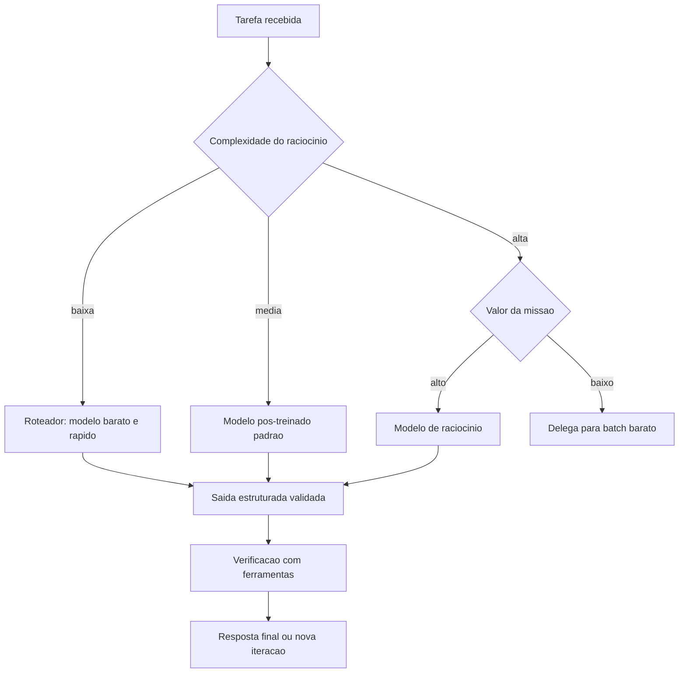

# Capítulo 4: Grandes Modelos de Linguagem como Núcleos Cognitivos

## 1. Introdução

No Capítulo 3, você mapeou o ecossistema — frameworks, protocolos, hospedagem e marketplaces. Agora vamos ao componente que define o teto de capacidade de todo sistema agêntico: o modelo de linguagem de grande escala (LLM) que funciona como núcleo cognitivo do agente. Se o framework é a aeronave, o LLM é o motor: potência, consumo, confiabilidade e envelope operacional dependem dele — e escolher mal o motor invalida todo o resto da arquitetura.

Este capítulo ensina a selecionar, invocar e controlar LLMs para sistemas agênticos. Você vai aprender o panorama dos modelos (base, pós-treinados e de raciocínio), os critérios de escolha (capacidade, custo, latência, soberania), as técnicas de invocação e controle (prompting, temperatura, restrições de formato, gestão de contexto) e — com a mesma honestidade dos capítulos anteriores — as limitações estruturais desses núcleos: memória finita, grounding, planejamento, segurança e custo. Ao final, você saberá responder, para qualquer caso de uso: qual modelo, com quais parâmetros, dentro de quais limites.

## 2. Explica

O mercado de LLMs em 2026 organiza-se em três famílias que importam para o engenheiro de agentes. A primeira é a dos **modelos base**: treinados em terabytes de texto e código, com forte capacidade de completar sequências, mas sem ajuste para conversação ou instrução. São raros em produção de agentes diretamente — servem de matéria-prima para as outras famílias. A segunda é a dos **modelos pós-treinados** (instruction-tuned e RLHF): ajustados para seguir instruções e conversar, são o padrão de mercado para agentes de propósito geral — a família que alimenta a maioria das aplicações empresariais [1]. A terceira é a dos **modelos de raciocínio**: treinados com reforço para gastar mais tokens de pensamento antes de responder, com desempenho superior em matemática, código e problemas de múltiplos passos — e custo e latência maiores, o que exige disciplina de uso [2]. A pesquisa de levantamento confirma que a escolha entre as famílias muda a arquitetura: modelos de raciocínio reduzem a necessidade de agentes planejadores separados, enquanto modelos pós-treinados exigem orquestração mais explícita [3].

A escolha do modelo — **seleção** — é uma decisão de engenharia com cinco eixos: capacidade (a tarefa exige raciocínio avançado ou basta instrução simples?), custo por token (o volume de uso pode dominar o orçamento), latência (o caso é síncrono, como chat, ou assíncrono, como batch?), soberania e privacidade (os dados podem sair da infraestrutura da empresa?) e maturidade de ferramentas (o modelo suporta function calling, structured output e o protocolo MCP?). Nenhum modelo ganha em todos os eixos — a prática consolidada é ter **dois ou três modelos no portfólio**: um barato e rápido para roteamento de tarefas simples, um poderoso para tarefas complexas e, quando necessário, um de raciocínio para tarefas de alto valor [4].

A **invocação** é o segundo grande tema. Um agente chama o LLM muitas vezes por tarefa — cada chamada é uma decisão de engenharia: qual prompt, qual temperatura, qual esquema de saída, quanto contexto. As técnicas de controle convergem em quatro alavancas: (1) prompting estruturado (o prompt como contrato: papel, tarefa, restrições, formato); (2) parâmetros de amostragem (temperatura para criatividade vs. determinismo); (3) saída estruturada (JSON Schema obrigatório — elimina parsing frágil); e (4) gestão de contexto (o que entra na janela: instruções, memória, ferramentas e dados — e o que fica fora) [5]. A evidência empírica mostra que a alavanca de maior retorno em sistemas agênticos não é o prompt, mas a **estrutura de decisão ao redor do modelo**: quantas vezes e com qual feedback o agente chama o LLM [6].

Por fim, o terceiro tema são as **limitações estruturais** — o conhecimento que separa o engenheiro real do entusiasta. A janela de contexto, mesmo grande, não é memória: informação que não cabe ou que se perde no meio da janela é informação perdida — daí os sistemas de memória do Capítulo 7. O grounding é parcial: modelos alucinam fatos com confiança, e a única defesa é verificação externa via ferramentas. O planejamento é frágil em horizontes longos: erros se acumulam a cada passo, e a re-deliberação (Capítulo 2) é a mitigação. A segurança não é inerente: jailbreaks e injeções de prompt exigem defesas de camada (Capítulo 13). E o custo cresce com a complexidade — a gestão de custo é uma disciplina de arquitetura, não de fatura [7].

### O Orçamento de Contexto como Disciplina de Projeto

A janela de contexto é um recurso finito — e tratá-la como tal é a disciplina que separa sistemas que escalam de sistemas que sufocam. A prática consolidada define o contexto como um **orçamento com rubricas**: instruções (o prompt de sistema), memória (o que o Capítulo 2 recuperou), ferramentas (as definições que o Capítulo 6 mantém), dados (o que a tarefa traz) e saída (o que o modelo precisa produzir) [5]. Cada rubrica compete pelo mesmo espaço, e a ordem de prioridade é invariável: instruções primeiro (são o contrato — cortá-las é cortar o comportamento); dados e ferramentas depois (são o material da tarefa); memória por último (é o mais compressível — sintetizar em vez de anexar). A alavanca de engenharia mais eficaz é a **compressão seletiva**: memória episódica antiga vira resumo (Capítulo 2), documentos longos vêm por fatia (Capítulo 7), e históricos de conversa são truncados com âncora — manter o objetivo da tarefa, cortar o verbatim [6].

A segunda prática é o **dimensionamento por etapa**: cada chamada ao LLM tem um contexto diferente, e carregar a janela inteira em toda chamada é pagar por uma caixa grande para entregar um pacote pequeno. Os sistemas maduros classificam as chamadas — a chamada de triagem precisa só das instruções; a de extração, das instruções e do documento; a de consolidação, das instruções e dos resultados — e montam o contexto sob medida para cada etapa. A consequência financeira é direta: o custo da chamada cresce com o número de tokens de entrada — reduzir o contexto pela metade corta o custo em proporção comparável, sem tocar na qualidade quando a compressão é seletiva [7]. E a consequência de qualidade é a mais citada nos relatórios de fracasso: **contexto inflado degrada a resposta** — o modelo atende a mais sinais, e sinais conflitantes ou obsoletos contaminam a decisão; a literatura de prompts de longa distância documenta o fenômeno do "meio perdido" — informação no meio da janela tem menos influência do que o início e o fim, o que significa que colocar memória importante no meio do contexto é colocá-la em zona de baixa influência [8].

A disciplina do orçamento de contexto também redefine o papel do Engenheiro Agêntico: menos "escritor de prompts" e mais **gestor de janela** — decide o que entra, o que sai, o que é comprimido e o que é recuperado sob demanda. As ferramentas técnicas dessa gestão são concretas: contagem de tokens por rubrica (a telemetria do Capítulo 11), limite de contexto por etapa (o roteamento do Capítulo 4), políticas de compressão (a memória do Capítulo 2) e fatia de documento por necessidade (o RAG do Capítulo 7). O teste prático de uma boa gestão é brutal e simples: **se a resposta não melhora quando você dobra o contexto, você está pagando por informação que não é usada** — corte o que não decide, e o sistema fica mais rápido, mais barato e, na maioria dos casos, mais preciso [9].

## 3. Ilustra

### O Motor da Aeronave: Potência, Consumo e Envelope

Voltemos à Torre de Controle. O LLM é o motor da aeronave. Os **modelos base** são motores de laboratório: potentes em bancada, mas sem instrumentação de voo — raramente voam sozinhos. Os **pós-treinados** são motores de linha: confiáveis, documentados, com envelope operacional amplo — a frota padrão. Os **modelos de raciocínio** são os motores de alto desempenho: queimam mais combustível (custo e latência) para entregar mais empuxo em voos complexos — reservados para missões de alto valor. O controle do motor — temperatura, prompts, formato — é o conjunto de instrumentos do piloto: você não pilota "o motor", você pilota seus parâmetros [2]. E o envelope operacional é a janela de contexto e os limites de segurança: operar além dele não é ousadia, é acidente.



### Por Que Mais Motor Não Resolve Tudo

A segunda camada de analogia trata do ponto mais contraintuitivo: o estagiário brilhante com péssimos hábitos de trabalho. Você troca o estagiário por outro com QI maior — e os relatórios continuam errados. O problema não era a inteligência, era o processo: ele não verificava dados, não seguia formato e não pedia ajuda quando o escopo crescia. Com LLMs acontece o mesmo: **trocar o modelo é a alavanca mais fraca quando o problema está no processo**. Um agente com modelo mediano, verificação por ferramentas e saída estruturada vence um agente com modelo superior, prompt solto e parsing frágil — porque a maioria dos erros em produção vem da orquestração, não do cérebro [6]. Como Engenheiro Agêntico, você vai perceber que o jogo não é comprar o motor mais caro: é calibrar o motor que você tem e desenhar o processo que compensa seus limites [8].

## 4. Técnica

### Portfólio de Modelos com Roteamento

A primeira técnica é o **roteador de modelos**: um componente que decide, por tarefa, qual modelo do portfólio atenderá a chamada — o padrão que domina produção com custo controlado. O roteador avalia a complexidade da tarefa e o valor da missão, e despacha para o modelo adequado. A implementação abaixo é uma versão didática e executável do padrão, com classificação por heurísticas de custo [4].

```python
# roteador_modelos.py
# -*- coding: utf-8 -*-
"""Roteamento de chamadas entre modelos de custo e capacidade diferentes."""

from dataclasses import dataclass
from typing import Callable, Optional


@dataclass
class PerfilModelo:
    nome: str
    custo_por_1k_tokens: float
    suporta_raciocinio: bool
    chamar: Callable[[str, dict], str]


class Roteador:
    """Despacha cada tarefa para o modelo mais barato capaz de resolve-la."""

    def __init__(self) -> None:
        self.modelos: dict[str, PerfilModelo] = {}
        self.total_gasto: float = 0.0

    def registrar(self, perfil: PerfilModelo) -> None:
        self.modelos[perfil.nome] = perfil

    def _estimar_tokens(self, prompt: str) -> int:
        return max(1, len(prompt.split()) // 2)

    def escolher(self, tarefa: str, precisa_raciocinio: bool) -> str:
        """Escolhe o modelo mais barato que atende aos requisitos."""
        candidatos = [
            m for m in self.modelos.values()
            if (not precisa_raciocinio) or m.suporta_raciocinio
        ]
        return min(candidatos, key=lambda m: m.custo_por_1k_tokens).nome

    def processar(self, tarefa: str, precisa_raciocinio: bool = False) -> str:
        nome = self.escolher(tarefa, precisa_raciocinio)
        perfil = self.modelos[nome]
        resultado = perfil.chamar(tarefa, {"modo": "agente"})
        self.total_gasto += self._estimar_tokens(tarefa) * perfil.custo_por_1k_tokens
        return f"[{nome}] {resultado}"


def simular_chamada(modelo: str) -> Callable[[str, dict], str]:
    def chamar(prompt: str, _opts: dict) -> str:
        return f"resposta de {modelo} para: {prompt[:40]}"
    return chamar


def main() -> None:
    roteador = Roteador()
    roteador.registrar(PerfilModelo("rapido", 0.15, False, simular_chamada("rapido")))
    roteador.registrar(PerfilModelo("padrao", 1.00, False, simular_chamada("padrao")))
    roteador.registrar(PerfilModelo("raciocinio", 8.00, True, simular_chamada("raciocinio")))

    for tarefa, raciocinar in [
        ("classificar chamado de suporte", False),
        ("resolver problema de matematica avancada", True),
        ("traduzir paragrafo", False),
    ]:
        print(roteador.processar(tarefa, raciocinar))
    print(f"Custo total da sessao: R$ {roteador.total_gasto:.2f}")


if __name__ == "__main__":
    main()
```

### Invocação com Saída Estruturada

A segunda técnica é a **invocação com contrato de saída**: forçar o LLM a devolver JSON que respeita um schema — a prática que elimina a classe inteira de bugs de parsing e habilita a validação automática. O padrão é: o prompt declara o schema (papel, campos, restrições), o modelo responde em JSON, e o agente valida contra o schema **antes** de usar os dados [5]. A implementação abaixo demonstra o ciclo completo com validação estrita.

```python
# saida_estruturada.py
# -*- coding: utf-8 -*-
"""Invocacao de LLM com saida JSON validada contra schema."""

import json
from typing import Any, Callable, Optional


class ValidadorJson:
    """Valida respostas do LLM contra um contrato de campos obrigatorios."""

    def __init__(self, campos_obrigatorios: list[str], tipos: Optional[dict[str, type]] = None) -> None:
        self.campos = campos_obrigatorios
        self.tipos = tipos or {}

    def validar(self, texto_resposta: str) -> dict[str, Any]:
        """Valida a resposta bruta do modelo e levanta erro se o contrato falhar."""
        try:
            dados = json.loads(texto_resposta)
        except json.JSONDecodeError as erro:
            raise ValueError(f"resposta nao e JSON valido: {erro}") from erro
        ausentes = [c for c in self.campos if c not in dados]
        if ausentes:
            raise ValueError(f"campos obrigatorios ausentes: {ausentes}")
        for campo, tipo in self.tipos.items():
            if campo in dados and not isinstance(dados[campo], tipo):
                raise ValueError(f"campo '{campo}' deve ser {tipo.__name__}")
        return dados


def invocar_com_contrato(
    modelo: Callable[[str], str],
    prompt_base: str,
    validador: ValidadorJson,
) -> dict[str, Any]:
    """Chama o modelo exigindo resposta JSON e devolve dados validados."""
    contrato = json.dumps({"campos": validador.campos})
    resposta = modelo(prompt_base + "\nResponda apenas em JSON com os campos: " + contrato)
    return validador.validar(resposta)


def main() -> None:
    def modelo_simulado(prompt: str) -> str:
        return json.dumps({
            "intencao": "abrir_chamado",
            "prioridade": "alta",
            "resumo": "cliente relata pedido atrasado",
        })

    validador = ValidadorJson(
        campos_obrigatorios=["intencao", "prioridade", "resumo"],
        tipos={"prioridade": str, "resumo": str},
    )
    resultado = invocar_com_contrato(
        modelo_simulado,
        "Classifique a mensagem do cliente em intencao, prioridade e resumo.",
        validador,
    )
    print("Intencao:", resultado["intencao"])
    print("Prioridade:", resultado["prioridade"])
    print("Resumo:", resultado["resumo"])


if __name__ == "__main__":
    main()
```

### Controle de Custo e Latência na Prática

A terceira técnica é a **gestão de custo e latência por arquitetura** — a disciplina que mantém um sistema de agentes viável economicamente. As alavancas práticas, em ordem de impacto: (1) roteamento (acima): tarefas simples nunca pagam modelo caro; (2) cache de respostas semânticas: perguntas repetidas são respondidas do cache com similaridade de embedding; (3) compra de tokens em batch para workloads assíncronos (até 50% mais barato); (4) prompt comprimido: instruções enxutas reduzem tokens de entrada e latência; (5) modelo de raciocínio só quando o custo do erro supera o custo do modelo [4]. O controle é a mesma disciplina da torre: você não otimiza "o voo", otimiza o sistema de voos — o conjunto de missões, com seus perfis de urgência e valor, determina o mix de motores e combustível [7].

## 5. Aplica

### A Cena de Contraste: O Motor Certo, a Instrumentação Errada

Sua equipe migra um assistente de triagem para o modelo de raciocínio mais caro do mercado, esperando uma queda dramática nos erros. A fatura sobe 8 vezes; a qualidade, quase nada. A análise mostra o porquê: 85% das tarefas do assistente são classificação e extração — tarefas que o modelo barato resolvia; os erros que restavam não eram de "raciocínio", eram de **processo**: o agente não consultava o histórico do cliente antes de classificar, e o parsing de respostas quebrava em 12% dos casos por formato solto [6].

O diagnóstico: você trocou o motor sem consertar a instrumentação. A teoria do capítulo explica: a alavanca de maior retorno é a estrutura de decisão ao redor do modelo, não o modelo. A correção estrutural: (1) implementar o roteador — 85% das tarefas voltam ao modelo barato, e o de raciocínio fica reservado aos casos de alto valor; (2) adicionar a ferramenta "consultar_historico_cliente" ao fluxo de triagem (verificação externa — o grounding de que falamos); (3) forçar saída estruturada com validação JSON em todas as chamadas; (4) medir por missão (custo por tarefa resolvida), não por qualidade abstrata. Resultado: custo 3 vezes menor que o pico, taxa de resolução correta maior — porque o processo, não o motor, passou a ser o foco [7].

Armadilhas comuns: escolher o modelo pelo benchmark em vez do caso de uso; pagar raciocínio para tarefas de classificação; e ignorar o custo por tarefa resolvida — a métrica que o CFO vai pedir no primeiro trimestre [4].

## 6. Conclusão

Este capítulo fechou o fundamento do núcleo cognitivo. Você aprendeu (1) o panorama dos LLMs em três famílias — base, pós-treinados e raciocínio — e os cinco eixos de seleção; (2) as quatro alavancas de invocação e controle — prompt, parâmetros, saída estruturada e gestão de contexto; e (3) as limitações estruturais — memória, grounding, planejamento, segurança e custo — e as técnicas de roteamento e validação que as compensam. Desafio: para um caso real seu, desenhe o portfólio de dois modelos com roteador, defina o contrato JSON de uma chamada e estime o custo por 1.000 tarefas.

A Parte II começa agora: o projeto e a construção dos agentes. O próximo capítulo apresenta os padrões arquiteturais — do agente único aos grafos de execução e às arquiteturas multiagente — a gramática do design agêntico que sustenta tudo o que vem a seguir. Na torre, encerramos o estudo do motor e passamos ao desenho da aeronave.

## 7. Referências Bibliográficas

[1] LUO, Junyu; ZHANG, Weizhi; YUAN, Ye et al. *Large Language Model Agent: A Survey on Methodology, Applications and Challenges*. Disponível em: https://arxiv.org/abs/2503.21460. Acesso em: 07 ago. 2026.
[2] *Agentic Large Language Models, a survey*. Disponível em: https://arxiv.org/html/2503.23037. Acesso em: 07 ago. 2026.
[3] ABOU ALI, Mohamad; DORNAIKA, Fadi; CHARAFEDDINE, Jinan. *Agentic AI: A Comprehensive Survey of Architectures, Applications, and Challenges*. Disponível em: https://arxiv.org/abs/2510.25445. Acesso em: 07 ago. 2026.
[4] DELOITTE. *Agentic AI in enterprise: Adoption, risk, and transformation*. Disponível em: https://www.deloitte.com/content/dam/assets-zone3/us/en/docs/services/consulting/2025/agentic-ai-enterprise-adoption-guide.pdf. Acesso em: 07 ago. 2026.
[5] HUANG, Wenhao; ABUDULAILI, Xin; RONG, Yang et al. *A Review of Prominent Paradigms for LLM-Based Agents: Tool Use (Including RAG), Planning, and Feedback Learning*. Disponível em: https://arxiv.org/html/2406.05804. Acesso em: 07 ago. 2026.
[6] ARUNKUMAR, V.; GANGADHARAN, G. R.; BUYYA, Rajkumar. *Agentic Artificial Intelligence (AI): Architectures, Taxonomies, and Evaluation of Large Language Model Agents*. Disponível em: https://arxiv.org/abs/2601.12560. Acesso em: 07 ago. 2026.
[7] GARTNER. *Gartner Predicts Over 40% of Agentic AI Projects Will Be Canceled by End of 2027*. Disponível em: https://www.gartner.com/en/newsroom/press-releases/2025-06-25-gartner-predicts-over-40-percent-of-agentic-ai-projects-will-be-canceled-by-end-of-2027. Acesso em: 07 ago. 2026.
[8] WANG, Lei; MA, Chen; FENG, Xueyang et al. *A Survey on Large Language Model based Autonomous Agents*. Disponível em: https://arxiv.org/abs/2308.11432. Acesso em: 07 ago. 2026.
[9] OPENAI. *Evals (PaperBench, SWE-Lancer, MLE-bench, SWE-bench Verified)*. Disponível em: https://evals.openai.com/. Acesso em: 07 ago. 2026.
[10] ZHAO, Pengyu; JIN, Zijian; CHENG, Ning. *An In-depth Survey of Large Language Model-based Artificial Intelligence Agents*. Disponível em: https://arxiv.org/html/2309.14365. Acesso em: 07 ago. 2026.
[11] CHENG, Yuheng; ZHANG, Ceyao; ZHANG, Zhengwen et al. *Exploring Large Language Model based Intelligent Agents: Definitions, Methods, and Prospects*. Disponível em: https://arxiv.org/html/2401.03428. Acesso em: 07 ago. 2026.
[12] DEROUICHE, Hana; BRAHMI, Zaki; MAZENI, Haithem. *Agentic AI Frameworks: Architectures, Protocols, and Design Challenges*. Disponível em: https://arxiv.org/html/2508.10146. Acesso em: 07 ago. 2026.
[13] SINGH, Aditi; EHTESHAM, Abul; KUMAR, Saket et al. *Agentic Retrieval-Augmented Generation: A Survey on Agentic RAG*. Disponível em: https://arxiv.org/abs/2501.09136. Acesso em: 07 ago. 2026.
[14] ZHANG, Zeyu; BO, Xiaohe; MA, Chen et al. *A Survey on the Memory Mechanism of Large Language Model based Agents*. Disponível em: https://arxiv.org/html/2404.13501. Acesso em: 07 ago. 2026.
[15] OWASP GEN AI SECURITY PROJECT. *OWASP Top 10 for Agentic Applications for 2026*. Disponível em: https://genai.owasp.org/resource/owasp-top-10-for-agentic-applications-for-2026/. Acesso em: 07 ago. 2026.
[16] LANGCHAIN. *Workflows and agents — Docs*. Disponível em: https://docs.langchain.com/oss/python/langgraph/workflows-agents. Acesso em: 07 ago. 2026.
[17] MODEL CONTEXT PROTOCOL. *Specification 2026-07-28*. Disponível em: https://modelcontextprotocol.io/specification/2026-07-28. Acesso em: 07 ago. 2026.
[18] OPENAI. *Separating signal from noise in coding evaluations*. Disponível em: https://openai.com/index/separating-signal-from-noise-coding-evaluations/. Acesso em: 07 ago. 2026.
[19] GARTNER. *2026 Hype Cycle for Agentic AI*. Disponível em: https://www.gartner.com/en/articles/hype-cycle-for-agentic-ai. Acesso em: 07 ago. 2026.
[20] ZHU, Yuxuan; JIN, Tengjun; PRUKSACHATKUN, Yada et al. *Establishing Best Practices for Building Rigorous Agentic Benchmarks*. Disponível em: https://arxiv.org/html/2507.02825. Acesso em: 07 ago. 2026.
