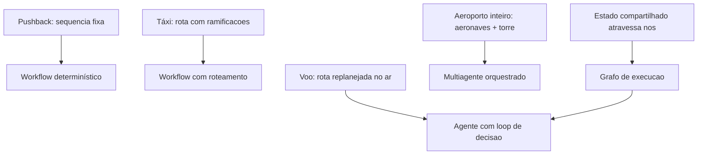

# Capítulo 5: Padrões de Agentes e Paradigmas de Design

## 1. Introdução

No Capítulo 4, você dominou o núcleo cognitivo — como escolher, invocar e controlar LLMs. Agora começamos a Parte II da obra: o design e a construção dos agentes. Este capítulo é a gramática do design agêntico: os padrões arquiteturais que você usará em todo projeto — do agente único aos workflows determinísticos, passando pelos grafos de execução (com estado, nós, arestas e paralelismo) e chegando às arquiteturas multiagente e ao comportamento emergente.

A distinção mais importante que você vai internalizar aqui é entre **workflow** e **agente**. Workflows são caminhos pré-definidos que os LLMs percorrem; agentes são caminhos que o próprio LLM decide enquanto executa. A maioria dos sistemas de produção precisa dos dois — e a diferença entre uma equipe madura e uma imatura é saber quando usar cada um. Na Torre de Controle, este capítulo é o manual do desenho das rotas: quando cada voo segue um plano fixo e quando o piloto decide a rota em tempo real.

## 2. Explica

O design de sistemas agênticos começa por uma escolha estrutural: o grau de autonomia do caminho de execução. A taxonomia consolidada na literatura e nas documentações de referência distingue duas grandes classes [1]. A primeira é a dos **workflows**: o caminho é desenhado pelo engenheiro antes da execução — o LLM preenche etapas, mas a sequência é fixa. Exemplos clássicos: prompt chaining (uma etapa alimenta a próxima), roteamento (uma classificação decide qual sub-fluxo seguir), paralelização (múltiplas chamadas independentes), orquestrador-trabalhadores (um coordenador despacha subtarefas) e avaliador-otimizador (uma passagem gera, outra revisa). A segunda é a dos **agentes**: o caminho é decidido pelo modelo durante a execução — o LLM escolhe a próxima ação com base no estado atual, em um loop aberto [2]. A documentação da LangChain formaliza essa distinção com uma diretriz prática: quando o caminho é conhecido e previsível, use workflow; quando o caminho depende do conteúdo e da evolução da tarefa, use agente — e a maioria dos sistemas robustos é uma combinação hierárquica dos dois [1].

O padrão mais poderoso para sistemas complexos é o **grafo de execução** — a abstração que o LangGraph popularizou: o sistema é modelado como um grafo em que os **nós** são funções (que podem chamar LLM, ferramentas ou código) e as **arestas** definem o fluxo (condicional, paralelo ou determinístico), com um **estado** compartilhado que atravessa os nós [3]. Essa abstração resolve dois problemas que matam projetos: a orquestração de fluxos com ramificações e o reuso de sub-fluxos. Em vez de aninhar funções e prompts, o engenheiro declara o grafo e deixa o runtime gerenciar o estado e a execução — incluindo checkpoints e retomada, essenciais para produção [4].

A terceira camada é a das **arquiteturas multiagente**. A literatura distingue dois modos de organização: orquestração centralizada (um agente coordenador despacha e consolida — mais previsível e auditável) e delegação descentralizada (agentes negociam e encadeiam trabalho — mais flexível, com comportamento emergente). O comportamento emergente é o fenômeno em que o sistema como um todo resolve problemas que nenhum agente individual resolveria, observado em experimentos como os Generative Agents de Park et al., que simularam uma comunidade de 25 agentes com memória, relações e rotinas diárias [5]. Para produção, a recomendação consolidada é começar com orquestração centralizada e só introduzir delegação onde o caso de uso exige — a flexibilidade descentralizada custa previsibilidade e auditabilidade [6].

A lição de engenharia que amarra o capítulo: a complexidade deve ser adicionada deliberadamente, não acumulada por acidente. O padrão de design certo para um problema é o mais simples que resolve o problema com os requisitos de qualidade atendidos — e a escala de complexidade vai de chamada única → workflow → agente único → grafo → multiagente. Cada degrau adiciona capacidade e custo: latência, tokens, superfície de erro e dificuldade de depuração [2].

### Padrões de Orquestração da Indústria

A orquestração na prática industrial converge em quatro padrões nomeados — e a maior parte da confusão conceitual em projetos reais desaparece quando a equipe os nomeia. O primeiro é o **sequencial**: um agente passa o resultado ao próximo em cadeia — triagem → extração → consolidação — o padrão mais simples, determinístico e auditável, adequado a pipelines de etapas estáveis (o coletor, analista e compilador do estudo de caso do Capítulo 16 são exatamente isso) [2]. O segundo é o **fan-out paralelo**: um orquestrador divide o trabalho em partes independentes, despacha os agentes simultaneamente e consolida — o padrão de análise multi-fonte, onde cada fonte é um agente e o tempo total é o da fonte mais lenta, não a soma de todas [5]. O terceiro é o **supervisor**: um agente coordenador delega tarefas a agentes especializados e avalia cada resultado antes de avançar — o padrão de qualidade mais alto, porque introduz um ponto de verificação entre etapas, e o mais caro, porque cada avaliação intermediária é uma chamada de modelo (o equilíbrio de custo é uma decisão do Capítulo 9) [6]. O quarto é o **swarm/delegação dinâmica**: agentes negociam quem faz o quê sem um coordenador fixo — o padrão mais flexível, mais difícil de depurar e o único que a literatura recomenda adotar somente depois que os outros três estiverem dominados [5].

A decisão entre os padrões segue duas regras que a prática consolidou. A primeira: **comece pelo padrão mais simples que atende o caso** — sequencial resolve 60% dos casos reais; fan-out resolve outros 20%; supervisor resolve mais 10%; swarm resolve os 10% restantes com custo de complexidade desproporcional [2]. A segunda: **a complexidade deve ser adicionada por evidência, não por antecipação** — você só migra de sequencial para fan-out quando a medição mostra que o gargalo é a etapa sequencial, e de fan-out para supervisor quando a avaliação mostra que a qualidade da consolidação degrada sem verificação intermediária; migrar por hipótese é o caminho mais curto para a dívida arquitetural que o Capítulo 11 acusa na observabilidade [6].

Há ainda a dimensão do **controle humano na orquestração**: cada padrão admite pontos de verificação humana — gates no sequencial (o relatório intermediário é aprovado antes da próxima etapa), consolidação revisada no fan-out, decisão do supervisor revisitada pelo humano nos casos limítrofes, e a política do swarm limitada por escopo (o Capítulo 14). A prática recomenda desenhar os gates **antes** da implementação: cada ponto onde um humano revisa é um custo de latência e um ganho de confiança — e a proporção certa entre os dois é uma decisão de produto, não de código. O resultado é que a orquestração madura se parece menos com "muitos agentes pensando" e mais com **uma linha de produção com pontos de inspeção** — previsível, mensurável e auditável, exatamente como os sistemas de produção que o mercado valoriza [6].

### O Orçamento de Latência da Orquestração

Cada padrão de orquestração tem uma assinatura de latência — e escolher o padrão sem calcular o orçamento de tempo é desenhar o sistema que o usuário abandona antes da primeira resposta boa. A matemática é simples e implacável: o **sequencial** soma as latências das etapas — três agentes de 3 segundos viram 9 segundos de resposta, e a cada etapa adicionada o usuário espera mais uma fração; o **fan-out paralelo** custa o máximo das latências — os mesmos três agentes em paralelo viram 3 segundos, o que o torna o padrão obrigatório quando as etapas são independentes e o tempo é o recurso escasso; o **supervisor** adiciona a latência das avaliações intermediárias — cada verificação é uma chamada de modelo a mais na cadeia, e o custo em tempo do supervisor precisa ser justificado pela qualidade que ele adiciona (o trade-off que o Capítulo 9 formaliza em custo) [2]. O primeiro exercício do arquiteto, antes de implementar, é **escrever a conta de latência do caso**: quantas chamadas ao modelo por tarefa, em cada padrão candidato, com quanto tempo cada uma — e comparar com o orçamento do produto (a resposta do suporte pode levar 30 segundos; a do assistente de e-commerce, 3) [6].

O segundo exercício é o **desenho de limites de latência por etapa**: cada etapa ganha um teto — a triagem não pode passar de 1 segundo; a recuperação de memória, de 200 ms; a chamada de ferramenta, de 2 segundos — e o teto é monitorado (Capítulo 11) e usado pelo roteador (Capítulo 4): quando a etapa estoura o teto, o sistema degrada com dignidade — responde com o que já tem (a resposta parcial, a escalação, a mensagem de "estamos terminando") em vez de deixar o usuário em silêncio [2]. O terceiro exercício é a **medição da percepção, não só da máquina**: o p50 engana — o usuário sente o p95; e o tempo percebido inclui a rede, a fila e o render — a telemetria mede a jornada completa, do clique à resposta visível, e o orçamento é desenhado sobre essa medida, não sobre a latência do modelo isolada [5].

A síntese do orçamento de latência é o princípio que o capítulo sustenta: **orquestração é a arte de gastar o tempo da tarefa onde a qualidade precisa** — o padrão certo não é o mais elegante, é o que cabe no orçamento com a qualidade exigida; e o sistema maduro conhece sua conta de latência de cor, porque é ela que define o padrão, o teto por etapa e a resposta de degradação — os três artefatos que separam o sistema desenhado do sistema improvisado [6].

## 3. Ilustra

### Rotas Fixas e Voos Livres na Torre de Controle

Voltemos à Torre de Controle. Em um aeroporto, nem todo movimento é um voo livre. O **pushback** da aeronave do portão à pista é um procedimento fixo: cada passo é conhecido, a sequência é obrigatória — isso é um workflow. O **táxi até a pista** segue uma rota determinada, com ramificações conhecidas (pista ocupada? aguarde na holding point) — um workflow com roteamento. O **voo em si**, do portão ao destino, é um agente: a rota é re-planejada em tempo real conforme clima, tráfego e emergências; o piloto decide o próximo waypoint com base no estado atual. E o **controle de tráfego aéreo como um todo** é o sistema multiagente: cada aeronave é um agente, coordenado pela torre — e o comportamento emergente é o pouso seguro de centenas de aeronaves em um dia de caos meteorológico [1].



### Por Que o Grafo é o Quadro de Comandos

A segunda camada de analogia trata do ponto mais difícil: a diferença entre código procedural e grafo de execução. Imagine o quadro de comandos da torre: centenas de sensores, telas e alertas. O controlador não escreve um script "se X então Y" para cada situação — ele olha o estado atual do sistema e decide a próxima ação, com o estado persistindo entre as decisões. O grafo de execução faz o mesmo para o agente: o estado é um objeto compartilhado que os nós leem e escrevem; as arestas decidem o próximo nó conforme o estado; e o checkpoint do grafo permite retomar do ponto exato de uma interrupção [3]. Como Engenheiro Agêntico, você vai perceber que modelar o sistema como grafo — e não como sequência de chamadas — é o que torna o sistema depurável: cada nó é testável isoladamente e cada transição é observável [4].

## 4. Técnica

### Implementando um Grafo de Execução com Estado

A técnica central deste capítulo é a implementação de um grafo de execução com estado compartilhado. A abstração é a mesma do LangGraph, mas implementada em Python puro para que a mecânica fique explícita: um grafo tem nós (funções que transformam o estado), arestas (que decidem a sequência, com condicionais) e um estado que atravessa tudo [3].

```python
# grafo_execucao.py
# -*- coding: utf-8 -*-
"""Grafo de execucao com estado compartilhado, nos e arestas condicionais."""

from dataclasses import dataclass, field
from typing import Any, Callable, Optional


@dataclass
class Estado:
    """Estado compartilhado que atravessa os nos do grafo."""
    entrada: str = ""
    classificacao: Optional[str] = None
    dados: dict[str, Any] = field(default_factory=dict)
    resposta: Optional[str] = None


class Grafo:
    """Implementacao didatica de um grafo de execucao com checkpoints."""

    def __init__(self) -> None:
        self.nos: dict[str, Callable[[Estado], Estado]] = {}
        self.arestas: dict[str, str] = {}
        self.condicionais: dict[str, Callable[[Estado], str]] = {}

    def adicionar_no(self, nome: str, funcao: Callable[[Estado], Estado]) -> None:
        self.nos[nome] = funcao

    def adicionar_aresta(self, origem: str, destino: str) -> None:
        self.arestas[origem] = destino

    def adicionar_condicional(self, origem: str, decidir: Callable[[Estado], str]) -> None:
        self.condicionais[origem] = decidir

    def executar(self, estado_inicial: Estado, no_inicial: str,
                 max_passos: int = 20) -> Estado:
        """Executa o grafo a partir do no inicial, com limite de passos."""
        estado = estado_inicial
        no_atual = no_inicial
        passos = 0
        while no_atual is not None and passos < max_passos:
            estado = self.nos[no_atual](estado)
            if no_atual in self.condicionais:
                no_atual = self.condicionais[no_atual](estado)
            else:
                no_atual = self.arestas.get(no_atual)
            passos += 1
        return estado


def no_classificar(estado: Estado) -> Estado:
    """Classifica a entrada: reembolso ou troca."""
    if "reembolso" in estado.entrada.lower() or "devolver" in estado.entrada.lower():
        estado.classificacao = "reembolso"
    else:
        estado.classificacao = "troca"
    return estado


def no_consultar_pedido(estado: Estado) -> Estado:
    """Consulta simulada de dados do pedido."""
    estado.dados["status_pedido"] = "entregue_ha_5_dias"
    estado.dados["elegivel_reembolso"] = True
    return estado


def no_calcular_reembolso(estado: Estado) -> Estado:
    """Calcula o valor do reembolso."""
    estado.dados["valor_reembolso"] = 149.90
    return estado


def no_iniciar_troca(estado: Estado) -> Estado:
    """Inicia o fluxo de troca."""
    estado.dados["fluxo_troca"] = "agendado"
    return estado


def no_responder(estado: Estado) -> Estado:
    """Consolida a resposta final."""
    estado.resposta = f"Pronto: {estado.classificacao} -> {estado.dados}"
    return estado


def montar_grafo_suporte() -> Grafo:
    """Constroi o grafo de execucao do atendimento."""
    grafo = Grafo()
    grafo.adicionar_no("classificar", no_classificar)
    grafo.adicionar_no("consultar_pedido", no_consultar_pedido)
    grafo.adicionar_no("calcular_reembolso", no_calcular_reembolso)
    grafo.adicionar_no("iniciar_troca", no_iniciar_troca)
    grafo.adicionar_no("responder", no_responder)
    grafo.adicionar_aresta("classificar", "consultar_pedido")
    grafo.adicionar_condicional("consultar_pedido", decidir_fluxo)
    grafo.adicionar_aresta("calcular_reembolso", "responder")
    grafo.adicionar_aresta("iniciar_troca", "responder")
    return grafo


def decidir_fluxo(estado: Estado) -> str:
    """Decide o proximo no conforme a classificacao."""
    if estado.classificacao == "reembolso":
        return "calcular_reembolso"
    return "iniciar_troca"


def main() -> None:
    grafo = montar_grafo_suporte()
    resultado = grafo.executar(
        Estado(entrada="quero devolver meu pedido e pedir reembolso"),
        no_inicial="classificar",
    )
    print(resultado.resposta)


if __name__ == "__main__":
    main()
```

### Orquestrador-Trabalhadores para Multiagente Controlado

O segundo padrão técnico é o **orquestrador-trabalhadores**: um agente coordenador que decompõe a tarefa, despacha subtarefas a trabalhadores especializados e sintetiza o resultado. É o padrão de produção para multiagente — previsível, auditável e paralelizável [2]. A implementação mostra o ciclo completo com uma fila de subtarefas e um contrato de resultado.

```python
# orquestrador_trabalhadores.py
# -*- coding: utf-8 -*-
"""Orquestrador-trabalhadores com despacho de subtarefas."""

from dataclasses import dataclass, field
from typing import Callable, Optional


@dataclass
class Subtarefa:
    id: str
    descricao: str
    trabalhador: Optional[str] = None
    resultado: Optional[str] = None


@dataclass
class ResultadoOrquestracao:
    subtarefas: list[Subtarefa] = field(default_factory=list)
    sintese: Optional[str] = None


class Orquestrador:
    """Decompoe, despacha e sintetiza tarefas com trabalhadores especializados."""

    def __init__(self,
                 decompor: Callable[[str], list[Subtarefa]],
                 sintetizar: Callable[[list[Subtarefa]], str],
                 trabalhadores: dict[str, Callable[[str], str]]) -> None:
        self.decompor = decompor
        self.sintetizar = sintetizar
        self.trabalhadores = trabalhadores

    def executar(self, tarefa: str) -> ResultadoOrquestracao:
        subtarefas = self.decompor(tarefa)
        for subtarefa in subtarefas:
            if subtarefa.trabalhador is not None:
                processar = self.trabalhadores[subtarefa.trabalhador]
                subtarefa.resultado = processar(subtarefa.descricao)
        return ResultadoOrquestracao(
            subtarefas=subtarefas,
            sintese=self.sintetizar(subtarefas),
        )


def decompor_pesquisa(descricao: str) -> list[Subtarefa]:
    """Decompoe uma tarefa de pesquisa em tres subtarefas paralelas."""
    return [
        Subtarefa("1", f"mercado: {descricao}", trabalhador="pesquisador_mercado"),
        Subtarefa("2", f"concorrentes: {descricao}", trabalhador="pesquisador_concorrentes"),
        Subtarefa("3", f"tendencias: {descricao}", trabalhador="pesquisador_tendencias"),
    ]


def sintetizar(subtarefas: list[Subtarefa]) -> str:
    return " | ".join(s.resultado or "vazio" for s in subtarefas)


def main() -> None:
    trabalhadores = {
        "pesquisador_mercado": lambda t: f"[mercado] dado sobre {t[:30]}",
        "pesquisador_concorrentes": lambda t: f"[concorrentes] dado sobre {t[:30]}",
        "pesquisador_tendencias": lambda t: f"[tendencias] dado sobre {t[:30]}",
    }
    orquestrador = Orquestrador(decompor_pesquisa, sintetizar, trabalhadores)
    resultado = orquestrador.executar("inteligencia competitiva em logistica")
    print("Sintese:", resultado.sintese)


if __name__ == "__main__":
    main()
```

### Escolhendo o Nível de Autonomia: Tabela de Decisão

A terceira técnica é a **tabela de decisão de complexidade** — o instrumento que evita tanto o subdesign (workflow onde deveria haver agente) quanto o overdesign (agente onde bastaria um workflow). Use-a no início de cada projeto: (1) o caminho é conhecido antes da execução? → workflow. (2) O caminho varia com o conteúdo, mas dentro de um conjunto finito de opções? → workflow com roteamento ou avaliador-otimizador. (3) O caminho depende de decisões contínuas do LLM com feedback? → agente único. (4) A tarefa tem sub-fluxos reutilizáveis e paralelizáveis? → grafo de execução. (5) A tarefa exige múltiplas especialidades cooperantes com papéis distintos? → orquestrador-trabalhadores. (6) A tarefa exige negociação ou competição entre entidades? → multiagente descentralizado — o último recurso, reservado a casos maduros [2]. A regra de ouro: implemente no degrau mais simples que atende aos requisitos, e suba um degrau apenas com evidência de que o atual falha — não com a expectativa de que o superior seja "melhor" [6].

## 5. Aplica

### A Cena de Contraste: O Agente que Voava Sem Plano de Voo

Sua equipe recebe a tarefa de automatizar o atendimento de devoluções. O instinto coletivo é "vamos fazer um agente" — e a equipe monta um loop aberto: um LLM com ferramentas, decidindo cada passo livremente. Funciona no teste manual. Em produção, o caos é imediato: (1) o agente decide "consultar política de reembolso" para 40% dos chamados que exigem apenas a regra fixa de 7 dias; (2) em chamados com múltiplos itens, ele aplica a política de forma inconsistente; (3) o custo por chamado explode porque cada caso gera 15-25 chamadas ao LLM; (4) a auditoria fica impossível — cada execução toma um caminho diferente [6].

O diagnóstico: você usou o degrau errado da escala de complexidade. O caminho do atendimento de devoluções é **conhecido**: classificar → consultar pedido → calcular → responder, com uma ramificação (reembolso vs. troca). Isso é um workflow com roteamento — no máximo um grafo com estado — não um agente livre. A correção estrutural: (1) modelar o fluxo como grafo com estado, com os nós fixos e uma única decisão condicional; (2) reservar o loop aberto do LLM para a etapa que de fato exige interpretação livre — o resumo da justificativa do cliente; (3) medir custo por chamado antes e depois. Resultado: custo por chamado cai 6 vezes, os caminhos executados passam a ser um conjunto enumerável (auditável) e a taxa de resolução correta sobe porque a regra fixa nunca mais é "interpretada" [1].

Armadilhas comuns: transformar todo fluxo fixo em agente (custo e inconsistência); o oposto — engessar em workflow o que exige decisão contínua (frustração do usuário); e adicionar multiagente por modismo, sem necessidade de papéis cooperantes [2].

## 6. Conclusão

Este capítulo deu a você a gramática do design agêntico. Você aprendeu (1) a distinção entre workflow e agente — caminho conhecido vs. caminho decidido em execução; (2) os grafos de execução com estado, nós, arestas condicionais e paralelismo — a abstração que torna sistemas complexos depuráveis; e (3) as arquiteturas multiagente — orquestração centralizada para produção e delegação descentralizada para casos maduros, com o comportamento emergente como possibilidade, não promessa. Desafio: mapeie um processo seu (atendimento, aprovação, análise) na tabela de decisão de complexidade e desenhe o grafo com estado correspondente.

O próximo capítulo conecta o agente ao mundo: ferramentas e interfaces — function calling, o protocolo ACP e os padrões práticos de design de ferramentas, comunicação e escalabilidade. Na torre, é o momento de instalar as runways: as pistas pelas quais a aeronave age sobre o mundo.

## 7. Referências Bibliográficas

[1] LANGCHAIN. *Workflows and agents — Docs*. Disponível em: https://docs.langchain.com/oss/python/langgraph/workflows-agents. Acesso em: 07 ago. 2026.
[2] ARUNKUMAR, V.; GANGADHARAN, G. R.; BUYYA, Rajkumar. *Agentic Artificial Intelligence (AI): Architectures, Taxonomies, and Evaluation of Large Language Model Agents*. Disponível em: https://arxiv.org/abs/2601.12560. Acesso em: 07 ago. 2026.
[3] LANGCHAIN. *Graph API overview — Docs*. Disponível em: https://docs.langchain.com/oss/python/langgraph/graph-api. Acesso em: 07 ago. 2026.
[4] LANGCHAIN. *Observability concepts — LangSmith Docs*. Disponível em: https://docs.langchain.com/langsmith/observability-concepts. Acesso em: 07 ago. 2026.
[5] PARK, Joon Sung; O'BRIEN, Joseph; CAI, Carrie et al. *Generative Agents: Interactive Simulacra of Human Behavior*. Disponível em: https://arxiv.org/abs/2304.03442. Acesso em: 07 ago. 2026.
[6] ABOU ALI, Mohamad; DORNAIKA, Fadi; CHARAFEDDINE, Jinan. *Agentic AI: A Comprehensive Survey of Architectures, Applications, and Challenges*. Disponível em: https://arxiv.org/abs/2510.25445. Acesso em: 07 ago. 2026.
[7] DEROUICHE, Hana; BRAHMI, Zaki; MAZENI, Haithem. *Agentic AI Frameworks: Architectures, Protocols, and Design Challenges*. Disponível em: https://arxiv.org/html/2508.10146. Acesso em: 07 ago. 2026.
[8] HUANG, Wenhao; ABUDULAILI, Xin; RONG, Yang et al. *A Review of Prominent Paradigms for LLM-Based Agents: Tool Use (Including RAG), Planning, and Feedback Learning*. Disponível em: https://arxiv.org/html/2406.05804. Acesso em: 07 ago. 2026.
[9] WANG, Lei; MA, Chen; FENG, Xueyang et al. *A Survey on Large Language Model based Autonomous Agents*. Disponível em: https://arxiv.org/abs/2308.11432. Acesso em: 07 ago. 2026.
[10] ZHAO, Pengyu; JIN, Zijian; CHENG, Ning. *An In-depth Survey of Large Language Model-based Artificial Intelligence Agents*. Disponível em: https://arxiv.org/html/2309.14365. Acesso em: 07 ago. 2026.
[11] CHENG, Yuheng; ZHANG, Ceyao; ZHANG, Zhengwen et al. *Exploring Large Language Model based Intelligent Agents: Definitions, Methods, and Prospects*. Disponível em: https://arxiv.org/html/2401.03428. Acesso em: 07 ago. 2026.
[12] LUO, Junyu; ZHANG, Weizhi; YUAN, Ye et al. *Large Language Model Agent: A Survey on Methodology, Applications and Challenges*. Disponível em: https://arxiv.org/abs/2503.21460. Acesso em: 07 ago. 2026.
[13] MODEL CONTEXT PROTOCOL. *Specification 2026-07-28*. Disponível em: https://modelcontextprotocol.io/specification/2026-07-28. Acesso em: 07 ago. 2026.
[14] OWASP GEN AI SECURITY PROJECT. *OWASP Top 10 for Agentic Applications for 2026*. Disponível em: https://genai.owasp.org/resource/owasp-top-10-for-agentic-applications-for-2026/. Acesso em: 07 ago. 2026.
[15] DELOITTE. *Agentic AI in enterprise: Adoption, risk, and transformation*. Disponível em: https://www.deloitte.com/content/dam/assets-zone3/us/en/docs/services/consulting/2025/agentic-ai-enterprise-adoption-guide.pdf. Acesso em: 07 ago. 2026.
[16] ANYSCALE. *AI agents on Ray Serve: Single to multi-agent architecture*. Disponível em: https://www.anyscale.com/blog/ai-agents-on-ray-serve-single-to-multi-agent-architecture. Acesso em: 07 ago. 2026.
[17] GARTNER. *Gartner Predicts 40% of Enterprise Apps Will Feature Task-Specific AI Agents by 2026*. Disponível em: https://www.gartner.com/en/newsroom/press-releases/2025-08-26-gartner-predicts-40-percent-of-enterprise-apps-will-feature-task-specific-ai-agents-by-2026-up-from-less-than-5-percent-in-2025. Acesso em: 07 ago. 2026.
[18] ZHU, Yuxuan; JIN, Tengjun; PRUKSACHATKUN, Yada et al. *Establishing Best Practices for Building Rigorous Agentic Benchmarks*. Disponível em: https://arxiv.org/html/2507.02825. Acesso em: 07 ago. 2026.
[19] GARTNER. *2026 Hype Cycle for Agentic AI*. Disponível em: https://www.gartner.com/en/articles/hype-cycle-for-agentic-ai. Acesso em: 07 ago. 2026.
[20] *AI Agent Systems: Architectures, Applications, and Evaluation*. Disponível em: https://arxiv.org/abs/2601.01743. Acesso em: 07 ago. 2026.
