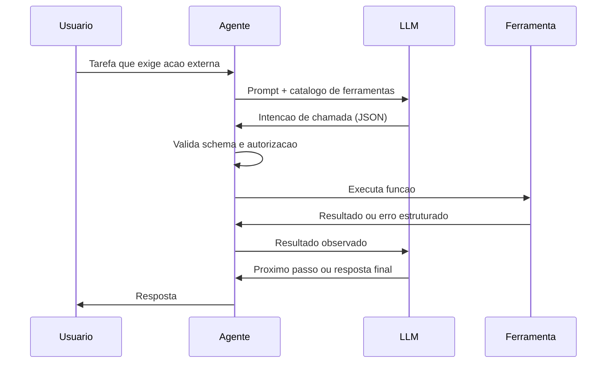

# Capítulo 6: Ferramentas e Interfaces

## 1. Introdução

No Capítulo 5, você aprendeu a desenhar o esqueleto do agente — workflows, grafos de execução e arquiteturas multiagente. Mas um agente sem ferramentas é um cérebro sem mãos: capaz de raciocinar, incapaz de agir. Este capítulo conecta o agente ao mundo: as interfaces pelas quais ele percebe e modifica sistemas externos.

Você vai aprender a mecânica do function calling (como o LLM decide chamar uma ferramenta e como o runtime executa), o protocolo ACP (Agent Communication Protocol) para padronizar a comunicação agente-agente e agente-ferramenta, e os padrões práticos de design de ferramentas — nomes, descrições, schemas, tratamento de erros, retries e escalabilidade. Na Torre de Controle, este é o capítulo das runways: as pistas que permitem a cada aeronave decolar e pousar com segurança, padronizadas para que qualquer piloto (agente) possa usá-las.

## 2. Explica

A interface fundamental entre agente e mundo é a **chamada de função** (function calling). O mecanismo é enganosamente simples e profundamente importante: o engenheiro declara um catálogo de funções com nome, descrição e schema de parâmetros; o LLM recebe esse catálogo junto com o prompt; quando a tarefa exige ação externa, o modelo responde não com texto, mas com uma **intenção de chamada** — um JSON indicando qual função e com quais argumentos; o runtime do agente executa a função de verdade e devolve o resultado ao modelo, que então continua o raciocínio [1]. A literatura sobre agentes destaca essa divisão de trabalho: o modelo **decide**, o runtime **executa**, e o modelo **verifica** o efeito — é esse ciclo que transforma conversa em operação [2].

A importância da interface declarativa é estrutural. Como o catálogo é apresentado ao modelo como dados, o LLM nunca executa código diretamente — ele apenas propõe chamadas, e o runtime as valida e executa com autorização. Essa separação é a base da segurança (Capítulo 13): o modelo não tem acesso ao sistema, apenas propostas de chamadas; o runtime impõe autenticação, autorização e limites [3]. A qualidade do design das ferramentas — nomes inequívocos, descrições precisas, schemas estritos — determina diretamente a taxa de sucesso do agente: modelos chamam a ferramenta errada quando a descrição é ambígua, e geram argumentos inválidos quando o schema é frouxo [4].

O segundo pilar é a **padronização da comunicação**. O MCP (visto no Capítulo 3) padroniza a conexão agente-ferramenta. O ACP (Agent Communication Protocol) — proposto pelo IBM e adotado pela comunidade — padroniza a comunicação entre agentes de fornecedores diferentes: mensagens, intenções, habilidades e autenticação em um formato comum [5]. O valor dos dois protocolos é o mesmo do setor de aviação: interoperabilidade sem negociação bilateral. Um agente compatível com MCP/ACP conversa com qualquer ferramenta ou agente compatível, sem integração customizada — o que muda a economia da integração: de projetos de semanas para configuração de horas [6].

O terceiro pilar são os **padrões práticos** de engenharia de ferramentas. As boas práticas consolidadas: (1) **nominação**: nomes curtos e verbos claros (consultar_pedido, cancelar_assinatura — nunca "fazer_coisa"); (2) **descrição**: descreva o quê e o quando usar — modelos escolhem por descrição; (3) **schemas estritos**: tipos, campos obrigatórios e validação — rejeite argumentos inválidos antes de executar; (4) **erros como dados**: retorne erros estruturados que o modelo possa interpretar e corrigir (não exceções silenciosas); (5) **idempotência**: executar duas vezes deve ter o mesmo efeito de executar uma vez — protege contra retries; (6) **limites**: timeouts, quotas e escopo de dados — a ferramenta deve ser segura mesmo se chamada com malícia [7]. A evidência empírica dos benchmarks de agentes mostra que esses detalhes de design são responsáveis por uma parcela significativa da diferença entre sistemas de demonstração e sistemas de produção [8].

### O Ciclo de Vida de uma Ferramenta

Ferramentas não são escritas e esquecidas — elas têm um ciclo de vida, e a maturidade da operação agêntica se mede pela disciplina desse ciclo. O primeiro estágio é a **descoberta**: identificar a capacidade que o agente precisa (consultar pedido, cancelar assinatura, calcular preço) e verificar se ela já existe — a prática de reutilizar antes de criar evita a praga dos sistemas maduros: vinte ferramentas quase idênticas com nomes diferentes, que os modelos escolhem errado por ambiguidade (a causa raiz mais comum de falha de chamada em produção) [5]. O segundo é a **criação com contrato**: a ferramenta nasce com o contrato do Capítulo 6 — nome, descrição, schema estrito, erros estruturados, idempotência e limites — e o contrato é revisado por um humano antes da primeira versão; a revisão de contrato é o equivalente da revisão de código para ferramentas de agente, e a prática de pares sobre descrições é o maior redutor conhecido de chamadas malformadas [7]. O terceiro é o **monitoramento**: cada ferramenta entra na telemetria do Capítulo 11 — frequência de chamada, taxa de sucesso, taxa de erro, latência e o desvio mais revelador: a taxa de **rechamada** (o modelo tentou, errou e tentou de novo — sinal de contrato ambíguo ou esquema frágil) [8].

O quarto estágio é a **evolução por dados**: ferramentas mudam porque os negócios mudam — novos campos, novas regras, novas exceções — e cada mudança de schema é versionada e testada contra o conjunto de avaliação (Capítulo 8) antes de entrar; a prática de versionar contratos de ferramenta com deprecação explícita (a versão antiga recebe aviso de deprecação nas descrições antes de ser removida) é o que impede que o modelo chame uma ferramenta que o runtime não entende mais [5]. O quinto e mais negligenciado é a **aposentadoria**: ferramentas que não são chamadas por N dias, ou que só erram, são removidas — com o histórico mantido na trilha de auditoria (Capítulo 11) para investigação de incidentes antigos. O sistema de ferramentas maduro é descrito por uma métrica simples e reveladora: **razão entre ferramentas chamadas e ferramentas expostas** — abaixo de 30%, a superfície de decisão está poluída, e o modelo paga o custo de escolher entre opções que não usa.

A síntese do ciclo de vida é o princípio que sustenta todos os estágios: **a ferramenta é uma interface, e interfaces são contratos que envelhecem**. A disciplina do ciclo — descobrir antes de criar, contratar antes de publicar, medir antes de evoluir, aposentar antes de acumular — transforma o conjunto de ferramentas de uma coleção ad hoc em um catálogo governado, onde cada capacidade tem dono, métrica e data de revisão [8]. É esse catálogo que torna o agente evolutivo sem quebrar — e que o Capítulo 12 materializa na operação de versões em produção, onde o ciclo de vida da ferramenta encontra o ciclo de vida do deploy.

### A Contratualização com o Mundo Externo

As ferramentas são a fronteira entre o agente e o mundo — e o mundo externo é rude: APIs caem, retornam lentidão, mudam de contrato e às vezes mentem. A prática madura trata a relação com cada sistema externo como um **contrato com cláusulas de contingência**, e as cláusulas são sempre as mesmas [5]. A primeira é o **tempo**: toda chamada externa tem timeout explícito — o agente não fica esperando uma API que nunca responde; o timeout é dimensionado pelo contrato do fornecedor (a API lenta de relatório merece mais tempo que a consulta de status) e a espera excedida vira erro estruturado, não travamento. A segunda é o **retry com política**: a falha transitória (timeout, 503) merece retry com backoff — mas a falha permanente (400, contrato quebrado) não, e retry nela é pagar para falhar de novo; a política de retry distingue as duas pelo código de erro, com contagem máxima e trilha de cada tentativa (a telemetria do Capítulo 11 registra a escada completa) [7]. A terceira é o **rate limit como cidadão de primeira classe**: o fornecedor limita — e o agente respeita com fila e priorização, em vez de atropelar e ser bloqueado; a medição do consumo (quantas chamadas do orçamento do dia já gastou) vira dado de roteamento (Capítulo 4): a ferramenta em limite vira "indisponível agora" na descrição, e o agente escolhe a alternativa.

A quarta cláusula é a **resposta degradada como contrato**: quando o externo falha, o agente tem a resposta preparada — a resposta parcial com aviso ("os dados do pedido X estão indisponíveis; segue o que temos"), a alternativa (a ferramenta B), ou a escalação (Capítulo 2); o pior comportamento do sistema não é a falha da API — é o agente que **inventa** a resposta da API que não veio, tratando o vazio do mundo externo como lacuna a preencher com imaginação [8]. E a quinta é a **versão do contrato**: o fornecedor muda o schema — e a ferramenta do agente precisa de aviso, migração e fallback: a versão antiga continua por um período com aviso de deprecação, a nova entra em canary (Capítulo 12), e o conjunto de avaliação (Capítulo 8) cobre as duas durante a transição.

A síntese da contratualização é o princípio que o capítulo sustenta: **a ferramenta não é um endpoint, é um contrato com o mundo** — e o contrato maduro prevê o tempo, o retry, o limite, a degradação e a versão, porque o mundo externo sempre quebra algum dos cinco [5] [7]. O agente que respeita os contratos do mundo externo é o agente que sobrevive ao primeiro incidente real — e o que não respeita é o que a operação conhece pelo nome no post-mortem da sexta-feira (Capítulo 11).

## 3. Ilustra

### Runways Padronizadas para Todos os Pilotos

Voltemos à Torre de Controle. Uma runway é um recurso padronizado: comprimento definido, sinalização uniforme, procedimentos de aproximação publicados. Qualquer aeronave compatível pode usá-la — sem negociar com a torre de cada aeroporto. As ferramentas do agente são as runways: (1) a **chamada de função** é a aproximação padronizada — o piloto anuncia a intenção ("autorização para pousar na 09L"), a torre valida e autoriza (o runtime executa); (2) o **schema** é a sinalização da pista — comprimento, orientação e restrições que qualquer piloto interpreta; (3) o **ACP/MCP** são os procedimentos internacionais — o idioma comum que faz uma aeronave de qualquer país operar em qualquer aeroporto; (4) o **erro estruturado** é o go-around — o procedimento padrão para arremeter e tentar de novo com informação [5].



### Por Que a Descrição da Ferramenta Decide o Sucesso

A segunda camada de analogia trata do ponto mais difícil: por que a **descrição** da ferramenta importa mais que o código dela. Imagine dois carteiros: um com um mapa onde cada rua tem nome e regras de entrega claras; outro com um mapa onde as ruas têm apelidos vagos e sem regras. O primeiro entrega tudo certo; o segundo erra endereços — não por incompetência, mas por ambiguidade do mapa. O LLM é exatamente o carteiro: ele não "vê" a sua função — ele vê a descrição. Se a descrição de `cancelar_assinatura` parecer ambígua em relação a `pausar_assinatura`, o modelo vai chamar errado com uma frequência mensurável [4]. Como Engenheiro Agêntico, você vai perceber que o design de ferramentas é, na prática, o design da **comunicação com o modelo** — e que testar a descrição (e não só o código) deve fazer parte do seu CI de agentes [8].

## 4. Técnica

### Implementando Function Calling com Validação e Erros Estruturados

A técnica central é a implementação completa do ciclo de function calling — catálogo, decisão do modelo, validação, execução, erro estruturado e feedback ao modelo. A implementação abaixo é executável e segue os padrões práticos do capítulo [1].

```python
# function_calling.py
# -*- coding: utf-8 -*-
"""Ciclo completo de function calling com validacao e erros estruturados."""

import json
from dataclasses import dataclass, field
from typing import Any, Callable, Optional


@dataclass
class Ferramenta:
    nome: str
    descricao: str
    schema_parametros: dict[str, Any]
    executar: Callable[[dict[str, Any]], str]


class RegistroFerramentas:
    """Catalogo de ferramentas com validacao de schema antes da execucao."""

    def __init__(self) -> None:
        self.ferramentas: dict[str, Ferramenta] = {}

    def registrar(self, ferramenta: Ferramenta) -> None:
        self.ferramentas[ferramenta.nome] = ferramenta

    def catalogo_para_llm(self) -> str:
        """Serializa o catalogo no formato apresentado ao modelo."""
        descricoes = []
        for nome, ferramenta in self.ferramentas.items():
            descricoes.append(
                f"- {nome}: {ferramenta.descricao} "
                f"parametros={json.dumps(ferramenta.schema_parametros, ensure_ascii=False)}"
            )
        return "\n".join(descricoes)

    def executar_chamada(self, chamada: dict[str, Any]) -> str:
        """Valida e executa uma chamada proposta pelo modelo."""
        nome = chamada.get("ferramenta")
        if nome not in self.ferramentas:
            return json.dumps({"erro": f"ferramenta desconhecida: {nome}"}, ensure_ascii=False)
        ferramenta = self.ferramentas[nome]
        argumentos = chamada.get("argumentos", {})
        obrigatorios = ferramenta.schema_parametros.get("obrigatorios", [])
        ausentes = [c for c in obrigatorios if c not in argumentos]
        if ausentes:
            return json.dumps({"erro": f"parametros obrigatorios ausentes: {ausentes}"},
                              ensure_ascii=False)
        try:
            return ferramenta.executar(argumentos)
        except Exception as erro:  # pragma: no cover - erro simulado em demo
            return json.dumps({"erro": f"falha na execucao: {erro}"}, ensure_ascii=False)


def montar_catalogo() -> RegistroFerramentas:
    """Catalogo de ferramentas de um assistente de assinaturas."""
    catalogo = RegistroFerramentas()

    assinaturas: dict[str, dict[str, Any]] = {
        "premium": {"ativa": True, "plano": "premium"},
        "basica": {"ativa": True, "plano": "basica"},
    }

    def consultar_assinatura(args: dict[str, Any]) -> str:
        email = args["email"]
        return json.dumps({"email": email, "dados": assinaturas.get(email, {"ativa": False})},
                          ensure_ascii=False)

    def cancelar_assinatura(args: dict[str, Any]) -> str:
        email = args["email"]
        if email not in assinaturas:
            return json.dumps({"erro": "assinatura nao encontrada"}, ensure_ascii=False)
        assinaturas[email]["ativa"] = False
        return json.dumps({"email": email, "status": "cancelada"}, ensure_ascii=False)

    catalogo.registrar(Ferramenta(
        nome="consultar_assinatura",
        descricao="Consulta o status da assinatura de um usuario pelo email. Use antes de qualquer outra acao.",
        schema_parametros={
            "obrigatorios": ["email"],
            "email": {"tipo": "string", "descricao": "email do usuario"},
        },
        executar=consultar_assinatura,
    ))
    catalogo.registrar(Ferramenta(
        nome="cancelar_assinatura",
        descricao="Cancela a assinatura ativa de um usuario. So use apos consultar_assinatura confirmar ativacao.",
        schema_parametros={
            "obrigatorios": ["email"],
            "email": {"tipo": "string", "descricao": "email do usuario"},
        },
        executar=cancelar_assinatura,
    ))
    return catalogo


def simular_llm_decisao(catalogo: RegistroFerramentas, tarefa: str) -> dict[str, Any]:
    """Simula a decisao do modelo: escolhe a ferramenta pela descricao."""
    if "cancelar" in tarefa.lower():
        return {"ferramenta": "cancelar_assinatura", "argumentos": {"email": "cliente@exemplo.com"}}
    return {"ferramenta": "consultar_assinatura", "argumentos": {"email": "cliente@exemplo.com"}}


def main() -> None:
    catalogo = montar_catalogo()
    print("Catalogo apresentado ao LLM:")
    print(catalogo.catalogo_para_llm())
    print("\nExecucao:")
    for tarefa in ["Quero cancelar minha assinatura", "Qual o status do meu plano?"]:
        chamada = simular_llm_decisao(catalogo, tarefa)
        print(f"Tarefa: {tarefa} -> {catalogo.executar_chamada(chamada)}")


if __name__ == "__main__":
    main()
```

### Padrão de Design de Ferramentas com Retry e Idempotência

O segundo padrão técnico é a **camada de resiliência** das ferramentas: retry com backoff, timeouts e idempotência — os detalhes que separam demonstração de produção. A implementação mostra o invólucro (wrapper) padrão que todo agente de produção aplica às suas ferramentas [7].

```python
# ferramenta_resiliente.py
# -*- coding: utf-8 -*-
"""Wrapper de resiliencia: timeout, retry com backoff e idempotencia."""

import json
import time
from dataclasses import dataclass
from typing import Any, Callable, Optional


@dataclass
class ConfigResiliencia:
    timeout_segundos: float = 5.0
    max_tentativas: int = 3
    backoff_inicial: float = 0.2
    idempotente: bool = True


def wrapper_resiliente(
    funcao: Callable[[dict[str, Any]], str],
    config: Optional[ConfigResiliencia] = None,
) -> Callable[[dict[str, Any]], str]:
    """Envolve a ferramenta com timeout, retry e protecao de idempotencia."""
    config = config or ConfigResiliencia()
    executadas: set[str] = set()

    def executar_com_resiliencia(args: dict[str, Any]) -> str:
        chave_idempotencia = json.dumps(args, sort_keys=True)
        if config.idempotente and chave_idempotencia in executadas:
            return json.dumps({"aviso": "chamada duplicada ignorada (idempotencia)"},
                              ensure_ascii=False)
        ultimo_erro = ""
        backoff = config.backoff_inicial
        for tentativa in range(config.max_tentativas):
            inicio = time.monotonic()
            try:
                resultado = funcao(args)
                executadas.add(chave_idempotencia)
                return resultado
            except Exception as erro:
                ultimo_erro = str(erro)
                if time.monotonic() - inicio >= config.timeout_segundos:
                    break
                time.sleep(backoff)
                backoff *= 2
        return json.dumps({"erro": f"falhou apos {config.max_tentativas} tentativas: {ultimo_erro}"},
                          ensure_ascii=False)

    return executar_com_resiliencia


def criar_pedido_fragil(args: dict[str, Any]) -> str:
    """Ferramenta de exemplo que falha nas duas primeiras tentativas."""
    if args.get("pedido") == "fragil":
        raise TimeoutError("timeout simulado na integracao")
    return json.dumps({"pedido": args.get("pedido"), "status": "criado"}, ensure_ascii=False)


def main() -> None:
    pedido_seguro = wrapper_resiliente(criar_pedido_fragil)
    pedido_rapido = wrapper_resiliente(
        criar_pedido_fragil,
        ConfigResiliencia(timeout_segundos=0.05, max_tentativas=2, idempotente=False),
    )
    print(pedido_seguro({"pedido": "fragil"}))
    print(pedido_rapido({"pedido": "fragil"}))


if __name__ == "__main__":
    main()
```

### Checklist de Design de Ferramentas

O checklist final condensa os padrões práticos em critérios auditáveis. Para cada ferramenta do seu agente: (1) o nome é um verbo inequívoco? (2) a descrição explica o quê e **quando usar** (reduz chamadas erradas)? (3) o schema tem tipos, obrigatórios e validação? (4) erros retornam em formato estruturado que o LLM pode interpretar? (5) a execução é idempotente (duas chamadas = um efeito)? (6) há timeout, retry com backoff e limites de escopo? (7) a ferramenta foi testada com descrições variadas (o teste de comunicação com o modelo, não só o teste de código)? (8) a chamada é registrada para auditoria (quem chamou, com quê, quando)? [7] [8] Os itens 1-4 definem a taxa de sucesso do agente; os itens 5-8 definem se ele sobrevive em produção.

## 5. Aplica

### A Cena de Contraste: A Ferramenta que o Agente Não Sabia Usar

Você integra ao agente de vendas uma ferramenta poderosa: `processar`, que faz tudo — consultar lead, atualizar pipeline, enviar e-mail. A descrição: "processa o que for necessário". No teste manual, você chama com os argumentos certos e funciona. Em produção, o desastre silencioso: (1) o LLM chama `processar` com argumentos arbitrários — "fazer_alguma_coisa": o schema frouxo aceita; (2) em 35% dos casos, a ferramenta retorna erro em formato de texto solto, que o modelo não consegue interpretar — e o agente repete a mesma chamada em loop; (3) chamadas duplicadas criam e-mails duplicados (falta de idempotência); (4) sem timeout, uma chamada lenta congela o fluxo inteiro [7].

O diagnóstico: a ferramenta viola todos os padrões práticos do capítulo. Nome vago, descrição sem contexto de uso, schema sem validação, erro não estruturado, sem idempotência, sem resiliência. A correção estrutural: (1) decompor em ferramentas com verbos claros — `consultar_lead`, `atualizar_pipeline`, `enviar_email` — cada uma com descrição de quando usar; (2) schemas estritos com obrigatórios; (3) erros em JSON com campos `erro` e `corrigivel`; (4) wrapper de resiliência com retry e idempotência; (5) telemetria por ferramenta (Capítulo 11). Resultado: a taxa de chamadas corretas salta, os loops infinitos desaparecem e o custo por tarefa cai — porque o modelo deixou de "adivinhar" como usar a ferramenta [4].

Armadilhas comuns: ferramentas "faz-tudo" (o modelo não sabe escolher); descrições que documentam o código em vez do quando usar; e esquecer que o LLM testa a descrição — não o código — no momento da escolha [8].

## 6. Conclusão

Este capítulo conectou o agente ao mundo por meio de interfaces bem desenhadas. Você aprendeu (1) o ciclo do function calling — decisão do modelo, validação do runtime, execução e feedback; (2) os protocolos ACP e MCP que padronizam a comunicação agente-agente e agente-ferramenta; e (3) os padrões práticos de design — nomes, descrições, schemas, erros estruturados, idempotência e resiliência — condensados no checklist de oito itens. Desafio: audite as ferramentas de um agente existente (ou desenhe as de um novo) contra o checklist, corrigindo pelo menos dois itens reprovados.

O próximo capítulo dá memória ao agente: sistemas de memória — curto e longo prazo, RAG com dados estruturados e não estruturados, e as variantes híbridas, temporais e hierárquicas. Na torre, é o sistema de registros do voo: o que a aeronave lembra do trajeto, do piloto e das missões anteriores.

## 7. Referências Bibliográficas

[1] HUANG, Wenhao; ABUDULAILI, Xin; RONG, Yang et al. *A Review of Prominent Paradigms for LLM-Based Agents: Tool Use (Including RAG), Planning, and Feedback Learning*. Disponível em: https://arxiv.org/html/2406.05804. Acesso em: 07 ago. 2026.
[2] LUO, Junyu; ZHANG, Weizhi; YUAN, Ye et al. *Large Language Model Agent: A Survey on Methodology, Applications and Challenges*. Disponível em: https://arxiv.org/abs/2503.21460. Acesso em: 07 ago. 2026.
[3] OWASP GEN AI SECURITY PROJECT. *OWASP Top 10 for Agentic Applications for 2026*. Disponível em: https://genai.owasp.org/resource/owasp-top-10-for-agentic-applications-for-2026/. Acesso em: 07 ago. 2026.
[4] ARUNKUMAR, V.; GANGADHARAN, G. R.; BUYYA, Rajkumar. *Agentic Artificial Intelligence (AI): Architectures, Taxonomies, and Evaluation of Large Language Model Agents*. Disponível em: https://arxiv.org/abs/2601.12560. Acesso em: 07 ago. 2026.
[5] DEROUICHE, Hana; BRAHMI, Zaki; MAZENI, Haithem. *Agentic AI Frameworks: Architectures, Protocols, and Design Challenges*. Disponível em: https://arxiv.org/html/2508.10146. Acesso em: 07 ago. 2026.
[6] MODEL CONTEXT PROTOCOL. *Specification 2026-07-28*. Disponível em: https://modelcontextprotocol.io/specification/2026-07-28. Acesso em: 07 ago. 2026.
[7] ANTHROPIC. *Code execution with MCP: building more efficient AI agents*. Disponível em: https://www.anthropic.com/engineering/code-execution-with-mcp. Acesso em: 07 ago. 2026.
[8] ZHU, Yuxuan; JIN, Tengjun; PRUKSACHATKUN, Yada et al. *Establishing Best Practices for Building Rigorous Agentic Benchmarks*. Disponível em: https://arxiv.org/html/2507.02825. Acesso em: 07 ago. 2026.
[9] WANG, Lei; MA, Chen; FENG, Xueyang et al. *A Survey on Large Language Model based Autonomous Agents*. Disponível em: https://arxiv.org/abs/2308.11432. Acesso em: 07 ago. 2026.
[10] ZHAO, Pengyu; JIN, Zijian; CHENG, Ning. *An In-depth Survey of Large Language Model-based Artificial Intelligence Agents*. Disponível em: https://arxiv.org/html/2309.14365. Acesso em: 07 ago. 2026.
[11] CHENG, Yuheng; ZHANG, Ceyao; ZHANG, Zhengwen et al. *Exploring Large Language Model based Intelligent Agents: Definitions, Methods, and Prospects*. Disponível em: https://arxiv.org/html/2401.03428. Acesso em: 07 ago. 2026.
[12] ABOU ALI, Mohamad; DORNAIKA, Fadi; CHARAFEDDINE, Jinan. *Agentic AI: A Comprehensive Survey of Architectures, Applications, and Challenges*. Disponível em: https://arxiv.org/abs/2510.25445. Acesso em: 07 ago. 2026.
[13] LANGCHAIN. *Workflows and agents — Docs*. Disponível em: https://docs.langchain.com/oss/python/langgraph/workflows-agents. Acesso em: 07 ago. 2026.
[14] LANGCHAIN. *Graph API overview — Docs*. Disponível em: https://docs.langchain.com/oss/python/langgraph/graph-api. Acesso em: 07 ago. 2026.
[15] OPENAI. *Evals (PaperBench, SWE-Lancer, MLE-bench, SWE-bench Verified)*. Disponível em: https://evals.openai.com/. Acesso em: 07 ago. 2026.
[16] ANYSCALE. *AI agents on Ray Serve: Single to multi-agent architecture*. Disponível em: https://www.anyscale.com/blog/ai-agents-on-ray-serve-single-to-multi-agent-architecture. Acesso em: 07 ago. 2026.
[17] DELOITTE. *Agentic AI in enterprise: Adoption, risk, and transformation*. Disponível em: https://www.deloitte.com/content/dam/assets-zone3/us/en/docs/services/consulting/2025/agentic-ai-enterprise-adoption-guide.pdf. Acesso em: 07 ago. 2026.
[18] GARTNER. *Gartner Predicts Over 40% of Agentic AI Projects Will Be Canceled by End of 2027*. Disponível em: https://www.gartner.com/en/newsroom/press-releases/2025-06-25-gartner-predicts-over-40-percent-of-agentic-ai-projects-will-be-canceled-by-end-of-2027. Acesso em: 07 ago. 2026.
[19] SINGH, Aditi; EHTESHAM, Abul; KUMAR, Saket et al. *Agentic Retrieval-Augmented Generation: A Survey on Agentic RAG*. Disponível em: https://arxiv.org/abs/2501.09136. Acesso em: 07 ago. 2026.
[20] OPENAI. *Separating signal from noise in coding evaluations*. Disponível em: https://openai.com/index/separating-signal-from-noise-coding-evaluations/. Acesso em: 07 ago. 2026.
