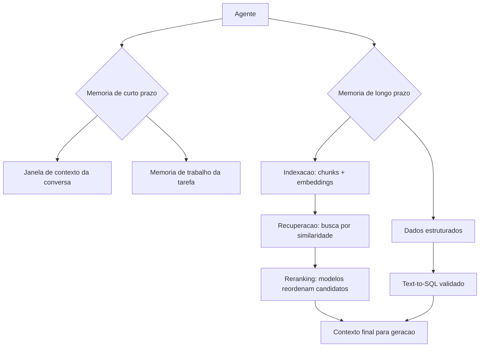

# Capítulo 7: Sistemas de Memória

## 1. Introdução

No Capítulo 6, você conectou o agente ao mundo com ferramentas bem desenhadas. Mas há um componente que decide se o agente parece competente ou esquecido: a memória. Um agente sem memória é um profissional que esquece tudo a cada reunião — e a qualidade da experiência depende diretamente do quanto o sistema lembra do usuário, da tarefa e do mundo.

Este capítulo ensina a projetar memória em três níveis. Primeiro, a memória de **curto prazo**: a janela de contexto e a memória de trabalho que sustentam a conversa e a tarefa corrente. Segundo, a memória de **longo prazo**: os bancos de conhecimento consultáveis — com destaque para a RAG (Retrieval-Augmented Generation) com dados estruturados e não estruturados. Terceiro, as **variantes** da RAG — híbrida, temporal, hierárquica — e o reranking, a técnica que melhora a qualidade da recuperação. Na Torre de Controle, este capítulo é o sistema de registros do aeroporto: o que cada aeronave sabe do próprio voo, o que a torre sabe do histórico de cada piloto e como recuperar a informação certa no momento certo.

## 2. Explica

A memória em sistemas agênticos não é um conceito — é uma arquitetura com camadas, e a literatura convergiu em uma taxonomia de referência. A pesquisa de levantamento sobre mecanismos de memória em agentes LLM distingue: **memória de curto prazo** (o contexto imediato da tarefa — na prática, a janela de contexto do modelo), **memória de longo prazo** (conhecimento persistente, consultável, externo à janela) e **memória de trabalho** (o estado operacional da tarefa em execução) [1]. A distinção crucial para o engenheiro: a janela de contexto não é memória — é um buffer de leitura. Dados que não cabem ou que se perdem no meio da janela são dados perdidos; a literatura sobre memória em agentes demonstra que a degradação de desempenho com contextos longos é real e que a recuperação seletiva supera o contexto total em muitos cenários [2].

A **RAG** (Retrieval-Augmented Generation) é o mecanismo dominante de memória de longo prazo: antes de gerar a resposta, o agente **recupera** fragmentos relevantes de uma base de conhecimento (embeddings + busca por similaridade) e injeta esses fragmentos no prompt. O padrão RAG clássico tem quatro etapas: indexação (dividir documentos em chunks e vetorizar), recuperação (buscar por similaridade semântica), reranking (reordenar pelos mais relevantes) e geração (responder com os fragmentos no contexto) [3]. A evolução para **Agentic RAG** — o foco do levantamento de Singh et al. — transforma a recuperação em decisão do agente: o agente decide quando buscar, o que buscar, quando refinar a busca e quando parar, em vez de uma busca única e passiva [4].

Quando os dados são **estruturados** — bancos relacionais, planilhas, APIs — o padrão muda: em vez de vetorizar linhas, o agente usa ferramentas (Capítulo 6) para consultar com linguagem natural traduzida em SQL, ou recupera o schema e deixa o modelo gerar a query sob validação. O padrão Text-to-SQL com validação é a abordagem prática consolidada: o agente recebe o schema, gera a consulta, o runtime valida e executa com permissões mínimas, e o resultado alimenta a resposta [5]. A escolha entre RAG vetorial e consulta estruturada não é religiosa — é funcional: dados com relacionamentos e agregações pedem SQL; texto livre pede embeddings; a maioria dos sistemas de produção combina os dois [6].

As **variantes** da RAG resolvem problemas específicos. A **híbrida** combina busca por similaridade e busca por palavra-chave (BM25) — corrige a fraqueza dos embeddings em termos raros e siglas. A **temporal** adiciona o eixo de tempo — responde a "qual era a política no mês passado?" — filtrando por janelas temporais. A **hierárquica** organiza o conhecimento em níveis (sumários → seções → parágrafos) e navega do geral ao específico — a solução para bases grandes onde chunks pequenos se perdem [7]. O **reranking** é a técnica transversal que mais melhora a qualidade percebida: recuperar 20-50 candidatos com busca barata e reordenar com um modelo de reranking sobre os candidatos (a chamada abordagem retrieve-then-rerank) eleva a precisão sem custo proibitivo [8].

### Os Erros Clássicos de RAG em Produção

A RAG é a técnica mais adotada — e a mais mal implementada. Os relatórios de produção convergem em seis erros clássicos, todos evitáveis com as técnicas do capítulo. O primeiro é o **chunking de tamanho fixo sem pensar na semântica**: cortar o documento a cada N caracteres separa a pergunta da resposta (a pergunta está no fim do chunk 3, a resposta no início do chunk 4 — e a recuperação nunca junta os dois); o padrão é dividir por unidades semânticas (parágrafos, seções) com sobreposição controlada [6]. O segundo é a **ausência de metadados**: chunks sem fonte, data, autor ou tipo tornam impossível o filtro, a citação e a atualização — e produzem a falha mais constrangedora do sistema: responder com informação desatualizada citando a fonte certa (o dado era de outra versão da política) [7]. O terceiro é a **avaliação só da recuperação**: medir precisão/recall dos chunks recuperados e ignorar a resposta final — quando a pergunta é "o usuário ficou satisfeito com a resposta?", e não "o chunk certo veio no topo?"; o sistema pode ter recuperação perfeita e respostas ruins (o modelo mal instruído sobre como usar os chunks) — a avaliação do Capítulo 8 exige o par recuperação + resposta [8].

O quarto é a **otimização da recuperação isolada da geração**: turbinar a busca (reranking, embeddings melhores) sem re-medir a resposta — a melhoria invisível; a regra prática é medir o impacto de cada mudança no resultado final, não na métrica intermediária. O quinto é a **base parada no tempo**: indexar uma vez e nunca atualizar — a base de conhecimento envelhece, e o sistema responde com confiança sobre políticas revogadas; a atualização é parte da operação (o ciclo do Capítulo 11), com a data de indexação como metadado obrigatório e o TTL como política padrão [7]. O sexto é **ignorar a pergunta que a base não responde**: quando a recuperação volta vazia, o sistema maduro não inventa — aplica a política de não-conhecimento: dizer que não sabe, oferecer a fonte alternativa ou escalar ao humano (a fronteira do Capítulo 2); os sistemas fracos alucinam exatamente onde a base falha, porque não distinguem "não encontrei" de "não existe" [9].

A leitura transversal dos seis erros é uma única lição: **RAG é um sistema, não um componente** — e sistema exige metadados, avaliação de ponta a ponta, atualização e política de não-conhecimento. A literatura de RAG agêntica descreve a evolução do padrão: da RAG estática (uma recuperação, uma resposta) para a RAG agêntica (recuperação iterativa — o agente reformula a busca, consulta múltiplas fontes, decide quando parar de recuperar e quando buscar mais) [9] [10]. É essa variante — RAG como decisão contínua, não como passo único — que conecta o capítulo ao restante da obra: a recuperação vira uma ferramenta entre outras, governada pela mesma orquestração, avaliação e observabilidade que o sistema inteiro.

### RAG, Licenciamento e a Origem do Conhecimento

A base de conhecimento da RAG é a matéria-prima do sistema — e a origem dessa matéria-prima tem consequências legais e de qualidade que a prática madura trata desde o dia um. A primeira dimensão é o **licenciamento**: o conhecimento que entra na base foi produzido por alguém — políticas internas (da empresa, sem problema), documentação de fornecedores (licenciada para uso interno, com cláusulas), artigos e livros (direitos autorais, uso restrito ou licenças abertas) — e o sistema de RAG que indexa conteúdo sem verificar a licença acumula um risco legal silencioso: a resposta do agente reproduz o conteúdo licenciado, e a reprodução tem dono [9]. A prática é o **registro de origem**: cada chunk da base carrega o metadado de fonte (Capítulo 7) ampliado com o campo de licença — interno, licenciado, aberto (Creative Commons, MIT, domínio público) — e a política de uso é decidida por licença: o conteúdo aberto pode alimentar qualquer resposta; o licenciado, com restrição de reprodução (o agente sintetiza, não copia); o interno, apenas no perímetro da organização [10].

A segunda dimensão é a **qualidade da origem**: a base herda os vieses e os erros das suas fontes — o artigo desatualizado, o manual da versão antiga, o fórum com a solução errada — e o RAG não corrige a origem: **o sistema é tão confiável quanto a sua pior fonte ativa**; a prática é a governança editorial da base — quem aprova a entrada de uma fonte, quem revisa a atualização, quem remove a fonte que a avaliação mostra que contamina respostas (o ciclo do Capítulo 11 com a lente do Capítulo 7) [11]. E a terceira dimensão é a **citação como evidência**: a resposta do agente cita a fonte — não por decoro acadêmico, mas porque a citação é o mecanismo de verificação: o usuário (ou o auditor) vai até a origem e confere; a resposta sem fonte é a resposta sem evidência, e a política do sistema é responder com fonte ou declarar o não-conhecimento (a fronteira do Capítulo 2) [9].

A síntese da origem do conhecimento é o princípio que o capítulo sustenta: **a RAG não cria conhecimento, ela o transporta** — e o transporte responsável exige licença verificada, origem governada e citação presente, porque o valor do sistema de conhecimento é proporcional à confiança na sua origem, e a confiança se constrói com registro, revisão e evidência — nunca com volume [10].

## 3. Ilustra

### O Registro do Aeroporto e a Torre de Memória

Voltemos à Torre de Controle. O aeroporto tem três sistemas de memória. O **briefing do voo** (memória de curto prazo): o plano de voo, o clima atual e as instruções da decolagem — informação que vive na cabine durante a missão e se descarta ao pousar. A **memória de trabalho** é o quadro de sequenciamento da torre: o estado operacional do momento — qual aeronave está na fila, qual pista está ocupada. A **memória de longo prazo** é o arquivo do aeroporto: o histórico de cada piloto, as cartas de aproximação, os procedimentos publicados — informação persistente que se consulta quando necessário. A RAG é o arquivista: ele não decora o arquivo inteiro; ele sabe **recuperar** o cartão certo na hora certa, por assunto, por data e por hierarquia — e o **reranking** é o arquivista experiente que, diante de dez cartões possíveis, escolhe os três que realmente importam [3].



### Por Que o Arquivista Não Decora o Arquivo

A segunda camada de analogia trata do ponto mais contraintuitivo: por que a memória de longo prazo não é "colocar tudo no contexto". Imagine um arquivista que, em vez de usar fichas, cola a documentação inteira do aeroporto na parede da cabine. O piloto tem tudo... e não acha nada: a informação relevante se perde entre milhares de páginas, e o custo de ler tudo congela a operação. A literatura confirma o fenômeno no plano empírico: o desempenho do modelo degrada com o excesso de contexto, e a recuperação seletiva supera o contexto total em muitos cenários [2]. Como Engenheiro Agêntico, você vai perceber que o design de memória é um exercício de **curadoria**: não "quanto eu consigo colocar", mas "o que o agente precisa ver, no formato certo, no momento certo" — e que a diferença entre um agente mediano e um excelente está, muitas vezes, inteiramente nessa curadoria [4].

## 4. Técnica

### Implementando RAG com Reranking

A técnica central é a implementação completa de um pipeline RAG com reranking — indexação, recuperação, reordenação e geração. A implementação usa embeddings simulados (cosseno sobre vocabulário compartilhado) para que o código seja executável sem dependências externas, mantendo a mecânica real do padrão [3].

```python
# rag_rerank.py
# -*- coding: utf-8 -*-
"""Pipeline RAG completo: indexacao, recuperacao, reranking e geracao."""

import math
from dataclasses import dataclass
from typing import Optional


@dataclass
class Documento:
    id: str
    texto: str


class RecuperadorRAG:
    """Recuperacao por similaridade de tokens com reranking por cobertura."""

    def __init__(self, documentos: list[Documento]) -> None:
        self.documentos = documentos
        self.indice: dict[str, list[Documento]] = self._indexar(documentos)

    def _indexar(self, documentos: list[Documento]) -> dict[str, list[Documento]]:
        indice: dict[str, list[Documento]] = {}
        for doc in documentos:
            for token in self._tokens(doc.texto):
                indice.setdefault(token, []).append(doc)
        return indice

    def _tokens(self, texto: str) -> set[str]:
        return set(t.lower() for t in texto.replace(".", " ").split() if len(t) > 2)

    def recuperar(self, consulta: str, top_k: int = 5) -> list[tuple[Documento, float]]:
        """Busca candidatos pela sobreposicao de tokens com a consulta."""
        tokens_consulta = self._tokens(consulta)
        pontuados: dict[str, tuple[Documento, float]] = {}
        for token in tokens_consulta:
            for doc in self.indice.get(token, []):
                overlap = len(tokens_consulta & self._tokens(doc.texto))
                pontuados[doc.id] = (doc, float(overlap))
        candidatos = sorted(pontuados.values(), key=lambda par: par[1], reverse=True)
        return candidatos[:top_k]

    def rerank(self, consulta: str, candidatos: list[tuple[Documento, float]],
               janela: int = 3) -> list[tuple[Documento, float]]:
        """Reranking por proximidade posicional: bonifica termos contiguos."""
        tokens_consulta = self._tokens(consulta)
        reordenados = []
        for doc, base in candidatos:
            palavras = doc.texto.lower().replace(".", " ").split()
            bonus = 0.0
            for i in range(len(palavras) - 1):
                janela_tokens = set(palavras[i:i + janela])
                if len(janela_tokens & tokens_consulta) >= 2:
                    bonus += 0.5
            reordenados.append((doc, base + bonus))
        return sorted(reordenados, key=lambda par: par[1], reverse=True)


def gerar_com_contexto(consulta: str, fragmentos: list[tuple[Documento, float]]) -> str:
    """Gera a resposta final usando os fragmentos recuperados como contexto."""
    contexto = "\n".join(f"- {doc.texto}" for doc, _ in fragmentos)
    return (
        f"[geracao]\nContexto usado ({len(fragmentos)} fragmentos):\n{contexto}\n"
        f"Resposta para: {consulta}"
    )


def main() -> None:
    documentos = [
        Documento("p1", "A politica de reembolso exige pedido entregue ha menos de 7 dias."),
        Documento("p2", "Produtos pereciveis nao aceitam reembolso, apenas troca."),
        Documento("p3", "O prazo de troca e de 30 dias corridos apos a entrega."),
        Documento("p4", "Reembolso parcial e permitido para itens com defeito de fabricacao."),
        Documento("p5", "Embalagem aberta reduz o valor do reembolso para 80 por cento."),
    ]
    rag = RecuperadorRAG(documentos)
    consulta = "posso reembolsar um produto com a embalagem aberta?"
    candidatos = rag.recuperar(consulta, top_k=5)
    melhores = rag.rerank(consulta, candidatos)
    print(gerar_com_contexto(consulta, melhores[:2]))


if __name__ == "__main__":
    main()
```

### RAG Temporal e Hierárquica na Prática

O segundo padrão técnico é a **RAG temporal** — o filtro por janelas de tempo que responde a "qual era a regra na data X" — e a **RAG hierárquica** — a navegação do geral ao específico para bases grandes. A implementação mostra os dois mecanismos sobre a mesma base de documentos [7].

```python
# rag_temporal_hierarquica.py
# -*- coding: utf-8 -*-
"""RAG temporal com janelas de data e navegacao hierarquica por niveis."""

from dataclasses import dataclass
from typing import Optional


@dataclass
class DocumentoData:
    id: str
    texto: str
    data: str
    nivel: int  # 0 = sumario, 1 = secao, 2 = detalhe


class RAGTemporal:
    """Recuperacao com filtro temporal e navegacao hierarquica."""

    def __init__(self, documentos: list[DocumentoData]) -> None:
        self.documentos = documentos

    def _tokens(self, texto: str) -> set[str]:
        return set(t.lower() for t in texto.replace(".", " ").split() if len(t) > 2)

    def recuperar(self, consulta: str, data_limite: Optional[str] = None,
                  nivel_maximo: int = 2, top_k: int = 3) -> list[DocumentoData]:
        """Recupera por similaridade, filtro de data e nivel hierarquico."""
        tokens_consulta = self._tokens(consulta)
        elegiveis = [
            doc for doc in self.documentos
            if doc.nivel <= nivel_maximo
            and (data_limite is None or doc.data <= data_limite)
        ]
        pontuados = sorted(
            elegiveis,
            key=lambda doc: len(tokens_consulta & self._tokens(doc.texto)),
            reverse=True,
        )
        return pontuados[:top_k]


def main() -> None:
    base = [
        DocumentoData("s1", "Politica de devolucao 2026: prazo de 7 dias apos entrega.", "2026-01-01", 0),
        DocumentoData("s2", "Politica de devolucao 2025: prazo de 15 dias apos entrega.", "2025-01-01", 0),
        DocumentoData("d1", "Itens pereciveis tem prazo de 2 dias e exigem nota fiscal.", "2026-01-15", 2),
        DocumentoData("d2", "Eletronicos exigem lacre intacto para devolucao.", "2026-02-01", 2),
    ]
    rag = RAGTemporal(base)
    print("Consulta sem filtro de data:")
    for doc in rag.recuperar("qual o prazo de devolucao", data_limite="2026-06-01"):
        print(f"  [{doc.data} n{doc.nivel}] {doc.texto}")
    print("Consulta com data limite de 2025:")
    for doc in rag.recuperar("qual o prazo de devolucao", data_limite="2025-12-31"):
        print(f"  [{doc.data} n{doc.nivel}] {doc.texto}")


if __name__ == "__main__":
    main()
```

### Memória de Curto Prazo e Gestão de Contexto

O terceiro padrão técnico é a **gestão de janela de contexto** — a memória de curto prazo como engenharia. As técnicas práticas: (1) **prioridade de conteúdo**: instruções no topo, ferramentas e dados relevantes no meio, histórico compactado no fim — a posição no prompt afeta a atenção; (2) **compactação**: resumir o histórico antigo por um LLM barato antes de descartar; (3) **sumarização progressiva**: após N turnos, gerar um resumo do turno que substitui os detalhes; (4) **recuperação no histórico**: em vez de todo o histórico, recuperar os trechos relevantes da conversa por similaridade [9]. A evidência mostra que a compactação e a recuperação seletiva preservam a qualidade com fração do custo de contexto total [2].

## 5. Aplica

### A Cena de Contraste: O Agente que Esqueceu a Política

Sua empresa lança um assistente de atendimento que responde com base na política de devolução. No início, tudo bem: a política de 2026 está no prompt estático. Em março, a política muda — prazo de 7 para 10 dias, e perecíveis passam a exigir nota fiscal. A equipe atualiza o documento na base, mas esquece o prompt estático do assistente. Resultado: o agente responde metade das vezes com a política antiga (prompt) e metade com a nova (base recuperada), de forma imprevisível. Os clientes recebem respostas contraditórias; a ouvidoria acumula reclamações [2].

O diagnóstico: o assistente mistura duas memórias sem hierarquia — a estática (prompt) e a consultável (base) — e a fonte de verdade não tem versão temporal. A correção estrutural: (1) remover a política do prompt estático; o prompt passa a dizer "responda usando apenas a base recuperada"; (2) implementar RAG temporal com a data de vigência de cada política, parametrizada pela data atual; (3) adicionar o reranking para priorizar o documento vigente; (4) instrumentar com telemetria o fragmento usado em cada resposta — para auditoria da fonte (Capítulo 11). Resultado: respostas consistentes, rastreáveis e atualizadas — a memória virou arquitetura, não adendo [4].

Armadilhas comuns: política em dois lugares (prompt e base) sem hierarquia; chunks mal dimensionados (pequenos demais perdem contexto, grandes demais diluem relevância); e ignorar o eixo temporal em domínios regulados [7].

## 6. Conclusão

Este capítulo deu memória ao seu agente. Você aprendeu (1) a taxonomia da memória — curto prazo, trabalho e longo prazo — e a distinção entre janela de contexto e memória real; (2) a RAG completa — indexação, recuperação, reranking e geração — com a evolução para Agentic RAG e o padrão Text-to-SQL para dados estruturados; e (3) as variantes híbrida, temporal e hierárquica, mais a gestão prática da janela de contexto. Desafio: para uma base real sua, desenhe o pipeline — chunking, embeddings, recuperação e reranking — e defina qual variante (híbrida, temporal, hierárquica) atende seu caso.

O próximo capítulo conduz o desenvolvimento profissional do agente: o ciclo de vida — especificação baseada em personas, prototipagem com avaliação iterativa e transição para produção com governança. Na torre, é o manual de operações do aeroporto: como um projeto vai do rascunho ao voo regular.

## 7. Referências Bibliográficas

[1] ZHANG, Zeyu; BO, Xiaohe; MA, Chen et al. *A Survey on the Memory Mechanism of Large Language Model based Agents*. Disponível em: https://arxiv.org/html/2404.13501. Acesso em: 07 ago. 2026.
[2] WEISS, T. *Memory in the Age of AI Agents*. Disponível em: https://arxiv.org/abs/2512.13564. Acesso em: 07 ago. 2026.
[3] SINGH, Aditi; EHTESHAM, Abul; KUMAR, Saket et al. *Agentic Retrieval-Augmented Generation: A Survey on Agentic RAG*. Disponível em: https://arxiv.org/abs/2501.09136. Acesso em: 07 ago. 2026.
[4] HUANG, Wenhao; ABUDULAILI, Xin; RONG, Yang et al. *A Review of Prominent Paradigms for LLM-Based Agents: Tool Use (Including RAG), Planning, and Feedback Learning*. Disponível em: https://arxiv.org/html/2406.05804. Acesso em: 07 ago. 2026.
[5] ABOU ALI, Mohamad; DORNAIKA, Fadi; CHARAFEDDINE, Jinan. *Agentic AI: A Comprehensive Survey of Architectures, Applications, and Challenges*. Disponível em: https://arxiv.org/abs/2510.25445. Acesso em: 07 ago. 2026.
[6] ARUNKUMAR, V.; GANGADHARAN, G. R.; BUYYA, Rajkumar. *Agentic Artificial Intelligence (AI): Architectures, Taxonomies, and Evaluation of Large Language Model Agents*. Disponível em: https://arxiv.org/abs/2601.12560. Acesso em: 07 ago. 2026.
[7] DU, Pengfei. *Memory for Autonomous LLM Agents: Mechanisms, Evaluation, and Emerging Frontiers*. Disponível em: https://arxiv.org/html/2603.07670. Acesso em: 07 ago. 2026.
[8] ZHU, Yuxuan; JIN, Tengjun; PRUKSACHATKUN, Yada et al. *Establishing Best Practices for Building Rigorous Agentic Benchmarks*. Disponível em: https://arxiv.org/html/2507.02825. Acesso em: 07 ago. 2026.
[9] CHENG, Yuheng; ZHANG, Ceyao; ZHANG, Zhengwen et al. *Exploring Large Language Model based Intelligent Agents: Definitions, Methods, and Prospects*. Disponível em: https://arxiv.org/html/2401.03428. Acesso em: 07 ago. 2026.
[10] WANG, Lei; MA, Chen; FENG, Xueyang et al. *A Survey on Large Language Model based Autonomous Agents*. Disponível em: https://arxiv.org/abs/2308.11432. Acesso em: 07 ago. 2026.
[11] ZHAO, Pengyu; JIN, Zijian; CHENG, Ning. *An In-depth Survey of Large Language Model-based Artificial Intelligence Agents*. Disponível em: https://arxiv.org/html/2309.14365. Acesso em: 07 ago. 2026.
[12] LUO, Junyu; ZHANG, Weizhi; YUAN, Ye et al. *Large Language Model Agent: A Survey on Methodology, Applications and Challenges*. Disponível em: https://arxiv.org/abs/2503.21460. Acesso em: 07 ago. 2026.
[13] DEROUICHE, Hana; BRAHMI, Zaki; MAZENI, Haithem. *Agentic AI Frameworks: Architectures, Protocols, and Design Challenges*. Disponível em: https://arxiv.org/html/2508.10146. Acesso em: 07 ago. 2026.
[14] LANGCHAIN. *Workflows and agents — Docs*. Disponível em: https://docs.langchain.com/oss/python/langgraph/workflows-agents. Acesso em: 07 ago. 2026.
[15] MODEL CONTEXT PROTOCOL. *Specification 2026-07-28*. Disponível em: https://modelcontextprotocol.io/specification/2026-07-28. Acesso em: 07 ago. 2026.
[16] OPENAI. *Evals (PaperBench, SWE-Lancer, MLE-bench, SWE-bench Verified)*. Disponível em: https://evals.openai.com/. Acesso em: 07 ago. 2026.
[17] DELOITTE. *Agentic AI in enterprise: Adoption, risk, and transformation*. Disponível em: https://www.deloitte.com/content/dam/assets-zone3/us/en/docs/services/consulting/2025/agentic-ai-enterprise-adoption-guide.pdf. Acesso em: 07 ago. 2026.
[18] GARTNER. *Gartner Predicts Over 40% of Agentic AI Projects Will Be Canceled by End of 2027*. Disponível em: https://www.gartner.com/en/newsroom/press-releases/2025-06-25-gartner-predicts-over-40-percent-of-agentic-ai-projects-will-be-canceled-by-end-of-2027. Acesso em: 07 ago. 2026.
[19] LANGCHAIN. *Trace with OpenTelemetry — LangSmith Docs*. Disponível em: https://docs.langchain.com/langsmith/trace-with-opentelemetry. Acesso em: 07 ago. 2026.
[20] OWASP GEN AI SECURITY PROJECT. *OWASP Top 10 for Agentic Applications for 2026*. Disponível em: https://genai.owasp.org/resource/owasp-top-10-for-agentic-applications-for-2026/. Acesso em: 07 ago. 2026.
