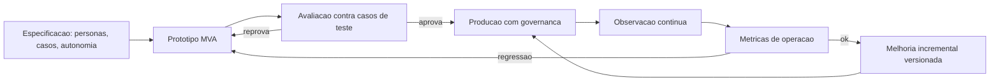

# Capítulo 8: Ciclo de Vida de Desenvolvimento

## 1. Introdução

No Capítulo 7, você deu memória ao agente — a base de conhecimento que sustenta respostas competentes. Mas competência técnica não basta: a maioria dos projetos de IA agêntica não morre por falta de capacidade, morre por falta de processo. O Gartner prevê que mais de 40% dos projetos de IA agêntica serão cancelados até o fim de 2027 — e as causas apontadas são as mesmas de sempre: escopo mal definido, avaliação ausente e governança frágil [1].

Este capítulo apresenta o ciclo de vida profissional do desenvolvimento de agentes: a **especificação** baseada em personas e casos de uso; a **prototipagem** iterativa com avaliação contínua — do MVP ao MVA (Mínimo Produto Avaliável); e a **transição para produção** com documentação sustentável e governança. Na Torre de Controle, este capítulo é o manual de operações: como uma nova rota sai do rascunho, passa por simulação e certificação, e entra na malha regular com procedimentos documentados.

## 2. Explica

O desenvolvimento de agentes falha com um padrão previsível quando tratado como "prompt engineering": o time escreve um prompt, testa manualmente alguns casos, ajusta, e considera pronto. A literatura de engenharia de agentes converge para um processo com três fases que espelham a engenharia de software madura — só que com um componente novo e traiçoeiro: o comportamento não-determinístico do modelo [2].

A **especificação** é a primeira fase e a mais negligenciada. A boa prática consolidada é a especificação baseada em **personas e casos de uso**: em vez de "um agente de suporte", defina (1) as personas que interagem com o sistema — o cliente final, o operador humano, o auditor; (2) os casos de uso com entrada, comportamento esperado e saída verificável; (3) as fronteiras de autonomia — o que o agente pode decidir sozinho e o que exige aprovação humana; e (4) os critérios de sucesso mensuráveis [3]. A especificação cumpre o papel do contrato: é o documento contra o qual a avaliação será executada — sem critérios explícitos, a avaliação é arbitrária e o projeto, ingovernável [4].

A **prototipagem com avaliação iterativa** é a segunda fase — o coração do ciclo. O padrão moderno é o MVA (Mínimo Produto Avaliável): uma versão enxuta do agente, deliberadamente incompleta em amplitude, mas completa o suficiente para ser avaliada contra um conjunto de testes definido na especificação. O ciclo é: prototipar → avaliar → corrigir → reavaliar — com métricas objetivas (taxa de sucesso em casos de teste, taxa de chamadas de ferramenta corretas, latência, custo por tarefa). A avaliação iterativa é o que impede o acúmulo de **débito técnico de qualidade**: a prática de lançar correções ad hoc sem medir o efeito colateral em outros casos, que transforma o prompt em uma espaguete incontrolável [5]. A literatura de benchmarks de agentes é explícita: sem um conjunto de avaliação rigoroso e versionado, a qualidade do agente é uma crença, não um fato [6].

A **transição para produção** é a terceira fase — onde a maioria dos projetos derrapa. Os pilares consolidados: (1) **documentação sustentável** — não o prompt, mas o "porquê" de cada decisão de design (por que este modelo, por que esta política de autonomia, por que esta ferramenta) — documentação que sobrevive à rotatividade da equipe; (2) **governança** — quem aprova o quê: o fluxo de aprovação de mudanças no prompt, no modelo, na base de conhecimento e nas ferramentas; (3) **rollback** — cada versão do agente é versionada e implantável de volta em minutos; e (4) **supervisão humana** — o mecanismo de escalação para quando o agente excede o escopo ou o usuário discorda da resposta [7]. A transição não termina na implantação: entra no ciclo contínuo de observação → avaliação → melhoria que o Capítulo 11 detalha.

O fio que amarra as três fases é a **avaliação como infraestrutura** — não como atividade pontual. O conjunto de testes, as métricas e os pipelines de avaliação são tratados como código: versionados, executados em CI e atualizados conforme o sistema evolui. É essa infraestrutura que transforma o desenvolvimento de agentes de arte em engenharia [8].

### Da Métrica Técnica à Decisão de Negócio

A avaliação técnica só tem valor quando traduzida em decisão — e a ponte entre as duas é o trabalho que falta na maioria dos projetos. O problema é estrutural: as métricas técnicas (precisão, recall, score do LLM-as-judge) falam a língua da engenharia, e as decisões de negócio (continuar, escalar, cortar) são tomadas na língua do valor (custo por transação, tempo de atendimento, taxa de resolução). O padrão que a prática consolidou é o **contrato de tradução**: cada métrica técnica recebe um equivalente de negócio — a precisão da resposta vira a taxa de retrabalho do atendente (resposta errada custa uma interação a mais); a cobertura do conhecimento vira o percentual de chamados sem resposta na base (a fração que cai no atendimento humano); a latência vira o tempo de atendimento percebido; e a taxa de escalação vira o custo unitário de suporte [7]. Sem o contrato de tradução, dois fenômenos típicos ocorrem: a engenharia celebra uma métrica que o negócio não reconhece (a métrica técnica subiu, o custo não caiu — e o projeto perde o patrocínio), ou o negócio decide por intuição (a métrica técnica caiu, mas ninguém sabe o que isso custou ou economizou) [8].

A segunda prática é o **threshold com consequência**: cada métrica de negócio recebe um limite explícito com uma ação pré-definida — abaixo de X de taxa de resolução, o agente passa a escalar casos limítrofes (o modo conservador do Capítulo 2); acima de Y de custo por tarefa, o roteamento muda para o modelo barato (o Capítulo 9); abaixo de Z de cobertura, a base de conhecimento entra em revisão (o Capítulo 7). O threshold com consequência transforma a avaliação de relatório em **mecanismo de operação**: o sistema se auto-regula dentro dos limites que o negócio definiu — exatamente o princípio da autonomia limitada que percorre a obra. O detalhe que separa as equipes maduras: os thresholds são revisados com a mesma cadência que os conjuntos de avaliação — uma métrica que nunca dispara é uma política morta, e uma que dispara toda hora é uma política errada [1].

A terceira prática é o **roadmap dirigido por avaliação**: a fila de melhorias do sistema é ordenada pela métrica que mais afeta a decisão de negócio — se a taxa de resolução estagna por causa da cobertura, a prioridade é a base de conhecimento, não o prompt; se a latência derruba a adoção, a prioridade é o roteamento, não o modelo. A literatura de benchmarks rigorosos é enfática sobre o risco inverso: otimizar métricas sem a lente do negócio produz "metric theater" — o sistema melhora nos testes e piora na operação, porque os testes foram desenhados para o que é fácil medir, e não para o que decide o valor [1]. A síntese: a avaliação madura não termina no dashboard — termina na **decisão tomada com evidência**: cada melhoria entra no sistema porque uma métrica de negócio mostrou que devia, e cada métrica de negócio entrou porque uma decisão dependia dela [8].

## 3. Ilustra

### A Certificação de uma Nova Rota Aérea

Voltemos à Torre de Controle. Nenhuma rota aérea nova entra em operação sem processo. A sequência da aviação espelha exatamente o ciclo de vida do agente. A **especificação** é o estudo da rota: quem voará (personas), quais trechos (casos de uso), quais mínimos meteorológicos (fronteiras de autonomia) e quais critérios de aprovação (métricas de sucesso). A **prototipagem avaliada** é o voo de certificação: a aeronave voa a rota centenas de vezes com instrumentação, mede cada parâmetro e só recebe o certificado quando os critérios passam. A **transição para produção** é a entrada na malha regular: a rota entra no manual, ganha procedimentos documentados e é revisada a cada evento significativo. E a avaliação contínua é o programa de manutenção: cada aeronave é revisitada, medida e corrigida antes que o desvio vire acidente [2].



### Por Que o Voô de Certificação Precisa de Instrumentação

A segunda camada de analogia trata do ponto mais difícil: por que a avaliação manual não substitui a avaliação estruturada. Imagine o piloto de certificação que voa a rota uma vez, acha tudo "tranquilo" e assina o certificado. Ninguém saberia o que foi medido, nem como reproduzir o teste, nem o que aconteceria em clima adverso. A aviação não aceita isso: a certificação exige procedimentos, instrumentação e registros — porque a segurança não é uma opinião, é um dado. Com agentes é idêntico: o teste manual de dez casos não é avaliação — é anedota. Como Engenheiro Agêntico, você vai perceber que o MVA não é um produto incompleto: é um produto **instrumentado** — o instrumento que mede se o design está certo antes do custo de produção completa [8]. O Gartner aponta a ausência dessa infraestrutura como uma das causas centrais do cancelamento de projetos de agentes [1].

## 4. Técnica

### Especificação Baseada em Personas e Casos de Uso

A primeira técnica é a **especificação executável**: transformar personas e casos de uso em um artefato versionável que o resto do ciclo consome — os casos viram testes, as fronteiras viram políticas e os critérios viram métricas. A implementação abaixo modela a especificação como dados estruturados com validação [3].

```python
# especificacao_agente.py
# -*- coding: utf-8 -*-
"""Especificacao baseada em personas e casos de uso com validacao."""

from dataclasses import dataclass, field
from typing import Callable, Optional


@dataclass
class Persona:
    nome: str
    papel: str
    necessidade: str


@dataclass
class CasoDeUso:
    id: str
    descricao: str
    entrada: str
    saida_esperada: str
    fronteira_autonomia: str = "responder"
    critério_sucesso: str = "saida igual a esperada"


@dataclass
class Especificacao:
    nome_do_sistema: str
    personas: list[Persona] = field(default_factory=list)
    casos_de_uso: list[CasoDeUso] = field(default_factory=list)

    def validar(self) -> list[str]:
        """Valida a completude da especificacao antes de prototipar."""
        erros: list[str] = []
        if not self.nome_do_sistema.strip():
            erros.append("nome_do_sistema vazio")
        if not self.personas:
            erros.append("nenhuma persona definida")
        if not self.casos_de_uso:
            erros.append("nenhum caso de uso definido")
        ids = [caso.id for caso in self.casos_de_uso]
        if len(ids) != len(set(ids)):
            erros.append("ids de casos de uso duplicados")
        return erros


def montar_especificacao_suporte() -> Especificacao:
    """Exemplo: especificacao de um agente de suporte a assinaturas."""
    return Especificacao(
        nome_do_sistema="agente-suporte-assinaturas",
        personas=[
            Persona("Cliente Final", "consumidor", "resolver problemas da assinatura sem espera"),
            Persona("Operador Humano", "time de suporte", "auditar e escalar casos complexos"),
            Persona("Auditor", "conformidade", "reconstruir qualquer decisao do agente"),
        ],
        casos_de_uso=[
            CasoDeUso("C01", "Cancelamento dentro da politica",
                      "quero cancelar minha assinatura",
                      "confirma cancelamento com aviso de periodo restante",
                      fronteira_autonomia="cancelar_automaticamente"),
            CasoDeUso("C02", "Reembolso acima do limite",
                      "quero reembolso integral de um ano",
                      "escala para aprovacao humana",
                      fronteira_autonomia="escalar_para_humano"),
            CasoDeUso("C03", "Pergunta fora do escopo",
                      "quanto custa o plano familiar",
                      "responde com catalogo de planos",
                      fronteira_autonomia="responder"),
        ],
    )


def main() -> None:
    espec = montar_especificacao_suporte()
    erros = espec.validar()
    if erros:
        print("Especificacao INVALIDA:", erros)
    else:
        print(f"Especificacao valida: {espec.nome_do_sistema}")
        print(f"  {len(espec.personas)} personas, {len(espec.casos_de_uso)} casos de uso")


if __name__ == "__main__":
    main()
```

### Loop de Avaliação Iterativa (MVA)

A segunda técnica é o **loop de avaliação iterativa** — o ciclo prototipar → avaliar → corrigir com métricas objetivas, implementado como um harness executável. O harness roda os casos de uso da especificação, compara com a saída esperada, computa a taxa de sucesso e decide se o protótipo avança [5].

```python
# loop_avaliacao.py
# -*- coding: utf-8 -*-
"""Loop de avaliacao iterativa do prototipo contra os casos de uso."""

from dataclasses import dataclass, field
from typing import Callable, Optional


@dataclass
class ResultadoCaso:
    caso_id: str
    esperado: str
    obtido: str
    passou: bool


@dataclass
class RelatorioAvaliacao:
    resultados: list[ResultadoCaso] = field(default_factory=list)

    def taxa_sucesso(self) -> float:
        if not self.resultados:
            return 0.0
        aprovados = sum(1 for r in self.resultados if r.passou)
        return aprovados / len(self.resultados)

    def resumo(self) -> str:
        return f"taxa de sucesso: {self.taxa_sucesso():.0%} ({len(self.resultados)} casos)"


def avaliar_prototipo(
    prototipo: Callable[[str], str],
    casos: list[tuple[str, str, str]],
) -> RelatorioAvaliacao:
    """Executa o prototipo contra os casos e gera o relatorio."""
    relatorio = RelatorioAvaliacao()
    for caso_id, entrada, esperado in casos:
        obtido = prototipo(entrada)
        relatorio.resultados.append(
            ResultadoCaso(caso_id, esperado, obtido, passou=(obtido == esperado))
        )
    return relatorio


def prototipo_v1(entrada: str) -> str:
    """Protótipo versao 1: apenas cancela assinaturas."""
    if "cancelar" in entrada.lower():
        return "assinatura cancelada"
    return "nao entendi"


def prototipo_v2(entrada: str) -> str:
    """Protótipo versao 2: cobre cancelamento e reembolso."""
    if "cancelar" in entrada.lower():
        return "assinatura cancelada"
    if "reembolso" in entrada.lower():
        return "caso escalado para aprovacao humana"
    return "nao entendi"


def main() -> None:
    casos = [
        ("C01", "quero cancelar minha assinatura", "assinatura cancelada"),
        ("C02", "quero reembolso integral de um ano", "caso escalado para aprovacao humana"),
        ("C03", "quanto custa o plano familiar", "resposta do catalogo"),
    ]
    r1 = avaliar_prototipo(prototipo_v1, casos)
    print("v1:", r1.resumo())
    r2 = avaliar_prototipo(prototipo_v2, casos)
    print("v2:", r2.resumo())
    aprovados = [r for r in r2.resultados if r.passou]
    reprovados = [r for r in r2.resultados if not r.passou]
    print(f"aprova: {len(aprovados)} | reprova: {len(reprovados)}")


if __name__ == "__main__":
    main()
```

### Transição para Produção com Governança

A terceira técnica é o **kit de transição para produção**: os artefatos mínimos que um agente precisa para sair do MVA e operar com governança — versionamento, aprovação e rollback. A implementação modela o ciclo de aprovação de mudanças e o plano de rollback como dados executáveis [7].

```python
# governanca_producao.py
# -*- coding: utf-8 -*-
"""Governanca de transicao: versionamento, aprovacao e rollback."""

from dataclasses import dataclass, field
from typing import Optional


@dataclass
class VersaoAgente:
    numero: str
    modelo: str
    prompt_hash: str
    base_conhecimento: str
    aprovada: bool = False
    em_producao: bool = False


class RegistroVersoes:
    """Controla o ciclo de aprovacao e promocao de versoes."""

    def __init__(self) -> None:
        self.versoes: list[VersaoAgente] = []
        self.em_producao: Optional[VersaoAgente] = None

    def registrar(self, versao: VersaoAgente) -> None:
        self.versoes.append(versao)

    def aprovar(self, numero: str, aprovador: str) -> bool:
        """Aprova uma versao para promocao (governanca de mudanca)."""
        versao = self._buscar(numero)
        if versao is None:
            return False
        versao.aprovada = True
        versao.em_producao = True
        if self.em_producao is not None:
            self.em_producao.em_producao = False
        self.em_producao = versao
        return True

    def rollback(self) -> Optional[VersaoAgente]:
        """Retorna para a versao aprovada anterior (plano de contingencia)."""
        aprovadas = [v for v in self.versoes if v.aprovada and not v.em_producao]
        if not aprovadas:
            return None
        if self.em_producao is not None:
            self.em_producao.em_producao = False
        nova = sorted(aprovadas, key=lambda v: v.numero)[-1]
        nova.em_producao = True
        self.em_producao = nova
        return nova

    def _buscar(self, numero: str) -> Optional[VersaoAgente]:
        for versao in self.versoes:
            if versao.numero == numero:
                return versao
        return None


def main() -> None:
    registro = RegistroVersoes()
    registro.registrar(VersaoAgente("1.0", "modelo-padrao", "hash-prompt-1", "base-2026-01"))
    registro.registrar(VersaoAgente("1.1", "modelo-padrao", "hash-prompt-2", "base-2026-03"))
    registro.aprovar("1.0", "comite-agentes")
    registro.aprovar("1.1", "comite-agentes")
    print("em producao:", registro.em_producao.numero)
    volta = registro.rollback()
    print("rollback para:", volta.numero if volta else "nenhum")


if __name__ == "__main__":
    main()
```

### Checklist de Prontidão para Produção

O checklist final condensa o capítulo: (1) a especificação define personas, casos de uso, fronteiras de autonomia e critérios mensuráveis? (2) o conjunto de avaliação é versionado e roda em CI? (3) a taxa de sucesso atual está registrada e acima do limiar definido? (4) cada mudança (prompt, modelo, base, ferramentas) passa por aprovação? (5) o rollback restaura a versão anterior em minutos? (6) a documentação registra o porquê das decisões de design? (7) o mecanismo de escalação para supervisão humana está testado? (8) as métricas de operação (latência, custo, taxa de resolução) estão definidas para a fase pós-implantação [7] [8]? O Gartner correlaciona a ausência desses itens diretamente com o cancelamento de projetos [1].

## 5. Aplica

### A Cena de Contraste: O Protótipo Perfeito que Não Sobreviveu

Sua equipe constrói um agente de triagem financeira em duas semanas. O demo é impressionante: responde correto em todos os casos do gestor. O gestor aprova a entrada em produção "imediata". Na primeira semana, o caos: (1) um caso de reembolso acima do limite é executado automaticamente — a fronteira de autonomia nunca foi definida; (2) uma mudança de prompt para corrigir um erro quebra outros dez casos — sem conjunto de avaliação, ninguém percebeu; (3) um analista dobra o limite de reembolso alterando o prompt diretamente em produção — sem governança de mudança; (4) a documentação não existe — quando o autor sai de férias, ninguém sabe por que as decisões foram tomadas [1].

O diagnóstico: o projeto pulou a especificação e a avaliação, e entrou em produção sem governança. O demo é uma anedota, não evidência — exatamente o padrão que o Gartner aponta como causa de cancelamento [1]. A correção estrutural, mesmo com o sistema já rodando: (1) retroespecificar — documentar personas, casos e fronteiras de autonomia a partir do que o sistema já faz; (2) construir o conjunto de avaliação com os 40 casos mais importantes do domínio e medir a taxa de sucesso real; (3) instituir governança: mudanças passam por aprovação, com versionamento e rollback; (4) implementar a escalação automática para os casos acima do limite. Em um mês, o sistema opera com métricas conhecidas e risco controlado — virou engenharia [5].

Armadilhas comuns: confundir demo com avaliação; permitir mudanças diretas em produção; e tratar a documentação como custo, quando ela é o seguro contra a rotatividade [7].

## 6. Conclusão

Este capítulo deu ao seu projeto o processo que falta à maioria dos concorrentes. Você aprendeu (1) a especificação baseada em personas, casos de uso, fronteiras de autonomia e critérios mensuráveis; (2) a prototipagem com avaliação iterativa — do MVP ao MVA — com métricas objetivas e versionadas; e (3) a transição para produção com documentação sustentável, governança de mudanças e rollback. Desafio: para um agente seu (ou de um fornecedor), responda o checklist de prontidão — e implemente o item mais crítico que estiver faltando.

A Parte III começa: qualidade e operação — o radar ligado. O próximo capítulo trata da otimização de desempenho: modelo, sistema e infraestrutura. Na torre, é o momento de calibrar motores, rotas e capacidade da malha.

## 7. Referências Bibliográficas

[1] GARTNER. *Gartner Predicts Over 40% of Agentic AI Projects Will Be Canceled by End of 2027*. Disponível em: https://www.gartner.com/en/newsroom/press-releases/2025-06-25-gartner-predicts-over-40-percent-of-agentic-ai-projects-will-be-canceled-by-end-of-2027. Acesso em: 07 ago. 2026.
[2] ARUNKUMAR, V.; GANGADHARAN, G. R.; BUYYA, Rajkumar. *Agentic Artificial Intelligence (AI): Architectures, Taxonomies, and Evaluation of Large Language Model Agents*. Disponível em: https://arxiv.org/abs/2601.12560. Acesso em: 07 ago. 2026.
[3] ABOU ALI, Mohamad; DORNAIKA, Fadi; CHARAFEDDINE, Jinan. *Agentic AI: A Comprehensive Survey of Architectures, Applications, and Challenges*. Disponível em: https://arxiv.org/abs/2510.25445. Acesso em: 07 ago. 2026.
[4] ZHU, Yuxuan; JIN, Tengjun; PRUKSACHATKUN, Yada et al. *Establishing Best Practices for Building Rigorous Agentic Benchmarks*. Disponível em: https://arxiv.org/html/2507.02825. Acesso em: 07 ago. 2026.
[5] CHENG, Yuheng; ZHANG, Ceyao; ZHANG, Zhengwen et al. *Exploring Large Language Model based Intelligent Agents: Definitions, Methods, and Prospects*. Disponível em: https://arxiv.org/html/2401.03428. Acesso em: 07 ago. 2026.
[6] LIU, Xiao; YU, Hao; ZHANG, Hanchen et al. *AgentBench: Evaluating LLMs as Agents*. Disponível em: https://arxiv.org/abs/2308.03688. Acesso em: 07 ago. 2026.
[7] DELOITTE. *Agentic AI in enterprise: Adoption, risk, and transformation*. Disponível em: https://www.deloitte.com/content/dam/assets-zone3/us/en/docs/services/consulting/2025/agentic-ai-enterprise-adoption-guide.pdf. Acesso em: 07 ago. 2026.
[8] LANGCHAIN. *Trace with OpenTelemetry — LangSmith Docs*. Disponível em: https://docs.langchain.com/langsmith/trace-with-opentelemetry. Acesso em: 07 ago. 2026.
[9] WANG, Lei; MA, Chen; FENG, Xueyang et al. *A Survey on Large Language Model based Autonomous Agents*. Disponível em: https://arxiv.org/abs/2308.11432. Acesso em: 07 ago. 2026.
[10] ZHAO, Pengyu; JIN, Zijian; CHENG, Ning. *An In-depth Survey of Large Language Model-based Artificial Intelligence Agents*. Disponível em: https://arxiv.org/html/2309.14365. Acesso em: 07 ago. 2026.
[11] LUO, Junyu; ZHANG, Weizhi; YUAN, Ye et al. *Large Language Model Agent: A Survey on Methodology, Applications and Challenges*. Disponível em: https://arxiv.org/abs/2503.21460. Acesso em: 07 ago. 2026.
[12] HUANG, Wenhao; ABUDULAILI, Xin; RONG, Yang et al. *A Review of Prominent Paradigms for LLM-Based Agents: Tool Use (Including RAG), Planning, and Feedback Learning*. Disponível em: https://arxiv.org/html/2406.05804. Acesso em: 07 ago. 2026.
[13] SINGH, Aditi; EHTESHAM, Abul; KUMAR, Saket et al. *Agentic Retrieval-Augmented Generation: A Survey on Agentic RAG*. Disponível em: https://arxiv.org/abs/2501.09136. Acesso em: 07 ago. 2026.
[14] DEROUICHE, Hana; BRAHMI, Zaki; MAZENI, Haithem. *Agentic AI Frameworks: Architectures, Protocols, and Design Challenges*. Disponível em: https://arxiv.org/html/2508.10146. Acesso em: 07 ago. 2026.
[15] LANGCHAIN. *Workflows and agents — Docs*. Disponível em: https://docs.langchain.com/oss/python/langgraph/workflows-agents. Acesso em: 07 ago. 2026.
[16] LANGCHAIN. *Graph API overview — Docs*. Disponível em: https://docs.langchain.com/oss/python/langgraph/graph-api. Acesso em: 07 ago. 2026.
[17] OPENAI. *Evals (PaperBench, SWE-Lancer, MLE-bench, SWE-bench Verified)*. Disponível em: https://evals.openai.com/. Acesso em: 07 ago. 2026.
[18] OWASP GEN AI SECURITY PROJECT. *OWASP Top 10 for Agentic Applications for 2026*. Disponível em: https://genai.owasp.org/resource/owasp-top-10-for-agentic-applications-for-2026/. Acesso em: 07 ago. 2026.
[19] GARTNER. *2026 Hype Cycle for Agentic AI*. Disponível em: https://www.gartner.com/en/articles/hype-cycle-for-agentic-ai. Acesso em: 07 ago. 2026.
[20] ANYSCALE. *AI agents on Ray Serve: Single to multi-agent architecture*. Disponível em: https://www.anyscale.com/blog/ai-agents-on-ray-serve-single-to-multi-agent-architecture. Acesso em: 07 ago. 2026.
