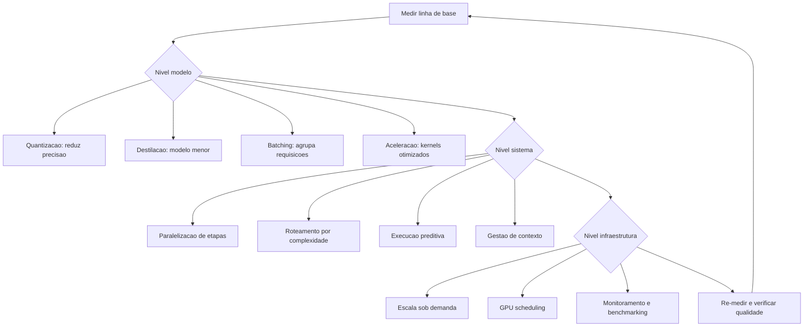

# Capítulo 9: Otimização de Desempenho

## 1. Introdução

No Capítulo 8, você aprendeu o ciclo de vida profissional — especificação, avaliação e transição para produção. Agora entramos na Parte III: qualidade e operação — o radar ligado. Este capítulo trata da otimização de desempenho em três níveis: o **modelo** (quantização, destilação, batching, aceleração), o **sistema** (paralelização, latência, execução preditiva) e a **infraestrutura** (implantação escalável, monitoramento e benchmarking).

A premissa do capítulo é pragmática: otimização não é fazer o sistema mais rápido por vaidade — é reduzir custo e latência **sem perder qualidade**, com evidência de cada ganho. Na Torre de Controle, é a disciplina do motorista de frota: calibrar cada aeronave para consumir menos combustível, decolar mais rápido e manter a segurança — medindo tudo. Você vai sair deste capítulo com um método de otimização hierárquico: do mais barato ao mais caro, sempre medindo.

## 2. Explica

A otimização de agentes segue uma hierarquia de custo-benefício que inverte a intuição inicial. O erro clássico é começar pela infraestrutura — GPUs, nós, servidores — quando as maiores oportunidades estão no **modelo** e no **sistema**. A literatura de implantação de LLMs converge para três níveis com alavancas distintas [1].

No nível de **modelo**, as técnicas atacam o custo por token e a latência por chamada. A **quantização** reduz a precisão numérica dos pesos (FP32 → FP16 → INT8 → INT4), encolhendo a memória e acelerando a inferência com perda mínima de qualidade em modelos grandes — a técnica padrão de implantação de modelos em produção [2]. A **destilação** treina um modelo menor para imitar o comportamento de um maior — reduz o custo por token em uma ordem de grandeza em troca de um trabalho de treinamento pontual. O **batching** agrupa múltiplas requisições em uma única passada pelo modelo — o ganho mais imediato e subutilizado: um servidor em batch contínuo atende muito mais requisições por segundo com o mesmo custo de hardware. E a **aceleração** — kernels otimizados, atenção flash, cache KV — melhora a eficiência bruta da inferência sem tocar no modelo [3].

No nível de **sistema**, as alavancas atacam a arquitetura do agente. A **paralelização** executa etapas independentes simultaneamente — o orquestrador-trabalhadores do Capítulo 5 com subtarefas paralelas corta o tempo de tarefa pela metade quando o gargalo é sequencial. A **latência** é reduzida por roteamento (Capítulo 4): tarefas simples não passam por modelos caros. A **execução preditiva** — o padrão de prever e pré-computar a próxima etapa enquanto o usuário ainda digita ou o agente ainda pensa — esconde latência percebida em vez de reduzi-la [4]. E a **gestão de contexto** (Capítulo 7) corta tokens de entrada — o maior componente do custo em agentes conversacionais: cada turno carrega o histórico, e a compactação muda a economia da tarefa inteira [5].

No nível de **infraestrutura**, as alavancas atacam a escala. A implantação **escalável** — Kubernetes, Ray Serve, serverless — permite adicionar capacidade sob demanda, com autoscaling por métricas de uso reais [6]. A **GPU scheduling** otimiza a alocação de aceleradores entre modelos de diferentes tamanhos — o componente mais caro da infraestrutura agêntica [7]. O **monitoramento** de desempenho — latência, taxa de tokens, custo por requisição — alimenta o ciclo contínuo: sem medição, nenhuma otimização é verificável. E o **benchmarking** — a medição sistemática de desempenho antes e depois de cada mudança — é o que separa otimização real de ajuste aleatório: a regra de ouro é nunca otimizar sem uma linha de base e um teste de regressão [8].

A disciplina que amarra os três níveis: **otimizar o que a medição aponta, não o que o instinto sugere**. O fluxo é: medir a linha de base → identificar o gargalo → aplicar a alavanca mais barata → re-medir → verificar qualidade → repetir. O Gartner inclui a gestão de custo entre as causas de cancelamento de projetos de agentes: sistemas que funcionam mas custam demais morrem na revisão do orçamento [9].

### O Triângulo Custo, Qualidade e Latência

Otimização de agentes é a arte de equilibrar três dimensões que puxam em direções opostas: **custo** (tokens, chamadas, infraestrutura), **qualidade** (correção medida pela avaliação do Capítulo 8) e **latência** (tempo percebido pelo usuário). A piorar o quadro, melhorar um lado geralmente degrada os outros: o modelo maior melhora a qualidade e piora custo e latência; o roteamento para o modelo menor melhora custo e latência e pode piorar a qualidade; o retry com mais contexto melhora a qualidade dos casos difíceis e triplica o custo dos casos fáceis [6]. O erro de projeto mais caro é tratar o triângulo como um problema de uma dimensão — otimizar só o custo (sistema barato e ruim), só a latência (sistema rápido e caro) ou só a qualidade (sistema bom e inviável). A prática madura trata o triângulo como um **espaço de política**: para cada tipo de tarefa, uma tripla alvo — a extração de dados aceita o modelo barato com retry; a resposta ao cliente exige o modelo caro com latência controlada; a triagem roda no modelo pequeno com fallback ao grande [7].

A primeira ferramenta desse equilíbrio é o **roteamento por dificuldade**: classificar a tarefa antes de escolher o modelo — a triagem barata decide se a tarefa vai ao modelo pequeno (rotina), ao modelo grande (difícil) ou direto ao humano (fora de escopo); a literatura documenta reduções de custo de 50% a 80% com degradação de qualidade abaixo de 5 pontos quando o roteador é bem treinado [8]. A segunda é o **caching de respostas**: respostas idênticas a perguntas idênticas (ou semanticamente próximas) são servidas de cache — o maior redutor de custo disponível em sistemas de perguntas frequentes, com ganho adicional de latência (milissegundos contra segundos) e o cuidado de invalidar o cache quando a base muda (Capítulo 7). A terceira é o **controle de retries com política**: retry é a ferramenta de qualidade mais barata — re-tentar com contexto ampliado recupera erros de parsing e de ferramenta — desde que limitado: sem política, o retry vira o multiplicador de custo silencioso; a regra prática é retry máximo por tarefa com escada (contexto maior, modelo melhor) e trilha do motivo em cada retry [9].

A quarta ferramenta é o **orçamento por transação**: cada tarefa tem um teto de custo e de latência definido pelo valor da tarefa — a conciliação de uma nota de R$ 10 não pode custar R$ 5 de tokens; a análise de um contrato de R$ 100 mil pode pagar o modelo de raciocínio. O orçamento vira o critério do roteador: a tarefa sobe de modelo se o teto permitir, e o sistema registra quando o teto foi o fator de decisão — a telemetria que o Capítulo 11 consolida. A síntese do triângulo é o princípio que fecha o capítulo: **otimização não é escolher a melhor dimensão, é definir a política certa para cada tarefa** — e toda política é uma decisão documentada, medida e revisada, não um palpite heroico [10].

### A Telemetria do Custo como Produto

Custo não é uma consequência da operação — é um **produto da engenharia**, e como todo produto, precisa de medição, dashboard e dono. A prática madura trata a telemetria de custo com o mesmo rigor da telemetria de desempenho do Capítulo 11, com três camadas [7]. A primeira é a **medição por dimensão**: o custo é faturado por modelo (quanto cada modelo consome), por rota (quanto o roteador manda para cada destino), por tarefa (quanto custa o tipo de tarefa — a conciliação, a triagem, a resposta ao cliente), por cliente ou unidade de negócio (o chargeback: quem usa paga, e quem paga cobra eficiência), e por causa (quanto custam os retries, as re-deliberações, as recuperações de erro — o custo do desperdício que a medição por causa revela: sistemas descobrem que 30% do custo é retry mal governado) [8]. A segunda camada é o **orçamento por dimensão**: cada dimensão tem teto — o custo máximo por tarefa (o orçamento do capítulo), o custo máximo por cliente, o teto mensal por modelo — e o teto é monitorado em tempo real, com alerta antes do estouro (Capítulo 11) e ação automática no estouro (o roteador muda para o modelo barato; a fila prioriza os clientes pagantes; o agente reduz o contexto com a compressão do Capítulo 4) [7].

A terceira camada é a **conversão em decisão de negócio**: a telemetria de custo não termina no dashboard — termina na revisão periódica onde a equipe pergunta, com os dados na mesa: a rota cara vale a qualidade que entrega (a resposta do Capítulo 8: a métrica técnica que o custo compra)? o retry está no nível da política (o Capítulo 2: re-deliberação com custo justificado)? o caso de uso continua lucrativo com o custo atual (o Capítulo 15: o custo por transação do agente vs. o custo do processo manual)? — a revisão periódica de custo é o que impede o fenômeno documentado: o sistema que funciona, custa demais e morre na revisão do orçamento [9].

A síntese da telemetria de custo é o princípio que o capítulo sustenta: **custo sem medição é surpresa, e surpresa é incidente** — o sistema que mede o custo por dimensão, governa por orçamento e revisa por decisão transforma o custo de inimigo silencioso em variável de projeto, tão controlada quanto a latência e a qualidade — as três dimensões do triângulo que o capítulo inteiro equilibra [8].

## 3. Ilustra

### O Motorista de Frota e a Curva de Consumo

Voltemos à Torre de Controle, mas agora com o chapéu do motorista de frota — o engenheiro responsável pelo custo de operação. Cada aeronave tem uma **curva de consumo** (custo por token): o peso dos tanques (tamanho do modelo), a calibragem do motor (quantização), o perfil de voo (batching e roteamento) e a rota (gestão de contexto). O motorista de frota não manda trocar todos os motores por mais potentes — ele primeiro analisa: onde o combustível está sendo queimado? Nos voos de curta distância que usam o jato grande (tarefas simples no modelo caro)? Nos voos que ficam em círculo esperando autorização (latência por sequência)? O ganho vem de **remover o desperdício antes de comprar mais potência** [1].



### Por Que o Gargalo Nunca É Onde Você Acha

A segunda camada de analogia trata do ponto mais contraintuitivo: a intuição de otimização está quase sempre errada. O motorista de frota descobre, por exemplo, que o maior consumo não está nos motores, mas no **tempo de espera em solo**: aeronaves com motores ligados aguardando autorização queimam combustível sem produzir deslocamento. No agente, o equivalente é a chamada LLM **ociosa**: cada turno de conversa que carrega 50.000 tokens de histórico para responder uma pergunta de 50 tokens — o custo está no contexto, não na resposta. A medição corrige a intuição: otimização é um exercício de **dados**, não de opinião [5]. Como Engenheiro Agêntico, você vai perceber que o instrumento mais importante da otimização não é nenhuma técnica avançada — é a **linha de base**: o número registrado antes de qualquer mudança, que transforma "acho que melhorou" em "melhorou 34%" [8].

## 4. Técnica

### Medindo a Linha de Base do Agente

A primeira técnica é o **harness de benchmarking do agente**: a medição estruturada de custo, latência e qualidade sobre um conjunto fixo de tarefas — o instrumento sem o qual nenhuma otimização é confiável. A implementação mede tokens, custo estimado e tempo por tarefa, e produz o relatório de linha de base [8].

```python
# benchmark_agente.py
# -*- coding: utf-8 -*-
"""Benchmark de linha de base: custo, latencia e qualidade por tarefa."""

import time
from dataclasses import dataclass, field
from typing import Callable, Optional


@dataclass
class TarefaBenchmark:
    id: str
    prompt: str
    tokens_estimados: int
    resposta_esperada: str = ""


@dataclass
class MetricaTarefa:
    tarefa_id: str
    tempo_segundos: float
    custo_estimado: float
    qualidade: float


class Benchmark:
    """Mede linha de base de custo, latencia e qualidade de um agente."""

    def __init__(self, custo_por_1k_tokens: float = 1.0) -> None:
        self.custo_por_1k_tokens = custo_por_1k_tokens
        self.metricas: list[MetricaTarefa] = []

    def executar(self, tarefas: list[TarefaBenchmark],
                 agente: Callable[[str], str]) -> None:
        for tarefa in tarefas:
            inicio = time.monotonic()
            resposta = agente(tarefa.prompt)
            tempo = time.monotonic() - inicio
            custo = tarefa.tokens_estimados * self.custo_por_1k_tokens / 1000.0
            qualidade = self._medir_qualidade(resposta, tarefa.resposta_esperada)
            self.metricas.append(MetricaTarefa(tarefa.id, tempo, custo, qualidade))

    def _medir_qualidade(self, obtida: str, esperada: str) -> float:
        if not esperada:
            return 1.0 if obtida else 0.0
        if esperada.lower() in obtida.lower():
            return 1.0
        return 0.0

    def relatorio(self) -> str:
        if not self.metricas:
            return "nenhuma metrica"
        custo_total = sum(m.custo_estimado for m in self.metricas)
        tempo_medio = sum(m.tempo_segundos for m in self.metricas) / len(self.metricas)
        qualidade_media = sum(m.qualidade for m in self.metricas) / len(self.metricas)
        return (
            f"tarefas: {len(self.metricas)} | custo total: R$ {custo_total:.2f} | "
            f"tempo medio: {tempo_medio:.2f}s | qualidade media: {qualidade_media:.0%}"
        )


def main() -> None:
    def agente_demo(prompt: str) -> str:
        time.sleep(0.05)
        return f"resposta para: {prompt[:30]}"

    tarefas = [
        TarefaBenchmark("t1", "classificar chamado", 800),
        TarefaBenchmark("t2", "responder politica", 1200, "prazo de 7 dias"),
        TarefaBenchmark("t3", "extrair dados", 600),
    ]
    benchmark = Benchmark(custo_por_1k_tokens=1.0)
    benchmark.executar(tarefas, agente_demo)
    print(benchmark.relatorio())


if __name__ == "__main__":
    main()
```

### Batching e Roteamento na Prática

A segunda técnica é a implementação das duas alavancas de maior retorno: **batching** (agrupar requisições em uma passada) e **roteamento** (despachar pelo modelo mais barato capaz). A implementação mostra o agrupamento de requisições com política de janela e a combinação com o roteador do Capítulo 4 [3].

```python
# batching_roteamento.py
# -*- coding: utf-8 -*-
"""Batching de requisicoes e roteamento por complexidade."""

from dataclasses import dataclass, field
from typing import Callable, Optional


@dataclass
class Requisicao:
    id: str
    prompt: str
    complexidade: str = "baixa"


class ServidorBatch:
    """Agrupa requisicoes em lotes para uma unica passada do modelo."""

    def __init__(self, processar_lote: Callable[[list[Requisicao]], list[str]],
                 janela_tamanho: int = 8) -> None:
        self.janela_tamanho = janela_tamanho
        self.processar_lote = processar_lote
        self.fila: list[Requisicao] = []
        self.total_passadas: int = 0

    def submeter(self, requisicao: Requisicao) -> None:
        self.fila.append(requisicao)
        if len(self.fila) >= self.janela_tamanho:
            self._despachar()

    def _despachar(self) -> None:
        lote = self.fila[:self.janela_tamanho]
        self.fila = self.fila[self.janela_tamanho:]
        respostas = self.processar_lote(lote)
        self.total_passadas += 1
        for requisicao, resposta in zip(lote, respostas):
            print(f"  {requisicao.id}: {resposta[:40]}")

    def despejar(self) -> None:
        while self.fila:
            self._despachar()


def processar_em_lote(lote: list[Requisicao]) -> list[str]:
    """Simula uma passada unica do modelo para todo o lote."""
    return [f"resposta_batch({req.complexidade}): {req.prompt[:25]}" for req in lote]


def main() -> None:
    servidor = ServidorBatch(janela_tamanho=4, processar_lote=processar_em_lote)
    for i in range(9):
        servidor.submeter(Requisicao(str(i), f"prompt {i}", "baixa"))
    servidor.despejar()
    print(f"passadas do modelo: {servidor.total_passadas} (9 requisicoes)")


if __name__ == "__main__":
    main()
```

### Quantização e Destilação: Quando Usar

A terceira técnica é a **tabela de decisão de otimização de modelo**: quando cada alavanca vale a pena. A **quantização** (INT8/INT4) vale para modelos grandes em produção com volume alto — ganho de 2-4x em memória e latência com perda de qualidade tipicamente pequena; o teste obrigatório é a medição de qualidade sobre o conjunto de avaliação do Capítulo 8. A **destilação** vale quando a tarefa é bem delimitada e a equipe tem capacidade de treinamento — o custo inicial é alto, o retorno é recorrente. O **batching** vale em qualquer cenário de volume — e deve ser a primeira alavanca aplicada. A **aceleração** (kernels, flash attention, cache KV) vale quando a infraestrutura é própria e a latência domina o custo total [2] [3]. A regra de ouro: aplicar uma alavanca por vez, medir antes e depois, e reverter se a qualidade regredir — otimização sem controle de qualidade é sabotagem disfarçada [8].

## 5. Aplica

### A Cena de Contraste: O Orçamento que Explodiu no Primeiro Trimestre

Sua startup lança um assistente de vendas com o modelo de raciocínio mais caro para **todas** as tarefas — a escolha instintiva: "qualidade máxima". No primeiro trimestre, a fatura de inferência é 9 vezes o orçamento. A análise mostra o óbvio, que ninguém mediu: 80% das tarefas são classificação, extração e respostas de política — tarefas que o modelo barato resolve com a mesma qualidade; o histórico de conversa completo é reenviado a cada turno, e 65% dos tokens de entrada são lixo; e nenhuma requisição é agrupada — cada chamada paga o custo fixo de uma passada [9].

O diagnóstico: otimização zero com modelo caro para tudo. A hierarquia do capítulo aponta a correção: (1) **sistema antes de infraestrutura** — implementar o roteador (80% das tarefas para o modelo barato) e a gestão de contexto (compactação de histórico, recuperação seletiva do Capítulo 7); (2) **batching** para as requisições assíncronas (análises em lote noturno); (3) **modelo** — avaliar quantização ou destilação para o modelo de trabalho pesado restante; (4) **infraestrutura** por último — autoscaling com base nas métricas reais, não na capacidade nominal. Resultado em seis semanas: custo por tarefa 6 vezes menor, latência média menor (o modelo barato é mais rápido), qualidade igual no conjunto de avaliação [1].

Armadilhas comuns: otimizar antes de medir; otimizar modelo sem medir qualidade; e esquecer que em agentes o maior custo costuma ser o contexto, não a resposta [5].

## 6. Conclusão

Este capítulo deu a você o método de otimização de desempenho em três níveis. Você aprendeu (1) as alavancas do **modelo** — quantização, destilação, batching e aceleração; (2) as alavancas do **sistema** — paralelização, roteamento, execução preditiva e gestão de contexto; e (3) as alavancas da **infraestrutura** — escala sob demanda, GPU scheduling, monitoramento e benchmarking — sempre com a disciplina de linha de base e re-medição. Desafio: meça a linha de base de um agente seu (custo, latência, qualidade), aplique uma alavanca e registre o antes/depois.

O próximo capítulo garante a qualidade de forma sistemática: testes e garantia de qualidade — tracing como infraestrutura, testes de componente e integração, simulação E2E, métricas e CI/CD. Na torre, é o programa de certificação da frota: cada aeronave, testada antes de voar.

## 7. Referências Bibliográficas

[1] PREMAI. *Deploying LLMs on Kubernetes: vLLM, Ray Serve & GPU Scheduling Guide*. Disponível em: https://www.premai.io/blog/deploying-llms-on-kubernetes-vllm-ray-serve-gpu-scheduling-guide-2026/. Acesso em: 07 ago. 2026.
[2] ARUNKUMAR, V.; GANGADHARAN, G. R.; BUYYA, Rajkumar. *Agentic Artificial Intelligence (AI): Architectures, Taxonomies, and Evaluation of Large Language Model Agents*. Disponível em: https://arxiv.org/abs/2601.12560. Acesso em: 07 ago. 2026.
[3] *Agentic Large Language Models, a survey*. Disponível em: https://arxiv.org/html/2503.23037. Acesso em: 07 ago. 2026.
[4] LUO, Junyu; ZHANG, Weizhi; YUAN, Ye et al. *Large Language Model Agent: A Survey on Methodology, Applications and Challenges*. Disponível em: https://arxiv.org/abs/2503.21460. Acesso em: 07 ago. 2026.
[5] WEISS, T. *Memory in the Age of AI Agents*. Disponível em: https://arxiv.org/abs/2512.13564. Acesso em: 07 ago. 2026.
[6] RAY PROJECT. *Deploy on Kubernetes — Ray Serve*. Disponível em: https://docs.ray.io/en/latest/serve/production-guide/kubernetes.html. Acesso em: 07 ago. 2026.
[7] KUBERNETES. *Running Agents on Kubernetes with Agent Sandbox*. Disponível em: https://kubernetes.io/blog/2026/03/20/running-agents-on-kubernetes-with-agent-sandbox/. Acesso em: 07 ago. 2026.
[8] ZHU, Yuxuan; JIN, Tengjun; PRUKSACHATKUN, Yada et al. *Establishing Best Practices for Building Rigorous Agentic Benchmarks*. Disponível em: https://arxiv.org/html/2507.02825. Acesso em: 07 ago. 2026.
[9] GARTNER. *Gartner Predicts Over 40% of Agentic AI Projects Will Be Canceled by End of 2027*. Disponível em: https://www.gartner.com/en/newsroom/press-releases/2025-06-25-gartner-predicts-over-40-percent-of-agentic-ai-projects-will-be-canceled-by-end-of-2027. Acesso em: 07 ago. 2026.
[10] ABOU ALI, Mohamad; DORNAIKA, Fadi; CHARAFEDDINE, Jinan. *Agentic AI: A Comprehensive Survey of Architectures, Applications, and Challenges*. Disponível em: https://arxiv.org/abs/2510.25445. Acesso em: 07 ago. 2026.
[11] HUANG, Wenhao; ABUDULAILI, Xin; RONG, Yang et al. *A Review of Prominent Paradigms for LLM-Based Agents: Tool Use (Including RAG), Planning, and Feedback Learning*. Disponível em: https://arxiv.org/html/2406.05804. Acesso em: 07 ago. 2026.
[12] WANG, Lei; MA, Chen; FENG, Xueyang et al. *A Survey on Large Language Model based Autonomous Agents*. Disponível em: https://arxiv.org/abs/2308.11432. Acesso em: 07 ago. 2026.
[13] CHENG, Yuheng; ZHANG, Ceyao; ZHANG, Zhengwen et al. *Exploring Large Language Model based Intelligent Agents: Definitions, Methods, and Prospects*. Disponível em: https://arxiv.org/html/2401.03428. Acesso em: 07 ago. 2026.
[14] ZHAO, Pengyu; JIN, Zijian; CHENG, Ning. *An In-depth Survey of Large Language Model-based Artificial Intelligence Agents*. Disponível em: https://arxiv.org/html/2309.14365. Acesso em: 07 ago. 2026.
[15] DEROUICHE, Hana; BRAHMI, Zaki; MAZENI, Haithem. *Agentic AI Frameworks: Architectures, Protocols, and Design Challenges*. Disponível em: https://arxiv.org/html/2508.10146. Acesso em: 07 ago. 2026.
[16] SINGH, Aditi; EHTESHAM, Abul; KUMAR, Saket et al. *Agentic Retrieval-Augmented Generation: A Survey on Agentic RAG*. Disponível em: https://arxiv.org/abs/2501.09136. Acesso em: 07 ago. 2026.
[17] OPENAI. *Evals (PaperBench, SWE-Lancer, MLE-bench, SWE-bench Verified)*. Disponível em: https://evals.openai.com/. Acesso em: 07 ago. 2026.
[18] DELOITTE. *Agentic AI in enterprise: Adoption, risk, and transformation*. Disponível em: https://www.deloitte.com/content/dam/assets-zone3/us/en/docs/services/consulting/2025/agentic-ai-enterprise-adoption-guide.pdf. Acesso em: 07 ago. 2026.
[19] LANGCHAIN. *Observability concepts — LangSmith Docs*. Disponível em: https://docs.langchain.com/langsmith/observability-concepts. Acesso em: 07 ago. 2026.
[20] ANYSCALE. *AI agents on Ray Serve: Single to multi-agent architecture*. Disponível em: https://www.anyscale.com/blog/ai-agents-on-ray-serve-single-to-multi-agent-architecture. Acesso em: 07 ago. 2026.
