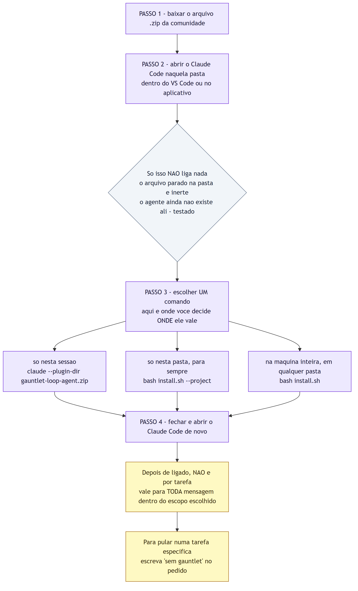
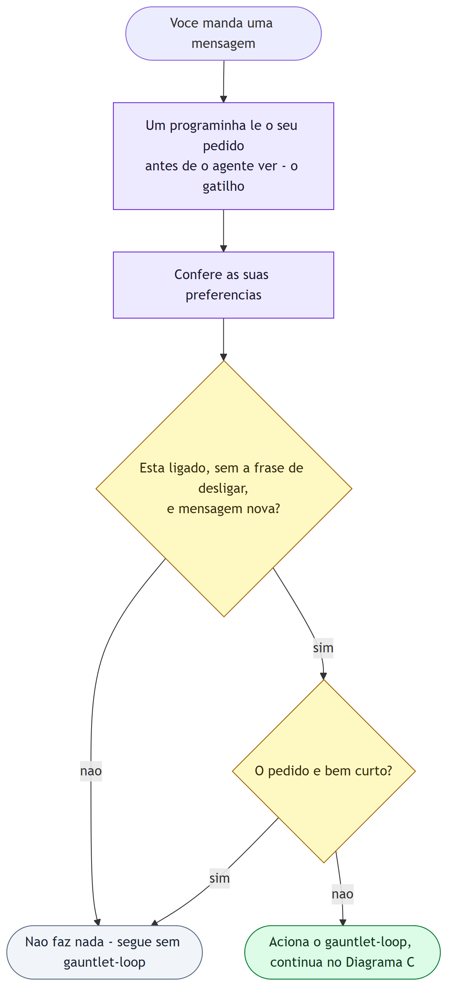
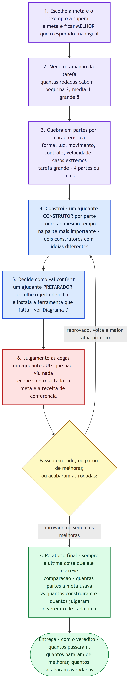
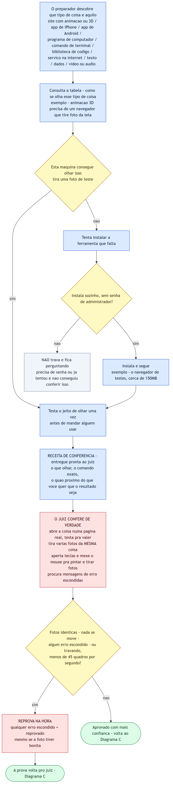

# Arquitetura do Gauntlet-Loop Agent — Como o Agente Decide e Confere Cada Parte

## 1. O que é este documento

Este documento descreve o **mecanismo interno** da técnica/skill **gauntlet-loop**
em si — como ela é ligada, como intercepta cada mensagem, como o agente quebra
uma tarefa em partes, constrói, julga às cegas e decide como conferir cada
resultado. É complementar a `docs/fluxogramas-gauntlet-loop.md`, que aplica o
**conceito** de gauntlet-loop aos fluxos desta Fábrica; aqui o objeto é a
**arquitetura genérica do agente** (setup + gatilho por mensagem + loop
interno + verificação de cada tipo de artefato), tal como descrita no vídeo
*"Essa NOVA técnica de prompting do Claude está impressionando todo mundo
(gauntlet-loop)"*.

### Legenda de cores

| Cor | Papel |
|---|---|
| lilás | Passo de instalação/configuração, ou item de escopo |
| azul | Ajudante que **constrói** (Construtor) ou **prepara a conferência** (Preparador) |
| vermelho | Ajudante que **julga** (Juiz) — nunca é quem construiu, nunca viu o processo |
| amarelo (losango) | Decisão/gate — critério objetivo, saída binária |
| cinza | Ponto de saída sem ação (não faz nada / trava perguntando) |
| verde | Entrega / veredito final |

## 2. Antes de tudo — como isso é ligado

Instalar não é a mesma coisa que ativar: o arquivo baixado fica inerte até um
comando explícito decidir o escopo (sessão, pasta ou máquina inteira).

## 3. A cada mensagem que você manda

Depois de ligado, um gatilho lê cada mensagem antes do agente — não é uma
configuração "por tarefa", mas um filtro que decide, mensagem a mensagem, se o
gauntlet-loop entra em ação.

## 4. O que o agente faz com o seu pedido

O núcleo do padrão: a meta é superar o esperado (não igualá-lo), a tarefa é
fatiada por característica, cada parte tem um Construtor dedicado, e o
julgamento é sempre às cegas — o Juiz nunca viu o processo de construção, só
o resultado, a meta e a receita de conferência.

## 5. Em detalhe — como ele decide conferir cada parte

A parte mais frágil de qualquer avaliação automática é a verificação em si.
Aqui o Preparador identifica o tipo de artefato, escolhe (e instala, se
faltar) a ferramenta certa de inspeção, e o Juiz aplica um teste real — nunca
aceita "a foto ficou bonita" como prova, e reprova na hora qualquer sinal de
que nada mudou ou de que há erro escondido.

## 6. Fonte

- Vídeo: *"Essa NOVA técnica de prompting do Claude está impressionando todo
  mundo (gauntlet-loop)"* — Mestres da IA (YouTube)
- Repositórios de referência da comunidade: `NicholasSpisak/gauntlet-loop`,
  `robonuggets/gauntlet-loop`, `duolahypercho/gauntlet-loop` (GitHub)
- Documento relacionado neste projeto: `docs/fluxogramas-gauntlet-loop.md`
  (aplicação do conceito aos fluxos da Fábrica Agêntica de Publicações)
