# Fluxogramas dos Fluxos e Subagentes — Padrão Gauntlet-Loop

## 1. O que é o Gauntlet-Loop

**Gauntlet-loop** é um padrão de orquestração multiagente popularizado por Matt
Shumer (experimento "Claude of Duty", com Claude Code + Opus 5): em vez de um
único agente gerar um artefato e julgar o próprio trabalho, um **Orquestrador**
divide a tarefa em partes, delega a construção a **Builders** especializados e
faz o resultado passar por um **Critic separado** — que nunca participou da
geração — contra uma **barra de qualidade concreta e mensurável** (não uma
opinião vaga). Se o resultado perde a comparação, ele volta para outra rodada,
até vencer a barra, esgotar o teto de tentativas/custo, ou um humano intervir.

Três princípios do padrão original, aplicados aqui:

1. **Quem constrói nunca julga o próprio trabalho.**
2. **Quem julgou uma vez não julga a correção seguinte às cegas** (o critic é
   sempre o mesmo script/skill determinístico, nunca o agente que escreveu).
3. **A barra tem que ser real** — critérios concretos, não "parece bom".

### Como a Fábrica já implementa isso (achado, não invenção)

A Fábrica Agêntica de Publicações **já opera em gauntlet-loop antes mesmo deste
documento existir** — a Fase 2.5 (Peer Review Autônomo) e os gates de conteúdo
de cada tipo de obra são, na prática, esse padrão. A diferença notável em
relação ao gauntlet-loop "clássico" (dois LLMs, builder vs. critic) é que aqui
o papel de **Critic** é majoritariamente exercido por **scripts determinísticos**
(`validar-*.py`, `auditar-obra.py`) em vez de um segundo LLM — a forma **mais
forte** de "nunca julgar o próprio trabalho": o script não tem contexto do
processo de geração, não tem viés de simpatia com o texto que acabou de ler, e
aplica exatamente o mesmo critério em toda rodada.

### Legenda dos papéis usados nos diagramas

| Papel | Cor | Significado nesta fábrica |
|---|---|---|
| **Orquestrador** | lilás | Comando de entrada (`/criar-livro`, `/campanha`, etc.) e o agente mestre que sequencia as fases |
| **Builder** | azul | Subagente (LLM) ou script determinístico que **produz** o artefato |
| **Critic separado** | vermelho | Skill/subagente de revisão que **nunca é quem construiu** — julga com contexto fresco |
| **Gate (a barra)** | amarelo (losango) | Critério mensurável e automatizável — script `validar-*`/`auditar-*` com saída binária |
| **Loop de correção** | seta de volta | Reprovado → volta ao Builder com o relatório específico da falha, nunca ao Critic |
| **Cap (teto)** | anotado na seta | Máximo de rodadas/tentativas (em geral 3, com backoff exponencial nos capítulos) — evita loop infinito |
| **Entrega** | verde | Saída que atravessou todas as barras e é expedida |

## 2. Visão Geral — Fluxo FULL (`/produzir-obra-completa`)

O fluxo FULL é um **gauntlet-loop de gauntlet-loops**: cada um dos 3 fluxos
(Materiais, Campanhas, Máquina de Vendas) é internamente um gauntlet-loop
completo (detalhado nas seções 3 a 13), e o fluxo master encadeia os três com
sua própria barra de transição — nenhuma fase avança para a próxima com a
anterior reprovada.

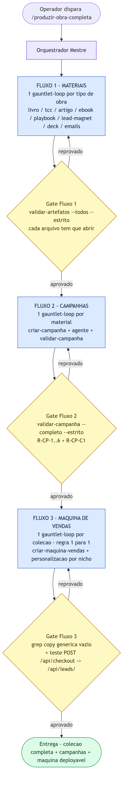

## 3. Livro (`/criar-livro`)

Builders em cascata (pesquisador → arquiteto → redator-capítulo) alimentam
**dois gates**: um de auto-validação do próprio builder (sintaxe de código e
diagramas) e a barra real — o **Critic separado** (`revisor-tecnico` /
`subagente-revisor-tecnico`), que só entra depois que o builder já se
autoaprovou, e nunca é o mesmo agente que escreveu o capítulo.

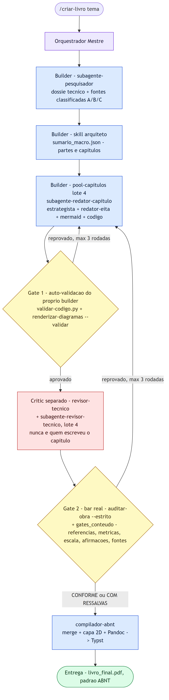

## 4. TCC (`/criar-tcc`)

Mesma espinha dorsal do Livro, com o Critic adaptado ao gênero acadêmico (sem
exigência de tom transformacional nem diagrama Mermaid) e uma segunda barra
específica de normas (`validar-abnt-tcc.py`).

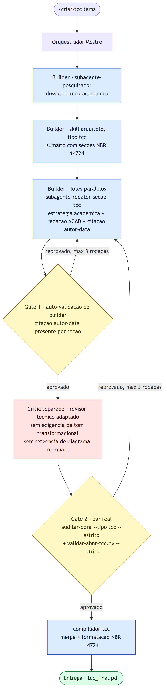

## 5. Artigo Científico (`/criar-artigo`)

Fluxo de **compressão** (custo de LLM baixo): o builder reaproveita o RAG do
livro-mãe já indexado — nunca pesquisa do zero — e escreve direto no formato
IMRaD. O gate final é o mesmo `auditar-obra.py`, com `--tipo artigo`.

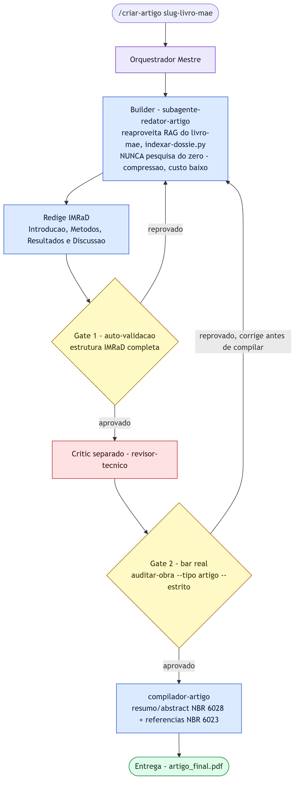

## 6. E-book (`/criar-ebook`)

Fluxo de **adaptação de tom** (custo de LLM baixo, sem pesquisa nova): o
builder reescreve capítulos já prontos para o registro comercial-leve
(EBOOK-LEN). O papel de Critic aqui é o gate determinístico final
(`validar-artefatos.py`), que garante que o artefato **abre**.

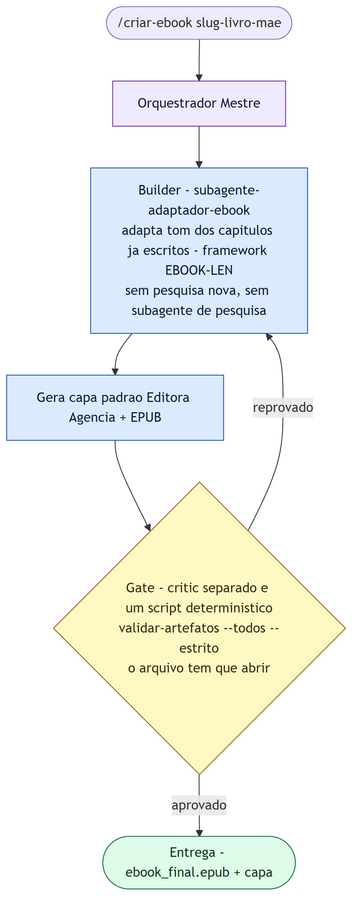

## 7. Playbook (`/criar-playbook`)

Fluxo de **extração, custo zero de LLM**: o builder é um script
(`extrair-passos-praticos.py`) que recorta cards de bancada dos capítulos já
escritos. O Critic separado é `validar-playbook.py`, com gates específicos
(R-PBK-0 proíbe copiar prosa da obra-mãe; R-PBK-5 limita blocos de execução a
25 linhas).

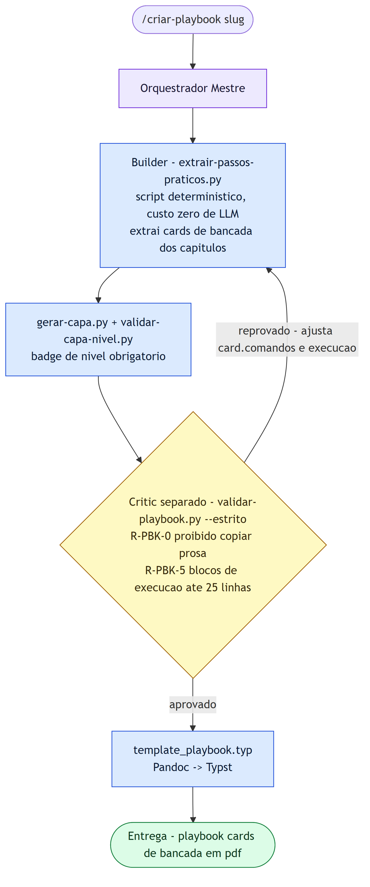

## 8. Lead Magnet (`/criar-lead-magnet`)

Também custo zero de LLM. Ponto de atenção real deste fluxo: a ordem importa —
o PDF precisa existir **antes** do gate medir páginas e CTA, porque
`validar-lead-magnet.py` mede o **PDF já compilado**, não o Markdown.

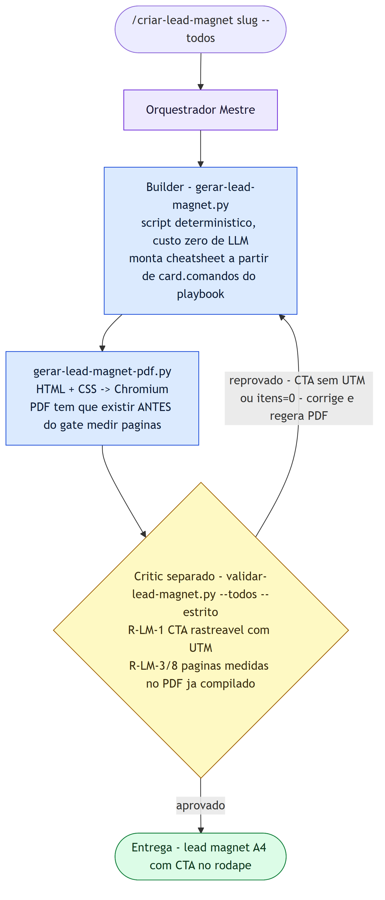

## 9. Deck (`/criar-deck`)

Custo zero de LLM, motor de saída HTML+CSS→Chromium (mesma família do lead
magnet). O deck HTML navegável é o entregável real; PDF e PPTX são derivados.

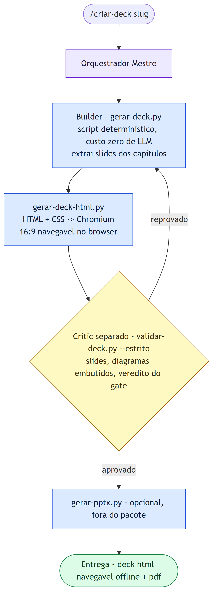

## 10. Sequência de E-mails (`/criar-emails`)

Fluxo de extração com custo de LLM baixo. Gate simples e objetivo:
assunto ≤ 60 caracteres (R-EM-1) e CTA em link Markdown real (R-EM-2).

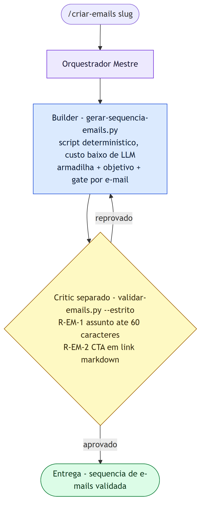

## 11. Campanha (`/campanha`, `/campanha-completa`)

Aqui o gauntlet-loop aparece com **dois builders distintos em sequência**: o
Builder A (custo zero) monta estrutura/moldes/artes/cronogramas; o Builder B
é o **agente com LLM** que escreve a copy final — o "implementer" real do
padrão. O Critic (`validar-campanha.py`) nunca viu o processo de escrita e
reprova copy genérica, moldes ainda em rascunho e artes duplicadas por hash
MD5. A instrução operacional do próprio comando já é gauntlet-loop em texto:
*"corrija na copy e revalide — nunca contorne o gate."*

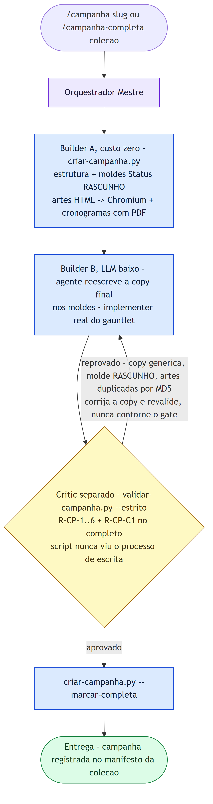

## 12. Máquina de Vendas (`/criar-maquina`)

O gate aqui tem duas camadas: (1) um grep determinístico que reprova copy
genérica remanescente do template ("Autor Digital", "centenas de pessoas");
(2) um teste funcional real (`POST /api/checkout` até o lead aparecer em
`/api/leads/`). Regra de cap adicional: 1 máquina por coleção — uma segunda
tentativa na mesma coleção é recusada na entrada.

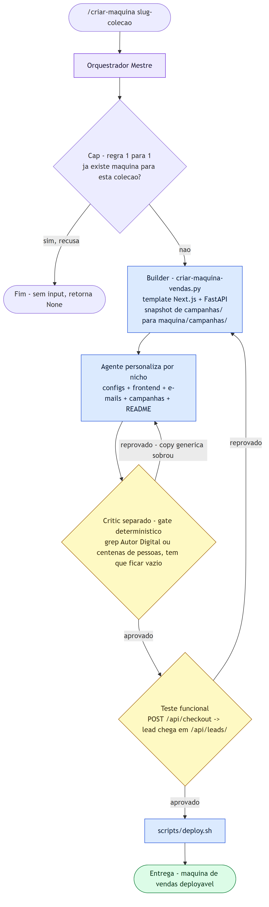

## 13. Onde este padrão diverge do gauntlet-loop "clássico"

| Aspecto | Gauntlet-loop clássico | Esta fábrica |
|---|---|---|
| Quem julga | Um segundo LLM ("critic" com contexto fresco) | Predominantemente **scripts determinísticos** (`validar-*.py`, `auditar-obra.py`) — LLM (`revisor-tecnico`) só nos tipos de geração alta (Livro, TCC) |
| A barra | Exemplar de referência + comparação lado a lado (blind A/B) | Checklist de requisitos objetivos e automatizáveis (Rn, R-XX-n) — sem exemplar comparativo |
| Teto de rodadas | "até vencer, parar de valer a pena, ou um limite disparar" | Fixo: em geral **3 rodadas** por REGRA 4, com backoff exponencial (15s→30s→60s) na Fase 2 do livro |
| Aprovação humana | Gate de aprovação para ações consequentes | Ponto único de interação humana é a definição do tema (`/esbocar`) — depois disso a esteira roda 100% autônoma (REGRA 3) |

## 14. Fontes

- Nil Ni, *"The Gauntlet Loop: My Claude Code Prompt for Polishing Any Product"*
- The Prompt Index, *"AI Loop Engineering & Gauntlet Loops (2026)"*
- daily.dev, *"Gauntlet Loop Explained: AI Agents That Build, Judge & Fix Their Own Work"*
- Repositórios de referência: `robonuggets/gauntlet-loop`, `NicholasSpisak/gauntlet-loop`, `pacaplan/agent-gauntlet` (GitHub)
- `CLAUDE.md` e `docs/fluxo-fabrica-de-livros.md` deste projeto (Fase 2.5, gates de conteúdo F1/F2, comandos `/criar-*`, `/campanha`, `/criar-maquina`)
