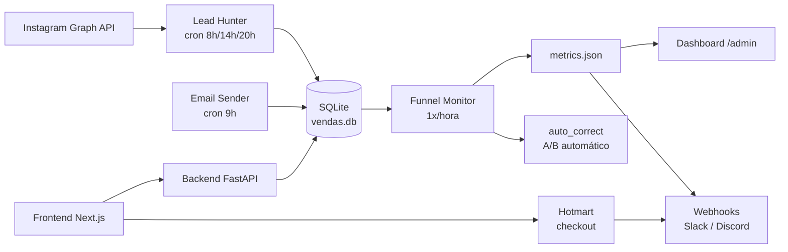

# GUIA DE EXECUÇÃO — MÁQUINA DE VENDAS

**Passo a passo completo: criar, personalizar, testar, publicar e operar**
**a sua máquina de vendas gerada pela Fábrica Agêntica.**

> **Autor:** Heverton Eduardo Peres — Especialista em Marketing e Desenvolvimento de Soluções
> **Versão do projeto:** V5 (coleção) / V5.2 (relatório de sessão)
> **Atualizado em:** 2026-08-09

---

## 1. Visão geral

A **Máquina de Vendas** transforma uma obra da Fábrica (livro, e-book, curso) em um
**sistema de venda digital autônoma**:

```
Instagram (leads) → Captura (frontend) → Checkout (Hotmart) → Pós-venda (e-mails)
        ↑                                                    ↓
   Lead Hunter ←────── SQLite ──────→ Email Sender ←────── leads pagos
```

O que ela entrega de fábrica:

- **Landing page** de captura com formulário de e-mail
- **Página de checkout** integrada ao Hotmart (link de pagamento)
- **Página de obrigado** pós-compra
- **Dashboard /admin** com métricas do funil
- **Backend FastAPI** com SQLite (leads, health, webhook)
- **4 automações**: captura de leads, envio de e-mails, monitoramento, auto-correção
- **3 caminhos de deploy** documentados

O que ela **não** faz sozinha: publicar anúncios, criar o produto no Hotmart e enviar
e-mails em escala (os limites de rate são propositalmente conservadores).

## 2. Pré-requisitos

| Recurso | Necessário para | Onde obter |
|---|---|---|
| Obra publicada | gerar a máquina com conteúdo real | Fábrica (`output/<obra>/...`) |
| Conta Hotmart (produto criado) | checkout | hotmart.com |
| App do Instagram (Meta) | captura de leads | developers.facebook.com |
| SMTP (Gmail/outro) | envio de e-mails | conta de e-mail + app password |
| Node.js 18+ | frontend | nodejs.org |
| Python 3.10+ | backend/automações | python.org |
| Docker (opcional) | deploy VPS | docker.com |
| Conta Vercel (opcional) | deploy frontend | vercel.com |
| Slack/Discord (opcional) | alertas do funil | slack.com / discord.com |

> **Sem a obra publicada?** O `/criar-maquina` ainda gera o projeto, mas o conteúdo
> fica genérico — a personalização por nicho (§7) vira obrigação total.

## 3. Arquitetura



**Caminho do lead:**

1. **Lead Hunter** encontra perfis no Instagram por hashtags/localizações e registra
   o lead no SQLite (status `novo`).
2. **Email Sender** nutre o lead pela sequência do funil (status `nutrido`).
3. O lead acessa a landing, entra no **checkout** e compra no Hotmart.
4. O **webhook** do Hotmart confirma o pagamento → status `pago`.
5. **Funnel Monitor** agrega tudo em `metrics.json` → dashboard e alertas.
6. **auto_correct** sugere A/B com base nas métricas.

## 4. Passo 1 — Gerar a máquina

```bash
/criar-maquina <slug> [--tipo completo|parcial|landing|backend]
```

Exemplo real:

```bash
/criar-maquina livros/ia-agentica-desbloqueada --tipo completo
```

O que acontece nos 7 passos internos:

1. **Copiar template** — `templates/maquina/` → `output/<slug-colecao>/maquina/`
   (**regra 1:1 — 1 máquina por COLEÇÃO**; hub = 1º segmento do slug que não
   seja raiz de tipo. Outra obra do mesmo hub → recusa sem sobrescrever)
2. **Manifesto** — `manifesto.json` com slug, tipo, data, obra-fonte,
   `colecao`, `maquina_em` e `campanhas.snapshot`
3. **Conteúdo da obra** — copia materiais do manifesto da coleção
   (`output/<obra>/colecoes/<nome>.json`)
4. **Campanhas** — snapshot de `output/<slug-colecao>/campanhas/` →
   `maquina/campanhas/` com `snapshot.json` (origem, atualizado_em, materiais)
5. **Replacements** — `{{SLUG}}`, `{{TITULO}}`, `{{PRECO}}` (R$ 97),
   `{{PRECO_CORE}}` (97), `{{PRECO_TRIPWIRE}}` (37), `{{PRECO_OBRA_COMPLETA}}`
   (297), `{{AUTOR}}`, `{{EMAIL_CONTATO}}`, `{{DATA}}`, `{{ANO}}`
6. **Configs + env** — copia `config/` e `.env.example`
7. **Resumo** — instruções de deploy e próximos passos

> **Layout série-aware:** a obra é localizada via `tipos_obra.dir_obra()` —
> funciona com `output/<obra>/<tipo>/...` (single-book ou série multi-book). Se a
> obra não for encontrada, o script aborta com a lista de obras disponíveis.

**Validação de saída do gerador** (antes de tocar em qualquer arquivo):

```bash
grep -rn 'Autor Digital\|centenas de pessoas' output/<slug-colecao>/maquina/ \
  --exclude-dir=node_modules --exclude-dir=.next --exclude='*.db'
```

Deve retornar **vazio**. Se retornar, a personalização (§7) ainda não foi feita.

## 5. Passo 2 — Conhecer a estrutura gerada

```text
output/<slug-colecao>/maquina/
├── manifesto.json            # manifesto da máquina
├── README.md                 # arquitetura, deploy, operação (leia!)
├── AGENTS.md                 # regras para agentes de IA que operarem a máquina
├── SPEC.md                   # contrato da máquina
├── docker-compose.yml        # frontend + backend + automações
├── vercel.json               # config de deploy na Vercel
├── .env.example              # modelo de variáveis (copie para .env)
├── .mcp.json                 # MCPs: db_state + file_writer (gerado)
├── config/                   # 8 JSONs de configuração (§8)
├── database/                 # schema.sql, seed.sql, maquina.db
├── backend/app/              # FastAPI: routers/, services/, models/, database/
├── frontend/                 # Next.js 14 (App Router)
├── scripts/                  # 4 automações + deploy.sh
├── campanhas/                # snapshot das campanhas da coleção (V5.3)
├── conteudo/                 # cópia da obra (md/pdf/epub)
└── frontend/public/artes/    # capas e artes da obra
```

## 6. Passo 3 — Preencher o ambiente (.env)

```bash
cd output/<slug-colecao>/maquina
cp .env.example .env
# edite com valores REAIS
```

Variáveis críticas:

| Variável | Exemplo | Para quê |
|---|---|---|
| `APP_ENV` | `production` | modo de operação |
| `APP_SECRET_KEY` | `openssl rand -hex 32` | assinatura de sessões/tokens |
| `SITE_URL` | `https://seudominio.com` | links canônicos |
| `BACKEND_URL` | `http://localhost:8000` | frontend → backend |
| `NEXT_PUBLIC_BACKEND_URL` | idem público | chamadas do browser |
| `DATABASE_PATH` | `./database/leads.db` | SQLite |
| `INSTAGRAM_ACCESS_TOKEN` | `EAAG...` | Lead Hunter |
| `INSTAGRAM_APP_ID` / `APP_SECRET` | da Meta | refresh de token |
| `SMTP_HOST` / `SMTP_PORT` | `smtp.gmail.com` / `587` | e-mails |
| `SMTP_USER` / `SMTP_PASSWORD` | app password | autenticação |
| `FROM_EMAIL` / `FROM_NAME` | `contato@dominio.com` / `Fábrica` | remetente |
| `TRACKING_DOMAIN` | `https://go.seudominio.com` | UTM/rastreio |
| `HOTMART_WEBHOOK_SECRET` | gerado no Hotmart | validar webhook |
| `HOTMART_CLIENT_ID` / `CLIENT_SECRET` | do app Hotmart | API de pagamento |
| `OPENAI_API_KEY` | `sk-...` | copy/DM com IA |
| `OPENAI_MODEL` | `gpt-4o-mini` | modelo default |
| `VPS_HOST` / `VPS_USER` / `VPS_PATH` | `167.86.x.x` / `root` / `/opt/maquina-vendas` | deploy Docker |
| `VERCEL_TOKEN` / `ORG_ID` / `PROJECT_ID` | da conta Vercel | deploy frontend |
| `SLACK_WEBHOOK_URL` / `DISCORD_WEBHOOK_URL` | do canal | alertas |
| `MAX_EMAILS_PER_HOUR` | `30` | proteção de reputação |
| `MAX_EMAILS_PER_DAY` | `200` | proteção de reputação |
| `MAX_LEADS_PER_DAY` | `100` | teto de captura |

> **NUNCA** commite o `.env`. Ele está no `.gitignore` da máquina.

## 7. Passo 4 — Personalizar por nicho (obrigatório)

A máquina nasce genérica (Regra 12: personalizar, não só gerar). Personalize os
**8 pontos** abaixo — cada um tem um gate de verificação:

### 7.1 Produtos (`config/produtos.json`)

```json
{
  "produtos": [
    {
      "id": "livro-autor-digital",
      "nome": "O Segredo do Autor Digital",
      "preco": 47.00,
      "preco_riscado": 67.00,
      "tipo": "livro"
    }
  ],
  "produto_default": "livro-autor-digital"
}
```

**Gate:** o `produto_default` deve existir no array — o checkout o usa para montar o
link do Hotmart. Produto desalinhado = 404 no botão PAGAR.

### 7.2 Funis (`config/funis.json`)

```json
{
  "funis": {
    "nutricao-livro": {
      "produto": "livro-autor-digital",
      "desconto": { "codigo": "LANCTO30", "percentual": 30 },
      "steps": [
        { "dias": 0, "tipo": "boas-vindas" },
        { "dias": 2, "tipo": "educativo" },
        { "dias": 5, "tipo": "oferta" }
      ]
    }
  }
}
```

**Gate:** cada funil referencia um produto existente; `steps` não vazio.

### 7.3 Personas (`config/personas.json`)

```json
{
  "personas": [
    {
      "id": "dentista-gestor",
      "nome": "Dentista que quer gerir melhor",
      "dores": ["não fecha o caixa", "não precifica"],
      "objetivos": ["gestão financeira simples"],
      "tom": "direto e acolhedor"
    }
  ]
}
```

### 7.4 Canais (`config/canais.json`)

```json
{
  "instagram": {
    "hashtags": ["#odontologia", "#gestaoodontologica"],
    "localizacoes": ["São Paulo, SP"],
    "max_leads_dia": 100,
    "delay": 1.5,
    "janela": { "inicio": "08:00", "fim": "22:00", "fuso": "America/Sao_Paulo" }
  }
}
```

### 7.5 Landing (`frontend/app/page.tsx` e `captura/page.tsx`)

Troque headline, subheadline, bullets e CTA pelo **vocabulário do nicho** (use a
persona). Exemplo de headline para dentista:

> "O método de 30 dias para o dentista que quer saber quanto ganha de verdade"

**Gate:** a palavra do nicho aparece no H1 e o CTA contém verbo de ação + link real.

### 7.6 E-mails (`templates/`)

Reescreva os e-mails da sequência com a copy do nicho. Mantenha: máx. 250 palavras,
1 link por e-mail, assunto ≤ 60 caracteres.

### 7.7 README

Atualize o `README.md` da máquina: seu domínio, seu produto, suas credenciais,
suas instruções de operação.

### 7.8 `.env`

Preencha com valores reais (§6).

**Gate final de personalização (antes do deploy):**

```bash
grep -rn 'Autor Digital\|centenas de pessoas' output/<slug-colecao>/maquina/ \
  --exclude-dir=node_modules --exclude-dir=.next --exclude='*.db'
# → vazio = pronto
```

## 8. Passo 5 — Configurar os JSONs

| Arquivo | Campos | Instrução |
|---|---|---|
| `produtos.json` | catálogo | 1 produto real por oferta; preço sem centavos redondos (47/97) |
| `funis.json` | funil por oferta | steps em dias após o lead; oferta no step 3+ |
| `personas.json` | persona | 1-3 personas; a mais forte vira a voz do H1 |
| `canais.json` | Instagram | hashtags do nicho (5-20), localizações, janela de captura |
| `email.json` | SMTP + limites | host, porta, usuário, app password, assinatura, listas |
| `pagamento.json` | Hotmart | CLIENT_ID/SECRET/WEBHOOK_SECRET do app Hotmart |
| `roteamento_modelos.json` | IA | temperatura (0.7 copy, 0.2 análise) e max_tokens por tarefa |
| `subagentes.json` | agentes IA | quem escreve copy, quem responde DM, quem analisa lead |

> Edite com JSON válido (sem comentários). Valide com `python -m json.tool arquivo.json`.

## 9. Passo 6 — Editar o frontend

**Rotas (App Router Next.js 14):**

| Rota | Arquivo | Função |
|---|---|---|
| `/` | `app/page.tsx` | página de venda: hero, dor, solução, value stack, depoimentos, preço, garantia, CTA |
| `/captura` | `app/captura/page.tsx` | landing de captura (capítulo gratuito) |
| `/checkout` | `app/checkout/page.tsx` | **client**: nome/e-mail → `POST /api/checkout` |
| `/obrigado` | `app/obrigado/page.tsx` | pós-compra |
| `/admin` | `app/admin/page.tsx` | dashboard (KPIs + leads recentes) |
| `/admin/leads` | `app/admin/leads/page.tsx` | lista completa, busca, paginação, export CSV |
| `/admin/metricas` | `app/admin/metricas/page.tsx` | gráficos (receita, leads por origem), funil |
| `/admin/emails` | `app/admin/emails/page.tsx` | sequências com métricas de abertura/clique |
| `/api/lead` | `app/api/lead/route.ts` | cria lead (zod) |
| `/api/checkout` | `app/api/checkout/route.ts` | cria lead + processa pedido |
| `/api/webhook` | `app/api/webhook/route.ts` | webhook genérico (Hotmart etc.) |
| `/api/health` | `app/api/health/route.ts` | status |

**Regras de ouro:**

- **Nunca** use `<form action method="POST">` vazio no checkout — quebra no
  `request.json()`. Use componente client com `fetch` + JSON.
- O formulário de captura deve coletar **nome + e-mail** (nunca só e-mail).
- CTA com UTM: `https://pay.hotmart.com/XXXXX?utm_source=site&utm_medium=botao&utm_campaign=lancto`.
- As rotas `/api/*` do Next chamam o backend via `BACKEND_URL` (server-side) ou
  `NEXT_PUBLIC_BACKEND_URL` (browser).

## 10. Passo 7 — Entender o backend

**FastAPI** em `backend/app/` — `main.py` monta os routers:

| Router | Endpoint | Função |
|---|---|---|
| `routers/leads.py` | `POST /api/leads/` | cria lead: `{email, nome, fonte, funil}` → status `novo` |
| `routers/funil.py` | `GET /api/funil/metricas` | agregados do funil (dashboard) |
| `routers/emails.py` | `POST /api/emails/disparar` | envia a sequência (respeita rate limits) |
| `routers/webhooks.py` | `POST /api/webhook` | valida secret e marca lead/venda como pago |

`services/`: `lead_service` (regras de lead), `email_service` (SMTP + rate limit),
`metricas_service` (agregação), `scoring_service` (prioriza leads quentes),
`auto_correct` (propõe A/B). `models/`: `lead`, `venda`, `campanha`, `interacao`.

**Tabelas SQLite** (`database/schema.sql` → `backend/data/vendas.db` por default;
`DATABASE_PATH` no `.env` sobrescreve):

- `leads` — id, email, nome, fonte, funil, status (`novo → nutrido → pago → cancelado`), timestamps
- `vendas` — pedido, valor, status (confirmação do webhook)
- `campanhas` — variantes A/B e resultados
- `interacoes` — aberturas/cliques de e-mail

> **Leads de teste** vivem no banco SQLite da máquina (`backend/data/vendas.db`).
> Ao testar, limpe o banco de verdade antes de ir pra produção.

## 11. Passo 8 — Checkout e Hotmart

### 11.1 Fluxo

```
/checkout (client)
   → nome + e-mail → POST /api/checkout
   → backend cria lead (status novo) + monta link de pagamento
   → redireciona para pay.hotmart.com/...?utm_...
   → Hotmart processa → webhook POST /api/webhook
   → backend valida assinatura → marca lead PAGO
   → /obrigado exibe código do pedido
```

### 11.2 Configuração no Hotmart

1. Crie o produto (preço igual ao `config/produtos.json`).
2. Crie um **app** em developer.hotmart.com → pegue `CLIENT_ID` e `CLIENT_SECRET`.
3. Configure o **webhook** apontando para `https://seudominio.com/api/webhook` com o
   `WEBHOOK_SECRET` escolhido.
4. Para testar: use o modo sandbox do Hotmart (compra simulada).

### 11.3 Alinhamento obrigatório

- `produto_default` em `config/produtos.json` == ID do produto no Hotmart.
- O botão PAGAR (PricingCard) leva a `/checkout`, que envia nome/e-mail via
  `POST /api/checkout` (rota Next.js com validação zod) — o lead é criado no
  backend (`/api/leads/`) e o pedido registrado.
- Máquinas geradas **antes** do fix do checkout (rota `/api/checkout` ausente, form
  urlencoded vazio) devem ser sincronizadas:

```bash
# skill: sincronizar-maquina-vendas
# copia do template: rota /api/checkout, page client, produto default, BACKEND_URL
```

## 12. Passo 9 — Testar tudo localmente

### 12.1 Frontend

```bash
cd output/<slug-colecao>/maquina/frontend
npm install
npm run dev
# http://localhost:3000
```

Verifique: landing carrega, form de captura envia, `/checkout` abre, `/admin` mostra
o dashboard.

### 12.2 Backend

```bash
cd output/<slug-colecao>/maquina/backend
pip install -r requirements.txt
uvicorn main:app --reload --port 8000
# http://localhost:8000/api/health → {"status": "ok"}
```

### 12.3 Fluxo completo (teste de ponta a ponta)

```bash
# 1. Cria lead
curl -X POST http://localhost:8000/api/leads/ \
  -H "Content-Type: application/json" \
  -d '{"email":"teste@exemplo.com","nome":"Teste","fonte":"manual","funil":"nutricao-livro"}'

# 2. Checkout (via frontend em localhost:3000)
curl -X POST http://localhost:3000/api/checkout \
  -H "Content-Type: application/json" \
  -d '{"nome":"Teste","email":"teste@exemplo.com"}'
# → 200 com url de pagamento

# 3. Simula webhook Hotmart (sandbox)
curl -X POST http://localhost:8000/api/webhook \
  -H "Content-Type: application/json" \
  -H "X-Hotmart-Secret: <HOTMART_WEBHOOK_SECRET>" \
  -d '{"email":"teste@exemplo.com","status":"pago","codigo":"PED-123"}'
```

Confira no SQLite: `sqlite3 backend/data/vendas.db "SELECT * FROM leads;"`.

### 12.4 Automações (teste manual)

```bash
python scripts/lead_hunter.py --dry-run     # mostra o que buscaria, sem gravar
python scripts/email_sender.py --dry-run    # mostra o que enviaria
python scripts/funnel_monitor.py --force    # gera metrics.json agora
python scripts/auto_correct.py --dry-run    # propõe A/B sem aplicar
```

## 13. Passo 10 — Publicar (deploy)

### Opção A — Docker VPS (recomendada)

```bash
cd output/<slug-colecao>/maquina
./scripts/deploy.sh full        # build das imagens + sobe tudo
./scripts/deploy.sh status      # saúde dos serviços
./scripts/deploy.sh backup      # backup do banco
./scripts/deploy.sh rollback    # volta versão anterior
```

Pré-requisitos no VPS: Docker + Docker Compose. O `docker-compose.yml` sobe
frontend (Next.js standalone), backend (uvicorn) e automações (cron).

### Opção B — Vercel + Railway

```bash
cd output/<slug-colecao>/maquina/frontend
npx vercel deploy --prod        # frontend na Vercel (vercel.json já configurado)
```

Backend + automações em Railway/Fly.io (ou mesmo VPS). Aponte
`NEXT_PUBLIC_BACKEND_URL` para o backend hospedado.

### Opção C — Nginx + PM2 (VPS tradicional)

1. Build do frontend: `npm run build && pm2 start npm --name frontend -- start`
2. Backend: `pm2 start "uvicorn main:app --host 0.0.0.0 --port 8000" --name backend`
3. Nginx: proxy `/` → frontend (3000), `/api` → backend (8000), SSL Let's Encrypt
4. `pm2 save && pm2 startup`

### Checklist de produção

- [ ] `.env` real (não o `.env.example`)
- [ ] `produto_default` alinhado ao Hotmart
- [ ] CTA com URL real (sem `pay.hotmart.com/XXXXX`)
- [ ] Webhook do Hotmart apontando para `/api/webhook` com secret
- [ ] `npm run build` sem erros
- [ ] `POST /api/checkout` responde 200 em produção
- [ ] Crontab das 4 automações no fuso America/Sao_Paulo
- [ ] Backup agendado (3h)

## 14. Passo 11 — Configurar automações (cron)

```bash
crontab -e
# fuso: America/Sao_Paulo
TZ=America/Sao_Paulo

0 8,14,20 * * * cd /opt/maquina-vendas && python3 scripts/lead_hunter.py >> logs/lead_hunter.log 2>&1
0 9 * * *     cd /opt/maquina-vendas && python3 scripts/email_sender.py >> logs/email_sender.log 2>&1
0 * * * *     cd /opt/maquina-vendas && python3 scripts/funnel_monitor.py >> logs/funnel_monitor.log 2>&1
0 3 * * *     cd /opt/maquina-vendas && ./scripts/deploy.sh backup >> logs/backup.log 2>&1
```

| Automação | Cron default | O que faz |
|---|---|---|
| Lead Hunter | 8h/14h/20h | captura leads por hashtags/localizações (respeita `max_leads_dia` e delay 1.5s) |
| Email Sender | 9h | envia a sequência do funil (30/h, 200/dia) |
| Funnel Monitor | 1x/hora | `metrics.json` + webhooks Slack/Discord |
| auto_correct | diário (junto do monitor) | propõe A/B de assunto/CTA/horário |

## 15. Passo 12 — Operar 24/7

**Ritual diário (10 minutos):**

1. Abra `/admin` (ou o dashboard da Vercel) e confira `metrics.json`.
2. Métricas: leads novos, conversão em checkout, receita, abertura de e-mail.
3. Leia as sugestões do `auto_correct` (A/B proposto).
4. Confira logs: `tail -f logs/lead_hunter.log`, `logs/email_sender.log`.
5. Confira o backup: `./scripts/deploy.sh backup` rodou 3h.

**Alertas:** o Funnel Monitor dispara Slack/Discord quando algo cai (ex.: zero
checkouts em 24h). Nunca ignore alerta de webhook.

## 16. Passo 13 — Monitorar e escalar

| Métrica | Onde | Meta típica |
|---|---|---|
| Leads/dia | `/admin` | 10-100 (conforme `max_leads_dia`) |
| Conversão em checkout | `/admin` | 1-5% dos leads nutridos |
| Receita | `/admin` | fechar a meta do funil |
| Abertura de e-mail | Email Sender log | 30-50% |

**Escala em 4 níveis:**

1. **Mais leads:** expanda hashtags/localizações e a janela (respeitando o delay).
2. **Mais conversão:** ative A/B do `auto_correct` (assunto, CTA, horário, preço).
3. **Mais volume de e-mail:** suba o plano SMTP e ajuste `MAX_EMAILS_*`.
4. **Banco:** SQLite → PostgreSQL (troque `DATABASE_PATH`; SQLAlchemy já abstrai).

## 17. Troubleshooting

| Sintoma | Causa | Fix |
|---|---|---|
| 404 no botão PAGAR | `/api/checkout` ausente ou produto default errado | rodar `sincronizar-maquina-vendas`; alinhar `config/produtos.json` |
| 500 no checkout | form urlencoded vazio | page client com nome/e-mail + fetch JSON |
| `grep 'Autor Digital'` retorna | personalização pendente | personalizar os 8 pontos (§7) |
| Leads de teste poluídos | banco de teste | limpar `backend/data/vendas.db` |
| E-mails não saem | rate limit atingido | aguardar janela; conferir `email.json` |
| Instagram sem leads | token expirado / fora da janela | renovar token; janela 08:00-22:00 |
| Webhook não marca pago | secret errado | conferir `HOTMART_WEBHOOK_SECRET` dos 2 lados |
| Dashboard vazio | `funnel_monitor` não rodou | `python scripts/funnel_monitor.py --force` |
| Build falha no Windows | scripts Unix-only | rodar no WSL/Git Bash ou Docker |

## 18. Checklist final

Antes de declarar a máquina **em produção**:

- [ ] Obra publicada e personalização por nicho completa (gate grep vazio)
- [ ] `.env` com credenciais reais de produção
- [ ] Checkout testado de ponta a ponta (lead → link → webhook → pago)
- [ ] Deploy feito (A, B ou C) com `npm run build` verde
- [ ] Automações no cron com fuso America/Sao_Paulo
- [ ] Backup agendado e testado (`deploy.sh backup`)
- [ ] Alertas Slack/Discord funcionando
- [ ] `metrics.json` sendo gerado e dashboard atualizando

## 19. Referências rápidas

| Comando | Função |
|---|---|
| `/criar-maquina <slug> --tipo completo` | gera a máquina |
| `cp .env.example .env` | prepara o ambiente |
| `grep -rn 'Autor Digital\|centenas de pessoas' output/<slug-colecao>/maquina/ --exclude-dir=node_modules --exclude-dir=.next --exclude='*.db'` | gate de personalização |
| `npm run dev` (frontend) | testa local |
| `uvicorn main:app --reload --port 8000` (backend) | testa API |
| `./scripts/deploy.sh full \| status \| backup \| rollback` | opera no VPS |
| `python scripts/funnel_monitor.py --force` | gera métricas na hora |
| `crontab -e` (TZ=America/Sao_Paulo) | agenda automações |

---

*Guia mantido por `scripts/atualizar-documentacao.py` — não edite o PDF à mão;
edite este `.md` e recompile.*
