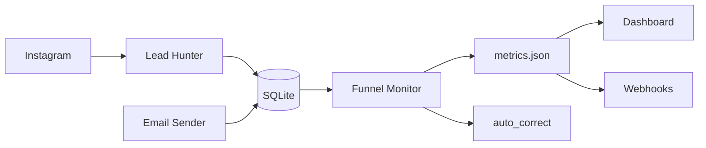

# MANUAL COMPLETO — FÁBRICA AGÊNTICA DE PUBLICAÇÕES

**Criação de Materiais | Criação de Campanhas | Criação da Máquina de Vendas**

> Manual do usuário — tudo o que é possível criar e fazer com o projeto
> `fabrica-de-livros`, explicado passo a passo.
>
> **Autor:** Heverton Eduardo Peres — Especialista em Marketing e Desenvolvimento de Soluções
> **Versão do projeto:** V5.3 (HUB por coleção + Campanhas + Transmutação)
> **Atualizado em:** 2026-08-09

---

# PARTE 1 — CRIAÇÃO DOS MATERIAIS

> **🎬 Storytelling: A Fábrica**
>
> Imagine uma fábrica naval. Chapas de aço chegam pela porta (temas) e saem navios
> completos prontos para navegar (livros, e-books, decks). Cada estação da fábrica
> acrescenta uma camada: o **pesquisador** corta e dobra o aço, o **arquiteto**
> desenha o projeto, o **redator** costura as peças, o **revisor** verifica a
> integridade, e o **compilador** pinta e lança o navio ao mar.
>
> Você é o **diretor do estaleiro**. Só precisa dizer "quero um navio sobre X".
> A fábrica faz o resto.

---

## 1. O que é a Fábrica

A **Fábrica Agêntica de Publicações** é um sistema orquestrado por agentes de IA que
produz, de forma **autônoma e determinística**, uma família completa de materiais de
publicação a partir de um único tema:

- **Livros técnicos** (ABNT, 16+ capítulos, 70+ páginas)
- **TCCs e monografias** (NBR 14724)
- **Artigos científicos** (NBR 6022)
- **E-books** (tom comercial leve)
- **Playbooks práticos** (cards de bancada)
- **Lead magnets** (6 formatos de isca digital)
- **Slide decks** (HTML navegável + PDF 16:9)
- **Sequências de e-mails** (nutrição e oferta)
- **Coleções** (manifesto de todos os derivados de um mesmo núcleo)
- **Mega-livros** (unificação de vários livros)

### O que o projeto entrega de concreto

| Entregável | Onde fica | Como é produzido |
|---|---|---|
| Livro/TCC | `output/<colecao>/livros/` | Fases 1-3 (geração por LLM) |
| Artigos | `output/<colecao>/artigos/` | Compressão do dossiê (RAG) |
| E-books | `output/<colecao>/ebooks/` | Reescrita de tom (compressão) |
| Playbook | `output/<colecao>/playbooks/` | Extração determinística (0 token) |
| Lead magnets | `output/<colecao>/lead-magnets/` | Agregação dos cards (0 token) |
| Deck | `output/<colecao>/decks/` | Montagem a partir de sumário+diagramas (0 token) |
| E-mails | `output/<colecao>/emails/` | Esqueleto + polimento de copy |
| Coleção | `output/<colecao>/colecoes/<nome>.json` | Manifesto derivado (`colecao.py`) |
| Pacote distribuível | `output/<colecao>/distribuicao/` | `empacotar-colecao.py` |

---

## 2. Conceitos fundamentais

> **🎬 Storytelling: O DNA da obra**
>
> Toda obra carrega um **DNA** em seu núcleo: o que foi pesquisado (dossiê),
> como foi estruturada (sumário) e qual a voz que usa (motivo condutor).
> Esse DNA é compartilhado por todos os derivados — artigos, e-books, decks —
> garantindo que a coleção inteira fale a mesma língua.

### 2.1 Obra

Uma **obra** é um projeto de publicação com um núcleo canônico: um dossiê de pesquisa
(`pesquisa/`), um `sumario_macro.json` (arquitetura da obra) e um `motivo_condutor`
(persona, vocabulário e narrativa).

O slug da obra é sempre **kebab-case**. Exemplo: `ia-agentica-desbloqueada`.

### 2.2 Núcleo canônico

Conjunto imutável que dá identidade à coleção:

- `dossiê` — pesquisa indexada (RAG) sobre o tema
- `sumario_macro` — arquitetura (partes, capítulos, marcos)
- `motivo_condutor` — `nome`, `descricao`, `vocabulario`, `persona_leitor`

### 2.3 Coleção

**COLEÇÃO** = todos os artefatos derivados de um mesmo núcleo canônico,
compartilhando identidade visual, vocabulário condutor, badge de nível e CTA.

### 2.4 Registro declarativo de tipos (`scripts/tipos_obra.py`)

Cada tipo de obra é uma **entrada no registro** `tipos_obra.py`. Para ver a matriz:

```bash
python scripts/tipos_obra.py --matriz
```

---

## 3. Estrutura HUB por Coleção (REGRA INTOCÁVEL)

> **🎬 Storytelling: A cidade dos navios**
>
> Cada coleção vive em sua própria **cidade portuária** (`output/<colecao>/`).
> Dentro da cidade, cada tipo de material tem seu bairro: livros, artigos,
> e-books, playbooks, lead-magnets, decks, emails. Nenhuma cidade mistura
> seus bairros com os da cidade vizinha — isso seria bagunça no porto.

### ⚠️ REGRA INTOCÁVEL

**`output/` DEVE organizar por COLEÇÃO. NUNCA criar pastas soltas na raiz.**

```text
output/
├── series.json                    # cores das coleções
├── <colecao-1>/                   # CADA COLEÇÃO TEM SUA ESTRUTURA
│   ├── livros/                    #   livro principal
│   ├── artigos/                   #   artigos derivados
│   ├── ebooks/                    #   e-books derivados
│   ├── playbooks/                 #   playbooks derivados
│   ├── lead-magnets/              #   lead magnets
│   ├── decks/                     #   decks
│   ├── emails/                    #   sequências
│   ├── colecoes/                  #   manifestos
│   ├── campanhas/                 #   materiais de divulgação
│   ├── distribuicao/              #   pacotes empacotados
│   └── maquina/                   #   máquina de vendas
├── <colecao-2>/
└── series.json
```

---

## 4. Fluxo completo da esteira (Fases 0-4)

> **🎬 Storytelling: A jornada do navio**
>
> Um navio nasce em 5 etapas:
> 1. **Fase 0 — Estaleiro**: o operador descreve o que quer (tema)
> 2. **Fase 1 — Projetista**: pesquisadores mineram matéria-prima, arquitetos desenham
> 3. **Fase 2 — Construção**: redatores constroem capítulo a capítulo em lotes
> 4. **Fase 2.5 — Inspeção**: revisor técnico verifica tudo antes da pintura
> 5. **Fase 3 — Lançamento**: compilador pinta, numera e lança ao mar
> 6. **Fase 4 — Frota**: coleção sincronizada, pacotes prontos para distribuição

### Fase 0 — Esboço (`/esbocar <tema>`)

Único ponto de interação humana. O orquestrador pergunta:

1. Tipo de obra (Livro / TCC)
2. Senioridade (Iniciante / Intermediário / Avançado / Técnico)
3. Referências por capítulo (5 / 8 / 12 / 16 / 20)
4. Tamanho (P / M / G / GG / XG)
5. Artigos científicos? (Sim / Não + quantidade)
6. E-books? (Sim / Não + quantidade)
7. Derivados V5 (Playbook / Lead magnets / Deck / E-mails)
8. Série/coleção? (Nome ou standalone)
9. CTA (URL rastreável — obrigatória para LM/deck/e-mails)

**Validação:** `python scripts/parametros_obra.py <prefixo>/<slug> --validar`

### Fase 1 — Pesquisa e Arquitetura

1. **Pesquisador** (`subagente-pesquisador`) varre web → `pesquisa/dossie_*.md`
2. **Indexação:** `python scripts/indexar-dossie.py <slug> --indexar`
3. **Arquiteto** (`arquiteto`) → `sumario_macro.json`
4. **Fatiamento:** `python scripts/fatiar-obra.py <slug> --artigos --ebooks --playbook`
5. **Sincronização:** `python scripts/colecao.py --sincronizar --slug <prefixo>/<slug>`

### Fase 2 — Manufatura em lotes controlados

```bash
python scripts/pool-capitulos.py <slug> --plano --lote 4
python scripts/pool-capitulos.py <slug> --proximo-lote --lote 4
```

Cada lote: **estrategista** → **redator** (4 subagentes paralelos) → **CI de código** →
**renderização de diagramas**.

### Fase 2.5 — Revisão técnica autônoma (peer review)

```bash
python scripts/auditar-obra.py <slug> --estrito
python scripts/validar-codigo.py <slug>
python scripts/renderizar-diagramas.py <slug> --capitulos --validar
```

**Gates de mérito F1/F2:**
```bash
python scripts/validar-referencias.py <slug>     # URLs/DOIs reais
python scripts/validar-metricas.py <slug>         # ≥1 métrica com [N]
python scripts/validar-escala.py <slug>           # limites na Aplica
python scripts/validar-afirmacoes.py <slug>       # dados com citação
python scripts/validar-fontes.py <slug>           # hierarquia A/B ≥70%
```

### Fase 3 — Compilação e PDF

```bash
python scripts/gerar-ilustracoes.py <slug>        # ilustrações 2D
python scripts/gerar-capa.py <slug> --tipo livro  # capa gráfica
python scripts/compilar-para-pdf.py <slug> --paginas-exatas
```

### Fase 4 — Coleção e entrega (V5)

```bash
python scripts/colecao.py --sincronizar --slug <prefixo>/<slug>
python scripts/validar-artefatos.py --todos --estrito
python scripts/empacotar-colecao.py "<coleção>"
```

---

## 5. Modos de Execução — Autônomo vs Encadeado

> **🎬 Storytelling: Você é o comandante**
>
> Imagine que você é o comandante de uma frota naval. Você pode:
> - **Lançar a frota inteira** de uma vez (`/produzir-obra-completa`)
> - **Lançar um navio por vez** (`/criar-livro`, `/criar-artigo`, etc.)
> - **Enviar só o marketing** de uma coleção já pronta (`/campanha-completa`)
> - **Ativar só o porto comercial** (`/criar-maquina`)
>
> Cada opção é **independente** e funciona sozinha. A única restrição é
> a **ordem**: não dá para enviar o marketing antes do navio estar pronto,
> e não dá para ativar o porto antes do marketing existir.

### Modo Encadeado (tudo de uma vez — 3 fluxos AUTÔNOMOS)

```bash
/produzir-obra-completa "Inteligência Artificial para Iniciantes"
```

**O que roda (TODOS os 3 fluxos, sem exceção):**

```
FLUXO 1 — MATERIAIS:
  1. Fase 0: Esboço (pesquisa + arquitetura)
  2. Fase 1: Pesquisa e dossiê
  3. Fase 2: Manufatura de capítulos
  4. Fase 2.5: Revisão técnica
  5. Fase 3: Compilação PDF
  6. Fase 4: Coleção + entrega
  7. Derivados: artigos, ebooks, playbook, lead magnets, deck, emails

FLUXO 2 — CAMPANHAS (obrigatório):
  8. /campanha-completa → artes, textos, cronogramas para TODOS os materiais

FLUXO 3 — MÁQUINA DE VENDAS (obrigatório):
  9. /criar-maquina → Next.js + FastAPI + SQLite + automações
```

### Modo Individual — Só Materiais

```bash
# Criar só o livro (requer Fase 1 já rodada)
/criar-livro <slug>

# Criar só os artigos (requer livro-mãe)
/criar-artigo <slug>

# Criar só os e-books (requer livro compilado)
/criar-ebook <slug>

# Criar só o playbook (extração determinística)
/criar-playbook <slug>
```

### Modo Individual — Só Campanhas

```bash
# Campanha de 1 material
/campanha <slug-material>

# Campanhas de TODOS os materiais da coleção
/campanha-completa <slug-colecao>
```

### Modo Individual — Só Máquina de Vendas

```bash
# Gerar máquina (requer coleção + campanhas)
/criar-maquina <slug>
```

### Diagrama de Dependências

```
┌─────────────────────────────────────────────────────────────┐
│                    MATERIAIS (Fluxo 1)                       │
│  /esbocar → /criar-livro → /criar-artigo → /criar-ebook    │
│                       ↓                                     │
│              /criar-playbook → /criar-lead-magnet           │
│                       ↓                                     │
│              /criar-deck → /criar-emails                    │
└───────────────────────────────┬─────────────────────────────┘
                                │
                                ▼ PRÉ-REQUISITO
┌─────────────────────────────────────────────────────────────┐
│                    CAMPANHAS (Fluxo 2)                       │
│         /campanha <material> ou /campanha-completa          │
└───────────────────────────────┬─────────────────────────────┘
                                │
                                ▼ PRÉ-REQUISITO
┌─────────────────────────────────────────────────────────────┐
│                    MÁQUINA (Fluxo 3)                         │
│                      /criar-maquina                          │
└─────────────────────────────────────────────────────────────┘
```

### Tabela Resumo

| Modo | Comando | O que gera | Depende de |
|------|---------|------------|------------|
| **Encadeado (3 fluxos)** | `/produzir-obra-completa <tema>` | **TUDO**: Materiais + Campanhas + Máquina | Nada (ponto de partida) |
| **Só materiais** | `/criar-livro <slug>` | Livro + derivados | Fase 1 rodada |
| **Só campanhas** | `/campanha-completa <colecao>` | Campanhas completas | Materiais prontos |
| **Só máquina** | `/criar-maquina <slug>` | Máquina full-stack | Coleção + campanhas |
| **Só artigos** | `/criar-artigo <slug>` | 4 artigos PDF | Livro-mãe com dossiê |
| **Só ebooks** | `/criar-ebook <slug>` | 8 ebooks EPUB+PDF | Livro compilado |
| **Só playbook** | `/criar-playbook <slug>` | 16 cards | Livro com capítulos |
| **Só lead magnets** | `/criar-lead-magnet <slug>` | 4 formatos | Playbook pronto |
| **Só deck** | `/criar-deck <slug>` | Apresentação 16:9 | Livro compilado |
| **Só e-mails** | `/criar-emails <slug>` | Sequência 5 e-mails | Livro compilado |

> **REGRA:** Cada comando é **autocontido** — ele verifica internamente se
> os pré-requisitos existem e avisa se faltar algo. Não é necessário rodar
> comandos anteriores manualmente.

---

## 6. Tipos de obra e comandos

> **🎬 Storytelling: Os 8 navios da frota**
>
> A fábrica constrói 8 tipos de navios, cada um com seu propósito:
> o **livro** é o porta-aviões (completo, pesado), o **artigo** é o lancha
> (rápido, focado), o **e-book** é o barco de pesca (acessível, prático),
> o **playbook** é o manual do marinheiro (passo a passo), o **lead magnet**
> é a isca para atrair novos marinheiros, o **deck** é a apresentação para
> investidores, os **e-mails** são as mensagens de rádio, e o **mega-livro**
> é a frota unificada.

| Tipo | Custo LLM | Comando | Produtor |
|---|---|---|---|
| Livro | alto | `/criar-livro` | `redator-eita` |
| TCC | alto | `/criar-tcc` | `redator-academico` |
| Artigo | baixo | `/criar-artigo` | `redator-academico` |
| E-book | baixo | `/criar-ebook` | `redator-ebook` |
| Playbook | **zero** | `/criar-playbook` | `extrair-passos-praticos.py` |
| Lead Magnet | **zero** | `/criar-lead-magnet` | `gerar-lead-magnet.py` |
| Deck | **zero** | `/criar-deck` | `gerar-deck.py` + `gerar-deck-html.py` |
| E-mails | baixo | `/criar-emails` | `gerar-sequencia-emails.py` |

### 5.1 Livro (`/criar-livro`)

**Ordem obrigatória dos derivados:** playbook → lead magnets → deck/e-mails

### 5.2 Transmutação de materiais (`/reescrever-como`)

> **🎬 Storytelling: Quando um livro vira TCC**
>
> Imagine que você escreveu um livro técnico completo. De repente, um cliente
> pede que o mesmo conteúdo vire um TCC acadêmico. Em vez de reescrever do zero,
> `/reescrever-como` **transmuta** a obra: converte EITA em ACAD, transforma
> citações numeradas em autor-data (NBR 10520), ajusta o tom para impessoal
> acadêmico, e gera resumo, abstract e folha de aprovação. Tudo com backup
> automático em `revisao/backups/`.

```bash
/reescrever-como <slug-origem> tcc
/reescrever-capitulo <slug> <numero>
/reescrever <slug>
/refinar <slug>
```

---

## 6. Comandos slash (19)

> **🎬 Storytelling: O painel de controle**
>
> Cada comando é um botão no painel de controle do estaleiro.
> `/produzir-obra-completa` é o botão vermelho de "produzir tudo" —
> ele orquestra todas as estações na ordem correta.

| Comando | O que faz | Fase |
|---|---|---|
| `/esbocar <tema>` | Fase 0: elicitação + pesquisa + arquitetura | 0 |
| `/produzir-obra-completa <tema\|slug>` | Tudo encadeado/paralelo | 0-4 |
| `/criar-livro <slug>` | Produz o livro completo | 1-3 |
| `/criar-tcc <slug>` | Produz TCC conforme NBR 14724 | 1-3 |
| `/criar-artigo <slug>` | Produz os artigos | 2 |
| `/criar-ebook <slug>` | Produz os e-books | 2 |
| `/criar-playbook <slug>` | Extrai o playbook (0 token) | 2 |
| `/criar-lead-magnet <slug> [--todos]` | Gera os lead magnets | 2 |
| `/criar-deck <slug>` | Gera o slide deck HTML+PDF | 2 |
| `/criar-emails <slug>` | Gera a sequência de e-mails | 2 |
| `/criar-maquina <slug>` | Gera a máquina de vendas | 3 |
| `/colecao [--sincronizar]` | Manifesto da coleção | 4 |
| `/compilar-mega-livro <slugs>` | Mega-livro unificado | 3 |
| `/campanha <slug>` | Cria campanha para 1 material | 2 |
| `/campanha-completa [colecao]` | Cria campanhas para todos | 2 |
| `/reescrever <slug>` | Reescreve toda a obra | 2 |
| `/reescrever-capitulo <slug> <n>` | Reescreve capítulo individual | 2 |
| `/reescrever-como <slug> <tipo>` | Transmuta obra para outro tipo | 2 |
| `/refinar <slug>` | Refina/polir obra existente | 2 |

---

## 7. Scripts determinísticos (71)

> **🎬 Storytelling: Os robôs da fábrica**
>
> Enquanto os subagentes LLM geram conteúdo (capítulos, textos),
> os scripts determinísticos fazem o **trabalho pesado sem custo de tokens**:
> extrair cards de playbook, validar URLs de 404, renderizar Mermaid em PNG,
> compilar PDFs via Pandoc+Typst. Cada script é uma engrenagem — quando todos
> funcionam, a fábrica inteira produz.

### 7.1 Núcleo e registro

| Script | Função |
|---|---|
| `tipos_obra.py` | Registro declarativo; `dir_obra()`, `slug_curto()` |
| `parametros_obra.py` | Valida `config_obra.json` |
| `nomes_curtos.py` | Nomenclatura V5.1 (MAX_PATH) |
| `secoes_eita.py` | Parser canônico EITA |
| `metadados_livro.py` | Metadados, capa, CIP, Pandoc |

### 7.2 Geração

| Script | Função |
|---|---|
| `indexar-dossie.py` | Indexa dossiê para RAG |
| `pool-capitulos.py` | Plano/lotes/estado da manufatura |
| `fatiar-obra.py` | Fatia obra em artigos, e-books, playbook |
| `extrair-passos-praticos.py` | Extrai cards do playbook (0 token) |
| `gerar-lead-magnet.py` | Gera 6 formatos de lead magnet |
| `gerar-deck.py` | Monta deck a partir de sumário+diagramas |
| `gerar-deck-html.py` | Gera HTML navegável + PDF 16:9 |
| `gerar-pptx.py` | PPTX editável (opcional) |
| `gerar-sequencia-emails.py` | Esqueleto + cronograma |
| `gerar-capa.py` | Capa gráfica 2D flat |
| `series_capa.py` | Cor de accent por coleção |
| `gerar-ilustracoes.py` | Ilustrações 2D flat |
| `renderizar-diagramas.py` | Mermaid → PNG |
| `formatar-referencias.py` | Referências ABNT |
| `gerar-epub.py` | EPUB a partir de `livro_final.md` |
| `pdf_typst.py` | Motor Pandoc → .typ → Typst |
| `compilar-para-pdf.py` | Compilador principal |
| `gerar-lead-magnet-pdf.py` | PDF do lead magnet (Chromium) |
| `revisar-e-polir-capitulos.py` | Revisão/polimento em lote |
| `criar-maquina-vendas.py` | Gera máquina de vendas (7 passos) |
| `transmutar-obra.py` | Transmutação entre tipos |

### 7.3 Validação (gates)

> **🎬 Storytelling: Os 5 guardiões de qualidade**
>
> Antes de um livro ser impresso, ele passa por **5 auditores independentes**:
> um checa se as referências existem, outro se há métricas concretas,
> outro se os limites de escala estão documentados, outro se dados factuais
> têm citação, e o último se as fontes são de qualidade (A/B ≥ 70%).

| Script | Gate | O que valida |
|---|---|---|
| `auditar-obra.py` | Auditoria geral | R1-R4, R9-R14 |
| `validar-codigo.py` | CI de código | Sintaxe python/js/bash |
| `validar-referencias.py` | R-RF | URLs/DOIs reais |
| `validar-metricas.py` | R-MT | ≥1 métrica com [N] |
| `validar-escala.py` | R-ES | Limites na Aplica |
| `validar-afirmacoes.py` | R-AF | Dados com citação |
| `validar-fontes.py` | R-FT | Hierarquia A/B ≥70% |
| `validar-playbook.py` | R-PBK-0..8 | Cards de bancada |
| `validar-lead-magnet.py` | R-LM-1..8 | Lead magnets |
| `validar-deck.py` | R-DK-* | Slide deck |
| `validar-emails.py` | R-EM-* | Sequência de e-mails |
| `validar-abnt-tcc.py` | ABNT | NBR 14724 |
| `validar-capa-texto.py` | Capa | Quebra de linha |
| `validar-capa-nivel.py` | Capa | Badge obrigatório |
| `validar-artefatos.py` | Entrega | Arquivos abrem |
| `renderizar-diagramas.py` | Diagramas | Mermaid → PNG |

### 7.4 Processamento e infraestrutura

| Script | Função |
|---|---|
| `colecao.py` | Manifesto da coleção |
| `empacotar-colecao.py` | Pacote final da coleção |
| `empacotar-distribuicao.py` | Pacote da obra |
| `sincronizar-capas-distribuicao.py` | Capas para distribuição |
| `converter-md-pdf.ps1` | Conversor PowerShell Pandoc+Typst |
| `setup-links.ps1` / `.sh` | Junctions/hardlinks multi-IDE |
| `sync-vscode-mcp.mjs` | MCP do VS Code |
| `gerar-relatorio-sessao.py` | Relatório MD+PDF (V5.2) |
| `migrar-slug.py` | Migra slug longo para código curto |
| `migrar-derivados.py` | Migra materiais derivados |
| `corrigir-nomenclatura.py` | Diagnóstico de caminhos |
| `compilar-artigo.py` | Compila artigo para PDF |

---

## 8. Skills (31)

> **🎬 Storytelling: Os especialistas**
>
> Cada skill é um **especialista** contratado para uma tarefa específica:
> o `pesquisador` é o detetive, o `arquiteto` é o engenheiro, o `estrategista`
> é o estrategista militar, o `redator-eita` é o escritor, o `revisor-tecnico`
> é o inspetor de qualidade, e os `compiladores*` são os mestres de acabamento.

### 8.1 Squad editorial (criação de conteúdo)

`pesquisador` (F1) → `arquiteto` (F1) → `estrategista` (F2) → `redator-eita` /
`redator-academico` / `redator-ebook` (F2) → `revisor-tecnico` (F2.5) →
`compilador-abnt` / `compilador-tcc` / `compilador-artigo` (F3) → `compilador-mega-livro`

### 8.2 Subagentes

| Subagente | Função |
|---|---|
| `subagente-pesquisador` | Pesquisa e dossiê (F1) |
| `subagente-redator-capitulo` | Redige capítulos EITA (lotes de 4) |
| `subagente-redator-secao-tcc` | Redige seções ACAD |
| `subagente-redator-artigo` | Redige artigos IMRaD |
| `subagente-adaptador-ebook` | Reescreve tom para e-book |
| `subagente-revisor-tecnico` | Peer review (F2.5) |
| `subagente-ilustrador` | Ilustrações e capa |

### 8.3 Skills operacionais

`lean-ctx`, `headroom`, `caveman`, `rtk-memory`, `pre-flight-check`, `calcular-gastos-sessao`

### 8.4 Fable Skills

`fable-method`, `fable-domain`, `fable-judge`, `fable-loop`, `self-learning`

---

## 9. Templates (13)

| Template | Função |
|---|---|
| `template.typ` | Livro ABNT (capa gráfica, CIP, contracapa) |
| `template_tcc.typ` | TCC (NBR 14724) |
| `template_artigo.typ` | Artigo (NBR 6022) |
| `template_playbook.typ` | Cards de bancada |
| `template_lead_magnet.html/.typ` | A4 + CTA no rodapé |
| `template_deck.html/.typ` | 16:9 navegável + PDF |
| `template_eita.md` | Molde EITA-V2 |
| `capitulo_eita.md` | Capítulo fixo de abertura |
| `reference_deck.pptx` | Referência visual do deck |
| `payload_estado.json` | Payload de estado |
| `maquina/` | Template completo da máquina (~83 arquivos) |

---

## 10. Specs (9)

`SPEC.md` (livro), `SPEC_TCC.md`, `SPEC_ARTIGO.md`, `SPEC_EBOOK.md`,
`SPEC_PLAYBOOK.md`, `SPEC_LEAD_MAGNET.md`, `SPEC_DECK.md`, `SPEC_EMAILS.md` +
specs de infraestrutura.

---

## 11. Economia de tokens (Token Economy)

1. **Caveman ativo** — pensamento telegráfico (3-5 linhas)
2. **Headroom & RTK** — logs >7 linhas → comprimir
3. **LeanCTX** — `grep` antes de `read`
4. **Delegação Cavecrew** — subagentes comprimidos
5. **Pandoc+Typst ISENTO** — compilação PDF liberada
6. **Soberania do usuário** — nada barrado sem confirmação
7. **Fidelidade de conteúdo** — `output/**` isento de compressão
8. **UTF-8 no Windows** — `sys.stdout.reconfigure(encoding="utf-8")`
9. **Personalizar, não só gerar** — copy genérica é reprovação

---

## 12. Roteamento de LLMs

A fábrica é **agnóstica de modelo**: `model: inherit` em todos os agents (REGRA 6).

---

## 13. Verificação de entrega

```bash
python scripts/validar-artefatos.py --todos --estrito
python scripts/empacotar-colecao.py "<coleção>"
```

---

## 14. Relatório de sessão (V5.2)

```text
relatorios/<AAAA-MM-DD>-<tema-da-sessao>.md
relatorios/<AAAA-MM-DD>-<tema-da-sessao>.pdf
```

---

## 15. Troubleshooting — materiais

| Sintoma | Causa provável | Fix |
|---|---|---|
| `R-LM-7` reprova | livro-mãe sem comandos na §4 Técnica | refazer cards |
| Capa reprova | título com quebra inválida | encurtar em `sumario_macro.json` |
| Script não encontra obra | layout flat assumido | usar `tipos_obra.dir_obra(slug)` |
| PDF não abre | assinatura/integridade | `validar-artefatos.py` |

---

# PARTE 2 — CRIAÇÃO DE CAMPANHAS (V5.3)

> **🎬 Storytelling: O departamento de marketing**
>
> Depois que o navio está pronto, ele precisa de **marketing** para atrair
> passageiros. O departamento de campanhas da fábrica cria automaticamente:
> posts para Instagram e LinkedIn, e-mails de nutrição, mensagens de WhatsApp,
> cronogramas de divulgação e artes gráficas — tudo baseado na identidade
> da coleção (cores, vocabulário, tom de voz).
>
> É como ter um **copywriter 24/7** que nunca erra o tom da marca.

---

## 16. O que são Campanhas

A **camada de campanhas** gera materiais de divulgação completos para cada material
da coleção: artes, textos, cronogramas e moldes — tudo determinístico (custo ~0 LLM).

### 🎬 Storytelling: Do livro ao post de Instagram

> **Storytelling:** Você escreveu um livro sobre "Inteligência Artificial para
> Empreendedores". O sistema de campanhas automaticamente:
>
> 1. **Extrai** os pontos-chave de cada capítulo
> 2. **Gera** 7 posts para Instagram (feed + stories) com artes PNG
> 3. **Cria** 7 posts para LinkedIn com texto profissional
> 4. **Monta** sequência de 6 e-mails de nutrição
> 5. **Produz** 4 mensagens de WhatsApp para promoção
> 6. **Agenda** tudo em cronogramas com datas reais
>
> Tudo isso em segundos, sem custo de LLM, com a mesma identidade visual
> do livro. Você só precisa revisar e publicar.

---

## 17. Estrutura de pastas

```text
output/<colecao>/campanhas/<material>/
├── redes-sociais/
│   ├── instagram/
│   │   ├── artes/feed-story/     # PNG 1080x1920
│   │   ├── artes/post/           # PNG 1080x1350
│   │   ├── textos/               # copy para posts
│   │   ├── templates/            # HTML editável
│   │   └── cronograma-divulgacao/
│   └── linkedin/
│       ├── artes/post/           # PNG 1200x628
│       ├── textos/
│       ├── templates/
│       └── cronograma-divulgacao/
├── canais-comunicacao/
│   ├── emails/
│   │   ├── sequencia-mkt/
│   │   │   ├── textos/           # email-01, email-02...
│   │   │   ├── templates/
│   │   │   └── cronograma-divulgacao/
│   │   └── sequencia-nutricao/
│   └── whatsapp/
│       ├── sequencia-divulgacao/
│       │   ├── artes/            # PNG 1080x1080
│       │   ├── textos/
│       │   └── cronograma-divulgacao/
│       └── sequencia-nutricao/
└── campanha.json                 # manifesto
```

---

## 18. Comandos de campanha

```bash
# Criar campanha para 1 material
python scripts/criar-campanha.py --material <slug>

# Criar campanhas para TODOS os materiais
python scripts/criar-campanha.py --completo <slug-colecao>

# Validar campanha
python scripts/validar-campanha.py --material <slug> --estrito

# Marcar como completa (copy finalizado)
python scripts/criar-campanha.py --material <slug> --marcar-completa
```

### 🎬 Storytelling: O fluxo de uma campanha

> **Storytelling:** O fluxo tem 4 etapas:
>
> 1. **Criação** (`/campanha <material>`) — estrutura + moldes + artes + cronogramas
>    são gerados automaticamente
> 2. **Revisão** — o copywriter reescreve os moldes (LLM baixo, ~100 tokens)
> 3. **Validação** (`/campanha --marcar-completa`) — gates R-CP-1..5 verificam
>    se tudo está correto
> 4. **Snapshot** — a máquina de vendas copia as campanhas para seu diretório
>
> É como uma **linha de montagem**: a fábrica monta, o humano revisa,
> o robô valida, e o produto final vai para o estoque.

---

## 19. Gates de Validação

| Gate | Descrição | O que valida |
|------|-----------|--------------|
| R-CP-1 | Artes suficientes | Quantidade ≥ dias do cronograma |
| R-CP-2 | Textos completos | Cada texto tem copy reescrita |
| R-CP-3 | Artes por formato | Contagem correta (IG/LI/WhatsApp) |
| R-CP-4 | Cronogramas completos | 4 dimensões: O quê, Por quê, Como, Quando |
| R-CP-5 | Cronogramas válidos | Estrutura correta com datas reais |

### 🎬 Storytelling: Os inspetores de marketing

> **Storytelling:** Assim como o livro passa por 5 auditores de qualidade,
> cada campanha passa por **5 inspetores de marketing**:
>
> 1. **R-CP-1** verifica se há artes suficientes para todos os dias
> 2. **R-CP-2** confere se o copy foi realmente reescrito (não está genérico)
> 3. **R-CP-3** valida a contagem de artes por rede social
> 4. **R-CP-4** exige que cada cronograma tenha as 4 dimensões
> 5. **R-CP-5** garante que cronogramas têm datas reais
>
> Se qualquer inspetor reprovar, a campanha volta para revisão.

---

## 20. Personalização

A campanha herda identidade da coleção:
- `cor_accent` — cor dos botões e destaques
- `motivo_condutor.vocabulario` — termos usados nos textos
- `nucleo.senioridade` — tom de voz
- `cta_url` — link de destino do CTA

**REGRA 12:** Copy genérica ("Autor Digital", "centenas de pessoas") é REPROVADA.

---

## 21. Troubleshooting — campanhas

| Sintoma | Causa provável | Fix |
|---|---|---|
| R-CP-1 reprova | menos artes que dias | aumentar `n_artes_redes` no registro |
| R-CP-4 reprova | cronograma sem 4 dimensões | completar O quê/Por quê/Como/Quando |
| Artes repetidas | mesmo template sem variação | verificar `variaveis_arte` em `campanha.py` |
| Campanha não encontra material | slug incorreto | usar `tipos_obra.dir_obra(slug)` |

---

# PARTE 3 — CRIAÇÃO DA MÁQUINA DE VENDAS

> **🎬 Storytelling: O porto comercial**
>
> Depois que os navios estão prontos e o marketing está rodando, precisa de um
> **porto** para receber os passageiros e vender passagens. A Máquina de Vendas
> é esse porto: uma plataforma full-stack que captura leads, nutre por e-mail,
> apresenta a oferta, processa o pagamento e monitora tudo em tempo real.
>
> É como ter um **funcionário virtual 24/7** que nunca dorme, nunca esquece
> de enviar e-mail, e sempre sabe quem está pronto para comprar.

---

## 22. O que é a Máquina de Vendas

A **Máquina de Vendas** é um sistema completo de **venda digital autônoma**: captura
de leads no Instagram, nutrição por e-mail, página de vendas com checkout Hotmart,
monitoramento de funil e auto-correção — tudo em um projeto full-stack deployável.

### 🎬 Storytelling: Do lead ao cliente

> **Storytelling:** O fluxo completo funciona assim:
>
> 1. **Captura** — O Lead Hunter busca leads no Instagram por hashtags
> 2. **Nutrição** — O Email Sender envia sequência de 5 e-mails
> 3. **Conversão** — Lead clica no link → página de vendas → checkout
> 4. **Pagamento** — Hotmart processa → webhook confirma → lead vira "pago"
> 5. **Monitoramento** — Funnel Monitor gera métricas e alertas
> 6. **Otimização** — auto_correct propõe testes A/B
>
> Tudo automatizado, 24/7, sem intervenção humana (exceto review diário).

---

## 23. Como criar (`/criar-maquina`)

```bash
/criar-maquina <slug> [--tipo completo|parcial|landing|backend]
```

**Regra 1:1** — 1 máquina por COLEÇÃO. Outra obra do mesmo hub recusa.

### 🎬 Storytelling: Os 7 passos da montagem

> **Storytelling:** A máquina é montada em 7 passos:
>
> 1. **Copiar template** — `templates/maquina/` → `output/<slug>/maquina/`
> 2. **Manifesto** — cria `manifesto.json` com metadados
> 3. **Conteúdo** — copia livros, artigos, e-books da coleção
> 4. **Snapshot** — copia campanhas da coleção
> 5. **Personalização** — substitui `{{SLUG}}`, `{{TITULO}}`, `{{PRECO}}`
> 6. **Banco** — inicializa SQLite com schema + seed
> 7. **Resumo** — gera instruções de deploy
>
> É como **montar um IKEA**: peça por peça, na ordem certa.

---

## 24. Arquitetura



---

## 25. Estrutura gerada

```text
output/<slug>/maquina/
├── manifesto.json
├── docker-compose.yml
├── vercel.json
├── .env.example
├── config/               # produtos, funis, personas, canais, email
├── database/             # schema.sql, seed.sql
├── backend/app/          # FastAPI (routers, services, models)
├── frontend/             # Next.js 14 (landing, checkout, admin)
├── scripts/              # lead_hunter, email_sender, funnel_monitor
├── conteudo/             # cópia da obra
└── templates/            # e-mails, posts, DMs
```

---

## 26. Personalização por nicho (obrigatória)

> **🎬 Storytelling: A personalização é o segredo**
>
> A máquina nasce com copy genérica ("Autor Digital", "centenas de pessoas").
> Mas **nenhum cliente quer algo genérico**. Por isso, o fluxo exige
> personalizar **8 pontos** antes de colocar no ar:
>
> 1. Produto real (nome, preço)
> 2. Oferta e desconto
> 3. Persona do nicho
> 4. Hashtags e localizações
> 5. Headline da landing page
> 6. Copy dos e-mails
> 7. Instruções reais no README
> 8. Credenciais no .env
>
> O gate `grep 'Autor Digital'` deve retornar **vazio** — senão, a máquina
> não está pronta para produção.

---

## 27. Deploy em produção

### Opção A — Docker VPS (recomendada)

```bash
cd output/<slug>/maquina
./scripts/deploy.sh full
./scripts/deploy.sh status
./scripts/deploy.sh rollback
```

### Opção B — Vercel + Railway

- Frontend → Vercel
- Backend + automações → Railway/Fly.io

### Opção C — Nginx + PM2

- Build Next.js + `pm2 start` + uvicorn + Nginx SSL

---

## 28. Automações (4 subagentes)

| Automação | Cron | Função |
|---|---|---|
| Lead Hunter | 8h/14h/20h | Busca leads no Instagram |
| Email Sender | 9h | Envia sequência de nutrição |
| Funnel Monitor | 1x/hora | Gera métricas e alertas |
| auto_correct | diário | Propõe testes A/B |

---

## 29. Operação 24/7

| Tarefa | Horário | Ferramenta |
|---|---|---|
| Lead Hunter | 8h/14h/20h | cron |
| Email Sender | 9h | cron |
| Funnel Monitor | 1x/hora | cron |
| Backup | 3h | `deploy.sh backup` |
| Review de métricas | diário | `/admin` + Slack/Discord |

---

## 30. Troubleshooting — máquina

| Sintoma | Causa | Fix |
|---|---|---|
| 404 no botão PAGAR | rota ausente ou produto errado | `sincronizar-maquina-vendas` |
| 500 no checkout | form urlencoded vazio | page client com fetch JSON |
| Leads de teste sujos | DB errado | limpar `backend/data/vendas.db` |
| E-mail não sai | rate limit | conferir `email.json` |

---

## 31. Glossário

| Termo | Significado |
|---|---|
| **Obra** | projeto de publicação com núcleo canônico |
| **Coleção** | todos os derivados de um núcleo |
| **EITA-V2** | framework: Introdução, Explica, Ilustra, Técnica, Aplica, Conclusão, Referências |
| **ACAD** | framework: Contextualização, Referencial, Análise, Síntese |
| **IMRaD** | Introdução, Métodos, Resultados, Discussão |
| **Gate** | validação determinística com código |
| **CTA** | chamada para ação com link rastreável |
| **Badge** | selo de nível (Iniciante/Intermediário/Avançado) |
| **Máquina** | sistema full-stack para venda autônoma |
| **Token Economy** | práticas para reduzir custo de contexto/LLM |

---

**FIM DO MANUAL**
