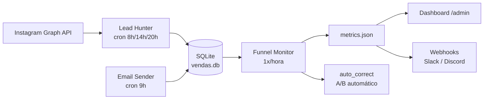

# MANUAL COMPLETO — FÁBRICA AGÊNTICA DE PUBLICAÇÕES

**Criação de Materiais | Criação de Máquina de Vendas**

> Manual do usuário — tudo o que é possível criar e fazer com o projeto
> `fabrica-de-livros`, explicado passo a passo.
>
> **Autor:** Heverton Eduardo Peres — Especialista em Marketing e Desenvolvimento de Soluções
> **Versão do projeto:** V5 (coleção) / V5.1 (nomes curtos e layout por obra) / V5.2 (relatório de sessão)
> **Atualizado em:** 2026-08-09

---

# PARTE 1 — CRIAÇÃO DOS MATERIAIS

## 1. O que é a Fábrica

A **Fábrica Agêntica de Publicações** é um sistema orquestrado por agentes de IA que
produz, de forma **autônoma e determinística**, uma família completa de materiais de
publicação a partir de um único tema:

- **Livros técnicos** (ABNT, 16+ capítulos, 70+ páginas)
- **TCCs e monografias** (NBR 14724)
- **Artigos científicos** (NBR 6022)
- **E-books** (tom comercial leve)
- **Playbooks práticos** (cards de bancada)
- **Lead magnets** (6 formatos de isca digital)
- **Slide decks** (HTML navegável + PDF 16:9)
- **Sequências de e-mails** (nutrição e oferta)
- **Coleções** (manifesto de todos os derivados de um mesmo núcleo)
- **Mega-livros** (unificação de vários livros)
- **Máquinas de vendas** (projeto full-stack deployável: Next.js + FastAPI + SQLite)

A regra central é a **REGRA 3 — Autonomia**: depois que o tema e os parâmetros são
definidos na Fase 0 (a única rodada de perguntas), a esteira roda 100% autônoma até a
entrega final. A **REGRA 2** manda silêncio nos artefatos: markdown limpo, sem
preâmbulos nem saudações. A **REGRA 1** exige PT-BR estrito.

### O que o projeto entrega de concreto

| Entregável | Onde fica | Como é produzido |
|---|---|---|
| Livro/TCC | `output/<obra>/livros/` | Fases 1-3 (geração por LLM) |
| Artigos | `output/<obra>/artigos/` | Compressão do dossiê (RAG) |
| E-books | `output/<obra>/ebooks/` | Reescrita de tom (compressão) |
| Playbook | `output/<obra>/playbooks/` | Extração determinística (0 token) |
| Lead magnets | `output/<obra>/lead-magnets/` | Agregação dos cards (0 token) |
| Deck | `output/<obra>/decks/` | Montagem a partir de sumário+diagramas (0 token) |
| E-mails | `output/<obra>/emails/` | Esqueleto + polimento de copy |
| Coleção | `output/<obra>/colecoes/<nome>.json` | Manifesto derivado (`colecao.py`) |
| Pacote distribuível | `output/<obra>/distribuicao/` | `empacotar-colecao.py` |
| Máquina de vendas | `output/<slug-colecao>/maquina/` (1 por coleção) | `criar-maquina-vendas.py` |

## 2. Conceitos fundamentais

### 2.1 Obra

Uma **obra** é um projeto de publicação com um núcleo canônico: um dossiê de pesquisa
(`pesquisa/`), um `sumario_macro.json` (arquitetura da obra) e um `motivo_condutor`
(persona, vocabulário e narrativa). Tudo o que deriva da obra compartilha esse núcleo.

O slug da obra é sempre **kebab-case**. Exemplo: `ia-agentica-desbloqueada`.

### 2.2 Núcleo canônico

Conjunto imutável que dá identidade à coleção:

- `dossiê` — pesquisa indexada (RAG) sobre o tema
- `sumario_macro` — arquitetura (partes, capítulos, marcos)
- `motivo_condutor` — `nome`, `descricao`, `vocabulario`, `persona_leitor`

### 2.3 Coleção

**COLEÇÃO** = todos os artefatos derivados de um mesmo núcleo canônico,
compartilhando identidade visual, vocabulário condutor, badge de nível e CTA.

A chave da coleção (`serie_key`) resolve nesta ordem:
`config_obra.serie` → `config_obra.livro_mae` → nome-base do slug.

O manifesto da coleção é **derivado** — nunca editado à mão. Ele é regenerado por:

```bash
python scripts/colecao.py --sincronizar
python scripts/colecao.py --sincronizar --slug livros/<slug>
```

### 2.4 Registro declarativo de tipos (`scripts/tipos_obra.py`)

Cada tipo de obra é uma **entrada no registro** `tipos_obra.py`. Os 6 pontos de
dispatch da fábrica (`parametros_obra`, `fatiar-obra`, `auditar-obra`, `gerar-capa`,
`metadados_livro`, `compilar-para-pdf`) consultam esse registro — para adicionar um
tipo novo, basta 1 entrada. Para ver a matriz de derivação:

```bash
python scripts/tipos_obra.py --matriz
```

**Regra de derivação:** cascateie onde **comprime** (artigo, ebook, playbook, lead
magnet), faça fan-out onde **expande** (livro a partir de TCC, por exemplo).

### 2.5 Motores de saída (PDF)

- **Pandoc → Typst** é o motor padrão (`pdf_typst.py` / `compilar-para-pdf.py`).
- Exceções onde o design vem de CSS (HTML+CSS → Chromium):
  - **Lead magnet** (`gerar-lead-magnet-pdf.py`)
  - **Deck** (`gerar-deck-html.py` — o HTML é o entregável)

> **Nunca** use `pandoc --pdf-engine=typst` com figuras (bug de path absoluto no
> Windows). Gere o `.typ` na pasta do material e chame `typst compile --root`.

### 2.6 Nomenclatura curta (V5.1)

Nomes curtos para materiais derivados: `<pfx>-<seq>-<nome>` (ex.: `lm-1-armadilhas`,
`pbk-1-ia-agentica-desbloqueada`). Caminhos caíram de ~197 para ~150 caracteres
(MAX_PATH do Windows é 260). Prefixos: `lm` (lead magnet), `pbk` (playbook),
`dck` (deck), `eml` (e-mails), `eb` (ebook), `art` (artigo).

## 3. Estrutura do output (série-aware)

O layout **série-aware** (decisão V5.1+) organiza tudo por **obra** no topo de
`output/` — sem junctions, sem pastas estruturais soltas:

```text
output/
├── series.json                    # cores das coleções (nome legado; persistidas)
├── <obra-1>/                      # obra única (single-book) ou série
│   ├── livros/                    #   livro principal (config_obra.json, capitulos/, sumario_macro.json)
│   ├── artigos/                   #   artigos derivados
│   ├── ebooks/                    #   e-books derivados
│   ├── playbooks/                 #   playbooks derivados
│   ├── lead-magnets/              #   lead magnets (lm-1-armadilhas …)
│   ├── decks/                     #   decks (dck-1-…)
│   ├── emails/                    #   sequências (eml-1-…)
│   ├── colecoes/                  #   manifestos de coleção (<nome>.json)
│   └── distribuicao/              #   pacotes empacotados (empacotar-colecao.py)
├── <obra-2>/                      # série multi-book: livros/ tem um dir por livro
│   ├── livros/<livro-1>/ …        #   cada livro com seu config_obra.json
│   ├── lead-magnets/lm-1-…        #   derivados referenciam o livro pelo prefixo
│   └── …
```

- **Single-book:** `output/<obra>/livros/` contém o livro (config direto na raiz do tipo).
- **Multi-book (coleção):** `output/<obra>/livros/<livro>/` — um diretório por livro.
- Os scripts resolvem qualquer material via `tipos_obra.dir_obra(slug)` — que aceita
  o layout plano antigo (`output/<tipo>/<slug>`), o por-obra
  (`output/<obra>/<tipo>/<slug>`) e o raiz single-book (`output/<obra>/<tipo>`).
- `series.json` guarda a cor de accent de cada coleção (usada em capas e templates).

> **Atenção:** as antigas junctions (`output/livros/`, `output/playbooks/`,
> `output/lead-magnets/`, …) foram **removidas**. Nada deve assumir o layout plano —
> sempre passe por `dir_obra()`.

## 4. Fluxo completo da esteira (Fases 0-4)

### Fase 0 — Esboço (`/esbocar <tema>`)

Único ponto de interação humana. O orquestrador pergunta:

1. **Tipo de obra:** Livro (recomendado) ou TCC
2. **Senioridade do público:** iniciante | intermediário (recomendado) | avançado | técnico
3. **Mínimo de referências por capítulo:** 5-20
4. **Gerar artigos científicos?** Sim/Não
5. **Tamanho (livro):** P (4 cap) | M (8 cap, recomendado) | G (12 cap) | GG (16 cap) | XG (20 cap)
6. **Gerar e-books?** Quantos (1-10)
7. **Quantos artigos?** 1-5
8. **Série/coleção?** Nome ou standalone
9. **(V5) Derivados de extração:** Playbook, Lead magnets, Slide deck, Sequência de e-mails
10. **CTA:** URL de destino rastreável (obrigatória para LM/deck/e-mails)

Grava `config_obra.json` e valida:

```bash
python scripts/parametros_obra.py <prefixo>/<slug> --validar
```

### Fase 1 — Pesquisa e Arquitetura

1. `subagente-pesquisador` varre a web e monta o dossiê em `pesquisa/`.
2. Indexa para RAG (economia severa de contexto):

```bash
python scripts/indexar-dossie.py <slug> --indexar
```

3. `arquiteto` gera `sumario_macro.json` com o mínimo contratual (16+ capítulos para
   livro; 1 "parte" com seções ACAD para TCC).
4. Se solicitado: `fatiar-obra.py --artigos --qtd N` e `--ebooks --qtd N` criam os
   recortes temáticos e registram em `derivados.json`.

### Fase 2 — Manufatura em lotes controlados

Lotes de **4 capítulos** em paralelo (evita throttling TPM/RPM e estouro de contexto):

```bash
python scripts/pool-capitulos.py <slug> --plano --lote 4
python scripts/pool-capitulos.py <slug> --proximo-lote --lote 4
python scripts/pool-capitulos.py <slug> --pendentes --lote 4   # drenagem com backoff
```

Cada capítulo segue o framework **EITA-V2** (7 seções): Introdução, Explica, Ilustra,
Técnica, Aplica, Conclusão, Referências. TCC usa o framework **ACAD** (Contextualização,
Referencial Teórico, Análise, Síntese Parcial).

### Fase 2.5 — Revisão técnica autônoma (peer review)

```bash
python scripts/auditar-obra.py <slug>
python scripts/validar-codigo.py <slug>
python scripts/renderizar-diagramas.py <slug> --capitulos --validar
```

A skill `revisor-tecnico` corrige o que os relatórios apontarem (seções faltantes,
referências insuficientes, `---` proibidos, citações órfãs, diagramas inválidos,
código com erro de sintaxe, truncamento, sobreposição entre capítulos, grafia
inconsistente). Reaudite até `--estrito` retornar 0 (máx. 3 rodadas).

### Fase 3 — Compilação e PDF

```bash
# Ilustrações 2D flat (gratuito, HTML/CSS + Playwright)
python scripts/gerar-ilustracoes.py <slug>

# Capa gráfica A4 (obrigatória — o template Typst embute imagens/capa.png)
python scripts/gerar-capa.py <slug> --tipo livro

# PDF (renderiza diagramas Mermaid, monta capa + ficha catalográfica)
python compilar-para-pdf.py <slug> --paginas-exatas
```

> Alternativa PowerShell: `powershell -ExecutionPolicy Bypass -File scripts/converter-md-pdf.ps1 -Slug <slug>`

### Fase 4 — Coleção e entrega (V5)

```bash
# Playbook PRIMEIRO (os cards alimentam lead magnets e e-mails)
python scripts/colecao.py --sincronizar --slug <prefixo>/<slug>
python scripts/validar-artefatos.py --todos --estrito
python scripts/empacotar-colecao.py "<coleção>"
```

**Ordem obrigatória dos derivados:** playbook → lead magnets → deck/e-mails (os três
independentes entre si rodam em paralelo).

## 5. Tipos de obra (10 formas de gerar)

| Tipo | Natureza | Custo LLM | Comando | Produtor |
|---|---|---|---|---|
| Livro | geração | alto | `/criar-livro` | `redator-eita` |
| TCC | geração | alto | `/criar-tcc` | `redator-academico` |
| Artigo | compressão | baixo | `/criar-artigo` | `redator-academico` |
| E-book | compressão | baixo | `/criar-ebook` | `redator-ebook` |
| Playbook | extração | **zero** | `/criar-playbook` | `extrair-passos-praticos.py` |
| Lead Magnet | extração | **zero** | `/criar-lead-magnet` | `gerar-lead-magnet.py` |
| Deck | extração | **zero** | `/criar-deck` | `gerar-deck.py` + `gerar-deck-html.py` |
| E-mails | extração | baixo | `/criar-emails` | `gerar-sequencia-emails.py` |
| Coleção | manifesto | zero | `/colecao` | `colecao.py` |
| Mega-livro | unificação | baixo | `/compilar-mega-livro` | skill `compilador-mega-livro` |

### 5.1 Livro (`/criar-livro`)

Requisitos contratuais **não negociáveis** (R1-R14):

| # | Requisito | Especificação |
|---|---|---|
| R1 | 16+ capítulos | mínimo no sumário macro |
| R2 | 70+ páginas | ~175.000 caracteres em `livro_final.md` |
| R3 | 7 seções/capítulo | estrutura EITA-V2 |
| R4 | 3+ refs/capítulo | ABNT, citadas como `[N]` |
| R5 | 3+ papers/dossiê | arXiv, ACM, IEEE |
| R6 | Formatação ABNT | capa gráfica, folha de rosto, CIP, sumário, referências |
| R7 | PDF final | Pandoc → .typ → Typst |
| R8 | Tom transformacional | simples p/ iniciante, denso p/ PhD |
| R9 | Sem `---` | horizontal rules proibidos nos capítulos |
| R10 | 3+ citações inline | `[N]` por capítulo |
| R11 | 1+ diagrama/capítulo | bloco ```mermaid válido na seção Ilustra |
| R12 | Código validado | 1+ bloco na seção Técnica, aprovado no CI de sintaxe |
| R13 | Sem truncamento | sem TODO/placeholder/capítulo cortado |
| R14 | Rastreabilidade | todo `[N]` do corpo existe na seção 7 |

O compilador (`compilador-abnt`) insere automaticamente o capítulo fixo EITA
(`templates/capitulo_eita.md`) antes do primeiro capítulo.

### 5.2 TCC (`/criar-tcc`)

- Estrutura ACAD: Introdução → N×Referencial Teórico/Desenvolvimento → Considerações Finais.
- Template ABNT próprio (`templates/template_tcc.typ`, NBR 14724).
- Gera `tcc_metadados.json` (resumo, palavras-chave, abstract, keywords, instituição,
  curso, orientador, local, ano).
- Validação: `python scripts/validar-abnt-tcc.py <slug> --estrito`.
- Compila com `python compilar-para-pdf.py <slug> --sem-capa` (capa ABNT sóbria).

### 5.3 Artigo (`/criar-artigo`)

- Compressão do dossiê (RAG) — não refaz pesquisa.
- Recortes temáticos criados por `fatiar-obra.py --artigos --qtd N`.
- Seções IMRaD; template `templates/template_artigo.typ` (NBR 6022).
- Compilador: `compilador-artigo` (merge das 4 seções + resumo NBR 6028 + referências NBR 6023).

### 5.4 E-book (`/criar-ebook`)

- Reescrita de **tom** dos capítulos do livro-mãe (comercial-leve: parágrafos curtos,
  mais subtítulos, sem exigência de citação numerada).
- Não pesquisa nem gera conteúdo novo.
- Saída: `.epub` + `.pdf` + capa/thumbnail.

### 5.5 Playbook (`/criar-playbook`)

- Extração determinística das §4 Técnica + §5 Aplica dos capítulos (**custo 0 token**).
- Pré-condição: capítulos existem e a obra passou na Fase 2.5.
- Esqueleto: `python scripts/fatiar-obra.py <slug> --playbook`.
- Extração: `python scripts/extrair-passos-praticos.py <slug> --relatorio`.
- Polimento por LLM **somente nas lacunas** apontadas pelo relatório (proibido copiar
  prosa das §1, §2, §3, §7 — R-PBK-0).
- Gate: `python scripts/validar-playbook.py playbooks/<slug>--pbk --estrito`.

### 5.6 Lead Magnet (`/criar-lead-magnet`)

6 formatos — cada um é uma **agregação pura** de um campo dos cards do playbook
(sem prosa inventada):

| Formato | Agrega | Mínimo de itens (R-LM-7) |
|---|---|---|
| `armadilhas` | campo `armadilhas` dos cards | 6 |
| `cheatsheet` | comandos/atalhos da §4 Técnica | 6 |
| `checklist` | campo `feito_quando` (passos) | 6 |
| `entregas` | campo `entregas` | 6 |
| `mapa` | estágios do `sumario_macro` | 3 |
| `mini-guia` | §2 Explica do capítulo indicado (único com polimento, máx. 180 palavras) | 1 |

Fluxo:

```bash
python scripts/gerar-lead-magnet.py <slug> --todos --cta-url <url> --cta-texto "<texto>"
python scripts/gerar-lead-magnet-pdf.py --todos          # PDF (motor Chromium, não Typst)
python scripts/gerar-capa.py lead-magnets/<slug-lm> --tipo lead-magnet --social
python scripts/validar-lead-magnet.py --todos --estrito   # gate DEPOIS do PDF
```

**CTA é obrigatório (R-LM-1)** com UTM. O placeholder `https://pay.hotmart.com/XXXXX`
passa mecanicamente no gate, mas deve ser trocado pelo link real antes de publicar.

### 5.7 Deck (`/criar-deck`)

- Montagem a partir de sumário + diagramas renderizados + cards do playbook (0 token).
- Estrutura: capa → objetivo → mapa dos estágios → divisor por Parte → 1 slide por
  capítulo → CTA.
- Dois entregáveis do MESMO HTML: `.html` (navegável, tecla `F` = tela cheia) e
  `.pdf` 16:9. PPTX editável é opcional (`gerar-pptx.py`, fora do pacote).
- Gate: `python scripts/validar-deck.py decks/<codigo>/dck-1-<nome> --estrito`.
- **Não edite o `deck.md` à mão** — ele é derivado; corrija o `sumario_macro.json`.

### 5.8 E-mails (`/criar-emails`)

- Sequência de nutrição: 1 e-mail por card do playbook + abertura + oferta.
- Restrições: máx. 250 palavras/e-mail (R-EM-4), exatamente 1 link (R-EM-2),
  assunto ≤ 60 caracteres (R-EM-1), segunda pessoa.
- Gate: `python scripts/validar-emails.py emails/<slug>--eml --estrito`.

### 5.9 Coleção (`/colecao`)

```bash
python scripts/colecao.py --sincronizar            # regenera o manifesto
python scripts/colecao.py --listar                 # lista coleções
python scripts/colecao.py "<nome>" --status        # estado por membro
python scripts/colecao.py "<nome>" --json          # manifesto bruto
```

O status mostra por membro: tipo, estado (`vazio` → `planejado` → `redigido` /
`extraido` → `compilado`), custo de LLM do tipo e título. Também aponta
`derivados_ausentes` (o que ainda dá para gerar a custo quase zero) e
`membros_sem_cta` (o que vai reprovar no gate).

### 5.10 Mega-livro (`/compilar-mega-livro`)

Unifica vários livros em um único volume:

```bash
/compilar-mega-livro slug1 slug2 slug3
/compilar-mega-livro --todas
```

A skill `compilador-mega-livro` limpa/cria a pasta, coleta capa do primeiro livro,
unifica sumários, renumera capítulos sequencialmente, gera prefácio + sumário +
conclusão e compila o PDF via Pandoc+Typst (ABNT).

## 6. Comandos slash (13)

Todos vivem em `.claude/commands/`:

| Comando | O que faz |
|---|---|
| `/esbocar <tema>` | Fase 0: elicitação + pesquisa + arquitetura + fatiamento |
| `/criar-livro <slug>` | Produz o livro completo (R1-R14) |
| `/criar-tcc <slug>` | Produz TCC conforme NBR 14724 |
| `/criar-artigo <slug>` | Produz os artigos do livro-mãe |
| `/criar-ebook <slug>` | Produz os e-books (reescrita de tom) |
| `/criar-playbook <slug>` | Extrai o playbook (0 token) |
| `/criar-lead-magnet <slug> [--formato X \| --todos]` | Gera os lead magnets |
| `/criar-deck <slug>` | Gera o slide deck HTML+PDF |
| `/criar-emails <slug>` | Gera a sequência de e-mails |
| `/criar-maquina <slug> [--tipo completo\|parcial\|landing\|backend]` | Gera a máquina de vendas |
| `/colecao [<nome>] [--sincronizar]` | Manifesto da coleção |
| `/compilar-mega-livro <slugs...> \| --todas` | Mega-livro unificado |
| `/produzir-obra-completa <tema\|slug>` | Tudo encadeado/paralelo de uma vez |

**Recomendação:** use `/produzir-obra-completa` quando quiser tudo (livro + artigos +
ebooks + playbook + lead magnets + deck + e-mails) — ele encadeia as fases
respeitando as dependências (playbook antes dos LMs) e paraleliza o independente.

## 7. Scripts determinísticos (49)

Tudo em `scripts/` (lista completa em `ls scripts/`). Os principais:

### 7.1 Núcleo e registro

| Script | Função |
|---|---|
| `tipos_obra.py` | **Registro declarativo** de tipos; `dir_obra()`, `slug_curto()`, `listar_materiais()`, matriz de derivação |
| `parametros_obra.py` | Valida `config_obra.json` (faixas de tamanho, refs, senioridade) |
| `nomes_curtos.py` | Nomenclatura V5.1 (codigo_obra, nome_material, MAX_PATH) |
| `secoes_eita.py` | Parser canônico do framework EITA |
| `metadados_livro.py` | Metadados da obra, capa, CIP e argumentos do Pandoc |

### 7.2 Geração

| Script | Função |
|---|---|
| `indexar-dossie.py` | Indexa o dossiê para RAG |
| `pool-capitulos.py` | Plano/lotes/estado da manufatura de capítulos |
| `fatiar-obra.py` | Fatia a obra em artigos, e-books e playbook (esqueleto) |
| `extrair-passos-praticos.py` | Extrai os cards do playbook (0 token) |
| `gerar-lead-magnet.py` | Gera os 6 formatos de lead magnet (0 token) |
| `gerar-deck.py` | Monta o deck a partir de sumário+diagramas |
| `gerar-deck-html.py` | Gera HTML navegável + PDF 16:9 |
| `gerar-pptx.py` | PPTX editável (opcional) |
| `gerar-sequencia-emails.py` | Esqueleto + cronograma da sequência |
| `gerar-capa.py` | Capa gráfica 2D flat (HTML/CSS + Playwright) |
| `series_capa.py` | Cor de accent por coleção (persistida em `output/series.json`) |
| `gerar-ilustracoes.py` | Ilustrações 2D flat por capítulo |
| `renderizar-diagramas.py` | Renderiza blocos Mermaid em PNG |
| `formatar-referencias.py` | Formata referências ABNT |
| `gerar-epub.py` | Gera EPUB a partir de `livro_final.md` |
| `pdf_typst.py` | Motor Pandoc → .typ → Typst |
| `compilar-para-pdf.py` | Compilador principal (rota por tipo via registro) |
| `gerar-lead-magnet-pdf.py` | PDF do lead magnet (motor Chromium) |
| `revisar-e-polir-capitulos.py` | Revisão/polimento em lote |
| `criar-maquina-vendas.py` | Gera a máquina de vendas (7 passos, 1:1 por coleção) |

### 7.3 Validação (gates)

| Script | Gate |
|---|---|
| `auditar-obra.py` | Auditoria da obra inteira (--estrito) |
| `validar-codigo.py` | CI de sintaxe dos blocos de código |
| `validar-playbook.py` | R-PBK-0..8 |
| `validar-lead-magnet.py` | R-LM-1..8 (--todos --estrito) |
| `validar-deck.py` | R-DK-* |
| `validar-emails.py` | R-EM-* |
| `validar-abnt-tcc.py` | Elementos pré-textuais NBR 14724 |
| `validar-capa-texto.py` | Quebra de linha de título/subtítulo da capa |
| `validar-capa-nivel.py` | Badge de nível obrigatório |
| `validar-artefatos.py` | **Entrega:** arquivos abrem, assinatura, MAX_PATH |

### 7.4 Processamento e infraestrutura

| Script | Função |
|---|---|
| `colecao.py` | Manifesto da coleção (sincronizar/listar/status) |
| `empacotar-colecao.py` | Pacote final da coleção (só o que abre) |
| `empacotar-distribuicao.py` | Pacote da obra (livro+artigos+ebooks) |
| `sincronizar-capas-distribuicao.py` | Copia capas para a distribuição |
| `converter-md-pdf.ps1` | Conversor PowerShell Pandoc+Typst |
| `setup-links.ps1` / `.sh` | Recria junctions/hardlinks multi-IDE |
| `sync-vscode-mcp.mjs` | Sincroniza MCP do VS Code |
| `gerar-relatorio-sessao.py` | Relatório MD+PDF da sessão (V5.2) |
| `compensar-volume-mimocode.py`, `qualidade-mimocode.py`, `descobrir_modelos.py`, `renomear-headers-mimocode.py` | Utilitários de operação |

## 8. Skills (31)

Tudo em `.claude/skills/`. Principais grupos:

### 8.1 Squad editorial (criação de conteúdo)

`pesquisador` (F1) → `arquiteto` (F1) → `estrategista` (F2) → `redator-eita` /
`redator-academico` / `redator-ebook` (F2) → `revisor-tecnico` (F2.5) →
`compilador-abnt` / `compilador-tcc` / `compilador-artigo` (F3) → `compilador-mega-livro`

### 8.2 Token Economy

`lean-ctx` (grep antes de read), `headroom` (comprime logs >7 linhas),
`caveman` (fala telegráfica), `rtk-memory` (memória persistente),
`pre-flight-check` (type-check/testes/build antes de deploy),
`calcular-gastos-sessao` (custo por ação/sessão), `gerar-relatorio-sessao` (fecha a
sessão: relatório → testes → commit → push), `aplicar-token-economy` (instala a
infra completa), `sincronizar-maquina-vendas` (propaga o fix do checkout).

### 8.3 Fable (metodologia pensar/agir/provar)

`fable-method` (loop problema→evidência→verificação), `fable-loop` (orquestração com
subagentes paralelos), `fable-judge` (verificação adversarial de "feito"),
`fable-domain` (gera skill de domínio), `self-learning` (captura golden path como skill).

### 8.4 Outras

`i-have-adhd`, `debug-issue`, `explore-codebase`, `refactor-safely`, `review-changes`.

## 9. Subagentes (7)

Tudo em `.claude/agents/`:

| Agente | Função |
|---|---|
| `subagente-pesquisador` | Pesquisa e dossiê (F1) |
| `subagente-redator-capitulo` | Redige capítulos EITA (lotes de 4) |
| `subagente-redator-secao-tcc` | Redige seções ACAD |
| `subagente-redator-artigo` | Redige artigos IMRaD |
| `subagente-adaptador-ebook` | Reescreve tom para e-book |
| `subagente-revisor-tecnico` | Peer review (F2.5) |
| `subagente-ilustrador` | Ilustrações e capa (Modo Capa) |

## 10. Templates (13)

Tudo em `templates/`:

- `template.typ` — livro ABNT (capa gráfica via `capa_imagem`, CIP, contracapa)
- `template_tcc.typ` — TCC (NBR 14724)
- `template_artigo.typ` — artigo (NBR 6022)
- `template_playbook.typ` — cards de bancada
- `template_lead_magnet.html` / `.typ` — A4 + CTA no rodapé
- `template_deck.html` / `.typ` — 16:9 navegável + PDF
- `template_eita.md` — molde EITA-V2
- `capitulo_eita.md` — capítulo fixo de abertura (explica as 7 seções)
- `reference_deck.pptx` — referência visual do deck
- `payload_estado.json` — payload de estado
- `maquina/` — template completo da máquina de vendas (~83 arquivos)

## 11. Specs (9)

`SPEC.md` (livro), `SPEC_TCC.md`, `SPEC_ARTIGO.md`, `SPEC_EBOOK.md`,
`SPEC_PLAYBOOK.md`, `SPEC_LEAD_MAGNET.md`, `SPEC_DECK.md`, `SPEC_EMAILS.md` +
specs de infraestrutura. Cada spec é o contrato do tipo — leia antes de gerar.

## 12. Economia de tokens (Token Economy)

Regras de ouro do projeto:

1. **Caveman ativo** — pensamento telegráfico (3-5 linhas), sem preâmbulos.
2. **Headroom & RTK** — logs/builds >7 linhas → comprimir (3 topo + 4 fim).
   EXCEÇÃO: conteúdo em `output/**` e dados de obra NUNCA são comprimidos.
3. **LeanCTX** — `grep` antes de `read`; ler por linhas; assinaturas antes de corpos.
4. **Delegação Cavecrew** — subagentes comprimidos para buscas/edições extensas.
5. **Pandoc+Typst ISENTO** — compilação PDF é liberada e obrigatória.
6. **Soberania do usuário** — nada é barrado sem confirmação explícita.
7. **Fidelidade de conteúdo** — `output/**`, JSONs de estado e verificações de
   auditoria são isentos de compressão (leitura sempre integral).
8. **UTF-8 no Windows** — todo script Python com `print`/emojis DEVE usar
   `sys.stdout.reconfigure(encoding="utf-8")`.
9. **Personalizar, não só gerar** — a máquina nasce com copy genérica; o fluxo
   `/criar-maquina` exige personalização por nicho com gate.

## 13. Roteamento de LLMs

A fábrica é **agnóstica de modelo**: `model: inherit` em todos os agents (REGRA 6).
O roteamento por tarefa é configurável e a detecção do harness é automática. A
máquina de vendas traz seu próprio `config/roteamento_modelos.json` com temperatura e
`max_tokens` por tarefa (gerar e-mail, post, DM, análise de lead).

## 14. Verificação de entrega

**Gerar o arquivo não prova que ele abre.** Antes de declarar entrega:

```bash
python scripts/validar-artefatos.py --todos --estrito
python scripts/empacotar-colecao.py "<coleção>"
```

O pacote leva **só o que está finalizado e abre**, com `LICENCA.txt` e `LEIA-ME.md`
que declara o que ficou de fora e por quê.

## 15. Relatório de sessão (V5.2)

Toda sessão de trabalho termina com relatório em `relatorios/` (raiz do projeto):

```text
relatorios/<AAAA-MM-DD>-<tema-da-sessao>.md
relatorios/<AAAA-MM-DD>-<tema-da-sessao>.pdf
```

Conteúdo mínimo: contexto, bugs descobertos/corrigidos (causa→fix), arquivos
alterados, validações rodadas, commits feitos, resumo de entregas. Orquestrado pela
skill `gerar-relatorio-sessao` (relatório → testes → commit → push).

## 16. Troubleshooting — materiais

| Sintoma | Causa provável | Fix |
|---|---|---|
| `R-LM-7` reprova (0 itens) | livro-mãe sem comandos/paths na §4 Técnica | refazer cards; NÃO fabricar conteúdo |
| `R-LM-3` acima do teto | PDF passou do teto de páginas | `--max-itens` reduz a agregação |
| `R-DK-2` bullet longo | `pilares_previstos` longo no sumário | encurtar no `sumario_macro.json` e regerar |
| Gate rodado antes do PDF | R-LM-3/R-LM-8 medem o PDF | rodar o gate DEPOIS de compilar |
| Capa reprova `validar-capa-texto` | título/subtítulo com quebra inválida | encurtar em `sumario_macro.json` (máx. 3 tentativas) |
| `pandoc --pdf-engine=typst` falha com figuras | path absoluto Windows | gerar `.typ` na pasta e `typst compile --root` |
| Script não encontra obra | layout flat assumido | usar `tipos_obra.dir_obra(slug)` |
| Emojis quebrados no Windows | console cp1252 | `sys.stdout.reconfigure(encoding="utf-8")` |
| PDF não abre | assinatura/integridade | `validar-artefatos.py` aponta o arquivo |

---

# PARTE 2 — CRIAÇÃO DA MÁQUINA DE VENDAS

## 17. O que é a Máquina de Vendas

A **Máquina de Vendas** é um sistema completo de **venda digital autônoma**: captura
de leads no Instagram, nutrição por e-mail, página de vendas com checkout Hotmart,
monitoramento de funil e auto-correção de campanhas — tudo em um projeto full-stack
deployável gerado a partir de uma obra da Fábrica.

Ela é gerada pelo `/criar-maquina` e materializada em `output/<slug-colecao>/maquina/`
(**regra 1:1 — 1 máquina por COLEÇÃO**; o hub é o 1º segmento do slug que não
seja raiz de tipo). A máquina carrega o **snapshot das campanhas da coleção**
em `maquina/campanhas/` (textos, artes e cronogramas de divulgação):

| Camada | Tecnologia | O que faz |
|---|---|---|
| Frontend | **Next.js 14** (App Router, Tailwind) | Landing/captura, checkout, obrigado, admin (leads/metricas/emails) |
| Backend | **FastAPI** (`backend/app/`: routers, services, models) | API de leads, funil, e-mails, webhooks |
| Banco | **SQLite** (`backend/data/vendas.db` por default) | Leads, vendas, campanhas, interações |
| Automações | Python (cron/harness) | Lead Hunter, Email Sender, Funnel Monitor, auto_correct |
| Deploy | Docker Compose / Vercel+Railway / VPS | 3 caminhos documentados |

> **Escopo:** página + backend + automações prontos para subir. O que a máquina NÃO
> faz sozinha: publicar anúncios, criar o produto no Hotmart, e enviar e-mails em
> massa (rate limits rígidos por padrão).

## 18. Arquitetura da máquina



Fluxo do lead: **Instagram → Lead Hunter → SQLite** ← **Email Sender → SMTP**.
Funnel Monitor lê o banco, grava `metrics.json` e alimenta o dashboard e webhooks.

## 19. Como criar (/criar-maquina)

```bash
/criar-maquina <slug> [--tipo completo|parcial|landing|backend]
```

1. **Pré-condição:** a obra existe em `output/` (layout série-aware). O script usa
   `tipos_obra.dir_obra()` para localizar.
2. **7 passos internos** (`scripts/criar-maquina-vendas.py`):
   1. **Copiar o template** `templates/maquina/` para `output/<slug-colecao>/maquina/`
      (regra 1:1 — outra obra do mesmo hub recusa sem sobrescrever)
   2. Criar o manifesto da máquina (`manifesto.json` com `colecao`, `maquina_em`,
      `campanhas.snapshot`)
   3. Copiar conteúdo da obra (via manifesto da coleção)
   4. **Snapshot das campanhas** — `output/<slug-colecao>/campanhas/` →
      `maquina/campanhas/` com `snapshot.json` (origem, atualizado_em, materiais)
   5. Aplicar replacements `{{SLUG}}`, `{{TITULO}}`, `{{PRECO}}` (R$ 97),
      `{{PRECO_CORE}}` (97), `{{PRECO_TRIPWIRE}}` (37), `{{PRECO_OBRA_COMPLETA}}`
      (297), `{{AUTOR}}`, `{{EMAIL_CONTATO}}`, `{{DATA}}`, `{{ANO}}`
   6. Inicializar o banco (executa `database/schema.sql` + `seed.sql`); copiar
      `config/`, `.env.example` e gerar `.mcp.json` (db_state + file_writer)
   7. Resumo da máquina + instruções de deploy
3. **Personalização por nicho OBRIGATÓRIA** (Regra 12): o gate abaixo deve retornar vazio:

```bash
grep -rn 'Autor Digital\|centenas de pessoas' output/<slug-colecao>/maquina/ \
  --exclude-dir=node_modules --exclude-dir=.next --exclude='*.db'
```

4. **Teste o checkout** (rota `/api/checkout` nasce no template — confira que o lead
   chega em `/api/leads/`):

```bash
cd output/<slug-colecao>/maquina/frontend && npm run dev
# POST http://localhost:3000/api/checkout  {"nome": "...", "email": "..."}
```

5. **Deploy** — ver §28.

## 20. Estrutura gerada

```text
output/<slug-colecao>/maquina/
├── manifesto.json             # manifesto (ID, slug, obra-fonte, escada de valor)
├── README.md                  # arquitetura + deploy + operação
├── AGENTS.md                  # regras p/ agentes de IA
├── SPEC.md                    # contrato da máquina
├── docker-compose.yml         # frontend + backend + automações
├── vercel.json                # deploy Vercel (frontend)
├── .env.example               # todas as variáveis (ver §20.1)
├── .mcp.json                  # MCPs: db_state + file_writer (gerado)
├── config/
│   ├── produtos.json          # catálogo (preços, produto default)
│   ├── funis.json             # funis: steps, produto, desconto
│   ├── personas.json          # personas da comunicação
│   ├── canais.json            # Instagram: hashtags, horários, limites
│   ├── email.json             # SMTP, assinatura, listas, limites
│   ├── pagamento.json         # Hotmart (CLIENT_ID/SECRET, webhook)
│   ├── roteamento_modelos.json# temperatura/max_tokens por tarefa
│   └── subagentes.json        # subagentes de IA (copy, DM, análise)
├── database/
│   ├── schema.sql             # esquema das tabelas
│   ├── seed.sql               # dados iniciais (ex.: funis)
│   └── maquina.db             # banco criado na 1ª execução
├── backend/app/
│   ├── main.py                # FastAPI (monta routers)
│   ├── config.py              # config a partir do .env
│   ├── routers/               # leads.py, funil.py, emails.py, webhooks.py
│   ├── services/              # lead, email, metricas, scoring, auto_correct
│   ├── models/                # lead.py, venda.py, campanha.py, interacao.py
│   └── database/              # connection.py (sqlite3), migrations.py
├── frontend/                  # Next.js 14
│   ├── app/
│   │   ├── page.tsx           # página de venda (hero→dor→solução→preço→CTA)
│   │   ├── captura/page.tsx   # landing de captura (capítulo gratuito)
│   │   ├── checkout/page.tsx  # cliente: nome/e-mail → POST /api/checkout
│   │   ├── obrigado/page.tsx  # pós-compra
│   │   └── admin/             # dashboard + leads + metricas + emails
│   ├── app/api/
│   │   ├── lead/route.ts      # cria lead (validação zod)
│   │   ├── checkout/route.ts  # cria lead + processa pedido
│   │   ├── webhook/route.ts   # webhook genérico (Hotmart/SendGrid)
│   │   └── health/route.ts    # status
│   ├── components/            # Hero, LeadForm, ValueStack, Testimonials,
│   │                          # PricingCard, Guarantee, MetricsChart
│   ├── lib/                   # api.ts (cliente do backend), analytics.ts
│   └── package.json
├── scripts/
│   ├── lead_hunter.py         # captura leads no Instagram
│   ├── email_sender.py        # envia e-mails da sequência
│   ├── funnel_monitor.py      # gera metrics.json + webhooks
│   ├── auto_correct.py        # A/B e ajuste de campanha
│   └── deploy.sh              # docker/full/vps/backup/status/rollback
├── conteudo/                  # cópia da obra e derivados (md/pdf/epub)
└── frontend/public/artes/     # capas e artes copiadas da obra
```

### 20.1 Variáveis de ambiente (.env.example)

`APP_ENV`, `APP_SECRET_KEY`, `SITE_URL`, `LOG_LEVEL`, `BACKEND_URL`,
`NEXT_PUBLIC_BACKEND_URL`, `DATABASE_PATH` (default `./database/leads.db`),
`INSTAGRAM_ACCESS_TOKEN`/`APP_ID`/`APP_SECRET`, `SMTP_HOST`/`PORT`/`USER`/
`PASSWORD`, `FROM_EMAIL`, `FROM_NAME`, `TRACKING_DOMAIN`,
`HOTMART_WEBHOOK_SECRET`/`CLIENT_ID`/`CLIENT_SECRET`, `OPENAI_API_KEY`/
`OPENAI_MODEL` (`gpt-4o-mini`), `VPS_HOST`/`USER`/`PATH` (default
`/opt/maquina-vendas`), `VERCEL_TOKEN`/`ORG_ID`/`PROJECT_ID`,
`SLACK_WEBHOOK_URL`, `DISCORD_WEBHOOK_URL`, `MAX_EMAILS_PER_HOUR=30`,
`MAX_EMAILS_PER_DAY=200`, `MAX_LEADS_PER_DAY=100`.

> **Regra de ouro:** `.env` NUNCA é versionado. Copie `.env.example` → `.env` e
> preencha com valores reais de produção.

## 21. Configs JSON da máquina

| Arquivo | Campos-chave | O que controla |
|---|---|---|
| `canais.json` | Instagram: `hashtags`, `localizacoes`, `max_leads_dia` (100), `delay` (1.5s), janela 08:00-22:00 America/Sao_Paulo | volume e direcionamento da captura |
| `email.json` | SMTP gmail 587, `rate_limit` 30/h e 200/dia, `delay` 2s, `assinatura`, `listas` | envio de nutrição |
| `funis.json` | ex.: `"nutricao-livro"` → produto `livro-autor-digital` R$ 47, desconto `LANCTO30`/30%, `steps` | sequência e oferta por funil |
| `produtos.json` | catálogo com preços e **produto default** | alinhamento com o checkout |
| `personas.json` | personas da comunicação | tom da copy |
| `pagamento.json` | Hotmart: `CLIENT_ID`, `CLIENT_SECRET`, `WEBHOOK_SECRET` | checkout e confirmação |
| `roteamento_modelos.json` | temperatura/`max_tokens` por tarefa | custo e qualidade da IA |
| `subagentes.json` | agentes de IA (copy, DM, análise de lead) | automação de conteúdo |

> **Cuidado:** o produto default do checkout deve estar alinhado ao
> `config/produtos.json` (ex.: `dentista-gestor-livro`). Desalinhamento gera 404 no
> botão PAGAR.

## 22. Frontend (Next.js 14)

- **Landing (`/`)**: headline + form de captura → `POST /api/lead`.
- **Captura (`/captura`)**: página dedicada para campanhas (links de bio, tráfego pago).
- **Checkout (`/checkout`)**: componente **client** com nome/e-mail → `fetch` JSON →
  `POST /api/checkout` (não use `<form action>` vazio — quebra no `request.json()`).
- **Obrigado (`/obrigado`)**: confirmação com código do pedido.
- **Admin (`/admin`)**: dashboard com `metrics.json` (leads, conversões, receita).
- **APIs**: `/api/lead`, `/api/checkout`, `/api/webhook`, `/api/health` — rotas
  Next.js que chamam o backend FastAPI via `BACKEND_URL`.

## 23. Backend (FastAPI)

Estrutura em `backend/app/` — `main.py` monta os routers:

- `routers/leads.py` — `POST /api/leads/` cria lead (fonte, funil, status `novo`).
- `routers/funil.py` — métricas do funil e status dos leads.
- `routers/emails.py` — sequências e disparos (respeita rate limits).
- `routers/webhooks.py` — confirmação de pagamento (Hotmart) → lead `pago`.
- `services/` — `lead_service`, `email_service`, `metricas_service`,
  `scoring_service` (prioriza leads quentes), `auto_correct` (A/B).
- `models/` — `lead`, `venda`, `campanha`, `interacao`.

Banco: SQLite via `sqlite3` (`backend/app/database/connection.py`), schema em
`database/schema.sql` (+ `seed.sql`) executado na inicialização
(`backend/data/vendas.db` por default; `DATABASE_URL`/`DATABASE_PATH` do `.env`
sobrescreve).

## 24. Database (SQLite)

Tabelas principais: `leads` (email, nome, fonte, funil, status: novo → nutrido →
pago → cancelado), `vendas` (pedido, valor, status), `campanhas` (A/B),
`interacoes` (aberturas/cliques). Backup diário via cron (3h) com `deploy.sh backup`.

## 25. Automações (4 subagentes)

| Automação | Cron (default) | Função |
|---|---|---|
| **Lead Hunter** | 8h / 14h / 20h | busca leads por hashtags/localizações, respeita `max_leads_dia` e delay |
| **Email Sender** | 9h | envia a sequência do funil (máx. 30/h, 200/dia) |
| **Funnel Monitor** | 1x/hora | lê o banco, grava `metrics.json`, dispara webhooks Slack/Discord |
| **auto_correct** | diário | analisa métricas e propõe A/B (assunto, CTA, horário) |

No VPS, use `crontab -e` com o fuso `America/Sao_Paulo` (ou rode pelo
`docker-compose` com healthcheck).

## 26. Personalização por nicho (obrigatória)

A máquina nasce com copy genérica ("Autor Digital", "centenas de pessoas"). O fluxo
exige personalizar **8 pontos**:

1. `config/produtos.json` — produto real, preço, produto default
2. `config/funis.json` — oferta, desconto, steps do seu funil
3. `config/personas.json` — persona do seu nicho
4. `config/canais.json` — hashtags/localizações do nicho
5. `frontend/app/page.tsx` + `captura/page.tsx` — headline/copy do nicho
6. `templates/` (e-mails) — copy do nicho + CTA
7. `README.md` — instruções reais
8. `.env` — credenciais reais

Gate de saída (deve retornar **vazio**):

```bash
grep -rn 'Autor Digital\|centenas de pessoas' output/<slug-colecao>/maquina/ \
  --exclude-dir=node_modules --exclude-dir=.next --exclude='*.db'
```

## 27. Checkout e pagamentos

- **Fluxo:** `/checkout` (client) → nome/e-mail → `POST /api/checkout` → cria lead →
  gera link de pagamento (Hotmart) → redireciona para `pay.hotmart.com/...`.
- **Confirmação:** webhook do Hotmart (`/api/webhook`) marca o lead como `pago`.
- **Rota nasce no template** — máquinas antigas (geradas antes do fix) devem ser
  sincronizadas com a skill `sincronizar-maquina-vendas` (rota + page client +
  produto default + `BACKEND_URL` no `.env.example` + re-snapshot de campanhas).
- **Rastreio:** CTA/links usam UTM (`TRACKING_DOMAIN`).

## 28. Deploy em produção

### Opção A — Docker VPS (recomendada)

```bash
cd output/<slug-colecao>/maquina
./scripts/deploy.sh full          # build + up
./scripts/deploy.sh status        # saúde
./scripts/deploy.sh rollback      # volta versão anterior
```

### Opção B — Vercel + Railway

- Frontend → **Vercel** (`vercel.json` + `vercel deploy`).
- Backend + automações → Railway/Fly.io.
- `NEXT_PUBLIC_BACKEND_URL` aponta para o backend hospedado.

### Opção C — Nginx + PM2 (VPS tradicional)

- Build do Next.js + `pm2 start` no frontend; uvicorn no backend; Nginx como proxy
  reverso com SSL (Let's Encrypt).

### Checklist de deploy

- [ ] `.env` preenchido (BACKEND_URL, SMTP, Hotmart, Instagram, VPS)
- [ ] Produto default alinhado (`config/produtos.json`)
- [ ] CTA com URL real (não `pay.hotmart.com/XXXXX`)
- [ ] `npm run build` verde no frontend
- [ ] `POST /api/checkout` funciona local e em produção
- [ ] Crontab/cron das 4 automações no fuso America/Sao_Paulo
- [ ] Backup diário agendado

## 29. Operação 24/7

| Tarefa | Horário | Ferramenta |
|---|---|---|
| Lead Hunter | 8h / 14h / 20h | cron |
| Email Sender | 9h | cron |
| Funnel Monitor | 1x/hora | cron |
| Backup | 3h | `deploy.sh backup` |
| Review de métricas | diário | `/admin` + Slack/Discord |

Ritual diário: conferir `metrics.json`, leads novos vs. pagos, taxa de abertura de
e-mails, e o que o `auto_correct` sugeriu.

## 30. Monitoramento e escala

- **Métricas:** leads/dia, conversão em checkout, receita, abertura de e-mail.
- **Alertas:** Funnel Monitor → Slack/Discord quando métrica cai (ex.: 0 checkout em 24h).
- **Escala:** SQLite → PostgreSQL (troca a string `DATABASE_PATH`; SQLAlchemy já é o
  ORM). Rate limits sobem com o plano de SMTP. Instagram: mais hashtags/localizações
  e janelas maiores respeitando o delay anti-spam.

## 31. Troubleshooting — máquina

| Sintoma | Causa | Fix |
|---|---|---|
| 404 no botão PAGAR | rota `/api/checkout` ausente ou produto default errado | `sincronizar-maquina-vendas`; alinhar `config/produtos.json` |
| 500 no checkout | form urlencoded vazio (`request.json()` quebra) | page client com nome/e-mail + fetch JSON |
| `grep 'Autor Digital'` retorna | personalização não feita | personalizar os 8 pontos (Regra 12) |
| Leads de teste sujos | DB errado | limpar `backend/data/vendas.db` |
| E-mail não sai | rate limit 30/h ou 200/dia | conferir `email.json` e créditos SMTP |
| Instagram sem leads | token expirado / janela fechada | renovar token; janela 08:00-22:00 |

---

## 32. Glossário

| Termo | Significado |
|---|---|
| **Obra** | projeto de publicação com núcleo canônico (dossiê + sumário + motivo) |
| **Núcleo canônico** | dossiê + `sumario_macro.json` + `motivo_condutor` |
| **Coleção** | todos os derivados de um núcleo, com identidade e CTA compartilhados |
| **Série-aware** | layout `output/<obra>/<tipo>/...` sem junctions |
| **EITA-V2** | framework de capítulo: Introdução, Explica, Ilustra, Técnica, Aplica, Conclusão, Referências |
| **ACAD** | framework de TCC/artigo: Contextualização, Referencial Teórico, Análise, Síntese |
| **IMRaD** | estrutura de artigo: Introdução, Métodos, Resultados, Discussão |
| **Card** | unidade do playbook (armadilha, passo, feito_quando, comando, entrega) |
| **Gate** | validação determinística com código (R-LM-*, R-PBK-*, R-DK-*, R-EM-*) |
| **LM** | lead magnet (6 formatos) |
| **CTA** | chamada para ação com link rastreável (UTM) — obrigatório (R-LM-1) |
| **Badge de nível** | selo da capa (Iniciante/Intermediário/Avançado) — obrigatório |
| **Máquina de vendas** | sistema full-stack Next.js + FastAPI + SQLite para venda autônoma |
| **Token Economy** | conjunto de práticas para reduzir custo de contexto/LLM |
| **Junction** | atalho de diretório (removido no layout série-aware) |

