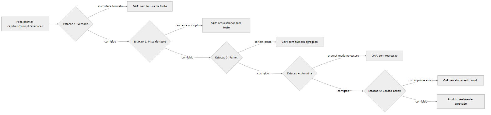

# Manual do Iniciante — Fechando os Gaps de Engenharia AIDD da Fábrica

## 1. Introdução

Depois de mapear como esta Fábrica já aplica o padrão builder/critic (ver
`docs/fluxogramas-gauntlet-loop.md`), uma análise crítica encontrou 5 pontos
onde a engenharia funciona mas ainda é rasa: ela confere **formato**, não
**verdade**; testa o **script**, não o **agente**; guarda **história em
prosa**, não **número**; muda **prompt sem rede de segurança**; e grita
"escalar para revisão manual" sem realmente escalar nada.

Este manual ensina, passo a passo e em linguagem simples, como fechar cada
um desses 5 gaps. Ao final você vai ser capaz de: (1) construir um crítico
que confere se uma afirmação é *verdadeira*, não só se tem um número entre
colchetes; (2) testar a lógica de retry/backoff do orquestrador sem gastar
um token de LLM; (3) instrumentar o pipeline pra saber onde ele realmente
quebra; (4) proteger prompts com uma suíte de regressão; e (5) transformar
um "print de aviso" em um alerta que ninguém consegue ignorar.

## 2. Explica

Todo gate desta Fábrica (`validar-*.py`) responde a uma pergunta objetiva
e sintática: *o texto tem a marca certa?* `validar-afirmacoes.py` confere
se existe um `[N]` no parágrafo depois de um dado factual — mas não lê a
fonte `[N]` pra saber se o dado está certo. Isso é **verificação
estrutural**: rápida, barata, determinística, e cega pro conteúdo real.

**Verificação semântica** é a pergunta seguinte, mais cara e mais
importante: *o que o texto afirma é verdade, dado o que a fonte realmente
diz?* Nenhuma regex resolve isso — precisa de um leitor (humano ou LLM)
comparando afirmação contra fonte. A skill `fable-judge` já documenta esse
princípio para qualquer entrega ("a report is a set of claims, not
evidence") e até prevê adaptar o julgamento por domínio — conteúdo/
marketing tem sua própria tabela de fraude, que inclui "fabricated
statistics" e "figures re-fetched" [1]. É exatamente esse mecanismo que
falta plugar dentro dos gates de capítulo.

O mesmo raciocínio vale para os outros 4 gaps: cada um deles é a distância
entre "o sistema roda e o teste passa" e "o sistema *sabe* onde e por que
falha, e reage a isso de forma verificável". Testar `validar-metricas.py`
prova que a regra de contagem está certa; não prova que `pool-capitulos.py`
trata corretamente um subagente que devolve JSON quebrado. Guardar um
parágrafo de causa-raiz no RTK Scratchpad prova que alguém entendeu o bug
uma vez; não prova que o próximo prompt não vai reintroduzir o mesmo erro.
"Escalar para revisão manual" impresso no console prova que o código sabe
que algo deu errado; não prova que um humano vai ver isso antes do PDF
sair errado pra produção.

## 3. Ilustra

Imagine uma linha de montagem de carros com 5 estações de controle de
qualidade, uma para cada gap. Hoje, 4 das 5 estações têm um inspetor
malandro: ele confere se o parafuso está no lugar (presença), mas não
aperta o parafuso pra ver se ele resiste (verdade). A quinta estação tem
um cordão de emergência pintado na parede — mas ele não está conectado a
nada. Quando alguém puxa, uma luz pisca no painel do próprio operário que
puxou, e mais ninguém no prédio percebe.

Essa última imagem é literal na indústria: chama-se **cordão Andon**, do
Sistema Toyota de Produção — quando um defeito se repete, o operário puxa
o cordão, a linha para, uma luz e um som alertam o supervisor, e ninguém
segue produzindo sobre o defeito [2]. É esse mecanismo — parar e alertar
de forma que **ninguém** consegue ignorar — que falta na Fábrica quando um
capítulo esgota tentativas.



Nas próximas 5 seções da Técnica, cada estação ganha o inspetor que faltava.

## 4. Técnica

### 4.1 Gap 1 — Verificação semântica (o crítico que confere fato, não formato)

**O que existe hoje:** `scripts/validar-afirmacoes.py` usa `RE_CITACAO =
re.compile(r"\[\d+(?:\s*,\s*\d+)*(?:\s*-\s*\d+)?\]")` pra confirmar que
existe uma citação no parágrafo. Isso prova presença, nunca correção.

**O que construir:** um novo gate, `scripts/validar-veracidade.py`, no
mesmo estilo dos demais `validar-*.py` (mesma convenção de `REGRAS`,
`argparse`, `--estrito`, `--json`, saída `[OK]`/`[FALHA]`):

```python
#!/usr/bin/env python3
"""
Gate R-VD-1 — a afirmacao citada bate com a fonte citada.

Uso:
    python scripts/validar-veracidade.py <slug> --capitulo 3 --amostra 5
"""
import argparse
import json
import re
from pathlib import Path

REGRAS = {"R-VD-1": "afirmacao com [N] deve ser sustentada pela fonte [N]"}
RE_PARAGRAFO_COM_CITACAO = re.compile(r"([^\n]+\[(\d+)\][^\n]*)")


def extrair_pares(texto_capitulo, referencias):
    """Retorna [(afirmacao, texto_da_fonte), ...] para julgar."""
    pares = []
    for match in RE_PARAGRAFO_COM_CITACAO.finditer(texto_capitulo):
        afirmacao, n = match.group(1), match.group(2)
        fonte = referencias.get(n)
        if fonte:
            pares.append((afirmacao.strip(), fonte))
    return pares


def julgar_par(afirmacao, fonte_texto):
    """Chama um subagente as CEGAS: só recebe a afirmacao + a fonte, nunca
    o processo de escrita do capitulo. Retorna 'sim' | 'nao' | 'parcial'."""
    prompt = (
        f"AFIRMACAO DO TEXTO: {afirmacao}\n\n"
        f"TRECHO DA FONTE CITADA: {fonte_texto}\n\n"
        "A afirmacao esta sustentada pela fonte? Responda so: sim, nao ou "
        "parcial. Se nao/parcial, cite a frase da fonte que contradiz."
    )
    return prompt  # despachado a um subagente critic, nunca ao redator
```

O ponto central: `julgar_par` nunca é chamado pelo mesmo agente que
escreveu o capítulo — é um subagente "crítico" novo, sem contexto da
redação, igual ao princípio que `revisor-tecnico` já aplica para o resto
do capítulo. Registre o gate em `scripts/tipos_obra.py`, dentro da tupla
`gates_conteudo` do tipo `livro` (`scripts/tipos_obra.py:91-97`), ao lado
de `validar-afirmacoes.py`.

**Controle de custo (importante):** julgar toda citação da obra custa 1
chamada de LLM por citação — caro. Use amostragem determinística (mesma
ideia que já existe em prosa no Fluxo Operacional, item 4: "conferência
por amostra: reabrir 1 fonte por capítulo"), com uma seed fixa por slug
pra ser reprodutível:

```python
import hashlib

def amostrar(pares, n, seed_slug):
    pares_ordenados = sorted(pares, key=lambda p: hashlib.sha1(
        (seed_slug + p[0]).encode()).hexdigest())
    return pares_ordenados[:n]
```

### 4.2 Gap 2 — Testar a orquestração, não só o script

**O problema:** os 662+ testes provavelmente cobrem bem `validar-*.py`
(determinístico, fácil de testar) e pouco a lógica de retry/backoff de
`scripts/pool-capitulos.py` — que decide o que fazer quando um subagente
falha.

**O código real que precisa de teste** (`scripts/pool-capitulos.py:128`):

```python
def backoff(tentativas):
    return min(BACKOFF_BASE_S * (2 ** max(0, tentativas - 1)), BACKOFF_MAX_S)
```

E a transição de estado em `pool-capitulos.py:255-263`: depois de
`MAX_TENTATIVAS` falhas registradas, o capítulo muda para `"esgotado"`.
Isso é **lógica do orquestrador**, não do LLM — e pode (e deve) ser
testada sem gastar um único token, simulando falhas:

```python
import pytest

def test_capitulo_esgota_apos_max_tentativas(tmp_path, monkeypatch):
    """Simula MAX_TENTATIVAS falhas seguidas e confere que o estado
    muda para 'esgotado' em vez de retentar para sempre."""
    import pool_capitulos as PC
    monkeypatch.setattr(PC, "DIR_OUTPUT", tmp_path)
    slug = "obra-teste"
    (tmp_path / slug).mkdir()

    for tentativa in range(1, PC.MAX_TENTATIVAS + 1):
        estado = PC.carregar_estado(slug)
        reg = estado["capitulos"].setdefault(
            "1", {"tentativas": 0, "ultimo_erro": "", "estado": "pendente"})
        reg["tentativas"] = tentativa
        reg["estado"] = "esgotado" if tentativa >= PC.MAX_TENTATIVAS else "pendente"
        PC.gravar_estado(slug, estado)

    estado_final = PC.carregar_estado(slug)
    assert estado_final["capitulos"]["1"]["estado"] == "esgotado"


def test_backoff_e_exponencial_e_tem_teto():
    import pool_capitulos as PC
    valores = [PC.backoff(t) for t in range(1, 6)]
    assert valores == sorted(valores)          # cresce
    assert valores[-1] <= PC.BACKOFF_MAX_S      # nunca passa do teto
```

**A ideia geral que fica pra qualquer projeto:** trate o subagente/LLM
como uma peça que pode devolver qualquer coisa (JSON quebrado, texto
vazio, timeout) e teste como o **orquestrador** reage — nunca teste "será
que o LLM escreveu bem", isso não é determinístico e não pertence a um
teste automatizado.

### 4.3 Gap 3 — Instrumentação quantitativa do pipeline

**O problema:** o RTK Scratchpad do `CLAUDE.md` é uma lista de postmortems
em prosa — ótimo pra entender *o que já aconteceu*, ruim pra responder
"qual gate reprova mais?" ou "quantos tokens custa 1 livro em média?".

**O que construir:** um logger append-only bem pequeno, chamado de dentro
de cada `validar-*.py` e de `pool-capitulos.py`:

```python
# scripts/telemetria.py
import json
from datetime import datetime
from pathlib import Path


def registrar(slug, dir_output, evento, gate=None, ok=None, tentativa=None,
              detalhe=""):
    caminho = Path(dir_output) / slug / "telemetria.jsonl"
    linha = {
        "ts": datetime.now().isoformat(timespec="seconds"),
        "evento": evento,       # "gate" | "retry" | "esgotado"
        "gate": gate,
        "ok": ok,
        "tentativa": tentativa,
        "detalhe": detalhe[:200],
    }
    with caminho.open("a", encoding="utf-8") as fh:
        fh.write(json.dumps(linha, ensure_ascii=False) + "\n")
```

E um agregador simples pra ler o histórico e responder as perguntas que
hoje só o scratchpad em prosa tenta responder:

```python
# scripts/relatorio-telemetria.py
import json
from collections import Counter
from pathlib import Path


def resumo(slug, dir_output):
    linhas = [json.loads(l) for l in
              (Path(dir_output) / slug / "telemetria.jsonl").read_text(
                  encoding="utf-8").splitlines()]
    falhas_por_gate = Counter(
        l["gate"] for l in linhas if l["evento"] == "gate" and not l["ok"])
    retries_totais = sum(1 for l in linhas if l["evento"] == "retry")
    return {"falhas_por_gate": dict(falhas_por_gate), "retries_totais": retries_totais}
```

Cada `validar-*.py` chama `telemetria.registrar(..., evento="gate",
gate="validar-afirmacoes", ok=len(violacoes) == 0)` no fim do `main()`.
Depois de algumas obras, `relatorio-telemetria.py --slug X` já responde
"qual gate reprova mais" com número, não com memória.

### 4.4 Gap 4 — Suíte de regressão de prompt

**O problema:** trocar o texto de `.claude/agents/subagente-redator-capitulo.md`
hoje só é validado rodando uma obra inteira de novo — caro, lento, indireto.
Prompt é código; código sem teste de regressão quebra em silêncio.

**O que construir:** um "golden-set" fixo — 2 ou 3 cenários pequenos e
sempre iguais (mesmo dossiê recortado, mesmo pilar do estrategista) — e um
script que roda o mesmo cenário contra a versão antiga e a nova do prompt,
comparando a taxa de aprovação nos gates já existentes:

```python
# scripts/eval-prompt.py
"""
Uso:
    python scripts/eval-prompt.py --agente subagente-redator-capitulo \
        --cenario eval/scenarios/capitulo-referencia-01
"""
import argparse
import subprocess
from pathlib import Path


def rodar_cenario(agente, cenario):
    """Despacha o subagente <agente> com o input fixo do <cenario> e roda
    os gates de conteudo do capitulo gerado. Retorna quantos gates passaram."""
    # 1. copiar cenario/dossie_recortado.md + cenario/pilar.json para uma
    #    pasta de obra descartavel em output/_eval/<agente>-<timestamp>/
    # 2. despachar o agente real (Task tool) sobre esse input fixo
    # 3. rodar os mesmos validar-*.py do tipo "livro" contra o resultado
    # 4. devolver {"gate": "ok"/"falha", ...}
    raise NotImplementedError("esqueleto — ligar ao dispatch real do agente")
```

Esse é o mesmo mecanismo que a skill `fable-judge` já usa pra avaliar um
modelo/prompt/skill nova em modo `suite` — cenários fixos em `eval/`, cada
um com um "ground truth", julgados por execução real, nunca pela
autodeclaração do executor [1]. Reaproveitar essa pasta `eval/` (em vez de
inventar uma nova) evita duplicar infraestrutura.

**Regra prática:** nenhuma mudança em `.claude/agents/*.md` ou nas skills
editoriais (`redator-eita`, `estrategista`) é aceita sem rodar o golden-set
antes/depois e comparar a taxa de aprovação — exatamente como R16 já exige
pra código (`python -m pytest -q` antes de comitar).

### 4.5 Gap 5 — Protocolo de escalonamento explícito (o cordão Andon)

**O que existe hoje** (`scripts/pool-capitulos.py:262-263`):

```python
if esgotado:
    print(f"  -> tentativas esgotadas; escalar para revisao manual")
```

Isso é só uma linha de console — se ninguém está olhando o terminal
naquele segundo, o alerta desaparece.

**O que construir:** transformar o print em um arquivo persistente que
qualquer auditoria futura encontra, mais um código de saída que interrompe
a esteira automática em vez de seguir silenciosamente:

```python
def escalar(slug, capitulo, motivo, dir_output):
    dir_alertas = Path(dir_output) / slug / "ALERTAS"
    dir_alertas.mkdir(exist_ok=True)
    arquivo = dir_alertas / f"cap-{capitulo}-esgotado.md"
    arquivo.write_text(
        f"# ALERTA — Capítulo {capitulo} esgotou tentativas\n\n"
        f"- **Motivo:** {motivo}\n"
        f"- **Ação necessária:** revisão manual antes de compilar o PDF.\n",
        encoding="utf-8",
    )
    return arquivo
```

E em `scripts/auditar-obra.py`, adicionar 1 checagem simples: se
`ALERTAS/` não estiver vazia, a auditoria retorna código de saída
diferente de zero e imprime a lista de alertas no topo do relatório — a
esteira autônoma (REGRA 3 do `CLAUDE.md`) para de avançar sozinha até
alguém resolver, em vez de compilar um PDF sobre um capítulo esgotado.

## 5. Aplica

Você roda `/criar-livro` num tema novo. O capítulo 4 falha na auditoria
três vezes seguidas, sempre pelo mesmo motivo: uma URL de referência que
devolve 404. O `pool-capitulos.py` registra `"estado": "esgotado"` no
JSON de estado e imprime `-> tentativas esgotadas; escalar para revisão
manual` no terminal — só que você já saiu para almoçar e a sessão
seguinte roda em modo autônomo, sem ninguém lendo aquele terminal.

Sem os 5 gaps fechados, o que acontece: a Fase 3 compila o PDF do jeito
que está (o capítulo esgotado não bloqueia nada por conta própria), o
`validar-afirmacoes.py` não pega o problema porque a citação `[N]` *existe*
— só que aponta pra uma página que não existe mais. O livro sai, com uma
referência morta, e ninguém descobre até um leitor clicar no link.

Com os 5 gaps fechados: o Gap 5 (Andon) grava `ALERTAS/cap-4-esgotado.md`
e `auditar-obra.py` para a esteira. O Gap 3 (telemetria) mostra, no
relatório agregado, que "URL 404" já é a causa nº 1 de esgotamento nas
últimas 3 obras — um padrão que a prosa do RTK Scratchpad até registrou
uma vez, mas não tinha como somar. O Gap 1 (verificação semântica) teria
pego o problema *antes* mesmo de esgotar, checando a fonte na primeira
tentativa. Nenhum desses 3 mecanismos substitui os outros — eles resolvem
camadas diferentes do mesmo defeito.

## 6. Conclusão

Os 5 gaps têm uma ordem de prioridade real, não alfabética: comece pelo
**Gap 5** (Andon) — é o mais barato (nenhuma chamada de LLM, só escrita de
arquivo) e o que evita que os outros 4 problemas fiquem invisíveis por
mais tempo. Em seguida o **Gap 3** (telemetria) — sem número agregado,
você não sabe *qual* dos outros gaps priorizar de verdade. Os Gaps 1, 2 e
4 (verificação semântica, teste de orquestração, regressão de prompt) são
o investimento de fundo, mais caro e mais lento, mas é o que separa "o
pipeline não quebrou" de "o pipeline sabe que não quebrou".

**Desafio:** escolha 1 obra já publicada nesta Fábrica, implemente o Gap 5
(escalar de verdade) e o Gap 3 (telemetria mínima) nela, e depois reabra o
histórico do RTK Scratchpad perguntando: quantos dos bugs já documentados
teriam sido pegos mais rápido só com esses dois mecanismos ligados?

Continue no manual irmão — `manual-replicar-praticas-acima-media.md` —
para replicar, em qualquer projeto novo, o que esta Fábrica já faz
acima da média.

## 7. Referências Bibliográficas

[1] ANTHROPIC. *fable-judge* — Adversarial verification skill. Disponível
em: `.claude/skills/fable-judge/SKILL.md` (arquivo interno deste
repositório). Acesso em: 11 ago. 2026.

[2] TOYOTA MOTOR CORPORATION. *Andon and the Toyota Production System*.
Disponível em: https://global.toyota/en/company/vision-and-philosophy/production-system/.
Acesso em: 11 ago. 2026.

[3] Fábrica Agêntica de Publicações. `scripts/pool-capitulos.py`
(lógica de retry/backoff/esgotamento). Arquivo interno deste repositório.

[4] Fábrica Agêntica de Publicações. `scripts/validar-afirmacoes.py`
(gate R-AF, verificação estrutural de citação). Arquivo interno deste
repositório.

[5] Fábrica Agêntica de Publicações. `scripts/tipos_obra.py`, campo
`gates_conteudo` (registro dos gates de mérito por tipo de obra).
Arquivo interno deste repositório.
