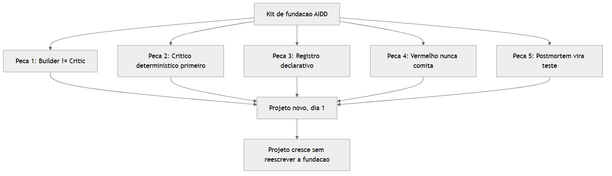

# Manual do Iniciante — Replicando as Práticas Acima da Média da Fábrica

## 1. Introdução

O manual irmão (`manual-fechar-gaps-aidd.md`) mostrou o que falta nesta
Fábrica. Este manual faz o caminho contrário: pega 5 decisões de
engenharia que já estão **acima da média** de quem só usa IA para gerar
código, e ensina — em passo a passo simples — como levar exatamente essas
5 decisões para o **seu próximo projeto**, começando do zero.

Ao final você vai ser capaz de: (1) separar builder e critic desde a
primeira linha de código de um projeto novo; (2) saber quando escrever um
script em vez de gastar tokens com um segundo LLM; (3) desenhar um
registro central em vez de espalhar `if tipo == "x"` em 6 arquivos; (4)
transformar "nunca commitar vermelho" numa regra que o computador aplica,
não numa promessa; e (5) escrever postmortem que vira teste, não só
memória.

## 2. Explica

As 5 práticas boas desta Fábrica não são truques específicos de "gerar
livro com IA" — são princípios de engenharia de software com décadas de
maturidade, só que **aplicados corretamente** num contexto de agentes.

**Builder ≠ Critic** é a mesma lógica de "quem escreve o código não
aprova o próprio Pull Request" — só que levada ao extremo certo: aqui,
sempre que possível, quem aprova nem é uma pessoa, é um script sem
nenhum vínculo com quem gerou o conteúdo. **Crítico determinístico** é a
versão madura disso: um script não tem "vontade de ser gentil" com o
texto que acabou de revisar — ele aplica a mesma regra hoje e daqui a um
ano.

**Registro declarativo** é o princípio Aberto/Fechado (o "O" de SOLID):
um módulo deve estar aberto para extensão (adicionar um tipo novo) e
fechado para modificação (não precisar editar código que já funciona)
[1]. **Nunca commitar vermelho** é, literalmente, a definição clássica de
Integração Contínua de Martin Fowler: manter o branch principal sempre
em estado que compila e passa os testes, porque cada commit vermelho que
fica parado é dívida que cresce com juros [2]. **Postmortem estruturado**
é a cultura de "blameless postmortem" descrita no livro de SRE do
Google: todo incidente vira documento com causa raiz e ação de
prevenção, não só desabafo [3].

O que a Fábrica fez de diferente não foi inventar esses princípios — foi
**aplicá-los sem exceção**, em todo fluxo, de forma consistente, o que é
muito mais raro do que conhecer a teoria.

## 3. Ilustra

Pense num kit de peças de montar com manual de instrução, comparado a
uma escultura de argila única. A escultura é rápida no primeiro projeto
e impossível de replicar no segundo — cada decisão foi tomada no calor do
momento, sem registro, sem regra. O kit de peças é mais lento para
montar a primeira vez (você precisa desenhar as peças e o encaixe), mas
qualquer pessoa nova monta o segundo, o terceiro, o décimo projeto com o
mesmo kit, sem reinventar nada.

As 5 práticas abaixo são as 5 peças fundamentais desse kit — e cada uma
resolve um problema que só aparece quando o projeto cresce, nunca no
primeiro protótipo.



## 4. Técnica

### 4.1 Peça 1 — Builder ≠ Critic desde o dia 1

**Regra:** quem gera nunca é quem aprova. Nesta Fábrica isso é literal —
`subagente-redator-capitulo` (builder, escreve) e
`subagente-revisor-tecnico` (critic, corrige com contexto fresco, nunca é
quem escreveu o capítulo original) são arquivos separados em
`.claude/agents/`, com propósitos que não se misturam.

**Como replicar num projeto novo, passo a passo:**

1. Antes de escrever o primeiro prompt, escreva **dois** arquivos de
   agente, nunca um só "faça e confira":

```markdown
<!-- .claude/agents/builder.md -->
---
name: builder
description: Gera o artefato. Nunca julga o proprio resultado.
tools: Read, Write, Edit
---
Sua unica tarefa e produzir o artefato pedido. Voce NUNCA decide se o
resultado esta bom - isso e trabalho de outro agente.
```

```markdown
<!-- .claude/agents/critic.md -->
---
name: critic
description: Julga o artefato do builder. Nunca gera nem edita.
tools: Read
---
Voce recebe SO o resultado final e a barra de qualidade. Voce nunca viu
o processo de geracao. Se reprovar, devolva o motivo especifico - nunca
"nao ficou bom", sempre "faltou X, linha Y".
```

2. Dê ao `critic` acesso **só de leitura** (`tools: Read`) — sem `Write`/
   `Edit`. Isso não é burocracia: é a garantia mecânica de que ele não
   pode "corrigir escondido" o que devia só reprovar.
3. O loop de correção sempre volta para o `builder`, nunca para o
   `critic` corrigir por conta própria (regra que já existe nesta Fábrica:
   "Reprovado → volta ao Builder com o relatório específico da falha,
   nunca ao Critic", `docs/fluxogramas-gauntlet-loop.md`).

### 4.2 Peça 2 — Prefira o crítico determinístico

**Regra:** antes de gastar uma chamada de LLM como "crítico", pergunte:
isso é uma checagem de formato/presença/contagem? Se sim, é regex ou
script — nunca LLM.

**Árvore de decisão simples:**

```
A checagem depende de CONTAR, ACHAR PADRAO ou COMPARAR NUMERO?
  -> SIM: escreva um script (validar_algo.py). Custo de LLM: ZERO.
  -> NAO, depende de JULGAR SENTIDO/QUALIDADE/VERDADE:
      -> use um LLM critic, SEPARADO do builder (Peca 1), e so como
         ultimo recurso.
```

**Exemplos reais da Fábrica que confirmam a regra:** `validar-emails.py`
confere "assunto ≤ 60 caracteres" com `len(assunto) <= MAX_CHARS_ASSUNTO`
— zero LLM, zero ambiguidade. Já saber se a *copy* do e-mail está boa ou
genérica demais precisaria de julgamento — e mesmo aí, a Fábrica primeiro
tenta reduzir a um script (`grep 'Autor Digital|centenas de pessoas'`,
regra 12 do `CLAUDE.md`) antes de pensar em LLM.

**Template reutilizável para qualquer projeto novo** (mesmo esqueleto que
todo `validar-*.py` desta Fábrica usa):

```python
#!/usr/bin/env python3
"""Gate <NOME> — <o que confere, em 1 frase>."""
import argparse
import sys

REGRAS = {"R-1": "descricao objetiva e mensuravel da regra"}


def validar(caminho):
    violacoes = []
    # ... checagem determinística aqui (regex, contagem, presença) ...
    return violacoes


def main():
    ap = argparse.ArgumentParser()
    ap.add_argument("caminho")
    ap.add_argument("--estrito", action="store_true")
    args = ap.parse_args()

    violacoes = validar(args.caminho)
    if violacoes:
        print("[FALHA]", *violacoes, sep="\n  - ")
        sys.exit(1)
    print("[OK] todas as regras passaram")


if __name__ == "__main__":
    main()
```

### 4.3 Peça 3 — Registro declarativo em vez de 6 arquivos por tipo

**O exemplo real desta Fábrica** (`scripts/tipos_obra.py:65-102`):

```python
TIPOS = {
    "livro": {
        "rotulo": "Livro",
        "prefixo_curto": "liv",
        "raiz_output": "livros",
        "natureza": "geracao",
        "custo_llm": "alto",
        "gates_conteudo": (
            "validar-referencias.py",
            "validar-metricas.py",
            "validar-afirmacoes.py",
        ),
    },
    # "tcc": {...}, "artigo": {...}, "ebook": {...} — cada tipo novo
    # e so uma entrada aqui, nunca um "if tipo == ..." espalhado
}
```

Antes desse registro, adicionar um tipo de obra exigia editar 6 arquivos
diferentes (um por ponto de decisão: parâmetros, fatiamento, auditoria,
capa, metadados, compilação). Depois, é **1 entrada no dicionário** —
os 6 pontos de dispatch (`parametros_obra`, `fatiar-obra`, `auditar-obra`
etc.) leem do registro, nunca hardcodam o tipo.

**Como replicar, passo a passo, num projeto novo:**

1. No momento em que você perceber que vai escrever `if tipo == "a": ...
   elif tipo == "b": ...` em **mais de um arquivo** para o mesmo conceito
   ("tipo de X"), pare — esse é o sinal de que precisa de um registro.
2. Crie um dicionário único (`TIPOS = {...}`) com todos os campos que
   variam por tipo — nomes, extensões, regras, validadores.
3. Toda função que hoje tem `if tipo ==` passa a fazer
   `config = TIPOS[tipo]` e ler os campos do dicionário.
4. Adicionar um tipo novo nunca mais toca nas funções — só acrescenta uma
   chave no dicionário. Se isso não for verdade, o registro está
   incompleto — volte e mova o campo que ainda está hardcoded.

### 4.4 Peça 4 — "Nunca commitar vermelho" como regra que o computador aplica

**O que a Fábrica já tem, em texto** (`CLAUDE.md`, R16): depois de toda
implementação, rodar a suíte, 100% → commit, <100% → corrigir a causa e
testar de novo. Isso é uma regra **escrita**, seguida por disciplina do
operador e do agente.

**Como torná-la mecânica, não só prometida, em qualquer projeto:** um
hook de pre-commit que roda a suíte e **bloqueia** o commit se falhar —
a skill `setup-pre-commit` já disponível neste ambiente existe
exatamente para isso. O hook mínimo, sem depender de nenhuma skill:

```bash
#!/usr/bin/env bash
# .git/hooks/pre-commit
python -m pytest -q
if [ $? -ne 0 ]; then
  echo "[BLOQUEADO] suite vermelha - corrija antes de comitar (R16)"
  exit 1
fi
```

Isso fecha a distância entre "a regra existe no CLAUDE.md" e "é
impossível violar a regra sem querer" — a diferença entre uma política e
um gate de verdade, que é o mesmo princípio dos gates de conteúdo
(`validar-*.py`) aplicado ao próprio processo de commit.

### 4.5 Peça 5 — Postmortem que vira teste, não só memória

**O template real do RTK Scratchpad** (`CLAUDE.md`, seção 7) já segue uma
estrutura consistente: data + causa + fix + prevenção + arquivos. Um
exemplo real, resumido:

> **Causa:** `montar_cheatsheet` lê `card.comandos` no nível do card, não
> dentro de `execucao[]`. **Fix:** adicionar `comandos` no topo dos
> cards. **Prevenção:** cheatsheet é agregador de `card.comandos` — se o
> playbook nasce sem comandos, o lead magnet nasce vazio; validar
> playbook ANTES de gerar os derivados.

**O passo que fecha o ciclo (e que vale para qualquer projeto seu):**
toda vez que a linha de "Prevenção" descrever um comportamento
verificável, ela deve nascer junto com um teste automatizado — não ficar
só em prosa esperando que alguém leia o `CLAUDE.md` de novo:

```python
def test_cheatsheet_nao_nasce_vazio_quando_card_tem_comandos():
    """Regressao do bug: montar_cheatsheet ignorava card.comandos no
    nivel do card. Fix em <commit>. Nao pode voltar a acontecer."""
    card = {"titulo": "X", "comandos": ["passo 1", "passo 2"]}
    cheatsheet = montar_cheatsheet([card])
    assert len(cheatsheet["itens"]) > 0
```

**Template de postmortem pra usar em qualquer projeto, desde o primeiro
bug real:**

```markdown
- **[DATA] [título curto do bug]:** causa: [o que realmente aconteceu,
  no nível técnico]. Fix: [o que foi mudado]. Prevenção: [regra que
  evita recorrência — e o teste automatizado que a materializa].
  Arquivos: [caminhos tocados].
```

## 5. Aplica

Você começa um projeto novo, sozinho, sem essas 5 peças. No primeiro
recurso ("gerar relatório A") tudo funciona rápido — 1 função, 1
`if tipo == "relatorio_a"`. No segundo recurso ("gerar relatório B") você
copia a função e troca 3 linhas. No sexto recurso, você tem 6 funções
quase-idênticas espalhadas em 4 arquivos, cada uma com seu próprio
`if tipo ==`, e mudar uma regra que deveria valer pra todos os tipos
significa lembrar de editar os 6 lugares — e um dia você vai esquecer um.

Esse não é um cenário hipotético: é literalmente a história desta
Fábrica antes da V5 — "Adicionar um tipo novo = 1 entrada em
`tipos_obra.py`. Os 6 pontos de dispatch... consultam o registro — não se
edita mais 6 arquivos por tipo" (`CLAUDE.md`, seção 1). A correção não foi
reescrever tudo do zero — foi extrair o dicionário `TIPOS` uma vez e
migrar os 6 pontos de dispatch pra ler dele.

A lição pra replicar: se você é iniciante começando um projeto novo hoje,
não precisa esperar chegar no sexto recurso pra sentir a dor — desenhe o
registro (Peça 3) **antes** do segundo tipo existir, porque o custo de
migrar depois é exatamente o que esta Fábrica pagou uma vez.

## 6. Conclusão

As 5 peças, na ordem certa pra um projeto novo: comece por **Builder ≠
Critic** e **Crítico determinístico** (Peças 1 e 2) desde o primeiro
commit — são decisões de arquitetura que ficam caras de desfazer depois.
Em seguida, **Registro declarativo** (Peça 3) no momento em que aparecer
o segundo "tipo" de qualquer coisa. **Nunca commitar vermelho** (Peça 4)
é gratuito — configure o hook antes de escrever a primeira função de
negócio. **Postmortem que vira teste** (Peça 5) só existe quando o
primeiro bug real acontecer — mas o hábito de escrevê-lo tem que nascer
no primeiro bug, não no décimo.

**Desafio:** no seu próximo projeto pessoal, escreva o arquivo
`builder.md` e `critic.md` (Peça 1) antes de escrever qualquer prompt de
geração. Se isso parecer "excesso de processo para um projeto pequeno",
volte ao manual irmão (`manual-fechar-gaps-aidd.md`, seção 5, Aplica) e
note que o custo de não fazer isso nunca aparece no dia 1 — aparece
exatamente quando o projeto já está grande demais para reescrever com
calma.

## 7. Referências Bibliográficas

[1] MARTIN, Robert C. *The Open-Closed Principle*. Disponível em:
https://en.wikipedia.org/wiki/Open%E2%80%93closed_principle. Acesso em:
11 ago. 2026.

[2] FOWLER, Martin. *Continuous Integration*. Disponível em:
https://martinfowler.com/articles/continuousIntegration.html. Acesso em:
11 ago. 2026.

[3] GOOGLE. *Site Reliability Engineering — Postmortem Culture: Learning
from Failure*. Disponível em: https://sre.google/sre-book/postmortem-culture/.
Acesso em: 11 ago. 2026.

[4] Fábrica Agêntica de Publicações. `scripts/tipos_obra.py` (registro
declarativo de tipos de obra). Arquivo interno deste repositório.

[5] Fábrica Agêntica de Publicações. `CLAUDE.md`, seção "RTK Scratchpad"
(postmortems reais de bugs de produção). Arquivo interno deste
repositório.

[6] Fábrica Agêntica de Publicações. `docs/fluxogramas-gauntlet-loop.md`
(builder/critic separado por fluxo). Arquivo interno deste repositório.
