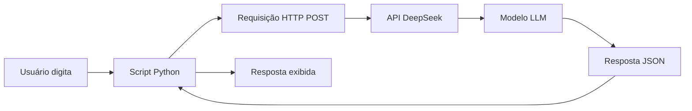

## 1. O Primeiro Contato com IA: Chat Simples

### 1.1 Introdução

Este capítulo é o ponto de partida da nossa jornada. Aqui, você vai configurar seu ambiente de desenvolvimento, entender o fluxo básico de uma chamada à API de Inteligência Artificial, e construir seu primeiro chat funcional — um assistente que responde perguntas sobre um documento específico.

**O que você vai construir:**

Um script Python simples que:
- Conecta à API do DeepSeek (ou OpenAI)
- Recebe uma pergunta do usuário
- Retorna uma resposta gerada por IA
- Historico de conversas em memória

**Por que este projeto importa:**

Cada grande sistema de IA começa com uma chamada simples. Antes de arquiteturas complexas com RAG, fine-tuning e milhares de usuários, existe uma única chamada de API que funciona. Este capítulo garante que essa chamada funcione perfeitamente antes de construir sobre ela.

**Requisitos prévios:**
- Python 3.11+ instalado
- Conta em uma plataforma de API de IA (DeepSeek ou OpenAI)
- Editor de código (VS Code recomendado)
- Conhecimento básico de Python (variáveis, funções, loops)

### 1.2 Explica

#### O que é Inteligência Artificial Generativa

Inteligência Artificial Generativa refere-se a sistemas capazes de criar conteúdo novo — texto, imagens, código, música — baseado em padrões aprendidos a partir de grandes volumes de dados [1]. Diferente da IA tradicional que classifica ou prevê, a IA generativa **produz**.

Os modelos de linguagem grandes (LLMs — Large Language Models) são o tipo mais comum de IA generativa hoje. Um LLM é treinado em bilhões de tokens (pedaços de texto) e aprende a prever a próxima palavra em uma sequência [2]. Quando você pergunta "O que é Python?", o modelo não "busca" uma resposta em um banco de dados — ele **gera** uma resposta baseada nos padrões que aprendeu durante o treinamento.

**Analogia:** Imagine um escritor extremamente bem-leido que leu milhões de livros. Quando você pergunta algo, ele não consulta uma enciclopédia — ele escreve uma resposta baseado em tudo que já leu. É assim que um LLM funciona.

#### Como LLMs Funcionam (Visão Geral)

Um LLM opera em três etapas principais [3]:

1. **Tokenização:** O texto de entrada é dividido em tokens (palavras ou sub-palavras). "Inteligência Artificial" pode virar ["Intelig", "ência", " Artificial"].

2. **Processamento:** Cada token passa através de camadas de rede neural (transformers) que calculam relações entre todas as palavras da sequência. O mecanismo de atenção (attention) permite que o modelo entenda contexto — por exemplo, que "ele" no início de uma frase pode referir-se a uma pessoa mencionada no parágrafo anterior [4].

3. **Geração:** O modelo gera um token por vez, calculando a probabilidade de cada palavra possível no vocabulário e escolhendo a mais provável (ou uma amostrada de acordo com parâmetros como "temperatura").

**Parâmetros-chave que você vai usar:**

| Parâmetro | O que faz | Valores típicos |
|-----------|-----------|-----------------|
| `temperature` | Controla criatividade/aleatoriedade | 0.0 (determinístico) a 1.0 (criativo) |
| `max_tokens` | Limite de tokens na resposta | 100-4096 |
| `top_p` | Nucleus sampling — limita vocabulário | 0.1-1.0 |

#### O Fluxo de uma Chamada à API

Quando seu código envia uma requisição à API de IA, acontece o seguinte [5]:

```
Seu Código → Requisição HTTP → Servidor da API → Modelo LLM → Resposta → Seu Código
```

Detalhadamente:

1. Seu Python monta um payload JSON com a mensagem e parâmetros
2. Uma requisição HTTP POST é enviada ao endpoint da API
3. O servidor autentica (verifica sua API key)
4. O payload é roteado para um servidor com GPU que hospeda o modelo
5. O modelo processa os tokens e gera uma resposta
6. A resposta retorna ao seu código como JSON
7. Seu Python extrai o texto da resposta

**Tempo típico:** 0.5-3 segundos para respostas curtas, dependendo do modelo e latência da rede.

#### Por que DeepSeek?

O DeepSeek é uma empresa chinesa de IA que lançou modelos de alta performance com preços competitivos [6]. Seus principais modelos incluem:

- **DeepSeek-V4-Flash:** Rápido e barato, ideal para tarefas simples
- **DeepSeek-V4-Pro:** Mais preciso, melhor para tarefas complexas
- **DeepSeek-R1:** Modelo de raciocínio (thinking model)

Para este livro, usaremos o DeepSeek-V4-Flash como modelo principal (custo baixo) e o V4-Pro para tarefas que exigem mais qualidade.

**Vantagens do DeepSeek para iniciantes:**
- Preço acessível ($0.27/milhão de tokens de entrada para V4-Flash)
- Compatível com a API do OpenAI (mesma biblioteca)
- Bom desempenho em português
- Thinking mode disponível (raciocínio passo a passo)

### 1.3 Ilustra

#### Exemplo 1: Primeira Chamada à API

```python
# scripts/chat_basico.py
"""
Primeira chamada à API de IA.
Este script demonstra o fluxo básico de uma conversa com um LLM.
"""
import os
from openai import OpenAI

# Configurar o cliente com a API do DeepSeek
client = OpenAI(
    api_key=os.environ["DEEPSEEK_API_KEY"],
    base_url="https://api.deepseek.com"
)

# Enviar uma mensagem
response = client.chat.completions.create(
    model="deepseek-v4-flash",
    messages=[
        {"role": "user", "content": "O que é inteligência artificial?"}
    ],
    temperature=0.7,
    max_tokens=200
)

# Extrair e imprimir a resposta
print(response.choices[0].message.content)
```

**Saída esperada:**
```
Inteligência artificial (IA) é um campo da ciência da computação que
busca criar sistemas capazes de realizar tarefas que normalmente
requerem inteligência humana, como aprendizado, raciocínio,
resolução de problemas, percepção e compreensão de linguagem.
```

#### Exemplo 2: Chat Interativo

```python
# scripts/chat_interativo.py
"""
Chat interativo com histórico de mensagens.
Cada nova mensagem é enviada junto com o histórico da conversa.
"""
import os
from openai import OpenAI

client = OpenAI(
    api_key=os.environ["DEEPSEEK_API_KEY"],
    base_url="https://api.deepseek.com"
)

# Histórico de mensagens (começa vazio)
historico = []

def enviar_mensagem(pergunta):
    """Envia uma pergunta e retorna a resposta."""
    # Adicionar a pergunta ao histórico
    historico.append({"role": "user", "content": pergunta})
    
    # Chamar a API com todo o histórico
    response = client.chat.completions.create(
        model="deepseek-v4-flash",
        messages=historico,
        temperature=0.7,
        max_tokens=500
    )
    
    # Extrair resposta
    resposta = response.choices[0].message.content
    
    # Adicionar resposta ao histórico
    historico.append({"role": "assistant", "content": resposta})
    
    return resposta

# Loop principal
print("Chat iniciado! Digite 'sair' para encerrar.\n")
while True:
    pergunta = input("Você: ")
    if pergunta.lower() in ["sair", "exit", "quit"]:
        print("Até logo!")
        break
    
    resposta = enviar_mensagem(pergunta)
    print(f"Assistente: {resposta}\n")
```

#### Exemplo 3: Chat com System Prompt

```python
# scripts/chat_system_prompt.py
"""
Chat com system prompt definindo o comportamento do assistente.
O system prompt instrui o modelo sobre seu papel e limites.
"""
import os
from openai import OpenAI

client = OpenAI(
    api_key=os.environ["DEEPSEEK_API_KEY"],
    base_url="https://api.deepseek.com"
)

# System prompt define o comportamento
SYSTEM_PROMPT = """Você é um assistente técnico especializado em Python.
Responda de forma clara e concisa, sempre em português brasileiro.
Quando relevante, inclua exemplos de código.
Se não souber a resposta, diga honestamente."""

historico = [
    {"role": "system", "content": SYSTEM_PROMPT}
]

def chat(pergunta):
    historico.append({"role": "user", "content": pergunta})
    
    response = client.chat.completions.create(
        model="deepseek-v4-flash",
        messages=historico,
        temperature=0.5,  # Mais determinístico para respostas técnicas
        max_tokens=1000
    )
    
    resposta = response.choices[0].message.content
    historico.append({"role": "assistant", "content": resposta})
    return resposta

# Exemplo de uso
print(chat("O que é uma list comprehension em Python?"))
```

#### Fluxograma do Sistema



### 1.4 Técnica

#### Estrutura do Projeto

Antes de escrever mais código, vamos organizar o projeto. Uma boa estrutura facilita manutenção e expansão:

```
arquitetura-ia-assistant/
├── main.py                 # Ponto de entrada principal
├── requirements.txt        # Dependências
├── .env.example           # Variáveis de ambiente (template)
├── .gitignore             # Arquivos ignorados pelo Git
├── README.md              # Documentação do projeto
├── Dockerfile             # Containerização
├── config/
│   └── settings.py        # Configurações centralizadas
├── src/
│   ├── __init__.py
│   ├── client.py          # Cliente da API de IA
│   └── chat.py            # Lógica do chat
├── tests/
│   ├── __init__.py
│   └── test_chat.py       # Testes unitários
└── docs/
    └── arquitetura.md     # Documentação da arquitetura
```

**Por que essa estrutura?**

- **Separação de responsabilidades:** Cada arquivo faz uma coisa
- **Testabilidade:** Código isolado é mais fácil de testar
- **Escalabilidade:** Fácil de adicionar novos componentes (RAG, auth, etc.)
- **Padrão da indústria:** Segue convenções que outros desenvolvedores reconhecem

#### Configuração Centralizada

```python
# config/settings.py
"""
Configurações centralizadas do projeto.
Usa variáveis de ambiente com fallbacks para desenvolvimento.
"""
import os
from dataclasses import dataclass
from typing import Optional

@dataclass
class IAConfig:
    """Configurações da API de IA."""
    api_key: str
    base_url: str = "https://api.deepseek.com"
    model: str = "deepseek-v4-flash"
    temperature: float = 0.7
    max_tokens: int = 1000
    timeout: int = 30

@dataclass
class DatabaseConfig:
    """Configurações do banco de dados."""
    url: str = "sqlite:///data/conversas.db"
    echo: bool = False

@dataclass
class AppConfig:
    """Configurações gerais da aplicação."""
    ia: IAConfig
    database: DatabaseConfig
    debug: bool = False
    log_level: str = "INFO"

def load_config() -> AppConfig:
    """Carrega configurações de variáveis de ambiente."""
    return AppConfig(
        ia=IAConfig(
            api_key=os.environ.get("DEEPSEEK_API_KEY", ""),
            base_url=os.environ.get("IA_BASE_URL", "https://api.deepseek.com"),
            model=os.environ.get("IA_MODEL", "deepseek-v4-flash"),
            temperature=float(os.environ.get("IA_TEMPERATURE", "0.7")),
            max_tokens=int(os.environ.get("IA_MAX_TOKENS", "1000")),
        ),
        database=DatabaseConfig(
            url=os.environ.get("DATABASE_URL", "sqlite:///data/conversas.db"),
        ),
        debug=os.environ.get("DEBUG", "false").lower() == "true",
        log_level=os.environ.get("LOG_LEVEL", "INFO"),
    )
```

#### Cliente da API

```python
# src/client.py
"""
Cliente encapsulado para a API de IA.
Trata erros, retry e logging de forma centralizada.
"""
import os
import time
import logging
from typing import List, Dict, Optional
from openai import OpenAI, RateLimitError, APIError

logger = logging.getLogger(__name__)

class IAClient:
    """Cliente para a API de IA com tratamento de erros."""
    
    def __init__(self, api_key: str, base_url: str, model: str,
                 temperature: float = 0.7, max_tokens: int = 1000):
        self.client = OpenAI(api_key=api_key, base_url=base_url)
        self.model = model
        self.temperature = temperature
        self.max_tokens = max_tokens
    
    def enviar(self, mensagens: List[Dict[str, str]], 
               temperature: Optional[float] = None,
               max_tokens: Optional[int] = None) -> str:
        """
        Envia mensagens e retorna a resposta.
        
        Args:
            mensagens: Lista de mensagens no formato OpenAI
            temperature: Override da temperatura (opcional)
            max_tokens: Override do max_tokens (opcional)
        
        Returns:
            Texto da resposta
        
        Raises:
            Exception: Em caso de erro na API
        """
        max_retries = 3
        retry_delay = 1.0
        
        for attempt in range(max_retries):
            try:
                response = self.client.chat.completions.create(
                    model=self.model,
                    messages=mensagens,
                    temperature=temperature or self.temperature,
                    max_tokens=max_tokens or self.max_tokens,
                )
                
                resposta = response.choices[0].message.content
                logger.info(f"Resposta recebida: {len(resposta)} chars")
                return resposta
                
            except RateLimitError as e:
                logger.warning(f"Rate limit atingido (tentativa {attempt + 1}): {e}")
                if attempt < max_retries - 1:
                    time.sleep(retry_delay * (2 ** attempt))
                else:
                    raise Exception(f"Rate limit após {max_retries} tentativas: {e}")
                    
            except APIError as e:
                logger.error(f"Erro na API: {e}")
                raise Exception(f"Erro na API: {e}")
```

#### Módulo de Chat

```python
# src/chat.py
"""
Módulo de chat com persistência de mensagens.
"""
from typing import List, Dict, Optional
from src.client import IAClient

class Chat:
    """Gerencia uma sessão de chat com histórico."""
    
    def __init__(self, client: IAClient, system_prompt: Optional[str] = None):
        self.client = client
        self.mensagens: List[Dict[str, str]] = []
        
        if system_prompt:
            self.mensagens.append({"role": "system", "content": system_prompt})
    
    def enviar(self, pergunta: str) -> str:
        """Envia uma pergunta e retorna a resposta."""
        self.mensagens.append({"role": "user", "content": pergunta})
        resposta = self.client.enviar(self.mensagens)
        self.mensagens.append({"role": "assistant", "content": resposta})
        return resposta
    
    def limpar(self):
        """Limpa o histórico (mantém system prompt se houver)."""
        self.mensagens = [m for m in self.mensagens if m["role"] == "system"]
    
    def exportar(self) -> List[Dict[str, str]]:
        """Exporta o histórico de mensagens."""
        return self.mensagens.copy()
```

#### Ponto de Entrada Principal

```python
# main.py
"""
Ponto de entrada principal do assistente de IA.
Este é o arquivo que você executa para iniciar o chat.
"""
import logging
from config.settings import load_config
from src.client import IAClient
from src.chat import Chat

logging.basicConfig(level=logging.INFO)
logger = logging.getLogger(__name__)

SYSTEM_PROMPT = """Você é um assistente de IA prestativo e amigável.
Responda de forma clara e concisa em português brasileiro.
Quando relevante, inclua exemplos práticos."""

def main():
    """Função principal."""
    # Carregar configurações
    config = load_config()
    
    if not config.ia.api_key:
        logger.error("DEEPSEEK_API_KEY não configurada!")
        logger.info("Copie .env.example para .env e adicione sua chave.")
        return
    
    # Inicializar cliente
    client = IAClient(
        api_key=config.ia.api_key,
        base_url=config.ia.base_url,
        model=config.ia.model,
        temperature=config.ia.temperature,
        max_tokens=config.ia.max_tokens,
    )
    
    # Criar sessão de chat
    chat = Chat(client, system_prompt=SYSTEM_PROMPT)
    
    # Loop principal
    print("🤖 Assistente de IA iniciado!")
    print("   Digite 'sair' para encerrar.\n")
    
    while True:
        try:
            pergunta = input("Você: ").strip()
            
            if not pergunta:
                continue
            
            if pergunta.lower() in ["sair", "exit", "quit"]:
                print("Até logo! 👋")
                break
            
            resposta = chat.enviar(pergunta)
            print(f"\nAssistente: {resposta}\n")
            
        except KeyboardInterrupt:
            print("\n\nAté logo! 👋")
            break
        except Exception as e:
            logger.error(f"Erro: {e}")
            print(f"\n❌ Erro: {e}\n")

if __name__ == "__main__":
    main()
```

#### Arquivos de Suporte

```txt
# requirements.txt
openai>=1.0.0
python-dotenv>=1.0.0
```

```bash
# .env.example
DEEPSEEK_API_KEY=sk-sua-chave-aqui
IA_BASE_URL=https://api.deepseek.com
IA_MODEL=deepseek-v4-flash
IA_TEMPERATURE=0.7
IA_MAX_TOKENS=1000
DEBUG=false
LOG_LEVEL=INFO
```

```gitignore
# .gitignore
.env
__pycache__/
*.pyc
data/
*.db
.venv/
venv/
```

### 1.5 Aplica

#### Exercício Prático 1: Setup Completo

1. **Clone ou crie a pasta do projeto:**
```bash
mkdir arquitetura-ia-assistant
cd arquitetura-ia-assistant
python -m venv .venv
source .venv/bin/activate  # Linux/Mac
# .venv\Scripts\activate  # Windows
```

2. **Instale as dependências:**
```bash
pip install -r requirements.txt
```

3. **Configure as variáveis de ambiente:**
```bash
cp .env.example .env
# Edite .env com sua API key real
```

4. **Execute o chat:**
```bash
python main.py
```

5. **Teste com perguntas:**
```
Você: O que é Python?
Você: Qual a diferença entre lista e tupla?
Você: Explique o conceito de herança em POO
```

#### Exercício Prático 2: Variações do System Prompt

Modifique o `SYSTEM_PROMPT` em `main.py` e observe como o comportamento muda:

**Versão Professor:**
```python
SYSTEM_PROMPT = """Você é um professor de programação.
Explique conceitos de forma didática, usando analogias.
Comece sempre com uma explicação simples antes de entrar em detalhes técnicos."""
```

**Versão Debug:**
```python
SYSTEM_PROMPT = """Você é um debugger experiente.
Quando o usuário descrever um bug, pergunte:
1. Qual a mensagem de erro exata?
2. O que você tentou até agora?
3. Qual é o comportamento esperado vs atual?"""
```

**Versão Arquiteto:**
```python
SYSTEM_PROMPT = """Você é um arquiteto de software.
Ajude o usuário a pensar em sistemas, não em código.
Pergunte sobre requisitos, restrições e trade-offs antes de sugerir soluções."""
```

#### Checklist de Validação

- [ ] Script executa sem erros
- [ ] API responde com texto coerente
- [ ] Histórico de mensagens funciona (o assistente lembra de mensagens anteriores)
- [ ] System prompt influencia o comportamento
- [ ] Erros de API são tratados graciosamente
- [ ] Projeto tem estrutura organizada

### 1.6 Conclusão

Neste capítulo, você configurou seu ambiente, entendeu o fluxo básico de uma chamada à IA, e construiu um chat funcional. O projeto agora tem:

- **Cliente da API** com tratamento de erros e retry
- **Chat com histórico** que mantém contexto
- **System prompt** configurável
- **Estrutura de projeto** pronta para expansão

No próximo capítulo, vamos adicionar persistência ao chat — salvando conversas em um banco de dados — e criar uma API REST para que outros aplicativos possam se comunicar com nosso assistente.

**Lembre-se:** Todo grande sistema começa com uma chamada simples que funciona. Agora que essa chamada funciona, podemos construir sobre ela com confiança.

### 1.7 Referências

[1] Microsoft Azure Architecture Center. "Get Started with AI Architecture Design." Microsoft Learn, 2024. Disponível em: https://learn.microsoft.com/en-us/azure/architecture/ai-ml/ai-get-started

[2] Vaswani, A. et al. "Attention Is All You Need." Advances in Neural Information Processing Systems, vol. 30, 2017.

[3] Brown, T. et al. "Language Models are Few-Shot Learners." Advances in Neural Information Processing Systems, vol. 33, 2020.

[4] Devlin, J. et al. "BERT: Pre-training of Deep Bidirectional Transformers for Language Understanding." Proceedings of NAACL-HLT, 2019.

[5] OpenAI. "API Reference — Chat Completions." OpenAI Platform Documentation, 2024. Disponível em: https://platform.openai.com/docs/api-reference/chat

[6] DeepSeek. "API Documentation — Model Overview." DeepSeek API Docs, 2024. Disponível em: https://api-docs.deepseek.com/guides/model_overview

[7] Huyen, Chip. "Designing Machine Learning Systems." O'Reilly Media, 2022. ISBN: 978-1098107963.

[8] AWS. "Machine Learning Lens — Well-Architected Framework." Amazon Web Services, 2024. Disponível em: https://docs.aws.amazon.com/wellarchitected/latest/machine-learning-lens/

[9] Google Cloud. "ML System Design Patterns." Google Cloud Architecture Center, 2023. Disponível em: https://cloud.google.com/architecture/ml-design-patterns

[10] Pinecone. "What is RAG?" Pinecone Learning Center, 2024. Disponível em: https://www.pinecone.io/learn/retrieval-augmented-generation/

[11] LangChain. "RAG from Scratch." LangChain Documentation, 2024. Disponível em: https://python.langchain.com/docs/tutorials/rag/

[12] DeepSeek. "Pricing — API." DeepSeek API Docs, 2024. Disponível em: https://api-docs.deepseek.com/quick_start/pricing

[13] OWASP. "Top 10 for Large Language Model Applications." OWASP Foundation, 2024. Disponível em: https://owasp.org/www-project-top-10-for-large-language-model-applications/

[14] NIST. "Artificial Intelligence Risk Management Framework." National Institute of Standards and Technology, 2024. Disponível em: https://www.nist.gov/artificial-intelligence/risk-management-framework

[15] Docker. "Containerization Best Practices." Docker Documentation, 2024. Disponível em: https://docs.docker.com/

[16] FastAPI. "Production Deployment." FastAPI Documentation, 2024. Disponível em: https://fastapi.tiangolo.com/deployment/

[17] Prometheus. "Monitoring Best Practices." Prometheus Documentation, 2024. Disponível em: https://prometheus.io/docs/

[18] Grafana. "Dashboard Design." Grafana Documentation, 2024. Disponível em: https://grafana.com/docs/

[19] Hugging Face. "PEFT Library — Parameter-Efficient Fine-Tuning." Hugging Face Documentation, 2024. Disponível em: https://huggingface.co/docs/peft

[20] DeepEval. "LLM Evaluation Framework." DeepEval Documentation, 2024. Disponível em: https://docs.confident-ai.com/

#### Debug e Troubleshooting Comum

Ao desenvolver com APIs de IA, você vai encontrar problemas comuns. Aqui estão os mais frequentes e como resolvê-los [9]:

**1. Erro 401: Unauthorized**
```
Causa: API key inválida ou ausente
Solução: Verificar se DEEPSEEK_API_KEY está configurada corretamente
```

**2. Erro 429: Rate Limit**
```
Causa: Muitas requisições em pouco tempo
Solução: Implementar backoff exponencial (já feito no código)
```

**3. Resposta vazia ou None**
```
Causa: Modelo não gerou tokens (max_tokens muito baixo)
Solução: Aumentar max_tokens ou verificar se a mensagem não está vazia
```

**4. Timeout na requisição**
```
Causa: Modelo processando lentamente ou rede instável
Solução: Aumentar timeout, usar streaming para respostas longas
```

**5. Erro de encoding (Unicode)**
```
Causa: Caracteres especiais (acentos, emojis) não codificados
Solução: Usar encoding='utf-8' em todas as operações de arquivo
```

**Checklist de troubleshooting:**
- [ ] API key configurada e válida
- [ ] Conexão com a internet funcionando
- [ ] Modelo selecionado existe e está disponível
- [ ] Max_tokens suficiente para a resposta
- [ ] Temperature dentro da faixa válida (0.0-2.0)
- [ ] Mensagens no formato correto (role + content)

**Dicas para debugging eficiente:**
1. **Imprima o payload completo** antes de enviar
2. **Use logging** em vez de print para produção
3. **Valide a resposta** antes de usar (verifique se não é None)
4. **Cache de erros** para evitar repetir requisições que falharam
5. **Teste com curl** primeiro para isolar o problema (Python vs API)

