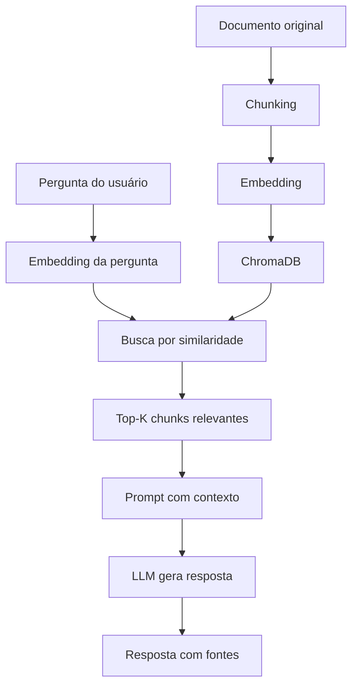

## 3. RAG: Ensinando o Assistente a Buscar

### 3.1 Introdução

Nos capítulos anteriores, construímos um chat com persistência e API REST. Mas nosso assistente ainda tem uma limitação fundamental: ele só sabe o que foi treinado. Se você perguntar sobre um documento específico da sua empresa, ele vai inventar uma resposta ou dizer que não sabe.

**RAG (Retrieval-Augmented Generation)** resolve isso. É uma técnica que permite ao assistente **buscar informações relevantes** em seus próprios documentos antes de gerar uma resposta [1]. Em vez de confiar apenas no conhecimento do modelo, RAG combina:

1. **Retrieval (Busca):** Encontrar trechos relevantes nos seus documentos
2. **Augmented Generation (Geração Aprimorada):** Gerar uma resposta usando esses trechos como contexto

**O que você vai construir:**
- Pipeline de processamento de documentos (chunking)
- Sistema de embeddings vetoriais
- Base de dados vetorial com ChromaDB
- Integração do RAG ao chat existente

**Por que RAG é essencial:**
- Reduz alucinações (o modelo cita fontes reais)
- Permite knowledge base atualizada sem retreinar
- Mais barato que fine-tuning para conhecimento específico
- Transparência (usuário pode ver as fontes)

### 3.2 Explica

#### O Problema das Alucinações

Quando um LLM não tem informação sobre um tópico, ele pode gerar texto que parece correto mas é completamente inventado — isso é chamado de **alucinação** [2]. Por exemplo:

```
Usuário: Qual é a política de férias da empresa X?
Assistente (sem RAG): A empresa X oferece 30 dias de férias...
                      (INVENTADO — o modelo não sabe nada sobre a empresa X)
```

Com RAG:
```
Usuário: Qual é a política de férias da empresa X?
Assistente (com RAG): De acordo com o documento "Política de RH" 
                       [fonte 1], a empresa X oferece 20 dias úteis 
                       de férias após 12 meses de contrato...
```

#### Como Embeddings Funcionam

Embeddings são representações vetoriais de texto [3]. Cada frase ou parágrafo é convertido em um vetor de números (geralmente 384-1536 dimensões) que captura seu significado semântico.

**Conceito chave:** Textos com significado similar ficam próximos no espaço vetorial.

```
"Como configurar Python"     → [0.2, 0.8, 0.1, ...] (vetor A)
"Instalação do Python"       → [0.3, 0.7, 0.2, ...] (vetor B) ← similar a A
"Receita de bolo de chocolate" → [0.9, 0.1, 0.6, ...] (vetor C) ← diferente de A
```

**Distância cosine** mede a similaridade entre vetores:
- 1.0 = idênticos
- 0.0 = completamente diferentes
- Negativos = opostos

#### ChromaDB: Banco de Dados Vetorial

ChromaDB é um banco de dados vetorial open-source otimizado para IA [4]. Ele permite:

- Armazenar embeddings junto com metadados
- Buscar por similaridade semântica
- Filtrar por metadados (tipo de documento, data, etc.)
- Funcionar localmente (sem servidor externo)

**Por que ChromaDB e não Pinecone/Weaviate?**
- Local (sem custo de nuvem)
- Simples de configurar
- Suficiente para projetos em estágio inicial
- Fácil de migrar para soluções maiores depois

#### Chunking: Dividindo Documentos

Documentos grandes precisam ser divididos em pedaços menores (chunks) antes de serem embeddidos [5]. Por quê?

1. **Limite de tokens:** Modelos de embedding têm limite (geralmente 512-8192 tokens)
2. **Precisão da busca:** Chunks menores = trechos mais específicos
3. **Qualidade da resposta:** Contexto relevante, não documentos inteiros

**Estratégias de chunking:**

| Estratégia | Como funciona | Quando usar |
|------------|---------------|-------------|
| Fixo por tamanho | Divide a cada N caracteres | Documentos uniformes |
| Por parágrafo | Um chunk = um parágrafo | Texto bem formatado |
| Por sentença | Um chunk = uma sentença | Documentos técnicos |
| Semântico | Divide onde o sentido muda | Documentos complexos |

#### Pipeline RAG Completo



### 3.3 Ilustra

#### Atualização do requirements.txt

```txt
# requirements.txt (atualizado com RAG)
openai>=1.0.0
python-dotenv>=1.0.0
fastapi>=0.104.0
uvicorn[standard]>=0.24.0
sqlalchemy>=2.0.0
alembic>=1.12.0
psycopg2-binary>=2.9.0
pydantic>=2.0.0
httpx>=0.25.0
pytest>=7.0.0
pytest-asyncio>=0.21.0
chromadb>=0.4.0
langchain>=0.1.0
langchain-openai>=0.0.2
tiktoken>=0.5.0
pypdf>=3.17.0
python-docx>=1.0.0
unstructured>=0.12.0
```

#### Chunker de Documentos

```python
# rag/chunker.py
"""
Chunker de documentos com múltiplas estratégias.
"""
import re
from typing import List, Dict
from dataclasses import dataclass

@dataclass
class Chunk:
    """Representa um pedaço de documento."""
    conteudo: str
    metadata: Dict
    hash: str  # Para deduplicação

class DocumentChunker:
    """Divide documentos em chunks para embedding."""
    
    def __init__(self, strategy: str = "paragraph", 
                 max_chars: int = 1000, overlap: int = 100):
        """
        Args:
            strategy: 'fixed', 'paragraph', 'sentence', ou 'semantic'
            max_chars: Tamanho máximo de cada chunk
            overlap: Sobreposição entre chunks (para contexto)
        """
        self.strategy = strategy
        self.max_chars = max_chars
        self.overlap = overlap
    
    def chunk_documento(self, texto: str, metadata: Dict = None) -> List[Chunk]:
        """Divide um documento em chunks."""
        if metadata is None:
            metadata = {}
        
        if self.strategy == "fixed":
            chunks_texto = self._chunk_fixed(texto)
        elif self.strategy == "paragraph":
            chunks_texto = self._chunk_paragraph(texto)
        elif self.strategy == "sentence":
            chunks_texto = self._chunk_sentence(texto)
        else:
            chunks_texto = self._chunk_fixed(texto)
        
        # Criar objetos Chunk
        chunks = []
        for i, conteudo in enumerate(chunks_texto):
            chunk_metadata = {
                **metadata,
                "chunk_index": i,
                "total_chunks": len(chunks_texto),
                "strategy": self.strategy,
            }
            chunk = Chunk(
                conteudo=conteudo,
                metadata=chunk_metadata,
                hash=self._hash(conteudo),
            )
            chunks.append(chunk)
        
        return chunks
    
    def _chunk_fixed(self, texto: str) -> List[str]:
        """Divide em pedaços de tamanho fixo com sobreposição."""
        chunks = []
        start = 0
        while start < len(texto):
            end = start + self.max_chars
            chunks.append(texto[start:end])
            start = end - self.overlap
        return chunks
    
    def _chunk_paragraph(self, texto: str) -> List[str]:
        """Divide por parágrafos, agrupando os pequenos."""
        paragrafos = re.split(r'\n\s*\n', texto)
        chunks = []
        current_chunk = ""
        
        for par in paragrafos:
            if len(current_chunk) + len(par) > self.max_chars:
                if current_chunk:
                    chunks.append(current_chunk.strip())
                current_chunk = par
            else:
                current_chunk += "\n\n" + par if current_chunk else par
        
        if current_chunk:
            chunks.append(current_chunk.strip())
        
        return chunks
    
    def _chunk_sentence(self, texto: str) -> List[str]:
        """Divide por sentenças."""
        sentencas = re.split(r'(?<=[.!?])\s+', texto)
        chunks = []
        current_chunk = ""
        
        for sent in sentencas:
            if len(current_chunk) + len(sent) > self.max_chars:
                if current_chunk:
                    chunks.append(current_chunk.strip())
                current_chunk = sent
            else:
                current_chunk += " " + sent if current_chunk else sent
        
        if current_chunk:
            chunks.append(current_chunk.strip())
        
        return chunks
    
    @staticmethod
    def _hash(texto: str) -> str:
        """Gera hash simples para deduplicação."""
        import hashlib
        return hashlib.md5(texto.encode()).hexdigest()
```

#### Gerador de Embeddings

```python
# rag/embedder.py
"""
Gerador de embeddings usando a API do DeepSeek/OpenAI.
"""
from typing import List
from openai import OpenAI
import os

class Embedder:
    """Gera embeddings vetoriais de textos."""
    
    def __init__(self, model: str = "text-embedding-3-small"):
        self.client = OpenAI(
            api_key=os.environ["DEEPSEEK_API_KEY"],
            base_url="https://api.deepseek.com"
        )
        self.model = model
    
    def embed_texto(self, texto: str) -> List[float]:
        """Gera embedding de um texto."""
        response = self.client.embeddings.create(
            model=self.model,
            input=texto
        )
        return response.data[0].embedding
    
    def embed_batch(self, textos: List[str]) -> List[List[float]]:
        """Gera embeddings de múltiplos textos."""
        response = self.client.embeddings.create(
            model=self.model,
            input=textos
        )
        return [item.embedding for item in response.data]
```

#### Retriever com ChromaDB

```python
# rag/retriever.py
"""
Retriever usando ChromaDB para busca vetorial.
"""
from typing import List, Dict, Optional
import chromadb
from rag.embedder import Embedder
from rag.chunker import DocumentChunker, Chunk

class RAGRetriever:
    """Busca documentos relevantes usando embeddings."""
    
    def __init__(self, persist_dir: str = "./data/chromadb"):
        self.client = chromadb.PersistentClient(path=persist_dir)
        self.embedder = Embedder()
        self.chunker = DocumentChunker(strategy="paragraph", max_chars=1000)
        
        # Criar ou obter collection
        self.collection = self.client.get_or_create_collection(
            name="documentos",
            metadata={"hnsw:space": "cosine"}
        )
    
    def indexar_documento(self, texto: str, metadata: Dict = None) -> int:
        """Indexa um documento na base vetorial."""
        if metadata is None:
            metadata = {}
        
        # Chunking
        chunks = self.chunker.chunk_documento(texto, metadata)
        
        # Gerar embeddings em batch
        textos = [c.conteudo for c in chunks]
        embeddings = self.embedder.embed_batch(textos)
        
        # Armazenar no ChromaDB
        self.collection.add(
            documents=textos,
            embeddings=embeddings,
            ids=[c.hash for c in chunks],
            metadatas=[c.metadata for c in chunks],
        )
        
        return len(chunks)
    
    def buscar(self, query: str, n_results: int = 3) -> List[Dict]:
        """Busca chunks relevantes para uma query."""
        # Embedding da query
        query_embedding = self.embedder.embed_texto(query)
        
        # Busca vetorial
        results = self.collection.query(
            query_embeddings=[query_embedding],
            n_results=n_results,
        )
        
        # Formatar resultados
        documentos = []
        for i in range(len(results["documents"][0])):
            documentos.append({
                "conteudo": results["documents"][0][i],
                "metadata": results["metadatas"][0][i],
                "distancia": results["distances"][0][i] if results["distances"] else None,
            })
        
        return documentos
    
    def contar_documentos(self) -> int:
        """Retorna o número total de chunks indexados."""
        return self.collection.count()
```

#### Gerador com RAG

```python
# rag/generator.py
"""
Gerador de respostas usando RAG (Retrieval-Augmented Generation).
"""
from typing import List, Dict, Optional
from src.client import IAClient
from rag.retriever import RAGRetriever

class RAGGenerator:
    """Gera respostas usando contexto recuperado dos documentos."""
    
    def __init__(self, client: IAClient, retriever: RAGRetriever):
        self.client = client
        self.retriever = retriever
        
        self.system_prompt = """Você é um assistente de IA que responde perguntas 
usando o contexto fornecido dos documentos.

REGRAS:
1. Use APENAS as informações do contexto fornecido
2. Se a resposta não estiver no contexto, diga "Não encontrei essa informação nos documentos"
3. Cite as fontes quando relevante (ex: [Fonte 1])
4. Seja preciso e conciso
5. Se o contexto for ambíguo, apresente as possibilidades"""
    
    def gerar_resposta(self, pergunta: str, n_contextos: int = 3) -> Dict:
        """
        Gera uma resposta usando RAG.
        
        Returns:
            Dict com resposta, fontes e métricas
        """
        # 1. Buscar contextos relevantes
        contextos = self.retriever.buscar(pergunta, n_results=n_contextos)
        
        # 2. Montar prompt com contexto
        contexto_texto = "\n\n".join([
            f"[Fonte {i+1}] {c['conteudo']}"
            for i, c in enumerate(contextos)
        ])
        
        prompt_com_contexto = f"""CONTEXTO DOS DOCUMENTOS:
{contexto_texto}

PERGUNTA: {pergunta}

Responda usando apenas as informações do contexto acima."""
        
        # 3. Gerar resposta
        mensagens = [
            {"role": "system", "content": self.system_prompt},
            {"role": "user", "content": prompt_com_contexto},
        ]
        
        resposta, metricas = self.client.enviar(mensagens)
        
        return {
            "resposta": resposta,
            "fontes": [
                {
                    "conteudo": c["conteudo"][:200] + "..." if len(c["conteudo"]) > 200 else c["conteudo"],
                    "metadata": c["metadata"],
                    "distancia": c["distancia"],
                }
                for c in contextos
            ],
            "metricas": metricas,
        }
```

#### Integração com o Chat

```python
# src/chat.py (atualizado com RAG)
"""
Módulo de chat com suporte a RAG.
"""
from typing import List, Dict, Optional
from src.client import IAClient
from rag.generator import RAGGenerator
from rag.retriever import RAGRetriever

class Chat:
    """Gerencia uma sessão de chat com RAG."""
    
    def __init__(self, client: IAClient, 
                 use_rag: bool = False,
                 rag_generator: Optional[RAGGenerator] = None):
        self.client = client
        self.use_rag = use_rag
        self.rag_generator = rag_generator
        self.mensagens: List[Dict[str, str]] = []
    
    def enviar(self, pergunta: str) -> str:
        """Envia uma pergunta e retorna a resposta."""
        if self.use_rag and self.rag_generator:
            # Usar RAG para gerar resposta
            resultado = self.rag_generator.gerar_resposta(pergunta)
            resposta = resultado["resposta"]
            
            # Adicionar fontes ao histórico
            fontes_texto = "\n".join([
                f"• Fonte {i+1}: {f['conteudo'][:100]}..."
                for i, f in enumerate(resultado["fontes"])
            ])
            if fontes_texto:
                resposta += f"\n\n📚 Fontes consultadas:\n{fontes_texto}"
        else:
            # Chat direto (sem RAG)
            self.mensagens.append({"role": "user", "content": pergunta})
            resposta = self.client.enviar(self.mensagens)
        
        self.mensagens.append({"role": "assistant", "content": resposta})
        return resposta
    
    def indexar_documento(self, texto: str, metadata: Dict = None) -> int:
        """Indexa um documento para uso com RAG."""
        if not self.use_rag or not self.rag_generator:
            raise ValueError("RAG não habilitado neste chat")
        return self.rag_generator.retriever.indexar_documento(texto, metadata)
```

#### Testes do RAG

```python
# tests/test_rag.py
"""
Testes para o pipeline RAG.
"""
import pytest
from unittest.mock import Mock, patch
from rag.chunker import DocumentChunker
from rag.retriever import RAGRetriever
from rag.generator import RAGGenerator

def test_chunker_paragraph():
    """Testa chunking por parágrafo."""
    chunker = DocumentChunker(strategy="paragraph", max_chars=500)
    
    texto = """
    Primeiro parágrafo com conteúdo importante.
    
    Segundo parágrafo com mais informações.
    
    Terceiro parágrafo com dados adicionais.
    """
    
    chunks = chunker.chunk_documento(texto, {"fonte": "teste"})
    
    assert len(chunks) >= 1
    assert all(c.metadata["fonte"] == "teste" for c in chunks)

def test_retriever_indexar(mock_collection):
    """Testa indexação de documentos."""
    retriever = RAGRetriever()
    retriever.collection = mock_collection
    
    texto = "Este é um documento de teste sobre Python."
    n = retriever.indexar_documento(texto)
    
    assert n >= 1
    mock_collection.add.assert_called_once()

#### RAG Avançado: Re-ranking e Híbrido

**Re-ranking** é o processo de reordenar os resultados de busca vetorial para maximizar a relevância [6]. A busca vetorial inicial usa similaridade cosine, que é rápida mas nem sempre precisa. Re-ranking usa um modelo mais pesado para avaliar cada par (query, documento):

```python
# rag/reranker.py
"""
Re-ranking para melhorar a qualidade da recuperação RAG.
"""
from typing import List, Dict
from sentence_transformers import CrossEncoder

class Reranker:
    """Re-ranker que melhora a ordem dos resultados."""
    
    def __init__(self, model_name: str = "cross-encoder/ms-marco-MiniLM-L-6-v2"):
        self.model = CrossEncoder(model_name)
    
    def rerank(self, query: str, documentos: List[Dict], top_k: int = 3) -> List[Dict]:
        """Re-rankeia documentos usando cross-encoder."""
        if not documentos:
            return []
        
        # Criar pares (query, documento)
        pares = [(query, doc["conteudo"]) for doc in documentos]
        
        # Predizer scores
        scores = self.model.predict(pares)
        
        # Ordenar por score
        docs_com_score = list(zip(documentos, scores))
        docs_com_score.sort(key=lambda x: x[1], reverse=True)
        
        # Retornar top_k
        return [
            {**doc, "rerank_score": float(score)}
            for doc, score in docs_com_score[:top_k]
        ]
```

**RAG Híbrido** combina busca vetorial com busca por palavras-chave (BM25):

```python
# rag/hybrid_retriever.py
"""
Retriever híbrido combinando busca vetorial e BM25.
"""
from typing import List, Dict
from rag.retriever import RAGRetriever
from rank_bm25 import BM25Okapi

class HybridRetriever:
    """Combina busca vetorial e BM25 para melhor recall."""
    
    def __init__(self, vector_retriever: RAGRetriever):
        self.vector = vector_retriever
        self.bm25 = None
        self.documentos = []
    
    def indexar(self, documentos: List[str]):
        """Indexa documentos para ambas as buscas."""
        self.documentos = documentos
        
        # Indexar no vetorial
        for i, doc in enumerate(documentos):
            self.vector.indexar_documento(doc, {"index": i})
        
        # Tokenizar para BM25
        tokenized = [doc.lower().split() for doc in documentos]
        self.bm25 = BM25Okapi(tokenized)
    
    def buscar(self, query: str, top_k: int = 5, alpha: float = 0.7) -> List[Dict]:
        """
        Busca híbrida.
        alpha: peso da busca vetorial (1-alpha = peso BM25)
        """
        # Busca vetorial
        vetorial = self.vector.buscar(query, n_results=top_k)
        
        # Busca BM25
        tokenized_query = query.lower().split()
        bm25_scores = self.bm25.get_scores(tokenized_query)
        bm25_indices = sorted(range(len(bm25_scores)), 
                             key=lambda i: bm25_scores[i], reverse=True)[:top_k]
        
        # Combinar scores
        scores = {}
        for i, doc in enumerate(vetorial):
            idx = doc["metadata"].get("index", i)
            scores[idx] = alpha * (1 - doc.get("distancia", 0))
        
        for i, idx in enumerate(bm25_indices):
            if idx in scores:
                scores[idx] += (1 - alpha) * (bm25_scores[idx] / max(bm25_scores))
            else:
                scores[idx] = (1 - alpha) * (bm25_scores[idx] / max(bm25_scores))
        
        # Ordenar por score combinado
        sorted_indices = sorted(scores.keys(), key=lambda i: scores[i], reverse=True)
        
        return [
            {
                "conteudo": self.documentos[i] if i < len(self.documentos) else "",
                "metadata": {"index": i, "combined_score": scores[i]},
            }
            for i in sorted_indices[:top_k]
        ]
```

**Vantagens do RAG Híbrido:**
- BM25 pega palavras-chave exatas que embeddings podem perder
- Vetorial captura similaridade semântica
- Combinação > qualquer abordagem isolada

**Quando usar RAG Híbrido:**
- Documentos com muitos termos técnicos
- Busca por códigos ou referências específicas
- Quando a precisão é mais importante que a recall

#### Chunking Avançado: Estratégias para Diferentes Tipos de Documento

A estratégia de chunking impacta diretamente a qualidade do RAG [7]. Aqui está como escolher:

**Para documentação técnica:**
```python
# Chunking por seção (respeita headings)
def chunk_secao(texto: str) -> List[str]:
    """Divide por seções markdown."""
    import re
    # Encontrar todos os headings
    headings = re.finditer(r'^(#{1,3}\s+.+)$', texto, re.MULTILINE)
    
    chunks = []
    positions = [m.start() for m in headings]
    positions.append(len(texto))
    
    for i in range(len(positions) - 1):
        chunk = texto[positions[i]:positions[i+1]]
        if len(chunk.strip()) > 50:  # Ignorar seções muito pequenas
            chunks.append(chunk.strip())
    
    return chunks
```

**Para código fonte:**
```python
# Chunking por função/classe
def chunk_codigo(texto: str) -> List[str]:
    """Divide código em funções e classes."""
    import ast
    
    try:
        tree = ast.parse(texto)
        chunks = []
        
        for node in ast.walk(tree):
            if isinstance(node, (ast.FunctionDef, ast.ClassDef)):
                # Extrair linha início e fim
                start = node.lineno - 1
                end = node.end_lineno if hasattr(node, 'end_lineno') else start + 10
                chunk = '\n'.join(texto.splitlines()[start:end])
                chunks.append(chunk)
        
        return chunks if chunks else [texto]
    except SyntaxError:
        return [texto]
```

**Para documentos PDF:**
```python
# Chunking com preservação de layout
def chunk_pdf(texto: str, max_chars: int = 1000) -> List[str]:
    """Chunking que preserva parágrafos e listas."""
    import re
    
    # Quebrar por parágrafos
    paragrafos = re.split(r'\n\s*\n', texto)
    
    chunks = []
    current = ""
    
    for par in paragrafos:
        # Se é lista ou código, manter junto
        if re.match(r'^\s*[-*]\s', par) or re.match(r'^\s*\d+\.\s', par):
            current += "\n\n" + par if current else par
        elif len(current) + len(par) < max_chars:
            current += "\n\n" + par if current else par
        else:
            if current:
                chunks.append(current.strip())
            current = par
    
    if current:
        chunks.append(current.strip())
    
    return chunks
```

**Métricas de qualidade de chunking:**

| Métrica | O que mede | Target |
|---------|------------|--------|
| Chunk Size | Tamanho médio dos chunks | 500-1500 chars |
| Overlap | Sobreposição entre chunks | 10-20% |
| Coverage | % do documento coberta | >95% |
| Relevance | Chunks relevantes nas top-K | >70% |

**Dicas práticas:**
1. Comece com chunking por parágrafo (funciona para 80% dos casos)
2. Ajuste max_chars baseado no modelo de embedding
3. Adicione overlap para preservar contexto entre chunks
4. Use metadata para rastrear origem de cada chunk
5. Teste com 10-20 perguntas reais para validar

