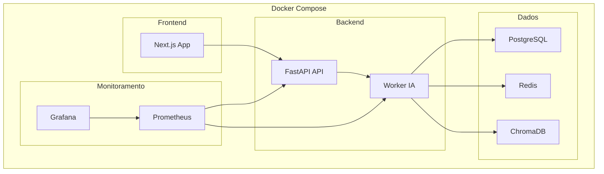

## 7. Deploy e Monitoramento: Em Produção

### 7.1 Introdução

Nos capítulos anteriores, construímos um assistente de IA completo: chat, persistência, API, RAG, fine-tuning, evals, autenticação e rate limiting. Tudo funciona no desenvolvimento. Mas a verdadeira prova é: **funciona em produção?**

Deploy e monitoramento são o que separa um protótipo de um sistema profissional [1]. Neste capítulo, você vai:

- Containerizar a aplicação com Docker
- Configurar deploy com Docker Compose
- Implementar monitoramento com Prometheus
- Criar dashboards com Grafana
- Configurar alertas para problemas

**Por que isso é essencial:**
- "Funciona na minha máquina" não é suficiente
- Sem monitoramento, você só descobre problemas quando os usuários reclamam
- Logs estruturados permitem debug eficiente
- Alertas automáticos evitam downtime

### 7.2 Explica

#### Containerização de IA

Docker permite empacotar sua aplicação com todas as dependências em um container portável [2]. Para sistemas de IA, isso é especialmente importante porque:

1. **Dependências complexas:** PyTorch, CUDA, bibliotecas de ML
2. **Reprodutibilidade:** Mesmo ambiente em qualquer lugar
3. **Isolamento:** Cada serviço em seu container
4. **Escalabilidade:** Fácil de escalar horizontalmente

**Arquitetura com Docker:**



#### Monitoramento com Prometheus

Prometheus é o padrão de monitoramento para sistemas distribuídos [3]. Ele coleta métricas em tempo real e permite consultas poderosas:

**Métricas essenciais para IA:**

| Métrica | O que mede | Por que importa |
|---------|------------|-----------------|
| `requests_total` | Total de requisições | Volume de uso |
| `request_duration_seconds` | Latência das requisições | Performance |
| `ia_tokens_total` | Tokens consumidos | Custo |
| `ia_errors_total` | Erros por tipo | Confiabilidade |
| `rag_documents_indexed` | Documentos indexados | Saúde do RAG |

**Formato de métricas Prometheus:**
```
# Contador (só incrementa)
ia_tokens_total{model="deepseek-v4-flash", type="input"} 12345

# Histograma (distribuição)
request_duration_seconds_bucket{le="0.1"} 100
request_duration_seconds_bucket{le="0.5"} 250
request_duration_seconds_bucket{le="1.0"} 300

# Gauge (sobe e desce)
rag_documents_indexed 1500
```

#### Grafana: Visualização de Métricas

Grafana cria dashboards interativos a partir de métricas do Prometheus [4]. Para um sistema de IA, o dashboard deve mostrar:

1. **Visão geral:** Request rate, error rate, latência (os "golden signals")
2. **Custo:** Tokens consumidos por modelo, custo estimado
3. **Qualidade:** Taxa de sucesso dos evals, alucinações detectadas
4. **Infraestrutura:** CPU, memória, GPU (se aplicável)

#### Logs Estruturados

Logs estruturados são logs em formato JSON que facilitam busca e análise [5]:

```python
# Ruim (log tradicional)
print(f"Requisição processada em {tempo}ms")

# Bom (log estruturado)
logger.info("requisicao_processada", extra={
    "user_id": user_id,
    "model": model,
    "tokens_input": 150,
    "tokens_output": 50,
    "latency_ms": 234,
    "status": "success",
})
```

**Por que logs estruturados?**
- Busca por campos específicos (findAll where user_id = X)
- Análise de padrões (top 10 users by token usage)
- Integração com ferramentas (ELK Stack, Datadog)
- Debug eficiente (filtrar por erro específico)

### 7.3 Ilustra

#### Dockerfile de Produção

```dockerfile
# Dockerfile
FROM python:3.11-slim as base

# Instalar dependências do sistema
RUN apt-get update && apt-get install -y \
    gcc \
    libpq-dev \
    && rm -rf /var/lib/apt/lists/*

# Criar diretório de trabalho
WORKDIR /app

# Copiar requirements primeiro (cache de camadas)
COPY requirements.txt .
RUN pip install --no-cache-dir -r requirements.txt

# Copiar código
COPY . .

# Criar usuário não-root
RUN useradd --create-home appuser
USER appuser

# Expor porta
EXPOSE 8000

# Health check
HEALTHCHECK --interval=30s --timeout=10s --start-period=5s --retries=3 \
    CMD python -c "import httpx; httpx.get('http://localhost:8000/health')"

# Comando de produção
CMD ["uvicorn", "api.main:app", "--host", "0.0.0.0", "--port", "8000", "--workers", "4"]
```

#### docker-compose.yml Completo

```yaml
# docker-compose.yml
version: '3.8'

services:
  # API Principal
  api:
    build: .
    ports:
      - "8000:8000"
    environment:
      - DATABASE_URL=postgresql://ia_user:ia_password@db:5432/ia_database
      - REDIS_URL=redis://redis:6379
      - DEEPSEEK_API_KEY=${DEEPSEEK_API_KEY}
      - LOG_LEVEL=INFO
      - ENVIRONMENT=production
    depends_on:
      db:
        condition: service_healthy
      redis:
        condition: service_healthy
    volumes:
      - ./logs:/app/logs
    restart: unless-stopped
    deploy:
      resources:
        limits:
          memory: 2G
          cpus: '2'

  # Banco de Dados
  db:
    image: postgres:15
    environment:
      POSTGRES_USER: ia_user
      POSTGRES_PASSWORD: ia_password
      POSTGRES_DB: ia_database
    ports:
      - "5432:5432"
    volumes:
      - postgres_data:/var/lib/postgresql/data
    healthcheck:
      test: ["CMD-SHELL", "pg_isready -U ia_user"]
      interval: 5s
      timeout: 5s
      retries: 5

  # Cache
  redis:
    image: redis:7-alpine
    ports:
      - "6379:6379"
    volumes:
      - redis_data:/data
    healthcheck:
      test: ["CMD", "redis-cli", "ping"]
      interval: 5s
      timeout: 5s
      retries: 5

  # Monitoramento
  prometheus:
    image: prom/prometheus:latest
    ports:
      - "9090:9090"
    volumes:
      - ./monitoring/prometheus.yml:/etc/prometheus/prometheus.yml
      - prometheus_data:/prometheus
    command:
      - '--config.file=/etc/prometheus/prometheus.yml'
      - '--storage.tsdb.path=/prometheus'

  grafana:
    image: grafana/grafana:latest
    ports:
      - "3001:3000"
    environment:
      - GF_SECURITY_ADMIN_PASSWORD=admin
    volumes:
      - grafana_data:/var/lib/grafana
      - ./monitoring/grafana/dashboards:/etc/grafana/provisioning/dashboards
      - ./monitoring/grafana/datasources:/etc/grafana/provisioning/datasources
    depends_on:
      - prometheus

volumes:
  postgres_data:
  redis_data:
  prometheus_data:
  grafana_data:
```

#### Configuração do Prometheus

```yaml
# monitoring/prometheus.yml
global:
  scrape_interval: 15s
  evaluation_interval: 15s

scrape_configs:
  - job_name: 'ia-api'
    static_configs:
      - targets: ['api:8000']
    metrics_path: '/metrics'
    
  - job_name: 'node-exporter'
    static_configs:
      - targets: ['node-exporter:9100']
```

#### Métricas Customizadas

```python
# monitoring/metrics.py
"""
Métricas customizadas para o sistema de IA.
"""
from prometheus_client import Counter, Histogram, Gauge
import time
from functools import wraps

# Métricas de requisição
REQUEST_COUNT = Counter(
    'ia_requests_total',
    'Total de requisições',
    ['method', 'endpoint', 'status']
)

REQUEST_DURATION = Histogram(
    'ia_request_duration_seconds',
    'Duração das requisições',
    ['method', 'endpoint'],
    buckets=[0.1, 0.25, 0.5, 1.0, 2.5, 5.0, 10.0]
)

# Métricas de IA
IA_TOKENS = Counter(
    'ia_tokens_total',
    'Tokens consumidos pela IA',
    ['model', 'type']  # type: input/output
)

IA_ERRORS = Counter(
    'ia_errors_total',
    'Erros da IA',
    ['model', 'error_type']
)

# Métricas de RAG
RAG_DOCUMENTS = Gauge(
    'rag_documents_indexed',
    'Número de documentos indexados'
)

RAG_SEARCH_DURATION = Histogram(
    'rag_search_duration_seconds',
    'Duração de buscas no RAG',
    buckets=[0.01, 0.05, 0.1, 0.25, 0.5, 1.0]
)

def medir_requisicao(func):
    """Decorator para medir duração de requisições."""
    @wraps(func)
    async def wrapper(*args, **kwargs):
        start_time = time.time()
        
        try:
            result = await func(*args, **kwargs)
            REQUEST_COUNT.labels(
                method=func.__name__,
                endpoint=func.__name__,
                status='success'
            ).inc()
            return result
            
        except Exception as e:
            REQUEST_COUNT.labels(
                method=func.__name__,
                endpoint=func.__name__,
                status='error'
            ).inc()
            raise
            
        finally:
            duration = time.time() - start_time
            REQUEST_DURATION.labels(
                method=func.__name__,
                endpoint=func.__name__
            ).observe(duration)
    
    return wrapper

def registrar_tokens(model: str, input_tokens: int, output_tokens: int):
    """Registra tokens consumidos."""
    IA_TOKENS.labels(model=model, type='input').inc(input_tokens)
    IA_TOKENS.labels(model=model, type='output').inc(output_tokens)
```

#### Endpoints de Métricas e Health

```python
# src/api/monitoring.py
"""
Endpoints de monitoramento.
"""
from fastapi import APIRouter
from prometheus_client import generate_latest, CONTENT_TYPE_LATEST
from starlette.responses import Response
import psutil
import os

router = APIRouter()

@router.get("/health")
def health_check():
    """Health check para o Docker."""
    return {"status": "healthy", "version": "1.0.0"}

@router.get("/ready")
def readiness_check():
    """Readiness check — verifica se o serviço está pronto."""
    # Verificar conexão com banco
    # Verificar conexão com Redis
    # Verificar API de IA
    return {"status": "ready"}

@router.get("/metrics")
def metrics():
    """Métricas no formato Prometheus."""
    return Response(
        content=generate_latest(),
        media_type=CONTENT_TYPE_LATEST
    )

@router.get("/status")
def status():
    """Status detalhado do sistema."""
    return {
        "version": "1.0.0",
        "environment": os.getenv("ENVIRONMENT", "development"),
        "system": {
            "cpu_percent": psutil.cpu_percent(),
            "memory_percent": psutil.virtual_memory().percent,
            "disk_percent": psutil.disk_usage('/').percent,
        },
    }
```

### 7.4 Técnica

#### Configuração de Alertas

```yaml
# monitoring/alerts.yml
groups:
  - name: ia-alerts
    rules:
      - alert: HighErrorRate
        expr: rate(ia_errors_total[5m]) > 0.1
        for: 2m
        labels:
          severity: critical
        annotations:
          summary: "Taxa de erros da IA alta"
          description: "Mais de 10% das requisições estão falhando"

      - alert: HighLatency
        expr: histogram_quantile(0.95, rate(ia_request_duration_seconds_bucket[5m])) > 2
        for: 5m
        labels:
          severity: warning
        annotations:
          summary: "Latência da IA alta"
          description: "95% das requisições estão demorando mais de 2s"

      - alert: HighTokenUsage
        expr: rate(ia_tokens_total[1h]) > 1000000
        for: 1h
        labels:
          severity: warning
        annotations:
          summary: "Uso de tokens alto"
          description: "Mais de 1M de tokens consumidos na última hora"

      - alert: ServiceDown
        expr: up{job="ia-api"} == 0
        for: 1m
        labels:
          severity: critical
        annotations:
          summary: "API de IA offline"
          description: "O serviço de IA não está respondendo"
```

#### Dashboard Grafana (JSON)

```json
{
  "dashboard": {
    "title": "Assistente de IA - Dashboard",
    "panels": [
      {
        "title": "Request Rate",
        "type": "graph",
        "targets": [{
          "expr": "rate(ia_requests_total[5m])",
          "legendFormat": "{{method}} {{endpoint}}"
        }]
      },
      {
        "title": "Latência P95",
        "type": "singlestat",
        "targets": [{
          "expr": "histogram_quantile(0.95, rate(ia_request_duration_seconds_bucket[5m]))"
        }]
      },
      {
        "title": "Erro Rate",
        "type": "graph",
        "targets": [{
          "expr": "rate(ia_errors_total[5m])",
          "legendFormat": "{{error_type}}"
        }]
      },
      {
        "title": "Tokens Consumidos",
        "type": "graph",
        "targets": [{
          "expr": "rate(ia_tokens_total[5m])",
          "legendFormat": "{{model}} {{type}}"
        }]
      }
    ]
  }
}
```

### 7.5 Aplica

#### Exercício Prático: Deploy Completo

1. **Build das imagens Docker:**
```bash
docker-compose build
```

2. **Subir todos os serviços:**
```bash
docker-compose up -d
```

3. **Verificar status:**
```bash
docker-compose ps
curl http://localhost:8000/health
```

4. **Acessar monitoramento:**
- Prometheus: http://localhost:9090
- Grafana: http://localhost:3001 (admin/admin)

5. **Testar métricas:**
```bash
curl http://localhost:8000/metrics
```

6. **Simular carga:**
```bash
# Usando hey (instalar: go install github.com/rakyll/hey@latest)
hey -n 100 -c 10 http://localhost:8000/api/conversas
```

### 7.6 Conclusão

Neste capítulo, seu assistente de IA está pronto para produção. O sistema agora tem:

- **Docker** com containers otimizados
- **Docker Compose** com todos os serviços
- **Prometheus** coletando métricas
- **Grafana** visualizando dashboards
- **Alertas** automáticos para problemas
- **Logs estruturados** para debug
- **Health checks** para orquestradores

No próximo capítulo, vamos evoluir para uma **arquitetura avançada** com cache, fallback de modelos e multi-tenancy.

### 7.7 Referências

[1] Docker. "Containerization Best Practices." Docker Documentation, 2024. Disponível em: https://docs.docker.com/

[2] Kubernetes. "Production-Grade Container Orchestration." Kubernetes Documentation, 2024. Disponível em: https://kubernetes.io/docs/

[3] Prometheus. "Monitoring Best Practices." Prometheus Documentation, 2024. Disponível em: https://prometheus.io/docs/

[4] Grafana. "Dashboard Design." Grafana Documentation, 2024. Disponível em: https://grafana.com/docs/

[5] Structured Logging. "Why Structured Logging Matters." O'Reilly, 2023.

[6] Microsoft. "GenAI Operations with MLOps." Azure Architecture Center, 2024. Disponível em: https://learn.microsoft.com/en-us/azure/architecture/ai-ml/

[7] AWS. "Machine Learning Lens — Well-Architected Framework." Amazon Web Services, 2024. Disponível em: https://docs.aws.amazon.com/wellarchitected/latest/machine-learning-lens/

[8] Google Cloud. "ML System Design Patterns." Google Cloud Architecture Center, 2023. Disponível em: https://cloud.google.com/architecture/ml-design-patterns

[9] Huyen, Chip. "Designing Machine Learning Systems." O'Reilly Media, 2022. ISBN: 978-1098107963.

[10] DeepSeek. "API Documentation." DeepSeek API Docs, 2024. Disponível em: https://api-docs.deepseek.com/

[11] FastAPI. "Production Deployment." FastAPI Documentation, 2024. Disponível em: https://fastapi.tiangolo.com/deployment/

[12] Uvicorn. "Uvicorn — ASGI Web Server." Uvicorn Documentation, 2024. Disponível em: https://www.uvicorn.org/

[13] PostgreSQL. "PostgreSQL 15 Documentation." PostgreSQL Global Development Group, 2024. Disponível em: https://www.postgresql.org/docs/

[14] Redis. "Redis Documentation." Redis Ltd., 2024. Disponível em: https://redis.io/docs/

[15] OWASP. "Top 10 for Large Language Model Applications." OWASP Foundation, 2024. Disponível em: https://owasp.org/www-project-top-10-for-large-language-model-applications/

[16] NIST. "Artificial Intelligence Risk Management Framework." National Institute of Standards and Technology, 2024. Disponível em: https://www.nist.gov/artificial-intelligence/risk-management-framework

[17] Microsoft Azure Architecture Center. "Get Started with AI Architecture Design." Microsoft Learn, 2024. Disponível em: https://learn.microsoft.com/en-us/azure/architecture/ai-ml/ai-get-started

[18] Pinecone. "What is RAG?" Pinecone Learning Center, 2024. Disponível em: https://www.pinecone.io/learn/retrieval-augmented-generation/

[19] LangChain. "RAG from Scratch." LangChain Documentation, 2024. Disponível em: https://python.langchain.com/docs/tutorials/rag/

[20] Hugging Face. "PEFT Library." Hugging Face Documentation, 2024. Disponível em: https://huggingface.co/docs/peft

#### Estratégias de Escalabilidade

Quando seu assistente cresce de 10 para 10.000 usuários, você precisa de escalabilidade [8]:

**Escalabilidade Horizontal (Scale Out):**
```yaml
# docker-compose.yml com réplicas
services:
  api:
    build: .
    deploy:
      replicas: 3
      resources:
        limits:
          memory: 1G
          cpus: '1'
```

**Escalabilidade Vertical (Scale Up):**
Aumentar recursos do servidor (mais RAM, CPU, GPU). Mais simples mas tem limite.

**Estratégias específicas para IA:**

| Estratégia | Quando usar | Custo |
|------------|-------------|-------|
| Cache de respostas | Perguntas repetidas | Baixo |
| Rate limiting por tenant | Multi-tenant | Baixo |
| Modelos menores para queries simples | Alta(volume | Médio |
| Batch processing | Processamento offline | Médio |
| CDN para assets estáticos | Frontend pesado | Baixo |
| Load balancer | Múltiplas réplicas | Médio |

**Auto-scaling com Kubernetes:**
```yaml
apiVersion: autoscaling/v2
kind: HorizontalPodAutoscaler
metadata:
  name: ia-api-hpa
spec:
  scaleTargetRef:
    apiVersion: apps/v1
    kind: Deployment
    name: ia-api
  minReplicas: 2
  maxReplicas: 10
  metrics:
  - type: Resource
    resource:
      name: cpu
      target:
        type: Utilization
        averageUtilization: 70
```

**Monitoramento de capacidade:**
- Alertar quando CPU > 70% por 5 minutos
- Escalar automaticamente quando fila > 100 requisições
- Desescalar quando carga cair por 10 minutos


#### Debugging em Produção

Quando algo dá errado em produção, você precisa de ferramentas rápidas para diagnosticar [10]:

**Estratégia de debugging:**

1. **Logs estruturados:** Busca por campos específicos
```bash
# Buscar erros de um usuário específico
grep '"user_id": "abc-123"' logs/audit_2024-01-15.jsonl

# Buscar requisições lentas
grep '"latency_ms": [0-9]\{4,\}' logs/audit_2024-01-15.jsonl

# Buscar erros de IA
grep '"error_type": "rate_limit"' logs/audit_2024-01-15.jsonl
```

2. **Distributed tracing:** Acompanhar uma requisição através de múltiplos serviços
```python
# tracing/opentelemetry.py
"""
Distributed tracing com OpenTelemetry.
"""
from opentelemetry import trace
from opentelemetry.sdk.trace import TracerProvider
from opentelemetry.sdk.trace.export import BatchSpanExporter
from opentelemetry.exporter.jaeger.thrift import JaegerExporter

# Configurar tracer
provider = TracerProvider()
jaeger_exporter = JaegerExporter(
    agent_host_name="localhost",
    agent_port=6831,
)
provider.add_span_processor(BatchSpanExporter(jaeger_exporter))
trace.set_tracer_provider(provider)

tracer = trace.get_tracer(__name__)

def processar_requisicao(pergunta: str):
    with tracer.start_as_current_span("processar_requisicao") as span:
        span.set_attribute("pergunta.tamanho", len(pergunta))
        
        # Fase 1: Segurança
        with tracer.start_as_current_span("verificar_seguranca"):
            # ... verificação ...
            pass
        
        # Fase 2: RAG
        with tracer.start_as_current_span("buscar_rag"):
            # ... busca ...
            pass
        
        # Fase 3: Geração
        with tracer.start_as_current_span("gerar_resposta"):
            # ... geração ...
            pass
```

3. **Métricas customizadas para debugging:**
```python
# Métricas que ajudam a debugar
REQUEST_BY_TENANT = Counter(
    'ia_requests_by_tenant',
    'Requisições por tenant',
    ['tenant_id', 'status']
)

MODEL_ERRORS = Counter(
    'ia_model_errors',
    'Erros por modelo',
    ['model', 'error_type']
)

RAG_CACHE_HITS = Counter(
    'ia_rag_cache_hits',
    'Cache hits do RAG',
    ['hit_type']  # 'semantic', 'exact', 'miss'
)
```

4. **Runbook de incidentes:**
```markdown
# Runbook: API de IA Lenta

## Sintomas
- Latência P95 > 5s
- Usuários reclamando de demora

## Diagnóstico
1. Verificar Grafana: request rate, error rate
2. Verificar Prometheus: `rate(ia_request_duration_seconds_bucket[5m])`
3. Verificar logs: `grep "latency_ms" logs/*.jsonl | sort -t: -k2 -n -r | head`

## Causas Comuns
- API de IA com rate limit
- Banco de dados sobrecarregado
- Cache cheio
- Modelo trocado

## Ação
1. Se rate limit: aumentar limite ou usar fallback
2. Se DB: escalar horizontalmente
3. Se cache: limpar cache expirado
4. Se modelo: reverter para versão anterior

## Prevenção
- Alertas de latência configurados
- Cache com TTL adequado
- Fallback automático de modelos
```

**Ferramentas recomendadas:**
- **Jaeger/Zipkin:** Distributed tracing
- **Sentry:** Error tracking
- **Datadog/Grafana Cloud:** APM completo
- **PagerDuty:** Alertas e escalonamento

