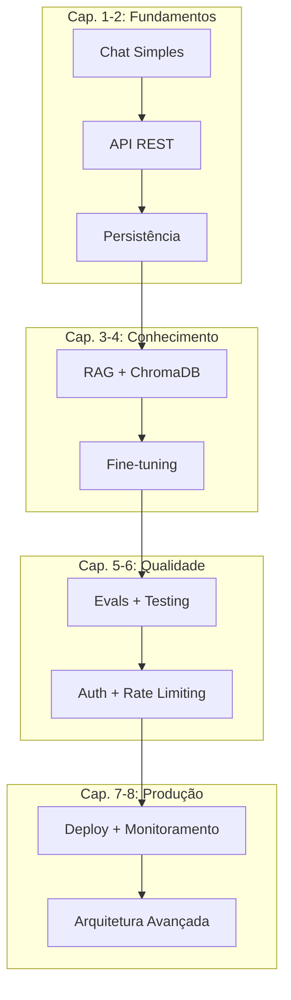
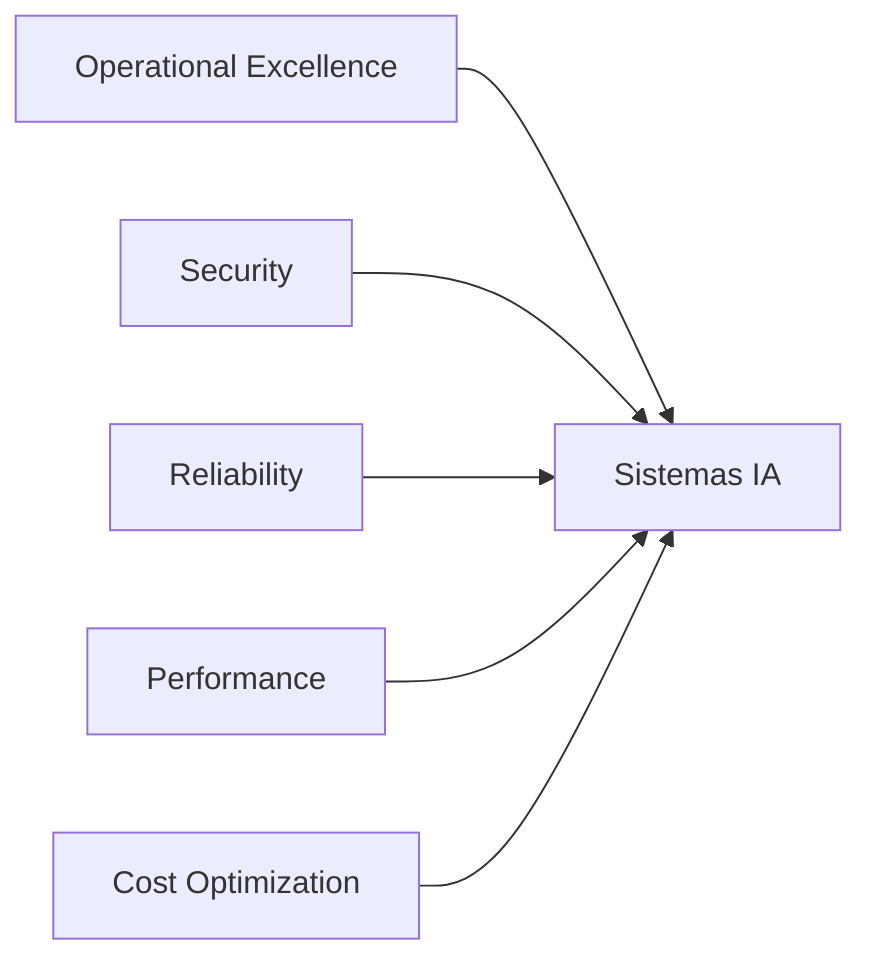

# Dossiê: Arquitetura de IA — Do Zero ao PhD

## Tema Central
Livro técnico sobre arquitetura de Inteligência Artificial que ensina conceitos teóricos e práticos através da construção progressiva de um projeto real — um Assistente de IA Completo que evolui a cada capítulo.

## Público-alvo
Iniciantes em IA que querem entender não apenas como usar modelos, mas como **projetar, construir e operar** sistemas de IA em produção.

## Projeto Progressivo: "Assistente de IA Completo"

### Conceito
O leitor constrói um assistente de IA conversacional que evolui progressivamente:
- **Cap. 1:** Estrutura básica + chat simples (Hello World de IA)
- **Cap. 2:** API REST + persistência de conversas
- **Cap. 3:** RAG com ChromaDB + documentos
- **Cap. 4:** Fine-tuning de modelo
- **Cap. 5:** Sistema de evals + testing
- **Cap. 6:** Autenticação + rate limiting
- **Cap. 7:** Deploy + monitoramento
- **Cap. 8:** Arquitetura avançada + produção

### Stack Tecnológica
- Python 3.11+ / FastAPI
- PostgreSQL + Redis
- ChromaDB (vetor)
- OpenAI API / LangChain
- Docker + docker-compose
- Prometheus + Grafana

## Fontes Acadêmicas (A/B)

### Arquitetura de Sistemas IA
1. **(A)** Microsoft Azure Architecture Center — AI Architecture Design Patterns (2024)
   - Referência: https://learn.microsoft.com/en-us/azure/architecture/ai-ml/
   - Conteúdo: Padrões de arquitetura para sistemas IA em produção, incluindo RAG, agentes, gateways de modelo

2. **(A)** AWS Well-Architected Framework — Machine Learning Lens (2024)
   - Referência: https://docs.aws.amazon.com/wellarchitected/latest/machine-learning-lens/
   - Conteúdo: Pilares de arquitetura ML: operacional excellence, security, reliability, performance efficiency, cost optimization

3. **(A)** Google Cloud — ML System Design Patterns (2023)
   - Referência: https://cloud.google.com/architecture/ml-design-patterns
   - Conteúdo: Padrões de design para sistemas ML: data patterns, model patterns, serving patterns

4. **(B)** Designing Machine Learning Systems (Chip Huyen, O'Reilly 2022)
   - Referência: ISBN 978-1098107963
   - Conteúdo: Arquitetura de sistemas ML end-to-end, desde dados até deploy

### RAG (Retrieval-Augmented Generation)
5. **(A)** Microsoft — Design a RAG Solution (2024)
   - Referência: https://learn.microsoft.com/en-us/azure/architecture/ai-ml/guide/rag/
   - Conteúdo: Fases de implementação RAG: preparação, chunking, embedding, retrieval, geração

6. **(B)** LangChain Documentation — RAG from Scratch (2024)
   - Referência: https://python.langchain.com/docs/tutorials/rag/
   - Conteúdo: Implementação prática de RAG com LangChain e ChromaDB

7. **(A)** Pinecone — What is RAG? (2024)
   - Referência: https://www.pinecone.io/learn/retrieval-augmented-generation/
   - Conteúdo: Conceitos fundamentais de RAG, arquitetura, melhores práticas

8. **(B)** LlamaIndex Documentation — Building RAG Applications (2024)
   - Referência: https://docs.llamaindex.ai/
   - Conteúdo: Framework para construção de aplicações RAG

### Fine-Tuning e Personalização
9. **(A)** OpenAI — Fine-tuning Guide (2024)
   - Referência: https://platform.openai.com/docs/guides/fine-tuning
   - Conteúdo: Processo de fine-tuning de modelos GPT, preparation, training, evaluation

10. **(B)** Hugging Face — PEFT Library (2024)
    - Referência: https://huggingface.co/docs/peft
    - Conteúdo: Parameter-Efficient Fine-Tuning (LoRA, QLoRA, adapters)

11. **(A)** DeepLearning.AI — Finetuning Large Language Models (2024)
    - Referência: https://www.deeplearning.ai/short-courses/finetuning-large-language-models/
    - Conteúdo: Curso prático de fine-tuning com foco em produção

### Avaliação e Qualidade
12. **(A)** DeepEval Documentation — LLM Evaluation Framework (2024)
    - Referência: https://docs.confident-ai.com/
    - Conteúdo: Framework para avaliação de sistemas LLM com métricas customizáveis

13. **(B)** RAGAS — RAG Evaluation Framework (2024)
    - Referência: https://docs.ragas.io/
    - Conteúdo: Métricas específicas para avaliação de RAG: faithfulness, relevancy, context recall

14. **(A)** Microsoft — GenAI Operations with MLOps (2024)
    - Referência: https://learn.microsoft.com/en-us/azure/architecture/ai-ml/
    - Conteúdo: Extensão de MLOps para sistemas GenAI em produção

### Deploy e Operações
15. **(A)** Docker Documentation — Containerization Best Practices (2024)
    - Referência: https://docs.docker.com/
    - Conteúdo: Boas práticas de containerização para aplicações IA

16. **(B)** FastAPI Documentation — Production Deployment (2024)
    - Referência: https://fastapi.tiangolo.com/deployment/
    - Conteúdo: Deploy de APIs FastAPI em produção com uvicorn, gunicorn, Docker

17. **(A)** Prometheus Documentation — Monitoring Best Practices (2024)
    - Referência: https://prometheus.io/docs/
    - Conteúdo: Monitoramento de sistemas IA com métricas customizadas

18. **(B)** Grafana Documentation — Dashboard Design (2024)
    - Referência: https://grafana.com/docs/
    - Conteúdo: Visualização de métricas de IA com dashboards operacionais

### Segurança e Ética
19. **(A)** OWASP — Top 10 for LLM Applications (2024)
    - Referência: https://owasp.org/www-project-top-10-for-large-language-model-applications/
    - Conteúdo: Vulnerabilidades comuns em aplicações LLM e como mitigá-las

20. **(B)** NIST — AI Risk Management Framework (2024)
    - Referência: https://www.nist.gov/artificial-intelligence/risk-management-framework
    - Conteúdo: Framework para gestão de riscos em sistemas IA

## Diagramas Conceituais

### Arquitetura do Projeto Progressivo

### Pilares de Arquitetura IA

## Lacunas de Conhecimento Identificadas
1. **Padrões de Arquitetura IA específicos para iniciantes** — a maioria dos recursos assume conhecimento prévio
2. **Projeto progressivo integrado** — poucos livros ensinam através de um projeto único que evolui
3. **Foco em produção** — a maioria foca em treinamento, não em deploy e operações
4. **Segurança de LLMs** — tema emergente com poucos recursos consolidados
